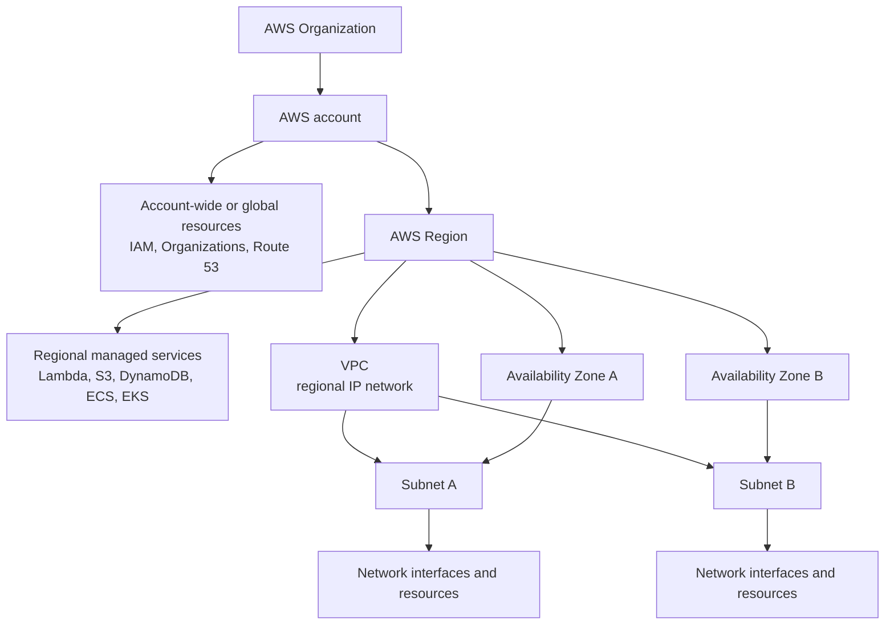
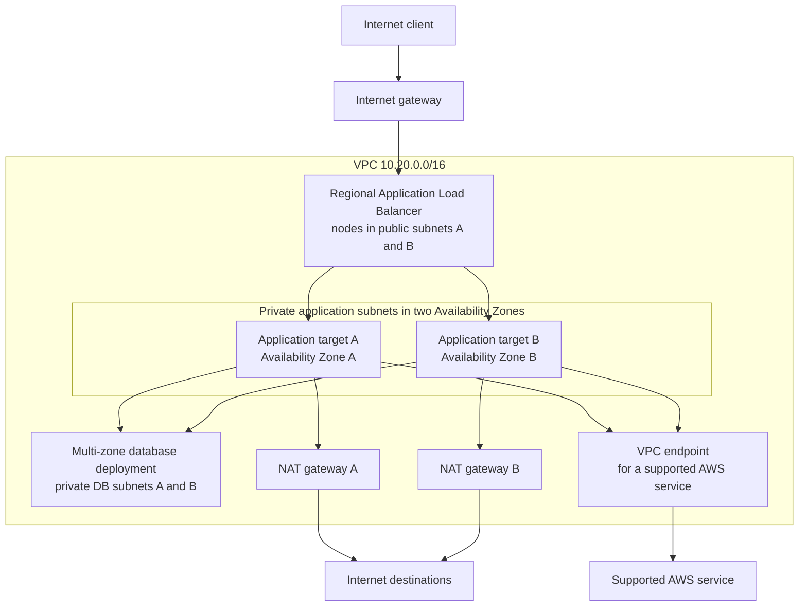
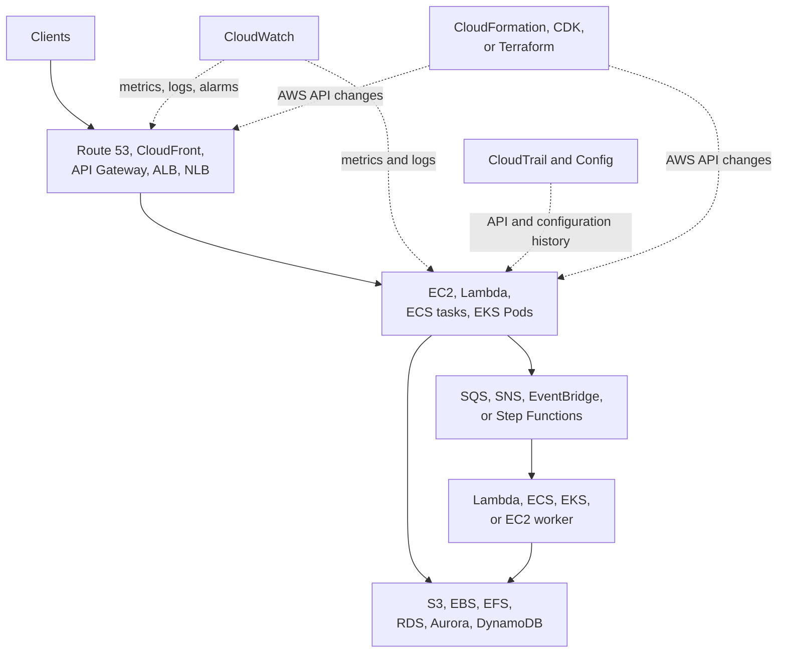
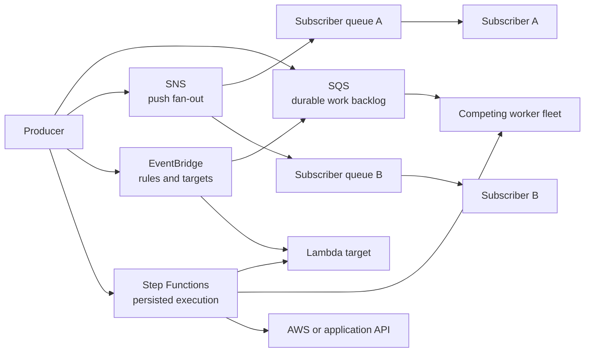

## Working model

A cloud system is a set of provider resources joined by network paths, identities, and state transitions. Start with the account, Region, network, and service API that own each resource; a product name alone does not tell you where it runs, who may call it, or what survives failure.

## Read AWS as a resource hierarchy

AWS is a provider platform reached through service APIs. The browser console, AWS Command Line Interface (CLI), software development kits (SDKs), CloudFormation, the Cloud Development Kit (CDK), and Terraform all call those APIs. They differ in workflow and state ownership, but none bypasses the service control plane.

An AWS Organization groups accounts. An account owns resources, identities, quotas, billing records, and audit history. Most application resources then have a Regional or zonal placement. The hierarchy is not a filesystem: a Virtual Private Cloud (VPC) does not contain IAM, and many managed services expose Regional endpoints without placing the service itself inside your VPC.



An Amazon Resource Name (ARN) identifies a resource for APIs and policy. For example, `arn:aws:lambda:us-east-2:<account-id>:function:orders` names a Lambda function by partition, service, Region, account, and service-specific resource path. The angle-bracketed account ID is a placeholder, not a valid literal ARN. ARN formats vary by service, and not every resource includes every component. Treat an ARN as an exact identifier, not a display name.

| Scope                      | Examples                                                         | Consequence                                                                                     |
| -------------------------- | ---------------------------------------------------------------- | ----------------------------------------------------------------------------------------------- |
| Organization or account    | Organization policy, IAM role, account quotas, billing, audit    | A credential or policy mistake can affect every allowed Region in that account                  |
| Region                     | VPC, Lambda function, ECS cluster, EKS cluster, DynamoDB table   | Another Region needs separately created or replicated resources                                 |
| Availability Zone          | Subnet, EC2 instance, EBS volume                                 | Losing that zone removes the zonal resource unless another copy or replacement exists elsewhere |
| Edge or global entry layer | Route 53 records, CloudFront distribution, AWS global API layers | Global naming or routing still depends on healthy Regional origins and current configuration    |

An AWS account is an ownership boundary for resources, identity policy, quotas, billing, and audit records. AWS Organizations groups accounts and can apply service control policies (SCPs). An SCP limits the permissions available to member accounts; it does not grant a permission by itself. Production, development, security, and shared-network accounts are often separated because one credential or configuration error should not reach everything.

A Region is a geographic AWS deployment area. Availability Zones inside it have separate facilities and failure risks, yet use low-latency Regional links. AWS does not automatically copy an ordinary Regional resource to another Region. Some services offer explicit cross-Region replication or global control layers, each with its own lag, failover, and authorization contract.

A cell adds an application boundary on top of cloud boundaries. Cells can limit customer impact, deployment risk, and database contention, but they also create routing and data-placement work. Multi-zone and multi-cell solve different problems.

> **Fictional case.** The bookshop used throughout these notes places customers into one of two workload cells. Each cell has its own compute, deployment cohort, and database partition. The names and values belong only to this worked example.

## A VPC is a Regional network, and a subnet is zonal

A VPC owns one or more Classless Inter-Domain Routing (CIDR) blocks. A block such as `10.20.0.0/16` supplies an address range that can be divided into smaller subnet ranges. Each subnet belongs to the VPC and exactly one Availability Zone. Resources such as EC2 instances, load balancer nodes, relational databases, and VPC-attached Lambda functions use Elastic Network Interfaces (ENIs) with addresses from selected subnets.

Each subnet uses a route table. A route matches a destination prefix and names a next-hop target; the most specific matching prefix wins. A subnet with a route to an internet gateway is called public, but an IPv4 workload also needs a public address before the internet can initiate a connection to it. A private subnet lacks that direct route. It can still make outbound IPv4 connections through a NAT gateway without becoming a direct inbound target.

Public and private are routing descriptions, not immutable subnet types. A name such as `private-app-a` documents intent but does not enforce it. Read the route table, addresses, gateway, security groups, and network access control lists (ACLs) that create the real path.



The diagram shows a common shape, not a required template. A database subnet group selects subnets; it does not make an application multi-zone by itself. A load balancer needs healthy targets and enough subnet addresses. A NAT gateway provides a route, not IAM permission. Every arrow still needs DNS, routing, network policy, identity, timeout, and capacity decisions.

Many managed services are reached through service endpoints rather than by placing the service in your VPC. S3 and DynamoDB are common examples. A gateway or interface VPC endpoint can give selected traffic a private VPC route, but the caller still needs IAM permission and the service may also evaluate resource and endpoint policies.

Lambda uses provider-managed networking by default. When a function needs private VPC resources, its VPC configuration names subnets and security groups; Lambda then manages Hyperplane ENIs that connect its execution environments to those networks. That attachment changes reachability, not the function execution role's AWS API permissions.

## Sort AWS services by the contract they own

AWS has hundreds of named products. An introductory map needs service families and boundaries, not a catalog.

| Need                              | Common services                                | First question                                                                                    |
| --------------------------------- | ---------------------------------------------- | ------------------------------------------------------------------------------------------------- |
| Run a virtual machine             | EC2                                            | Which image, instance type, subnet, storage, identity, and replacement owner?                     |
| Maintain a VM fleet               | EC2 Auto Scaling                               | What sets minimum, desired, and maximum capacity, and what health causes replacement?             |
| Run bounded functions             | Lambda                                         | What invokes the function, what is its concurrency budget, and where is durable state?            |
| Orchestrate containers            | ECS or EKS                                     | Which API declares desired workloads and owns replacement and rollout?                            |
| Supply managed container hosts    | Fargate, ECS Managed Instances, EKS Auto Mode  | Which host controls does the managed boundary remove or restrict?                                 |
| Accept and route traffic          | Route 53, CloudFront, API Gateway, ALB, NLB    | Which protocol decision happens at each hop, and where does TLS terminate?                        |
| Store application state           | S3, EBS, EFS, RDS, Aurora, DynamoDB            | Does the application need objects, blocks, files, relational records, or keyed items?             |
| Buffer or route asynchronous work | SQS, SNS, EventBridge, MSK                     | Does one worker claim work, every subscriber receive it, or a rule route it?                      |
| Persist a multi-step workflow     | Step Functions                                 | Which state, timer, retry, and external-effect boundary must survive a worker?                    |
| Control identities and secrets    | IAM, STS, KMS, Secrets Manager                 | Which principal may perform which action on which resource under which condition?                 |
| Observe and audit                 | CloudWatch, CloudTrail, AWS Config, AWS Health | Is the question about runtime behavior, API activity, resource configuration, or provider events? |
| Provision and change resources    | CloudFormation, CDK, Terraform                 | Which versioned desired state owns the next update or deletion?                                   |

The compute choices separate the program, the orchestrator or scaling control plane, and the host supply:

| Service                          | Contract                                                                                                                                                   | What it does not decide for you                                                                                 |
| -------------------------------- | ---------------------------------------------------------------------------------------------------------------------------------------------------------- | --------------------------------------------------------------------------------------------------------------- |
| EC2 (Elastic Compute Cloud)      | A virtual machine chosen from an Amazon Machine Image (AMI) and instance type                                                                              | Application rollout, process supervision, and multi-zone placement                                              |
| EC2 Auto Scaling group           | Maintains a minimum, desired, and maximum EC2 fleet from a launch template; replaces instances that fail its health policy                                 | Container scheduling or application-level recovery                                                              |
| Lambda                           | Runs a function in managed execution environments in response to invocations or events; concurrency drives scaling                                         | Long-lived host administration or a general container scheduler                                                 |
| ECS (Elastic Container Service)  | AWS-native container orchestration. A task definition is the versioned blueprint, a task is one running copy, and a service maintains a desired task count | The underlying compute choice; tasks can use Fargate, managed instances, or EC2 capacity                        |
| EKS (Elastic Kubernetes Service) | A managed Kubernetes control plane that exposes the Kubernetes API                                                                                         | Most workload, policy, data-plane, and application decisions; [CI6](06-eks-and-ecs.md) draws the exact boundary |
| Fargate                          | Managed compute for supported ECS tasks or EKS Pods                                                                                                        | Orchestration. ECS or EKS still decides what should run                                                         |

Elastic Load Balancing (ELB) is another family rather than one interchangeable product. An Application Load Balancer (ALB) terminates and routes HTTP or HTTPS using layer-7 rules. A Network Load Balancer (NLB) handles high-throughput TCP, UDP, or TLS flows at layer 4. A Gateway Load Balancer (GWLB) inserts network appliances such as firewalls; it is not the ordinary front door for an HTTP application. Classic Load Balancers remain for old deployments, but new designs normally start with ALB or NLB.

Storage has a similar split. Amazon Simple Storage Service (S3) is an object API, not a mounted disk. Elastic Block Store (EBS) supplies a block device in one Availability Zone. Relational Database Service (RDS) operates a relational database engine. Elastic File System (EFS) supplies a shared network filesystem when POSIX-style path, open, read, write, rename, permission, and concurrent-mount behavior is part of the requirement. Start with the access contract rather than asking which service is most managed.

A block device exposes numbered byte ranges for reads and writes; a filesystem or database supplies higher-level names, records, and recovery rules above it. [LL4: Linux storage and I/O](../02-low-level-infrastructure/04-storage-and-io.md) follows that stack when the host-side mechanism matters.

_The orchestrator and compute layer are separate choices._



## Separate control-plane changes from application data paths

A control-plane API creates or configures resources. A data-plane request uses the resulting service. `CreateFunction` changes Lambda configuration; `Invoke` runs a function. An EC2 launch creates a virtual machine; HTTP or SSH traffic later reaches its network interface. Creating an S3 bucket and reading an object use different actions, limits, and audit settings.

This distinction changes incident diagnosis. A successful infrastructure deployment proves that the service accepted configuration, not that a request can reach the resource or that the application result is correct. Conversely, a healthy request path does not prove that the next control-plane update will pass policy, quota, or rollout checks.

Resource changes also need one declared owner. The console is useful for inspection, but an unrecorded console edit can drift away from CloudFormation or Terraform state. [CI9: Infrastructure as code and GitOps](09-infrastructure-as-code-and-gitops.md) follows planning, state, approval, apply, reconciliation, and rollback.

## Follow one service request after drawing the AWS map

A production web service is still application code running in processes. Infrastructure supplies the machines, network path, identity, durable state, and replacement machinery around those processes. Cloud services package some of that work behind provider APIs, but every package still has an input, output, owner, and failure boundary.

Take `https://api.example.com/orders/123` as the starting point:

1. A Domain Name System (DNS) resolver turns `api.example.com` into one or more Internet Protocol (IP) addresses. DNS answers where to try; it does not carry the application request.
2. The client chooses an address and reaches it through IP routing. An IP address names a network interface, while a port identifies the receiving transport endpoint on that address. Hypertext Transfer Protocol Secure (HTTPS) normally uses port 443.
3. Hypertext Transfer Protocol (HTTP) versions 1.1 and 2 ordinarily use a Transmission Control Protocol (TCP) connection. TCP supplies an ordered byte stream and retransmits lost data. HTTP/3 instead runs over QUIC and the User Datagram Protocol (UDP), so “HTTPS always means TCP” is no longer correct.
4. Transport Layer Security (TLS) authenticates the server name and negotiates protected communication. The client can then send an HTTP request containing a method, target, headers, and optional body.
5. A reverse proxy or load balancer may terminate that connection, choose a healthy application target, and open or reuse a separate upstream connection. Success on the client connection does not prove the upstream request worked.

A name can fail to resolve, packets can lack a route, transport setup can time out, certificate validation can fail, a load balancer can have no healthy target, or the application can return an error. “The site is down” does not identify which boundary failed.

```text
URL
  -> DNS name to IP address
  -> IP route to address and port
  -> TCP + TLS, or QUIC with TLS
  -> HTTP request
  -> edge or load balancer
  -> application process
  -> database, object, or another service
```

## Queue, topic, event bus, and workflow mean different things

Synchronous HTTP keeps a caller waiting. Asynchronous services let producers and consumers run at different times, but the chosen mechanism still needs an acknowledgement, retry, ordering, retention, and poison-work policy.

| Mechanism               | Delivery shape                                                                  | Common use                                                                               |
| ----------------------- | ------------------------------------------------------------------------------- | ---------------------------------------------------------------------------------------- |
| SQS Standard queue      | Consumers poll; one consumer receives a delivery at a time; delivery can repeat | Buffer jobs and let a worker fleet scale independently                                   |
| SQS FIFO queue          | Ordered message groups plus queue-side deduplication rules                      | Preserve scoped order when throughput and integration limits fit                         |
| SNS topic               | Push one publication to several independent subscriptions                       | Fan out notifications, often to one SQS queue per durable subscriber                     |
| EventBridge event bus   | Match event fields against rules and route matching events to targets           | Connect AWS, software-as-a-service, and application events without one hard-coded target |
| Kafka or Amazon MSK     | Retain partitioned records for independent consumer-group replay                | Keep an ordered history that several consumers read at their own positions               |
| Step Functions workflow | Persist state-machine progress, choices, waits, retries, and task results       | Coordinate a multi-step operation that must outlive one process                          |

SQS is a work backlog, SNS is push fan-out, EventBridge is a rule-based router, and Step Functions records workflow progress. They can be combined: an EventBridge rule can put an event on SQS, Lambda or an ECS worker can consume it, and Step Functions can invoke those services as tasks. Combining them does not create exactly-once business effects. Each consumer still needs a stable operation identity and either an idempotent effect or a reconciliation path.



[CI7: Kafka](07-kafka-replicated-event-log.md) compares the asynchronous shapes before following a retained record. [CI8: Celery](08-celery-task-processing.md) covers named tasks over a broker, and [CI11: Shared production services](11-shared-production-services.md) returns to queues and durable workflows as platform contracts.

## Know which operations service answers the question

AWS operating services record different evidence:

| Service                   | Primary evidence                                                                    | It does not prove                                                                 |
| ------------------------- | ----------------------------------------------------------------------------------- | --------------------------------------------------------------------------------- |
| CloudWatch                | Metrics, logs, alarms, dashboards, synthetic checks, and selected traces            | Which principal changed an IAM policy unless that activity is recorded elsewhere  |
| CloudTrail                | Selected management, data, and network activity with caller and request fields      | Application correctness, complete packet flow, or every data operation by default |
| AWS Config                | Recorded resource configuration, relationships, change history, and rule compliance | Runtime latency, successful application requests, or the intent behind a change   |
| AWS Health                | Provider events and planned lifecycle changes relevant to an account                | Application-specific impact or whether a workload failed over successfully        |
| Service Quotas            | Account-, Region-, or resource-scoped ceilings and adjustable quota values          | Capacity in a particular Availability Zone or headroom in a downstream database   |
| Cost Explorer and Budgets | Metered cost history, forecasts, and budget notifications                           | Performance efficiency, resource necessity, or safe deletion                      |

Keep timestamps, Region, account, resource ARN, application version, and request identity together. One CloudWatch alarm can point to an overloaded target while CloudTrail identifies a scaling-policy edit and Config shows the before-and-after resource configuration. None should be treated as a substitute for the others.

## Worked case: ALB to Auto Scaling to EC2

Suppose the orders API is a long-running process that listens on port `8080`. The initial production shape has four EC2 instances across two Availability Zones. Its Auto Scaling group has minimum `4`, desired `4`, and maximum `12` instances. An internet-facing ALB accepts HTTPS on port `443`, and its target group checks `GET /ready` on each instance.

These are several resources with separate jobs. The launch template describes how to create an instance. The Auto Scaling group decides how many instances should exist and in which subnets. The target group records which instances can receive traffic. The ALB listener accepts client connections and selects a healthy target.

An Amazon Machine Image (AMI) supplies the bootable operating-system and filesystem image. A launch template versions the instance type, image, network, storage, and identity settings used for new EC2 instances. A security group is a stateful network filter attached to an AWS network interface. An instance profile attaches an IAM role to EC2 so software can obtain temporary role credentials without storing long-lived access keys in the image.

### Deploy the fleet

1. Build the application and its fixed dependencies into an AMI. Create launch-template version `18` that selects that AMI, the instance type, the instance security group, and an IAM instance profile. Do not bake long-lived AWS credentials into the image.
2. Configure the Auto Scaling group to span private subnets in both zones and attach its target group. The group launches four instances from the template and registers them with the target group.
3. Allow client HTTPS to the ALB security group. Allow port `8080` on the instance security group only from the ALB security group. Network permission does not grant the instance role permission to call S3, KMS, or RDS APIs.
4. Wait for each new instance to boot the process and pass the target-group health check. `InService` in the Auto Scaling group and `healthy` in the target group answer different questions; record both.
5. For release `19`, build another AMI and launch-template version. Start an instance refresh with explicit healthy-capacity settings, checkpoints, and bake time. Merely changing the template used for future launches does not replace every existing instance. A refresh rolls the new configuration through the current fleet. When its prerequisites are met, instance refresh can automatically roll back after replacement errors or selected CloudWatch alarms, which evaluate AWS metrics against declared thresholds.

### Trace one request

```text
client
  → DNS answer for api.example.com
  → ALB listener :443 and TLS certificate
  → listener rule
  → target group
  → one healthy EC2 instance :8080
  → orders process
  → database or another dependency
  → response through the ALB
```

The ALB health check controls routing. If one instance starts returning the wrong status on `/ready` while other healthy targets remain, the target becomes unhealthy and stops receiving ordinary requests. If every target is unhealthy, ALB fail-open behavior can route to all of them, so “removed from rotation” is not an absolute availability boundary. Target failure alone does not guarantee instance replacement. Configure the Auto Scaling group to use Elastic Load Balancing health checks when target failure should also make the group replace the instance. Otherwise, the group can still consider an EC2-running instance healthy while the ALB refuses to route to it.

A target-tracking policy can adjust desired capacity from a metric such as ALB request count per target or average CPU. It cannot create ready capacity immediately. Instance launch, process startup, health checks, and scaling cooldown or warmup all add delay: cooldown suppresses selected new scaling actions for an interval, while instance warmup excludes new capacity from parts of the scaling calculation until it can contribute. The maximum of `12` is a hard policy ceiling until someone changes it, and subnet addresses, EC2 quotas, zonal instance capacity, database connections, and downstream throughput can stop useful scaling before that number.

Treat each instance as replaceable. Store orders in a durable database, objects in S3, and shared session or coordination state outside local process memory. An attached disk can persist bytes according to its own lifecycle policy, but one instance-local disk is not a multi-zone state design. During scale-in or refresh, target deregistration stops new connections and its configured delay gives existing connections a bounded drain interval; clients still need bounded timeouts and safe retries.

### Read failure evidence by owner

| Question                              | Evidence                                                                                                                                |
| ------------------------------------- | --------------------------------------------------------------------------------------------------------------------------------------- |
| Did the request reach the front door? | DNS result, ALB access record, listener rule, ALB status counts, and request correlation ID                                             |
| Was a target eligible?                | Target registration state, `describe-target-health` state and reason, health-check path, security groups, and application readiness log |
| Did the group maintain capacity?      | Scaling activities plus desired, pending, in-service, and terminating group metrics; failed launch reason; instance-refresh status      |
| Did the host or process fail?         | EC2 system and instance status checks, boot output, process supervisor state, resource metrics, and application logs                    |
| Did durable state fail?               | Database connection and query evidence, storage or KMS request ID, dependency latency, and recovery status                              |

An ALB `5xx` count, an unhealthy target, and a failed instance launch are not interchangeable signals. Keep the timestamp, Availability Zone, instance ID, target-health reason, launch-template version, and application version together so that replacement does not erase the explanation.

## Worked case: API Gateway to Lambda

Now implement `POST /orders` as a bounded function. An API Gateway HTTP API owns the public route. Its Lambda proxy integration invokes the `live` alias of an orders function. The function validates one request, writes the order to durable storage, and returns an HTTP-shaped result.

### Deploy the function

1. Package the handler and dependencies, update the function code and configuration, then publish immutable version `42`. The unpublished `$LATEST` version remains mutable; a published version gives the release a stable address.
2. Point alias `live` at version `42`, and configure the API Gateway integration to invoke the alias. The function's resource-based policy must permit API Gateway to invoke it. The function's execution role separately controls what the handler may call.
3. For version `43`, run direct invocation and integration tests, publish the version, then shift a small weight on `live` to it. Weighted alias routing can expose a bounded share before moving the alias completely, but the sample is probabilistic; a tiny request count is weak evidence.
4. Gate the shift on API errors and latency, Lambda errors, throttles, duration, concurrency, logs, traces, and the order write. Retain version `42` and its compatible configuration until the recovery window closes.

### Trace one synchronous request

```text
client
  → API Gateway DNS, TLS, stage, and POST /orders route
  → authentication, authorization, and throttling policy
  → Lambda proxy event
  → live alias → published function version
  → execution environment → handler
  → durable database or object API
  → proxy response → API Gateway → client
```

With a proxy integration, API Gateway passes request data such as the method, path, headers, query values, body, and request context in an event. The handler must validate that input and return the integration's expected response shape. API Gateway accepting a client connection does not mean Lambda ran, and a successful Lambda invocation does not mean the order write was correct.

Lambda adds execution environments as concurrent invocations increase, subject to the function's scaling rate, reserved or provisioned concurrency, regional concurrency, and request-rate quotas. For a synchronous handler with an average duration of `0.4` seconds at `120` requests per second, the first capacity estimate is `120 × 0.4 = 48` concurrent executions. Bursts, tail latency, retries, cold starts, and slow dependencies raise the observed value. Reserved concurrency can protect the function from neighbors and cap its downstream pressure; once no permitted concurrency is available, Lambda throttles new invocations.

Do not use a reused execution environment as the system of record. Runtime objects, connections, and temporary files may survive for a later invocation and can be useful caches, but the platform may replace the environment. Put orders, idempotency records, sessions, and durable workflow state in an external store. A retry of `POST /orders` can otherwise create two orders after the first write succeeds but its response is lost.

Lambda also imposes a different execution envelope from an EC2 process. A standard invocation runs for at most 15 minutes, and memory, deployment-package, payload, temporary-storage, concurrency, and request-rate quotas apply. Check the current quota page and the account's actual quota before design review. Provisioned concurrency can reduce environment-initialization delay, but it does not remove application latency, dependency limits, or the need for overload policy.

### Separate gateway, invocation, and application evidence

| Question                                       | Evidence                                                                                                                        |
| ---------------------------------------------- | ------------------------------------------------------------------------------------------------------------------------------- |
| Did API Gateway match and forward the request? | Access log with request ID, route and stage, status, `Count`, `4xx`, `5xx`, `Latency`, and `IntegrationLatency`                 |
| Did Lambda accept and run it?                  | `Invocations`, `Errors`, `Throttles`, `Duration`, `ConcurrentExecutions`, function version, alias weight, and Lambda request ID |
| Did initialization or code fail?               | Structured function log, initialization duration where available, exception, trace, timeout, and memory evidence                |
| Did the state change once?                     | Idempotency key, database transaction or object request ID, resulting record, and audit event                                   |

API Gateway can reject a request before invocation because no route, authorization, throttle budget, integration permission, or valid integration exists. Lambda can reject it for concurrency or request-rate limits. The handler can then time out, raise an error, or return a malformed proxy response. Preserve both gateway and Lambda request identifiers so a generic client `5xx` does not hide the boundary.

## Choose the compute contract explicitly

Both designs can serve an HTTP API. The choice is about the execution and operating contract, not which diagram has fewer boxes.

| Decision        | ALB → Auto Scaling → EC2                                                                                                     | API Gateway → Lambda                                                                                                   |
| --------------- | ---------------------------------------------------------------------------------------------------------------------------- | ---------------------------------------------------------------------------------------------------------------------- |
| Running unit    | A long-lived process on a team-selected virtual machine                                                                      | A bounded handler in a provider-managed execution environment                                                          |
| Scale control   | A policy changes instance desired capacity; boot and health-check time delay new capacity                                    | Invocation concurrency drives environments within scaling and account limits                                           |
| Deployment unit | AMI and numbered launch-template version, rolled through the fleet                                                           | Published function version reached through an alias                                                                    |
| Health model    | ALB target health gates traffic; EC2 and load-balancer health can drive replacement                                          | No per-request target fleet to probe; use test invocations, synthetic requests, metrics, logs, and dependency evidence |
| State           | Process and disk exist across many requests but hosts remain replaceable                                                     | Environment reuse is opportunistic; durable and user-specific state stays external                                     |
| Strong fit      | Long-lived services, host or runtime control, steady work, specialized agents, or protocols and jobs outside Lambda's limits | Independent short requests or events, uneven or idle traffic, little host control, and safe external state             |
| Common overload | Too few ready instances, slow scale-out, zonal capacity, or a saturated dependency                                           | Concurrency or request-rate throttle, cold-start burst, timeout, or a saturated dependency                             |

For the sample `120` requests per second, load testing might show that one EC2 instance can safely serve `30` requests per second at the chosen latency target. Four instances cover the average but leave no instance-failure headroom, so the minimum fleet must be higher or the per-instance target lower. The Lambda estimate starts near `48` concurrent executions, but the same database may still be the real limit. Calculate both paths with tail latency, one-zone loss, deployment overlap, retries, quotas, and downstream capacity before deciding. Neither service is automatically cheaper or more available.

## Identity is evaluated, not inherited by proximity

An IAM principal is the caller, an action is the requested API operation, a resource is the target, and a condition narrows when the rule applies. AWS Identity and Access Management (IAM) evaluates the signed request against applicable identity policies, resource policies, permission boundaries, session policies, organization policy, and explicit denies. Being inside a VPC doesn't grant an AWS API permission. Prefer short-lived role credentials tied to a workload identity; static access keys age badly and spread quietly.

AWS Key Management Service (KMS) controls permission to use encryption keys, while a service such as S3 or EBS performs the data encryption. Envelope encryption keeps bulk data under a data key and protects that smaller key with KMS. Key policy, caller policy, rotation, and recovery procedure all matter.

- Authentication proves the caller; authorization decides the allowed operation.
- A security group filters packets. It cannot replace IAM for an API call.
- An explicit deny wins even when another policy allows the request.
- Encryption without tested key recovery can turn an outage into permanent loss.

## Routes move packets; storage keeps consequences

The Domain Name System (DNS) resolves a name, a load balancer accepts a connection, and route tables select the next hop. An internet gateway connects eligible public addresses to the internet. A network address translation (NAT) gateway gives private workloads outbound IPv4 access without making them inbound targets.

A zonal NAT gateway belongs to one Availability Zone, so resilient designs either route each private subnet through a NAT gateway in its own zone or use a Regional NAT Gateway that expands across zones. Gateway and interface VPC endpoints can keep supported AWS-service traffic off a NAT path.

Network policy remains separate from routing. Security groups are stateful: an allowed flow admits its reply traffic. Network access control lists (ACLs) are stateless subnet filters, so their inbound and outbound rules are evaluated separately.

Networks also need explicit connections beyond one VPC. VPC peering connects two VPCs and is not transitive. Transit Gateway supplies a regional hub for many VPC and on-premises attachments. Site-to-Site VPN carries encrypted tunnels over an IP network, while Direct Connect supplies a dedicated network connection whose traffic encryption is a separate design choice. Route propagation does not replace address planning; overlapping CIDR ranges still prevent ordinary routing between networks.

Storage choices preserve different shapes of state. General-purpose S3 buckets provide strong read-after-write consistency for object PUT, DELETE, GET, and LIST operations, but S3 has no multi-key transaction; one-zone storage classes have a different failure boundary from ordinary multi-zone classes. An EBS volume is replicated within one zone and attaches to compute in that zone. EBS snapshots are a separate backup object replicated across zones in a Region and can create a volume in another zone. Persistence of the volume does not mean a snapshot exists.

RDS owns database installation, backups, monitoring hooks, and engine-specific failover machinery, but the chosen deployment still matters. A Multi-AZ DB _instance_ has a synchronous standby for failover that does not serve reads. A Multi-AZ DB _cluster_ has two readable standby instances. Read replicas primarily add read capacity and use engine-dependent replication; do not describe every read replica as the failover contract. Ask about access pattern, consistency, zone or Region scope, backup, restore time, encryption, and tested recovery before choosing a store.

_Treat each arrow as a routing, identity, timeout, and failure decision._

```text
client → DNS → edge → L7 load balancer → private service
private service → route table → zonal or Regional NAT → external API
private service → VPC endpoint → supported AWS service
private service → block/object/database storage → encrypted backup
```

## A proxied DNS record inserts an HTTP boundary

Cloudflare can host authoritative DNS and act as an edge reverse proxy. Suppose its zone marks an application record as proxied. DNS answers with Cloudflare edge addresses rather than exposing the configured origin address. A client opens TCP and Transport Layer Security (TLS) to an edge location, sends an HTTP request, and the edge applies the zone's security, routing, and cache rules before opening or reusing a separate connection to the origin. The origin may then be an AWS load balancer that selects a healthy target in a private subnet.

There are now two TLS relationships: client to edge, then edge to origin. In Full (strict) mode, Cloudflare requires an unexpired origin certificate from a publicly trusted authority or Cloudflare Origin CA whose name matches the requested or target hostname. A valid edge certificate does not prove the origin leg is healthy. Cache behavior is another decision: response directives and cache rules determine whether an eligible response can be stored and for how long. Never assume that putting a hostname behind an edge proxy makes every response cached.

_Record the DNS, certificate, cache, origin-health, and request-correlation evidence at each boundary._

```text
authoritative DNS → proxied edge address
client TLS → Cloudflare edge
edge policy/cache decision → origin TLS
origin load balancer → healthy private target
```

## Test reachability, authority, and state as separate paths

Start outside the service. Use `dig` or an equivalent resolver query to confirm the authoritative answer and proxy status, then use `curl -v` against a harmless health path to capture DNS, connection, TLS, status, and timing. At the edge, inspect request identifiers, cache status, and origin errors. At the load balancer, inspect listener rules, target health, and connection or response errors. VPC Flow Logs can show accepted or rejected network flows, but they cannot explain an application 500 or an IAM deny.

For an AWS API failure, record the caller identity, action, resource, region, and request ID before reading policy evaluation or CloudTrail evidence. For encrypted storage, separate data reachability from permission to use the KMS key. A timeout reaching S3 differs from an S3 access deny, which differs again from a KMS deny while S3 handles an otherwise valid request. For a zonal incident, remove the failed zone from the diagram and verify DNS, load-balancer targets, NAT, compute, database, and key access on the surviving path rather than stopping after the replicas look healthy.

- DNS failure: answer, authority, TTL, and proxy mode.
- Transport failure: route, security rule, target listener, and timeout.
- Application failure: target health, version, logs, and dependency timing.
- AWS API failure: signed caller, evaluated policies, explicit deny, and service request ID.
- State failure: backend availability, encryption-key access, backup, and restore evidence.

## Summary

A useful cloud diagram names failure domains, identities, packet paths, and state boundaries before it names products. That map makes availability claims testable and keeps network access, API authorization, and data durability from collapsing into one vague idea of “the cloud.”

- An Organization groups accounts; an account owns resources, identity boundaries, quotas, billing, and audit history. Most application resources then have Regional or zonal scope, which determines what must be recreated or replicated elsewhere.
- A VPC spans a region, but each subnet belongs to one Availability Zone. Multi-zone service design therefore needs usable subnets, capacity, egress, and dependencies on every surviving path. Zonal and Regional NAT gateways have different routing and failure models.
- Zones limit infrastructure failure; application cells limit workload and customer impact. Neither boundary substitutes for the other.
- EC2 supplies virtual machines; an Auto Scaling group manages an EC2 fleet; Lambda runs event-driven functions; ECS and EKS orchestrate containers; Fargate supplies managed compute to either orchestrator. Fargate is not a third scheduler.
- SQS holds a work backlog, SNS pushes to independent subscriptions, EventBridge routes matching events, Kafka retains partitioned history, and Step Functions persists workflow progress. Each external effect still needs idempotency or reconciliation.
- An ALB routes only to eligible targets, while an Auto Scaling group maintains fleet capacity. Connect load-balancer health to the group when an application-unhealthy instance should be replaced, and allow time for launch, startup, health checks, and draining.
- API Gateway and Lambda have separate routing, permission, scaling, and error boundaries. Lambda concurrency is approximately request rate multiplied by average duration, but burst behavior, tail latency, quotas, and downstream capacity determine the safe limit.
- IAM evaluates principal, action, resource, conditions, and explicit denies. Network reachability does not grant API authority, and short-lived workload roles are safer than static keys.
- CloudWatch records runtime signals, CloudTrail records selected API activity, AWS Config records supported resource configuration, and Service Quotas records ceilings. These services answer different incident questions.
- Trace ingress as DNS → edge proxy → load balancer → healthy target. A proxied hostname creates separate client-to-edge and edge-to-origin TLS connections, each with its own certificate and failure state.
- S3 objects, zonal EBS volumes, EBS snapshots, and RDS deployments make different consistency, attachment, failover, and backup promises. Multi-AZ database failover and read scaling are separate requirements.
- Diagnose DNS, transport, application, AWS API, and storage failures separately. Flow logs can establish packet acceptance or rejection, but cannot explain an HTTP 500, policy deny, or failed KMS operation.

## References

- [AWS Regions and Availability Zones](https://docs.aws.amazon.com/AWSEC2/latest/UserGuide/using-regions-availability-zones.html)
- [AWS account and Organizations terminology](https://docs.aws.amazon.com/organizations/latest/userguide/orgs_getting-started_concepts.html)
- [AWS Organizations service control policies](https://docs.aws.amazon.com/organizations/latest/userguide/orgs_manage_policies_scps.html)
- [Amazon Resource Names](https://docs.aws.amazon.com/IAM/latest/UserGuide/reference-arns.html)
- [Amazon EC2 concepts](https://docs.aws.amazon.com/AWSEC2/latest/UserGuide/concepts.html)
- [Amazon EC2 Auto Scaling](https://docs.aws.amazon.com/autoscaling/ec2/userguide/what-is-amazon-ec2-auto-scaling.html)
- [Use Elastic Load Balancing with an Auto Scaling group](https://docs.aws.amazon.com/autoscaling/ec2/userguide/autoscaling-load-balancer.html)
- [Application Load Balancer target groups and draining](https://docs.aws.amazon.com/elasticloadbalancing/latest/application/load-balancer-target-groups.html)
- [Application Load Balancer target-health states and reason codes](https://docs.aws.amazon.com/elasticloadbalancing/latest/application/check-target-health.html)
- [How an EC2 Auto Scaling instance refresh works](https://docs.aws.amazon.com/autoscaling/ec2/userguide/instance-refresh-overview.html)
- [EC2 Auto Scaling instance-refresh rollback](https://docs.aws.amazon.com/autoscaling/ec2/userguide/instance-refresh-rollback.html)
- [EC2 Auto Scaling CloudWatch metrics](https://docs.aws.amazon.com/autoscaling/ec2/userguide/ec2-auto-scaling-metrics.html)
- [Choosing an AWS container service](https://docs.aws.amazon.com/decision-guides/latest/containers-on-aws-how-to-choose/choosing-aws-container-service.html)
- [AWS Lambda concurrency](https://docs.aws.amazon.com/lambda/latest/dg/lambda-concurrency.html)
- [AWS Lambda quotas](https://docs.aws.amazon.com/lambda/latest/dg/gettingstarted-limits.html)
- [AWS Lambda versions](https://docs.aws.amazon.com/lambda/latest/dg/configuration-versions.html)
- [AWS Lambda aliases and weighted routing](https://docs.aws.amazon.com/lambda/latest/dg/configuring-alias-routing.html)
- [AWS Lambda metrics](https://docs.aws.amazon.com/lambda/latest/dg/monitoring-metrics-types.html)
- [AWS Lambda application design](https://docs.aws.amazon.com/lambda/latest/dg/concepts-application-design.html)
- [Giving Lambda functions access to VPC resources](https://docs.aws.amazon.com/lambda/latest/dg/configuration-vpc.html)
- [API Gateway Lambda proxy integrations](https://docs.aws.amazon.com/apigateway/latest/developerguide/set-up-lambda-proxy-integrations.html)
- [API Gateway HTTP API metrics](https://docs.aws.amazon.com/apigateway/latest/developerguide/http-api-metrics.html)
- [Amazon SQS, SNS, or EventBridge decision guide](https://docs.aws.amazon.com/decision-guides/latest/sns-or-sqs-or-eventbridge/sns-or-sqs-or-eventbridge.html)
- [AWS Step Functions concepts](https://docs.aws.amazon.com/step-functions/latest/dg/welcome.html)
- [AWS CloudFormation concepts](https://docs.aws.amazon.com/AWSCloudFormation/latest/UserGuide/Welcome.html)
- [AWS CDK concepts](https://docs.aws.amazon.com/cdk/v2/guide/home.html)
- [Amazon CloudWatch concepts](https://docs.aws.amazon.com/AmazonCloudWatch/latest/monitoring/WhatIsCloudWatch.html)
- [AWS CloudTrail concepts](https://docs.aws.amazon.com/awscloudtrail/latest/userguide/cloudtrail-user-guide.html)
- [How AWS Config works](https://docs.aws.amazon.com/config/latest/developerguide/how-does-config-work.html)
- [AWS Service Quotas concepts](https://docs.aws.amazon.com/servicequotas/latest/userguide/intro.html)
- [AWS IAM introduction](https://docs.aws.amazon.com/IAM/latest/UserGuide/introduction.html)
- [How Amazon VPC works](https://docs.aws.amazon.com/vpc/latest/userguide/how-it-works.html)
- [Amazon VPC IP addressing](https://docs.aws.amazon.com/vpc/latest/userguide/vpc-ip-addressing.html)
- [Amazon VPC subnet route tables](https://docs.aws.amazon.com/vpc/latest/userguide/subnet-route-tables.html)
- [Amazon VPC internet gateways](https://docs.aws.amazon.com/vpc/latest/userguide/VPC_Internet_Gateway.html)
- [Regional NAT gateways](https://docs.aws.amazon.com/vpc/latest/userguide/nat-gateways-regional.html)
- [AWS PrivateLink concepts](https://docs.aws.amazon.com/vpc/latest/privatelink/concepts.html)
- [Amazon VPC peering](https://docs.aws.amazon.com/vpc/latest/peering/what-is-vpc-peering.html)
- [AWS Transit Gateway concepts](https://docs.aws.amazon.com/vpc/latest/tgw/what-is-transit-gateway.html)
- [AWS Site-to-Site VPN concepts](https://docs.aws.amazon.com/vpn/latest/s2svpn/VPC_VPN.html)
- [AWS Direct Connect concepts](https://docs.aws.amazon.com/directconnect/latest/UserGuide/Welcome.html)
- [How Elastic Load Balancing works](https://docs.aws.amazon.com/elasticloadbalancing/latest/userguide/how-elastic-load-balancing-works.html)
- [Amazon S3 consistency and storage model](https://docs.aws.amazon.com/AmazonS3/latest/userguide/Welcome.html)
- [Amazon EBS volumes](https://docs.aws.amazon.com/ebs/latest/userguide/ebs-volumes.html)
- [Amazon EBS snapshots](https://docs.aws.amazon.com/ebs/latest/userguide/ebs-snapshots.html)
- [Amazon RDS Multi-AZ deployments](https://docs.aws.amazon.com/AmazonRDS/latest/UserGuide/Concepts.MultiAZ.html)
- [Amazon RDS read replicas](https://docs.aws.amazon.com/AmazonRDS/latest/UserGuide/USER_ReadRepl.html)
- [Amazon EFS concepts](https://docs.aws.amazon.com/efs/latest/ug/whatisefs.html)
- [AWS KMS concepts](https://docs.aws.amazon.com/kms/latest/developerguide/concepts.html)
- [Cloudflare proxied DNS records](https://developers.cloudflare.com/dns/proxy-status/)
- [Cloudflare Full (strict) origin encryption](https://developers.cloudflare.com/ssl/origin-configuration/ssl-modes/full-strict/)
- [Cloudflare origin cache control](https://developers.cloudflare.com/cache/concepts/cache-control/)
- [DNS concepts, RFC 1034](https://www.rfc-editor.org/rfc/rfc1034.html)
- [TLS 1.3, RFC 9846](https://www.rfc-editor.org/info/rfc9846)
- [HTTP semantics, RFC 9110](https://www.rfc-editor.org/rfc/rfc9110.html)
- [HTTP/3, RFC 9114](https://www.rfc-editor.org/rfc/rfc9114.html)
