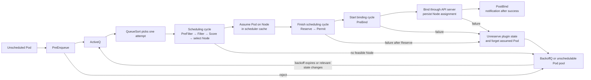

## Working model

The scheduler packs reservations, not measurements. After placement, the kernel arbitrates real consumption; the gap between those two views creates most surprises.

## Translate the resource contract before scheduling it

A node's hardware capacity is not the amount available to Pods. Kubernetes reports **allocatable** CPU, memory, and other resources after reserving capacity for the operating system and node components. The scheduler compares Pod requests with that allocatable amount.

A **request** is reserved demand used for placement and, for some resources, contention policy. A **limit** is a runtime ceiling or enforcement input. Neither field reports current use. One Kubernetes CPU means one vCPU or physical core's compute capacity as reported by the node; `1000m` means one CPU and `250m` means one quarter. Memory is bytes, with binary suffixes such as `Mi` and `Gi`. Write units explicitly because `400m` CPU and `400Mi` memory describe unrelated quantities.

CPU, memory, storage bandwidth, network queues, cache, and kernel work remain shared on a node. A **noisy neighbor** is another workload whose use of one of those shared resources delays or destabilizes its peers. CPU and memory declarations help, but they do not isolate every queue or device.

```text
node capacity
  - operating-system and Kubernetes reservations
  = node allocatable

sum of scheduled requests must fit allocatable capacity
observed use later competes under kernel and cgroup policy
```

## Feasible first, preferable second

Scheduling starts with unscheduled Pods. Filter plugins remove nodes that lack requested resources or violate hard constraints. Score plugins rank what remains, reserve plugins protect the decision, and bind records the chosen node. A high score cannot rescue a node that failed a filter.

Requests drive the resource-fit calculation even when a container usually consumes less. This makes placement predictable, but inflated requests strand capacity while missing requests let a node accept more work than it can survive.

Namespace policy can reject the object before scheduling begins. A ResourceQuota caps aggregate namespace use such as requested CPU, memory, object counts, or selected storage. A LimitRange can set defaults or minimum and maximum values for individual Pods, containers, or claims. Admission against those policies is separate from whether any node can fit the admitted Pod.

## CPU slows down; memory can end the process

CPU requests influence shares during contention, while a CPU limit can impose a cgroup quota and throttle work. Memory requests guide placement; a memory limit becomes a hard ceiling that can lead to an OOM kill. Neither request nor limit measures current demand.

[LL2: CPU scheduling and locality](../02-low-level-infrastructure/02-cpu-scheduling-and-locality.md) follows runnable delay, cache, and NUMA behavior below this abstraction. [LL6: Containers and cgroups](../02-low-level-infrastructure/06-containers-and-cgroups.md) follows how the node kernel accounts for and enforces the resource contract.

Kubernetes derives Pod quality-of-service (QoS) classes from request and limit patterns. QoS affects eviction order under node pressure, but it doesn't make a process immune to its own cgroup limit. Inspect throttling, working set, out-of-memory (OOM) events, and node pressure together.

For a Horizontal Pod Autoscaler (HPA) CPU-utilization target, utilization is measured against the relevant CPU request, not the limit. A missing request can leave utilization undefined for that Pod and prevent the metric from producing the expected scale decision. On clusters with Pod-level resources enabled, CPU and memory budgets can also appear at `spec.resources`; capacity and QoS inspection must include both Pod-level and container-level declarations.

## Spread what must survive; pack what can wait

Node affinity selects labeled hardware or zones. Taints repel Pods unless a matching toleration admits them. Pod affinity and anti-affinity express relationships among workloads, while topology spread constraints distribute replicas across domains. Every hard rule shrinks the feasible set, sometimes to zero.

Priority and preemption can clear lower-priority Pods for urgent work; they don't create nodes. HPA changes replica demand, and a node autoscaler such as Karpenter or Cluster Autoscaler changes supply. Queue age or depth often describes worker pressure better than CPU, provided the metric has a defined aggregation, freshness check, stabilization window, and downstream-capacity limit.

- Pack batch work to free whole nodes for scale-down.
- Spread serving replicas across failure domains.
- Reserve dedicated pools only when isolation or hardware justifies fragmentation.
- Set scale-down stabilization longer than a brief traffic lull.

## Autoscaling has separate demand and supply loops

The Horizontal Pod Autoscaler changes a workload's desired replica count from measured demand. The scheduler then tries to place those new Pods. If they do not fit, a node autoscaler may ask the cloud provider for more machines. Node startup, image pulls, initialization, and readiness all happen after the demand spike, so autoscaling cannot create instant capacity.

Every loop needs a metric, target, sampling interval, delay, minimum and maximum, and stop condition. CPU can fit a compute-bound request handler. Queue age or drain time often fits workers better because a deep queue with cheap handlers and a shallow queue with expensive handlers need different responses. Scaling also stops at downstream limits: database connections, API quotas, Pod IP addresses, or Kafka partition concurrency can become the actual ceiling.

### Not every placement or disruption control is a scaler

| Mechanism                | What it changes                                                                                   |
| ------------------------ | ------------------------------------------------------------------------------------------------- |
| Deployment replica count | A fixed desired Pod count written by a person or controller                                       |
| HPA                      | Workload replica demand from resource, custom, or external metrics                                |
| KEDA                     | Event-driven activation and replica demand, commonly by managing an HPA                           |
| VPA                      | CPU and memory requests or recommendations, not the number of replicas                            |
| Cluster Autoscaler       | Desired size of predeclared node groups                                                           |
| Karpenter                | Concrete nodes selected from pending-Pod constraints and provider supply                          |
| Scheduler profile        | Which existing feasible node receives a Pod                                                       |
| PodDisruptionBudget      | How many matching Pods a supported voluntary eviction may make unavailable                        |
| Affinity and spread      | Which placements are feasible or preferred                                                        |
| DaemonSet                | One Pod per eligible node; its count follows node supply rather than an application demand metric |

These controls form a sequence. An HPA or KEDA may raise the replica count. The scheduler may leave the new Pods Pending. Karpenter or Cluster Autoscaler may then add nodes, after which the scheduler tries again. Required anti-affinity can make every current node infeasible, and a disruption budget can block voluntary scale-down, but neither creates capacity.

A VPA that raises requests can make existing Pods unschedulable after restart. Karpenter can add suitable nodes only if the NodePool permits their shape and the provider has quota, subnet addresses, and available instances. Draw each loop with its input, output, delay, and maximum before expecting “autoscaling” to solve the whole path.

## Reservations set the fit even when dashboards look empty

Assume each node has 4 vCPU and 16 GiB of allocatable memory after system reservation. A worker Pod requests 1.5 vCPU and 5 GiB. Two workers fit because they reserve 3 vCPU and 10 GiB. A third would request 4.5 vCPU and fail the CPU filter even though memory would remain. If the first two workers happen to use only 200 millicores each, the scheduler still sees their 3 vCPU of requests; observed idleness does not rewrite the reservation.

Now suppose the same Pod has a 2 vCPU limit and 6 GiB memory limit. Short CPU bursts above its available quota can be throttled without a restart. Crossing the memory limit can end a container with an OOM reason. The node can also experience pressure from page cache, kernel memory, image storage, or Pods without honest requests. Size from measured working sets and service behavior, then keep enough unreserved capacity for daemons, rollout surge, eviction recovery, and a failed node.

_Run the same arithmetic for every hard placement domain, including zones and dedicated pools._

```text
node allocatable: 4 vCPU, 16 GiB
worker request: 1.5 vCPU, 5 GiB
2 workers: 3 vCPU, 10 GiB → feasible
3 workers: 4.5 vCPU, 15 GiB → rejected by CPU fit
```

## Separate placement failure from runtime contention

For Pending Pods, read scheduler events and evaluate each hard condition: requests, node selectors, required affinity, taints and tolerations, topology spread, volume topology, host ports, quotas, and priority. `kubectl describe pod <name>` usually shows the filter summary. Compare that message with `kubectl get nodes` labels, taints, and allocatable resources. If a node autoscaler does not add capacity, look for an impossible constraint or provider limit before increasing a pool maximum.

For running Pods, compare CPU usage with throttled periods and throttled time, then compare memory working set, limit, container termination reason, and node pressure. A high CPU percentage with low request may trigger HPA while the process is not throttled; a low average CPU can hide a single-thread limit or long request queue. For noisy neighbors, group latency and resource signals by node and compare an affected node with a healthy peer. Check disk I/O, network, and kernel pressure too, because CPU and memory charts do not account for every shared resource.

- Unschedulable: events, feasible nodes, and the first hard constraint.
- CPU slowdown: quota, throttling counters, run queue, and application latency.
- Memory death: termination reason, working set, limit, node pressure, and recent allocation growth.
- Stranded capacity: requests, topology rules, fragmentation by shape, and system reservations.
- Scaling delay: metric timestamp, HPA condition, pending Pods, node-claim progress, and startup time.

## Advanced scheduler internals

The ordinary placement, contention, and autoscaling model above is enough for most workload design and first-line diagnosis. The remaining sections explain kube-scheduler's queues, plugin phases, serialized decision boundary, scaling cost, and custom profiles.

### Follow one attempt through queues and plugin phases

kube-scheduler implements placement as a pipeline of plugin extension points. `PreEnqueue` decides whether a newly observed Pod may enter the active queue, and `QueueSort` chooses which active attempt runs next. The **scheduling cycle** filters Nodes, scores the feasible set, and selects one Node. The **binding cycle** applies that selection through the Kubernetes API.

After selecting a Node, the scheduler temporarily **assumes** the Pod on that Node in its in-memory cache. Later serial scheduling cycles can then account for the promised resources without waiting for the API binding request. Reserve plugins may keep related state of their own, and Permit plugins may approve, reject, or briefly hold the choice before binding.



If Reserve or a later phase fails, the scheduler calls the Reserve plugins' `Unreserve` methods in reverse Reserve order and forgets the assumed Pod. `Unreserve` must tolerate repetition and cannot report failure. The attempt then returns to a retry queue; otherwise stale assumptions or plugin allocations could make later Pods appear to consume capacity that no API object owns.

### Pending is a Pod phase, not one scheduler queue

The default scheduler watches for Pods that request its scheduler name and do not yet have a Node. Its scheduling queue is an in-memory control-plane structure, not a durable task queue in etcd.

- **ActiveQ** contains new or newly eligible scheduling attempts.
- **BackoffQ** holds retryable attempts until their backoff expires. Current configuration defaults start at one second and cap at ten seconds.
- The **unschedulable Pod pool** holds attempts for which no known change has made another try useful, including some Pods rejected by a `PreEnqueue` plugin.

`QueueSort` chooses the next Pod from ActiveQ. `QueueingHint` lets a plugin examine a cluster change and decide whether that change could make a rejected Pod schedulable. A new matching Node label may wake a Pod rejected by node affinity; an unrelated Secret update should not wake every resource-fit failure. This avoids retrying the entire unschedulable population for every event.

Do not infer queue membership from `status.phase: Pending`. A Pod already bound to a Node can remain Pending while images, volumes, or containers are prepared. A Pod naming another scheduler is outside this scheduler's ordinary queue. Count `scheduler_pending_pods` by its queue label and scheduling-attempt metrics rather than treating every Pending Pod as waiting in ActiveQ.

### One placement decision is serial, while node work and binding can overlap

The scheduling cycle shown above ends after the Permit extension point. In the ordinary per-Pod path, kube-scheduler runs these cycles serially, so a later Pod does not begin its placement decision until the current Pod finishes that cycle. Binding cycles can overlap because the assumed cache already makes each unfinished selection visible to later scheduling work.

That statement does not mean the process is wholly single-threaded. Filter plugins for different Nodes may run concurrently, Score work is parallelized across Nodes in the current implementation, and binding cycles may overlap later scheduling cycles. A Permit plugin can approve, deny, or wait with a timeout. `PreBind` performs work required before assignment, `Bind` records the selected Node, and `PostBind` receives notification after success. A rejection follows the rollback path in the diagram.

```text
Pod A: [serial scheduling cycle ----------------] [async binding cycle ------]
Pod B:                                          [serial scheduling cycle ---] [binding]

inside one scheduling cycle:
  Nodes can be filtered and scored concurrently
```

The serialized boundary protects a coherent placement decision against the scheduler's latest assumed state. Binding concurrency hides API latency without letting two later cycles spend the same apparent capacity. A second active scheduler replica normally waits under leader election; adding replicas improves failover, not steady-state scheduling throughput for one profile.

### Derive the `O(P × N)` bound instead of memorizing it

Let `P` be scheduling attempts handled by this scheduler during a window and `N` be Nodes. `P` is not the count of unique Pods: retries can make it larger, while already-bound Pending Pods and Pods owned by another scheduler do not belong in it.

For attempt `i`, let `M_i` be the number of Nodes inspected by Filter and `K_i` the feasible Nodes sent to Score. Then `K_i <= M_i <= N`. If `F` and `S` represent the cost of the enabled Filter and Score plugin sets, a useful work model is:

```text
W ~= sum over attempts i of (M_i * F + K_i * S) + retry and PostFilter work
```

If each attempt scans all Nodes and plugin cost is treated as constant, the Pod-Node work is `Theta(P * N)`. That is the defensible meaning of the common `O(P × N)` statement. It is a worst-case work bound, not elapsed time: node evaluation can run in parallel. It also omits costs that are not constant. Inter-Pod affinity and topology checks can inspect other workload state, volume binding can call storage logic, extenders can add network waits, and preemption can evaluate candidate victims after ordinary filtering finds no feasible Node.

### `percentageOfNodesToScore` stops after enough feasible Nodes

kube-scheduler does not always send every Node to Score. `percentageOfNodesToScore` sets a target number of **feasible** Nodes. Filtering can stop after finding that target, then Score ranks only those candidates. It does not promise that the scheduler inspects only that percentage: when most Nodes are infeasible, it may inspect all `N` Nodes to find a much smaller feasible set.

With automatic configuration, current documentation gives 50 percent for a 100-Node cluster, 10 percent for 5,000 Nodes, and a lower bound of 5 percent. The implementation also seeks at least 100 feasible Nodes; clusters with fewer than 100 feasible Nodes are fully checked. At 5,000 Nodes, the automatic target is therefore 500 feasible Nodes. If nearly every Node fits, the scheduler can stop after roughly 500 inspections. If only 20 fit, it can inspect all 5,000 and still return only 20 candidates.

Lowering the percentage trades placement quality for search throughput because a Node with a better score may never enter the candidate set. Iteration starts at a rotating point and interleaves zones so the same prefix is not favored for every Pod. Setting 100 requests all feasible Nodes. Keep the default until measurement shows node search is the limiting stage and poorer placement is acceptable.

Kubernetes v1.35 introduced Opportunistic Batching as a beta feature enabled by default. Eligible consecutive Pods with equivalent scheduling constraints can reuse Filter and Score results. That can reduce repeated work for a large homogeneous rollout, but it does not remove the `O(P x N)` worst case for ineligible, changing, constrained, or non-batched attempts. Confirm the feature state and eligibility rules for the cluster version under study.

### Work a 5,000-Node burst from queue to etcd

Suppose 2,000 Pods become ready for scheduling on a 5,000-Node cluster. First analyze the non-batched path, either because batching is unavailable or because the Pods are not eligible to share results. A full scan offers up to `2,000 * 5,000 = 10,000,000` Pod-Node filter opportunities before plugin multiplicity. With the current automatic 10 percent target and a mostly feasible fleet, each attempt may find 500 candidates quickly, for roughly 1,000,000 successful feasibility checks and 1,000,000 Node candidates sent through Score. If hard topology or resource rules leave few feasible Nodes, inspection moves back toward the 10,000,000 upper bound.

Now suppose profiling under this exact plugin set and object population measures a mean scheduling-cycle time of 5 ms. Because placement cycles are serial, 2,000 attempts need at least about 10 seconds of scheduling-cycle time even if binding overlaps and no retries arrive. If 100 new attempts arrive each second during the drain, the net drain rate is about 100 per second rather than 200, so the original burst takes about 20 seconds. These are illustrative calculations from a measured input, not kube-scheduler performance guarantees.

After each successful choice, the scheduler posts the binding through the API server. The API server conditionally persists the Pod's assignment to etcd, updates its watch cache, and publishes the change. The selected kubelet then observes the bound Pod and begins node-local reconciliation. High churn therefore spends queue and plugin work, API admission and serialization, an etcd mutation, watch fan-out, and kubelet work for each successful placement. [CI3: Control planes, etcd, and reconciliation](./03-control-planes-and-reconciliation.md) develops that storage path.

Measure the stages separately:

| Signal                                                    | Question it answers                                                     |
| --------------------------------------------------------- | ----------------------------------------------------------------------- |
| `scheduler_pending_pods` by queue                         | Are attempts active, backing off, or unschedulable?                     |
| `scheduler_schedule_attempts_total` by result             | Are attempts succeeding, failing, or returning unschedulable?           |
| `scheduler_scheduling_attempt_duration_seconds`           | How long does the complete scheduling attempt, including binding, take? |
| `scheduler_scheduling_algorithm_duration_seconds` (alpha) | How long does the scheduling algorithm take before binding?             |
| `scheduler_plugin_execution_duration_seconds` (alpha)     | Which extension point, plugin, and status own execution time?           |
| API binding request latency and errors                    | Is the selected decision slow or failing to persist?                    |
| etcd proposal, WAL, and backend latency                   | Is durable control-plane storage limiting the bind path?                |
| Pod scheduled condition and events                        | Which user-visible placement rule rejected the Pod?                     |

> **Fictional case.** The bookshop keeps latency-sensitive `storefront-api` Pods on the default scheduler. Disposable image-resize Jobs may opt into a second scheduler profile that scores requested CPU and memory with `MostAllocated`, which helps empty a node for later scale-down. The profile name and every value below belong only to this fictional example.

### Trace a fictional packing profile to Pod opt-in

The scheduler configuration fragment below defines the teaching profile `batch-packer`. It tells the `NodeResourcesFit` scoring plugin to prefer nodes with a larger requested-resource share. The fragment shows only the scoring contract, and one `kube-scheduler` process can host multiple profiles. If the cluster instead runs `batch-packer` in a separate scheduler process, that deployment also needs its own arguments, credentials, permissions, health checks, and distinct leader-election identity.

```yaml
apiVersion: kubescheduler.config.k8s.io/v1
kind: KubeSchedulerConfiguration
profiles:
  - schedulerName: batch-packer
    pluginConfig:
      - name: NodeResourcesFit
        args:
          scoringStrategy:
            type: MostAllocated
            resources:
              - name: cpu
                weight: 1
              - name: memory
                weight: 1
```

An image-resize Job opts in with `spec.template.spec.schedulerName: batch-packer`; an ordinary Pod without that field uses `default-scheduler`. The profile name joins the running scheduler to the Pod. Resource requests supply the scoring inputs, while current dashboard use does not, so inspect the Pod requests before trying to explain a placement.

_The running scheduler profile and each workload opt-in form one contract._

## Summary

Scheduling and runtime resource control use different inputs. The scheduler admits Pods against declared reservations and hard placement rules; after binding, cgroups and the kernel decide how actual CPU, memory, I/O, and network demand contend.

- Scheduler fit uses requests, not current dashboard usage. For each resource, the sum of Pod requests must fit node allocatable capacity.
- One Kubernetes CPU equals one reported vCPU or physical core and `1000m`; memory uses byte quantities such as `Mi` and `Gi`. Node allocatable is capacity after system reservations.
- Filter plugins determine feasible nodes from requests and hard constraints; score plugins rank only that feasible set. A high score cannot override a failed filter.
- ResourceQuota constrains aggregate namespace demand, while LimitRange constrains or defaults individual objects. Passing admission does not prove a node can fit the Pod.
- CPU requests influence entitlement under contention, while CPU limits can throttle. Memory requests guide placement, while crossing a memory limit can end the container.
- HPA CPU utilization divides observed use by the request, not the limit. Missing requests and stale external metrics can therefore block or distort scaling.
- Affinity, taints, volume topology, host ports, and topology spread all reduce the feasible set. Spread serving replicas across failure domains; pack delay-tolerant work when freeing whole nodes matters.
- HPA and KEDA change replica demand; VPA changes resource requests; Cluster Autoscaler and Karpenter change node supply. Scheduler profiles, PDBs, affinity, and spread affect placement or disruption but do not create capacity.
- For Pending Pods, start with scheduler events and node labels, taints, allocatable capacity, claims, and quotas. For running Pods, compare throttling, working set, OOM reasons, pressure, and latency by node.
- Reserve capacity for system daemons, rollout surge, failed-node recovery, and startup lag. Apparent idle CPU does not reclaim an oversized request.
- Pending is a Pod lifecycle phase, not a scheduler queue. ActiveQ, BackoffQ, and the unschedulable Pod pool describe scheduling attempts; QueueingHint moves only attempts that a relevant cluster change may unblock.
- Scheduling cycles select Nodes serially. Node Filter and Score work can run in parallel, and binding cycles can overlap later placement cycles. The assumed cache reserves a choice before its API binding finishes; failure runs Reserve-plugin cleanup in reverse and removes the assumption before retry.
- For `P` scheduling attempts and `N` Nodes, a full-scan, constant-plugin-cost upper bound has `O(P * N)` Pod-Node work. Retries, topology-aware plugins, extenders, and preemption add cost; parallel evaluation means this is not a wall-clock formula.
- `percentageOfNodesToScore` targets a count of feasible Nodes, not a maximum number inspected. A 5,000-Node cluster currently targets 500 feasible Nodes under the automatic 10 percent value, but it can still inspect all 5,000 when few fit.
- Opportunistic Batching can reuse work for eligible equivalent Pods on current releases. It improves homogeneous bursts without removing the non-batched worst case; verify the deployed feature state.
- A successful placement becomes an API binding and an etcd mutation before the kubelet acts. Scheduler, API-server, etcd, watch, and kubelet capacity all matter during high Pod churn.

## References

- [Kubernetes scheduling framework](https://kubernetes.io/docs/concepts/scheduling-eviction/scheduling-framework/)
- [Kubernetes scheduler performance tuning](https://kubernetes.io/docs/concepts/scheduling-eviction/scheduler-perf-tuning/)
- [Kube-scheduler configuration API](https://kubernetes.io/docs/reference/config-api/kube-scheduler-config.v1/)
- [Kubernetes scheduling queue and QueueingHint](https://kubernetes.io/blog/2024/12/12/scheduler-queueinghint/)
- [Kubernetes component metrics](https://kubernetes.io/docs/reference/instrumentation/metrics/)
- [kube-scheduler scheduling implementation](https://github.com/kubernetes/kubernetes/blob/master/pkg/scheduler/schedule_one.go)
- [kube-scheduler framework runtime](https://github.com/kubernetes/kubernetes/blob/master/pkg/scheduler/framework/runtime/framework.go)
- [Resource management for Pods and containers](https://kubernetes.io/docs/concepts/configuration/manage-resources-containers/)
- [Kubernetes resource units](https://kubernetes.io/docs/concepts/configuration/manage-resources-containers/#resource-units-in-kubernetes)
- [Horizontal Pod Autoscaling](https://kubernetes.io/docs/concepts/workloads/autoscaling/horizontal-pod-autoscale/)
- [Kubernetes Vertical Pod Autoscaler](https://github.com/kubernetes/autoscaler/tree/master/vertical-pod-autoscaler)
- [KEDA concepts](https://keda.sh/docs/latest/concepts/)
- [Assigning Pods to nodes](https://kubernetes.io/docs/concepts/scheduling-eviction/assign-pod-node/)
- [Taints and tolerations](https://kubernetes.io/docs/concepts/scheduling-eviction/taint-and-toleration/)
- [Pod topology spread constraints](https://kubernetes.io/docs/concepts/scheduling-eviction/topology-spread-constraints/)
- [Pod quality of service classes](https://kubernetes.io/docs/concepts/workloads/pods/pod-qos/)
- [Kubernetes resource quotas](https://kubernetes.io/docs/concepts/policy/resource-quotas/)
- [Kubernetes LimitRange](https://kubernetes.io/docs/concepts/policy/limit-range/)
- [Kubernetes scheduler configuration](https://kubernetes.io/docs/reference/scheduling/config/)
- [Kubernetes node resource scoring](https://kubernetes.io/docs/concepts/scheduling-eviction/resource-bin-packing/)
