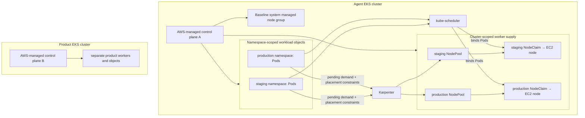

## Working model

A managed service removes ownership of named components, not responsibility for the resulting system. Compare EKS and ECS by the contracts you operate, not by a one-line feature table.

## Start with the two products

Amazon Elastic Container Service (ECS) and Amazon Elastic Kubernetes Service (EKS) both keep containers running, but they expose different control planes. ECS is AWS's own container orchestrator. You submit ECS task definitions and services to the ECS API. EKS is AWS's managed Kubernetes service. You submit Kubernetes objects to a Kubernetes API server whose availability AWS operates.

Neither product builds the application image or becomes the application's database. A build normally pushes an Open Container Initiative (OCI) image to a registry such as Amazon Elastic Container Registry (ECR). The orchestrator then starts that image on a compute layer and replaces failed copies. State still belongs in an explicitly chosen database, object store, or volume.

| ECS term          | Meaning                                                                        | Rough EKS comparison, not an equivalence                                    |
| ----------------- | ------------------------------------------------------------------------------ | --------------------------------------------------------------------------- |
| ECS cluster       | A logical home for ECS services, tasks, and capacity providers                 | EKS cluster, which also exposes the wider Kubernetes API                    |
| Task definition   | Revisioned blueprint for one or more colocated containers                      | Pod template inside a Deployment or another controller                      |
| Task              | One running copy of a task definition                                          | Pod                                                                         |
| Service           | Maintains a desired task count and optional load-balancer registration         | Deployment plus a Service and cloud integration                             |
| Capacity provider | Selects Fargate, ECS Managed Instances, or an EC2 Auto Scaling group for tasks | Fargate profile, Auto Mode, managed node group, or another node-supply path |

_One image can run through either control plane, but the objects and operating contract change._

```text
ECR image → ECS task definition → ECS service → tasks → load-balancer target group
ECR image → EKS Deployment → ReplicaSet → Pods → Kubernetes Service → load balancer
```

## ECS starts from a task definition

An ECS task definition is a revisioned JSON blueprint: container images and commands, CPU and memory, ports, volumes, logs, health checks, a task execution role for ECS operations, and a task role for application AWS calls. A task is one running instantiation of that definition. A long-running ECS service maintains a desired number of tasks, replaces stopped or unhealthy tasks, and can register them with an ALB, NLB, or GWLB target group. A standalone task runs once without a service maintaining it.

Capacity providers answer where tasks run. Fargate and Fargate Spot provide serverless task capacity. An Auto Scaling group capacity provider uses EC2 instances that your team configures. ECS Managed Instances supplies AWS-managed EC2 capacity while retaining ECS task scheduling; it sits between Fargate's per-task boundary and self-managed EC2 fleets. Current AWS guidance prefers capacity-provider strategies over choosing a launch type at service run time.

For east-west traffic, an ECS service can use ordinary load balancing, Cloud Map service discovery, VPC Lattice, or Service Connect. Service Connect adds a managed proxy to each participating task plus short names, discovery, metrics, and logs. It doesn't expose the service to external clients.

## EKS starts from Kubernetes objects

An EKS workload starts with the Kubernetes objects introduced in CI2. A Deployment declares the desired Pod replicas, the scheduler selects worker nodes, kubelets start the image, and a Kubernetes Service gives the replaceable Pods a stable destination. AWS operates the Kubernetes control-plane availability; the application team still declares and operates the workload objects.

AWS gives each EKS cluster its own Kubernetes control plane, with at least two API server instances and three etcd instances distributed across three Availability Zones. Your team still owns cluster access, workload configuration, network design, add-ons, node or Fargate choices, version upgrades, observability, policy, and cost. Managed doesn't mean unattended.

Managed node groups operate EC2 Auto Scaling Groups and node lifecycle with EKS integration. Self-managed nodes expose more host control. Karpenter launches capacity from pending Pod constraints, which fits heterogeneous fleets but adds a controller and disruption policy to operate.

EKS access also crosses two authorization systems. An IAM principal authenticates to the EKS endpoint; EKS access entries can associate that principal with an EKS access policy or Kubernetes group, and Kubernetes authorization decides the API operation. That is separate from a Pod calling an AWS API. EKS Pod Identity or IAM roles for service accounts give the workload short-lived role credentials without handing it the node role.

> **Fictional case.** The bookshop EKS cluster keeps DNS, network, and observability add-ons on a small managed node group. Karpenter supplies replaceable application nodes from pending-Pod requirements. The split prevents an empty application fleet from removing the capacity needed to restore it.

### Namespaces and NodePools remain inside one cluster

One EKS cluster has one AWS-managed Kubernetes control plane. Namespaces inside it share the same API servers, etcd store, cluster controllers, upgrade path, and control-plane failure domain. A namespace scopes names and can scope RBAC, quotas, and network policy; it does not create another cluster, VPC, kernel, or control plane.



A Karpenter NodePool is cluster-scoped, not a child of a namespace. Pending Pods and NodePools are peer API objects inside the cluster. Node selectors, affinity, taints and tolerations, and admission policy connect workload demand to eligible supply. Karpenter creates NodeClaims and nodes; the scheduler performs the later Pod-to-node binding. Namespaces alone do not prevent a Pod from using a node or a privileged cluster component from seeing both environments.

Three private workload subnets commonly mean one subnet in each of three Availability Zones. That gives nodes, load balancers, and other resources that select those subnets zonal placement choices and separate IP pools. A database uses them only if its DB subnet group selects them. The AWS-managed API servers and etcd use an AWS-owned multi-AZ control-plane placement that is separate from customer workload subnets, although EKS creates network interfaces in selected cluster subnets so the control plane can communicate with the VPC.

Three subnets do not mean three clusters, and three is not a universal EKS requirement. A fixed system node group means baseline managed capacity that Karpenter does not create or remove. Its Auto Scaling Group can have different minimum, desired, and maximum values, such as `min=2`, `desired=2`, and `max=3`; failed or outdated instances remain replaceable. “Fixed” describes the supply mechanism and capacity floor, not immortal machines or one unchanging replica count.

## See the cluster work that a managed control plane replaces

A self-managed Kubernetes control plane needs hosts and networking for API servers, an etcd quorum, controller managers, and schedulers, plus certificates, secure bootstrap, high availability, upgrades, backup, monitoring, and recovery. Worker nodes then need kubelet, a container runtime, networking, DNS, and any storage integration. Installing binaries is only the first step.

`kubeadm` can bootstrap and upgrade conforming clusters by generating certificates and configuration and by joining control-plane or worker nodes. It does not provision machines or networks, install every optional add-on, create a high-availability endpoint, or become a continuing cluster lifecycle controller. A production kubeadm cluster therefore needs an infrastructure and operations design around it.

EKS removes direct ownership of the Kubernetes API server and etcd availability path. It does not remove the node, add-on, workload, access, observability, network, upgrade-coordination, or recovery work described in the rest of this note.

## Separate cluster creation, fixed capacity, and dynamic capacity

Use this fictional inventory to keep the ownership lines visible:

| Boundary                   | Bookshop choice                                                             | Failure evidence                                                           |
| -------------------------- | --------------------------------------------------------------------------- | -------------------------------------------------------------------------- |
| Kubernetes control plane   | EKS in three control-plane Availability Zones                               | EKS health, API reachability, authentication, audit records                |
| Recovery floor             | Managed node group with three on-demand nodes across three workload subnets | Auto Scaling activity, node readiness, bootstrap output                    |
| Elastic application supply | Karpenter `NodePool` plus an EC2-specific node class                        | Pending-Pod constraints, node claims, EC2 launch errors, disruption events |
| Workload demand            | HPA and fixed replica declarations                                          | Desired replicas, ready replicas, queue or request metric                  |

The EKS API can remain healthy while no worker can launch. A managed node group can hold three Ready nodes while a Karpenter NodePool rejects the instance types required by a GPU Pod. Karpenter can create a node claim that AWS cannot fulfill because a subnet has no addresses or the account lacks quota. Follow the chain rather than reporting “autoscaling failed.”

Do not install Cluster Autoscaler and Karpenter with overlapping ownership of the same node supply. If both exist in one cluster, draw which node groups or NodePools each controller may change, how scale-down ownership differs, and which controller an operator should inspect for a given Pending Pod.

_The managed control plane, recovery floor, and elastic node controller have separate lifecycles._

### Follow one Karpenter NodeClaim

Karpenter watches unschedulable Pods and combines their requests and hard placement constraints with DaemonSet overhead. A `NodePool` defines allowed supply, labels, taints, aggregate limits, and disruption rules. A provider-specific node class defines host details such as AMI, subnet and security-group selection, storage, and instance role. Karpenter creates a `NodeClaim` for one concrete machine request, asks EC2 to launch it, and waits for the resulting Kubernetes Node to become Ready. The scheduler, not Karpenter, then binds the Pod.

```text
Pending Pod requests and constraints
  + matching DaemonSet overhead
  + NodePool supply policy
  + EC2NodeClass host configuration
  -> NodeClaim
  -> EC2 instance
  -> Ready Kubernetes Node
  -> scheduler binds Pod
```

Karpenter changes node supply; it does not change a Deployment or warm pool's replica count. Scale-out can stop at NodePool limits, EC2 quota, subnet IP exhaustion, unavailable instance capacity, an impossible selector, or a host configuration that never joins successfully.

Consolidation removes waste, while drift replaces nodes that no longer match current configuration. Both are voluntary disruption paths. A Pod annotation such as `karpenter.sh/do-not-disrupt: "true"` can block Karpenter from voluntarily evicting that Pod under the installed Karpenter version and policy. It does not survive hardware failure, manual deletion, direct Pod deletion, kubelet failure, or every forceful administrative action. If the NodePool or NodeClaim sets `terminationGracePeriod`, Karpenter honors Pod disruption blockers only until that deadline expires and can then remove the Pods to finish node termination.

A PodDisruptionBudget protects an availability count during supported voluntary evictions. It does not promise that one particular Pod stays on one particular node. Long-lived disruption blockers can also prevent consolidation, AMI replacement, and security patch rollout, so record why each blocker exists and how it is cleared.

## EKS exposes Kubernetes, not ECS objects

EKS exposes Kubernetes resources, controllers, CustomResourceDefinitions (CRDs), admission, and its extension ecosystem. An ECS task resembles a colocated process group, but treating it as a Pod hides different identity, networking, rollout, policy, and controller behavior. An ECS service and a Kubernetes Deployment both maintain replicas, yet they use different APIs, rollout controls, discovery objects, and extension points.

ECS can reduce cluster machinery for an AWS-only service with straightforward scheduling. EKS earns its cost when Kubernetes APIs, custom controllers, portable tooling, or a shared platform contract matter. Count operator skill and add-on ownership in the decision.

> **Fictional case.** The bookshop runs `storefront-api` on EKS because it uses Kubernetes policy and controllers. A separate nightly receipt-compaction task runs as a scheduled standalone ECS task on Fargate. Sharing an image registry does not make the two rollout or failure models equivalent.

## Managed compute comes in several shapes

Fargate removes direct EC2 node administration for supported ECS tasks or EKS Pods. That boundary restricts host access, daemon patterns, and some storage or networking choices. EC2 capacity keeps those controls but requires AMI, kernel, runtime, drain, patch, and replacement work.

EKS Auto Mode extends AWS management beyond the hosted control plane. AWS manages Auto Mode nodes plus core compute autoscaling, Pod and Service networking, load balancing, cluster DNS, block storage, and selected accelerator support. The managed instances use AWS-chosen immutable images and do not allow SSH or SSM access. Auto Mode still leaves application containers, VPC design, cluster configuration, Kubernetes policy, availability, and monitoring with the customer.

Fargate and Auto Mode are not interchangeable. EKS Fargate schedules each matching Pod into its own compute boundary and does not support DaemonSets, privileged containers, host networking, GPUs, alternate CNIs, or EBS mounts. Auto Mode uses managed EC2 instances and supports a broader Kubernetes data plane, but restricts host customization. Standard EKS with managed or self-managed nodes remains the choice when the host, AMI, daemon fleet, or unsupported storage and networking behavior is part of the workload contract.

For example, an execution platform may require a custom AMI with a gVisor runtime handler and the Linux Network Block Device module, a privileged node storage DaemonSet, a custom CSI driver, and Cilium chained after the VPC CNI. Those requirements depend on node-image and data-plane control that Auto Mode intentionally owns. Choosing standard EC2 nodes transfers AMI builds, runtime and kernel compatibility, node patching, autoscaler operation, and drain behavior back to the platform team.

Treat upgrades as a graph: control plane, managed add-ons, node images, controllers, policies, and workloads each have compatibility ranges. Test skew, capacity during rollout, Pod disruption budgets, webhook availability, and rollback signals before changing production.

- HPA changes Pod count; it doesn't guarantee a node exists.
- Node autoscaling adds supply; it can't repair impossible Pod constraints.
- A disruption budget limits voluntary eviction, not every failure.
- A managed node update still needs spare capacity and healthy drains.

## Compare one six-replica rollout

Suppose an ECS service has desired count 6, task definition revision 18, `minimumHealthyPercent: 100`, and `maximumPercent: 200`. A deployment to revision 19 may run up to 12 tasks and should keep at least 6 healthy while the scheduler replaces the old revision. New tasks must obtain capacity, start containers, pass their health checks, and become healthy in the load-balancer target group before the old tasks can disappear. The ECS deployment circuit breaker or CloudWatch alarms can stop and roll back a failed rolling deployment when configured.

Now take an EKS Deployment with 6 replicas, `maxUnavailable: 0`, and `maxSurge: 6`. The rough availability envelope looks similar, but the path differs: Kubernetes creates a ReplicaSet, Pods wait for scheduler placement, kubelets start them, readiness gates Service endpoints, and the Deployment controller scales down the old ReplicaSet. A PodDisruptionBudget can constrain voluntary eviction but does not set the Deployment rollout itself. Similar numbers do not make the control planes equivalent.

_In both cases, the upper bound is useless unless the compute layer, IP space, database pool, and service quotas can hold the surge._

## Networking, DNS, proxying, and storage have their own versions

An EKS cluster depends on components outside the hosted control plane. The Amazon VPC CNI programs Pod networking, CoreDNS answers cluster names, kube-proxy or an alternative implements Service forwarding, and the EBS CSI driver owns supported block-volume operations. Other controllers add ingress, certificates, policy, metrics, secrets, or autoscaling. Each component has a deployment method, permissions, configuration, compatibility range, readiness signal, and rollback path.

EKS add-ons let AWS package and support selected components, but the team still chooses versions and resolves configuration conflicts. A control-plane update does not prove add-ons, node images, or webhooks are compatible or updated. Inventory the running image or add-on version, compare it with the target Kubernetes version, review removed flags and APIs, and test one cluster before broad rollout. For a DaemonSet add-on, verify desired versus ready copies on every eligible node; for a controller, verify leader, API permissions, work queue, and provider calls.

- CNI failure can block Pod sandbox creation or address allocation.
- DNS failure can look like every dependency is down while direct addresses still work.
- Service-proxy failure can leave healthy endpoints unreachable through ClusterIP.
- CSI failure can leave a scheduled Pod waiting for provision, attach, or mount.
- Webhook failure can reject unrelated object writes when its failure policy closes the path.

## Change the platform in stages with capacity to stop

Before an EKS minor-version update, scan stored and rendered objects for removed APIs, check admission webhooks and CRDs, and read the compatibility notes for managed add-ons, controllers, node images, and clients. Create a capacity budget that can hold a node replacement plus normal rollout surge. Test backup and recovery for state that the cluster API does not own. Then update a non-production cluster with a representative workload and capture the exact order and evidence.

In production, change the control plane only inside its supported path, verify API health and controller behavior, then update add-ons and nodes according to their compatibility windows. Drain a small node cohort, watch pending Pods, disruption budgets, DNS, CNI allocation, CSI mounts, webhook latency, and application SLOs, then continue or stop. A failing drain may indicate an impossible disruption budget, local storage, finalizer, or a workload with no feasible replacement node. Rolling back an application does not roll back a control plane, so the upgrade record needs forward-repair steps for each platform layer.

_The exact order between compatible add-on and node versions comes from the pinned EKS and add-on documentation, not this generic outline._

```text
inventory → API and webhook check → capacity check → non-production trial
control plane → add-ons/controllers → node cohorts → workload verification
at each gate: observe, compare, continue or stop
```

## Summary

EKS and ECS remove different parts of container-platform ownership. The useful comparison is the API and operating surface your team retains, including capacity, networking, policy, upgrades, add-ons, and recovery.

- An ECS task definition is a blueprint, a task is one running copy, and a service maintains desired tasks. A capacity provider chooses Fargate, managed instances, or Auto Scaling group capacity.
- AWS operates EKS control-plane availability; the platform team still owns access, workloads, nodes or Fargate, add-ons, network design, observability, policy, upgrades, and cost.
- Namespaces and NodePools remain inside one cluster and share its control plane. A second EKS cluster has another managed control plane; namespaces alone do not create that isolation boundary.
- A self-managed cluster must bootstrap and operate API servers, etcd, controllers, schedulers, certificates, and a secure highly available endpoint. kubeadm assists bootstrap and upgrades but does not provision or continuously operate that whole system.
- EKS exposes Kubernetes resources, admission, CRDs, and controllers. Similar-looking ECS tasks and Kubernetes Pods do not share the same rollout, identity, network, or extension contracts.
- Separate cluster creation, baseline node capacity, and dynamic capacity controllers. Karpenter combines pending-Pod constraints, DaemonSet overhead, NodePool policy, and provider node-class settings into a NodeClaim for one machine.
- Fargate removes host administration for each supported task or Pod. EKS Auto Mode manages a broader EC2-backed data plane. Standard EC2 nodes retain host control and add image, kernel, drain, patch, and replacement work.
- Human cluster access and workload AWS access are separate: EKS access entries map IAM principals to Kubernetes permissions, while Pod Identity or roles for service accounts supply short-lived AWS credentials to Pods.
- CNI, DNS, Service proxying, CSI, webhooks, and autoscalers each have independent versions, permissions, health signals, and rollback plans.
- Upgrade as a dependency graph: removed APIs and webhooks, control plane, compatible add-ons and controllers, node cohorts, then workload evidence. Keep spare capacity for drain and rollout surge.
- A failed drain can indicate a disruption budget, local storage, a finalizer, or no feasible replacement node. Application rollback cannot reverse a control-plane change.

## References

- [Amazon EKS architecture](https://docs.aws.amazon.com/eks/latest/userguide/eks-architecture.html)
- [Kubernetes kubeadm reference](https://kubernetes.io/docs/reference/setup-tools/kubeadm/)
- [Creating a cluster with kubeadm](https://kubernetes.io/docs/setup/production-environment/tools/kubeadm/create-cluster-kubeadm/)
- [Amazon EKS access entries](https://docs.aws.amazon.com/eks/latest/userguide/access-entries.html)
- [How EKS Pod Identity works](https://docs.aws.amazon.com/eks/latest/userguide/pod-id-how-it-works.html)
- [Amazon EKS Auto Mode](https://docs.aws.amazon.com/eks/latest/userguide/automode.html)
- [Amazon EKS managed node groups](https://docs.aws.amazon.com/eks/latest/userguide/managed-node-groups.html)
- [Amazon ECS task definitions](https://docs.aws.amazon.com/AmazonECS/latest/developerguide/task_definitions.html)
- [Amazon ECS services](https://docs.aws.amazon.com/AmazonECS/latest/developerguide/ecs_services.html)
- [Amazon ECS launch types and capacity providers](https://docs.aws.amazon.com/AmazonECS/latest/developerguide/capacity-launch-type-comparison.html)
- [Amazon ECS Managed Instances capacity providers](https://docs.aws.amazon.com/AmazonECS/latest/developerguide/create-capacity-provider-managed-instances.html)
- [Amazon ECS rolling deployments](https://docs.aws.amazon.com/AmazonECS/latest/developerguide/deployment-type-ecs.html)
- [Amazon ECS Service Connect](https://docs.aws.amazon.com/AmazonECS/latest/developerguide/service-connect.html)
- [AWS Fargate for Amazon ECS](https://docs.aws.amazon.com/AmazonECS/latest/developerguide/AWS_Fargate.html)
- [AWS Fargate for Amazon EKS](https://docs.aws.amazon.com/eks/latest/userguide/fargate.html)
- [Update an Amazon EKS cluster](https://docs.aws.amazon.com/eks/latest/userguide/update-cluster.html)
- [Amazon EKS add-ons](https://docs.aws.amazon.com/eks/latest/userguide/eks-add-ons.html)
- [Karpenter concepts](https://karpenter.sh/docs/concepts/)
- [Kubernetes Cluster Autoscaler](https://github.com/kubernetes/autoscaler/tree/master/cluster-autoscaler)
- [Karpenter NodePools](https://karpenter.sh/docs/concepts/nodepools/)
- [Karpenter NodeClaims](https://karpenter.sh/docs/concepts/nodeclaims/)
- [Karpenter disruption](https://karpenter.sh/docs/concepts/disruption/)
