## Working model

A successful request is the composition of several independent state machines. DNS supplies one or more addresses. IP routing chooses a next hop. Network policy admits packets. TCP or QUIC creates transport state. TLS authenticates a peer and protects bytes. A load balancer selects a target, and a cache may answer before the origin runs at all.

Each layer can succeed while the next one fails. A valid DNS answer doesn't prove that a route exists; a completed TCP handshake doesn't prove that the certificate matches the name; an HTTP `200` from a health endpoint doesn't prove that a customer request can read its database. Debug the path in order and preserve evidence from each boundary.

[CI1: Cloud foundations](01-cloud-foundations.md) introduced the request path and AWS network boundaries. This note follows those same boundaries at packet, transport, proxy, cache, private-service, and hybrid-network depth. [LL5: Linux networking](../02-low-level-infrastructure/05-linux-networking-and-ebpf.md) is the optional host-side path beneath sockets, routes, namespaces, Netfilter, and eBPF.

## Start with two connection contracts

The public path in this note begins with:

```text
GET https://api.example.test/catalog/42
```

The private path begins when the API calls:

```text
GET https://inventory.internal.example.test/items/42
```

Before choosing an AWS product, write the contract for each path:

| Boundary          | Contract to name                                                                                 |
| ----------------- | ------------------------------------------------------------------------------------------------ |
| Name              | DNS name, record type, public or private authority, TTL, and expected answers                    |
| Address and route | IPv4 or IPv6 destination, source subnet, next hop, and return path                               |
| Admission         | Security group, network ACL, firewall, endpoint policy, and application authorization            |
| Transport         | TCP or QUIC, ports, timeouts, retry owner, connection reuse, and maximum concurrent connections  |
| Cryptography      | TLS termination point, server name, trust roots, client authentication, and certificate rotation |
| Distribution      | Edge service, load-balancer listener, target group, health contract, draining, and zonal policy  |
| HTTP and cache    | Method, host and path routing, cache key, freshness, invalidation, and origin protection         |

That contract prevents a common failure in architecture diagrams: a line labeled “network” hides six different owners.

## DNS turns a name into cached routing data

An application normally calls a local **stub resolver** through its runtime or operating system. The stub knows the addresses of one or more **recursive resolvers** but usually doesn't walk the public DNS hierarchy itself. A browser, runtime, operating system, local caching daemon, and recursive resolver may each retain an answer, so the cache visible to `dig` isn't always the cache used by the failing process.

On a cache miss, a recursive resolver follows referrals. It asks a root server which name servers know the top-level domain, asks a top-level-domain server which name servers are authoritative for `example.test`, then asks an **authoritative server** for the requested record. The authoritative server owns the zone data. It returns an answer or an authoritative negative response; it doesn't test the application when each query arrives.

```text
application
  -> local stub resolver
  -> recursive resolver cache
      -> root referral
      -> top-level-domain referral
      -> authoritative answer for the zone
  <- answer plus remaining TTL
```

Public DNS commonly uses UDP for small queries and TCP when a response is truncated or a transport feature requires it. That transport choice doesn't change the roles above.

### A TTL controls reuse, not instant propagation

Each resource record carries a **time to live** (TTL). A recursive resolver can reuse the record until that TTL expires, decrementing the value it returns from cache. Changing an authoritative record doesn't recall answers that resolvers, operating systems, or applications already hold. Lowering the TTL at the same moment as a cutover is too late for caches that retained the old, longer value.

Route 53 VPC Resolver documents one availability exception: when upstream name servers time out, refuse queries, or return `SERVFAIL`, it may answer from cache beyond the record's TTL. A TTL is therefore a cache-reuse contract under ordinary resolution, not a hard upper bound on every answer an implementation can serve during failure.

Cache entries are scoped by the queried name and type. An `A` lookup for IPv4 and an `AAAA` lookup for IPv6 have separate answers and can fail differently. A client implementing Happy Eyeballs may race usable IPv6 and IPv4 paths, which can hide a broken address family until a different client gives one family more time.

DNS also caches absence:

- **NXDOMAIN** means that the queried name doesn't exist.
- **NODATA** means that the name exists but has no record of the requested type.
- **SERVFAIL** means resolution failed; it isn't proof that the name is absent.

For an authoritative NXDOMAIN or NODATA response, RFC 2308 derives the negative-cache lifetime from the lesser of the SOA record's TTL and its MINIMUM field. Route 53 follows that rule for its hosted zones. A mistaken delete can therefore remain invisible after the record is recreated, until negative caches expire.

### Records name data; Route 53 routing policies choose among record sets

The records used most often on an application path have different jobs:

| Record  | Meaning                                                                                                                |
| ------- | ---------------------------------------------------------------------------------------------------------------------- |
| `A`     | Maps a name to one or more IPv4 addresses                                                                              |
| `AAAA`  | Maps a name to one or more IPv6 addresses                                                                              |
| `CNAME` | Makes one non-apex name an alias of another DNS name; the resolver continues with the target name                      |
| Alias   | Route 53 extension that can return selected AWS-resource answers, including at a zone apex where a CNAME isn't allowed |
| `NS`    | Delegates a zone to its authoritative name servers                                                                     |
| `SOA`   | Carries zone authority and timers, including data used for negative caching                                            |

Route 53's routing policy applies while its authoritative servers choose an answer. Simple routing returns the configured set. Weighted routing divides authoritative answers by configured weights over many queries; it doesn't guarantee an exact request ratio because resolvers cache answers and many clients can sit behind one resolver. Latency routing selects an AWS Region based on Route 53's latency data, while failover routing represents active-passive intent. Geolocation, geoproximity, IP-based, and multivalue policies solve other answer-selection problems. Multivalue answers are still DNS answers, not a replacement for a connection-aware load balancer.

A Route 53 health check runs periodically and updates control-plane health state. It doesn't execute in response to the customer's DNS query. A non-alias record can reference a health check; an alias can use `EvaluateTargetHealth` to inherit supported target health. When every record in a group is unhealthy, Route 53 can return an unhealthy answer rather than return nothing. DNS health therefore needs a degraded-mode plan, not an assumption that “unhealthy” makes the name disappear.

### Private zones and split-view names change authority

Route 53 VPC Resolver answers recursive queries from resources in a VPC. It can resolve public names, VPC-specific names, and records in private hosted zones associated with that VPC. Resolver inbound and outbound endpoints join VPC DNS with an on-premises resolver over reachable network paths.

A private hosted zone can use the same name as a public zone. VPC Resolver then gives associated VPCs a private view. If a matching private zone exists but the requested record doesn't, VPC Resolver returns NXDOMAIN instead of falling through to the public zone. This catches teams that create `example.test` privately for one record and expect every missing name to keep using public DNS.

Private DNS and private routing are separate. A private answer can name an unreachable address, while a public DNS answer can route over an AWS-managed path that never leaves the AWS network. Verify both.

### DNSSEC authenticates DNS data but doesn't encrypt the query

DNS Security Extensions (DNSSEC) let a validating resolver check signatures over DNS data. A Delegation Signer (`DS`) record in the parent zone links the child's key into a chain of trust. Route 53 can sign a public hosted zone, and VPC Resolver can validate signed public names when validation is enabled.

DNSSEC proves origin and integrity for validated records. It doesn't hide the queried name or address, and it doesn't test whether the returned service is healthy. A broken key-signing-key, expired signature, missing parent `DS`, or unsafe rollback can turn otherwise correct records into `SERVFAIL` for validating resolvers. Rotate keys and change the parent delegation with the same care used for a production certificate authority.

## Trace the public and private paths on one map

_The public path resolves through authoritative DNS and enters the edge. The private path resolves inside a VPC and enters a consumer-owned endpoint._

```mermaid
flowchart TB
  accTitle: Public and private request paths from DNS to service targets
  accDescr: A public client asks a stub and recursive resolver for a Route 53 answer, then connects through CloudFront, WAF, an Application Load Balancer, and an application target. A private caller asks VPC Resolver for an interface endpoint address, then connects through PrivateLink, a Network Load Balancer, and a provider target. Both paths establish TLS at an explicitly chosen boundary.

  subgraph Public["Public request"]
    Client["Browser or API client"] --> Stub["Stub resolver"]
    Stub --> Recursive["Recursive resolver cache"]
    Recursive --> Auth["Route 53 public hosted zone"]
    Auth --> Edge["CloudFront edge<br/>TLS, cache, optional WAF"]
    Edge --> ALB["Application Load Balancer<br/>host and path routing"]
    ALB --> App["Application target"]
  end

  subgraph Private["Private service call"]
    Caller["Workload in consumer VPC"] --> VpcResolver["Route 53 VPC Resolver<br/>private hosted zone"]
    VpcResolver --> Endpoint["Interface VPC endpoint ENI"]
    Endpoint --> PL["AWS PrivateLink"]
    PL --> NLB["Provider Network Load Balancer"]
    NLB --> Inventory["Inventory target"]
  end

  Edge -. "origin TLS" .-> ALB
  Caller -. "TLS or mTLS" .-> Inventory
```



The diagram omits route tables, network ACLs, security groups, retries, and existing connection state. Those omitted objects decide whether the arrows work.

## IP addresses name interfaces; route tables choose next hops

IPv4 and IPv6 both deliver packets between addresses, but their AWS egress models differ. An IPv4 VPC address is commonly private and needs source network address translation (SNAT) before reaching the public internet. An IPv6 VPC address is globally unique; policy and route tables decide whether the internet can reach it.

A VPC has one or more CIDR blocks. A subnet takes a non-overlapping slice and belongs to one Availability Zone. Each subnet uses a route table. Route selection uses the most specific matching destination, also called longest-prefix match. The VPC's local route carries traffic among its subnets; a default route sends everything not matched more specifically to an internet gateway, NAT gateway, egress-only internet gateway, Transit Gateway, virtual private gateway, or another supported target.

“Public subnet” is shorthand, not an API type. A subnet usually earns that name when its route table has a path to an internet gateway and the resource has an internet-routable address. A route alone doesn't assign a public IPv4 address, and a public address doesn't override a missing route or policy rule.

Return traffic must have a valid path. Stateful components can remember a flow, but they don't repair asymmetric routing through a stateful firewall or virtual appliance. When an outbound packet crosses one inspection appliance and the reply crosses another with no shared state, both route tables can look plausible while the connection still fails.

### Security groups and network ACLs filter at different scopes

A security group attaches to a network interface and contains allow rules. It is stateful: return traffic for an admitted flow is allowed through the connection state. A network access control list (network ACL) applies at a subnet boundary, supports ordered allow and deny rules, and is stateless. Its return path needs an explicit rule, often including the client's ephemeral port range.

| Observation                                      | Likely boundary to inspect first                                                       |
| ------------------------------------------------ | -------------------------------------------------------------------------------------- |
| SYN leaves the source but no reply enters subnet | Route, internet or transit attachment, remote path, then inbound network ACL           |
| Reply enters subnet but never reaches interface  | Network ACL and security-group admission                                               |
| TCP connects but TLS times out                   | Listener, target flow, MTU, TLS policy, certificate service, or overloaded peer        |
| Health check passes but customer path fails      | Different port, protocol, host header, path, credentials, source policy, or dependency |

Security groups and network ACLs don't authenticate an application principal. A process that can reach port 443 still needs TLS identity, workload credentials, and authorization at the service.

## Outbound IPv4, outbound IPv6, and service endpoints solve different routes

For outbound IPv4 internet access, a private subnet can send `0.0.0.0/0` to a NAT gateway. The NAT gateway replaces the private source address with one of its IPv4 addresses and retains translation state for replies. A zonal design places a NAT gateway in each active Availability Zone and routes each private subnet to its local gateway, avoiding a cross-zone dependency. Current AWS also offers a regional NAT gateway that expands across zones; its expansion time and current feature limits must be included in a scale-out plan.

A NAT gateway isn't an application proxy or an identity boundary. Its connection state consumes source ports. For one unique destination tuple (destination IP, destination port, and protocol), each NAT IPv4 address supports up to 55,000 simultaneous connections under the current service contract. Connection pooling, destination concentration, secondary addresses, packets per second, and bandwidth all matter.

IPv6 doesn't need address translation merely to avoid address overlap. A route such as `::/0` to an **egress-only internet gateway** allows connections initiated from the VPC and their replies while preventing unsolicited internet-initiated connections through that gateway. The component is stateful, but subnet network ACLs and interface security groups still apply.

VPC endpoints keep selected service traffic away from a general internet egress path:

| Endpoint type                        | Data path and common use                                                                                                                                                  |
| ------------------------------------ | ------------------------------------------------------------------------------------------------------------------------------------------------------------------------- |
| Gateway endpoint                     | Adds an AWS-managed prefix-list route for S3 or DynamoDB. It doesn't use PrivateLink and is scoped to selected VPC route tables.                                          |
| Interface endpoint                   | Creates endpoint network interfaces with private addresses in selected subnets. DNS commonly maps the service name to those addresses; security groups filter entry.      |
| Gateway Load Balancer endpoint       | Adds a route target that sends flows through a provider's GWLB and virtual appliances. Flow symmetry and appliance health matter.                                         |
| Resource or service-network endpoint | Current PrivateLink models can expose selected resources or service networks without the original endpoint-service load-balancer shape. Check service support and policy. |

Endpoint policy, service resource policy, IAM identity policy, and security groups answer different authorization questions. An endpoint policy can limit which principals use a path to an AWS service, but it doesn't grant an action that the service's own authorization denies.

## VPC Link connects API Gateway to a private integration

API Gateway is an AWS-managed service outside the application's VPC. A VPC Link is an API Gateway integration resource that gives selected routes a managed private path to supported resources inside a VPC, such as an internal load balancer or service-discovery target. The supported backend shapes differ between API Gateway REST APIs and HTTP APIs, so pin the API type and its integration contract.

```text
client
  -> public API Gateway endpoint
  -> route, authentication, authorization, and throttling
  -> VPC Link managed private path
  -> internal NLB or ALB
  -> private service targets
```

The client-facing API can remain public while the gateway-to-backend leg stays private. Security groups, subnets, load-balancer health, listener configuration, backend authentication, timeouts, and retries still apply. VPC Link acceptance proves only that API Gateway can attempt the private integration.

VPC Link is not a general tunnel or a Kubernetes Service:

| Mechanism                      | Scope                                                                                       |
| ------------------------------ | ------------------------------------------------------------------------------------------- |
| API Gateway VPC Link           | Private transport for selected API Gateway integrations                                     |
| PrivateLink                    | Publishes a service or resource to consumers through private endpoints                      |
| VPC peering or Transit Gateway | Broader routed reachability between network address spaces                                  |
| ClusterIP                      | Stable virtual destination for callers already using the Kubernetes cluster network and DNS |

An external webhook can take another path: API Gateway invokes a verifier function, the function validates the provider signature, and its VPC network interface calls the internal load balancer. That Lambda integration does not become a VPC Link merely because both paths reach the same private backend.

## PrivateLink publishes a service without joining two networks

In the original endpoint-service model, a provider places a Network Load Balancer in front of its service and grants selected AWS principals permission to create interface endpoints. The consumer chooses subnets and security groups for endpoint network interfaces. Private DNS can map the provider's name to those private interface addresses.

The consumer initiates a connection to the endpoint. PrivateLink carries it to the provider service without exposing general VPC-to-VPC routes; the provider can't start arbitrary connections back through that interface endpoint. Overlapping VPC CIDRs are less troublesome because the consumer connects to its own endpoint addresses rather than routing the provider CIDR.

PrivateLink narrows reachability, but it doesn't establish caller identity. The provider still needs TLS, mTLS, a signed application credential, or another authentication method. Endpoint permissions decide who may create a connection object; they don't decide which end user may read item 42.

### Trace the private inventory call

1. The caller asks VPC Resolver for `inventory.internal.example.test`. A private hosted-zone or endpoint-private-DNS answer returns interface-endpoint addresses in the consumer VPC.
2. The source chooses an IPv4 or IPv6 address and the subnet route table selects the local VPC path to the endpoint network interface.
3. The source security group permits egress, the subnet network ACL permits both directions, and the endpoint security group admits the source. No NAT or internet gateway participates.
4. PrivateLink maps the accepted flow to the provider endpoint service. Its Network Load Balancer selects a healthy target according to enabled zones and cross-zone policy.
5. TLS authenticates the service name. If the provider requires mTLS, it also validates the caller certificate. Application authorization then checks the requested inventory operation.

If DNS resolves but the endpoint security group rejects the flow, the caller sees a connection timeout rather than a DNS error. If the NLB has no useful target, TCP may reset, time out, or reach fail-open targets depending on target and health state. Preserve evidence at each step.

## Transit Gateway, VPN, and Direct Connect join networks rather than one service

Transit Gateway is a regional routing hub. VPCs, VPNs, Direct Connect gateways, and supported network functions attach to it. Each attachment associates with one Transit Gateway route table, and routes can propagate from attachments or be configured statically. Multiple route tables create routing domains such as production, development, and shared services.

The VPC subnet still needs a route to the Transit Gateway, and the Transit Gateway route table needs a route to the destination attachment. The destination VPC needs a return route. Route propagation can simplify updates, but it can also spread an unintended prefix; static blackhole routes and separated tables can contain reachability. Transit routing doesn't remove security-group, network ACL, firewall, DNS, or application-authentication work.

AWS Site-to-Site VPN carries IP packets through IPsec tunnels. One connection includes two tunnels, which should both be configured. Border Gateway Protocol (BGP) can advertise prefixes and move traffic when a tunnel fails; static routes need their own detection and failover process. The encrypted outer path commonly crosses the public internet, so latency and loss can vary.

Direct Connect provides private connectivity through either a dedicated connection for one customer or a hosted connection provisioned by a Direct Connect partner. Virtual interfaces and BGP exchange routes. A Direct Connect gateway can connect the path to virtual private gateways, Transit Gateways, or Cloud WAN according to its association model. Direct Connect traffic isn't encrypted by default. MACsec can protect a supported physical link to the Direct Connect location; application TLS or an IPsec VPN over Direct Connect can provide a broader encryption boundary.

One Direct Connect path is still one failure path. Redundant connections should terminate on separate devices and, for location-failure tolerance, separate Direct Connect locations. Test BGP convergence, maximum tolerated path change, and the VPN backup under load rather than treating a diagrammed second line as proven failover.

Use the narrowest connectivity primitive that fits. A consumer-to-provider API often fits PrivateLink. Many networks that need routed, bidirectional reachability fit Transit Gateway. An encrypted on-premises path fits Site-to-Site VPN, while sustained private capacity can justify Direct Connect with explicit redundancy and encryption.

## TCP, QUIC, and TLS create connection state above IP

TCP provides a reliable ordered byte stream. A new connection normally starts with SYN, SYN-ACK, and ACK. Sequence numbers, acknowledgements, retransmission, flow control, and congestion control then govern delivery. A load balancer or NAT creates state keyed from the flow; idle timeouts and address translation can outlive or expire independently of the application's socket assumptions.

QUIC runs over UDP and integrates TLS 1.3. It multiplexes independent streams so loss on one stream doesn't impose TCP's transport-level head-of-line wait on every other stream in the connection. Connection IDs can let a connection survive some client-address changes. Those benefits require a working UDP path, supported QUIC versions, and compatible edge and origin behavior. Current Network Load Balancers support QUIC listeners as pass-through to QUIC-capable targets; they don't terminate the QUIC encryption for the application.

Retries sit above both transports. A client that loses the response after the server commits a write can't infer whether the operation happened. Reuse an idempotency key and reconcile the operation result; changing TCP to QUIC doesn't solve an uncertain business effect.

### TLS termination creates a new trust boundary

During a TLS 1.3 connection, the client sends a ClientHello containing parameters such as the server name and Application-Layer Protocol Negotiation (ALPN) choices. The server presents a certificate chain for the requested name and proves possession of its private key. The peers derive traffic keys and authenticate the handshake before protected application data flows.

Where TLS terminates determines who can read and modify the plaintext:

| Termination choice          | Consequence                                                                                                                                          |
| --------------------------- | ---------------------------------------------------------------------------------------------------------------------------------------------------- |
| CloudFront edge             | Viewer TLS ends near the client. Configure a separate TLS connection and certificate validation policy from CloudFront to the origin.                |
| ALB or NLB TLS listener     | The load balancer owns the server certificate and creates a separate target connection. Re-encrypt to targets when the threat model requires it.     |
| TCP or QUIC pass-through    | The target owns the certificate and handshake. The load balancer has less application context for routing and inspection.                            |
| Service mesh or application | Workload identity and encryption can continue inside the VPC, but certificate issuance, sidecar or proxy health, and rotation join the request path. |

Ordinary server-authenticated TLS proves the server identity to the client. It doesn't authenticate the client. **Mutual TLS (mTLS)** adds a client certificate and proof of its private key. An ALB can verify client certificates against a trust store or pass certificate material to a target for verification, but the application still needs authorization rules that map certificate identity to allowed operations.

### Rotate certificates as an overlap, not a flag day

An Amazon-issued ACM certificate attached to a supported AWS service can renew automatically while retaining its ARN, provided it remains eligible and domain validation still works. Imported certificates and certificates outside that managed path need a separate renewal owner. Monitor renewal state and expiry even when renewal is advertised as automatic.

Private trust rotation needs overlap:

1. Add the new root or intermediate certificate to every verifier's trust bundle while the old issuer remains trusted.
2. Issue and deploy new leaf certificates, then observe handshakes from every client population and protocol.
3. Wait through the old leaf lifetime, connection lifetime, deployment lag, and any offline-client window before removing old trust.
4. Retain an owned revocation and emergency-replacement path for a compromised private key.

Certificate success on the load balancer doesn't prove origin TLS. Viewer certificate, origin certificate, client certificate, and private service certificate are separate inventories.

## L4, L7, and appliance load balancing make different decisions

“Load balancer” names several products with different packet visibility:

| AWS load balancer | Decision layer and protocols                                                                                       | Common use and boundary                                                                                                      |
| ----------------- | ------------------------------------------------------------------------------------------------------------------ | ---------------------------------------------------------------------------------------------------------------------------- |
| ALB               | Layer 7 HTTP and HTTPS. Can inspect host, path, method, headers, and other request attributes.                     | Web routing, TLS termination, redirects, authentication integration, WAF association, and HTTP target health.                |
| NLB               | Layer 4 TCP, TLS, UDP, TCP_UDP, QUIC, and TCP_QUIC listeners. Selects targets from connection or flow information. | High connection rates, non-HTTP protocols, fixed zonal addresses, TLS termination or pass-through, and PrivateLink services. |
| GWLB              | Layer 3 IP flow distribution. Exchanges traffic with appliances using GENEVE on port 6081.                         | Transparent insertion of firewalls, intrusion systems, and other virtual appliances while retaining flow affinity.           |

GWLB isn't an HTTP reverse proxy. Its appliance must accept encapsulated GENEVE traffic and return the flow symmetrically. An ALB can't replace a packet-inspection appliance, while a GWLB can't route `/checkout` separately from `/catalog` based on an HTTP path.

### Listener, target group, and target health are separate objects

A listener accepts a protocol and port. Its rule selects a target group. A target group defines target type, target port and protocol, health check, and attributes such as deregistration delay or cross-zone behavior. Registration only makes a target eligible; it must also pass the target group's health contract.

A useful health check answers “can this target accept this class of new work?” It should detect a process that can't serve, but making it fail for every optional dependency can remove every target during a shared dependency outage and force fail-open traffic back onto the same fleet. Pair a shallow admission check with service-level signals and dependency-specific alerts.

During deregistration, the load balancer stops assigning eligible new work and allows existing requests or connections to drain according to product, protocol, and target-group settings. The process must also stop accepting work, retain enough termination time, and close long-lived connections deliberately. A five-minute load-balancer delay can't help a Pod that receives `SIGKILL` after 30 seconds.

### Cross-zone settings trade isolation for pooled capacity

An AWS load balancer has nodes in enabled Availability Zones. With cross-zone balancing disabled, a node sends traffic only to targets in its own zone. With it enabled, a node can choose healthy targets across enabled zones.

Current product defaults differ. ALB has cross-zone balancing enabled at the load-balancer level; target-group attributes can change how a group inherits that behavior. NLB and GWLB start with cross-zone balancing disabled. Inspect the load balancer and target-group settings instead of carrying one rule across products.

Cross-zone balancing pools spare capacity and can keep a zonal front end useful after local targets fail, but it adds cross-zone data paths and can hide a zone that never had enough local capacity. Zonal isolation gives a clearer cell boundary but requires each zone to absorb its assigned traffic and requires DNS or another entry layer to stop sending new connections to a failed zone.

### Health-based fail-away isn't immediate, and fail-open is intentional

Network Load Balancers publish zonal addresses in DNS. When a zone fails its load-balancer health criteria, AWS can remove that zonal address from new DNS answers. Resolvers and clients may keep the old address until caches expire, and an established TCP or QUIC connection doesn't move merely because DNS changed.

When only unhealthy registered NLB targets remain, the NLB can send traffic to all registered targets in fail-open mode. ALB target groups also support routing-failover thresholds that can send traffic to targets otherwise considered unhealthy. The purpose is to preserve a chance of success and avoid concentrating all traffic on a tiny healthy set. It also means that “unhealthy” doesn't prove a target receives no requests.

Don't confuse target fail-open with the ALB attribute controlling behavior when AWS WAF can't evaluate a request. Those are different failures with different settings and evidence.

## CloudFront caches responses; the cache key is a data-isolation rule

A content delivery network (CDN) terminates viewer connections at distributed edge locations and can answer eligible requests from cache. On a miss, CloudFront sends an origin request. A cache hit removes origin request work and origin transfer for that object, but it doesn't remove viewer transfer or edge processing.

CloudFront's **cache key** starts with the distribution and cache behavior plus the request path, then adds the query strings, headers, and cookies selected by the cache policy. Include every request attribute that can change the response. Omitting a tenant, language, authorization state, or content-encoding dimension can serve one variant to the wrong viewer. Including high-cardinality attributes that don't affect the response fragments the cache and sends avoidable misses to the origin.

The origin request policy is separate. It can forward a header or cookie to the origin without placing it in the cache key. That is safe only when the forwarded value doesn't change the cacheable response.

### Freshness is an explicit period of permitted staleness

CloudFront combines cache-policy minimum, default, and maximum TTLs with origin headers such as `Cache-Control` and `Expires`. An object may also be evicted before its TTL when it is cold. After expiry, CloudFront can fetch or revalidate it; `stale-while-revalidate` permits a stale answer during an asynchronous refresh, while `stale-if-error` can permit a stale answer during selected origin failures.

Set the cache policy's minimum TTL deliberately. When it is greater than zero, CloudFront can retain a response for at least that period even if the origin sends `Cache-Control: no-cache`, `no-store`, or `private`. A personalized behavior that must honor those directives needs a zero minimum TTL or disabled caching, plus a cache key and origin policy reviewed for that response.

Use immutable, versioned names for static assets such as `app.4d2c0f1.js`, with long freshness. Change the reference to publish a new version. For mutable names, choose a TTL from the maximum acceptable staleness and define whether stale-on-error is safe. A revoked authorization document and a public logo shouldn't share one cache policy.

An invalidation removes selected objects from CloudFront edge caches before normal expiry, so the next request returns to the origin. It doesn't erase copies already held by a browser or an unrelated corporate proxy. Versioned names give deploys a deterministic new key and keep the prior artifact available for rollback.

### Protect the origin from direct access and miss storms

An S3 origin can use Origin Access Control (OAC), which signs CloudFront's origin requests and lets the bucket policy reject direct reads. A custom origin such as an ALB needs its own restriction, for example a rotated secret origin header plus network controls that admit CloudFront-origin traffic. Keep origin TLS enabled and don't let a public origin URL bypass WAF, cache, or signed-viewer policy.

Origin Shield adds another cache and request-consolidation layer in a selected Region. It can reduce duplicate origin fetches for a hot object, especially when many edge locations miss at once. It doesn't turn personalized or uncacheable traffic into cacheable traffic, and origin capacity still needs a cold-cache or invalidation budget.

## Route 53, CloudFront, WAF, Shield, and Global Accelerator have distinct jobs

| Service            | Job on the request path                                                                                                                   | What it doesn't establish                                                                                     |
| ------------------ | ----------------------------------------------------------------------------------------------------------------------------------------- | ------------------------------------------------------------------------------------------------------------- |
| Route 53           | Returns DNS data using routing policy and optional health state                                                                           | Per-request proxying, connection draining, HTTP filtering, or instant failover for cached clients             |
| CloudFront         | Terminates viewer HTTP(S), caches selected responses, applies edge behaviors, and forwards misses to an origin                            | Arbitrary TCP or UDP proxying, application authorization, or origin correctness                               |
| AWS WAF            | Evaluates HTTP(S) requests against web ACL rules, including match and rate-based rules, at supported resources                            | Network-layer DDoS capacity, exact global per-second quotas, user identity, or filtering for an arbitrary NLB |
| AWS Shield         | Detects and mitigates supported distributed-denial-of-service attack patterns; Standard and Advanced have different service levels        | Business-logic abuse rules, cache freshness, or a replacement for capacity and incident response              |
| Global Accelerator | Advertises static anycast IPv4 or dual-stack entry addresses and routes TCP or UDP connections over the AWS network to regional endpoints | DNS authority, HTTP cache, path routing, or moving an already established connection to a new endpoint        |

CloudFront fits HTTP delivery when edge caching, HTTP policy, or viewer TLS is useful. Global Accelerator fits TCP or UDP applications that need fixed anycast entry addresses and health-based regional endpoint selection without HTTP caching. They can sit in different architectures, and neither removes the need for healthy regional load balancers and targets.

If every Global Accelerator endpoint is unhealthy, the standard accelerator can route to all endpoints. Route 53 and NLB have similar availability-biased behavior in their own layers. “All red” should trigger an explicit degraded-mode response because traffic may continue.

## Worked case: calculate one normal cached public path

Suppose `GET /catalog/42` receives 1,200,000 requests per minute at peak, or 20,000 requests per second. CloudFront logs show a 92 percent cache-hit ratio for that behavior, and the average response fetched on a miss is 48 KiB.

```text
origin request rate
  = 20,000 requests/s * (1 - 0.92)
  = 1,600 requests/s

origin response payload rate
  = 1,600 * 48 KiB/s
  = 76,800 KiB/s
  = 75 MiB/s
  ~= 629 Mb/s of response payload
```

This calculation excludes request bytes, TLS and protocol overhead, retries, revalidation responses, and CloudFront-to-origin transfer details. It describes measured object-miss traffic, not provisioned network bandwidth.

The ALB target group has 24 equal-capacity targets, so an even average would be about `1,600 / 24 = 66.7` origin requests per second per target. Real distribution won't stay perfectly even because request cost, connection reuse, slow targets, and cache keys differ. If one target is load-tested to a safe 100 requests per second for this exact response shape, the fleet's simple request-rate ceiling is 2,400 requests per second and the calculated margin is 800 requests per second, or one third of that ceiling.

Now consider a broad invalidation or a brand-new hot object. At a zero percent hit rate, the offered origin rate becomes 20,000 requests per second, more than eight times the 2,400-request test ceiling. Versioned files improve deploy correctness but still start cold. Origin Shield, request coalescing, pre-warming where justified, admission control, and a stale-on-error contract reduce the blast; none permits an unbounded cold miss rate.

The normal trace is:

1. The recursive resolver returns the cached Route 53 alias answer while its TTL remains valid.
2. The client establishes TCP plus TLS or QUIC to a CloudFront edge. WAF evaluates the viewer request.
3. CloudFront derives a cache key that includes only response-changing dimensions. A hit returns immediately; a miss follows origin policy and TLS to the ALB.
4. The ALB listener selects the catalog target group, chooses a healthy target, and adds its access-log record. The target returns a cacheable response with the intended freshness directives.

## Worked case: calculate NAT port pressure before it fails

Suppose 2,500 workers in one egress domain each open three new TLS connections per second to the same partner IP and port. Connections remain open for 30 seconds on average. Little's Law gives the steady concurrent connection count:

```text
arrival rate = 2,500 * 3 = 7,500 new connections/s
mean lifetime = 30 s
concurrency ~= 7,500 * 30 = 225,000 connections
```

At the current limit of 55,000 simultaneous connections per NAT IPv4 address to one unique destination tuple, the theoretical minimum is:

```text
ceil(225,000 / 55,000) = 5 NAT IPv4 addresses
```

Five addresses leave almost no burst or retry reserve. To keep modeled use at or below 60 percent of port capacity:

```text
required capacity = 225,000 / 0.60 = 375,000 connections
ceil(375,000 / 55,000) = 7 NAT IPv4 addresses
```

That number covers only destination-specific connection slots. NAT packets per second, bandwidth, other destinations, uneven hashing, DNS address changes, and zonal failure still need measurement.

The first evidence of exhaustion is likely client connection timeouts paired with NAT gateway `ErrorPortAllocation`, active-connection, and packet-drop metrics. Application CPU can remain low. Adding retries without jitter raises the arrival rate and makes the shortage worse.

Connection reuse can change the result more than extra addresses. If each worker pools connections and opens 0.1 new connection per second with a 60-second mean lifetime, modeled concurrency becomes `2,500 * 0.1 * 60 = 15,000`, which fits one address's destination-specific connection limit with substantial room. Validate that the partner, TLS policy, and failure-recovery behavior support the pool before relying on it.

## Worked failure trace: one Availability Zone loses its targets

Suppose an NLB receives 12,000 new connections per second across three zones. Each zone has 16 targets, and normal distribution is even:

```text
normal average = 12,000 / 48 = 250 connections/s per target
```

Zone B loses all 16 targets. If new traffic moves evenly to the 32 survivors, their average rises to:

```text
failure average = 12,000 / 32 = 375 connections/s per target
increase = (375 - 250) / 250 = 50 percent
```

A target tested to a safe 500 new connections per second has 25 percent remaining rate capacity at the failure average. That isn't a full capacity proof: connection duration, bytes, TLS work, downstream pools, retries, and uneven client behavior can hit first.

The failure unfolds over several clocks:

1. NLB health checks need enough failed observations to mark local targets unhealthy. During that interval, some new flows still reach targets that can't serve.
2. With zonal DNS fail-away, the NLB's Zone B address leaves new DNS answers after the configured health threshold. Recursive and client caches can retain the old address until TTL expiry.
3. With cross-zone disabled, a client using the cached Zone B address has no healthy local target. With cross-zone enabled, that NLB node may reach surviving targets in other zones, subject to the configured health policy and cross-zone path.
4. Existing TCP connections don't migrate because of the DNS change. QUIC can tolerate some address changes, but losing the selected server-side flow or target still breaks the request.
5. If every registered target becomes unhealthy, NLB fail-open can resume sending to all targets. The application must shed load or return an owned degraded response rather than assume the balancer blocks traffic.

Observe `ZonalHealthStatus`, healthy and unhealthy host counts by zone, target-health reason codes, new-flow count, reset count, target errors, connection duration, and the surviving targets' downstream saturation. A DNS-only dashboard misses cached clients; an application-only dashboard misses the zonal front door.

## Read operator evidence in request order

| Stage                  | Evidence                                                                                                                    | Common false conclusion                                                                      |
| ---------------------- | --------------------------------------------------------------------------------------------------------------------------- | -------------------------------------------------------------------------------------------- |
| Stub and recursive DNS | Application resolver config, `dig` to the configured resolver, answer type, TTL, RCODE, DNSSEC result, Resolver query log   | One successful `dig` proves every process and resolver cache has the same answer             |
| Authoritative DNS      | `dig +trace`, direct query to authoritative name server, Route 53 change status, health-check state, public query log       | The console record proves the registrar delegates to this hosted zone                        |
| Route and policy       | Source and destination address family, subnet route tables, Transit Gateway tables, Reachability Analyzer, VPC Flow Logs    | `ACCEPT` proves the remote process listened or that every packet in the connection succeeded |
| NAT and endpoints      | NAT connection and port-allocation metrics, endpoint ENI addresses, endpoint state and policy, security-group rules         | Private DNS proves traffic used the intended endpoint                                        |
| VPN or Direct Connect  | Both VPN tunnel states, BGP advertisements and selected routes, Direct Connect virtual-interface and BGP state              | A control-plane `UP` state proves application MTU, return routing, and usable capacity       |
| TCP, QUIC, and TLS     | Packet capture at an owned boundary, `ss`, client timing, `openssl s_client`, certificate chain and expiry, connection logs | A TCP connect proves the server name, trust chain, ALPN, or mTLS identity                    |
| Load balancer          | Listener and rule, target registration, health reason, zonal health, access or flow logs, resets, deregistration state      | Unhealthy targets receive no traffic, or a healthy target proves the customer path           |
| CloudFront and WAF     | `Age`, `Cache-Control`, CloudFront result type, cache policy, access log, WAF sampled requests and logs, origin metrics     | A high hit ratio proves cache-key isolation and acceptable freshness                         |
| Shield and Accelerator | Shield event and detection data, Global Accelerator endpoint health, traffic dial and flow logs where available             | Edge health proves a regional target or dependency is healthy                                |

Capture timestamps in one time base and keep the client IP, resolved address, connection identifier, trace or request ID, selected region and zone, target, and cache result where the products expose them. Without that join, each team can produce a healthy dashboard for a different request.

## Summary

Internet and private-service paths work because multiple independent contracts agree. DNS chooses cached names, route tables choose packet next hops, security controls admit flows, transports retain connection state, TLS establishes peer identity, and proxies or caches decide where application work runs.

- A stub asks a recursive resolver; the recursive resolver uses cache or follows referrals to authoritative data. Positive TTLs delay record changes, and SOA-derived negative TTLs delay recovery from a missing name.
- Route 53 routing and health checks choose DNS answers, not individual requests. DNSSEC authenticates signed data through a parent chain of trust but doesn't encrypt queries or test the application.
- IPv4 NAT, IPv6 egress-only gateways, gateway endpoints, interface endpoints, and PrivateLink solve different egress or service-publication paths. Security groups are stateful interface policy; network ACLs are stateless subnet policy.
- API Gateway VPC Link gives selected gateway routes a managed private integration path. It is not general VPC routing, PrivateLink service publication, or a Kubernetes ClusterIP.
- PrivateLink publishes a narrow consumer-initiated service path. Transit Gateway joins routed networks, Site-to-Site VPN adds IPsec tunnels, and Direct Connect provides private connection capacity without default end-to-end encryption.
- TCP, QUIC, TLS, and mTLS own different guarantees. Record every termination point and rotate private trust with an overlap period before removing the old issuer.
- ALB routes HTTP, NLB distributes transport flows, and GWLB inserts network appliances. Cross-zone settings, health thresholds, DNS cache time, draining, and fail-open behavior determine what a zonal failure does to real clients.
- A CDN cache key is part of data isolation. Freshness, stale serving, invalidation, origin admission, WAF rules, Shield protection, and Global Accelerator routing remain separate controls with separate evidence.

## References

### DNS and transport standards

- [RFC 1034: Domain Names, concepts and facilities](https://www.rfc-editor.org/rfc/rfc1034.html)
- [RFC 2308: Negative caching of DNS queries](https://www.rfc-editor.org/rfc/rfc2308.html)
- [RFC 4033: DNS Security introduction and requirements](https://www.rfc-editor.org/rfc/rfc4033.html)
- [RFC 9293: Transmission Control Protocol](https://www.rfc-editor.org/rfc/rfc9293.html)
- [RFC 9000: QUIC transport](https://www.rfc-editor.org/rfc/rfc9000.html)
- [RFC 9846: TLS 1.3](https://www.rfc-editor.org/rfc/rfc9846.html)

### Route 53 and DNSSEC

- [Route 53 routing policies](https://docs.aws.amazon.com/Route53/latest/DeveloperGuide/routing-policy.html)
- [Route 53 alias and non-alias records](https://docs.aws.amazon.com/Route53/latest/DeveloperGuide/resource-record-sets-choosing-alias-non-alias.html)
- [Route 53 SOA, NXDOMAIN, and NODATA caching](https://docs.aws.amazon.com/Route53/latest/DeveloperGuide/SOA-NSrecords.html)
- [Route 53 record choice with health checking](https://docs.aws.amazon.com/Route53/latest/DeveloperGuide/health-checks-how-route-53-chooses-records.html)
- [Route 53 VPC Resolver](https://docs.aws.amazon.com/Route53/latest/DeveloperGuide/resolver.html)
- [Route 53 VPC Resolver availability and caching](https://docs.aws.amazon.com/Route53/latest/DeveloperGuide/resolver-availability-scaling.html)
- [Route 53 private hosted-zone considerations](https://docs.aws.amazon.com/Route53/latest/DeveloperGuide/hosted-zone-private-considerations.html)
- [Route 53 DNSSEC signing and chain of trust](https://docs.aws.amazon.com/Route53/latest/DeveloperGuide/dns-configuring-dnssec-enable-signing.html)

### VPC routing, endpoints, and hybrid connectivity

- [Amazon VPC subnet route tables](https://docs.aws.amazon.com/vpc/latest/userguide/subnet-route-tables.html)
- [VPC security groups and network ACLs](https://docs.aws.amazon.com/vpc/latest/userguide/infrastructure-security.html)
- [NAT gateway connection limits and secondary addresses](https://docs.aws.amazon.com/vpc/latest/userguide/nat-gateway-working-with.html)
- [Regional NAT gateways](https://docs.aws.amazon.com/vpc/latest/userguide/nat-gateways-regional.html)
- [IPv6 egress-only internet gateways](https://docs.aws.amazon.com/vpc/latest/userguide/egress-only-internet-gateway.html)
- [Gateway endpoints for S3 and DynamoDB](https://docs.aws.amazon.com/vpc/latest/privatelink/gateway-endpoints.html)
- [AWS PrivateLink concepts and endpoint types](https://docs.aws.amazon.com/vpc/latest/privatelink/concepts.html)
- [API Gateway HTTP API VPC links](https://docs.aws.amazon.com/apigateway/latest/developerguide/http-api-vpc-links.html)
- [API Gateway REST API private integrations](https://docs.aws.amazon.com/apigateway/latest/developerguide/set-up-private-integration.html)
- [How Transit Gateway routes and propagates prefixes](https://docs.aws.amazon.com/vpc/latest/tgw/how-transit-gateways-work.html)
- [AWS Site-to-Site VPN concepts and two-tunnel contract](https://docs.aws.amazon.com/vpn/latest/s2svpn/VPC_VPN.html)
- [Direct Connect dedicated and hosted connections](https://docs.aws.amazon.com/directconnect/latest/UserGuide/WorkingWithConnections.html)
- [Direct Connect encryption in transit](https://docs.aws.amazon.com/directconnect/latest/UserGuide/encryption-in-transit.html)
- [Direct Connect resilience](https://docs.aws.amazon.com/directconnect/latest/UserGuide/disaster-recovery-resiliency.html)

### TLS and load balancing

- [ACM managed certificate renewal](https://docs.aws.amazon.com/acm/latest/userguide/managed-renewal.html)
- [ALB mutual TLS](https://docs.aws.amazon.com/elasticloadbalancing/latest/application/mutual-authentication.html)
- [How Elastic Load Balancing works](https://docs.aws.amazon.com/elasticloadbalancing/latest/userguide/how-elastic-load-balancing-works.html)
- [ALB target-group health and failover thresholds](https://docs.aws.amazon.com/elasticloadbalancing/latest/application/load-balancer-target-groups.html)
- [ALB target-group attributes and deregistration](https://docs.aws.amazon.com/elasticloadbalancing/latest/application/edit-target-group-attributes.html)
- [Network Load Balancers, zonal DNS, and cross-zone behavior](https://docs.aws.amazon.com/elasticloadbalancing/latest/network/network-load-balancers.html)
- [NLB listeners and supported protocols](https://docs.aws.amazon.com/elasticloadbalancing/latest/network/load-balancer-listeners.html)
- [NLB fail-open behavior](https://docs.aws.amazon.com/elasticloadbalancing/latest/network/load-balancer-troubleshooting.html)
- [Gateway Load Balancer architecture and GENEVE](https://docs.aws.amazon.com/elasticloadbalancing/latest/gateway/introduction.html)

### CDN, filtering, and global entry

- [CloudFront cache-key design](https://docs.aws.amazon.com/AmazonCloudFront/latest/DeveloperGuide/understanding-the-cache-key.html)
- [CloudFront cache-policy TTL and cache-key settings](https://docs.aws.amazon.com/AmazonCloudFront/latest/DeveloperGuide/cache-key-understand-cache-policy.html)
- [CloudFront expiration and stale-response directives](https://docs.aws.amazon.com/AmazonCloudFront/latest/DeveloperGuide/Expiration.html)
- [CloudFront invalidation and versioned names](https://docs.aws.amazon.com/AmazonCloudFront/latest/DeveloperGuide/Invalidation.html)
- [CloudFront Origin Access Control for S3](https://docs.aws.amazon.com/AmazonCloudFront/latest/DeveloperGuide/private-content-restricting-access-to-s3.html)
- [CloudFront Origin Shield](https://docs.aws.amazon.com/AmazonCloudFront/latest/DeveloperGuide/origin-shield.html)
- [AWS WAF web ACLs](https://docs.aws.amazon.com/waf/latest/developerguide/web-acl.html)
- [AWS WAF rate-based rules](https://docs.aws.amazon.com/waf/latest/developerguide/waf-rule-statement-type-rate-based.html)
- [AWS Shield Standard and Advanced](https://docs.aws.amazon.com/waf/latest/developerguide/ddos-overview.html)
- [How AWS Global Accelerator routes and checks health](https://docs.aws.amazon.com/global-accelerator/latest/dg/introduction-how-it-works.html)
