## Working model

Cloud security is a chain of decisions, not one perimeter. A principal obtains a credential, signs a request, reaches a service endpoint, passes the service's authorization logic, uses a key or secret when the operation requires it, changes a resource, and leaves evidence. Each boundary has a different owner and failure mode.

[CI1: Cloud foundations](01-cloud-foundations.md) introduced IAM as an evaluated request and [CI12: Internet edge and private connectivity](12-internet-edge-and-private-connectivity.md) separated reachability from authority. This note deepens the identity, credential, policy, secret, encryption, account, network, and audit paths without treating any one of them as the whole security boundary.

For one AWS API request, write four fields before reading a policy:

- **principal:** the authenticated identity or role session making the request;
- **action:** the exact service operation being requested;
- **resource:** the object or objects against which that action is evaluated;
- **context:** attributes such as account, Region, network origin, organization, tags, session identity, time, encryption context, and requested parameters.

AWS documentation calls this the principal-action-resource-condition, or PARC, model. The service gathers that request context and evaluates every applicable control. A nearby EC2 instance, Pod, or subnet has no implicit authority. Permission exists only when the evaluated request is allowed.

## Separate identities from the credentials that represent them

An **identity** is the subject to which permissions and accountability belong. A **credential** is evidence presented by a process or person for a limited interaction. Long-lived access keys make those concepts look identical, which is one reason they are hard to control.

Common AWS identity paths are:

In the table, continuous integration (CI) means an automated build or deployment job. OpenID Connect (OIDC) supplies signed identity tokens that AWS can trust through federation. AWS Security Token Service (STS) issues temporary AWS credentials. IAM roles for service accounts (IRSA) is the EKS mechanism that exchanges a Kubernetes service-account token for an IAM role session; its full request path appears later in this note.

| Subject                      | Normal identity path                                             | Credential presented to AWS                                        | Main lifetime boundary                   |
| ---------------------------- | ---------------------------------------------------------------- | ------------------------------------------------------------------ | ---------------------------------------- |
| Workforce user               | External identity provider through IAM Identity Center           | Federated role session credentials                                 | Sign-in and role-session duration        |
| CI job                       | OIDC federation from the build system into one IAM role          | STS role session credentials                                       | One job or bounded deployment window     |
| EC2 workload                 | Instance profile attached to the instance                        | Rotating role credentials from instance metadata                   | Role session maintained for the instance |
| Lambda function              | Function execution role                                          | Rotating role credentials delivered by the runtime                 | Managed execution environment            |
| ECS task                     | Task IAM role                                                    | Rotating task credentials from the task credential endpoint        | Running task                             |
| EKS Pod through IRSA         | Kubernetes service-account token trusted by an IAM OIDC provider | `AssumeRoleWithWebIdentity` session                                | Token and STS session duration           |
| EKS Pod through Pod Identity | EKS association plus node Pod Identity Agent                     | Credentials returned through EKS Auth and STS-managed service flow | Pod association and role session         |
| Cross-account service        | Role in the resource-owning account                              | `AssumeRole` session                                               | One delegated session                    |

The AWS account root user is different from an IAM role. It begins with unrestricted account authority and is needed for a small catalog of account tasks. It should have multi-factor authentication, no access keys, and a controlled recovery path. Daily work belongs to federated roles with named permissions.

IAM users still exist, but a user with a long-lived access key creates rotation, distribution, revocation, and attribution work. Prefer federation and temporary role sessions for people and automated workloads. A service that cannot use temporary credentials needs an explicit exception, owner, storage boundary, rotation interval, and removal plan.

## An IAM role has a trust side and a permission side

A role does not authenticate by itself. Its **trust policy** is a resource-based policy on the role that says which principals may request a session and under what conditions. The role's identity-based permissions say what an accepted session may do after assumption.

For cross-account delegation, two authorities normally agree:

1. The trusted account permits its caller to invoke `sts:AssumeRole` on the target role.
2. The target role's trust policy accepts that caller and any required conditions.

After STS issues credentials, the role session becomes the principal for later service calls. Its effective permissions can be narrowed by a session policy and by the maximums that apply to the role and its account.

Useful session controls solve different problems:

- **external ID** helps a third-party service avoid the confused-deputy problem when it assumes roles for several customers. It is a condition value, not a secret password.
- **source identity** records a supplied identity value in the role session and subsequent CloudTrail events. The trust policy can require it.
- **session tags** carry attributes into the session and can participate in attribute-based access control. Trust policy controls which tags a caller may set.
- **MFA conditions** require evidence of multi-factor authentication for selected human role assumptions.
- **maximum session duration** bounds the issued session, while role chaining can impose a shorter limit on a session that assumes another role.

The session name appears in role-session identity and logs. It should identify the workload run or human subject without including secrets or personal data that policy does not permit in audit records.

## Authorization combines grants, maximums, and explicit denies

AWS begins from implicit deny. A request needs an applicable allow, and one applicable explicit deny overrides allows. The exact combination depends on the principal, service, policy type, and whether the request crosses accounts.

Major policy layers include:

| Policy or control             | Attached to                                               | Effect on the request                                                                                     |
| ----------------------------- | --------------------------------------------------------- | --------------------------------------------------------------------------------------------------------- |
| Identity-based policy         | IAM user, group, or role                                  | Grants actions to that identity within applicable account logic                                           |
| Resource-based policy         | Resource such as an S3 bucket, queue, topic, key, or role | Grants or denies named principals; exact same-account interaction varies by principal type                |
| Permissions boundary          | IAM user or role                                          | Maximum that its identity policies may grant                                                              |
| Session policy                | One STS session                                           | Further narrows the session's role or federated-user permissions                                          |
| Service control policy (SCP)  | Organization root, organizational unit, or member account | Maximum available permissions for member-account principals; it does not grant access                     |
| Resource control policy (RCP) | Organization resources in supported services              | Organization-level maximum for resource permissions; it does not grant access                             |
| VPC endpoint policy           | One VPC endpoint                                          | Additional gate for requests traversing that endpoint; it does not grant the service permission by itself |
| KMS key policy                | One KMS key                                               | Required KMS authorization boundary, combined with grants and IAM under KMS rules                         |
| Service-specific guard        | Service configuration                                     | Examples include S3 Block Public Access, a queue redrive policy, or an ECR repository policy              |

Do not reduce this table to “union all allows and subtract denies.” Permissions boundaries, session policies, SCPs, and RCPs act as maximums in their documented scope. Resource-based policies can interact differently with a role ARN, an assumed-role session ARN, or an IAM user. KMS key policies and role trust policies have service-specific requirements. Use the current policy evaluation flow for the exact request.

An SCP that allows `s3:GetObject` still grants nothing. It only leaves room for an identity or resource policy to grant the action. Conversely, an identity policy that allows all S3 operations cannot escape an applicable SCP deny.

## Read one policy statement as a predicate

This example statement permits a session to read objects beneath one tenant prefix. The bucket name is illustrative:

```json
{
  "Version": "2012-10-17",
  "Statement": [
    {
      "Sid": "ReadAssignedTenantObjects",
      "Effect": "Allow",
      "Action": ["s3:GetObject"],
      "Resource": "arn:aws:s3:::example-notes-bucket/tenants/${aws:PrincipalTag/tenant_id}/*",
      "Condition": {
        "StringEquals": {
          "aws:PrincipalTag/environment": "production"
        },
        "Bool": {
          "aws:SecureTransport": "true"
        }
      }
    }
  ]
}
```

Read it mechanically:

1. Does the action match exactly, including any dependent action the API also needs?
2. Does the resource-level permission model for this action use an object ARN, bucket ARN, or `*`?
3. Did every variable expand to an expected value, and can the caller control that value?
4. Are the condition keys present, single-valued or multivalued as expected, and interpreted with the correct operator?
5. Which other identity, resource, organization, boundary, session, endpoint, or key policy also applies?

`s3:ListBucket` is evaluated against the bucket, while `s3:GetObject` is evaluated against objects. Granting one does not silently grant the other. Similar distinctions exist across AWS services, so use the service authorization reference to map actions to resources, dependent actions, and condition keys.

## Attribute-based access control depends on attribute integrity

Attribute-based access control (ABAC) compares principal, resource, request, or session attributes rather than listing every resource. It can make a large fleet easier to manage. For example, a session tagged `tenant_id=17` can access only resources tagged for tenant 17.

The policy is safe only when the tag path is safe:

- Who may attach or change the resource tag?
- Who may pass a session tag during role assumption?
- Does the trust policy restrict allowed tag keys and values?
- Can an untagged resource match through a missing-key or set-operator mistake?
- Does every requested action support the condition key at the intended resource level?
- Can a create request set a privileged tag and use the resource before a separate control corrects it?

Tag-management actions can become permission-management actions. Protect them accordingly. A broad permission to create a role, attach a policy, update a trust policy, pass a role, create an access key, or change a KMS key policy can be a privilege-escalation path even when the actor lacks direct access to the final resource.

IAM Access Analyzer can reason about external access from resource policies and can validate policy syntax and known security issues. It does not prove that the full application authorization model is correct. Preserve negative tests for a neighboring tenant, unexpected session tag, wrong Region, absent TLS, and unapproved cross-account principal.

## A Kubernetes service account is not an AWS role

A Kubernetes service account gives a Pod an identity inside the Kubernetes API and supplies a bounded service-account token. AWS APIs do not automatically interpret that identity. EKS needs an explicit bridge from the service account to AWS credentials.

### IAM roles for service accounts

IAM roles for service accounts (IRSA) use the cluster's OIDC issuer. A Pod receives a projected Kubernetes service-account token with the expected audience. A supported AWS SDK reads that token and role configuration, then calls `AssumeRoleWithWebIdentity`. The role trust policy checks the OIDC provider, service-account subject, audience, and other conditions.

The trust subject normally binds one namespace and service-account name. A wildcard across namespaces can turn permission to create a Kubernetes service account or Pod into permission to assume the AWS role. Each cluster has an OIDC provider relationship and its own lifecycle.

### EKS Pod Identity

EKS Pod Identity stores an association among cluster, namespace, service account, and IAM role through the EKS API. The role trusts the EKS Pod Identity service principal. A Pod Identity Agent runs on each node; EKS mutates eligible Pods with a credential endpoint and token. Supported SDK credential-provider chains retrieve rotating credentials through that local path. Unless session tagging is disabled, the resulting sessions carry predefined EKS tags for the cluster, namespace, service account, Pod name, and Pod UID. Those tags are transitive when the workload chains into another role. Pod Identity cannot add arbitrary custom session tags; static IAM role tags remain available as principal tags.

The node role permits the agent to request credentials through EKS Auth. The association, role policy, session tags, agent health, SDK version, and network path all matter. A Pod Identity role must be in the cluster's account. For another account, a current association can name a target role and let EKS perform role chaining, or the application can assume a second role explicitly. Pod Identity is available only on supported Amazon EKS Linux EC2 nodes; it is not available for EKS Anywhere, self-managed clusters, Windows nodes, or Fargate Pods.

Neither mechanism makes a Pod a hard security boundary from a compromised node. A process with host access can attack node-local credentials, Pod files, traffic, or other workloads unless kernel, runtime, network, and node isolation prevent it. Restrict access to the EC2 instance metadata service, use IMDSv2 and appropriate hop limits, and avoid allowing Pods to fall back to a broad node role.

```mermaid
flowchart LR
  accTitle: One EKS workload request through identity, authorization, and encryption
  accDescr: A Pod uses a Kubernetes service account associated with an AWS role. The Pod Identity Agent and EKS Auth deliver temporary role credentials. The SDK signs an S3 request, which passes network, organization, identity, bucket, endpoint, and KMS policy checks before the service stores encrypted data and CloudTrail records the API activity.

  P["Pod and Kubernetes service account"] --> A["Pod Identity Agent"]
  A --> E["EKS Auth association"]
  E --> S["Temporary role session"]
  S --> R["Signed S3 request"]
  R --> N["Route, endpoint, TLS, and endpoint policy"]
  N --> O["SCP and RCP maximums"]
  O --> I["Identity and bucket policy evaluation"]
  I --> K["KMS key policy or grant"]
  K --> D["Encrypted object and metadata"]
  R -.-> C["CloudTrail activity evidence"]
  K -.-> C
```



## Credentials should expire before the workload does

AWS SDK credential-provider chains search several sources. The exact order varies by SDK and version, but environment credentials, shared files, web-identity configuration, container endpoints, and instance metadata can all participate. A credential accidentally placed earlier in the chain can cause the process to use a different principal from the intended role.

At startup and during incidents, record the caller identity without logging credentials. `sts:GetCallerIdentity` can reveal account, principal, and session identity even when other requests fail. Keep that result, SDK version, credential-source category, remaining credential lifetime, role association, and session tags with the request evidence.

Temporary credentials contain an access-key identifier, secret access key, session token, and expiration. All parts are sensitive. A process must refresh them before expiry, retry refresh with bounded backoff, and fail closed if it cannot prove a valid identity for a protected operation. Copying them into an application configuration file changes a rotating credential into an unmanaged secret.

Credential compromise response has several layers:

1. Stop or isolate the workload using the session.
2. Remove the trust, association, user key, or permission that can issue new credentials.
3. Apply an explicit deny or revoke supported role sessions when immediate containment needs it.
4. Search CloudTrail and service data events for the access-key or session identity over the possible exposure window.
5. Rotate any downstream secret the principal could read and inspect state it could change.
6. Repair the acquisition path, not only the leaked credential instance.

Deleting an expired temporary credential from one container does not prevent the same compromised trust path from issuing another session.

## Keep configuration, credentials, and cryptographic keys separate

Plain configuration states how software should behave and can often live in a versioned deployment manifest. A **secret** is application-readable confidential material such as a database password or provider token. A **cryptographic key** is key material used by a cryptographic operation; key management includes generation, authorization, rotation, availability, and destruction.

These AWS services have different jobs:

| Service                         | Main contract                                                                                                    | Important limit                                                                                                                                          |
| ------------------------------- | ---------------------------------------------------------------------------------------------------------------- | -------------------------------------------------------------------------------------------------------------------------------------------------------- |
| Systems Manager Parameter Store | Hierarchical string parameters, including encrypted `SecureString` values                                        | Rotation workflow is application-owned; it is not a database credential broker by itself                                                                 |
| Secrets Manager                 | Versioned secret values, resource policies, cross-Region replication, and rotation workflows                     | Applications still need caching, refresh, failure, and permission behavior                                                                               |
| KMS                             | Managed cryptographic operations and key authorization                                                           | It is not a store for ordinary application payloads or passwords                                                                                         |
| CloudHSM                        | Customer-controlled HSM cluster and cryptographic interfaces                                                     | The customer operates cluster availability, clients, users, backup, and capacity                                                                         |
| ACM                             | Managed public and private certificate lifecycle for supported integrations, plus exportable public certificates | Private keys for non-exportable public certificates stay in ACM; exported certificates need downstream key protection and renewed-certificate deployment |

Do not put a secret in an image, Git history, environment-wide debug dump, command line, metric label, or unprotected trace. Environment variables are easy to inject but can be copied into process dumps, child processes, support bundles, and accidental logs. A mounted in-memory file can narrow some exposure but still needs filesystem permissions, refresh signaling, and cleanup.

## Secret rotation is a compatibility protocol

Changing a value in Secrets Manager does not prove that clients, servers, pools, replicas, and recovery systems changed together. A database password rotation often needs overlapping validity:

1. Create a new credential version while the old version remains accepted.
2. Test the new credential against the intended database and permission set.
3. Mark the new version current.
4. Let applications refresh, establish new pooled connections, and drain old ones.
5. Measure old-version use and wait through the declared maximum cache and connection lifetime.
6. Revoke the old credential.
7. Verify that an old credential now fails and that every recovery environment can obtain the new one.

Single-user rotation changes one database account in place and creates a window where a cached old value can fail. Alternating-user rotation switches between two database users so one remains valid while applications adopt the other, at the cost of managing equivalent grants and two identities. Under the Secrets Manager alternating-users strategy, both database users remain valid after a rotation; the next rotation changes the inactive user's password.

Cache secret values in process memory for a bounded interval to avoid a remote lookup on every request. Add jitter so an entire fleet does not refresh at once. Refresh early, retain the last valid version only through the written compatibility window, and distinguish secret-service failure from downstream authentication failure. An indefinite stale-secret fallback defeats revocation.

Rotation automation needs permission to read and write secret versions and change the target system. That role can be more privileged than the application role. Scope it to one rotation function and target, protect its logs, and make partial states visible.

## KMS commonly protects data keys rather than bulk data

Envelope encryption uses two key levels:

1. A randomly generated **data key** encrypts the application data locally with an authenticated cipher.
2. A KMS key encrypts, or wraps, the data key.
3. The system stores ciphertext, the encrypted data key, algorithm metadata, and any non-secret encryption context together.
4. On read, an authorized caller asks KMS to decrypt the encrypted data key, then uses the plaintext data key locally and removes it from memory when finished.

This avoids sending every large payload through KMS and lets one KMS key protect many independently generated data keys. It also creates a KMS dependency on decrypt unless the application uses a bounded data-key cache. Cache policy trades latency and availability against revocation speed and plaintext-key residency.

An **encryption context** is a non-secret map cryptographically bound as additional authenticated data for symmetric KMS encryption operations. Decrypt must supply the matching context. Key policies and grants can constrain it. The context is recorded in CloudTrail, so it must not contain customer text, credentials, or other sensitive values.

KMS authorization can involve the key policy, IAM policy, and grants. An IAM allow alone does not always make a customer-managed key usable; the key policy must enable the intended authorization path. Grants are narrow, revocable permission instruments often used by AWS services for an integrated resource. Permission to create grants is itself sensitive.

Key rotation changes which key material encrypts new data while retaining older material needed to decrypt existing ciphertext under the same KMS key identity. It does not rewrite existing data and does not revoke principals. Manual rotation to another key identity needs a re-encryption and alias migration plan when the application requires it.

Multi-Region KMS keys replicate matching key material so related keys can decrypt compatible ciphertext in another Region without a cross-Region KMS call. Each key remains an independent regional resource with its own policy, grants, state, and audit events. Most AWS service integrations still treat one multi-Region key as a regional key, so the feature does not make service data replicate automatically.

Before deleting or disabling a key, inventory active data, backups, snapshots, logs, secrets, replicas, and disaster-recovery paths encrypted under it. Data without an available decryption key is lost even when every byte remains intact.

## Network controls and IAM answer different questions

A security group controls permitted network flows to and from attached interfaces. A network ACL applies stateless subnet-level rules. A route table selects a next hop. A VPC endpoint changes how traffic reaches a supported service and can apply an endpoint policy. IAM decides whether the service action is authorized. Passing one layer does not grant another.

For an S3 request through a gateway endpoint:

```text
DNS and route select the regional service path
  -> endpoint policy permits the requested principal, action, and resource
  -> SCP/RCP maximums permit it
  -> identity and bucket policies authorize it
  -> S3 Block Public Access and object-ownership settings remain satisfied
  -> KMS authorization succeeds when the object uses a customer-managed key
```

TLS authenticates endpoints and protects traffic from passive observation or alteration under its trust model. Mutual TLS can authenticate a client certificate. Neither decides whether that authenticated subject may read tenant 17, delete a backup, or assume an administrator role. Application and cloud authorization still need the product resource and operation.

Egress control matters because a compromised workload can use allowed outbound paths to reach an attacker or an unapproved service. Record DNS policy, proxy or firewall path, endpoint use, permitted destinations, and failure behavior. Blocking all egress without preserving STS, ECR, logging, time, package, or control-plane dependencies can prevent recovery as effectively as an attack.

## Account boundaries limit blast radius only when dependencies respect them

AWS Organizations can separate production, development, security tooling, log archive, and shared-network responsibilities into accounts. An account gives resources, service quotas, policy, billing, and audit an ownership boundary. It does not isolate a shared credential, shared CI role, shared KMS policy, or shared network path that can still reach every account.

A common organization shape uses:

- a management account kept out of ordinary workloads;
- dedicated security and log-archive accounts;
- separate production workload accounts or cells;
- controlled shared networking and build accounts;
- organization trails and configuration aggregation;
- SCPs and RCPs that block actions no member account should perform.

Protect creation of new trust paths. A workload administrator who can update a role trust policy, create an organization invitation, alter a KMS key policy, disable a trail, or replace the central log destination may bypass a resource policy without touching the resource itself.

Break-glass access should be a separately monitored role with strong authentication, short sessions, a narrow assumption path, and a written post-use review. It should not depend on the same identity provider, network, or workstation path it is meant to recover.

## Audit, configuration, and detection signals are different

CloudTrail records AWS API and account activity under its event categories. Management events cover control-plane operations. Data events cover high-volume resource operations for supported services and usually need explicit selection. Network activity events can record selected VPC endpoint interactions. Event history is an immutable 90-day, per-Region view of management events for one account. It is not an organization-wide archive and does not include data or network activity events.

An organization trail can deliver selected events to an S3 bucket in a log-archive account. Protect log-file validation where used, encryption keys, bucket policy, retention, and query access. A trail can be configured incorrectly, arrive late, or omit a data-event category; the control that depends on it must verify delivery and coverage.

CloudTrail Lake event data stores are a separate storage and query product. AWS closed CloudTrail Lake to new customers on May 31, 2026. Existing customers can continue to use their event data stores, while new designs should compare an organization trail and its analysis path with AWS's current CloudWatch migration guidance. In either design, verify event selection, delivery or ingestion health, retention, and who can alter or delete the evidence.

Other services answer different questions:

| Signal                             | Question it answers                                                                        | What it does not prove                                        |
| ---------------------------------- | ------------------------------------------------------------------------------------------ | ------------------------------------------------------------- |
| CloudTrail                         | Which AWS API activity was recorded, by which principal and request context?               | The resource remained in a compliant state afterward          |
| AWS Config                         | What configuration state and change history did supported resources expose?                | Every data-plane action was safe                              |
| IAM Access Analyzer                | Which resource policies permit external or public access, and which policy findings apply? | The application enforced tenant-level authorization correctly |
| GuardDuty                          | Which managed threat detections fired from analyzed telemetry?                             | Absence of a finding means absence of compromise              |
| Security Hub CSPM                  | Which findings and control results are aggregated across enabled sources?                  | The source service was enabled and complete everywhere        |
| Service logs and application audit | Which product actor changed which business object?                                         | The AWS credential itself was uncompromised                   |

Join these signals with immutable deployment identity, account, Region, role session, source identity, request ID, resource version, and product operation ID. Do not put raw credentials or sensitive payloads in the correlation fields.

## Worked case: an EKS service writes one tenant export across accounts

An export worker runs in workload account A. The destination S3 bucket and KMS key live in archive account B. Each export belongs to one tenant, is immutable after publication, and must not be readable by another tenant worker. In this example, each IAM-isolated tenant uses a distinct Kubernetes service account. A fleet that shares one service account needs application authorization or a trusted credential broker for tenant isolation because Pod Identity cannot attach an arbitrary tenant tag.

The identity path is:

1. Kubernetes schedules tenant 17's Pod with service account `export-writer-17` in namespace `exports`.
2. An EKS Pod Identity association maps that exact namespace and service account to a narrow role in account A and names a target role in account B.
3. EKS first obtains the account-A Pod Identity role, then chains into the target role. The predefined cluster, namespace, and service-account tags follow the chain when session tagging is enabled. The service-account name is the trusted tenant-routing attribute in this design.
4. The destination trust policy accepts only the account-A role with the expected cluster, namespace, service-account, and organization conditions.
5. The destination role may put an object only under the prefix whose name matches the trusted service-account tag and may use the archive KMS key only through S3 with matching encryption context.
6. The bucket rejects non-TLS requests and any write without the required server-side encryption headers.
7. S3 versioning and Object Lock policy protect the published artifact according to the retention contract.

Suppose 2,000 worker Pods start after a queue recovery. Each Pod asks its node-local agent for credentials, but the agent caches credentials by association: ordinary Pod Identity credentials can remain cached for six hours, while an association with a target role uses a shorter 59-minute cache in the current service. The session-issuance load therefore follows nodes, associations, cache misses, and target-role configuration rather than one unconditional STS call per Pod. A custom application-side second `AssumeRole` call would remove that aggregation and can create a real per-Pod burst. Bound worker admission, stagger node and Pod startup, and monitor agent, EKS Auth, and STS throttling instead of assuming the application queue is the only bottleneck.

The failure trace is more useful than “AccessDenied”:

- `GetCallerIdentity` shows the wrong node role: the SDK chain or Pod identity injection is wrong.
- The intended source role is active but `AssumeRole` fails: inspect the caller permission, destination trust policy, source identity, organization condition, and session-tag permissions.
- Role assumption succeeds but `PutObject` fails: inspect the exact object ARN, destination identity policy, bucket policy, endpoint policy, encryption headers, and Block Public Access behavior.
- `PutObject` reaches KMS and fails: inspect the key's Region, state, key policy, grant, `kms:ViaService`, encryption context, and KMS request evidence.
- The request succeeds but another tenant can read it: IAM transport worked; the prefix, object ownership, application authorization, or session-tag integrity is wrong.

Keep the Pod UID, service account, association, node, SDK version, credential source, role session, source identity, request IDs, object version ID, key ID, encryption context category, and CloudTrail events. Never keep the secret access key or session token.

## Worked case: rotate a database credential without dropping the fleet

A service has 400 Pods. Each Pod owns a database pool of at most 10 connections, and connection lifetime is capped at 20 minutes with five minutes of jitter. The service caches its Secrets Manager value for five minutes and refreshes two minutes before cache expiry.

On the first alternating-users rotation, the rotation function clones database user A as user B, tests B with the application's actual database permission set, and marks B current. A remains valid. Application caches can retain A for at most five minutes. Existing A-authenticated connections can remain for at most another 20 minutes, plus jitter.

The earliest point at which the fleet can be expected to stop using A follows the longest supported path, not the median refresh:

```text
maximum secret cache age = 5 minutes
maximum old pooled-connection life after refresh = 20 minutes
jitter and observation reserve = 5 minutes
minimum compatibility window = 30 minutes
```

At 400 Pods and 10 connections each, a forced simultaneous pool reset can create 4,000 database authentication attempts. The rotation drains gradually and retains an admission limit. Metrics distinguish secret refresh failure, old-user connections, new-user authentication errors, database connection creation rate, pool wait, and request failures.

After 30 minutes with no observed A use, the cutover is safe, but the standard alternating-users strategy does not revoke A at this point. Both users remain valid. The next scheduled rotation changes A's password; a negative check can then prove that the old A password no longer connects. If an incident requires immediate revocation, that is a separate owned password-change step that must be coordinated with the rotator's state. The disaster-recovery environment then retrieves B through its own regional identity and key path. If it cannot, the rotation is incomplete even though the active Region is healthy.

Failure states remain named:

- B was stored but never tested: keep A current and repair the candidate.
- B became current but part of the fleet cannot refresh: keep overlap, stop further rollout, and repair identity or network access.
- Both database users became invalid: restore one known version under an approved break-glass path and preserve the partial-rotation evidence.
- The secret replicated but its KMS key policy did not: repair the regional decrypt path before declaring recovery readiness.

## Diagnose by following the denied or exposed request

| Symptom                                        | First evidence                                                                                                       | Likely boundaries                                                                                         |
| ---------------------------------------------- | -------------------------------------------------------------------------------------------------------------------- | --------------------------------------------------------------------------------------------------------- |
| AWS API returns `AccessDenied`                 | Caller identity, action, resource, encoded context where supported, request ID                                       | Trust, session policy, boundary, identity policy, resource policy, SCP/RCP, endpoint policy, key policy   |
| Pod uses an unexpected role                    | SDK credential-source logs without secrets, projected token or credential endpoint, association, node metadata rules | Environment credential shadowing, missing SDK support, IRSA trust, Pod Identity Agent, node-role fallback |
| KMS decrypt fails after failover               | Ciphertext key ID, Region, key state, related multi-Region key, policy and context                                   | Wrong regional key, disabled key, missing policy/grant, changed context, service integration              |
| Secret rotation causes authentication failures | Secret version stages, refresh age, pool connection age, target-user state                                           | Cache lifetime, partial rotation, pool drain, database grants, regional replication                       |
| Unknown principal changed a resource           | CloudTrail principal and source identity, request parameters, session issuer, access-key identifier                  | Compromised session, broad trust, pass-role path, federation mapping, missing attribution                 |
| Public or cross-account access appears         | Access Analyzer finding, resource policy, organization path, block-public settings                                   | Resource grant, wildcard principal, missing condition, tag or trust mutation                              |
| No audit record is found                       | Trail coverage, event category, Region, delivery health, destination policy                                          | Data events not enabled, wrong account or Region, delivery delay, trail tampering, unsupported event      |

Do not “fix” an authorization failure by attaching administrator access. First reproduce the exact request in a safe environment, identify the denying or missing statement, change the smallest authority, and retain a negative case proving adjacent access remains denied.

## Summary

An AWS request is authorized from an authenticated principal, exact action, resource, and request context. Temporary credentials reduce the exposure window, while trust policies and workload associations decide who can obtain them. Identity, resource, session, boundary, organization, endpoint, and key policies remain separate controls.

- Roles separate who may assume from what a resulting session may do. Cross-account access normally needs agreement from both accounts.
- Explicit deny overrides allow. Boundaries, session policies, SCPs, and RCPs limit permissions; they do not grant them.
- ABAC scales only when callers cannot forge principal or resource attributes. Tag-management and role-management actions are authority paths.
- IRSA and EKS Pod Identity bridge Kubernetes service accounts to temporary AWS credentials through different mechanisms. Neither turns a compromised node into a trusted boundary.
- Credential-provider precedence can select the wrong principal. Record caller identity and source category without recording credentials.
- Secrets Manager and Parameter Store hold application-readable values. KMS authorizes cryptographic operations and commonly wraps data keys through envelope encryption.
- Secret rotation is an overlap, refresh, drain, revoke, and verification protocol. Fleet size and pool lifetime determine its safe window and load.
- KMS rotation changes key material for new encryption but does not rewrite old data or revoke access. Key deletion requires an inventory of every recovery copy.
- Network reachability, TLS, IAM authorization, KMS permission, and product authorization are independent checks.
- CloudTrail, Config, Access Analyzer, GuardDuty, Security Hub, and application audit logs provide different evidence. None substitutes for the others.

## References

- [AWS IAM request context](https://docs.aws.amazon.com/IAM/latest/UserGuide/reference_policies_evaluation-logic_policy-eval-reqcontext.html)
- [AWS IAM policy evaluation logic](https://docs.aws.amazon.com/IAM/latest/UserGuide/reference_policies_evaluation-logic.html)
- [AWS IAM detailed deny and allow evaluation](https://docs.aws.amazon.com/IAM/latest/UserGuide/reference_policies_evaluation-logic_policy-eval-denyallow.html)
- [AWS IAM cross-account evaluation](https://docs.aws.amazon.com/IAM/latest/UserGuide/reference_policies_evaluation-logic-cross-account.html)
- [AWS service authorization reference](https://docs.aws.amazon.com/service-authorization/latest/reference/reference_policies_actions-resources-contextkeys.html)
- [AWS IAM roles](https://docs.aws.amazon.com/IAM/latest/UserGuide/id_roles.html)
- [AWS STS `AssumeRole`](https://docs.aws.amazon.com/STS/latest/APIReference/API_AssumeRole.html)
- [AWS IAM source identity](https://docs.aws.amazon.com/IAM/latest/UserGuide/id_credentials_temp_control-access_monitor.html)
- [AWS IAM session tags](https://docs.aws.amazon.com/IAM/latest/UserGuide/id_session-tags.html)
- [AWS confused-deputy prevention](https://docs.aws.amazon.com/IAM/latest/UserGuide/confused-deputy.html)
- [AWS IAM Access Analyzer policy validation](https://docs.aws.amazon.com/IAM/latest/UserGuide/access-analyzer-policy-validation.html)
- [AWS IAM Identity Center](https://docs.aws.amazon.com/singlesignon/latest/userguide/what-is.html)
- [Amazon EKS service-account identity](https://docs.aws.amazon.com/eks/latest/userguide/service-accounts.html)
- [Amazon EKS IAM roles for service accounts](https://docs.aws.amazon.com/eks/latest/userguide/iam-roles-for-service-accounts.html)
- [Amazon EKS Pod Identity](https://docs.aws.amazon.com/eks/latest/userguide/pod-identities.html)
- [How EKS Pod Identity works](https://docs.aws.amazon.com/eks/latest/userguide/pod-id-how-it-works.html)
- [EKS Pod Identity session tags and ABAC](https://docs.aws.amazon.com/eks/latest/userguide/pod-id-abac.html)
- [EKS Pod Identity target roles for cross-account access](https://docs.aws.amazon.com/eks/latest/userguide/pod-id-assign-target-role.html)
- [AWS SDK credential-provider chains](https://docs.aws.amazon.com/sdkref/latest/guide/standardized-credentials.html)
- [EC2 instance metadata security](https://docs.aws.amazon.com/AWSEC2/latest/UserGuide/configuring-instance-metadata-service.html)
- [AWS Secrets Manager rotation](https://docs.aws.amazon.com/secretsmanager/latest/userguide/rotating-secrets.html)
- [AWS Secrets Manager database rotation strategies](https://docs.aws.amazon.com/secretsmanager/latest/userguide/rotation-strategy.html)
- [AWS Systems Manager Parameter Store](https://docs.aws.amazon.com/systems-manager/latest/userguide/systems-manager-parameter-store.html)
- [ACM exportable public certificates](https://docs.aws.amazon.com/acm/latest/userguide/acm-exportable-certificates.html)
- [AWS KMS cryptographic model and envelope encryption](https://docs.aws.amazon.com/kms/latest/developerguide/kms-cryptography.html)
- [AWS KMS key policies](https://docs.aws.amazon.com/kms/latest/developerguide/key-policies.html)
- [AWS KMS grants](https://docs.aws.amazon.com/kms/latest/developerguide/grants.html)
- [AWS KMS encryption context](https://docs.aws.amazon.com/kms/latest/developerguide/encrypt_context.html)
- [AWS KMS key rotation](https://docs.aws.amazon.com/kms/latest/developerguide/rotate-keys.html)
- [AWS KMS multi-Region keys](https://docs.aws.amazon.com/kms/latest/developerguide/multi-region-keys-overview.html)
- [AWS Organizations service control policies](https://docs.aws.amazon.com/organizations/latest/userguide/orgs_manage_policies_scps.html)
- [AWS Organizations resource control policies](https://docs.aws.amazon.com/organizations/latest/userguide/orgs_manage_policies_rcps.html)
- [AWS CloudTrail concepts](https://docs.aws.amazon.com/awscloudtrail/latest/userguide/cloudtrail-concepts.html)
- [AWS CloudTrail event reference](https://docs.aws.amazon.com/awscloudtrail/latest/userguide/cloudtrail-events.html)
- [AWS CloudTrail event history](https://docs.aws.amazon.com/awscloudtrail/latest/userguide/view-cloudtrail-events.html)
- [CloudTrail Lake availability change](https://docs.aws.amazon.com/awscloudtrail/latest/userguide/cloudtrail-lake-service-availability-change.html)
- [AWS Config concepts](https://docs.aws.amazon.com/config/latest/developerguide/WhatIsConfig.html)
- [Amazon GuardDuty concepts](https://docs.aws.amazon.com/guardduty/latest/ug/guardduty_concepts.html)
- [AWS Security Hub CSPM concepts](https://docs.aws.amazon.com/securityhub/latest/userguide/what-is-securityhub.html)
- [Amazon S3 policy keys](https://docs.aws.amazon.com/AmazonS3/latest/userguide/amazon-s3-policy-keys.html)
- [AWS PrivateLink endpoint policies](https://docs.aws.amazon.com/vpc/latest/privatelink/vpc-endpoints-access.html)
