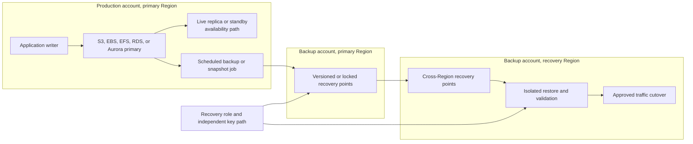

## Working model

Storage is a contract about names, operations, persistence, concurrency, and failure. Start with that contract, then choose a service.

An object store maps a key to an immutable byte sequence plus metadata. A block device exposes numbered blocks and leaves the filesystem or database to define higher-level structure. A shared filesystem exposes paths, directories, permissions, locks, and file operations to several clients. A relational database owns pages, logs, transactions, indexes, and recovery while presenting SQL to the application.

These interfaces are not interchangeable. Mounting an object bucket does not give it ordinary POSIX rename and locking semantics. Attaching one block volume to two hosts does not create a safe shared filesystem. Copying database files without coordinating the database does not necessarily create a recoverable database.

[CI1: Cloud foundations](01-cloud-foundations.md) introduced object, block, file, and managed relational storage as different access contracts. This note follows those contracts through replication, snapshots, backups, restore, RPO, RTO, and regional failure. [LL4: Linux storage and I/O](../02-low-level-infrastructure/04-storage-and-io.md) supplies the optional host-side path beneath filesystems, page cache, block devices, and durability barriers.

For every dataset, write down five boundaries:

| Boundary  | Question                                                                                  |
| --------- | ----------------------------------------------------------------------------------------- |
| Interface | Does the application need object keys, raw blocks, shared paths, or transactions?         |
| Commit    | What event tells the writer that data is durable enough to acknowledge?                   |
| Failure   | Is the copy tied to one host, one Availability Zone, one Region, one account, or one key? |
| History   | Can an operator recover the state from before a valid but harmful write?                  |
| Recovery  | How long does detection, restore, replay, validation, and traffic movement actually take? |

A durable primary can still be unavailable. A highly available replica can faithfully copy a deletion. An immutable backup can be useless if nobody can decrypt it or complete the restore before the business deadline. Treat durability, availability, consistency, and recoverability as separate properties.

## Read service claims literally

AWS documentation uses several kinds of statements. They carry different weight:

- **designed durability** is a service design target for retaining objects over time. It is not the chance that every individual request succeeds.
- **designed availability** describes expected access to a storage class. The service-level agreement is a separate document with its own measurement period, exclusions, and service-credit remedy.
- **consistency** says which results a completed read or list may return after writes. It does not promise a multi-object transaction unless the interface says so.
- **replication lag** measures how far a secondary copy trails. A median or recent maximum is evidence, not a permanent upper bound.
- **RPO and RTO** are objectives chosen by the workload owner. Buying a service does not establish that a full application meets them.

Amazon S3 Standard is designed for 99.999999999 percent annual object durability and 99.99 percent annual availability. The word **designed** matters. The multi-Availability-Zone S3 classes store data across at least three zones; S3 One Zone-IA and S3 Express One Zone deliberately use one zone. A workload still needs version history, access controls, recovery tests, and any required cross-Region copy.

## Match the interface before comparing prices

| Need                                                          | Natural AWS starting point | What the application receives                            | Primary failure boundary to notice                                        |
| ------------------------------------------------------------- | -------------------------- | -------------------------------------------------------- | ------------------------------------------------------------------------- |
| Large immutable values, exports, media, logs, backups         | Amazon S3                  | Bucket, key, version, object operations                  | Bucket Region, account authority, encryption key, storage-class placement |
| Boot disk, database files, low-latency random block I/O       | Amazon EBS                 | Zonal block device attached to EC2                       | Volume Availability Zone and attached instance path                       |
| Shared Linux paths over NFS                                   | Amazon EFS                 | Regional or one-zone NFS filesystem                      | File-system type, mount-target path, NFS client behavior                  |
| Host-local scratch, cache, shuffle, replicated temporary data | EC2 instance store         | Physical host-local block device                         | Instance and host lifetime                                                |
| Managed MySQL, PostgreSQL, and other relational engines       | Amazon RDS or Aurora       | SQL endpoint, transactions, managed storage and recovery | Deployment type, database Region, backup and key configuration            |

Latency does not appear in the first column because the interface comes first. After the contract fits, measure request size, concurrency, IOPS, throughput, tail latency, recovery behavior, and cost with the real workload.

## S3 stores objects, not mutable files

In a general purpose S3 bucket, an object is addressed by bucket, key, and, when versioning is enabled, version ID. A key such as `exports/2026/07/report.parquet` is one string. Prefixes let listing tools present a directory-like view, but they are not directories with filesystem rename or lock semantics.

A successful `PUT` creates or replaces the value for one key. S3 provides strong read-after-write consistency for object `PUT` and `DELETE` operations. A `GET`, `HEAD`, or `LIST` issued after the successful response observes that completed change. An update to one key is atomic: a concurrent reader gets the old value or the new value, never half of each.

The boundary is one key. S3 does not provide an atomic transaction across several keys. Concurrent writes to one key use last-writer-wins behavior based on the order S3 receives them, which may differ from the order clients began the requests or received acknowledgements. Use conditional requests, immutable keys plus a manifest pointer, or an external transaction coordinator when writers must reject lost updates.

Bucket configuration changes use separate control-plane APIs with their own propagation behavior. Do not infer that strong object consistency makes a new policy, versioning setting, or other bucket configuration instant everywhere; verify the effective configuration before depending on it.

### Storage classes change placement, access time, and billing rules

The object API stays mostly familiar across S3 storage classes, but failure placement and retrieval behavior change.

| Storage class                 | Placement and access                                                          | Minimum-duration or retrieval behavior to plan for                                                                                                         |
| ----------------------------- | ----------------------------------------------------------------------------- | ---------------------------------------------------------------------------------------------------------------------------------------------------------- |
| S3 Standard                   | At least three Availability Zones; millisecond access                         | No minimum storage duration                                                                                                                                |
| S3 Intelligent-Tiering        | At least three zones; objects move among access tiers from observed access    | Monitoring charge per eligible object; objects smaller than 128 KB remain in the Frequent Access tier; Archive Access and Deep Archive Access are optional |
| S3 Standard-IA                | At least three zones; millisecond access for infrequent reads                 | 30-day minimum, 128 KB minimum billable size, retrieval charge                                                                                             |
| S3 One Zone-IA                | One zone; millisecond access for recreatable or secondary data                | 30-day minimum, 128 KB minimum billable size, retrieval charge, no zone-loss resilience                                                                    |
| S3 Express One Zone           | One chosen zone in a directory bucket; lower-latency object access            | Different bucket type and feature set; no zone-loss resilience                                                                                             |
| S3 Glacier Instant Retrieval  | At least three zones; millisecond reads for rarely accessed archives          | 90-day minimum, 128 KB minimum billable size, retrieval charge                                                                                             |
| S3 Glacier Flexible Retrieval | At least three zones; archived object must be restored before ordinary access | 90-day minimum; retrieval takes minutes to hours depending on option                                                                                       |
| S3 Glacier Deep Archive       | At least three zones; archived object must be restored                        | 180-day minimum; retrieval takes hours                                                                                                                     |

Do not pick an archive class from storage price alone. Count transition requests, per-object metadata overhead, retrieval requests, restored-copy storage, data transfer, early deletion, and the time required to restore enough objects in parallel. A million tiny objects can behave very differently from one object of the same total size.

S3 Lifecycle rules can transition objects, expire current versions, permanently delete noncurrent versions, remove expired delete markers, and abort incomplete multipart uploads. Actions are asynchronous. In a versioned bucket, expiring a current object normally creates a delete marker; it does not remove all older versions. A separate noncurrent-version rule can permanently remove history. Review rule filters and Inventory output before enabling a broad expiration rule because a bucket policy cannot block a lifecycle action.

### Versioning preserves history, but authority is still shared

With versioning enabled, each successful replacement creates a new version ID. An ordinary delete adds a delete marker as the current version. An operator can remove that marker or copy an earlier version to a new current version.

Versioning protects against many accidental overwrites and deletes. It is not an independent backup by itself:

- the versions live in the same bucket and usually the same account;
- a principal allowed to delete object versions can remove the history;
- lifecycle rules can permanently delete noncurrent versions;
- disabling or weakening the surrounding policy changes the protection path;
- the same KMS key and account recovery path may still be required.

Use least-privilege version deletion, multi-factor or multi-party controls where applicable, policy-change monitoring, and a copy in a separate authority boundary when the threat model includes account compromise.

### Replication creates another live copy, asynchronously

S3 Same-Region Replication and Cross-Region Replication copy eligible versions to one or more destination buckets. Source and destination buckets must have versioning enabled. Live replication covers new eligible writes after the rule exists. Existing or previously failed objects require S3 Batch Replication.

Replication is asynchronous. An eligible source version reports `PENDING`, `COMPLETED`, or `FAILED`; a destination copy reports `REPLICA`. Missing role, bucket, or KMS permissions can move an object to `FAILED`. A temporary destination problem can leave it `PENDING`. Replication metrics expose pending operation count, pending bytes, maximum replication time, and failures.

Delete behavior is a design decision. Delete-marker replication is disabled by default, which can preserve the destination's visible object after a source delete. When enabled on an eligible prefix-based rule, S3 copies delete markers created by user deletion. Tag-based rules do not support delete-marker replication, and delete markers created by S3 Lifecycle expiration are not replicated. Permanently deleting a specific source version is not the same as creating a marker, and S3 does not replicate that version-specific deletion to the destination.

S3 Replication Time Control adds a 15-minute threshold and an SLA for eligible new objects, with documented scope and exclusions. It emits events when replication misses the threshold and when the late copy finishes; 15 minutes is not a per-object maximum. Ordinary replication has no fixed completion bound. Neither mode converts two buckets into an atomic multi-Region database.

### Object Lock makes selected versions harder to delete

S3 Object Lock requires versioning and applies retention to an object version, not to the key forever. A new version or delete marker can still become current while a retained older version remains protected.

- **governance mode** blocks ordinary deletion or retention reduction, but a principal with the explicit bypass permission can override it.
- **compliance mode** prevents deletion or shortening the retention period by any principal, including the account root user, until the retention date passes.
- **legal hold** has no fixed expiration date and remains until an authorized operation removes it.

Immutability makes mistakes expensive in both directions. Test retention periods, lifecycle compatibility, emergency access, and legal-hold procedures in a nonproduction bucket before locking a large archive.

### Multipart upload is a protocol with unfinished state

Multipart upload has three phases: initiate, upload numbered parts, then complete. Parts can arrive in parallel and be retried independently. A general purpose bucket supports up to 10,000 parts; each part is 5 MiB through 5 GiB except that the last part has no minimum. The current maximum assembled object is 48.8 TiB, commonly described as 50 TB.

The application must retain each part number and ETag for the completion request. A multipart ETag is not a plain MD5 digest of the assembled object. Ask S3 to validate a supported full-object or composite checksum and retain the checksum as recovery evidence.

Uploaded parts consume storage until the upload is completed or aborted. A lifecycle action can abort incomplete uploads after a chosen age. It removes unfinished parts, not completed objects.

### Failure trace: a valid S3 delete

Suppose a cleanup job sends `DELETE` for `exports/current/catalog.json` with valid authority.

1. S3 accepts the request and creates a delete marker because versioning is enabled.
2. A following `GET` without a version ID returns no object. Strong consistency makes the harmful change visible promptly.
3. Cross-Region Replication either copies the marker or does not, according to the rule. Replication did not decide whether the delete was desirable.
4. The retained prior version is still recoverable unless a version-specific delete, lifecycle rule, or retention failure removed it.
5. Object Lock on that prior version can prevent permanent deletion, but it does not stop a marker from hiding the key.
6. Recovery copies the chosen old version to a new current version, validates its checksum and contents, then records the recovered version ID.

The incident needs CloudTrail data events or other request evidence, object version listings, lock state, lifecycle configuration, and replication status. A current `404` alone cannot distinguish “never existed” from “hidden by a delete marker.”

## EBS exposes an Availability-Zone block device

An EBS volume is a persistent block device. EC2 presents it to an instance; the guest operating system places a partition table, filesystem, database, or another storage engine on top. EBS does not know whether two blocks form one SQL transaction or whether an application still has dirty pages in memory.

A volume is created in one Availability Zone and attaches to instances in that zone. EBS replicates volume data within that zone, but an EBS volume is not a cross-zone volume. If a workload moves to another zone, it needs another copy of the data, commonly a new volume created from a regional snapshot or application-level replication.

EBS volume types serve different I/O shapes:

- `gp3` is general-purpose SSD. Capacity, provisioned IOPS, and provisioned throughput can be selected independently within current limits.
- `gp2` is the previous general-purpose SSD generation. Baseline IOPS depends on size and smaller volumes use burst credits.
- `io2` and `io1` are provisioned-IOPS SSD choices for sustained random I/O. Current limits depend on volume, instance, and Region support.
- `st1` is throughput-optimized HDD for large sequential I/O.
- `sc1` is cold HDD for less frequent sequential access.

Do not compare only provisioned IOPS. Approximate useful throughput as:

```text
useful throughput <= min(
  application IOPS × average I/O size,
  volume throughput limit,
  instance EBS bandwidth limit,
  filesystem or database processing rate
)
```

SSD volume accounting caps one I/O at 256 KiB; larger requests can consume several operations. HDD-backed volumes favor large sequential requests and account up to 1,024 KiB as one operation. When arrivals exceed completions, queue length grows and tail latency rises. Observe request size, queue depth, latency, IOPS, throughput, throttling or balance metrics, and the EC2 instance's aggregate EBS limit together.

### A snapshot records blocks, not application intent

An EBS snapshot captures blocks written to the volume at the time the snapshot request begins. It does not include dirty data still cached by the application or operating system. For one filesystem, unmount it or freeze writes and flush buffers. For a database, use the engine's backup or snapshot integration, or put the engine into a documented backup state before snapshotting.

The first snapshot includes every written block. Later snapshots in the lineage store changed and new blocks. Each snapshot is logically a complete point-in-time image even though its physical storage is incremental. Deleting an earlier snapshot does not make a retained later snapshot partial; EBS keeps blocks still referenced by retained snapshots.

Multi-volume snapshots can establish one request-time boundary across selected volumes attached to an EC2 instance. They still exclude application and operating-system cache. A recoverable application may need a coordinated database checkpoint, filesystem freeze, volume-set tags, and a restore order.

Snapshot creation is asynchronous. The volume can continue serving I/O after the request, but the snapshot remains `pending` until changed blocks transfer. Treat only a completed recovery point as ready for an independent copy or restore plan.

### A restored volume can be available before it is warm

When a volume is created from a snapshot, snapshot blocks must be fetched into the new volume. Without an initialization option, the first read of a cold block can have higher latency. Three approaches have different operational and cost behavior:

- read every required block before traffic;
- request a provisioned initialization rate between the currently supported bounds;
- enable Fast Snapshot Restore for the snapshot in the target zone so new volumes start fully initialized.

An API state of `available` is not proof that the database has its normal tail latency. Recovery validation must include storage warm-up or a test showing that the cold-read penalty fits the service objective.

### Multi-Attach does not coordinate writers

EBS Multi-Attach can attach one `io1` or `io2` volume to as many as 16 supported Nitro instances in the same Availability Zone. Every attached instance has read-write block access.

Ordinary ext4 and XFS filesystems are not built for simultaneous mounting by independent servers. Buffer caches, allocation metadata, and journals can diverge and corrupt the filesystem. A safe design needs a cluster-aware filesystem or an application that owns write ordering and fencing. `io2` Multi-Attach supports NVMe reservations for I/O fencing, but the application still owns its coordination protocol. A volume-layer failure affects every attached host because they share one volume.

### Instance store is intentionally tied to the host

EC2 instance store exposes block devices physically attached to the host. It can provide high local bandwidth without a network storage hop. Its lifecycle is different from EBS:

- data survives an operating-system reboot;
- data does not survive stop, hibernate, terminate, or many host failure events;
- a volume cannot be detached and moved to another instance;
- an EBS-backed AMI does not capture instance-store data.

Use instance store for scratch space, caches, build intermediates, shuffle data, temporary model files, or application shards that another durable system can rebuild. If losing one host would lose the only accepted copy, instance store does not meet the persistence contract.

### Failure trace: an EBS-backed Pod moves zones

An application Pod uses an EBS persistent volume in zone A. The node and zone become unavailable.

1. Kubernetes may place a replacement Pod in zone B, but the existing EBS volume cannot attach across zones.
2. A multi-zone application replica can continue if it already owns a consistent copy. Otherwise, orchestration alone cannot move the blocks.
3. Recovery selects a completed regional snapshot and creates a new encrypted volume in zone B.
4. KMS authorization, volume creation quota, attach permission, device discovery, filesystem or database recovery, and block initialization all sit on the RTO path.
5. The application validates data and catches up any later log or event stream before it takes writes.
6. Traffic moves only after split-brain prevention proves that the old writer cannot return.

A snapshot interval determines only part of RPO. Any application journal, transaction log, or replicated event stream replayed after the snapshot can reduce actual data loss.

## EFS provides a shared NFS filesystem

Amazon EFS presents NFSv4.0 and NFSv4.1 to Linux clients. It owns paths, directories, metadata, and shared file data, so several compute instances can mount one filesystem without building a block-level cluster filesystem.

Regional EFS stores data and metadata across Availability Zones. Create a mount target in each used zone so clients reach a local zonal endpoint. One Zone EFS stores data in one selected zone and permits one mount target there. A client in another zone can reach that target if routing and policy allow it, but the filesystem remains a one-zone failure domain and cross-zone traffic applies.

Mount targets are network interfaces. Successful storage placement does not create network reachability. DNS, subnet routes, security groups, network ACLs, NFS port access, and client mount configuration remain part of the path. Encryption in transit uses the EFS mount helper's TLS path; encryption at rest is a separate file-system setting and key dependency.

### NFS consistency includes client caches

EFS provides the close-to-open consistency expected from NFS. Closing a file, or issuing a synchronous write such as `fsync`, is a meaningful publication boundary. A second client that opens the file after the writer closes it should observe the update. A process that keeps a file open can still interact with cached attributes or data according to NFS client behavior.

Regional EFS durably stores a synchronous write or a closed file across Availability Zones. Buffered asynchronous writes can finish from the application's point of view before every dirty page has reached that boundary. An application that needs a durable checkpoint must explicitly flush and check the result.

NFSv4 byte-range locks are advisory on EFS. Read and write operations do not reject a conflicting advisory lock automatically. Every participating process must use the same locking convention. A lock does not turn a series of file updates into a database transaction.

Renaming a completed file into place can be a useful publication pattern when the application and NFS semantics permit it:

1. write a temporary file on the same filesystem;
2. flush the file and check the result;
3. rename within the intended directory boundary;
4. flush directory metadata when the recovery contract requires it;
5. let readers open the published name instead of tailing the temporary file.

Test this sequence with the same client kernel, mount options, and failure injection used in production.

### File count and operation size can dominate performance

Every NFS operation has a round trip and service work. Large sequential I/O amortizes that cost. A workload that creates, stats, opens, locks, and removes millions of tiny files can run out of metadata operations long before it reaches a headline GiB-per-second limit.

Current EFS choices include:

- **General Purpose performance mode**, the normal choice for current file systems;
- **Max I/O**, a previous-generation mode with higher per-operation latency and feature restrictions;
- **Elastic throughput**, which adjusts throughput to workload demand within service and Region limits;
- **Provisioned throughput**, which reserves a configured throughput independent of stored size;
- **Bursting throughput**, where baseline and credits depend on data stored in the Standard class.

Measure `PercentIOLimit`, metered and permitted throughput, read and write bytes, client connections, and `BurstCreditBalance` when using Bursting mode. Spread independent work across directories and clients where possible. One hot directory, serialized lock, or single client connection can cap a workload even when the filesystem-wide allowance remains high.

### EFS replication is a recovery copy, not shared writable storage

EFS replication copies data and metadata to a read-only destination filesystem in the same or another Region, including supported cross-account designs. Changes are not transferred as one point-in-time transaction. The **last synced time** says which source changes are known to be present; later changes may be incomplete.

After the initial copy, EFS documents a 15-minute RPO for most file systems. More than 100 million files, files larger than 100 GB, or frequently changing large files can take longer. Monitor `TimeSinceLastSync` rather than treating 15 minutes as a universal ceiling.

Failover deletes the replication configuration, which makes the destination writable. It is an explicit state transition. During failback, choose whether to discard destination-side writes or reverse replication to preserve them. Mount targets, DNS, security groups, access points, application locks, and encryption-key access are not created by the data replication itself.

## RDS and Aurora own the database recovery protocol

A relational engine cannot be reduced to “files on storage.” It coordinates a buffer cache, write-ahead or redo log, transaction commit, checkpoints, page repair, locks, and crash recovery. RDS and Aurora manage much of the surrounding infrastructure, but the application still owns schema changes, transaction semantics, query load, connection behavior, and logical recovery decisions.

### RDS storage and compute remain separate limits

RDS for the standard relational engines uses EBS-backed database and log storage. Current primary choices are General Purpose SSD (`gp3` and previous-generation `gp2`) and Provisioned IOPS SSD (`io2` and `io1`, subject to engine support). Provisioned storage performance can still be capped by the DB instance class, request size, database locks, buffer-cache misses, or engine processing.

Watch free storage as a rate, not only a threshold. RDS storage autoscaling starts after free space remains at or below 10 percent for at least five minutes and after the storage-modification cooldown permits another change. Large ingest can fill the remaining space before the operation completes, and allocated storage cannot be scaled down in place. Keep headroom for temporary tables, index builds, vacuum or maintenance, transaction logs retained by a lagging replica, and recovery work.

### “Multi-AZ” names two different RDS topologies

| Deployment            | Database instances                                               | Replication and read use                                    | Failover role                               |
| --------------------- | ---------------------------------------------------------------- | ----------------------------------------------------------- | ------------------------------------------- |
| Single-AZ DB instance | One                                                              | No managed standby                                          | Restore or create another instance          |
| Multi-AZ DB instance  | One primary plus one standby in another zone                     | Synchronous standby; standby does not serve reads           | RDS switches the DB endpoint to the standby |
| Multi-AZ DB cluster   | One writer plus two readable instances in three zones            | Semisynchronous replication; readers can serve read traffic | A readable instance can become writer       |
| Read replica          | Separately created replica, same or cross-Region where supported | Engine-native asynchronous replication; read scaling or DR  | Manual promotion is a separate operation    |

A Multi-AZ standby is not a backup. It receives the primary's database changes, including a valid `DROP TABLE`. It protects the serving path from selected instance or zone failures. A read replica is also not a historical copy; lag can create stale reads and an unplanned promotion can lose transactions that had not arrived.

For a Multi-AZ DB instance, AWS documents failovers commonly taking 60 to 120 seconds, with longer recovery possible for large transactions or other conditions. This is observed service behavior, not a per-event deadline. The writer endpoint's DNS target changes. Existing connections fail, clients must resolve the endpoint again, and in-flight transactions need safe retry behavior. Test runtime DNS caching, pool health checks, transaction timeout, idempotency, and old-writer fencing.

### Aurora separates compute from a shared cluster volume

An Aurora cluster volume stores copies across three Availability Zones. Writes from the writer are synchronously replicated to six storage nodes. Storage placement exists even if the cluster has only one DB instance.

The cluster has one writer compute instance. Up to 15 Aurora Replicas can attach to the same logical cluster volume for read traffic and failover. They do not each maintain an independent full EBS database copy, but their compute state and visibility can still trail the writer. The reader endpoint balances new connections among readers; it does not balance each query on an existing connection.

When the writer fails, Aurora can promote a reader according to failover tiers. A reader of the same class in another zone shortens this path. Without any reader, Aurora must create a replacement writer, which takes longer. The cluster endpoint follows the current writer, but clients still need to handle broken connections and uncertain transaction outcomes.

Aurora Global Database adds read-only clusters in other Regions and replicates asynchronously from the primary Region. A planned switchover waits for synchronization and is designed for zero data loss while all participating systems are healthy. An unplanned failover can lose data; the loss depends on cross-Region replication lag at the event. Global Database does not replicate every application dependency, secret, network rule, queue, or DNS record.

### Backups and PITR create a new database

RDS automated backups combine storage snapshots and transaction logs so a DB instance can be restored to a point inside its retention window. A DB instance retention period can be 0 through 35 days; zero disables automated backups. A Multi-AZ DB cluster uses 1 through 35 days. Aurora continuously and incrementally backs up its cluster volume and requires a 1-through-35-day retention period.

Point-in-time restore uses an **earliest restorable time** and **latest restorable time**. The latest time often trails current time by several minutes. Query the live value rather than assuming “now.” A restore creates a new DB instance or Aurora cluster. It does not rewind the original in place.

The new resource needs the intended instance class, storage, subnet group, security groups, parameter and option groups, certificates, IAM associations, monitoring, secrets, proxies, replicas, alarms, and DNS or service-discovery path. API defaults can differ from the source. A successful restore job is only the beginning of database recovery.

Manual snapshots persist until deleted and are useful beyond the automated window. They still need a retention policy, copy policy, key policy, inventory, and restore test. A manual snapshot captures one database time; it does not preserve later transaction logs unless another mechanism does.

### RDS Proxy changes connection handling, not transaction truth

RDS Proxy maintains database connections and lets client sessions reuse them at transaction boundaries. It can absorb connection bursts and avoid application delay from a database endpoint DNS change during failover.

Session state can **pin** one client to one database connection. Temporary tables, selected session variables, prepared statements, advisory locks, cursors, and other engine-specific features can reduce multiplexing. Monitor pinned connections instead of assuming every client pool is compressed.

The proxy does not make every failed transaction safe to replay. If a connection breaks after `COMMIT` reached the writer but before the client received the response, the outcome is uncertain. Use an idempotency key, transaction-status record, or application reconciliation before repeating a non-idempotent operation.

### Failure trace: logical database corruption

A migration executes an unintended update at 14:07. The statement commits successfully.

1. Multi-AZ replication and Aurora storage preserve the bad write. High availability is working as designed.
2. Read replicas and cross-Region replicas receive the change after their respective lag. Pausing one after discovery may preserve a useful inspection point, but it is not a dependable backup policy.
3. Operators stop further harmful writes and record the incident time, transaction evidence, affected tables, current latest restorable time, and known good boundary.
4. PITR creates a new database at 14:06 or another validated time before corruption.
5. The team reapplies legitimate writes after that point from an event log, audit table, dual-write repair source, or controlled comparison. If no such source exists, those good writes are part of data loss.
6. Schema, users, extensions, parameters, secrets, network policy, jobs, and external consumers are checked before traffic moves.
7. The old database becomes read-only evidence. It is not destroyed until reconciliation and retention requirements are satisfied.

This is why an RPO measured only as backup pipeline lag can be misleading. For logical corruption, the chosen recovery point may need to precede detection by minutes or hours.

## A replica and a backup answer different failures

| Property                         | Synchronous or asynchronous replica         | Versioned or point-in-time backup                             |
| -------------------------------- | ------------------------------------------- | ------------------------------------------------------------- |
| Main job                         | Keep serving or shorten failover            | Recover an earlier state                                      |
| Data freshness                   | Near current, subject to commit rule or lag | Deliberately historical                                       |
| Valid delete or corrupt write    | Usually propagates                          | Older recovery point can remain                               |
| Infrastructure failure           | Can take traffic if full stack is ready     | Requires provisioning and restore                             |
| Ransomware or account compromise | May share the same authority                | Separate account plus immutable retention can preserve a copy |
| Recovery proof                   | Failover test and lag evidence              | Restore, decrypt, validate, and reconciliation test           |

Use both when the requirements need both. More copies are useful only when they do not share every failure mode.

## RPO and RTO are end-to-end budgets

**Recovery point objective (RPO)** is the maximum acceptable time between the last recoverable state and the disruption. It bounds acceptable data loss measured in time. **Recovery time objective (RTO)** is the maximum acceptable delay from disruption until the service is restored to its required state.

Neither is an average. They are workload objectives, and each incident class can need a different pair. A zonal instance failure, operator delete, KMS policy failure, account compromise, and Region outage do not have the same recovery path.

The measured recovery time is a sum of dependent work:

```text
actual recovery time =
  detection
  + diagnosis and declaration
  + access to the recovery authority
  + infrastructure provisioning
  + data restore and log replay
  + application and dependency configuration
  + integrity and functional validation
  + traffic movement
  + backlog recovery to the promised service level
```

Parallel work can shorten the wall clock, but only when dependencies permit it. DNS cannot safely move before the new writer is fenced and validated. Log replay cannot begin before the base restore reaches the required state.

## Put recovery copies behind different authorities

One useful pattern separates the live account from the backup account and places another copy in a recovery Region.

_Live replicas reduce serving interruption. Immutable recovery points preserve history under a different authority._



Cross-account is an authority boundary, not magic isolation. Organization administrators, shared identity providers, backup policies, KMS administrators, and automation can still create common failure. Record who can delete a recovery point, shorten retention, change a vault or bucket policy, disable a key, assume the restore role, or close the account.

AWS Backup Vault Lock can enforce WORM retention in governance or compliance mode. After the compliance-mode change window closes, privileged users including the account root user cannot delete retained recovery points early or change the lock. Vault Lock does not preserve a standard backup vault indefinitely after account closure: AWS holds the closed account for 90 days and then deletes the vault if the account is not reopened.

A logically air-gapped vault adds compliance-mode locking, service-owned storage placement, and supported sharing or multi-party recovery paths. When configured with multi-party approval, its backups can remain available for copy or restore during the documented post-closure period even if the owning account is inaccessible; access ends when that period expires. The vault remains part of an online managed service, so “logically air-gapped” should not be confused with offline media.

### Encryption keys are part of the backup

Envelope-encrypted data needs the encrypted data and a usable KMS authorization path. A snapshot catalog can look healthy while restore fails because:

- the KMS key is disabled, pending deletion, or deleted;
- the destination account cannot use the source customer-managed key;
- a snapshot encrypted under an AWS managed default key cannot be shared in the intended way;
- the recovery Region lacks the expected key, alias, policy, or grant;
- the backup service role can copy but the restore role cannot decrypt;
- an organization policy or VPC endpoint policy blocks KMS during the exercise.

For EBS and RDS encrypted cross-account snapshots, a common flow is to copy under a customer-managed key whose policy permits the destination, share the snapshot, then copy it in the destination account under a destination-owned key. Test the exact resource and engine because AWS Backup, S3, EBS, EFS, RDS, and Aurora have different copy and encryption rules.

Do not delete an old key after “rotation” until inventory proves that every retained recovery point has been re-encrypted, expired, or intentionally abandoned. Rotating KMS key material does not rewrite old ciphertext; KMS retains old material for decryption while the key exists and remains usable.

### Back up the system around the data

A database restore cannot serve traffic without its environment. Preserve or regenerate:

- infrastructure definitions, artifact digests, and deployment configuration;
- database parameters, extensions, users, schema migration state, and scheduled jobs;
- DNS, certificates, load-balancer and network policy;
- secrets and their regional KMS path;
- queue offsets, external integration state, and idempotency records;
- account bootstrap, break-glass identity, quotas, and recovery-role trust;
- runbooks and evidence outside the failed account.

Infrastructure as code reduces drift only if the recovery account can fetch the code, provider plugins, images, packages, and secrets during the incident. Cache or copy the dependencies required by the stated threat model.

## Worked case: bound replication exposure

Suppose an export service writes 12,000 S3 objects per second with an average object size of 8 KiB. During a recovery exercise, measured Cross-Region Replication lag reaches 90 seconds.

If the primary Region became unavailable at that observed lag, the data still in flight would be approximately:

```text
objects at risk = 12,000 objects/s × 90 s
                = 1,080,000 objects

bytes at risk = 1,080,000 × 8 KiB
              = 8,847,360,000 bytes
              ≈ 8.24 GiB
```

This is a capacity estimate from one observation, not an RPO guarantee. Larger objects, failed replication, KMS denial, a backlog older than the metric window, or an outage during a traffic spike can increase exposure. Alarm on pending bytes, maximum replication time, and failed operations. Compare the resulting loss to the business RPO in both time and object count.

If the required RPO is 30 seconds, a 90-second exercise result fails even if every object eventually replicates. The design must reduce input during lag, use a stronger replication contract where applicable, keep a separate write-ahead source, or revise the business objective.

## Worked case: calculate EBS initialization time

A completed EBS snapshot reports 2 TiB in `FullSnapshotSizeInBytes`. Recovery creates a volume with a provisioned initialization rate of 250 MiB/s.

```text
data = 2 TiB × 1,048,576 MiB/TiB
     = 2,097,152 MiB

nominal initialization time = 2,097,152 MiB / 250 MiB/s
                            = 8,388.6 s
                            ≈ 140 minutes
```

Add 12 minutes to provision the instance and volume, 7 minutes to attach, boot, and run database crash recovery, and 18 minutes for integrity and application checks:

```text
nominal recovery path = 140 + 12 + 7 + 18
                      = 177 minutes
                      = 2 hours 57 minutes
```

A three-hour RTO has only three minutes of nominal margin. AWS specifies that a provisioned initialization rate is delivered as an average within 10 percent of the requested rate for 99 percent of the time, so this quotient is not a completion deadline. Fast Snapshot Restore, a higher allowed initialization rate, a smaller recovery working set, or a warm replica may be required. A test that starts traffic immediately and ignores cold-block latency measures a different service state.

## Worked case: recover from a bad database migration

The database has a 90-minute RTO and 15-minute RPO. A bad migration begins at 14:43. Monitoring first alerts at 14:52; operators confirm the scope and stop writes at 15:00. The latest restorable time is 14:56, but that point already contains the bad transaction. Operators choose 14:42.

The recovery-point loss before reconciliation is:

```text
15:00 write stop - 14:42 recovery point = 18 minutes
```

That misses the 15-minute RPO by three minutes even though the backup pipeline is only four minutes behind current time. Logical recovery had to move farther back than the latest available point.

The timed exercise records:

| Phase                                          | Minutes |
| ---------------------------------------------- | ------: |
| Corruption to detection and scope confirmation |      17 |
| Declare recovery and obtain approval           |       7 |
| Provision target database                      |      12 |
| Restore and replay logs                        |      46 |
| Apply network, parameters, secrets, and jobs   |      11 |
| Validate data and application behavior         |      15 |
| Move traffic                                   |       5 |
| **Total**                                      | **113** |

The path misses RTO by 23 minutes. Starting the clock at the 14:52 alert would hide nine minutes of real outage exposure. Running provisioning and configuration in parallel could help, but validation cannot be removed. A better plan also retains an application event log so valid writes from 14:42 onward can be reconciled before or after cutover according to product rules.

## Failure trace: the backup exists but the key does not work

An encrypted cross-account snapshot is visible in the recovery account, but restore returns a KMS access error.

1. Confirm the snapshot's actual encryption key ARN and Region rather than relying on an alias name.
2. Inspect key state. `Disabled`, `PendingDeletion`, missing imported material, or an unavailable custom key store prevents needed cryptographic operations.
3. Check the source key policy, destination restore-role policy, grants, organization controls, and service-specific permissions.
4. Determine whether the destination must first copy the shared snapshot under a destination-owned key.
5. Preserve the KMS request ID, CloudTrail events, snapshot copy state, and restore job error.
6. After repair, restore and read application data. A successful KMS API call alone does not prove database recovery.

This incident is prevented by a restore exercise using the real recovery role and destination key path, not by a report that counts snapshots.

## Operator evidence

| System         | Evidence to retain and alarm on                                                                                                                        | Question it answers                                                                      |
| -------------- | ------------------------------------------------------------------------------------------------------------------------------------------------------ | ---------------------------------------------------------------------------------------- |
| S3             | Version ID, checksum, storage class, lifecycle rules, Object Lock retention, replication status and pending bytes, CloudTrail data events, Inventory   | Which bytes exist, which version is current, can it be deleted, and did the copy finish? |
| EBS            | Volume type and zone, IOPS and throughput settings, queue and latency metrics, snapshot state and full snapshot size, initialization state, KMS key    | Can the block path meet latency now, and how long will a target-zone restore take?       |
| Instance store | Instance lifecycle, device mapping, rebuild source, replication status                                                                                 | What disappears with this host, and how is it rebuilt?                                   |
| EFS            | File-system type, mount targets, client mount options, `PercentIOLimit`, throughput and credits, `TimeSinceLastSync`, backup jobs                      | Is the limit network, NFS client behavior, operation rate, or replication lag?           |
| RDS            | Deployment type, events, `FreeStorageSpace`, IOPS and latency, connections, `ReplicaLag`, earliest and latest restorable time, snapshot and copy state | Is the problem capacity, failover, lag, or recovery-point availability?                  |
| Aurora         | Writer and reader topology, failover tiers, reader lag, cluster-volume use, global replication lag, restorable times                                   | Which compute can be promoted, and how much cross-Region data is exposed?                |
| RDS Proxy      | Client and database connections, borrow latency, pinned sessions, target health                                                                        | Is pooling working, or has session state removed multiplexing?                           |
| AWS Backup     | Backup and copy job state, recovery-point ARN, vault and lock state, retention, restore job result, Audit Manager evidence                             | Is there a retained copy under the expected authority, and has it been restored?         |
| KMS            | Exact key ARN and Region, key state, policy, grants, pending deletion, CloudTrail operations                                                           | Can the recovery role decrypt every retained copy now?                                   |

An inventory is evidence of existence, not recoverability. A useful recovery record includes the selected recovery point, its age, restore start and end, decryption result, application queries, integrity checks, traffic decision, achieved RPO and RTO, and every manual step.

## Recovery review

For each production dataset, answer these questions from current evidence:

1. What exact operation constitutes a committed write?
2. Which host, zone, Region, account, organization administrator, identity provider, and KMS key can remove access to every copy?
3. Which replica serves availability, and what is its observed and alarmed lag?
4. Which recovery point predates a valid delete or corrupt transaction?
5. Can the primary account administrator shorten or delete its retention?
6. Does a cross-Region copy include existing data, new data, deletes, metadata, and encryption in the intended way?
7. Can the recovery account deploy compute, networking, secrets, and DNS without the primary control plane?
8. How long did the latest full restore take, including warm-up, reconciliation, validation, and backlog drain?
9. What data was intentionally not backed up because it can be regenerated, and was regeneration timed?
10. Who may declare failover, how is the old writer fenced, and how is failback performed without losing new writes?

If an answer begins with “the service should,” replace it with a document link, a live configuration value, a metric, or a timed restore result.

## Summary

Choose storage from the application interface and failure boundary. S3 provides strongly consistent operations on individual object keys, while versioning, lifecycle, replication, Object Lock, and multipart upload each add a separate state machine. Storage classes change zone placement, retrieval delay, minimum duration, and cost behavior.

- EBS is a zonal block device. Snapshot consistency depends on flushing application state, and a restored volume may need initialization before it reaches normal latency.
- Multi-Attach exposes shared blocks; it does not supply a cluster filesystem or writer fencing by itself.
- Instance store is host-local temporary storage. Use it only when another system can rebuild the accepted data.
- EFS provides shared NFS paths with close-to-open consistency, client caching, and advisory locking. Regional and One Zone filesystems have different failure placement.
- RDS Multi-AZ standbys, read replicas, Aurora Replicas, and Aurora Global Database solve different availability and read-scaling problems. They are not historical backups.
- RDS and Aurora PITR create new database resources. Network, parameters, secrets, jobs, clients, and validation remain on the recovery path.
- A replica reduces interruption; a backup preserves an earlier state. Valid harmful writes commonly propagate to replicas.
- RPO bounds acceptable data loss. RTO bounds end-to-end recovery delay. Measure both in restore exercises, including detection, replay, warm-up, validation, traffic movement, and backlog.
- Cross-account and cross-Region copies reduce common failures only when identity, organization, policy, and KMS authority are also separated.
- Immutability can protect recovery points from privileged deletion. It must be configured before the incident and tested before its change window closes.
- A backup is proven only after the intended recovery role decrypts it, restores it, and passes application-level checks.

## References

### Amazon S3

- [Amazon S3 object model and consistency](https://docs.aws.amazon.com/AmazonS3/latest/userguide/Welcome.html)
- [Amazon S3 data protection and durability](https://docs.aws.amazon.com/AmazonS3/latest/userguide/DataDurability.html)
- [Amazon S3 storage classes](https://docs.aws.amazon.com/AmazonS3/latest/userguide/storage-class-intro.html)
- [Amazon S3 Versioning](https://docs.aws.amazon.com/AmazonS3/latest/userguide/Versioning.html)
- [Amazon S3 replication requirements](https://docs.aws.amazon.com/AmazonS3/latest/userguide/replication-requirements.html)
- [Amazon S3 replication status](https://docs.aws.amazon.com/AmazonS3/latest/userguide/replication-status.html)
- [Amazon S3 delete-marker replication](https://docs.aws.amazon.com/AmazonS3/latest/userguide/delete-marker-replication.html)
- [Amazon S3 Replication Time Control](https://docs.aws.amazon.com/AmazonS3/latest/userguide/replication-time-control.html)
- [Amazon S3 Object Lock](https://docs.aws.amazon.com/AmazonS3/latest/userguide/object-lock.html)
- [Amazon S3 multipart upload limits](https://docs.aws.amazon.com/AmazonS3/latest/userguide/qfacts.html)
- [Amazon S3 Lifecycle expiration behavior](https://docs.aws.amazon.com/AmazonS3/latest/userguide/lifecycle-expire-general-considerations.html)

### Block, local, and file storage

- [Amazon EBS volumes](https://docs.aws.amazon.com/ebs/latest/userguide/ebs-volumes.html)
- [Amazon EBS I/O characteristics](https://docs.aws.amazon.com/ebs/latest/userguide/ebs-io-characteristics.html)
- [How Amazon EBS snapshots work](https://docs.aws.amazon.com/ebs/latest/userguide/how_snapshots_work.html)
- [Creating application-consistent EBS snapshots](https://docs.aws.amazon.com/ebs/latest/userguide/ebs-creating-snapshot.html)
- [Initializing EBS volumes](https://docs.aws.amazon.com/ebs/latest/userguide/initalize-volume.html)
- [Amazon EBS Multi-Attach](https://docs.aws.amazon.com/ebs/latest/userguide/ebs-volumes-multi.html)
- [EC2 instance-store persistence](https://docs.aws.amazon.com/AWSEC2/latest/UserGuide/instance-store-lifetime.html)
- [Amazon EFS features and consistency](https://docs.aws.amazon.com/efs/latest/ug/features.html)
- [Amazon EFS performance](https://docs.aws.amazon.com/efs/latest/ug/performance.html)
- [Amazon EFS replication](https://docs.aws.amazon.com/efs/latest/ug/efs-replication.html)
- [NFS version 4.1 protocol, RFC 8881](https://www.rfc-editor.org/rfc/rfc8881.html)

### Amazon RDS and Aurora

- [Amazon RDS Multi-AZ deployments](https://docs.aws.amazon.com/AmazonRDS/latest/UserGuide/Concepts.MultiAZ.html)
- [Amazon RDS read replicas](https://docs.aws.amazon.com/AmazonRDS/latest/UserGuide/USER_ReadRepl.html)
- [Amazon RDS storage](https://docs.aws.amazon.com/AmazonRDS/latest/UserGuide/CHAP_Storage.html)
- [Amazon RDS automated backups](https://docs.aws.amazon.com/AmazonRDS/latest/UserGuide/USER_WorkingWithAutomatedBackups.html)
- [Amazon RDS point-in-time restore](https://docs.aws.amazon.com/AmazonRDS/latest/UserGuide/USER_PIT.html)
- [Amazon RDS Proxy concepts](https://docs.aws.amazon.com/AmazonRDS/latest/UserGuide/rds-proxy.howitworks.html)
- [Avoiding RDS Proxy connection pinning](https://docs.aws.amazon.com/AmazonRDS/latest/UserGuide/rds-proxy-pinning.html)
- [Amazon Aurora storage](https://docs.aws.amazon.com/AmazonRDS/latest/AuroraUserGuide/Aurora.Overview.StorageReliability.html)
- [Amazon Aurora high availability](https://docs.aws.amazon.com/AmazonRDS/latest/AuroraUserGuide/Concepts.AuroraHighAvailability.html)
- [Amazon Aurora backup and restore](https://docs.aws.amazon.com/AmazonRDS/latest/AuroraUserGuide/Aurora.Managing.Backups.html)
- [Amazon Aurora Global Database recovery](https://docs.aws.amazon.com/AmazonRDS/latest/AuroraUserGuide/aurora-global-database-disaster-recovery.html)

### Backup, encryption, and recovery objectives

- [AWS Backup Vault Lock](https://docs.aws.amazon.com/aws-backup/latest/devguide/vault-lock.html)
- [AWS Backup logically air-gapped vaults](https://docs.aws.amazon.com/aws-backup/latest/devguide/logicallyairgappedvault.html)
- [AWS Backup cross-account copies](https://docs.aws.amazon.com/aws-backup/latest/devguide/create-cross-account-backup.html)
- [AWS KMS key states](https://docs.aws.amazon.com/kms/latest/developerguide/key-state.html)
- [AWS Well-Architected disaster-recovery objectives](https://docs.aws.amazon.com/wellarchitected/latest/reliability-pillar/disaster-recovery-dr-objectives.html)
- [AWS Well-Architected periodic recovery testing](https://docs.aws.amazon.com/wellarchitected/latest/framework/rel_backing_up_data_periodic_recovery_testing_data.html)
- [NIST SP 800-34 Rev. 1, Contingency Planning Guide](https://nvlpubs.nist.gov/nistpubs/legacy/sp/nistspecialpublication800-34r1.pdf)
