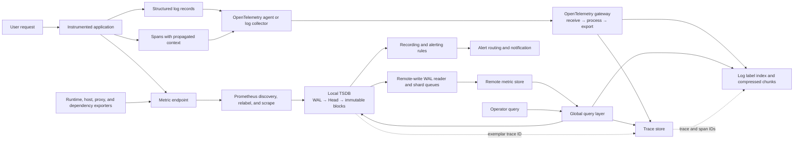

## Working model

An observability system is a set of data pipelines that compete for CPU, memory, network, disk, and operator attention. It can delay, duplicate, reject, sample, mislabel, or lose the evidence it was built to preserve.

Keep four boundaries separate:

| Boundary               | What happens there                                                                                    | Typical failure                                                                        |
| ---------------------- | ----------------------------------------------------------------------------------------------------- | -------------------------------------------------------------------------------------- |
| Instrumentation        | Application, runtime, kernel, proxy, or device creates a measurement or event                         | Wrong unit, missing context, unbounded attributes, work recorded twice                 |
| Collection             | A scraper, agent, or gateway receives telemetry and may filter, batch, transform, sample, or queue it | Target discovery drift, full queue, overload shedding, partial trace                   |
| Storage and query      | A backend indexes and retains data, then evaluates queries over it                                    | Disk full, hot shard, expensive query, compaction lag, expired evidence                |
| Rules and notification | A rule converts stored data into a state transition and a notifier routes it                          | Late evaluation, missing data interpreted as healthy, duplicate notification, no owner |

A green dashboard proves only that its queries returned an expected result. It does not prove that every source emitted data, every collector accepted it, storage retained it, or the rule engine evaluated it on time. Monitor the telemetry path with evidence that does not depend entirely on the same failed path.

[CI10](10-production-operation.md) defines service-level indicators (SLIs), service-level objectives (SLOs), autoscaling signals, and the incident comparison order. [SD10](../03-system-design/10-reliability-observability.md) derives error budgets, regional operating evidence, and multiwindow burn-rate alerts. [LL7](../02-low-level-infrastructure/07-observability-and-debugging.md) covers process identity, Linux counters, profiles, traces, Pressure Stall Information, and crash evidence. This note follows the telemetry machinery underneath those uses.

## Follow the complete data path

Metrics, logs, and traces represent different data shapes:

- A **metric sample** associates a timestamped value with a metric name and a bounded label set. Repeated samples form a time series.
- A **log record** describes one event with a timestamp, body, severity, resource identity, and optional structured fields.
- A **span** records one timed operation. Spans with the same trace ID form a trace; parent IDs and links describe causality.
- A **profile** samples code locations and resource use. OpenTelemetry profile support is still under development, so treat its SDK, transport, and backend path as version-sensitive.

The same request can create all four, but correlation does not merge their storage models. A latency histogram might carry an exemplar containing a trace ID. That ID opens one trace, whose span ID can locate related structured logs. The trace ID must not become a Prometheus label: one value per request would create an unbounded number of time series.

_One request emits metrics, logs, and spans; separate collectors and stores preserve each data shape, while rules and queries reconnect them through bounded resource attributes and trace context._



Each arrow needs a contract: protocol, authentication, timeout, retry classification, queue limit, ordering rule, tenant identity, maximum item size, and behavior after overflow. A line labeled “telemetry” hides every one of those decisions.

## Instrument the operation, not the implementation accident

Start with the event that matters. For an HTTP handler, useful measurements include request count, duration distribution, response class, in-flight requests, and dependency outcomes. A method name or normalized route may be a bounded dimension. A raw URL, customer ID, request ID, error string, SQL text, or stack trace is not.

Resource identity answers where telemetry came from: service name, service version, deployment environment, region, cluster, or cell. Event attributes answer what occurred: HTTP method, status code, queue operation, database system, or exception type. Keep both consistent across instrumentation libraries and collectors. If two writers produce one logical metric stream with different resource identity, they create separate series; if they produce the same identity with unrelated values, they corrupt one stream.

Instrumentation has a cost before any collector sees the data. A counter update touches process memory. A histogram observation updates bucket state. A span allocates identifiers and attributes, propagates headers, and may enqueue an export. A structured log serializes bytes and can block or allocate when its destination slows. Measure instrumentation CPU, allocation, queue pressure, and dropped telemetry under realistic load.

Do not let telemetry change the protected operation's result. An exporter timeout should not hold a checkout request open indefinitely, and a full logging pipe should have an explicit policy instead of accidentally filling application memory. Audit and security events may need a stronger durability path than debug logs; that choice belongs in the event contract.

## Prometheus pulls current metric state

Prometheus normally discovers HTTP targets and scrapes each target's metric endpoint on a schedule. The target exposes its current counters, gauges, and distribution state; Prometheus assigns the scrape timestamp unless configured to honor an explicit timestamp. Pulling gives the server an independent view of target reachability and lets another Prometheus instance scrape the same target without changing the application.

A **job** groups targets with the same purpose. An **instance** is one scraped endpoint, normally represented by the `instance` label. For every target, Prometheus also creates:

- `up{job="...",instance="..."}`, where `1` means the scrape succeeded and `0` means it failed;
- `scrape_duration_seconds`, the scrape duration;
- `scrape_samples_scraped`, the number of samples the target exposed;
- `scrape_samples_post_metric_relabeling`, the count left after metric relabeling.

Those synthetic series belong to the scrape path, not the application. `up == 1` says Prometheus parsed the target response within the scrape contract; it says nothing about a downstream database or the correctness of the application's own metrics.

Suppose a target exposes a counter value of 8,100 at 12:00:00 and 8,250 at 12:00:15. Prometheus stores two cumulative samples. A rate function estimates the increase per second while accounting for counter resets. Storing only “150 requests happened since the last scrape” in a gauge would make missed scrapes and process restarts ambiguous.

Scrape interval is a resolution and cost choice. With `N` active series and scrape interval `I` seconds, the sample rate is approximately:

```text
samples per second = N series / I seconds
```

One million active series scraped every 15 seconds produce:

```text
1,000,000 samples / 15 s = 66,667 samples/s
```

Changing the interval to 30 seconds halves the sample rate to about 33,333 samples/s, but a short-lived spike may disappear between scrapes and collection delay grows. Reducing unnecessary series is usually more effective because every active series also consumes index and Head memory.

## Discovery decides what could be scraped; relabeling decides what will be scraped

Static target lists fail when instances appear and disappear automatically. Service discovery reads a source such as the Kubernetes API, DNS, cloud provider APIs, Consul, or a file and produces target groups with temporary metadata labels. Prometheus then runs target relabeling before scheduling the scrape.

The order matters:

1. Discovery creates a candidate address and `__meta_*` labels.
2. `relabel_configs` can keep or drop the target, copy metadata into durable labels, replace `__address__`, or change the scheme and metrics path.
3. Labels beginning with `__` are removed after target relabeling unless the configuration copies them to ordinary labels.
4. Prometheus scrapes the surviving target and attaches the resulting target labels.
5. `metric_relabel_configs` run on individual scraped samples immediately before ingestion. They can drop unwanted series or labels, but the network transfer and parsing cost already happened.
6. External labels identify this Prometheus server when it communicates with external systems. `write_relabel_configs` can make a final selection before one remote-write destination.

A Kubernetes discovery rule that copies a Pod UID into an ordinary metric label creates churn even if the application's metric schema is clean. Keep long-lived dimensions such as cluster, namespace, service, and normalized workload. Pod names and UIDs belong in target investigation, logs, or traces unless a short retention and bounded fleet make their cost intentional.

Dropping a target through relabeling is different from failing its scrape. A dropped target does not produce `up == 0` because it is no longer a target. Monitor discovery counts, dropped-target views, configuration reload results, and expected coverage separately from target health.

## Staleness prevents a dead target from looking alive forever

An instant PromQL query evaluates at a chosen timestamp. For an ordinary series without a newer stale marker, Prometheus selects the newest sample within the lookback period, five minutes by default. Without staleness, a removed target's last gauge could continue to look current until that lookback expired.

Prometheus marks a series stale when a successful scrape or rule evaluation no longer returns it. When a target disappears from service discovery, Prometheus normally delays stale markers by about two scrape intervals in case the target reappears. If Prometheus restarts before writing those delayed markers, they are lost and the query falls back to the lookback rule. A query after a stored marker returns no value for that series. Remote Write 1.0 also specifies a special stale-NaN marker so the receiver can preserve this state change.

Missing data needs a deliberate interpretation:

- `up == 0` means the target remained selected but its scrape failed.
- An absent `up` series can mean discovery removed the target, relabeling dropped it, the Prometheus server stopped, or the query cannot see that shard.
- An absent application series with `up == 1` can mean the application stopped exposing it, metric relabeling dropped it, its label set changed, or the query is wrong.
- An old sample inside the lookback is not proof that the source emitted recently; inspect its timestamp and scrape evidence.

The scrape option `track_timestamps_staleness` changes behavior for metrics that carry explicit timestamps and is disabled by default in current Prometheus configuration. Treat explicit target timestamps carefully: skewed clocks and repeated old timestamps make freshness harder to reason about.

## Counters, gauges, and histograms preserve different facts

| Type              | Stored fact                                                       | Correct use                                                                | Common mistake                                                                                 |
| ----------------- | ----------------------------------------------------------------- | -------------------------------------------------------------------------- | ---------------------------------------------------------------------------------------------- |
| Counter           | Cumulative total that increases until reset                       | Requests, bytes, failures, completed jobs                                  | Reading the raw total as a rate or using it for a value that decreases                         |
| Gauge             | Current value that may rise or fall                               | In-flight work, queue depth, temperature, allocated bytes                  | Summing values whose meaning is not additive or using a last value as a historical event count |
| Classic histogram | Cumulative bucket counters plus total count and sum               | Aggregatable latency or size distribution with fixed boundaries            | Omitting the SLO boundary, treating buckets as noncumulative, or averaging percentiles         |
| Native histogram  | One composite histogram sample with dynamically populated buckets | Aggregatable distributions with finer resolution and fewer separate series | Assuming current clients, scrapers, remote-write path, and backend all enable and retain it    |

A rate over a counter measures change during a window and detects resets. A gauge can represent queue depth, but `rate(queue_depth[5m])` rarely answers arrival or completion rate because both processes change the value. Instrument arrival and completion counters as well.

Classic histogram buckets are cumulative. If a request took 120 ms, it increments every configured bucket whose upper bound is at least 120 ms, plus `_count` and `_sum`. This makes bucket rates additive across replicas and lets `histogram_quantile` estimate a percentile after aggregation. The estimate depends on bucket placement; it cannot recover the original observations.

Native histograms encode a distribution as one histogram sample, with a zero bucket and sparse positive and negative buckets governed by a schema. Prometheus marked native histograms stable starting in version 3.8. Current 3.x deployments still need `scrape_native_histograms: true` to ingest them, and Remote Write 1.x needs `send_native_histograms: true`; the Remote Write 2.0 message carries them by default. The published plan says Prometheus 4 will enable both paths by default, but that is not a current 3.x guarantee.

An **exemplar** attaches a selected observation, often a trace ID and span ID, to a counter or histogram sample without turning the ID into a series label. It connects an aggregate tail to one trace. Prometheus exemplar storage remains an experimental, explicitly enabled feature in current releases; check the server, exposition protocol, remote-write message, and backend before relying on that link.

## Cardinality multiplies across label values

A time series is identified by its complete label set. If a metric has 5 methods, 12 normalized routes, 5 response classes, 3 regions, and 4 deployment versions, the maximum combination count is:

```text
5 methods × 12 routes × 5 classes × 3 regions × 4 versions
= 3,600 series
```

For a classic histogram with 10 finite bucket boundaries, Prometheus exposes 11 `_bucket` series including `+Inf`, plus `_sum` and `_count`:

```text
13 series per label combination × 3,600 combinations
= 46,800 active series
```

Add a customer label with 50,000 active values and the theoretical maximum becomes 2.34 billion series. Real traffic may not populate every combination, but the bound exposes the mistake. Series churn is also costly: labels that change on every deployment or Pod restart continuously create new index entries and Head state even if the concurrent count looks moderate.

Cardinality limits need a rejection policy. Prometheus can cap samples, labels, label-name length, and label-value length per scrape. If `sample_limit` is exceeded after metric relabeling, the entire scrape fails. A backend may instead reject a tenant's new series while accepting samples for existing ones. Record which layer rejected data; “metrics are missing” does not identify the policy.

Use an allowlist for resource attributes that become metric labels. Preserve high-cardinality identifiers in logs, trace attributes, or Loki structured metadata, with their own retention and access controls.

## Prometheus TSDB turns recent appends into immutable blocks

The Prometheus time-series database (TSDB) optimizes for timestamp-ordered appends and range scans over selected series. Its local write path has three main states:

1. The write-ahead log (WAL) records incoming series definitions and samples before they depend only on mutable memory. Current Prometheus uses 128 MB WAL segment files and periodically creates checkpoints.
2. The **Head** holds the current mutable time range. Samples begin in memory; full chunks can be memory-mapped through `chunks_head` while the Head remains queryable.
3. Every two hours by default, Prometheus cuts an immutable block containing chunk segment files, an index, metadata, and any tombstones. Background compaction combines initial blocks into longer ones, up to 10 percent of the retention time or 31 days, whichever is smaller.

The index maps metric names and label matchers to series references. Chunk files contain compressed timestamp/value sequences. A query first resolves label matchers through the index, then reads relevant chunks from the Head and blocks. A broad matcher such as `{namespace=~".*"}` can select far more series and samples than the returned graph suggests; query limits should bound both concurrency and samples loaded.

The WAL is not a second replica. It protects recent local state from a process crash on the same durable disk. Losing the disk can lose the WAL and every block on it. Prometheus local storage is neither clustered nor replicated, and the project does not support NFS or EFS for the TSDB data directory because filesystem semantics can cause unrecoverable corruption.

On restart, Prometheus replays the WAL and checkpoint to reconstruct the Head. Recovery time depends on WAL and checkpoint volume, series count and churn, disk throughput, and available memory. It grows with more state and churn and generally falls with faster storage and adequate memory. A process may be running but not ready to query or evaluate current rules until replay completes. Preserve WAL replay duration, corruption records, checkpoint age, disk latency, free space, active-series count, and Head memory.

### Retention removes complete old blocks

Time retention and size retention operate on persisted blocks; whichever condition triggers first removes the oldest eligible blocks. The default time retention is 15 days if neither time nor size is configured. The WAL and memory-mapped Head chunks count toward disk usage, but size retention deletes only persistent blocks, so setting the limit equal to disk capacity can still fill the volume. Current Prometheus guidance suggests setting the size retention to no more than roughly 80 to 85 percent of allocated disk.

Time-based cleanup waits until a block is fully expired, and background deletion can lag by up to two hours. Compaction also needs temporary working space. Alert before the filesystem reaches the point where WAL appends, block cuts, or compaction fail.

Prometheus documents a rough steady-state block estimate of 1 to 2 bytes per sample after compression:

```text
retained block bytes ≈ retention seconds × samples/s × bytes/sample
```

For 1.2 million active series scraped every 15 seconds, using 1.5 bytes per stored sample and 15 days of retention:

```text
sample rate = 1,200,000 series / 15 s
            = 80,000 samples/s

retention = 15 days × 86,400 s/day
          = 1,296,000 s

block estimate = 80,000 samples/s × 1,296,000 s × 1.5 bytes/sample
               = 155,520,000,000 bytes
               ≈ 144.8 GiB
```

That estimate excludes WAL peaks, Head chunks, indexes, tombstones, compaction workspace, exemplars, filesystem overhead, and growth. If 40 percent headroom is reserved for those costs and failure response, a 250 GiB volume leaves 150 GiB for blocks, barely above this estimate. Measure actual bytes per sample and peak disk use before setting the retention limit.

### Snapshots define the supported local backup boundary

Use the Prometheus snapshot API for a coherent local backup. Copying the live data directory is unsafe because the Head, WAL, and block creation can change while files are copied. Current storage guidance notes that a backup excluding `chunks_head`, `wal`, and `wbl` can remain coherent but loses the recent time range those files cover, commonly the last few hours.

A restore needs the Prometheus version, configuration, rule files, external labels, discovery credentials, and notification path as well as blocks. After restore, test queries across block boundaries and confirm that recording rules do not create overlapping or duplicate histories. Remote storage changes the recovery contract; it does not make an arbitrary copy of a local directory safe.

## Rules are another scheduled data pipeline

A **recording rule** evaluates a PromQL expression on an interval and writes its result back as a new time series. It trades write volume and freshness for cheaper repeated reads. An **alerting rule** evaluates an expression into zero or more label sets, then tracks each label set through inactive, pending, and firing states. The optional `for` duration requires the condition to remain active before firing; `keep_firing_for` can hold the alert after the condition last matched.

Rules run in groups. All rules in one group share an evaluation timestamp and execute sequentially, so a slow first rule delays later rules. Different groups can run independently. A recording rule later in the same group can read the sample written by an earlier rule, but coupling a long dependency chain to one interval increases late or missed evaluations and makes partial failure harder to see.

An alert's end-to-end delay includes more than its `for` field:

```text
source event
  → wait for next scrape
  → scrape and ingestion
  → wait for recording-rule evaluation, if used
  → recording-rule execution
  → wait for alert-rule evaluation
  → optional for duration
  → rule-to-Alertmanager delivery
  → Alertmanager grouping and routing
  → notification integration delay
```

Suppose the scrape interval is 15 seconds, a recording group runs every 30 seconds, an alert group runs every 30 seconds, and the rule has `for: 2m`. Ignoring query runtime and notification delivery, an event that happens just after each schedule can take nearly:

```text
15 s scrape wait + 30 s recording wait + 30 s alert wait + 120 s for
= 195 s
= 3 min 15 s
```

This is a scheduling bound, not a measured guarantee. A late scrape, remote-store ingestion delay, slow query, failed evaluation, restart, or missing series adds time. Prometheus supports a rule-group `query_offset` so evaluation can look into the past when data arrival is predictably delayed. An offset hides neither arbitrary lag nor loss; expose rule evaluation duration, last success, missed iterations, and input freshness.

Recording-rule output can create its own cardinality incident. A group-level `limit` bounds the number of series or alerts produced. Current Prometheus behavior discards all output from a rule that exceeds the limit; for an alerting rule it also clears that rule's active, pending, and inactive alerts, and no stale markers are written. Limit alarms and rule errors must therefore be visible outside the affected expression.

## Remote write has a queue, ordering, and loss window

For each remote-write destination, Prometheus tails the TSDB WAL, maps series references back to label sets, distributes samples among bounded in-memory shard queues, batches them, and sends compressed protocol-buffer requests over HTTP. It adjusts the shard count from the input rate, unsent backlog, and observed send time. Remote write is asynchronous export from local storage; a successful scrape or local WAL append does not mean the receiver has accepted the sample.

If one shard queue fills, the WAL reader blocks for all shards of that destination. Scraping and local TSDB ingestion can continue while remote export falls behind, so a healthy `up` series and current local query do not prove that the remote store is current. Watch pending samples, highest sent timestamp, failed and retried samples, shard count, send duration, WAL segment age, and the difference between local and remote query results.

Current Prometheus remote-write tuning guidance describes a hard relationship with local WAL retention: 5xx failures are retried without loss while the unsent samples remain in the WAL, but a destination outage longer than about two hours can outlive the retained WAL window and lose unsent remote data. Prometheus Agent mode has separate WAL-retention flags and defaults, so check the deployed mode and version rather than copying the two-hour assumption.

### The protocol does not promise exactly once

Remote Write 1.0 requires samples for one series to be sent in timestamp order. Requests for different series may run in parallel. Senders must retry 5xx responses with backoff, must not retry ordinary 4xx responses, and may retry `429 Too Many Requests`. A retry after an ambiguous timeout can deliver a batch the receiver already committed.

The receiver must define duplicate-sample behavior. Some stores accept an identical sample at the same timestamp and reject a different value; others apply their own idempotency or partial-write rules. Do not describe the transport as exactly once.

Remote Write 2.0 remains experimental in current Prometheus documentation, while 1.0 is stable. The 2.0 response reports counts of written samples, histograms, and exemplars. Those counts acknowledge receiver processing; they do not by themselves promise that bytes reached durable disk, were replicated, or survived another backend failure. The backend must state any stronger durability point. When a 2.0 receiver returns a retriable status after a partial write, the specification requires the receiver to support idempotency because the sender may retry the entire request. That is a narrow requirement for partial retriable writes, not a blanket transaction across requests or series.

Out-of-order samples are outside the current Remote Write 1.0 and 2.0 ordering contract even though some receivers can accept them within a configured window. The performance and conflict behavior of that receiver-specific feature must be documented. Backfill, delayed collectors, duplicate writers, and clock repair should use a tested ingestion path rather than sharing the ordinary append stream without a plan.

### Backpressure is a capacity equation

If one destination receives 120,000 samples/s but can send only 90,000 samples/s, backlog grows by 30,000 samples/s. A 50-minute slowdown creates:

```text
backlog = (120,000 - 90,000) samples/s × 3,000 s
        = 90,000,000 samples
```

If the compressed remote-write payload plus queue bookkeeping averages 5 bytes per sample across disk and memory boundaries, the backlog represents roughly:

```text
90,000,000 samples × 5 bytes/sample
= 450,000,000 bytes
≈ 429 MiB
```

The actual memory footprint is higher because the sender caches series-ID-to-label mappings and each shard owns queue and batch storage. Large series churn increases that cache. Raising queue capacity or shard count without measuring memory can convert backend lag into an out-of-memory restart, after which WAL replay adds more recovery time.

Retry policy should distinguish receiver overload from receiver failure. Retrying every `429` forever can guarantee that the sender never catches up when sustained input exceeds admitted capacity. The options are to reduce or relabel input, increase receiver capacity, lengthen the durable buffer with known disk cost, or accept and measure loss. Backoff alone cannot repair a negative drain rate.

## High-availability replicas create duplicate evidence unless the reader or receiver removes it

Prometheus high availability normally runs two independent servers with the same scrape configuration. Both scrape the same targets and evaluate the same rules. Each needs a distinct replica external label and should live in a different failure domain. Alertmanager can deduplicate equivalent notifications, but the two Prometheus TSDBs still contain separate samples.

A remote backend can handle the pair in two main ways:

- **Ingestion-time election:** the receiver recognizes a cluster label and replica label, accepts one replica, and drops the other until a failover timeout. Grafana Mimir's HA tracker is one concrete implementation. Election saves storage but can create a small scrape gap during failover.
- **Query-time deduplication:** both replica streams are stored. A query layer such as Thanos merges series that differ only by a configured replica label. This retains both copies but spends more ingest and storage capacity.

Neither behavior comes from the Remote Write protocol itself. A backend that does not know the replica label stores both streams, and summing without removing that dimension can double counts. Do not delete the replica label through write relabeling until the chosen deduplication mechanism has used it.

HA replicas also need independent discovery and network paths. Two Pods on one node, one zone, one credential, and one configuration rollout are two processes but one failure domain. Compare their last successful scrapes and rule evaluations; identical gaps point toward a shared source or dependency, while one-sided gaps support a collector failure.

## Shard collection near the source and aggregate deliberately

A single Prometheus server is one local database and rule engine. Scale collection by assigning disjoint target sets to separate servers, commonly by cluster, region, team, or a stable hash of targets. Every target must have exactly the intended number of owners. Overlap creates duplicate series; gaps leave a source unobserved.

Three mechanisms solve different problems:

| Mechanism                           | Data movement                                                                     | Good fit                                                     | Boundary                                                                                      |
| ----------------------------------- | --------------------------------------------------------------------------------- | ------------------------------------------------------------ | --------------------------------------------------------------------------------------------- |
| Functional or hash sharding         | Each Prometheus scrapes one target subset                                         | More active series or scrape work than one server should own | Cross-shard queries need another layer; rule ownership must follow the data                   |
| Hierarchical federation             | A higher Prometheus scrapes selected current series from lower Prometheus servers | Global aggregates and a small set of cross-cluster rules     | It copies selected series, often recording-rule output, not every local detail                |
| Remote write plus distributed store | Every shard streams samples to a remote ingestion and query system                | Longer retention and one global query endpoint               | Backend durability, tenant limits, HA dedupe, query fan-out, and cost become separate systems |

Prometheus federation exposes selected current series through `/federate`; the higher server scrapes them. Keep detailed per-instance series local and federate precomputed job or region aggregates when possible. Federating every raw series recreates the original scale problem one level up.

A global query layer must reconcile replica labels, external labels, partial shard failure, overlapping blocks, and different retention periods. Decide whether a partial response is returned with a warning or the entire query fails. Dashboards may tolerate partial history; an SLO rule that silently ignores one region may report false health.

Place page-level rules near the source when local collection must keep alerting through a wide-area or global-backend outage. Use global rules only for conditions that truly require a global view, then monitor their remote-ingestion freshness and query completeness.

## OpenTelemetry separates the API, SDK, protocol, Collector, and backend

OpenTelemetry is a telemetry model and set of APIs, SDKs, semantic conventions, protocols, and collector components. It is not a storage database or dashboard.

An application or instrumentation library calls an OpenTelemetry **API** to create a span, measurement, or log record. A configured **SDK** applies resources, sampling, processors, aggregation, and export. The OpenTelemetry Protocol (OTLP) carries telemetry between SDKs, Collectors, and compatible backends, commonly through protocol buffers over gRPC or HTTP. A backend stores and queries the result.

The distinction matters when debugging. A span absent from the backend could have been:

- never created because instrumentation did not run;
- created but not recorded because the SDK sampler dropped it;
- recorded but still buffered when the process exited;
- rejected by the Collector receiver;
- filtered, sampled, or shed by a processor;
- queued, retried, or dropped by an exporter;
- accepted under a different tenant or resource identity;
- stored but hidden by query scope or retention.

Record SDK language and version, instrumentation scope, resource attributes, sampling configuration, OTLP endpoint, Collector distribution and version, enabled components, and backend tenant. “Using OpenTelemetry” does not identify any one of these.

OpenTelemetry signal, API, SDK, protocol, Collector component, and language-library maturity can differ. A stable trace API does not make every log exporter or contributed processor stable. Check the project's current status pages plus the exact language SDK, Collector distribution, component stability level, and version before making a compatibility promise.

## Collector pipelines are ordered component graphs

An OpenTelemetry Collector configuration declares components, then activates named instances in `service.pipelines`:

- **Receivers** accept or retrieve telemetry. Examples include OTLP, Prometheus scrape, host metrics, and file log receivers.
- **Processors** transform, filter, enrich, batch, sample, or shed data.
- **Exporters** send data to a backend or another Collector.
- **Connectors** act as an exporter from one pipeline and a receiver into another, such as deriving metrics from spans. The contributed `span_metrics` connector is currently Alpha and replaces the retired spanmetrics processor; its component name, defaults, and migration path are version-sensitive.
- **Extensions** add operational endpoints or storage support but do not sit in the telemetry data path by themselves.

Declaring a component does not enable it. It must appear in an active pipeline, and an extension must appear under `service.extensions`. Multiple named instances such as `otlp/edge` and `otlp/archive` can use the same component type with different settings.

Processor order changes behavior. The memory limiter should run before processors that accumulate more data. Filtering and sampling should happen before expensive enrichment. A processor that needs request context must run before batching because batching can break that per-request context. Batch near export so network requests carry several records, but bound batch size as well as timeout; a backend may reject an oversized request.

### Memory limiting sheds load; it does not create capacity

The Collector memory-limiter processor periodically checks memory use. Above its configured soft limit, it refuses new data and asks upstream components to retry; above the hard limit it also forces garbage collection. Receivers must propagate the refusal correctly for retry to help. A nonretrying source, full upstream queue, or in-process SDK can still lose data.

Set the container memory limit above the Collector's hard threshold. If the operating system kills the process first, the limiter never gets a chance to shed load. Reserve memory for the runtime, component state, export queues, tail-sampling trace buffers, and bursty batches.

The limiter's refusal signal is itself operator evidence. Track refused spans, metric points, and log records by receiver and processor, alongside process resident memory, garbage-collection pause, queue fill, and export failure. A flat Collector memory graph can mean successful protection through data loss.

### Export queues decide what an outage destroys

A network exporter can place batches in a sending queue and retry transient failures with exponential backoff and jitter. An in-memory queue survives a short backend outage but not a Collector crash. A persistent queue using the `file_storage` extension records queued requests in a local WAL and resumes after restart.

Persistence still has boundaries: local disk failure, full disk, corrupt queue state, retry expiry, queue overflow, or deletion of the Pod volume can lose data. A dedicated durable log between Collector tiers can extend the outage window, but it adds another producer, partitioning, retention, consumer-offset, and security system. [CI7](07-kafka-replicated-event-log.md) covers that contract.

OTLP retry behavior depends on the response. Retry only transient transport failures and status codes named by the protocol. If an OTLP success response contains `partial_success` with rejected item counts, the client must not retry those rejected items; it should expose the rejection and reason to the operator. Retrying the original batch could duplicate the records the server accepted. A persistent Collector queue therefore improves restart recovery but does not turn a semantic rejection into a recoverable delivery.

Current Collector defaults and configuration fields change across releases and exporters. The current resiliency documentation gives five minutes as the default retry duration and often 1,000 requests as the queue default, but do not size production from those examples. Read the exact exporter version and distribution. Capacity comes from measured batch bytes and arrival rate:

```text
outage buffer seconds = usable queued bytes / incoming bytes per second
```

Suppose a gateway receives 42 MiB/s after agent-side batching. Its persistent queue volume has 320 GiB free, but operations reserve 25 percent for checkpoints, temporary files, and recovery:

```text
usable queue = 320 GiB × 0.75
             = 240 GiB
             = 245,760 MiB

buffer time = 245,760 MiB / 42 MiB/s
            = 5,851 s
            ≈ 97.5 min
```

That is a nominal capacity bound. Filesystem overhead, per-request metadata, retry copies, compaction, a traffic spike, and the time needed to drain after recovery shorten the safe outage. At 70 MiB/s backend capacity after recovery, net drain is only 28 MiB/s:

```text
drain time for a full 240 GiB queue = 245,760 MiB / 28 MiB/s
                                    = 8,777 s
                                    ≈ 146 min
```

The system needs nearly two and a half hours after backend recovery to return to zero backlog while new data continues arriving.

## Agent and gateway placement changes the failure boundary

An **agent** Collector runs beside a source, for example as a host service, sidecar, or Kubernetes DaemonSet. It can read local files, host counters, and localhost OTLP without sending every raw record across the first network hop. Losing the host may lose both application and unflushed agent state.

A **gateway** Collector exposes a shared endpoint and centralizes credentials, transformations, sampling, and export. It also becomes shared capacity. Use several instances across failure domains, enforce tenant identity before expensive processing, and bound each tenant's admitted rate and queue use.

Stateless pipelines can use ordinary load balancing. Stateful whole-trace work cannot. A tail sampler must see all spans for a trace, so a first tier needs to route by trace ID to one second-tier Collector. Round-robin routing sends spans from the same trace to different memories and makes every sampler's view partial. OpenTelemetry's current gateway guidance uses the load-balancing exporter with trace-ID routing for this case.

For metrics, preserve one writer for one metric stream. Two gateways converting the same cumulative input into one delta or modifying the same stream can create resets, duplicates, or out-of-order samples. Give every resource a unique identity and place stateful conversion under one owner.

## A trace is a distributed causal graph

A **trace ID** names the whole trace. Each **span ID** names one operation, and a parent span ID links a child to the operation that caused it. A span records start and end timestamps, status, attributes, events, resource identity, and optional links to other spans. Links fit asynchronous or batch work where one operation relates to several parents without forming one tree.

Context propagation carries the current trace and span identity across a process or transport boundary. W3C Trace Context defines the `traceparent` and `tracestate` HTTP headers. A `traceparent` contains version, 16-byte trace ID, 8-byte parent span ID, and trace flags. OpenTelemetry propagators inject outgoing context and extract incoming context; instrumentation then creates the local server or consumer span under that remote parent.

Message systems need propagation in message metadata rather than a process-local variable. A producer span may end before the consumer starts. A consumer can parent from the message context for a one-to-one handoff or link to several producer contexts for a batch. Keep a stable business operation ID in logs when retries or redelivery create more than one trace.

Do not trust propagated baggage or trace context as authorization. Callers can forge headers. Baggage may cross several services and may be copied into logs or spans, so it must not contain credentials, secrets, or unrestricted personal data. At untrusted boundaries, validate or restart trace context and remove baggage that must not leave the trust domain.

### Clock error changes span timelines

Span duration should come from a monotonic clock inside one process, while cross-process ordering often uses wall time. Clock skew can make a child appear to start before its parent or a server response appear to precede its request. A backend can adjust a display, but it cannot reconstruct an unknown clock history perfectly.

Preserve service and host clock-offset evidence. Use causal parentage and message sequence metadata before concluding that wall-clock ordering proves the request path. [LL7](../02-low-level-infrastructure/07-observability-and-debugging.md) separates wall and monotonic time for host evidence.

## Sampling changes which questions a trace store can answer

**Head sampling** decides when a trace starts, before the later outcome is known. A trace-ID-ratio sampler makes a deterministic probability decision from the trace ID, and a parent-based sampler passes the decision through the trace. The current OpenTelemetry tracing SDK specification keeps `TraceIdRatioBased` for compatibility but marks it Stable and deprecated in favor of the composable `ProbabilitySampler`; the declarative probability sampler configuration remains Development. Check the deployed SDK rather than assuming every language has moved to one replacement. Head sampling reduces SDK, network, collector, and storage work early, but it cannot know that a downstream span will fail or that total latency will cross a threshold.

**Tail sampling** buffers spans until a Collector can decide from more of the trace. It can retain errors, slow traces, selected attributes, and a baseline probability sample. The cost moves downstream: the pipeline must ingest spans before the decision, route every span for one trace to one sampler, hold trace state, and wait long enough for late work.

Sampling affects statistics. Keeping every error trace and 1 percent of successful traces is useful for diagnosis but does not produce an unbiased raw error fraction by counting stored traces. Retain unsampled metrics for population rates, or carry and apply mathematically valid sampling probability information where the trace pipeline supports it.

### Tail sampling has a memory and time budget

The current OpenTelemetry Collector contrib tail-sampling processor defaults include a 30-second decision wait and capacity for 50,000 traces, but both are version-sensitive configuration, not service promises. Its circular buffer removes old traces when `num_traces` is exhausted. Removing a trace before its timer makes a decision drops it too early.

Suppose new traces arrive at 8,000 traces/s, the decision wait is 20 seconds, and the mean buffered trace state including spans and indexes is 18 KiB:

```text
concurrent traces ≈ 8,000 traces/s × 20 s
                  = 160,000 traces

buffer bytes ≈ 160,000 × 18 KiB
             = 2,880,000 KiB
             ≈ 2.75 GiB
```

That excludes runtime overhead, bursts, traces longer than 20 seconds, decision caches, batch processors, and export queues. A configured `num_traces` of 50,000 would evict traces long before the nominal 20-second wait at this rate. Either increase capacity with measured memory, reduce decision time, shard consistently by trace ID, lower upstream volume, or use head sampling before the tail tier.

### Late spans can split one trace's sampling decision

A span is late when it arrives after the tail sampler decided its trace. While the original decision remains in memory, a late span can inherit it but cannot change it. After that state is gone, the default behavior without a decision cache may treat late spans as a new trace fragment, wait again, and reach another decision. A sampled or nonsampled decision cache keeps the choice longer, subject to eviction.

This produces several failure shapes: a kept trace can miss its late error span, a dropped trace can leak one late fragment, or the same trace ID can be exported in separate batches. Measure late-span age, traces dropped before decision, trace-removal age, decision latency, cache hit or eviction, and span count per trace. Increase `decision_wait` only after measuring how much memory and alert delay the change adds.

Shutdown also needs a policy. A sampler can decide from partial buffered traces during shutdown or drop them, depending on version and configuration. A rolling deployment that replaces every sampler at once can damage more traces than a backend outage even when no exporter errors appear.

## Logs are events, not free-form metric labels

A useful log record has a timestamp, severity, event body or stable event name, resource identity, and bounded structured fields. Record decisions and state transitions that cannot be reconstructed from a counter: retry classification, chosen dependency, authorization result, durable operation ID, or terminal failure reason.

Parsing at the source keeps schema close to the code and avoids guessing field boundaries later. Parsing at collection can normalize legacy text but makes collector configuration part of the event schema. Parsing at query time is flexible and expensive because every query repeats work across selected bytes. Choose one owner for timestamp parsing, multiline assembly, redaction, and severity mapping.

Log pipelines face four independent volume controls:

1. Event creation rate in the application.
2. Bytes after serialization and before compression.
3. Indexed label or field cardinality.
4. Retained compressed bytes plus index and replica overhead.

Severity filtering is not a substitute for schema. A million unique error strings remain a million distinct messages even if they all say `ERROR`. Use a stable error code or event name for grouping, and keep variable detail in bounded fields or the body. Redact before untrusted storage and before a field can become an index key; deleting one copy later may not remove queues, replicas, caches, or exports.

## A Loki-style store indexes stream labels and scans compressed chunks

Grafana Loki provides one concrete log-backend design. A log **stream** is the ordered records for one tenant and one exact label set. The index records stream label sets and references to time-bounded chunks. Compressed chunks contain the log bodies. Unlike a full-text search engine that indexes most terms, a Loki query first selects streams by labels and time, then scans and parses the relevant chunk contents.

That split makes low-cardinality stream labels mandatory. Good labels identify a stable source such as environment, region, namespace, or application. Trace ID, request ID, customer ID, Pod UID, timestamp, and unbounded URL are poor stream labels because each value creates another stream, index entry, and often a small underfilled chunk.

Current Loki supports structured metadata in schema version 13 and newer. It attaches fields such as trace IDs or Pod names to records without using them to identify streams. Structured metadata still occupies storage and query work; it removes the label-index explosion, not the cost of retaining or filtering the value.

Current Loki configuration allows at most 15 label names per series by default. Exceeding an admission limit rejects the stream; the limit is a safety boundary, not a target schema size. Loki also has Bloom-filter components that can reduce chunk scans for selected structured metadata, but that path remains Experimental and disabled by default. Capacity estimates must assume ordinary label selection and chunk scanning unless the deployed version explicitly enables and measures Bloom filtering.

### Follow one write

In a distributed Loki deployment:

1. A distributor authenticates the request through the surrounding proxy, resolves its tenant, validates records and limits, and hashes each stream.
2. The distributor sends the stream to the selected ingesters and their replicas on the consistent hash ring.
3. Each ingester appends records to an in-memory chunk for that tenant and label set and records them in its local WAL when that path is healthy.
4. The distributor returns success after the configured write quorum acknowledges.
5. When a chunk reaches its size, idle, or age condition, an ingester compresses and flushes it to object storage. Index files that locate the chunk also move through the configured TSDB index path.

The acknowledgement means the configured quorum accepted the record, not that the object-store chunk and index are already durable. Replication and the ingester WAL cover the interval. Current Loki WAL behavior deliberately favors write availability: if the WAL disk fills, the ingester continues accepting writes without recording them in the WAL, and durability against that ingester's restart is lost until disk recovers. During replay, Loki can repair a corrupted WAL enough to start, but damaged records may be lost. Alarm on WAL disk-full and corruption events even when client writes remain successful.

During restart, an ingester replays its WAL before becoming ready. Replay can exceed memory if a large backlog is reconstructed at once; Loki's replay memory ceiling triggers flushes to the store to bound it. Persistent disk, checkpoint age, replay bytes, replay duration, corruption repair, and readiness belong in the rollout budget.

Out-of-order writes are enabled by default in current Loki. Within one stream, the earliest accepted timestamp is the newest accepted timestamp minus half of `max_chunk_age`. With the default two-hour maximum chunk age, the default out-of-order window is one hour; older entries are rejected. This stream-relative ordering window is independent of `reject_old_samples` and `reject_old_samples_max_age`, which compare an entry's timestamp with current time. Record which limit rejected a log instead of reporting every old entry as an ordering failure.

### Follow one read

A query frontend divides a time range into smaller queries and sends them through a query scheduler. Queriers fetch recent data from ingesters and older index and chunk objects from storage, then filter, parse, aggregate, merge, and deduplicate results. Caches can reduce repeated index, chunk, or result work but introduce their own freshness and eviction boundaries.

Query cost is roughly proportional to selected streams and compressed bytes scanned, plus parsing and aggregation. A narrow time range with `{environment="production",service="checkout"}` is cheaper than `{environment="production"} |= "timeout"` across every service for 30 days. Put bounded fields used in most queries into labels; leave rare or high-cardinality fields in structured metadata or the record, and make users narrow time and source before parsing.

One tenant can overload shared queriers with a wide query even when its ingest rate is small. Enforce query time ranges, bytes or chunks read, parallelism, queue length, and fairness separately from ingest limits. Preserve partial-result and timeout status in the user interface instead of drawing an empty graph that looks like “no errors.”

### Retention is a deletion pipeline

Loki's current recommended production storage path uses the TSDB single-store index with chunk and index data in supported object storage. For these deployments, the Compactor rewrites index files to remove references to expired chunks, writes marker files, waits through a configured deletion delay, and deletes the chunk objects asynchronously. The delay lets index gateways refresh before chunks disappear and gives operators a short cancellation window after a configuration mistake. Run the Compactor as the documented singleton and persist its marker directory so restart does not lose pending deletions.

Retention is not enabled merely by setting a period; the Compactor retention function must run. Current Loki retention requires a 24-hour index period and has a minimum supported retention period of 24 hours. Current Loki defaults to keeping logs indefinitely when no retention applies. An object-store lifecycle rule must not delete the whole bucket by age because index and cluster-state objects have different lifetimes. If used as a safety net, scope it to tenant chunk prefixes and keep it longer than Loki retention plus the deletion delay.

Deletion completion, index propagation, cache expiry, backups, and replicas determine when a record stops being queryable everywhere. A regulatory deletion promise needs evidence for every copy, not only a successful Compactor cycle.

## Build the SLO alert from raw events to delivered page

[SD10](../03-system-design/10-reliability-observability.md) defines burn rate as observed bad-event fraction divided by the SLO's allowed bad fraction. The observability pipeline must preserve both numerator and denominator, precompute stable windows, evaluate the alert, and deliver it while the service is failing.

For an availability SLO, instrument two monotonically increasing counters at the user-visible boundary:

```text
eligible requests = every operation included by the SLI contract
bad requests      = eligible operations that fail the success condition
```

Do not count retries as independent users unless the contract says so. Decide how client cancellations, overload rejection, synthetic traffic, health checks, missing responses, and telemetry gaps enter the denominator before the incident.

Suppose the objective is 99.9 percent good requests over 30 days. The allowed bad fraction is:

```text
1 - 0.999 = 0.001 = 0.1%
```

During one hour, the edge observes 21,600,000 eligible requests and 324,000 bad requests:

```text
observed bad fraction = 324,000 bad requests / 21,600,000 eligible requests
                      = 0.015
                      = 1.5%

burn rate = 0.015 / 0.001
          = 15x
```

At 15x burn, the service consumes in one hour:

```text
budget fraction consumed = 15 × 1 hour / (30 days × 24 hours/day)
                         = 15 / 720
                         = 0.02083
                         ≈ 2.08% of the 30-day budget
```

Google's SRE Workbook uses 14.4x over both a one-hour and five-minute window as a starting page threshold for spending 2 percent of a 30-day budget. Both windows must remain over the threshold: the long window establishes material spend, while the short window confirms that rapid burn continues. Another pair at 6x over six hours and 30 minutes catches slower sustained failures.

One practical metric path is:

1. Prometheus scrapes `edge_requests_total` by bounded outcome labels.
2. Short recording rules compute bad and total rates for 5 minutes, 30 minutes, 1 hour, and 6 hours, aggregated over replica labels but retaining service, region, and SLO class.
3. Ratio recording rules divide bad by total and define behavior when total is zero.
4. Alerting rules compare both window pairs with `14.4 × 0.001` and `6 × 0.001`.
5. Alertmanager groups equivalent replicas, inhibits lower-priority symptoms during the page, routes by ownership, and retries notification integrations.
6. The page includes the SLO, current burn, affected region and operation, data freshness, runbook, and query links.

The rules themselves need an SLO. Alert on scrape age, rule evaluation errors and duration, remote-store lag if rules query it, Alertmanager delivery failure, and notification integration health. Send a periodic synthetic notification through the real route. Keep a simpler independent signal for total telemetry-path failure; a burn-rate expression cannot page when both its numerator and denominator vanish and the query treats absence as empty.

Low traffic changes the statistics. Ten requests in one hour with one failure produce a 10 percent error rate and 100x burn for a 99.9 percent SLO, yet one event may not justify the same response as a high-volume outage. Define minimum event counts, synthetic probes, longer windows, or a direct alert for individually important operations rather than silently smoothing the data.

## Tenant identity must come from authentication, not a caller-selected label

Metrics, logs, and traces commonly share infrastructure across teams or customers. **Multi-tenancy** means the system scopes ingestion, storage, query, limits, and deletion by a tenant identity. It does not mean that a string header authenticates itself.

Loki's multi-tenant API uses `X-Scope-OrgID`; Loki expects an authenticating reverse proxy to validate the caller and set that header. The proxy must remove an untrusted inbound copy. OpenTelemetry agents and gateways need the same rule for OTLP metadata or endpoint-specific credentials. A Kubernetes namespace label supplied inside a payload is descriptive metadata, not proof that the sender owns that namespace.

Isolation covers more than query filtering:

- Ingest authentication binds the caller to a server-derived tenant.
- Per-tenant active-series, byte-rate, stream, trace, attribute, and request-size limits prevent one source from consuming every shared queue.
- Storage keys and indexes include the tenant identity, while encryption and object permissions restrict direct access.
- Query scheduling, parallelism, cache keys, and result reuse preserve tenant scope and fairness.
- Rules, dashboards, alert routes, exemplars, and derived span metrics do not cross tenants accidentally.
- Retention and deletion run per tenant with auditable completion.
- Administrative cross-tenant queries require a separate identity and log every access.

Resource attributes can leak identity even when storage rejects cross-tenant reads. A service name, URL, exception message, baggage field, or log body may contain confidential data. Apply schema controls and redaction before shared queues, and treat debug endpoints, rejected-payload logs, dead-letter storage, and Collector self-telemetry as part of the data boundary.

Noisy-neighbor controls need two levels. Tenant limits stop one tenant from consuming the entire system; actor or query fairness stops one user or dashboard inside a large tenant from blocking everyone else in that tenant. Separate page-generating rule capacity from ad hoc query capacity so an expensive investigation does not stop incident detection.

## Failure trace: the remote metric store is unavailable

Suppose both Prometheus replicas keep scraping, but the remote metric endpoint returns 503 for three hours.

1. Each remote-write destination retries 5xx responses with backoff. Shard queues fill, and the WAL reader blocks for that destination.
2. Local TSDB writes and local rules continue. Global dashboards lag because their backend receives no new samples.
3. Pending-sample count and highest-sent-timestamp lag rise. If those alarms depend only on the remote store, they may not fire; local rules need to watch them.
4. The outage exceeds the roughly two-hour unsent window described for normal Prometheus server WAL handling. Older unsent records can disappear when WAL segments are compacted.
5. The receiver recovers. Current samples drain, but the gap is not repaired by retry because the sender no longer has every old WAL record.
6. Two HA replicas may lose different edges of the window. Query-time deduplication can fill a gap only if at least one copy reached retained storage.

Recovery records the exact missing interval by replica and series class. If the local blocks still exist, a controlled backfill can reconstruct selected data through a backend-supported path; ordinary Remote Write requires timestamp order and should not be mixed with current appends without testing out-of-order handling. Page-level SLO evidence should remain available locally even if long-term detail has a gap.

## Failure trace: one release creates a telemetry storm

Suppose a release adds `request_id` to an HTTP histogram label and logs every retry body at error severity.

1. Every request creates a new histogram label combination. Active-series creation and Head memory climb; remote-write series caches grow.
2. Each request creates 13 classic-histogram series in the earlier 10-bucket example. Scrape payload size and parse time rise until a sample or body-size limit rejects the entire scrape.
3. The remote metric backend rejects new series at the tenant limit. Retrying nonretriable 4xx responses cannot repair the schema.
4. Log bytes rise at the same time. Agent queues fill, Collector memory limiting refuses data, and the log backend creates thousands of tiny streams if the request ID also became a Loki label.
5. The observability infrastructure competes with the affected application for node CPU, network, and disk, worsening the product incident.

Stop the source first: roll back or disable the attributes before raising limits. Drop the label through scrape or Collector processing as a temporary containment step, knowing that metric relabeling still pays scrape transfer and parse cost. Preserve a bounded sample of rejected schema for diagnosis without logging every rejected record. After recovery, delete or wait out unwanted series under the backend's supported process; compaction and retention mean memory, index, and storage do not fall at once.

## Failure trace: a tail-sampling rollout produces partial traces

Suppose a new gateway Deployment uses ordinary round-robin load balancing across four tail samplers.

1. Spans for one trace land on several Collector instances.
2. Each sampler sees a partial trace. The error span may reach one instance while the root reaches another.
3. Policies make independent decisions. The backend receives fragments or no trace, even though exporter success remains high.
4. Increasing `decision_wait` raises memory but cannot join spans held by another process.
5. Routing by trace ID fixes new traffic. Traces already split across old queues remain incomplete.

Verify the repair by sending known multi-service traces through the production route, then compare expected span count, root presence, late-span age, decision counts, and backend completeness. Roll samplers gradually with stable trace-ID routing and enough decision-cache lifetime for late spans that still target the old set.

## Operator evidence

| Boundary                | Evidence to retain                                                                                                                     | Failure it separates                                                  |
| ----------------------- | -------------------------------------------------------------------------------------------------------------------------------------- | --------------------------------------------------------------------- |
| Instrumentation SDK     | Library and SDK version, resource identity, sampler, export queue, dropped or failed exports, shutdown flush result                    | Record never created versus created but not exported                  |
| Prometheus discovery    | Candidate, active, and dropped targets; last discovery update; relabel result; configuration reload status                             | Source absent from discovery versus target scrape failure             |
| Prometheus scrape       | `up`, scrape duration, response bytes, samples scraped and retained, limit failures, last sample timestamp                             | Target response failure versus relabel or ingestion loss              |
| Prometheus TSDB         | Active and created series, Head memory and chunks, WAL segments and replay, block cut and compaction, disk free, retention deletion    | Ingest pressure versus query or remote-export failure                 |
| Rule engine             | Last evaluation, duration, missed or failed iterations, series limit, input timestamp, pending and firing state                        | Service healthy versus alert logic late or broken                     |
| Remote write            | Pending and retried samples, failed samples by status, shard count, send latency, highest sent timestamp, WAL age                      | Local freshness versus remote-store lag or permanent rejection        |
| OpenTelemetry Collector | Accepted, refused, dropped, and exported items by signal; receiver errors; processor state; queue fill; retry age; WAL disk and replay | SDK loss, Collector shedding, queue overflow, or backend rejection    |
| Tail sampling           | New traces/s, traces in memory, early eviction, decision latency, late-span age, cache decision, kept fraction by policy               | True low trace count versus sampling overload or split routing        |
| Loki write path         | Accepted and discarded lines and bytes by reason, per-tenant rate, stream count, ingester quorum, WAL failure, chunk flush             | Caller rejection, label explosion, ingester loss, or object-store lag |
| Loki read and retention | Query queue and bytes scanned, partial result, cache status, Compactor progress, marker backlog, chunk deletion                        | No matching logs versus query timeout, missing index, or expired data |
| Tenant boundary         | Authenticated principal, derived tenant, rate and series limits, denied cross-tenant query, administrative access log                  | Empty tenant versus unauthorized or misrouted telemetry               |

Telemetry about the telemetry system can recurse. Scrape Prometheus locally, but also send a bounded subset of health metrics to an independent location or heartbeat system. Do not log every failed log export or create a span for every failed span export; aggregate repeated failures and preserve representative errors.

## Recovery order

Restore observability as a production data service:

1. Stop uncontrolled growth. Roll back unbounded instrumentation, cap tenant input, cancel pathological queries, or shed low-value telemetry before adding capacity.
2. Preserve current state. Snapshot supported stores, retain corrupt blocks or WAL files for analysis, record queue offsets and configuration versions, and protect data that may contain secrets.
3. Re-establish local detection. Keep source-near scrapes and rules working even if global storage remains unavailable.
4. Repair the narrowest failed boundary: disk, credentials, service discovery, receiver capacity, queue, object store, index, query scheduler, or notification route.
5. Drain with a positive margin. Backend capacity must exceed current arrival rate; otherwise backlog age never falls.
6. Verify completeness by time, tenant, signal, and replica. Compare source counters with accepted, stored, and queried counts rather than relying on one component's success total.
7. Backfill only through a documented path that handles timestamp order, duplicates, partial writes, and current traffic.
8. Re-enable dropped detail gradually while watching active series, bytes, queue age, rule freshness, and user-facing latency.
9. Test deletion and recovery. Confirm retention, tenant isolation, restored blocks or chunks, trace completeness, and notification delivery.

A recovery point for telemetry is useful only if the operator can query it with the identity, index, schema, and software version needed to interpret it. Retaining raw bytes without rules, labels, tenant mapping, or time semantics can preserve an unreadable artifact.

## Summary

Observability data passes through instrumentation, collection, storage and query, then rules and notification. Each boundary can change or lose the evidence. A dashboard is one consumer at the end of that path.

- Prometheus discovers and relabels targets before pulling metric state. Metric relabeling runs after transfer and parsing, while stale markers stop removed series from appearing current forever.
- Counters preserve cumulative events, gauges preserve current values, and histograms preserve distributions. Native histograms reduce separate series but still require explicit support across current Prometheus 3.x paths.
- Cardinality is the product of label value combinations and metric expansion. Unbounded IDs belong in logs, trace attributes, exemplars, or structured metadata rather than metric or Loki stream labels.
- Prometheus protects its mutable Head with a WAL, cuts two-hour immutable blocks, compacts them, and deletes complete old blocks under retention. Local storage is one node and one disk, not a replicated cluster.
- Rule freshness includes scrape delay, scheduled evaluations, query time, pending duration, notification grouping, and delivery. Missing numerator and denominator data must not look healthy.
- Remote write tails the WAL into shard queues. It preserves per-series order and retries server failures, but it does not promise exactly once or unlimited outage buffering.
- HA Prometheus replicas need explicit replica identity and deduplication at ingestion or query. Remote Write alone does not remove duplicate samples.
- OpenTelemetry Collector receivers, processors, and exporters form ordered pipelines. Memory limiting sheds load; batching, queues, and persistent storage have measured size and failure limits.
- Tail sampling needs trace-ID-aware routing, memory for undecided traces, a late-span policy, and sampling-aware analysis. Head sampling reduces earlier cost but cannot select a future error.
- A Loki-style store indexes bounded stream labels and scans compressed log chunks. Its WAL, quorum, object store, Compactor, query scheduler, and tenant limits all need operating evidence.
- Multiwindow burn-rate alerts depend on a working telemetry pipeline. Monitor collection age, rule success, remote lag, and notification delivery through a partly independent path.
- Tenant isolation begins with authenticated server-derived identity, then continues through admission, queues, storage, query fairness, rules, caches, retention, and administrative access.

## References

### Prometheus collection, data model, and storage

- [Prometheus jobs and instances](https://prometheus.io/docs/concepts/jobs_instances/)
- [Prometheus configuration: scrape, relabel, and remote write](https://prometheus.io/docs/prometheus/latest/configuration/configuration/)
- [Prometheus query staleness](https://prometheus.io/docs/prometheus/latest/querying/basics/#staleness)
- [Prometheus metric types](https://prometheus.io/docs/concepts/metric_types/)
- [Prometheus histograms and summaries](https://prometheus.io/docs/practices/histograms/)
- [Prometheus native histogram specification](https://prometheus.io/docs/specs/native_histograms/)
- [Prometheus exposition formats and exemplars](https://prometheus.io/docs/instrumenting/exposition_formats/)
- [Prometheus local and remote storage](https://prometheus.io/docs/prometheus/latest/storage/)
- [Prometheus recording rules](https://prometheus.io/docs/prometheus/latest/configuration/recording_rules/)
- [Prometheus alerting rules](https://prometheus.io/docs/prometheus/latest/configuration/alerting_rules/)
- [Prometheus federation](https://prometheus.io/docs/prometheus/latest/federation/)
- [Prometheus high-availability FAQ](https://prometheus.io/docs/introduction/faq/#can-prometheus-be-made-highly-available)

### Remote write and global metrics

- [Prometheus remote-write tuning](https://prometheus.io/docs/practices/remote_write/)
- [Prometheus Remote Write 1.0 specification](https://prometheus.io/docs/specs/prw/remote_write_spec/)
- [Prometheus Remote Write 2.0 specification](https://prometheus.io/docs/specs/prw/remote_write_spec_2_0/)
- [Grafana Mimir HA deduplication](https://grafana.com/docs/mimir/latest/configure/configure-high-availability-deduplication/)
- [Thanos query-time deduplication](https://thanos.io/tip/components/query.md/#deduplication)

### OpenTelemetry

- [OpenTelemetry signals](https://opentelemetry.io/docs/concepts/signals/)
- [OpenTelemetry project status](https://opentelemetry.io/docs/specs/status/)
- [OpenTelemetry versioning and stability](https://opentelemetry.io/docs/specs/otel/versioning-and-stability/)
- [OpenTelemetry Protocol specification](https://opentelemetry.io/docs/specs/otlp/)
- [OpenTelemetry traces](https://opentelemetry.io/docs/concepts/signals/traces/)
- [OpenTelemetry context propagation](https://opentelemetry.io/docs/concepts/context-propagation/)
- [OpenTelemetry sampling](https://opentelemetry.io/docs/concepts/sampling/)
- [OpenTelemetry tracing SDK sampler specification](https://opentelemetry.io/docs/specs/otel/trace/sdk/#traceidratiobased)
- [OpenTelemetry declarative sampler configuration](https://opentelemetry.io/docs/specs/otel/configuration/types/#sampler)
- [OpenTelemetry Collector components](https://opentelemetry.io/docs/collector/components/)
- [OpenTelemetry Collector configuration](https://opentelemetry.io/docs/collector/configuration/)
- [OpenTelemetry Collector resiliency](https://opentelemetry.io/docs/collector/resiliency/)
- [OpenTelemetry Collector gateway pattern](https://opentelemetry.io/docs/collector/deploy/gateway/)
- [OpenTelemetry span-metrics connector](https://github.com/open-telemetry/opentelemetry-collector-contrib/blob/main/connector/spanmetricsconnector/README.md)
- [OpenTelemetry tail-sampling processor](https://github.com/open-telemetry/opentelemetry-collector-contrib/tree/main/processor/tailsamplingprocessor)
- [W3C Trace Context Level 2](https://www.w3.org/TR/trace-context-2/)

### Logs and SLO alerts

- [Grafana Loki architecture](https://grafana.com/docs/loki/latest/get-started/architecture/)
- [Grafana Loki storage](https://grafana.com/docs/loki/latest/operations/storage/)
- [Grafana Loki write-ahead log](https://grafana.com/docs/loki/latest/operations/storage/wal/)
- [Grafana Loki label cardinality](https://grafana.com/docs/loki/latest/get-started/labels/cardinality/)
- [Grafana Loki structured metadata](https://grafana.com/docs/loki/latest/get-started/labels/structured-metadata/)
- [Grafana Loki configuration reference](https://grafana.com/docs/loki/latest/configure/)
- [Grafana Loki log retention](https://grafana.com/docs/loki/latest/operations/storage/retention/)
- [Grafana Loki multi-tenancy](https://grafana.com/docs/loki/latest/operations/multi-tenancy/)
- [Grafana Loki authentication](https://grafana.com/docs/loki/latest/operations/authentication/)
- [Google SRE Workbook: Alerting on SLOs](https://sre.google/workbook/alerting-on-slos/)
