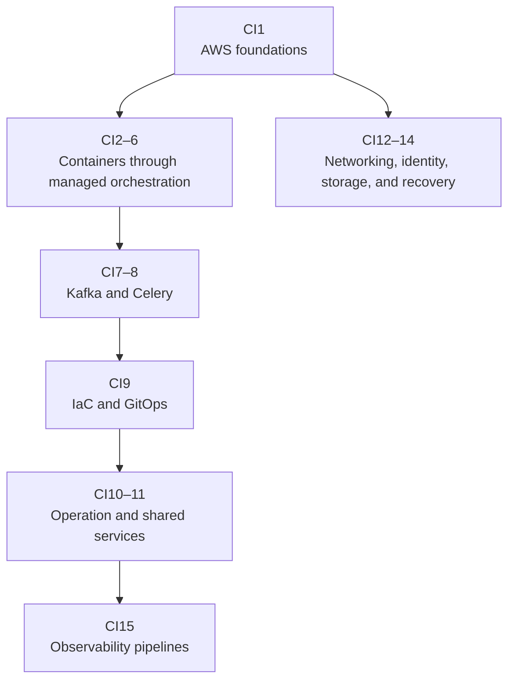

## Scope

How an application becomes a production service: first the internet and AWS boundaries around it, then containers and Kubernetes, scheduling, managed container platforms, asynchronous work, and day-two operation. The notes are sequential. Each product is introduced before its failure modes or operating details. Worked cases use a fictional bookshop whose names, values, and repository layouts exist only in these notes.

The final four notes revisit the cloud boundary in more depth. [Internet edge and private connectivity](12-internet-edge-and-private-connectivity.md) follows public, private, and hybrid network paths; [identity and cloud security](13-identity-secrets-and-cloud-security.md) follows credentials, authorization, secrets, encryption, and audit evidence; [storage, backups, and disaster recovery](14-storage-backup-and-disaster-recovery.md) separates live copies from recoverable history across object, block, file, and managed database storage; [observability pipelines](15-observability-pipelines-metrics-logs-and-traces.md) follows metrics, logs, and traces from instrumentation through collection, buffering, storage, query, rules, alerts, failure, and recovery.

## How the collection fits together

## Reading path

1. [Cloud foundations](01-cloud-foundations.md) first maps accounts, Regions, Availability Zones, VPCs, subnets, service APIs, and the main AWS service families. It then follows synchronous and asynchronous application paths through compute, identity, networking, and storage.
2. [Containers and the Kubernetes object model](02-containers-and-kubernetes-objects.md) starts with the process, image, port, and state concepts Kubernetes assumes, then separates Pods, Deployments, Services, and the other objects around a workload.
3. [Control planes, etcd, and reconciliation](03-control-planes-and-reconciliation.md) follows that declared workload through the API server, controllers, scheduler binding, kubelet, and durable control-plane state.
4. [Kubernetes networking, storage, and security](04-kubernetes-networking-storage-security.md) adds the Service, gateway, volume, identity, and policy paths a running Pod needs.
5. [Scheduling, autoscaling, and noisy neighbors](05-scheduling-and-noisy-neighbors.md) explains placement and runtime resource behavior before deriving scheduler scale limits.
6. [EKS and ECS](06-eks-and-ecs.md) compares the two managed container contracts after the Kubernetes and AWS layers are visible.
7. [Kafka](07-kafka-replicated-event-log.md) first distinguishes queues, topics, event buses, retained logs, and workflows, then follows one retained record through Kafka.
8. [Celery](08-celery-task-processing.md) applies the work-queue model to named background tasks, acknowledgements, retries, and worker failure.
9. [Infrastructure as code and GitOps](09-infrastructure-as-code-and-gitops.md) supplies the reviewed change path for the infrastructure and workloads already introduced.
10. [Production operation](10-production-operation.md) defines service success, telemetry, scaling feedback, availability, recovery, and capacity.
11. [Shared production services](11-shared-production-services.md) uses platform interfaces, PostgreSQL pooling, and durable workflows as separate examples of owned resource contracts.
12. [Internet edge and private connectivity](12-internet-edge-and-private-connectivity.md) revisits CI1's request path at packet, transport, proxy, and hybrid-network depth.
13. [Identity, secrets, and cloud security](13-identity-secrets-and-cloud-security.md) revisits CI1's identity boundary and joins it to workload credentials, encryption, network policy, and audit evidence.
14. [Storage, backups, and disaster recovery](14-storage-backup-and-disaster-recovery.md) revisits CI1's storage choices and separates live service, replicas, snapshots, backups, restore, RPO, and RTO.
15. [Observability pipelines](15-observability-pipelines-metrics-logs-and-traces.md) follows the machinery that carries the production signals defined in CI10.

The cloud path does not require reading the low-level collection first. When a cloud abstraction needs host detail, use [LL2](../02-low-level-infrastructure/02-cpu-scheduling-and-locality.md) for CPU scheduling and NUMA, [LL4](../02-low-level-infrastructure/04-storage-and-io.md) for persistence, [LL5](../02-low-level-infrastructure/05-linux-networking-and-ebpf.md) for packet paths, [LL6](../02-low-level-infrastructure/06-containers-and-cgroups.md) for container isolation and resource enforcement, and [LL7](../02-low-level-infrastructure/07-observability-and-debugging.md) for host evidence.

[Sandbox systems](../08-sandbox-systems/INDEX.md) applies CI2–6 and CI9–15 to isolated computers for agents and untrusted code. It continues from Kubernetes objects into sandbox claims, warm pools, gVisor and microVMs, checkpoint storage, credential brokering, and platform selection.

## Useful background

- Comfort reading TypeScript, Python, and YAML
- Basic command-line and Git experience
- Experience building an ordinary web application
- No AWS, Kubernetes, Kafka, Celery, or Linux-operations experience required
