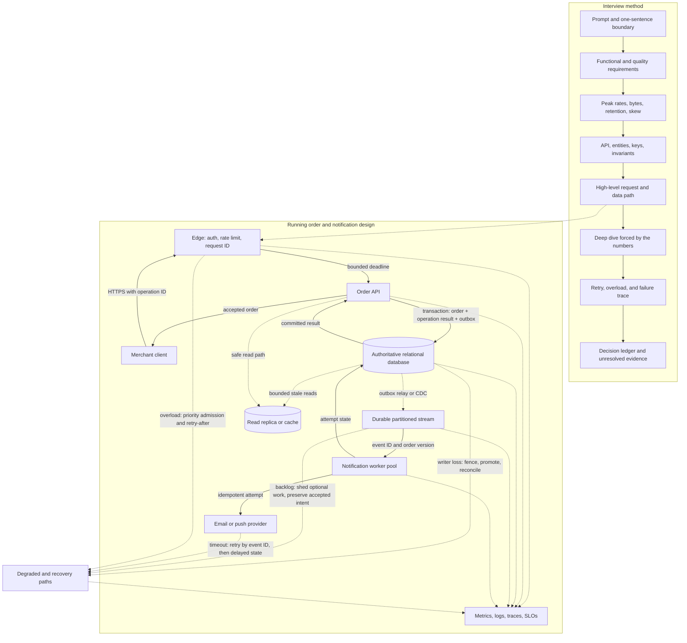

## Working model

A design is a budget ledger. Traffic, bytes, latency, availability, recovery time, and engineering effort all spend from a finite budget; an unlabeled box hides the bill rather than paying it.

## Start with a one-sentence restatement

A prompt such as "design a notification service" names a product category, not a contract. Before drawing, restate the problem in terms of an actor, an operation, and the outcome that actor needs. Then name the first boundary.

> Internal product services submit notification requests; the system applies each recipient's preferences, dispatches email or push work, and lets the caller inspect delivery state. The first design covers submission through dispatch and status, but not template authoring, audience segmentation, or the internals of an email provider.

That sentence gives the interviewer several chances to correct the interpretation. It also prevents an accidental detour into features the prompt did not ask for. If the interviewer changes the boundary, rewrite the sentence; do not keep designing against the old prompt.

## Ask only questions whose answers can change the design

Clarification is not a checklist recital. Ask a question, explain why it matters when useful, record the answer or assumption, and move on. The following groups catch most design-changing unknowns.

| Question area           | Example question                                                                                                            | Decision it can change                                                             |
| ----------------------- | --------------------------------------------------------------------------------------------------------------------------- | ---------------------------------------------------------------------------------- |
| Actors and operations   | Who submits work, who consumes the result, and what are the two most important actions?                                     | API surface, authorization, and which path deserves the latency budget             |
| Success and correctness | When may the caller consider the operation complete, and which duplicate or stale result would be harmful?                  | Transaction boundary, idempotency, delivery semantics, and consistency             |
| Scale and shape         | What are average and peak reads, writes, connected clients, object sizes, and fan-out per write?                            | Capacity, partitioning, caching, batching, and whether asynchronous work is needed |
| Quality targets         | Which operation has a latency target, what availability is required, and how much data loss or recovery time is acceptable? | Synchronous dependencies, replication, spare capacity, RTO, and RPO                |
| Data policy             | How long does data live, who may read it, where may it reside, and what must deletion remove?                               | Storage tier, encryption, region choice, audit, backup, and projection cleanup     |
| Failure behavior        | May the system return stale data, queue work, or reject requests when a dependency or Region fails?                         | Degraded mode, retry policy, failover, and consistency during isolation            |
| Existing boundaries     | Must the design use an existing identity system, database, cloud, protocol, or team-owned service?                          | Build-versus-integrate choices and operational ownership                           |
| Scope                   | Which plausible features are deliberately outside the first version?                                                        | Time allocation and the components that should not appear yet                      |

Fan-out is the number of downstream recipients or operations caused by one input. Work is asynchronous when it may finish after the request returns. Recovery time objective (RTO) bounds restoration time; recovery point objective (RPO) bounds acceptable lost history. A projection is a derived copy such as a search index or analytic table.

Five later mechanisms appear in the orientation design. A **transactional outbox** is an event record committed with business state so a relay can publish it afterward. **Change data capture (CDC)** reads committed changes from a database log or change interface. **At-least-once delivery** permits the same record to arrive again, so the consumer needs a stable identity and a repeat-safe effect. A **write-ahead log (WAL)** makes committed changes recoverable before every changed data page reaches its final file. **Fencing** gives each new authority a higher epoch or token that the protected resource uses to reject an older writer. SD4 through SD7 derive these paths; these sentences only establish the vocabulary used in the first diagram.

### Standalone framing example: notification service

Suppose the interviewer chooses this contract for a short notification example: email and push submission, preferences, and status are in scope; campaign design is out; peak submission is 40,000 requests each second; 99% of accepted submissions finish within 200 ms at the service edge; urgent dispatch should start within five seconds; an ambiguous failure may repeat a provider dispatch; status remains for 30 days; and the first version runs in one geographic Region with copies across several failure-isolation zones. These are illustrative assumptions, not facts about notification systems. In a real discussion, label every value supplied, measured, or assumed. The continuing order-and-notification case begins later in this note and uses its own fixed workload.

## Produce the design artifacts in a stable order

The diagram comes fourth, after enough evidence exists to earn its boxes. Keeping the artifacts in this order gives a novice a way back when a prompt becomes messy.

| Artifact                  | What it must contain                                                                                                           |
| ------------------------- | ------------------------------------------------------------------------------------------------------------------------------ |
| Contract                  | Primary actors and actions, quality targets, constraints, and exclusions                                                       |
| Workload sheet            | Average and peak rates, bytes, retention, concurrency, and the assumption most likely to change the design                     |
| Interface and data sketch | API operations, request identity, main entities, keys, relationships, and invariants                                           |
| High-level diagram        | Client boundary, compute, authoritative state, derived state, and asynchronous work, with arrows labeled by requests or events |
| Request trace             | One normal operation followed from entry to durable result and response                                                        |
| Stress trace              | One retry, overload condition, dependency failure, or recovery path through the same boxes                                     |
| Decision ledger           | Requirement behind each major choice, rejected simpler option, limit, signal, and condition for revisiting it                  |

SD2 builds the interface and request path. SD3 through SD9 supply storage, relational-engine, distribution, coordination, asynchronous, overload, and scheduling mechanisms; SD10 adds recovery plus operating evidence. SD11 shows how to compress the same artifact order into an interview conversation.

## Use interview time as a feedback loop

An interview is collaborative design under a deadline. State how you will spend the time, but change the split when the interviewer redirects the problem. For an illustrative 45-minute session:

|      Time | Work                                                  | Visible result                                                     |
| --------: | ----------------------------------------------------- | ------------------------------------------------------------------ |
|   0–4 min | Restate prompt, actors, scope, and success            | One-sentence boundary plus exclusions                              |
|   4–9 min | Ask design-changing questions                         | Functional and quality requirements with labeled assumptions       |
|  9–13 min | Estimate peak traffic, bytes, retention, and skew     | Four to six lines of arithmetic and the likely bottleneck          |
| 13–18 min | Sketch API, entities, keys, and invariants            | Interface and data contract before components                      |
| 18–25 min | Draw the high-level path                              | One labeled normal request across authority and async boundaries   |
| 25–35 min | Deepen the part forced by requirements                | Storage, partitioning, queue, consistency, or scheduling mechanism |
| 35–40 min | Trace retry, overload, and one infrastructure failure | Failure behavior through the same boxes                            |
| 40–45 min | Recap choices, limits, signals, and next change       | Decision ledger and unresolved assumptions                         |

Do not spend the first ten minutes silently writing. Narrate the boundary and arithmetic so the interviewer can correct an assumption before it becomes five boxes. After each major choice, connect it to a requirement: “Because accepted writes cannot disappear after one zone fails, the commit waits at this replicated durability boundary.” That sentence is more useful than listing three database brands.

When an answer is unknown, expose it as an assumption and say what it controls. “I will assume the hottest tenant is below 5% for the first layout; if it reaches 20%, the partition key needs bucketing” keeps the design moving without hiding uncertainty.

## Write the contract in plain language

Start with user-visible actions and the data each action reads or changes. State what the system will not do in this version; exclusions stop a design from quietly absorbing unrelated requirements.

Quality constraints need a measurement surface. 'Fast' is unusable. '99% of accepted interactive requests finish within 250 ms at the server edge over a rolling 28-day window' can drive a latency budget and an alert.

- Actors and their highest-value operations
- Read, write, batch, and fan-out workload shapes
- Data lifetime, privacy boundary, and deletion behavior
- Expected failure and degraded-mode behavior

## Separate behavior, quality, and constraints

Functional requirements say what a user or another system can do: append an event, fetch a feed, delete an account, or export a report. Quality requirements bound how that behavior must work, such as latency, availability, durability, privacy, or recovery time. Constraints record facts the current design cannot change, including an existing database, a regional data rule, or a fixed delivery date.

Write exclusions beside requirements because silence creates accidental scope. If full-text search, cross-region writes, and historical backfill are outside the first version, say so. An exclusion can still name the future pressure it creates. That note stops the current design from pretending the problem will never arrive while keeping the estimate tied to work that somebody has actually requested.

- Behavior: the operation and its success result
- Quality: a threshold, observation point, and time window
- Constraint: a fixed boundary plus the person or policy that owns it
- Exclusion: work deferred from this design and the condition that reopens it

## Pair every SLO with an SLI

An SLO sets a target; an SLI defines the observation. Availability usually counts good events over valid events, while latency counts requests below a threshold. Exclude traffic only when the exclusion matches the user's contract, not because it makes the graph look better.

> **Denominator trap.** If the load balancer rejects a request before application code runs, an application-only metric can report perfect availability during an outage. Measure close to the user boundary.

## Reduce scale to four equations

Average requests per second (RPS) equals daily requests divided by 86,400. A peak factor says how many times busier the busiest design window is than the daily average. Multiply by that observed or stated factor, then apply payload size to get bandwidth. Storage equals write rate times bytes per record times retention, with replicas, indexes, compaction, and headroom added separately so nobody mistakes raw data for provisioned capacity.

_Keep units beside every number until the final conversion._

```text
average_rps = requests_per_day / 86,400
peak_rps = average_rps * peak_factor
egress_bytes_per_second = peak_rps * response_bytes
stored_bytes = writes_per_day * record_bytes * retention_days
```

## Carry one workload through the arithmetic

Suppose a catalog serves 48 million item views each day, peaks at four times its daily average, and returns 24 KiB (24 × 1,024 bytes) per view. The average rate is 48,000,000 divided by 86,400, or about 556 RPS. Peak rate is about 2,222 RPS. Multiplying by 24,576 bytes gives 54.6 decimal MB/s of peak response traffic before transport overhead, compression, cache hits, or replication between services.

The same system writes 6 million metadata rows per day at 900 bytes each and retains them for 30 days. Raw retained data is 162 GB. That is not the disk request: a design must still add indexes, replicas, write-ahead logs, temporary space for maintenance, and operating headroom. Keep those additions on separate lines. If measured compression later cuts row storage by 35%, readers can replace one input instead of reverse-engineering an unexplained multiplier.

_Round for communication only after retaining the unrounded value in the worksheet._

```text
48,000,000 / 86,400 = 555.6 average RPS
555.6 * 4 = 2,222.2 peak RPS
2,222.2 * 24,576 = 54.6 MB/s
6,000,000 * 900 * 30 = 162 GB raw
```

## Find the assumption that can flip the answer

A tenfold peak ratio may force sharding while a twofold ratio does not. Calculate both. Mark inputs as measured, promised, or guessed, and write the cheapest experiment that would replace the dangerous guess with evidence.

## Measurement boundaries can hide the real failure

A design can satisfy its spreadsheet and still fail users because the denominator, peak window, or payload sample was wrong. Compare request attempts at the edge with requests admitted by the application; the difference reveals rejection before application instrumentation. Split latency by operation and response class, since one cheap health endpoint can hide a slow checkout path. Plot queue time and saturation beside latency so an operator can tell whether work is slow before execution or during it.

Revisit the estimate after a representative load test. Record achieved throughput, p50 and p99 latency, error rate, CPU, memory, connection-pool occupancy, and storage write rate at each step. The first resource that bends sharply identifies the present limit. If production peaks differ from the assumed shape, update the workload model and every dependent budget rather than adding a vague safety factor. The worksheet should preserve both the old assumption and the evidence that replaced it.

> **Capacity-changing evidence.** Measure any input that could change the storage engine, partition count, or failure policy before refining boxes that stay the same across the whole range.

## Continuing worked case: scope and capacity

The running case is a multi-tenant order and notification service. A merchant can create an order, fetch it, list recent orders, and advance its status. Every accepted status transition must eventually start one email or push dispatch. Payment execution, inventory ownership, message-template editing, and provider internals are outside the first boundary. “Accepted” means the order state and the intent to notify are durably recorded together; it does not mean the provider delivered a message.

The illustrative workload fixes the numbers used later: 1,000 average and 5,000 peak order creates each second, 20,000 peak reads each second, and 4 KB of authoritative order data including line items and notification intent. Average ingestion is about 4 MB/s:

```text
1,000 orders/s * 86,400 s/day * 4 KB = 345.6 GB/day
345.6 GB/day * 30 days = 10.4 TB raw hot data
```

Indexes, replicas, logs, and temporary migration space sit outside that raw estimate. The create path targets p99 below 250 ms and 99.9% monthly availability. At least 99% of notification dispatches should start within five seconds of the committed transition. A regional disaster has a 15-minute RTO and 30-second RPO. The largest unverified assumption is the hottest tenant's traffic share; SD5 will test the stated 20% case rather than trusting a fleet average.

### Interface and data sketch

The first interface is deliberately small:

```http
POST /v1/orders
Idempotency-Key: <tenant-scoped operation ID>

GET /v1/orders/{order_id}

GET /v1/orders?created_before=<cursor>&limit=100

POST /v1/orders/{order_id}/transitions
Idempotency-Key: <tenant-scoped operation ID>
```

Every request carries authenticated tenant identity; the server does not trust a tenant ID only because it appears in the body. Create and transition operations bind the idempotency key to a request fingerprint so accidental reuse with another payload fails.

The authoritative data model begins with four records:

```text
order
  tenant_id, order_id, version, status, line_items, created_at, updated_at

operation_result
  tenant_id, operation_id, request_fingerprint, result_type, result_id, response

outbox_event
  event_id, tenant_id, order_id, order_version, event_type, payload, created_at

notification_attempt
  event_id, channel, attempt, state, provider_reference, next_attempt_at
```

The create transaction inserts the order, saved operation result, and outbox event together. A unique key on `(tenant_id, operation_id)` settles concurrent retries. A guarded status transition requires the expected order version. The provider call stays outside the transaction; a worker later claims the outbox-derived work and records attempts idempotently.

### High-level architecture and interview path



The diagram separates synchronous acceptance from asynchronous provider delivery. The create request has one synchronous durable authority. A provider outage does not require rolling back an accepted order; it creates notification lag that the product can display and operators can repair. The read replica is not used for an immediate read-after-write response unless the application can prove it has replayed the required position.

### Normal request trace

1. The edge authenticates the caller, derives tenant identity, applies the tenant and global admission limits, and forwards a request ID, operation ID, and deadline.
2. The API validates the payload and begins one database transaction.
3. It attempts to insert the tenant-scoped operation record. An existing matching fingerprint returns the stored result; a mismatched fingerprint returns an idempotency conflict.
4. It inserts the order and outbox event, then commits at the configured replicated durability boundary.
5. The API returns the saved order result without waiting for the notification provider.
6. The relay publishes the outbox event at least once to a partition chosen by order ID.
7. A worker claims the event, calls the provider with a stable attempt identity, and stores the known outcome.
8. User-visible status distinguishes accepted, dispatching, dispatched, delivered when supported, delayed, and terminal failure rather than calling every intermediate state “sent.”

### Failure and overload trace

If the database commits but the API reply is lost, the client retries the same operation ID. The saved operation row returns the first order instead of creating a second one. If commit outcome is still unknown during failover, the API looks up that operation after writer routing stabilizes.

If the notification provider times out, the worker cannot infer whether the provider accepted the request. It records an ambiguous attempt and retries only under the provider's idempotency contract. Without that contract, the product must admit that duplicate external dispatch is possible and bound the retry policy accordingly.

If peak admission exceeds 5,000 creates each second, the edge protects the database pool with bounded queues, per-tenant fairness, and explicit retry responses. It does not let every caller wait until the same one-second deadline and then retry in phase. Accepted orders remain durable while optional reads, bulk work, or low-priority notifications can shed or delay under stated policy.

If the primary Region fails, traffic does not write to both the old and promoted writer. The recovery controller fences the old authority, verifies the candidate's recovery position against the 30-second RPO, promotes, updates routing, and reconciles ambiguous operations. A 15-minute RTO includes detection, decision, promotion, connection recovery, validation, and traffic ramp, not only the database promotion command.

### Decision recap

| Choice                                            | Requirement behind it                                            | Limit and signal                                             | Revisit when                                                         |
| ------------------------------------------------- | ---------------------------------------------------------------- | ------------------------------------------------------------ | -------------------------------------------------------------------- |
| Tenant-scoped idempotency row                     | Lost replies must not duplicate orders                           | Unique conflicts, replay count, retained-key bytes           | Retry horizon or operation volume changes materially                 |
| Relational authority and local outbox transaction | Order transition and intent to notify commit together            | Commit p99, lock wait, WAL rate, old transactions            | One writer or shard cannot meet measured peak with headroom          |
| Async notification stream                         | Provider work can finish after acceptance and must absorb bursts | Oldest event age, partition skew, retry and dead-letter rate | Dispatch SLO or event size exceeds queue design                      |
| Partition by order identity                       | Preserve per-order transition order while parallelizing orders   | Hot partition share and consumer lag                         | One customer or order dominates a partition                          |
| Read replica only for declared stale paths        | Replica replay can lag an accepted write                         | Replay position and user-visible stale rate                  | Stronger read-after-write becomes a product requirement              |
| Active-passive regional writer                    | Avoid conflicting order histories under partition                | RPO position, fence evidence, failover drill time            | Product requires active-active writes and defines conflict semantics |

The interview recap should state the unresolved facts, not pretend the design is finished. Here they are hottest-tenant share, provider idempotency support, measured row and index bytes, sustained database commit rate, and replica catch-up capacity. Each one maps to a load test, provider contract review, or failover drill.

## Summary

A useful design starts as a measurable contract, not a diagram. State the user actions, correctness rules, scale, latency, availability, durability, and fixed constraints; then use arithmetic and boundary-level telemetry to find the few assumptions that can change the architecture.

- **Restate before clarifying.** Turn the product name into an actor, operation, outcome, and boundary, then ask questions whose answers can change an interface, data path, or failure policy. Record an assumption when the interviewer does not supply an answer.
- **Separate the requirement types.** Functional requirements describe actions; quality requirements bound their behavior; constraints record facts that cannot change. Explicit exclusions prevent the first version from absorbing unrelated work.
- **Bind every target to an observation.** An SLO without an SLI is not testable. For availability, define what enters the denominator and measure close enough to the user boundary to include load-balancer and admission failures.
- **Reduce scale to a few units.** Average RPS is daily requests divided by 86,400; peak RPS is average RPS times the peak factor. Bandwidth is request rate times payload bytes, while storage adds retention, replicas, indexes, compaction space, and headroom as separate terms.
- **Carry concrete values through the design.** Forty-eight million daily views average about 556 RPS; at a 4x peak and 24 KiB responses, the peak response payload is about 54.6 MB/s before protocol overhead and compression.
- **Test sensitivity before choosing components.** Label inputs as measured, promised, or assumed. Recalculate with plausible low and high values, especially for peaks, payloads, tenant skew, retention, and fan-out.
- **Diagnose the contract itself.** Compare edge attempts with admitted application requests, split latency by operation and response class, and plot queue time and saturation beside service time. A healthy application metric can coexist with user-visible failure when the measurement boundary is wrong.
- **Use time to expose evidence.** Move from boundary to requirements, arithmetic, interface and data, architecture, one deep mechanism, failure traces, and a decision recap. Narrate assumptions so the interviewer can redirect them early.
- **Finish one complete path.** The running case commits an order, idempotency result, and outbox event together, then dispatches asynchronously. Its retry, overload, provider timeout, and regional failover all reuse the same boxes and name their degraded behavior.

## References

- [Google SRE: Service Level Objectives](https://sre.google/sre-book/service-level-objectives/): Defines SLIs, SLOs, error budgets, and measurement windows.
- [Google SRE Workbook: Implementing SLOs](https://sre.google/workbook/implementing-slos/): A worked process for choosing initial service objectives.
- [Google SRE: Monitoring Distributed Systems](https://sre.google/sre-book/monitoring-distributed-systems/): Connects user-visible behavior to latency, traffic, errors, and saturation.
- [Google NALSD Workbook](https://sre.google/static/pdf/nalsd-workbook-letter.pdf): Capacity and reliability prompts used in non-abstract large-system design practice.
