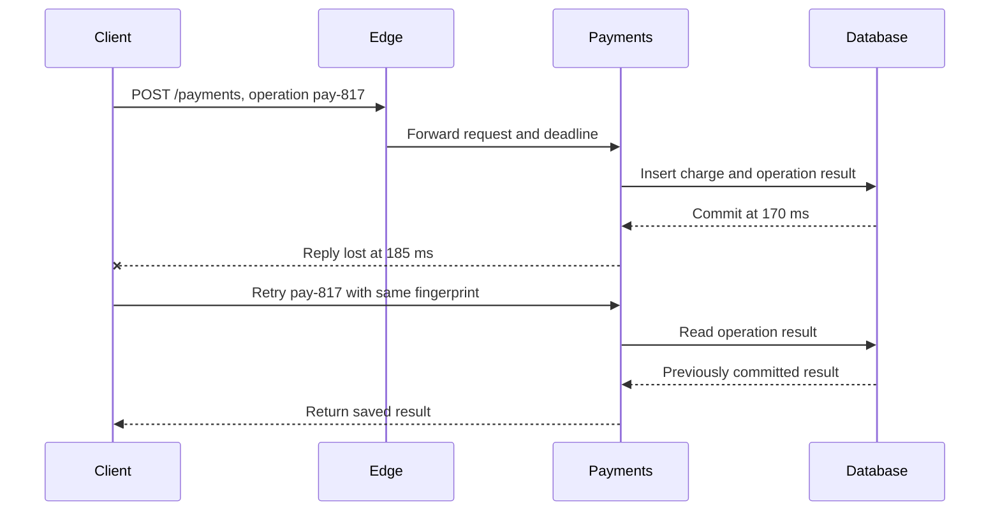

## Working model

A request is a shrinking deadline carried across hops. Each hop consumes time, may retry, and can lose the reply after committing the work; the API contract must survive that ambiguity.

## Questions this note answers

- Turn a functional requirement into request, response, error, identity, and authorization contracts
- Allocate an end-to-end latency target across network and service hops
- Explain what L4 and L7 load balancers can inspect and decide
- Define health checks, draining, affinity, TLS termination, and retry ownership for a load-balanced service
- Design cursor pagination and rate-limit responses without unstable offsets
- Make state-changing requests safe to retry with idempotency keys
- Evolve schemas across old and new readers, writers, retries, and stored messages
- Distinguish a client deadline from per-attempt timeouts
- Choose HTTP, gRPC, server-sent events, or WebSocket from the interaction pattern

## Turn each operation into an interface contract

An application programming interface, or API, states how one program asks another program to do something. With HTTP, an endpoint combines a method such as `GET` or `POST` with a path. The request carries identity, input, and optional preconditions; the response carries a status, output, and enough error detail for the caller to decide whether to stop, correct the request, or retry.

Design the operation before choosing JSON, gRPC, or a cloud gateway. For every functional requirement, write the following:

- Who may call it, and how the service authenticates that identity
- What stable resource or operation ID survives retries
- Required and optional fields, size limits, and validation rules
- The success result, including whether work is complete or merely accepted
- Error classes, which ones are safe to retry, and the caller's deadline
- Compatibility, pagination, and rate-limit behavior where the operation needs them

Authentication proves or establishes who the caller is. Authorization decides whether that caller may perform this action on this resource. A valid identity is not permission to read every tenant's record. Put the tenant or account boundary in both the authorization check and the data lookup; hiding it only in a user-interface route invites cross-tenant mistakes.

For the notification contract in SD1, a small first API might accept work and expose status:

```http
POST /v1/notification-requests
Authorization: Bearer <credential>
Idempotency-Key: notify-817

{"recipient_id":"user-42","channel":"email","template_id":"receipt-3"}

202 Accepted
{"notification_id":"n-9001","status":"accepted"}
```

`202 Accepted` means the service accepted responsibility for later processing; it does not claim that the email arrived. `GET /v1/notification-requests/n-9001` can return the durable state the caller is allowed to see. The service should define terminal states, whether provider delivery is known, how long status remains available, and what a repeated `Idempotency-Key` means. Those fields connect the product requirement to storage and async decisions in later notes.

Draw a data-flow arrow for each API operation before adding infrastructure. Label it with the request, response, deadline, and state changed. A box named `API service` without those arrows says almost nothing.

## Name the handshakes you are paying for

A URL names a scheme such as `https`, a host, a port implied by the scheme, and a path. Before an HTTPS handler can run, the client needs a network address for the host and a protected connection to an endpoint that can route the request.

1. The client asks a recursive DNS resolver for the host's address. The resolver may answer from a cache or follow the DNS delegation chain. DNS records and resolver caches have lifetimes, so an address change is not immediately visible to every client.
2. The client establishes transport state. HTTP/1.1 and HTTP/2 normally use TCP; HTTP/3 uses QUIC over UDP. Transport setup creates the state needed to deliver bytes reliably to the selected endpoint.
3. TLS authenticates the server certificate and derives encryption keys. With HTTPS, the HTTP request is sent only after or alongside the transport and TLS setup allowed by the negotiated protocol.
4. An edge proxy or load balancer accepts the connection, applies its routing and policy, and selects a healthy target. It may reuse a separate connection to that target.
5. The application authenticates the caller, runs business logic, calls dependencies, and returns an HTTP response through the same chain.

This is the cold path. A later request may reuse cached DNS data, a live client connection, TLS state, and an upstream connection. Reuse removes setup only while record lifetimes, idle timeouts, address changes, and pool limits allow it. It can also keep traffic attached to an old or uneven set of targets.

Budget tail latency, not a chain of averages. A 300 ms user target cannot assign 250 ms independently to three downstream calls that run in series.

## Distinguish deadlines, timeouts, and attempts

A deadline is the latest useful completion time for the whole operation. A timeout limits one wait, such as establishing a connection, reading response headers, or completing one backend attempt. If each hop invents a fresh timeout, the deepest service may keep working long after the caller has returned an error. Pass an absolute deadline or a carefully reduced remaining duration through the call chain.

Reserve enough time for error handling and the return path. Suppose a caller has 300 ms left, the edge and network normally use 35 ms each way, and serialization uses 10 ms. The backend does not own the remaining 255 ms; it owns at most 220 ms, and a retry must fit inside that same envelope. Start a second attempt only when its expected completion can beat the deadline and the first operation is safe to repeat.

- Connection timeout bounds setup before application bytes move
- Per-attempt timeout bounds one try against one dependency
- Request deadline bounds every attempt and the response path together
- Cancellation tells downstream work that its result no longer has a waiting caller

## Choose L4 or L7 by the decision required

An L4 balancer routes a transport flow using connection-level information such as protocol, source and destination addresses, and ports. The chosen backend normally owns that flow for its lifetime. This makes L4 suitable when the balancer should not parse the application protocol, when TLS must pass through, or when the traffic is not HTTP. It also means ten long-lived connections are only ten routing decisions: balancing connection counts does not guarantee balanced requests or work.

An L7 proxy terminates or understands an application protocol such as HTTP. It can select a target from the host, path, method, or header; redirect HTTP; enforce request-size or authentication policy; and record response codes. It may terminate client TLS and open a separate cleartext, TLS, or mutually authenticated connection to the target. Termination makes routing and certificate management possible at the proxy, while pass-through preserves end-to-end encryption to the application but hides HTTP fields from the balancer.

The routing algorithm must match the unit of work. Round robin spreads decisions, least-outstanding favors a target with less visible work, and a stable hash or cookie creates affinity. Affinity can retain in-memory session state, but it also pins a heavy user to one target, slows rebalancing, and loses the session when that target disappears. Prefer a shared or client-carried session when the product does not require target-local state.

- L4 decision: transport flow; L7 decision: request or application stream
- TLS pass-through hides HTTP routing fields; TLS termination creates a second backend security boundary
- Connection reuse saves handshakes but can preserve an old, uneven target distribution
- Client IP forwarding is an explicit trust contract because forwarded headers can be forged before the trusted proxy

> **Keep the client deadline.** Propagate the remaining deadline downstream. A backend response that arrives after the caller has given up wastes capacity and can trigger retries on work that is still running.

## Choose the application protocol from the conversation

HTTP resource APIs work well for request-response operations, public clients, caches, and intermediaries. JSON is easy to inspect but still needs an explicit schema and compatibility policy. gRPC defines typed service methods and messages, usually with Protocol Buffers, and supports unary plus streaming RPCs. It is often useful between controlled services, but it does not remove distributed-systems concerns: set deadlines, propagate cancellation, classify retryable status codes, and plan schema evolution.

Server-sent events carry a one-way stream from server to browser over HTTP using `text/event-stream`; they fit progress, notification, and live-feed updates when the client sends ordinary HTTP requests in the other direction. WebSocket creates a long-lived, bidirectional message channel after an opening handshake. It fits interactive sessions that need either side to send at any time, but it also creates connection ownership, heartbeat, backpressure, deployment draining, and reconnect-state work.

HTTP/3 changes the transport beneath HTTP semantics. It maps HTTP onto QUIC, which provides independent streams and uses TLS during connection establishment. It can reduce cross-stream blocking caused by packet loss, but it does not decide API identity, retries, pagination, or authorization. A design should name both layers: for example, an HTTP resource API whose edge may negotiate HTTP/2 or HTTP/3.

- HTTP request-response: public APIs, cacheable reads, ordinary create/read/update/delete operations
- gRPC: typed service-to-service calls, unary or streaming, controlled client ecosystems
- Server-sent events: server-to-browser updates with automatic HTTP-style reconnection
- WebSocket: bidirectional, long-lived sessions with explicit application framing
- Webhook: outbound HTTP callback that needs authentication, delivery identity, retry, and receiver idempotency

> **Protocol choice is not a scale plan.** A WebSocket can carry millions of updates badly, and a polling API can work well at modest load. Calculate connection count, messages per second, bytes, fan-out, reconnect bursts, and per-connection memory.

## Evolve readers before writers

An API schema changes while old clients, new clients, old servers, retries, queued messages, and stored records coexist. “Additive” is safe only when every deployed reader tolerates the addition and the default semantics preserve its decision.

Use an explicit compatibility ledger:

| Change                                | Compatibility question                                                                                                          |
| ------------------------------------- | ------------------------------------------------------------------------------------------------------------------------------- |
| Add an optional response field        | Do old clients ignore unknown fields, and can they behave correctly without the new value?                                      |
| Add an optional request field         | Does the old server ignore it safely, reject it clearly, or accidentally apply a different default?                             |
| Add a required field or change a type | Which deployed caller can produce or parse it? This is normally breaking without a staged transition.                           |
| Add an enum value                     | Does generated or handwritten client code preserve unknown values, map them to a safe branch, or crash on an exhaustive switch? |
| Change a field's meaning              | A stable name and type do not make new semantics compatible; introduce a new field or versioned operation instead.              |
| Remove a field                        | Which callers still send it and which readers still depend on it? Logs and metrics must answer before removal.                  |

Roll out tolerant readers before new writers. For a new `delivery_window` field, deploy servers that can read both absent and present values and expose deprecation telemetry. Then deploy producers that send it. Only after the old population is gone may the service remove the fallback. A stored queue or replayable log extends that population: a message written months ago can still exercise the old schema after every live client has upgraded.

Define absence, `null`, empty, zero, and default separately. If an omitted timeout means “use 30 seconds” while zero means “no wait,” a serializer that collapses the two changes behavior. Preserve unknown fields where a read-modify-write client must not erase data it did not understand. With Protocol Buffers, do not reuse a deleted field number; reserve the number and name so old wire data cannot be interpreted as a different field.

Version a whole endpoint only when compatible evolution cannot express the behavior. A `/v2` route creates two contracts, authentication paths, metrics, documentation sets, and retirement work; it does not migrate callers by itself. Publish a deprecation date, identify remaining callers from bounded telemetry, and test the final rejection before deleting the old implementation.

Idempotency also has a version boundary. Scope a key to the authenticated tenant and operation, store a request fingerprint plus committed result, and define retention longer than the retry window. Reusing one key for a semantically different v2 request must be a conflict, not a request to return an old v1 result. Deploy the idempotency-record reader before any new retrying client so mixed versions cannot repeat effects.

## Health checks and draining are part of correctness

An active health check samples one path at an interval and changes target state only after configured success or failure thresholds. It is not proof that every request will work. A check that tests only the process can keep a target whose worker pool is wedged; a check that fails on one shared database can remove every otherwise useful target at once. Define liveness as whether the process should restart and readiness as whether this target should accept new work, then test the failure policy for shared dependencies.

Connection draining stops assigning new work to a target while existing connections or requests receive a bounded period to finish. A safe shutdown sequence marks the target unready, waits for load balancer propagation, drains application work, and only then exits. The application grace period must exceed the balancer's deregistration delay plus normal request time, or the process will reset work the balancer still believes is active. Long-lived streams need a separate maximum age or a protocol-level reconnect signal because waiting forever prevents a deployment from finishing.

Retries at a proxy consume the same end-to-end deadline and can repeat an operation whose first reply was lost. Limit attempts, retry only defined failure classes, and avoid retrying a state-changing request unless its operation identity makes repetition safe. Record original requests and backend attempts separately. A healthy user request rate with a rising attempt rate is evidence that the load balancer is multiplying work during failure.

- Health interval and thresholds determine detection and recovery delay
- Readiness controls new assignments; draining controls accepted work already in progress
- Passive failure signals see real traffic but can punish a target for client errors unless classified
- Retry budgets, circuit breaking, and per-target connection limits prevent one failing pool from consuming every worker

> **Fail-open behavior varies.** Read the selected balancer's all-targets-unhealthy behavior. For example, an Application Load Balancer can route to all registered targets when every target is unhealthy, so a health check is not always a traffic-off switch.

## Make lists stable and writes repeatable

Offset pagination drifts when rows are inserted or deleted before the offset. A cursor should encode a stable sort key and tie-breaker, such as created_at plus id, and the server must define whether the cursor represents a snapshot or a moving view.

For a create or charge request, store the idempotency key with a request fingerprint and the committed result. A repeated key with different parameters is an error; a repeated matching request returns the original result.

## Follow a reply that disappears after commit

A client sends POST /payments with operation ID pay-817. DNS and a reused TLS connection succeed, the edge forwards the request, and the payment service inserts both the charge and the operation record in one database transaction. The database commits at 170 ms. At 185 ms the connection drops before the response reaches the client, so the client observes a timeout even though the durable state exists.

The retry carries pay-817 and the same request fingerprint. The service reads the operation record and returns the saved result without issuing another charge. If the amount or account differs, the server rejects the reused ID because returning the old response would hide a client bug. A unique constraint on the operation ID closes the race between two simultaneous attempts; application code that first checks and later inserts without such a constraint can still duplicate work.

> [!NOTE]
> The operation identity belongs to the business action, not to one network attempt.



## Count the requests made during health-check delay

Assume eight equal targets receive 800 HTTP requests each second and routing is uniform at 100 requests per target per second. Two targets begin returning errors together. With a 10-second active-check interval and three consecutive failures required, detection can take about 20 to 30 seconds depending on when the fault occurs relative to the last successful check. Before removal, the two targets can receive roughly 4,000 to 6,000 failed requests under this simplified distribution.

A single immediate retry raises backend traffic from 800 to as much as 1,000 attempts per second while the fault is present. If every retry reaches one of the six useful targets, each useful target moves from about 100 original requests per second to about 133 total attempts per second. If target capacity is 150 requests per second, the retry policy leaves little room for latency variation and may make healthy targets fail their checks too. Removing the bad targets is not enough; the design needs spare capacity for the reduced pool and a retry budget that cannot consume it.

During a deployment, suppose the deregistration delay is 45 seconds and the p99 request completes in 3 seconds. Keep the application alive through target-removal propagation and the 45-second drain window, stop admitting new background work before the target becomes unready, and track active requests at exit. If reset connections continue after 45 seconds, inspect shutdown ordering and long-lived streams. If errors stop but one target remains hot, inspect connection reuse or affinity rather than changing health thresholds.

_This trace assumes equal request cost and routing; measure per-target requests and work in a real system._

```text
normal target rate = 800 / 8 = 100 requests/s
affected rate = 2 * 100 = 200 requests/s
20-30 s detection window = about 4,000-6,000 failed requests
one retry per failure = up to 800 + 200 = 1,000 attempts/s
```

## Rate limits are part of the API

Pick the identity being limited, the bucket scope, burst allowance, and refill rate. Return an explicit overload response and retry guidance; silent connection drops make well-behaved clients indistinguishable from aggressive ones.

## Locate delay before changing retry policy

Break an end-to-end trace into resolution, connection setup, TLS, edge queue, upstream connect, application queue, service execution, database wait, and response transfer. A high total with short application spans points to a boundary outside the handler. A growing connection-pool wait with stable query time means callers are waiting for a scarce database connection; retries increase that queue and make recovery slower.

Compare status codes and connection outcomes at both sides of every proxy. A client may record a timeout while the edge records a successful upstream response delivered too late. Track attempts per original operation, remaining deadline at each hop, pool occupancy, handshake rate, reused-connection ratio, and the count of idempotency replays. Those measurements separate a slow dependency from retry multiplication, cold connections, or a rate limiter rejecting work before the service sees it.

> **Retry test.** Disable retries for one controlled cohort. If dependency load falls and successful completions rise, retries were consuming the capacity needed for first attempts.

## Running design checkpoint

The order service now has four tenant-scoped operations. `POST /v1/orders` creates an order, `GET /v1/orders/{id}` fetches one, `GET /v1/orders?before=<cursor>&limit=100` lists recent orders, and `PATCH /v1/orders/{id}/status` advances state only when the supplied version matches. Authentication establishes the caller's tenant; handlers do not trust a tenant ID copied from the JSON body.

Create requests carry a tenant-scoped `Idempotency-Key`. The service stores the key, a hash of the normalized request, and the resulting order ID. A replay with the same hash returns the first result, while reuse with different order data returns a conflict. The status operation carries an expected version and its own operation ID, so a lost response cannot create two transitions or two notification intents.

Clients use a one-second total deadline. An L7 load balancer terminates TLS, applies coarse request-size and admission rules, then forwards the authenticated request identity and remaining deadline to a healthy service instance. The 250 ms p99 create budget reserves 50 ms for edge and transport work, 150 ms for application plus database work, and 50 ms for queueing and variance. One layer owns retries: the caller may repeat an ambiguous create only with the same idempotency key and only while its original deadline remains. Load balancers do not independently replay state-changing requests.

## Summary

Begin with the operation contract: caller, authorization, input, stable identity, success state, errors, and deadline. The resulting API request is a timed journey through DNS, transport, TLS, load balancing, queues, application work, and storage. Correctness depends on the whole path: the routing layer must choose at the right protocol level, retries must preserve operation identity, and health transitions must stop new work without discarding accepted work.

- **Account for setup and reuse.** Cold requests may pay for name resolution, TCP or QUIC state, TLS negotiation, edge routing, and a backend connection. Reuse helps only while pool limits, address changes, and idle timeouts allow it.
- **Choose the load balancer by its decision.** L4 balancing assigns transport flows without parsing HTTP and is useful for passthrough or non-HTTP traffic. L7 balancing can route each request by host, path, header, method, or policy, but it terminates more protocol state and adds application-aware configuration.
- **Match the protocol to the interaction.** HTTP fits request-response APIs, gRPC adds typed unary and streaming RPCs, server-sent events provide a one-way browser stream, and WebSocket provides a bidirectional session. HTTP/3 changes HTTP transport behavior through QUIC; it does not change the operation's identity or retry contract.
- **Evolve readers before writers.** Add tolerant readers and explicit defaults before producers emit a new field, preserve unknown data when read-modify-write requires it, reserve deleted Protocol Buffer field numbers, and remove old behavior only after telemetry proves callers and stored messages no longer need it.
- **Treat health and draining as correctness rules.** Liveness asks whether a process should restart; readiness asks whether it should receive new work. Active checks are delayed samples, and some balancers fail open when every target is unhealthy, so verify the selected product's exact behavior.
- **Use one end-to-end deadline and one retry budget.** Propagate remaining time downstream, cap attempts with jittered backoff, and retry only repeatable operations. If three layers each allow four attempts, one user action can create up to 64 deepest-hop attempts.
- **Make ambiguous writes idempotent.** A response can disappear after the database commits. Store a stable operation key with the result so a retry returns the prior outcome instead of repeating the side effect; use stable cursor fields rather than offsets for changing lists.
- **Locate delay before tuning retries.** Break traces into resolution, connect, TLS, edge queue, upstream connect, application queue, execution, database wait, and transfer. During target failure, combine request distribution with health-check interval and failure threshold to estimate how many requests can reach bad targets before removal.

## References

- [RFC 1034: Domain Names, Concepts and Facilities](https://www.rfc-editor.org/rfc/rfc1034.html)
- [RFC 9293: Transmission Control Protocol](https://www.rfc-editor.org/rfc/rfc9293.html)
- [RFC 9846: TLS 1.3](https://www.rfc-editor.org/info/rfc9846): Current TLS 1.3 specification; it obsoletes RFC 8446.
- [RFC 9110: HTTP Semantics](https://www.rfc-editor.org/rfc/rfc9110.html)
- [RFC 9114: HTTP/3](https://www.rfc-editor.org/rfc/rfc9114.html): Maps HTTP semantics onto QUIC streams.
- [RFC 6455: The WebSocket Protocol](https://www.rfc-editor.org/rfc/rfc6455.html): Defines the opening handshake, framing, and connection behavior.
- [WHATWG HTML: Server-sent events](https://html.spec.whatwg.org/dev/server-sent-events.html): Defines `EventSource` and the `text/event-stream` format.
- [gRPC: Core concepts, architecture, and lifecycle](https://grpc.io/docs/what-is-grpc/core-concepts/): Covers service definitions and unary, client-streaming, server-streaming, and bidirectional calls.
- [gRPC: Deadlines](https://grpc.io/docs/guides/deadlines/): Explains deadline propagation and cancellation behavior.
- [Protocol Buffers: Updating a Message Type](https://protobuf.dev/programming-guides/proto3/#updating): Compatibility rules for field numbers, types, deletion, and unknown fields.
- [Google AIP-158: Pagination](https://google.aip.dev/158)
- [Stripe API: Idempotent Requests](https://docs.stripe.com/api/idempotent_requests)
- [AWS Elastic Load Balancing: How Routing Works](https://docs.aws.amazon.com/elasticloadbalancing/latest/userguide/how-elastic-load-balancing-works.html): Documents listeners, zonal routing, cross-zone behavior, and L4 flow versus L7 request selection.
- [AWS Application Load Balancer: Target Health Checks](https://docs.aws.amazon.com/elasticloadbalancing/latest/application/target-group-health-checks.html): Documents health thresholds, target states, draining state, and all-targets-unhealthy behavior.
- [AWS Application Load Balancer: Target Group Attributes](https://docs.aws.amazon.com/elasticloadbalancing/latest/application/edit-target-group-attributes.html): Documents deregistration delay, routing algorithms, stickiness, and cross-zone settings.
