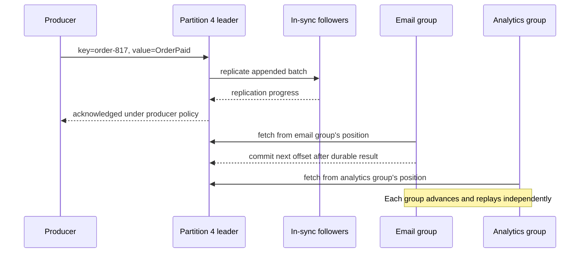

## Working model

Async transport converts request latency into stored debt. Queue depth and consumer lag are debt balances; arrival rate, service rate, and retry rate decide whether the balance clears or compounds.

## Questions this note answers

- Decide which result must complete in the request and which work may continue after durable acceptance
- Choose a queue for work ownership or a log for retained ordered history
- Trace a queued task through delivery ownership, acknowledgement, worker death, retry, dead-lettering, and redrive
- Decide when a multi-step operation needs a persisted workflow rather than another queue message
- Define Kafka's topic, record, partition, offset, broker, producer, consumer, and consumer-group terms
- Trace one Kafka record from producer partitioning through broker replication, consumer processing, offset commit, and replay
- State the scope of ordering rather than claiming global order
- Design idempotent consumers for at-least-once delivery
- Build a CDC path with a consistent snapshot, retained log position, schema policy, and measurable catch-up window
- Use a transactional outbox when a database change and an emitted business event must agree
- Calculate in-flight work and backlog drain time with Little's Law
- Set retry, dead-letter, and replay policy without creating an infinite poison loop

## Decide what the caller must wait for

A synchronous operation keeps the caller waiting for its result. An asynchronous operation returns after accepting responsibility and completes later. Moving work out of the request path can protect latency and absorb a short burst, but it does not make the work disappear or guarantee that it finishes. The system now owes the caller durable acceptance, status, retry behavior, and a terminal failure policy.

Split the operation at a state the product understands. For a document upload, storing verified object bytes and a durable job record may be enough to return `accepted`; parsing and indexing can follow. For an inventory reservation, returning before the authoritative reservation commits may let two callers believe they own the same unit. The boundary comes from the correctness contract, not from a preference for queues.

When asynchronous completion is visible to a user, define how the user learns the outcome: polling, a one-way event stream, webhook, or later notification. Store a stable operation ID so a repeated submission finds the same job rather than creating another debt item.

## A queue hands off work; a log preserves history

A producer and a consumer do not have to run at the same time. A broker sits between them and stores data until a consumer can handle it. This removes slow work from the request path and lets several producers feed a separate worker fleet, but it also creates stored work that needs identity, retention, and recovery rules.

A work queue typically assigns each message to one consumer and removes or hides it after acknowledgement. It is a good fit for commands such as `GenerateThumbnail`, where one worker should own each attempt. A durable log appends records to an ordered history and retains them independently of whether one consumer has read them. It is useful for facts such as `OrderPaid`, where billing, email, analytics, and fraud detection may each read the same record on their own schedule.

Ordering usually exists only within a queue or log partition. Choose a partition key that groups events requiring order, then accept parallelism across keys.

## Follow one queue delivery from claim to redrive

Suppose the API durably enqueues `GenerateInvoice` with operation ID `invoice:817`. The message remains in the broker while a worker receives a temporary claim on it. Treat that claim as a lease even though products implement it differently: Amazon SQS hides the message for a visibility timeout, while RabbitMQ tracks an unacknowledged delivery on a channel and requeues it if the channel or connection closes. The claim prevents ordinary competing work; it does not prove that only one execution can ever occur.

The broker-neutral lifecycle is:

1. The producer stores a command with a stable operation ID, payload version, enqueue time, and routing or ordering key. A transport delivery tag, receipt handle, or receive count is not the business identity.
2. A worker receives the command and a delivery claim. Its processing deadline must fit inside the claim; long work either renews the timed claim with a bounded heartbeat or splits into smaller durable steps.
3. The worker validates the message and checks whether `invoice:817` already has a durable result. If so, it returns that result to the workflow or status record and acknowledges this delivery without repeating the effect.
4. Otherwise, the worker performs the effect. For a local database change, it can write the business result and the processed-operation record in one transaction. For a payment, email, or object-store call, pass the stable operation ID to an idempotent downstream API when possible and retain enough state to query an ambiguous outcome.
5. Only after the result is durable does the worker acknowledge. The broker can then remove the message or mark the delivery complete.

Two crash points explain why this order matters. If the worker dies before the effect, its claim eventually ends and another worker can try. If it dies after committing the effect but before the acknowledgement reaches the broker, the message returns even though the effect already happened. The next worker must find `invoice:817` and reuse the stored result. Acknowledging before the effect merely changes the failure into silent loss.

An external call has a third case: the worker times out without knowing whether the provider accepted it. Do not turn “unknown” into “failed” and issue a fresh operation. Retry with the same provider idempotency key or query the provider by that key, then record the discovered result. A local processed-ID table cannot roll back or deduplicate an external system on its own.

Retries need an end. Classify malformed data, missing authorization, and an unsupported schema as terminal; retrying them consumes capacity without changing the answer. For a transient timeout, use increasing backoff with jitter, carry the same operation ID, and cap both attempts and elapsed age. A busy worker should not sleep while holding the only claim unless the broker contract requires it; reschedule for a later visible time or publish a delayed retry through the product's supported path.

After the maximum attempt count, move the message out of the ready queue. A dead-letter queue needs a named owning team, an age and count alert, retention long enough for investigation, access to the failure reason and original identity, and a runbook for correction. Redrive only after the code, data, dependency, or authorization problem has changed. Preserve the original operation ID, limit the redrive rate so it cannot starve live traffic, and quarantine a message that fails again. If order within one key is a correctness rule, decide whether that key must stop behind the failed item; moving one item aside and continuing can violate the business sequence even when the broker acted as configured.

FIFO and deduplication claims have a scope. Amazon SQS FIFO orders messages within one message group, while its deduplication ID suppresses repeated sends only inside the documented five-minute deduplication interval. That does not deduplicate an external effect for the lifetime of an order. RabbitMQ queues enqueue in order, but multiple consumers, priorities, and redelivery can change the order each consumer observes or the order in which effects finish. Celery inherits the selected broker, task routing, acknowledgement settings, and worker concurrency; the word “task” adds no stronger ordering boundary.

The same lifecycle appears under different product names:

| Lifecycle concept          | Amazon SQS                                                                                           | RabbitMQ                                                                                                  | Celery                                                                                                                                                                                        |
| -------------------------- | ---------------------------------------------------------------------------------------------------- | --------------------------------------------------------------------------------------------------------- | --------------------------------------------------------------------------------------------------------------------------------------------------------------------------------------------- |
| Delivery claim             | `ReceiveMessage` hides a message for its visibility timeout; `ChangeMessageVisibility` can extend it | A manual-ack delivery remains unacknowledged on its channel; channel or connection loss causes requeue    | The broker transport supplies the claim; Celery's task acknowledgement setting decides when the worker settles it                                                                             |
| Success                    | Delete with the current receipt handle after the result is durable                                   | `basic.ack` after the result is durable                                                                   | Default acknowledgement happens before execution; `task_acks_late` moves it after task execution and therefore requires idempotent task behavior                                              |
| Worker loss                | Visibility expiry makes the message receivable again                                                 | Unacknowledged deliveries return when the channel or connection closes                                    | `task_acks_late` alone still has worker-loss exceptions; `task_reject_on_worker_lost` requests requeue but can create message loops                                                           |
| Retry and cap              | Delay or visibility policy plus a redrive `maxReceiveCount`                                          | Reject or negatively acknowledge, often with delayed routing; quorum queues support a delivery limit      | `retry` and automatic retry settings provide countdown, backoff, jitter, and `max_retries`; their behavior still rests on broker delivery                                                     |
| Dead letters               | A source queue redrive policy sends messages to a configured DLQ                                     | A dead-letter exchange routes rejected, expired, over-limit, or delivery-limited messages when configured | No one portable Celery DLQ contract covers every broker; configure routing and failure ownership for the chosen transport and distinguish result-backend failure records from queued messages |
| Ordering and deduplication | FIFO order is per message group; publish deduplication is bounded by the deduplication interval      | Queue delivery starts in enqueue order, but concurrent consumers and redeliveries affect observed order   | Depends on broker queue, routing key, worker concurrency, prefetch, retries, and task code; a Celery task ID should not replace a domain operation ID                                         |

## A workflow records the steps between messages

A queue records available work. A workflow system also records where one execution is in a sequence: which step completed, which branch was selected, which timer is waiting, which retry is due, and which result the next step should receive. That state lets a minutes- or months-long process survive a worker restart without placing its whole history in one queue message or one process's memory.

For example, an order workflow might reserve inventory, wait for payment confirmation, request fulfillment, sleep until a delivery deadline, and compensate the reservation if payment fails. Workers still perform activities, often through internal queues. The workflow record decides which activity is eligible and what follows it. Each external call still needs a stable identity because the workflow database cannot roll back a payment provider, email server, or warehouse robot.

AWS Step Functions defines state machines with task, choice, wait, parallel, and other states. Temporal records workflow event history and replays deterministic workflow code while external I/O runs in activities. DBOS records completed workflow steps and resumes after interruption. Airflow DAGs describe task dependencies and schedules for data and batch operations. These systems do not have identical execution, retention, versioning, or transaction boundaries; compare the actual workflow guarantee rather than grouping them under one product category.

Use a queue when one independently retryable task is the unit of work. Use a retained log when independent readers need ordered history and replay. Use a workflow when the system must durably remember progress, timers, branches, and compensation across several steps. A workflow may use queues and logs internally, so these are responsibilities rather than mutually exclusive boxes.

## Learn Kafka's nouns before its failure modes

Kafka is a distributed durable log used to store and process event streams. An event, record, or message is one item in that stream. These terms name different parts of the path:

| Term               | Meaning                                                                                                                        |
| ------------------ | ------------------------------------------------------------------------------------------------------------------------------ |
| Record             | A key, value, timestamp, and optional headers serialized by a client                                                           |
| Topic              | A named stream of related records, such as `order-events`                                                                      |
| Partition          | One append-only ordered log inside a topic; the unit of parallelism and replication                                            |
| Offset             | A partition-local position assigned as records are appended; offset 42 in partition 0 is unrelated to offset 42 in partition 1 |
| Broker             | A Kafka server that stores partition replicas and serves producer and consumer requests                                        |
| Producer           | A client that serializes a record, selects a topic partition, and sends it to that partition's leader broker                   |
| Consumer           | A client that fetches records from partitions and processes them                                                               |
| Consumer group     | A named set of consumers that divides a topic's partitions so one group member owns a partition at a time                      |
| Replication factor | The number of broker replicas assigned to each partition, including its leader                                                 |

A topic is not one globally ordered file when it has several partitions. Records with the same routing key normally go through the same partitioner path and can retain per-key order; unrelated keys can be written and read in parallel. More partitions permit more classic consumer-group members to work at once, but they increase metadata, open files, replication traffic, rebalance work, and the number of independent orderings.

Independent consumer groups do not steal records from each other. For example, `email`, `fraud`, and `analytics` groups can each read every order event because each group stores its own position. Inside the `email` group, however, one partition has one active owner at a time. With 12 partitions and 8 consumers, several consumers own more than one partition; with 15 consumers, at least 3 have no partition work. When members join, leave, or stop responding, Kafka reassigns partitions in a rebalance. The records stay in the log; ownership moves.

Kafka 4.3 also documents **share groups**, which provide more queue-like consumption. Share consumers can cooperatively acquire records from the same partitions using time-limited locks and individual acknowledgements, and a group can have more consumers than partitions. This is different from classic consumer-group offset processing. Name which group type an application uses instead of mixing their acknowledgement and ordering rules.

## Follow one Kafka record end to end

Suppose an order service publishes key `order-817` and value `OrderPaid` to a topic with 12 partitions and replication factor 3.

1. The producer contacts a bootstrap broker to learn cluster and partition metadata. The bootstrap address is an entry point, not necessarily the broker that will store this record.
2. The producer serializes the key, value, and headers. Its partitioner maps `order-817` to one partition, say partition 4. Using the same stable key keeps later events for that order on the same partition while the topic's partitioning scheme stays unchanged.
3. The producer sends a batch to partition 4's leader broker. The leader appends the batch and assigns offsets. Followers copy the leader's log.
4. Producer acknowledgement policy decides when the send returns. With `acks=all`, the leader waits for the current in-sync replicas; `min.insync.replicas` can reject the write when too few replicas remain. “All” means the current in-sync set, not necessarily every replica originally assigned to the partition.
5. A consumer in the `email` group fetches the record from its assigned partition. Kafka consumers pull batches; the broker does not delete the record because this group read it.
6. The consumer sends the email or records a durable email request, then commits the next offset it should read. If it crashes after the side effect but before the offset commit, another owner reads the record again. The side effect therefore needs the event ID or operation ID to deduplicate the repeat.
7. The `analytics` group reads the same record using its own offset. If its code was wrong, an operator can stop it, reset its offsets to an earlier retained position, and replay. Replay does not affect the `email` group's position.

Retention controls how long old log segments remain by time or size; a slow or stopped consumer does not keep ordinary topic data forever merely by lagging. The consumer must catch up before its required offsets age out. Log compaction is a separate policy that eventually retains at least the latest record for each key while preserving offsets and ordering of the records that remain. It is useful for reconstructing keyed state, but it is not immediate deletion and consumers must understand tombstone retention.



## Keep Kafka's current control plane straight

Kafka stores events in partitioned topics. A producer client chooses a partition, each partition has an ordered sequence of offsets, replicas copy partitions for fault tolerance, and a classic consumer group divides partitions among its members. The ordering claim is per partition, not across a whole topic. Adding partitions raises possible parallelism but can change key-to-partition mapping, so it is not a transparent fix for a hot or undersized topic.

Modern Kafka 4.x uses KRaft metadata controllers; ZooKeeper mode was removed in Kafka 4.0. Brokers own event storage and client traffic, while a controller quorum owns cluster metadata. In a production discussion, keep controller availability, broker capacity, partition leadership, in-sync replicas, producer acknowledgements, retention, consumer lag, and rebalance behavior as separate concerns. A managed service such as Amazon MSK changes who operates the cluster; it does not remove topic design, client semantics, quotas, or lag.

Kafka is a good fit when several independent consumers need retained ordered history, replay, or high-throughput event streams. A simpler work queue may be a better fit when each task has one owner, per-message visibility and redrive are central, and long retention or replay by many consumer groups is unnecessary.

The [cloud Kafka note](../01-cloud-infrastructure/07-kafka-replicated-event-log.md) continues from this record path into broker log segments, in-sync and eligible leader replicas, producer idempotence, schemas, security, Amazon MSK, and operating choices.

## Put identity and evolution in the envelope

A message needs a stable event or operation ID, event type, schema version, producer identity, occurrence time, and routing value when ordering or partitioning depends on one. Trace context helps operators connect the async step to its origin. Do not use a broker offset as the business identity because replay into another topic or queue assigns a different transport position.

Separate the fact that happened from the command to perform work. An OrderPlaced event records a committed state transition and may feed several consumer groups. A SendReceipt command asks one worker pool to perform a task. Both can use the same transport, yet their ownership and retention differ. State who may publish each type, how long it remains available, which fields consumers can trust, and how an older consumer handles a newer schema version.

- Identity supports deduplication across transport attempts
- Routing value defines the ordering and load-distribution boundary
- Schema version controls compatible decoding during mixed deployments
- Original occurrence time stays separate from enqueue and processing time

## Read committed changes from the database log

Log-based change data capture reads the database's ordered recovery or replication stream after transactions commit and converts relevant changes into records for another system. PostgreSQL logical decoding extracts logical changes from WAL through a replication slot and output plugin. MySQL records changes in its binary log, which replication and CDC readers can consume. These streams represent database changes, not the user's business intent; an UPDATE from pending to paid needs domain meaning supplied by the schema or an outbox event.

CDC avoids an application dual write in which the database commit succeeds but publishing fails, or publication succeeds before the database rolls back. It is still an asynchronous projection. Search, cache, analytics, and downstream services observe source changes after capture and delivery delay, so the product must define acceptable staleness and the behavior while the projection is rebuilding.

A retained position is both a resume point and a storage obligation. PostgreSQL replication slots can retain required WAL while a consumer is down; MySQL readers need binary logs to remain available past their stored position. If capture stalls, retained log bytes can fill the source disk. Monitor current source position, acknowledged capture position, retained bytes, oldest unconsumed transaction time, and connector state at the database rather than relying only on broker lag.

> **Source protection.** A CDC consumer that is allowed to retain the database log indefinitely can turn a downstream outage into a primary-database disk outage. Set lag and retained-byte alarms plus an explicit rebuild decision.

## Join a snapshot to the live log without a gap

A new projection needs a baseline plus every committed change after that baseline. The connector establishes a source log position associated with a consistent snapshot, copies existing rows, and then continues from the saved position. Product implementations differ in locking and buffering details, but the invariant is stable: no row may fall into a gap between the snapshot and stream, and a change seen in both paths must be safe to apply twice.

Snapshot records and live changes can arrive at a sink in an order that differs from a simple wall-clock story. Carry source position, table and key identity, transaction metadata when needed, and an operation type such as create, update, or delete. Partition the downstream log by the entity key when changes for one entity must retain order. Ordering one database log does not create a total order after events are split across broker partitions, nor does it order commits from two independent databases.

Treat schema as part of the stream contract. The capture system must preserve enough schema history to decode older log entries, and consumers need rules for additive fields, defaults, nullability, type changes, renames, and drops. A safe rename often runs as add-new-field, dual-populate or transform, backfill, switch readers, and only then remove-old-field. Test capture and replay across mixed producer and consumer versions before applying a destructive DDL change.

- Baseline: a consistent view of rows at a known source position
- Tail: every later committed change retained until capture acknowledges it
- Ordering: explicit scope such as one source transaction or one entity key
- Evolution: decoder schema history plus a consumer compatibility window

## Place the offset update after the sink result

At-least-once capture normally advances its durable offset only after a batch is delivered or applied. If the sink commits and the connector crashes before saving the offset, the same changes return after restart. If it saves the offset before the sink commits, a crash can lose changes. Prefer duplicates with stable identities over silent loss, then make the sink conditional or idempotent using a source event ID, source position, or monotonic entity version.

Exactly-once processing is always bounded by the participating systems. A broker transaction can atomically write output records and consumer offsets inside that broker, but it cannot by itself make an email, payment call, search update, and database write one atomic action. Name the boundary and design the external side effect for retry. Keep a reconciliation query that compares source and sink ranges, counts, keys, or checksums after replay.

Deletes need a contract too. A change event should carry the key and deletion operation even when the row's current value no longer exists. Sinks must decide whether to remove state, write a tombstone, or retain an audit record under policy. A snapshot that omits deleted rows cannot repair a stale sink unless the rebuild clears or versions the old projection before loading the new baseline.

## Publish business meaning from the same commit

When downstream systems need a domain event rather than every physical row change, write an outbox row in the same local transaction as the business update. The row contains a stable event ID, aggregate key, event type, schema version, occurrence time, and payload. CDC or a relay publishes it later. If the transaction rolls back, neither business state nor event exists; if publication repeats, consumers use the event ID to deduplicate.

The outbox does not make the entire workflow atomic. It closes the gap between one database commit and intent to publish. Relay lag, duplicate publication, poison payloads, consumer side effects, retention, and deletion still need owners. Keep outbox age and unpublished-row count as user-impact signals, and delete or archive rows only after the replay and audit window has passed.

Avoid treating every table mutation as a public event. Physical CDC is useful for rebuilding projections and moving data, while an outbox gives a stable business contract that can survive table refactors. A service can use both: raw changes for controlled internal replication and explicit events for consumers that should not depend on its storage schema.

## Budget snapshot time, retained logs, and catch-up

Suppose an analytic projection starts with a 1 TB decimal snapshot copied at 100 MB/s. The baseline takes at least 10,000 seconds, about 2 hours 47 minutes, before query overhead. The source generates 20 MB/s of relevant log data during that time, so the connector may need about 200 GB of retained log to bridge the snapshot. Provisioning only the snapshot destination while ignoring source-log retention can fill the primary disk before bootstrap completes.

After the snapshot, the connector can apply 60 MB/s while 20 MB/s of new changes continue. Its net catch-up rate is 40 MB/s, so 200 GB takes at least 5,000 seconds, about 83 minutes. The full bootstrap is therefore about 4 hours 10 minutes under ideal sustained rates. If apply capacity falls to 20 MB/s, net catch-up becomes zero and the projection never reaches live traffic. Throttle the snapshot if it harms source latency, but include the longer retention and recovery window in the decision.

At source position 900, an account update and outbox event commit together. The sink applies event e-73, then the connector crashes before saving position 900. Restart re-emits e-73. A unique event_id or conditional source-position check turns the second apply into a no-op, after which the connector records progress. Verify recovery by comparing source and sink keys over the affected position range, not by checking that the connector process is merely running.

_Use measured compressed bytes and apply throughput for a real migration; the decimal units keep this example readable._

```text
snapshot = 1,000,000 MB / 100 MB/s = 10,000 s
retained log = 20 MB/s * 10,000 s = 200,000 MB
net catch-up = 60 - 20 = 40 MB/s
catch-up = 200,000 / 40 = 5,000 s
ideal total = 15,000 s = about 4 h 10 min
```

## At-least-once means duplicates are normal

A broker may deliver again when the consumer finishes the side effect but loses the acknowledgement. Put a stable event ID in the message, make the state transition conditional, and record processed IDs when duplicate work would cause harm.

> **Dead letters need an owner.** A dead-letter queue (DLQ) without an alert, retention limit, inspection path, and redrive policy is a quieter data-loss queue.

## Measure lag in time and work

Little's Law relates average in-flight work L to arrival rate lambda and average time W: L equals lambda times W. For a backlog, drain rate is consumer capacity minus incoming rate; if that difference is zero or negative, no amount of waiting clears the queue.

Backpressure can reduce producer rate, cap unacknowledged deliveries, shed low-priority work, or spill to durable storage. Pick the signal and threshold before memory becomes the buffer.

## Calculate debt while arrivals continue

At 5,000 events each second and 250 ms average processing time, Little's Law predicts about 1,250 events being processed or waiting inside the measured service boundary under stable conditions. A consumer fleet capable of 6,500 events each second has 1,500 events per second of spare capacity. It clears a 9,000,000-event outage backlog in 6,000 seconds, or 100 minutes, only while both rates remain sustained.

Retries belong in the rate equation. If 4% of new events fail once and retry, roughly 200 extra attempts each second consume service capacity before the old backlog drains. Spare capacity falls to about 1,300 attempts per second, extending recovery to roughly 115 minutes if retry work costs the same. A poison message that retries without a cap is worse: its rate never disappears. Move it after a bounded attempt count, retain the failure reason, and require an explicit redrive decision after the underlying defect changes.

_Use attempts, not only unique events, when calculating consumed capacity._

```text
in_flight = 5,000/s * 0.25 s = 1,250
spare_rate = 6,500/s - 5,000/s = 1,500/s
drain_time = 9,000,000 / 1,500 = 6,000 s
with 200 retries/s: 9,000,000 / 1,300 = 6,923 s
```

## Use lag shape to find the blocked stage

Queue depth counts work, while age of the oldest ready message tells how long a user-visible result has waited. Consumer lag by partition reveals skew that a total hides. Compare arrival rate, successful completion rate, retry rate, processing duration, acknowledgement latency, and active consumer count. If one partition's lag grows while others drain, inspect its routing value distribution and the slow records assigned to it before adding workers that cannot share that partition.

Replay changes load and can repeat side effects, so treat it as a planned operation. Choose a source position and target consumer version, estimate replay rate, reserve capacity for live traffic, and monitor duplicates plus downstream throttles. Pause when live-event age crosses its limit. Afterward, compare source counts, accepted transitions, rejected duplicates, and dead letters. Exactly-once claims always have a boundary; name the broker, state store, and external side effects included before trusting the phrase.

> **Backlog diagnosis.** A flat queue count can still hide churn when completions and retries replace each other at the same rate. Plot unique event completions beside total attempts.

## Running design checkpoint

The outbox relay writes notification events to an at-least-once ordered work queue. The fixed stress case allows 5,000 new notification events each second. `event_id` remains the deduplication identity from database commit through provider receipt. `order_id` selects a FIFO message group or ordered partition, and the consumer admits only one active event for that key until it acknowledges or redrives the event. Routing by itself would not preserve order. A poison event therefore blocks later transitions for that order until the bounded retry and dead-letter policy releases the group. No requirement promises ordering across separate orders or recipients.

A worker receives a message with a 30-second visibility lease, records the attempt, and extends the lease only while it still owns active work. It acknowledges after the provider result and durable receipt are recorded. Retryable provider failures use bounded exponential backoff with jitter; five unsuccessful attempts move the event to a dead-letter queue carrying the original payload, error class, attempt history, and source position. Replaying that queue requires an owner and uses the same event ID.

Normal worker capacity is 7,500 successful dispatch starts each second. A ten-minute provider outage at the 5,000-per-second arrival peak creates 3,000,000 queued events. Once the provider recovers, the spare drain rate is 2,500 each second, so ideal catch-up takes 1,200 seconds, or 20 minutes, before accounting for retries and provider throttling. Queue depth alone cannot enforce the five-second target; alerts use oldest ready-event age, successful unique completions, retry rate, dead-letter growth, and per-partition lag.

## Summary

Asynchronous systems trade immediate completion for buffered work and replay, so identity, ordering, offset commits, and retention become part of correctness. CDC is a special case: it turns committed database logs into downstream changes, but it still needs a gap-free bootstrap and idempotent application.

- **Distinguish a work queue from a retained log.** A queue normally hands one task to one worker and acknowledges it away; a partitioned log retains offsets so independent consumer groups can replay the same history.
- **Acknowledge only after a durable result.** Worker death before the effect should release the claim; death after the effect but before acknowledgement should redeliver the same stable operation ID and reuse its stored result. Bound retries with backoff and a maximum, then send terminal work to an owned DLQ whose redrive preserves identity and respects live capacity.
- **Add a workflow only for persisted multi-step progress.** A workflow records completed steps, branches, timers, retries, and results while workers perform activities. External effects remain idempotent, and workflow-code versioning is part of the recovery contract.
- **Start Kafka with its data path.** A producer serializes a keyed record and sends it to one partition leader; followers replicate that partition; consumers pull batches; each classic consumer group records its own next offset. Topics contain partitions, and order exists inside one partition rather than across the topic.
- **Do not confuse group models.** A classic consumer group assigns each partition to one member at a time, so its useful parallelism is bounded by partition count. Kafka 4.3 share groups add queue-like record acquisition and individual acknowledgement; their delivery and ordering rules are different.
- **Separate Kafka's data and metadata roles.** Kafka 4.x uses KRaft controllers rather than ZooKeeper. Brokers store partitions and serve clients; the controller quorum manages cluster metadata. Topic keys, partition count, acknowledgements, retention, lag, and rebalances remain application and operating decisions even with managed Kafka.
- **Give each record business identity.** Include an event or operation ID, type, schema version, producer, occurrence time, trace context, and routing key. A broker offset is a transport position, not a durable business identifier.
- **Know what CDC observes.** PostgreSQL logical decoding reads committed changes from WAL; MySQL CDC readers consume the binary log. These records describe row changes, not necessarily domain intent, so use an outbox when downstream consumers need events such as OrderPaid rather than a generic update.
- **Join snapshot and log without a gap.** Capture a source position associated with a consistent snapshot, copy the baseline, then continue from that position. Overlap is acceptable when application is idempotent; an unobserved interval is data loss.
- **Commit progress after the sink result.** Saving the source offset after a sink commit can repeat records after a crash; saving it first can lose them. Prefer at-least-once delivery with conditional writes, source versions, or processed-event IDs.
- **Budget bootstrap and backlog with arrivals included.** A 1 TB snapshot at 100 MB/s takes about 10,000 seconds and can retain roughly 200 GB of source log at 20 MB/s. Backlog drains at consumer capacity minus arrival rate; 9 million events clear in 100 minutes only when 6,500/s capacity and 5,000/s arrivals remain stable. Track oldest age and per-partition lag, not queue count alone.

## References

- [Apache Kafka 4.3: Introduction](https://kafka.apache.org/43/getting-started/introduction/): Defines events, topics, partitions, replication, producers, consumers, and consumer groups.
- [Apache Kafka 4.3: Quick Start](https://kafka.apache.org/43/getting-started/quickstart/): Shows the smallest topic, producer, consumer, and replay path.
- [Apache Kafka 4.3: Design](https://kafka.apache.org/43/design/design/): Documents delivery, replication, and storage design.
- [Apache Kafka 4.3: Basic operations](https://kafka.apache.org/43/operations/basic-kafka-operations/): Shows consumer positions, lag, and offset reset operations.
- [Apache Kafka 4.3: KRaft](https://kafka.apache.org/43/operations/kraft/): Defines controller and broker process roles in the current metadata architecture.
- [RabbitMQ: Consumer Acknowledgements and Publisher Confirms](https://www.rabbitmq.com/docs/confirms)
- [RabbitMQ: Queues and message ordering](https://www.rabbitmq.com/docs/queues): Documents enqueue order and the effects of multiple consumers, priorities, and redelivery on observed order.
- [RabbitMQ: Dead Letter Exchanges](https://www.rabbitmq.com/docs/dlx): Defines the reject, expiration, length-limit, and delivery-limit conditions that can republish a message to a dead-letter exchange.
- [Amazon SQS: Visibility timeout](https://docs.aws.amazon.com/AWSSimpleQueueService/latest/SQSDeveloperGuide/sqs-visibility-timeout.html): Defines in-flight messages, visibility extension and expiry, deletion after processing, and redelivery after failure.
- [Amazon SQS: FIFO queue key terms](https://docs.aws.amazon.com/AWSSimpleQueueService/latest/SQSDeveloperGuide/FIFO-key-terms.html): Defines message group and deduplication IDs, including the five-minute deduplication interval.
- [Amazon SQS: Dead-letter Queues](https://docs.aws.amazon.com/AWSSimpleQueueService/latest/SQSDeveloperGuide/sqs-dead-letter-queues.html)
- [Celery 5.6: Tasks](https://docs.celeryq.dev/en/stable/userguide/tasks.html): Documents early and late acknowledgement, worker-loss behavior, idempotency, retry backoff, jitter, and retry limits.
- [AWS Step Functions: State machine concepts](https://docs.aws.amazon.com/step-functions/latest/dg/concepts-statemachines.html): Defines workflows, task and flow states, executions, data, and transitions.
- [Temporal: Workflows](https://docs.temporal.io/workflows): Explains event history, deterministic replay, activities, and recovery after a worker or infrastructure failure.
- [DBOS: Workflows](https://docs.dbos.dev/python/tutorials/workflow-tutorial): Documents durable steps, workflow identity, determinism, timeouts, and resumption after interruption.
- [Apache Airflow: DAGs](https://airflow.apache.org/docs/apache-airflow/stable/core-concepts/dags.html): Defines scheduled workflow runs, tasks, dependencies, retries, and backfill.
- [Apache Flink: Checkpointing](https://nightlies.apache.org/flink/flink-docs-stable/docs/ops/state/checkpoints/)
- [Reactive Streams Specification](https://github.com/reactive-streams/reactive-streams-jvm): Defines asynchronous stream processing with non-blocking backpressure.
- [PostgreSQL: Logical Decoding Concepts](https://www.postgresql.org/docs/current/logicaldecoding-explanation.html): Explains extraction of logical changes from WAL, replication slots, and crash-safe restart positions.
- [MySQL 8.4: The Binary Log](https://dev.mysql.com/doc/refman/8.4/en/binary-log.html): Documents the change log used for replication and point-in-time recovery.
- [Debezium: PostgreSQL Connector](https://debezium.io/documentation/reference/stable/connectors/postgresql.html): Documents snapshots, logical decoding, offsets, transaction metadata, schema changes, and replication-slot behavior.
- [Debezium: MySQL Connector](https://debezium.io/documentation/reference/stable/connectors/mysql.html): Documents consistent snapshots, binlog positions, schema history, and restart behavior.
- [Debezium: Outbox Event Router](https://debezium.io/documentation/reference/stable/transformations/outbox-event-router.html): Defines a transactional outbox record shape, routing key, event identity, and emitted envelope.
