## Working model

A controller repeatedly closes the gap between observed and desired state. A scheduler chooses where the next piece can run; it filters impossible placements, scores the survivors, records the decision, and expects reality to change immediately afterward.

[DS8](../06-distributed-systems/08-distributed-dataflow-and-scheduling.md) develops dataflow scheduling and shared-cluster resource policy. [CI3](../01-cloud-infrastructure/03-control-planes-and-reconciliation.md) and [CI5](../01-cloud-infrastructure/05-scheduling-and-noisy-neighbors.md) carry the Kubernetes control and placement paths further.

## Separate decisions from the work they control

A **data plane** performs the system's main work: a proxy forwards requests, a broker stores records, or a worker runs a container. A **control plane** stores configuration and intent, decides placement or ownership, and repairs drift in that data plane. Keeping them separate lets a brief controller outage leave existing work running, but it also means the control plane can be healthy while stale or broken data-plane instances still affect users.

Kubernetes uses a set of API objects and processes to apply this split:

| Term       | Role                                                                                                         |
| ---------- | ------------------------------------------------------------------------------------------------------------ |
| Pod        | The smallest scheduled workload unit; one or more containers share its network identity and declared volumes |
| Node       | A worker machine that supplies CPU, memory, storage, network, and optional devices to Pods                   |
| Deployment | Desired replica count and rollout policy for a replaceable application workload                              |
| ReplicaSet | The controller-owned object that maintains a particular set and count of matching Pods                       |
| Scheduler  | The control-plane component that chooses a Node for an unscheduled Pod                                       |
| Kubelet    | The agent on each Node that asks the container runtime to start and monitor the assigned Pod                 |
| Service    | A stable network identity and routing abstraction for a changing set of ready endpoints                      |

Kubernetes provides one concrete example. A user submits a Deployment stating that three replicas of an application should run. The API server validates and stores that desired state. A Deployment controller creates a ReplicaSet, a ReplicaSet controller creates Pod objects, the scheduler binds each unscheduled Pod to a feasible Node, and the node's kubelet starts the declared containers. Readiness results then determine whether the Pods appear as serving endpoints. If one Pod disappears, controllers observe that actual count is below three and create a replacement.

This is reconciliation: observe desired and actual state, compare them, make one retry-safe change, record what was observed, and repeat. An event can wake the loop quickly, but periodic relisting is still needed because events can be delayed or lost.

```mermaid
flowchart LR
  accTitle: A Kubernetes workload from desired state to serving endpoints
  accDescr: A Deployment is stored by the API server, controllers create a ReplicaSet and Pods, the scheduler binds Pods to Nodes, kubelets start containers, and readiness publishes serving endpoints before reconciliation repeats.
  A["Deployment: replicas = 3"] --> B["API server stores desired state"]
  B --> C["Controllers create ReplicaSet and Pods"]
  C --> D["Scheduler binds each Pod to a Node"]
  D --> E["Kubelet starts containers"]
  E --> F["Readiness publishes serving endpoints"]
  F --> G["Controller observes drift and repeats"]
```



## Persist intent, then reconcile

The API stores desired state and returns before every physical action finishes. Controllers observe both desired and actual state, issue idempotent actions, and try again after lost events or process restarts. Status records what happened; spec records what should happen.

Leases can divide controller work, but the operation itself still needs idempotency because leadership can overlap during pauses and network delay.

## Track generation, observation, and ownership

Desired state needs a stable object identity, a generation that changes with user intent, and status that names the generation a controller observed. Without that link, a Ready condition can describe an older specification. Controllers should own distinct fields or child resources so two loops do not continually overwrite each other's decisions.

Deletion also requires reconciliation. Mark intent to delete, let responsible controllers remove external resources, and clear their completion markers only after cleanup succeeds. The API can then remove the object. Cleanup must tolerate retries and missing external state because a controller may crash after deleting the resource but before recording success. A permanent error belongs in status with a reason and next retry policy, not in an endless hot loop.

- Spec records requested state; status records observed facts
- Observed generation tells readers which request the status describes
- Ownership prevents controllers from fighting over the same field
- Deletion markers keep external cleanup visible and repeatable

**Bin packing** is the placement problem of fitting workload resource vectors onto finite nodes without violating their constraints. CPU, memory, storage, network, and devices remain separate dimensions; spare CPU cannot substitute for missing memory. A **noisy neighbor** is a colocated workload that degrades another through a shared resource—such as memory bandwidth, cache, disk I/O, or network queues—that requests, limits, or isolation did not represent or enforce well enough. Packing decides what appears to fit; runtime isolation and measurement show whether the colocated workloads can actually coexist.

## Hard constraints filter; policy scores

CPU, memory, device, topology, affinity, and policy requirements first remove infeasible nodes. Scoring can favor tight packing for efficiency, spreading for failure isolation, or locality for data movement. Binding commits the selected node so later cycles see the reservation.

> **Requests are the scheduling currency.** A scheduler cannot place from an average of actual use that may change after binding. Bad requests cause stranded capacity or contention even when the algorithm is correct.

A resource **request** is the amount used for placement and reservation accounting. A resource **limit** bounds what a running container may consume where the resource supports enforcement. In Kubernetes, CPU limits can lead to throttling, while exceeding an enforced memory limit can lead to an out-of-memory kill; neither outcome is predicted by a scheduler that saw only an understated request. Requests should come from measured workload behavior plus the intended contention policy, then be reviewed when runtime use or throttling disagrees.

## Reserve before another cycle spends the same capacity

Filtering uses the latest available node view, but that view can change before binding. Parallel scheduling cycles may both see enough room and choose the same node. A reservation or assumed-state step temporarily accounts for the first choice; binding then commits it to durable cluster state. If a later permit check or bind fails, the scheduler releases the reservation and places the work back in the queue.

Hard constraints should explain rejection. Record which predicate removed each candidate, since 'no nodes available' hides whether the cause was CPU, memory, device count, topology, policy, or an unbound volume. Score only the survivors. A high score does not make an infeasible node safe, and averaging CPU with memory into one percentage loses the resource that will run out first.

## Pack the cluster one constraint at a time

The three worked-example nodes provide 20 CPU and 40 GiB in total. Per-node monitors reserve 3 CPU and 3 GiB, leaving capacities of 7/15 on n1, 7/15 on n2, and 3/7 on n3. The 6-CPU trainer fits only n1 or n2. Put it on n1; that leaves n2 for the 4-CPU ETL plus one 2-CPU API replica, while the other 2-CPU API replica fits on n3 and satisfies anti-affinity.

Requested CPU is 14 for workloads plus 3 for monitors, or 17 of 20: 85%. Requested memory is 24 GiB plus 3 GiB, or 27 of 40: 67.5%. Those fleet numbers do not prove each node fits, which is why placement checks per-node vectors first. They also do not predict actual contention. A trainer using more memory bandwidth than its request model represents can stall neighbors even though CPU and memory reservations remain inside their limits.

_A valid fleet total can still hide an invalid node placement; keep both checks._

```text
n1: monitor + trainer = 7 CPU, 9 GiB
n2: monitor + etl + api-a = 7 CPU, 13 GiB
n3: monitor + api-b = 3 CPU, 5 GiB
fleet requests = 17/20 CPU, 27/40 GiB
```

## Scaling changes demand or supply; scheduling places one unit

Scheduling chooses a home for a Pod that already exists. Horizontal workload scaling changes the replica count. Vertical scaling changes the requested resources of a workload. Node autoscaling changes the machines available to the scheduler. These loops observe different signals and finish on different clocks, so drawing one arrow labeled `autoscale` hides the part that may miss a traffic spike.

For a stateless HTTP service, a horizontal scaler might use CPU, request concurrency, or an application metric to add replicas. For queue workers, oldest-message age or backlog divided by acceptable drain time often matches user impact better than CPU. A node scaler can react only after new Pods remain unschedulable, and new machines still need provisioning, startup, image pulls, and health checks. Reserve headroom or queue work for that interval.

Scaling also has a stop condition. Add cooldown or stabilization behavior so noisy measurements do not create repeated scale up and down. Cap replica and node counts against quotas and spend. Confirm that a downstream database, partition, or provider quota can accept the new concurrency; adding 100 workers to one hot partition can increase retries without increasing useful throughput.

Test the whole loop with a step increase in offered load. Measure detection time, desired replica change, Pod creation, scheduling delay, node provisioning where needed, readiness, achieved throughput, and scale-down behavior. Capacity exists only after ready workers complete work inside the SLO.

## Fairness needs more than one resource

A CPU-heavy tenant and a memory-heavy tenant cannot be compared on CPU alone. Dominant-resource fairness compares each tenant's largest share of any constrained resource. Runtime pressure signals such as CPU, memory, and I/O stalls reveal interference that static requests did not predict.

## Explain pending work and runtime pressure

For pending workloads, inspect queue age, scheduling attempts, filter reasons, nominated placement, and recent capacity changes. A rising pending count with enough aggregate fleet capacity often means fragmentation: resources exist, but no single node has the required CPU-memory-device vector. Compare requested capacity by node, not just fleet utilization, and simulate whether moving or evicting a small set of flexible jobs would create a feasible slot.

After placement, compare requests with actual CPU time, working-set memory, device use, and pressure stall information. CPU pressure reports time runnable work could not execute; memory and I/O pressure report stalls caused by reclaim or storage. Correlate those signals with latency by workload and node. If one tenant causes stalls only within its shuffle shard or node set, adjust its request, concurrency, or isolation boundary before increasing the entire cluster.

> **Reconciliation evidence.** A high reconcile rate with no change in observed state usually means an action is failing, ownership is contested, or status does not record the progress needed to stop repeating it.

## Continuing worked case: worker placement and recovery capacity

The notification capacity target from SD7 becomes desired state: 75 ready worker Pods at 100 successful dispatch starts per second, or 7,500 per second before provider throttling. Each Pod requests 1 CPU and 1 GiB. A controller observes arrival rate, oldest-event age, ready throughput, and retry rate; it changes desired replicas but does not choose nodes. The scheduler places each pending Pod from requests, node health, taints, and topology rules.

The regional worker pool has six 32-core nodes, two in each of three zones. System reservations leave 28 CPU slots per node. Normal placement spreads 25 workers into each zone, so a single-zone loss removes 25 serving Pods but leaves four nodes with 112 possible slots. The controller can recreate all 25 on the surviving nodes without waiting for new machines. Readiness stays false until a worker can reach the queue, receipt store, and provider endpoint; merely starting the process does not add dispatch capacity.

Scale-out decisions keep the five-second event-age target and the 7,500-per-second provider budget together. Adding workers after the provider starts throttling would raise retries rather than throughput. Scale-down first stops new leases, lets owned messages finish or expire, then removes the Pod. Operators inspect pending reasons, per-zone ready count, scheduling delay, worker completion rate, and queue age so a placement failure is not mistaken for slow message handling.

## Summary

A control plane stores intent and repeatedly reconciles reality; a scheduler makes one placement decision inside that loop. Correct operation requires idempotent controllers, explicit field ownership, explainable feasibility checks, and resource accounting that respects per-node vectors rather than fleet averages.

- **Keep spec and status distinct.** Spec records desired state, status records observed facts, and observed generation says which request the status describes. Deletion markers keep external cleanup visible until a retry-safe controller confirms it.
- **Separate control from execution.** The control plane stores intent, chooses placement, and repairs drift; the data plane runs the workload. In the Kubernetes example, API storage and controllers create desired Pods, the scheduler binds them, kubelets start them, and readiness controls serving membership.
- **Assume duplicate work and overlapping leaders.** Reconciliation must tolerate lost events, restarts, and lease overlap. Stable identities, idempotent external actions, field ownership, and recorded progress stop controllers from creating duplicates or fighting each other.
- **Filter before scoring.** CPU, memory, device, topology, volume, affinity, and policy constraints remove infeasible nodes. Only survivors should be scored for packing, spreading, or locality; a good score cannot make an invalid placement safe.
- **Reserve before binding.** Parallel scheduling cycles can see the same free capacity. Assumed-state or reservation accounting prevents both from spending it, while a failed permit or bind returns capacity and requeues the work.
- **Check each resource per node, then test the scaling clock.** A fleet with 20 CPU and 40 GiB can still reject a 6-CPU job if no node has 6 CPU available. Horizontal scaling creates workload replicas, node scaling changes supply, and the scheduler only places the resulting units. Measure detection through readiness, then verify that downstream capacity grows with the worker fleet.
- **Explain pending and noisy work with evidence.** Track queue age and filter reasons to find fragmentation or missing resources. After placement, compare requests with actual use and pressure-stall signals; dominant-resource share and node-level contention reveal problems hidden by aggregate utilization.

## References

- [Kubernetes: Controllers](https://kubernetes.io/docs/concepts/architecture/controller/)
- [Kubernetes: Components](https://kubernetes.io/docs/concepts/overview/components/): Defines the API server, scheduler, controllers, kubelet, and other cluster components.
- [Kubernetes: ReplicaSets](https://kubernetes.io/docs/concepts/workloads/controllers/replicaset/): Explains how Deployments manage ReplicaSets and ReplicaSets create or delete Pods to maintain a desired count.
- [Kubernetes: Pod probes](https://kubernetes.io/docs/concepts/workloads/pods/probes/): Defines readiness behavior and EndpointSlice removal for a Pod that is not ready.
- [Kubernetes: Finalizers](https://kubernetes.io/docs/concepts/overview/working-with-objects/finalizers/): Explains deletion timestamps, controller cleanup, and finalizer removal.
- [Kubernetes Scheduler](https://kubernetes.io/docs/concepts/scheduling-eviction/kube-scheduler/)
- [Kubernetes: Resource Bin Packing](https://kubernetes.io/docs/concepts/scheduling-eviction/resource-bin-packing/)
- [Kubernetes: Resource Management for Pods and Containers](https://kubernetes.io/docs/concepts/configuration/manage-resources-containers/): Defines requests, limits, scheduling, CPU throttling, and memory enforcement.
- [Kubernetes: Autoscaling Workloads](https://kubernetes.io/docs/concepts/workloads/autoscaling/): Separates horizontal and vertical workload scaling from node autoscaling.
- [Large-scale Cluster Management at Google with Borg](https://research.google/pubs/large-scale-cluster-management-at-google-with-borg/)
- [Dominant Resource Fairness](https://www.usenix.org/conference/nsdi11/dominant-resource-fairness-fair-allocation-multiple-resource-types)
- [Linux PSI: Pressure Stall Information](https://docs.kernel.org/accounting/psi.html)
