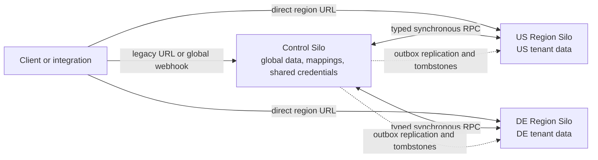

## Working model

Reliability comes from bounded failure and rehearsed recovery. Observability supplies the evidence: what users lost, which boundary saturated, how requests moved, and whether the attempted fix helped.

[DS10](../06-distributed-systems/10-security-incidents-and-capstone.md) derives recovery and incident reasoning from failure cases, while [DB6](../07-data-systems/06-postgresql-replication-backups-and-schema-change.md) follows database positions, promotion, backup, and restore.

## Attach reliability words to a user promise

**Reliability** is the system's ability to provide its specified behavior over time. **Availability** measures whether an operation or service is usable when requested. **Durability** asks whether acknowledged data survives the failures included in its contract. A service can remain available while losing accepted writes, or preserve every write while refusing new requests; keep the words separate.

A **fault** is an underlying problem such as a failed disk, dropped link, expired credential, or bad configuration. A **failure** occurs when the system no longer meets a promised behavior. Redundancy adds another component or copy so one fault need not become a user-visible failure, but copies that share power, credentials, code, or an operator path are not independent for those causes.

Start from one operation. State its success condition, SLI, SLO, data durability promise, and degraded result. Then ask which faults can break each statement. This keeps reliability attached to a checkout, upload, or query instead of an unlabeled fleet-uptime percentage.

## RTO and RPO buy different things

Recovery time objective limits how long service restoration may take. Recovery point objective limits how much recent data may be lost. Replication can improve failover time, but it can copy deletion or corruption immediately; backups and point-in-time recovery address a different failure class.

A backup counts only after a restore test proves identity, encryption keys, schema, dependencies, and timing all work inside the target.

## Draw shared causes before counting replicas

List the units that can fail together: process, node, rack, zone, region, account, identity provider, network control plane, quota, deployment pipeline, and software version. Place every service dependency and recovery tool under those units. Two data replicas in separate zones still share a failure if one credential, destructive migration, or bad release can reach both.

For each user operation, trace mandatory dependencies and optional ones. A mandatory dependency belongs in the operation's availability and recovery path; an optional dependency needs a defined degraded response. Then inspect the recovery path itself. A restore script stored behind the same unavailable identity system, or backups encrypted by a deleted key, do not create an independent route back to service.

- Physical causes: power, hardware, zone network, and regional service
- Administrative causes: credentials, quotas, account policy, and operator error
- Change causes: shared code, configuration, schema, and deployment cohort
- Recovery causes: backup location, key access, tooling, and practiced operator path

## Test the clock from declaration to useful service

A restore test starts when the incident condition is declared, not when an engineer finally runs the restore command. Record time to detect, decide, obtain access, restore bytes, apply logs, run schema checks, reconnect dependencies, verify business invariants, and admit traffic. The sum must fit the RTO. Track each segment separately so the next rehearsal fixes the slowest real step.

Prove the RPO by selecting a known write near the failure point and determining whether it appears after recovery. Count missing, duplicated, and out-of-order business records, not only database log positions. Test deletion and corruption as well as machine loss because replication can preserve the exact unwanted change. Keep the rehearsal isolated from production writes, and record the software version plus key material required to read the backup.

## Work one regional failure from authority to failback

“Multi-region” says where components run, not what consistency or recovery they provide. Begin with the write authority and replication direction, then trace detection, fencing, routing, capacity, and reconciliation.

| Shape                                       | Normal authority                                                                    | Main trade-off                                                                                                            |
| ------------------------------------------- | ----------------------------------------------------------------------------------- | ------------------------------------------------------------------------------------------------------------------------- |
| Active-passive                              | One region accepts writes; an asynchronous copy and deployable stack wait elsewhere | Simple conflict model, but nonzero replication lag creates an RPO and failover creates an RTO                             |
| Active-active reads with home-region writes | Reads run near users; each account or key has one named write region                | Lower read latency without concurrent writers, but home routing and read-your-writes behavior need explicit failure rules |
| Multi-writer                                | More than one region may accept writes for the same logical record                  | Requires cross-region coordination for one linearizable order or an application conflict rule for concurrent histories    |

Suppose orders normally write in `us-west` and replicate asynchronously to `us-east`. A regional health signal alone is not permission to promote. The recovery controller or human first proves the primary can no longer commit—or fences it with an independent routing or database epoch—then measures the recovery copy's last applied position. If the copy trails by 18 seconds, promotion cannot honestly promise a 5-second RPO. After promotion, the new region must have spare compute, database connections, quotas, keys, identity dependencies, DNS or routing controls, dashboards, and on-call access for the full failed-over load.

Routing also has state. DNS caches, open TCP connections, proxies, mobile clients, and retry loops can keep contacting the old endpoint after a control-plane change. Define whether those requests fail, redirect, or safely reach the new authority. A client that wrote before failover and then reads in the recovery region also needs a session rule: wait for the write position, return an explicit stale result, or fail instead of silently violating read-your-writes.

Failback is another migration, not “turn the primary back on.” Reconcile any divergent or accepted recovery-region writes, establish replication in the safe direction, verify lag and invariants, fence the current writer, move authority, shift traffic gradually, and retain rollback capacity. A true multi-writer system avoids that single promotion step only by paying elsewhere: synchronous cross-region consensus adds latency and availability dependence, while asynchronous conflict resolution requires application semantics for duplicate, concurrent, or reordered updates.

Test the whole procedure under normal change controls. Record the detected failure, last durable position, fencing evidence, routing convergence, restored user success, missing or duplicate records, and failback. AWS reliability guidance likewise calls out spare quota for failover, multiple locations, data-plane recovery controls, and recurring disaster-recovery tests; the product design still has to turn those categories into an exact authority transition.

The running design uses one active Region and one recovery Region. The next section pauses that case to study a different public design: Sentry separates global control state from customer data owned by a home Region. Treat it as a contrast in ownership and cross-Region communication; the order-service case resumes at [Continuing worked case](#continuing-worked-case-regional-failover-and-operating-evidence).

## Worked case: Sentry separates global control from regional data

Sentry's public multi-region design solves a different problem from the active-passive order service above. Customer data needs a named storage region, while accounts, routing metadata, and some third-party integration state must work across organizations and regions. The result is a global control plane joined to isolated regional data planes, not one database replicated everywhere.

The public documentation uses three execution modes:

- The **Control Silo** owns globally shared data and services. The documented flows place users, organization-to-region mappings, shared integration credentials, compatibility routing, and some webhook ingress work here.
- A **Region Silo** owns customer and event data for organizations assigned to that region. Region Silos are separate instances and do not communicate directly with one another.
- **Monolith mode** permits both ownership domains within the same application or deployment mode for self-hosted use, local development, or tests. It is not a third data owner and does not imply that a deployment has only one operating-system process.

One model or endpoint belongs to an ownership domain even when the monolith can call it locally. That rule matters because code tested only as a monolith can hide a cross-region network call, serialization boundary, or stale replica read.



_The dashed arrows show one documented source direction for global records such as users. A region-owned source can replicate toward Control instead; this is not automatic bidirectional replication._

### Put every record under one write authority

The first design artifact is an ownership table:

| Data or operation                                    | Authoritative location     | Non-owner access                                      |
| ---------------------------------------------------- | -------------------------- | ----------------------------------------------------- |
| User identity and explicitly global records          | Control Silo               | RPC or selected local replicas                        |
| Organization-to-home-region mapping                  | Control Silo               | Used by routing resolvers                             |
| Tenant operational and event state                   | Organization's Region Silo | RPC when Control needs a current read or mutation     |
| Credentials for integrations using the Control proxy | Control Silo               | Region asks Control to perform the provider operation |
| Replicated projection                                | Source model's owning silo | Local read only; changes arrive asynchronously        |

Replicated models remain single-writer while their source model is owned elsewhere. The owner accepts changes and sends projections to interested silos; the destination copy remains read-only under that ownership assignment. Because there are no concurrent replica writers in this design, it does not need a record-level conflict resolver for normal replication. A future ownership transfer or regional failover would need a separate fencing, catch-up, and authority-transfer contract; the public replication page does not define one. The current design pays with replica lag and no guaranteed read-after-write at the non-owner.

This makes replicated models appropriate for high-volume reads where cross-region RPC latency is too costly and stale data is acceptable. Organization-scoped projections often need only the organization's home region. User-scoped projections can be limited to regions where that user has memberships. Selecting destinations reduces copying and data exposure compared with broadcasting every global row everywhere.

### Route compatibility traffic with a global directory

Sentry had existing API traffic addressed to `sentry.io` before organizations lived in several regions. Its Control Silo API Gateway inspects an endpoint classified as region-owned, derives an organization region from request information, and synchronously proxies the request. Documented route hints include organization slug or ID, Sentry App identifiers, DSN host, and a static pin list for paths without a useful location key.

The proxy response includes `X-Sentry-Proxy-Url`, which tells a client which region URL avoids the extra Control hop. This is proxying plus a direct-location hint, not merely a redirect. The documentation also warns that requests sent to the global `sentry.io` endpoint do not satisfy the stated data-residency path; clients needing that property must use the region domain directly.

The general pattern needs four explicit contracts:

1. Which request field selects the tenant or organization?
2. Which strongly owned directory maps that identity to a home region?
3. What happens when the mapping is absent, stale, or changes during a request?
4. Can the client cache a direct endpoint, and how is that hint invalidated after a move?

A global directory is now on the compatibility request path. Its availability, mapping correctness, and proxy latency must be measured separately from the destination region.

### Keep one authority for shared mutable credentials

One external integration can serve organizations in several regions, while a provider refresh token is shared mutable state. If each region copied and refreshed that token, two regions could race: both observe expiry, one rotates the token, and the other invalidates or overwrites the new value.

Sentry keeps credential loading and refresh coordination in Control. A Region Silo sends the desired provider operation to Control; Control adds credentials, calls the provider, refreshes an expired token, persists the replacement, retries the provider request, and returns the result. The reusable rule is to send the operation to the writable secret authority rather than distribute writable copies of the secret.

That decision makes Control and the provider synchronous dependencies for the operation. It also creates a narrow place to audit credential use and serialize refresh. Capacity planning must include requests from every region, provider latency, refresh storms, and the effect of a Control outage on integration delivery.

### Choose RPC only when the owner must answer now

Sentry uses cross-region Remote Procedure Calls when a read or mutation must run synchronously in the owning silo. Services bundle domain methods such as organizations, users, or integrations. A typed service interface has a local implementation and serializable request and response models; the organization example in the documentation uses a database-backed implementation. In monolith mode or the owning silo, the framework calls the local implementation; across silos, it serializes JSON and uses HTTP. Tests also cross a serialization path so local success does not hide an invalid wire type.

A region-owned method needs a resolver that selects its destination. Documented resolvers route by organization slug, organization ID, explicit region name, or an argument containing an organization ID. Remote requests use an internal service-and-method endpoint and an HMAC signature made with a secret shared by Control and Region instances. The cited architecture page establishes request authenticity and integrity; it does not document transport encryption, replay prevention, or per-method authorization, so those remain separate review questions.

RPC yields an answer from the current owner, but it does not make the caller's database and the owner's database one transaction. The call adds wide-area latency and availability coupling. A lost response from a mutating call is ambiguous: the owner may have committed before the caller timed out. The public architecture page does not promise exactly-once RPC, so an engineering review should require an idempotency key, conditional mutation, or reconciliation query for effects that cannot be repeated safely.

Deployments across regions are not atomic, which turns internal RPC into a versioned distributed API. Sentry documents an expand-migrate-contract sequence:

- Deploy a new method to every receiver before any caller uses it.
- Add a parameter with a default, update callers, and only then make it required.
- Remove callers before removing a method.
- Rename by adding the new contract, migrating callers, and removing the old one later.

An in-place rename can fail while old and new releases coexist even when every change is in one repository.

### Replicate state through a transactional outbox

For local reads that can be stale, the source model writes an outbox record in the same database transaction as the authoritative change. After commit, outbox processing sends a serialized projection to an idempotent handler in each interested destination. The source and outbox either commit together or neither does; delivery after commit remains asynchronous and retryable.

This is at-least-once processing, not exactly-once execution. A destination handler may receive the same source version again after a timeout or worker failure. It must compare source identity and version or otherwise make replacement idempotent. Lag has no automatic business meaning: the product must state how stale a local replica may be and whether a path falls back to RPC, returns stale data explicitly, or fails when that bound is exceeded.

Outbox ordering is scoped rather than global. Sentry's outboxes use a shard scope and shard identifier; a Control outbox also names a destination region so each destination can make progress independently. Processing can coalesce several projection messages and use the newest source state, which fits state replacement but can lose meaningful intermediate deltas. An operation that requires every transition needs a non-coalescing identity and pays the resulting throughput cost.

The Sentry outbox documentation describes indefinite retry and no dead-letter queue. One poison message can therefore halt its ordered shard until code or data is repaired. This is intentionally different from the webhook mailbox's bounded discard policy. Alert on oldest age per shard, retain the failed payload and source identity for repair, and make replay safe before an incident.

Backfills use the same machinery by generating outbox work for existing source records in batches. Sentry versions those backfills so a later replica-schema change can replay the population again. This avoids a separate bulk-copy path with different serialization and ownership rules, but backfill traffic must be rate-limited against live replication and poison-message recovery.

### Use tombstones when a database foreign key cannot cross regions

A PostgreSQL foreign key cannot cascade from a Control database into isolated Region databases. Sentry's `HybridCloudForeignKey` moves `CASCADE` or `SET NULL` behavior into application-level eventual reconciliation.

The documented user-deletion path is:

```text
Control transaction: delete user + save outbox
  -> deliver deletion message to a Region Silo
  -> persist a tombstone for the removed user
  -> reconcile every regional relation that referenced the user
```

A tombstone records that an object once existed and is now absent. Sentry includes a monotonic ID, table name, and object identifier. Each relationship keeps a watermark containing its last fully processed record and a transaction identifier. Reconciliation processes one relation in batches, applies its `CASCADE` or `SET NULL` action, and advances that relation's watermark independently.

The watermark is needed because eventual delivery permits a late row to reference a user after the first deletion pass. The system must revisit the relation until its processed position has passed the relevant work. During convergence, a dangling reference can exist by design. APIs must decide whether to hide it, tolerate a null projection, or fetch the authority; the cross-database mechanism cannot provide an atomic foreign-key guarantee.

### Store external webhooks before forwarding them

Some third-party providers can call only one legacy webhook URL and expect a quick response. Sentry's Control Silo stores those payloads in PostgreSQL and later delivers them to the relevant Region Silos. The docs give three reasons not to hold the provider request open: short provider timeouts, integrations shared across regions, and the risk of exhausting synchronous RPC workers.

Payloads are assigned to ordered **mailboxes**. A mailbox usually maps to one integration. For high-volume providers, Sentry uses a finer remote-resource key, such as a GitLab project or Jira issue, so operations for one resource remain ordered while unrelated resources drain concurrently. This is a deliberate ordering boundary: coarser mailboxes preserve more order and suffer more head-of-line blocking; finer mailboxes gain throughput and preserve only per-key order.

The documented scheduler polls for the first due message in each mailbox, moves a selected block's next schedule forward to reserve it, and starts mailbox-draining tasks. Successful responses and most client errors delete the record. Network and server failures increment attempts and reschedule the head item; after ten attempts, the payload is logged and discarded. That is a bounded-delivery policy, unlike an indefinitely retried transactional replication outbox.

The described delete-after-forward protocol has an ambiguous failure window: a Region can accept a webhook and the Control worker can lose the reply before deleting the row. Duplicate delivery is therefore a design inference unless the receiver supplies deduplication; the public page does not claim exactly-once behavior. A stable provider delivery ID or payload digest should be carried through the mailbox and checked at the destination when duplicate side effects matter.

### Select the cross-region mechanism from the required answer

| Requirement                                                              | Mechanism                             | Cost accepted                                                               |
| ------------------------------------------------------------------------ | ------------------------------------- | --------------------------------------------------------------------------- |
| Current authoritative read or mutation must finish now                   | Owner-routed RPC                      | Wide-area latency, synchronous failure coupling, ambiguous mutation timeout |
| High-rate local reads may be stale                                       | Replicated model via outbox           | Replica lag, no read-after-write at the copy, schema and backfill work      |
| A source mutation must eventually cause durable remote work              | Transactional outbox                  | At-least-once idempotency, backlog and poison-message operation             |
| Cross-database deletion must converge                                    | Tombstone plus per-relation watermark | Temporary dangling references and batched cleanup                           |
| External sender needs a quick acknowledgement and later ordered delivery | Durable webhook mailbox               | Per-key head-of-line blocking and a bounded discard policy                  |

Do not replace this table with “use events for scale.” The choice turns on authority, freshness, transaction boundary, retry duration, ordering scope, and what the caller may observe during a partition.

### Analyze failures without inventing guarantees

The public pages document mechanisms, not a complete availability or disaster-recovery contract. They do not establish Control Silo failover topology, a numeric replication-lag SLO, cross-silo ACID transactions, exactly-once RPC or delivery, automatic writable-replica promotion, or a global ordering across outbox shards. Keep those as open requirements.

The architecture still supports concrete failure analysis:

- If Control is unavailable, compatibility routing, global metadata access, and shared credential operations can fail. A direct region-local operation may have fewer synchronous dependencies, but the public pages do not promise that all such operations continue.
- If one Region is unavailable, gateway and RPC calls to it fail on the synchronous path. Other Region Silos have no direct dependency on it. Control can durably accept some webhooks, while delivery to the failed region retries under the mailbox's bounded policy.
- If outbox processing lags, the authoritative source remains the owner while local projections and deletion cascades become stale. Oldest-outbox age expresses this failure better than queue count alone.
- If one ordered outbox shard or mailbox contains a poison message, later work behind that ordering key stalls. Repair, discard authority, and replay need named owners.
- If an organization mapping is wrong, the gateway can route to the wrong region even though both regions are healthy. Mapping correctness and change history are reliability data.

An operations view should include gateway routing failures and extra-hop latency, RPC latency and errors by service and source/destination, outbox backlog and oldest age by shard, replica source version, tombstone watermark lag and remaining references, webhook oldest age and head retries by mailbox, discard count, and idempotency conflicts. Those signals reveal whether the failed boundary is routing, synchronous owner access, eventual propagation, deletion convergence, or external delivery.

This case follows the Control Silo and Region Silo terminology in Sentry's public architecture pages. Current source may use newer “Cell” names in some internal paths; check the deployed version before mapping a class or metric name to this conceptual model.

## Serial dependencies multiply; redundant paths need independence

If every request requires auth and data services, their availabilities multiply. Redundant replicas improve the number only when failures are independent; shared power, credentials, deploy tooling, quotas, or code can erase that assumption.

## Convert percentages into lost minutes

Auth at 99.95% and a mandatory data service at 99.9% produce 0.9995 times 0.999, or 99.85005%, if their failures are independent. In a 43,200-minute month, the missing 0.14995% is about 64.8 minutes. The product makes the dependency cost visible; adding the two downtime percentages would only approximate the result and can double-count overlap.

Two independent data replicas where either can serve fail only when both fail: 0.001 times 0.001, or one chance in a million under the model. Data-tier availability becomes 99.9999%. Multiplying by auth yields about 99.9499%, or 21.6 unavailable minutes per month. Auth now dominates. Before accepting the improvement, test the independence claim against shared credentials, software, writes, quotas, routing, and repair procedures.

_The calculation is conditional on independent failures; the failure-domain map tests that condition._

```text
serial = 0.9995 * 0.999 = 0.9985005
downtime = (1 - 0.9985005) * 43,200 = 64.8 min
redundant_data = 1 - (0.001 * 0.001) = 0.999999
combined = 0.9995 * 0.999999 = 0.9994990005
```

## Turn the SLO into an error budget and burn-rate alert

An availability service-level objective (SLO) defines the allowed bad fraction. A 99.9% SLO allows 0.1%, or `0.001`, of eligible events to be bad during its window. If a 30-day window contains 10,000,000 eligible requests, the budget is 10,000 bad requests. The same arithmetic works for a latency SLO when a request beyond the threshold counts as bad.

**Burn rate** compares the observed bad fraction with the allowed bad fraction:

```text
allowed bad fraction = 1 - 0.999 = 0.001
observed bad fraction over one hour = 0.02
burn rate = 0.02 / 0.001 = 20x
time to exhaust a 720-hour budget at 20x = 720 / 20 = 36 hours
```

A 20x burn sustained for an hour deserves a different response from one bad minute followed by recovery. Use a short window to detect a fast change and a longer window to prove that it persists. Page only when both windows cross the fast-burn policy; use longer, lower-burn windows for an investigation or ticket. The exact windows and thresholds come from the service's response time and acceptable budget spend, not from copying one dashboard.

Tie rollout control to the same budget. A canary that consumes budget materially faster than its simultaneous control should stop or roll back even if CPU looks normal. After rollback, keep the incident open until the long window falls, queues drain, replica lag recovers, and the budget forecast is understood. Do not subtract errors excluded only because the monitoring pipeline failed; eligibility and missing-data policy are part of the SLI contract.

## Use distributions and causal context

Averages hide a small slow population that dominates a fan-out request. Histograms preserve latency distributions for aggregation, traces connect work across processes, structured logs record discrete decisions, and metrics show rates and resource state.

> **Cardinality is a resource.** Do not put user IDs, request IDs, or unbounded URLs in metric labels. Keep high-cardinality identity in logs and traces, then link through trace context.

OpenTelemetry also defines a profiling signal, currently alpha. A profile samples stack traces and resource use so an operator can connect CPU or allocation pressure to code paths; it complements rather than replaces request traces and host metrics. Treat its status as version-sensitive, and do not promise that every language, collector, or backend implements the same profile path. For a portable baseline, keep logs, metrics, and traces working independently, then add continuous profiles where the runtime and collector support them.

## Reliability covers the whole workload, not only uptime

One useful review lens comes from the AWS Well-Architected Framework, which currently names six pillars. It is not an interview scoring standard, and another cloud can use the same questions without AWS products.

| Review area            | Questions that expose a gap                                                                                                                               |
| ---------------------- | --------------------------------------------------------------------------------------------------------------------------------------------------------- |
| Operational excellence | Who owns the service, how is it deployed and rolled back, which routine work is automated, and what does the on-call engineer do first?                   |
| Security               | Who can call each path, which identity reaches each resource, where are secrets and keys held, what is logged for audit, and how does deletion propagate? |
| Reliability            | Which faults are tolerated, what is the degraded behavior, where are RTO and RPO met, and has recovery been rehearsed?                                    |
| Performance efficiency | Which resource limits latency or throughput, how was capacity measured, and can the system adapt when workload shape changes?                             |
| Cost optimization      | What costs one successful operation, which tenant or feature drives spend, and which idle or duplicated resources buy a stated requirement?               |
| Sustainability         | How much compute, storage, network, and accelerator time produces one useful outcome, and which waste can be removed without breaking another target?     |

Google's SRE introduction describes service responsibility in terms of availability, latency, performance, efficiency, change management, monitoring, emergency response, and capacity planning. The practical lesson is that a diagram is unfinished when nobody can deploy, observe, repair, and provision it. Record an owner, deploy and rollback path, capacity forecast, actionable alerts, incident procedure, and restore rehearsal beside the components.

## Treat cost and energy as resource questions

Cost and environmental impact often move together when waste is removed, but they are not interchangeable measurements. A reserved resource can cost less while consuming the same runtime capacity; compression can spend more CPU to move fewer network bytes; another replica spends resources to buy reliability. State which target wins when they conflict.

Choose a unit tied to useful work, such as vCPU-seconds per completed document, GPU-seconds per generated token, GB-months per retained active account, or transferred bytes per delivered object. Graph that unit beside success rate and tail latency. A falling bill caused by failed requests or deleted recovery capacity is not an efficiency improvement.

Suppose a batch service completes 10 million documents with 50,000 vCPU-hours and transfers 30 decimal TB. That is 18 vCPU-seconds and 3 MB of network transfer per completed document. A new build uses 42,000 vCPU-hours and 25 TB for the same successful workload, or 15.12 vCPU-seconds and 2.5 MB per document. The resource units improved only if output correctness, p99 completion time, and recovery capacity stayed inside contract. They still do not prove a particular energy or emissions reduction without an agreed measurement source.

```text
50,000 vCPU-hours * 3,600 / 10,000,000 = 18 vCPU-s/document
30,000,000 MB / 10,000,000 = 3 MB/document
42,000 vCPU-hours * 3,600 / 10,000,000 = 15.12 vCPU-s/document
25,000,000 MB / 10,000,000 = 2.5 MB/document
```

The first checks are plain:

- Stop resources and derived copies with no owner or current requirement
- Right-size requests and instance types from measured use, then keep explicit failure headroom
- Batch small work when the latency contract permits it and cap retry or replay amplification
- Move old data to a suitable tier, shorten unjustified retention, and avoid copying bytes across boundaries without a read need
- Match accelerators and software to the measured workload; an idle or poorly filled GPU is expensive capacity regardless of peak speed
- Schedule flexible batch work to flatten peaks only when its completion deadline still holds

If the organization has an energy or emissions target, obtain the measurement method and boundary rather than inferring it from price alone. Record whether the figure covers the application, allocated cloud resources, a Region, or a broader supply chain. AWS's sustainability guidance frames the work as meeting demand with fewer resources and reducing waste; a design still needs its own product unit, baseline, and improvement test.

## Design the work of operating the service

Infrastructure engineering includes the loops after launch. Forecast demand far enough ahead to cover the lead time for quotas and capacity. Load-test the normal and degraded paths. Ship small changes through a canary, keep rollback authority clear, and verify queues, caches, and replicas return to normal after rollback. During an incident, quantify user impact, stop the spread, restore service, preserve evidence, and turn the repair into a tested code or procedure change.

Alert only when a person must act within a stated time. A runbook should identify the user symptom, safe checks, mitigation, rollback or failover authority, and escalation boundary. It cannot replace understanding, but it keeps the first minutes from depending on one person's memory. Track manual pages, repetitive tickets, and one-off recovery steps as engineering debt; if traffic doubles and operator work doubles with it, the service has not automated its operating path.

## Canary the user-visible contract

Expose a small cohort, compare it with a control, and gate promotion on SLO-aligned latency, errors, correctness, and saturation. Predefine rollback authority and the maximum observation window; a canary that cannot stop a rollout is only a dashboard.

## Build one explanation across metrics, traces, and logs

Start with the affected user operation and time window. Use an edge SLI to quantify good and failed attempts, then split by region, release cohort, response class, and operation. Check saturation and queue time at the boundary where the split appears. A trace sample can reveal which span consumed the tail; its trace ID then locates structured logs for the decision or error without turning that ID into a metric label.

Compare the canary with a simultaneous control because traffic mix and dependency health change over time. Set minimum sample size or observation duration before promotion, along with immediate abort thresholds for correctness or severe errors. After rollback, keep watching until queues, caches, connection pools, and replica lag return to their prior range. A falling error rate alone does not prove recovery when stored work is still accumulating out of sight.

> **Evidence order.** Measure user impact first, find the boundary where behavior diverges, then inspect resource and code detail. Starting from a random error log can waste the incident window.

## Continuing worked case: regional failover and operating evidence

The service runs active-passive across two regions. Within the active region, each shard waits for its synchronous standby in another zone. A separate asynchronous regional copy may trail by at most the declared 30-second RPO. The passive region keeps database replicas, routing controls, API capacity, queue access, credentials, and the six-node notification pool ready; the cost buys a credible 15-minute RTO rather than hoping machines and quotas appear during an outage.

Failover follows a timed runbook. Detection and declaration receive two minutes. Fencing the old writer, checking the candidate's replay position, and acquiring a higher writer epoch receive three. Promotion and routing receive five, leaving five minutes to verify tenant isolation, create an order, read it back, publish its outbox event, and admit traffic in stages. Any acknowledged transactions beyond the selected regional replay position count against the 30-second RPO and enter reconciliation; the new primary never accepts writes while the old epoch can still commit.

The operating view starts with the fixed promises: 99.9% monthly create availability allows about 43 minutes of bad create service in a 30-day month, create p99 stays below 250 ms, and 99% of notification dispatches start within five seconds. Edge SLIs, primary-pool wait, per-shard lag, oldest queue age, unique dispatch receipts, and dead letters explain which boundary spent that budget. Quarterly regional failover drills and independent backup restores record actual RTO, recovered position, missing business IDs, and duplicate side effects.

## Summary

Reliability claims are useful only when they name the user operation, failure class, recovery clock, data-loss bound, and measurement. Observability should connect impact to a causal boundary, while the operating plan explains who changes, repairs, and provisions the system.

- **Keep the promises separate.** Availability asks whether an operation can serve now; durability asks whether acknowledged state survives the stated faults. RTO limits restoration time, while RPO limits acceptable lost history. Replication can shorten failover while copying corruption, so backup and restore remain separate.
- **Draw shared failure domains and test recovery.** Processes, nodes, zones, Regions, accounts, identity systems, quotas, deploy pipelines, and versions can invalidate an independence assumption. Measure detection through controlled traffic admission, and prove the RPO against known business records after restore.
- **Calculate dependency effects.** Independent mandatory services at 99.95% and 99.9% yield 99.85005%, or about 64.8 unavailable minutes in a 43,200-minute month. Redundancy improves that figure only for causes the copies do not share.
- **Make regional authority explicit.** Active-passive, home-region writes, and multi-writer systems pay different consistency and recovery costs. Fence the old writer, measure the actual recovery position, provide failed-over capacity and dependencies, test routing convergence, and treat failback as another migration.
- **Choose a cross-region mechanism from ownership and freshness.** Sentry's public design keeps global state in a Control Silo and tenant data in a home Region Silo. It uses owner-routed RPC for synchronous work, single-writer replicas and transactional outboxes for stale local reads, tombstones and watermarks for eventual deletion, and ordered mailboxes for external webhooks.
- **Alert on budget consumption.** A 99.9% SLO allows a 0.1% bad-event fraction. Burn rate divides observed bad fraction by that allowance; combine short and long windows so a fast sustained burn pages while a slow burn creates a lower-urgency response.
- **Preserve distributions and causal links.** Histograms expose tails, metrics show rates and resource state, traces connect cross-process work, structured logs explain decisions, and profiles attribute CPU or allocation work to code. Keep unbounded IDs out of metric labels.
- **Operate change and incidents at the user boundary.** Canary against a simultaneous control with rollback authority and SLO guardrails. During failure, quantify impact, stop the spread, restore service, preserve evidence, and turn repeated manual work into tested automation.
- **Review more than uptime.** Check operational ownership, security, reliability, performance efficiency, cost, and sustainability. Google SRE's service responsibilities add change management, emergency response, monitoring, and capacity planning to the everyday operating job.
- **Measure efficiency per useful outcome.** Track cost and compute, storage, network, or accelerator use per successful operation alongside latency and correctness. Remove idle work, unjustified retention, duplicate copies, and retry amplification, but keep the spare capacity and redundancy purchased by a stated requirement.

## References

- [NIST SP 800-34 Rev. 1: Contingency Planning Guide](https://csrc.nist.gov/pubs/sp/800/34/r1/upd1/final)
- [The Tail at Scale](https://research.google/pubs/the-tail-at-scale/)
- [OpenTelemetry: Signals](https://opentelemetry.io/docs/concepts/signals/)
- [OpenTelemetry: Profiles](https://opentelemetry.io/docs/concepts/signals/profiles/): Describes the alpha profiling signal, sample model, and correlation with other signals.
- [OpenTelemetry: Metrics cardinality limits](https://opentelemetry.io/docs/concepts/signals/metrics/#cardinality-limits): Explains why unique attribute combinations consume aggregation state.
- [Prometheus: Metric Types](https://prometheus.io/docs/concepts/metric_types/)
- [Google SRE Workbook: Canarying Releases](https://sre.google/workbook/canarying-releases/)
- [Google SRE Workbook: Alerting on SLOs](https://sre.google/workbook/alerting-on-slos/): Derives error-budget burn rate and multiwindow, multi-burn-rate alerts.
- [Amazon Builders' Library: Minimizing Correlated Failures](https://aws.amazon.com/builders-library/minimizing-correlated-failures-in-distributed-systems/)
- [AWS Well-Architected Reliability Pillar](https://docs.aws.amazon.com/wellarchitected/latest/reliability-pillar/welcome.html): Covers failover quota, fault isolation, data-plane recovery, and recurring disaster-recovery tests.
- [AWS Multi-Region fundamentals: operational readiness](https://docs.aws.amazon.com/prescriptive-guidance/latest/aws-multi-region-fundamentals/fundamental-4.html): Connects multi-region strategy, failover coordination, RTO/RPO, and operational testing.
- [AWS Well-Architected Framework: The Six Pillars](https://docs.aws.amazon.com/wellarchitected/latest/framework/the-pillars-of-the-framework.html): Defines operational excellence, security, reliability, performance efficiency, cost optimization, and sustainability as separate review areas.
- [AWS Well-Architected: Sustainability Pillar](https://docs.aws.amazon.com/wellarchitected/latest/sustainability-pillar/sustainability-pillar.html): Provides current guidance for measuring workload resource use, reducing waste, and recording trade-offs against sustainability targets.
- [Google SRE: Introduction](https://sre.google/sre-book/introduction/): Describes service ownership across availability, latency, performance, efficiency, change management, monitoring, emergency response, and capacity planning.
- [Sentry application architecture and silo modes](https://develop.sentry.dev/application-architecture/overview/): Defines Control, Region, and Monolith modes and the ownership split between global and tenant data.
- [Sentry Control Silo](https://develop.sentry.dev/application-architecture/multi-region-deployment/control-silo/): Documents compatibility routing, shared integration credential proxying, and durable webhook mailboxes.
- [Sentry cross-region replication](https://develop.sentry.dev/application-architecture/multi-region-deployment/cross-region-replication/): Documents replicated models, single-writer ownership, outbox delivery, cross-silo tombstones, and relationship watermarks.
- [Sentry cross-region RPC](https://develop.sentry.dev/application-architecture/multi-region-deployment/cross-region-rpc/): Documents typed services, destination resolvers, HMAC authentication, local and remote transports, and rolling protocol changes.
- [Sentry transactional outboxes](https://develop.sentry.dev/backend/application-domains/outboxes/): Documents source-transaction coupling, delivery, ordering shards, coalescing, retries, and cross-silo failure behavior.
