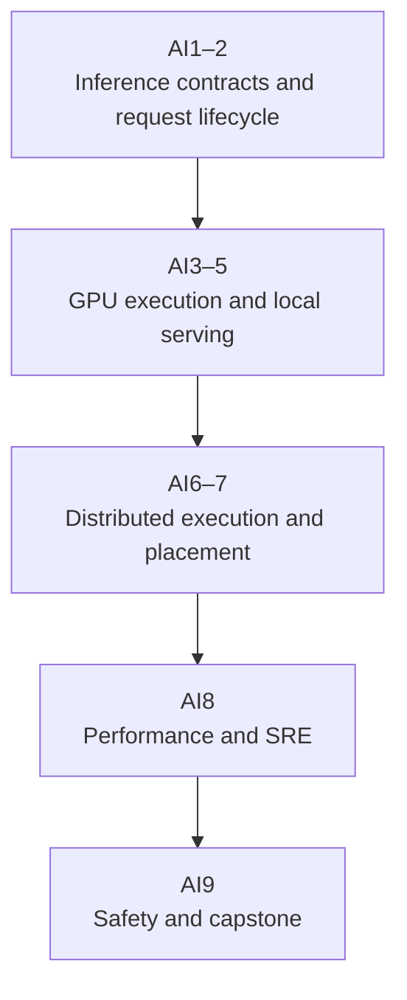

## Scope

These notes assume you understand an HTTP request and a container, but they assume no machine-learning, CUDA, or distributed-inference knowledge. Start with AI1 and read in number order. AI2 follows one complete request before AI3 opens the GPU, so the hardware vocabulary always has a service-stage to attach to. Each later note uses that request path.

The sequence traces one request through a model server, estimates its memory and token demand, compares single- and multi-GPU layouts, places the service on Kubernetes, measures latency and energy, and explains rollout and failure behavior. Production decisions still require workload-specific profiling, incident evidence, and access to the target hardware.

AI1 compares generation, embeddings and reranking, streaming speech, vision, diffusion, and asynchronous batch inference by request state, batching, latency, throughput unit, and failure mode. The remaining notes take autoregressive language-model serving as the deepest end-to-end case. The same measurement method transfers to other model families, but their production paths need separate hardware- and workload-specific study.

## How the collection fits together

## Reading path

| Note                                                            | Why it comes here                                                                                                                   |
| --------------------------------------------------------------- | ----------------------------------------------------------------------------------------------------------------------------------- |
| [AI1: Model basics](01-inference-fundamentals.md)               | Defines models, tokens, tensors, attention, retained state, and the workload families before any serving mechanism depends on them. |
| [AI2: Request lifecycle](02-serving-lifecycle.md)               | Turns those model units into admission, prefill, decode, streaming, cache growth, and cleanup for one request.                      |
| [AI3: GPU systems](03-gpu-systems.md)                           | Maps the request's tensor work and memory movement onto CPU, GPU, CUDA, drivers, and device topology.                               |
| [AI4: Serving engines](04-serving-engines.md)                   | Places vLLM, SGLang, TensorRT-LLM, and Triton between the model bundle and the surrounding service contract.                        |
| [AI5: Node optimization](05-single-node-optimization.md)        | Tunes one measured node before distributed communication and fleet orchestration add more variables.                                |
| [AI6: Distributed serving](06-distributed-inference.md)         | Splits a replica or replicates traffic only after the single-node fit and bottleneck are known.                                     |
| [AI7: GPU orchestration](07-gpu-orchestration.md)               | Places complete serving groups on Kubernetes and connects device readiness to warm fleet capacity.                                  |
| [AI8: Performance and SRE](08-inference-performance-and-sre.md) | Measures quality, phase latency, goodput, energy, saturation, and failure headroom across that deployed path.                       |
| [AI9: Safety and rollout](09-production-safety-and-capstone.md) | Joins artifact trust, privacy, evaluation, capacity, canarying, rollback, and the complete design case.                             |

Engine features, Kubernetes maturity labels, accelerator support, and command-line flags change by release. Check the linked project documentation before choosing a production configuration.

## Useful background

- No model-training experience
- No prior knowledge of tensors, Transformers, GPUs, CUDA, or collective communication
- No GPU for the calculations and architecture reviews; only hardware profiling requires one

The Kubernetes chapter includes the small amount of cluster vocabulary it needs and links back to the cloud notes for the full control-plane path. Arithmetic uses bytes, seconds, requests, tokens, and rates, with the units shown in each worked case.
