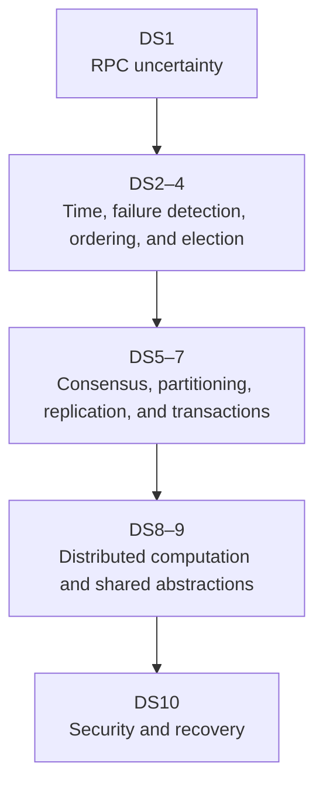

## Scope

A distributed system is several independent processes trying to preserve one useful service while messages are delayed, duplicated, reordered, or lost and while machines pause, restart, or disappear. These notes build the vocabulary and reasoning needed to follow one operation across those boundaries.

Read the notes in order. The sequence begins with the system model and an ordinary remote call, then adds time, failure detection, group communication, consensus, partitioned storage, replication, distributed computation, shared data abstractions, security, and incident analysis. Each mechanism is introduced through the problem that requires it, the assumptions under which it works, and the evidence an operator would inspect when it fails.

The primary lecture source is the University of Illinois CS 425 / ECE 428 Fall 2025 course. Historical systems such as Napster, Chord, MapReduce, Storm, and the original Dynamo remain useful because their mechanisms recur in current systems. Product-specific claims are checked against current project documentation before they are presented as current behavior.

## How the mechanisms depend on one another

## Learning path

| Note | Question answered                                                 | What it supplies to the next stage                                      |
| ---- | ----------------------------------------------------------------- | ----------------------------------------------------------------------- |
| DS1  | What changes when a call crosses a process?                       | RPC uncertainty, operation identity, deadlines, and retry budgets       |
| DS2  | How can events be ordered without one global present?             | Physical-time bounds, causality, logical clocks, and consistent cuts    |
| DS3  | What can silence prove?                                           | Suspicion, membership, dissemination, and incarnation                   |
| DS4  | How can a group deliver in order and keep stale holders out?      | Multicast order, election assumptions, leases, and fencing              |
| DS5  | How can one durable authority survive crashes?                    | Consensus, replicated logs, state machines, and etcd                    |
| DS6  | How are records placed, routed, and repaired?                     | Partitioning, distributed hash tables, and Cassandra as a concrete case |
| DS7  | What may clients observe across copies and transactions?          | Consistency models, session rules, replication, and atomic commit       |
| DS8  | How does computation move through a cluster?                      | Shuffle, stream state, checkpoints, placement, and resource policy      |
| DS9  | What do local-looking shared abstractions hide?                   | Filesystem, memory, and edge failure contracts                          |
| DS10 | How is the complete service protected, investigated, and rebuilt? | Security, incident analysis, and recovery                               |

Difficulty labels describe the depth inside a note, not another reading order. Follow the note numbers; DS6 and DS8 apply mechanisms introduced in earlier Advanced notes.

## Source map

| Supplied lecture material                                                                                                                                                                                                                                                                                    | Used principally in                              |
| ------------------------------------------------------------------------------------------------------------------------------------------------------------------------------------------------------------------------------------------------------------------------------------------------------------ | ------------------------------------------------ |
| [L1: introduction](https://courses.grainger.illinois.edu/cs425/fa2025/L1.FA25.pdf) and [L2-3: cloud computing](https://courses.grainger.illinois.edu/cs425/fa2025/L2-3.FA25.pdf)                                                                                                                             | DS1 system model and failure boundaries          |
| [L4: MapReduce and Hadoop](https://courses.grainger.illinois.edu/cs425/fa2025/L4.FA25.pdf)                                                                                                                                                                                                                   | DS8 distributed dataflow                         |
| [L5: gossip](https://courses.grainger.illinois.edu/cs425/fa2025/L5.FA25.pdf) and [L6: failure detection and membership](https://courses.grainger.illinois.edu/cs425/fa2025/L6.FA25.pdf)                                                                                                                      | DS3 membership and failure detection             |
| [L7-8: peer-to-peer systems](https://courses.grainger.illinois.edu/cs425/fa2025/L7-8.FA25.pdf)                                                                                                                                                                                                               | DS6 partitioning and distributed hash tables     |
| [L9-11: key-value and NoSQL stores](https://courses.grainger.illinois.edu/cs425/fa2025/L9-11.FA25.pdf)                                                                                                                                                                                                       | DS6 partitioning and DS7 replication             |
| [L12: time and ordering](https://courses.grainger.illinois.edu/cs425/fa2025/L12.FA25.pdf)                                                                                                                                                                                                                    | DS2 clocks, causality, and snapshots             |
| [L16: multicast](https://courses.grainger.illinois.edu/cs425/fa2025/L16.FA25.pdf), [L17: leader election](https://courses.grainger.illinois.edu/cs425/fa2025/L17.FA25.pdf), and [L18: mutual exclusion](https://courses.grainger.illinois.edu/cs425/fa2025/L18.FA25.pdf)                                     | DS4 group communication and coordination         |
| [L19-20: RPCs and concurrency control](https://courses.grainger.illinois.edu/cs425/fa2025/L19-20.FA25.pdf) and [L21: replication control](https://courses.grainger.illinois.edu/cs425/fa2025/L21.FA25.pdf)                                                                                                   | DS1 RPCs and DS7 transactions and replication    |
| [L22: network structure](https://courses.grainger.illinois.edu/cs425/fa2025/L22.FA25.pdf), [L22B: stream processing](https://courses.grainger.illinois.edu/cs425/fa2025/L22.B.FA25.pdf), and [L23: scheduling](https://courses.grainger.illinois.edu/cs425/fa2025/L23.FA25.pdf)                              | DS8 network structure, dataflow, and scheduling  |
| [L24A: distributed file systems](https://courses.grainger.illinois.edu/cs425/fa2025/L24.A.FA25.pdf), [L24B: consistency models](https://courses.grainger.illinois.edu/cs425/fa2025/L24.B.FA25.pdf), and [L25A: distributed shared memory](https://courses.grainger.illinois.edu/cs425/fa2025/L25.A.FA25.pdf) | DS7 consistency and DS9 shared data abstractions |
| [L25B: sensor networks](https://courses.grainger.illinois.edu/cs425/fa2025/L25.B.FA25.pdf) and [L26: graph processing and machine learning](https://courses.grainger.illinois.edu/cs425/fa2025/L26.FA25.pdf)                                                                                                 | DS8 parallel computation and DS9 edge systems    |
| [L27: security](https://courses.grainger.illinois.edu/cs425/fa2025/L27.FA25.pdf) and [L28: datacenter disasters](https://courses.grainger.illinois.edu/cs425/fa2025/L28.FA25.pdf)                                                                                                                            | DS10 security and incident analysis              |
| [Final review](https://courses.grainger.illinois.edu/cs425/fa2025/Llast.FA25.pdf)                                                                                                                                                                                                                            | The complete dependency map and worked case      |

The supplied set jumps from L12 to L16. DS5 therefore uses the final review's consensus topic together with the original Paxos and Raft papers; it does not imply that the missing lecture decks were reviewed.

## Useful background

- Comfort reading an HTTP request and a small database transaction
- Basic familiarity with processes, files, IP addresses, and persistent storage
- Willingness to write down assumptions about failures and timing before choosing an algorithm

For a slower introduction to machines, networks, and storage, start with [low-level infrastructure](../02-low-level-infrastructure/INDEX.md). For cloud service boundaries and Kubernetes, use [cloud infrastructure](../01-cloud-infrastructure/INDEX.md). The [system design](../03-system-design/INDEX.md) module applies these mechanisms to interview and production design decisions.
