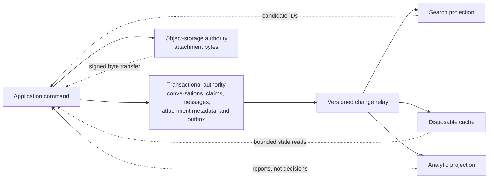

## Working model

A database choice starts with the work it must make cheap and the mistakes it must prevent. Record shape matters, but the decisive inputs are lookup keys, ordered ranges, mutation boundaries, concurrency rules, data lifetime, and failure behavior.

## Begin with operations, not products

“Use MongoDB” or “put it in Postgres” skips the design. Start with the operations users and other systems perform. For each operation, write the identity used to find state, the maximum amount of state touched, the order of returned results, the records changed together, and what a caller may observe after success or failure.

Suppose a service manages support conversations. A customer can create a conversation, append a message, read the newest 50 messages, search its own conversations, and delete its account. An agent can claim a conversation and update its status. Those sentences expose several different access paths:

| Operation            | Lookup and order                             |           Maximum result | Mutation boundary                        | Required observation                                      |
| -------------------- | -------------------------------------------- | -----------------------: | ---------------------------------------- | --------------------------------------------------------- |
| Create conversation  | Tenant plus client operation ID              |               One result | Conversation and saved operation result  | A retry returns the same conversation                     |
| Append message       | Tenant plus conversation ID                  |              One message | Message and conversation activity time   | Later reads by the same user include the accepted message |
| Read recent messages | Conversation ID, sequence descending         |              50 messages | None                                     | Stable cursor pagination                                  |
| Claim conversation   | Conversation ID plus expected version        |         One conversation | Owner, status, version, and audit record | Two agents cannot both win the same version               |
| Search conversations | Tenant, terms, status, and time              |                 100 hits | Derived index only                       | Results may lag by a stated interval                      |
| Delete account       | User ID and every owned or referenced record | Potentially many records | A durable deletion workflow              | Derived copies and backups follow declared policy         |

The table rules out several accidental designs. An unbounded array of messages inside one conversation document turns a busy conversation into a growing read and rewrite unit. A key-value layout with only `conversation_id` cannot serve tenant search without another index. A search engine can answer terms and ranking, but it should not decide whether two agents claimed the same version. Deletion cannot be implemented as one row delete when the service owns projections, object attachments, audit policy, and backups.

## Name authority before adding copies

The authoritative record decides which business state won. A cache, search index, warehouse table, read replica, and materialized view are copies with narrower jobs. They can be useful while stale, unavailable, or rebuilding only when the product defines what happens in those states.

For the conversation service, a transactional database can own conversation identity, claims, status, and message sequence. Object storage can own attachment bytes while the database owns their metadata and lifecycle. A search index can serve terms and ranking after an asynchronous projection. An analytic store can aggregate response times without participating in the claim transaction.

Adding a copy creates more than a data pipeline. The design now needs a source position, lag limit, schema contract, access policy, deletion path, rebuild procedure, and a rule for requests that arrive during recovery. If the system cannot say how to rebuild a projection, that projection has quietly become another authority.



## Separate entities from aggregates

An **entity** has a stable identity, such as a conversation, message, tenant, or user. An **aggregate** is the set of state changed under one consistency boundary. The two concepts overlap but are not identical. A conversation and its messages may form one conceptual product object while messages remain separate stored records because the history is unbounded.

Document databases make bounded aggregates convenient: a profile with a small set of preferences can load and update as one document. Embedding avoids a join and can make a single-document write atomic. The same technique fails when a nested collection grows without a known bound, changes at a much higher rate than its parent, or must be queried and indexed independently.

Referencing separates lifecycles and permits independent queries, but it moves assembly into another query or application step. MongoDB's modeling guidance frames embedding and references around access patterns, atomicity, and growth rather than around whether two nouns “belong together.” The same reasoning applies to JSON columns in PostgreSQL and map attributes in DynamoDB. A nested syntax does not remove item-size, index, or mutation costs.

For conversations, keep the conversation header bounded and store messages separately:

```text
conversation
  tenant_id
  conversation_id
  status
  assigned_agent_id
  version
  last_message_sequence
  last_activity_at

message
  tenant_id
  conversation_id
  sequence
  sender_id
  body_or_attachment_reference
  created_at
```

`conversation_id + sequence` gives one ordered message identity. A transaction or conditional write increments `last_message_sequence` and inserts the message so two concurrent appends cannot claim the same position. If the chosen database cannot make those changes together, the design needs another sequencing protocol or a weaker ordering contract.

## A key is both identity and placement

In a single-node data structure, a key identifies a record or position. In a distributed database, some part of the key also selects an owner or partition. That second job changes the consequences of key design.

A high-cardinality tenant or conversation identifier can spread work when hashed. A low-cardinality status such as `open` or `closed` concentrates unrelated writes and makes a poor partition key even though it is a useful filter. Time ordering supports range scans, but a monotonically increasing leading key can send all new writes to one range owner. Composite keys combine these needs: a partition component chooses a bounded ownership unit, while a sort or clustering component orders records inside it.

DynamoDB names these parts the partition key and optional sort key. Cassandra names a partition key and clustering columns. A relational index uses a sequence of columns where equality on a leading prefix and then a range often determines which part can be scanned efficiently. The product vocabulary differs, but the designer still asks:

- How many distinct active partition values exist at peak?
- What is the largest record set and byte count behind one value?
- Which requests need an ordered range, and how large can that range grow?
- Can one customer, celebrity, device, or timestamp dominate the owner?
- Which alternate lookups require a maintained secondary structure?

For the message history, `(tenant_id, conversation_id)` is a plausible ownership prefix and `sequence` is the ordered component. It bounds one read to one conversation and avoids grouping all tenant messages into one ever-growing partition. A tenant-wide search belongs in another access path because one primary key should not pretend to optimize both workloads.

## Secondary indexes are maintained copies

A secondary index stores another mapping from selected values to primary records or record locations. It is a copy, even when the database maintains it automatically. Every insert, indexed update, and delete can add work to the index; the index consumes cache and storage and may need its own partitioning or background maintenance.

The cost depends on the engine. A PostgreSQL B-tree normally stores index keys plus a heap tuple identifier, then checks visibility on the candidate heap version unless an index-only scan can trust the visibility map. An InnoDB secondary index stores the secondary key plus the clustered primary-key value, so fetching other columns commonly performs another traversal through the primary tree. A MongoDB multikey index creates index entries for array values and carries restrictions that follow from representing one document several times. A DynamoDB global secondary index has its own key distribution and capacity; a hot or under-provisioned index can throttle writes to the base table.

Write an index only for a real access path or constraint. Then trace the physical read: seek, scanned entries, fetched records, visibility or filtering work, sort, bytes, and result bound. “Uses an index” is not a cost estimate.

## Constraints choose where races are resolved

An invariant states something that must remain true across concurrent requests and crashes. Examples include one conversation per client operation ID, one active claim version, non-decreasing message sequence, and tenant isolation.

The safest location for an invariant is the lowest shared authority that sees all competing writes. A relational unique constraint can serialize two inserts for the same tenant and operation ID. A DynamoDB condition expression can reject an update when an expected version no longer matches. MongoDB can make a single-document update conditional and supports multi-document transactions when the invariant crosses documents, though transactions add coordination and do not repair a poor aggregate boundary. Cassandra lightweight transactions supply a linearizable compare-and-set path for a partition, at a different latency and availability cost from ordinary writes.

An application-side “read, then write if absent” is not an invariant under concurrency unless the later write is conditional. Two callers can read absence before either writes. The final storage operation must compete on a shared key, unique constraint, lock, compare-and-set value, or consensus decision.

## Transactions need a declared scope

A transaction groups operations under atomicity and isolation rules. It does not make all external effects part of the commit. A database transaction cannot atomically send an email, charge a provider, update an unrelated search cluster, and publish to an independent broker unless a larger protocol coordinates those systems.

Keep the local transaction around authoritative state and a durable intent to perform later work. A transactional outbox is one example: the conversation claim and an `AgentAssigned` outbox record commit together, then a relay publishes that record at least once. Consumers deduplicate by event identity. The technique closes the gap between the database change and intent to publish; it does not grant exactly-once execution at the email or search boundary.

Transaction scope also affects partitioning. A relational database can enforce a multi-row invariant on one writer, but sharding may split the participating rows. DynamoDB transactions can coordinate supported items inside one Region but charge more underlying operations and do not make a Global Tables transaction atomic across Regions. Cassandra batches are not a general replacement for relational transactions; lightweight transactions serve compare-and-set operations with their own protocol.

## Retention and deletion belong in the first schema

Data lifetime changes keys, partitions, indexes, backups, and operating cost. A time-bounded event table can partition by a lifecycle interval and drop complete old partitions. A document with an unbounded history cannot expire one old child cheaply if the engine rewrites or indexes the whole aggregate. Time-to-live (TTL) policies often turn expiration into delayed background cleanup rather than an immediate physical erase.

Deletion has several meanings:

- Logical state disappears from ordinary reads.
- Physical storage eventually reclaims the bytes.
- Replicas, caches, search, analytics, and exported files receive the deletion.
- Backups expire or become inaccessible according to policy.
- Audit records retain only the fields and duration the policy permits.

Cassandra writes tombstones because an absent value cannot tell a replica that missed the delete what happened. MongoDB change streams and database change data capture (CDC) can propagate a deletion only while the necessary source history remains. DynamoDB TTL deletion is asynchronous and should not stand in for an immediate user-facing delete contract. A design that waits until implementation to ask about retention will usually have chosen the wrong partition or aggregate boundary.

## Select a storage family by the paid operation

Product categories describe a starting shape, not a complete contract:

| Storage family          | Operation it commonly makes cheap                                          | Work that remains visible                                                                               |
| ----------------------- | -------------------------------------------------------------------------- | ------------------------------------------------------------------------------------------------------- |
| Relational row store    | Constraints, joins, point and ordered index access, multi-row transactions | Index maintenance, multi-version concurrency control (MVCC) cleanup, planning, locks, logs, replication |
| Document store          | Fetching and atomically changing one bounded nested aggregate              | Document growth, multikey indexes, cross-document coordination, shard-key routing                       |
| Key-value store         | Known-key reads, writes, and conditional updates                           | Secondary access paths, hot keys, range needs, item size, distribution and recovery                     |
| Wide-column store       | High write rates and ordered ranges within a planned partition             | Query-specific tables, SSTable reads, compaction, tombstones, repair                                    |
| Columnar analytic store | Scanning and aggregating selected columns across many rows                 | Batch ingest, sort-key choice, parts, merges, memory, projection lag                                    |
| Search engine           | Term, prefix, filter, and ranked retrieval through inverted structures     | Indexing lag, refresh, segment merges, relevance, deletion and rebuild                                  |
| Object store            | Durable large bytes addressed by key                                       | Metadata authority, atomic publication, multipart cleanup, lifecycle and discovery                      |
| In-memory data system   | Low-latency access to bounded working state and native data structures     | Memory limits, expiry, eviction, persistence, failover and hot keys                                     |

The table cannot choose by itself. A workload may use a relational authority, object attachments, a Redis cache, a search projection, and ClickHouse analytics. Each extra system must earn its place with a query or isolation need that the simpler design cannot meet at the required scale.

## Worked case: choose the conversation authority

Assume a peak of 8,000 message appends each second, 24,000 recent-history reads each second, and 2 KB average stored message size. Raw message ingestion is about 16 MB/s before indexes, logs, replicas, and allocator overhead. At 700 million messages each day and 30 days of hot retention, raw message bodies consume about 42 TB:

```text
8,000 messages/s * 2,000 bytes = 16 MB/s
700,000,000 messages/day * 2,000 bytes * 30 days = 42 TB raw
```

One customer may own 8% of peak traffic, or 640 appends each second. That fact matters more than the fleet average when choosing a partition boundary. Hashing only `tenant_id` would place that customer's entire write rate on one owner. Including `conversation_id` spreads conversations while preserving per-conversation order. A separate tenant search projection provides the cross-conversation query.

The first version uses a relational authority because claims, idempotency, message sequencing, tenant constraints, and account-deletion state need transactions and conditional updates. It partitions the message table by a stable hash bucket derived from conversation identity once one writer's measured storage or throughput becomes the limit; partitioning is not added merely because 42 TB sounds large. Attachment bytes go to object storage and publish only after their metadata transaction names a completed object. Search and analytics consume an outbox or CDC stream and remain rebuildable.

A MongoDB authority could fit if each conversation header remains bounded, messages use separate documents, the shard key routes the hot operations, and the team accepts MongoDB's index, transaction, and replica-set operating model. DynamoDB could fit when every invariant maps to conditional or transactional item operations and all queries map to table or index keys. Cassandra could fit the message history but would move claim, uniqueness, and cross-record workflows into other protocols. The design decision follows the hardest invariant and read path, not the JSON or SQL syntax preferred by the client library.

## Summary

Data modeling turns user-visible operations into bounded physical work and enforceable races. Start with lookup keys, ordered ranges, maximum result sizes, mutation scope, freshness, retention, and deletion. Then choose an authoritative store whose shared write boundary can enforce the important invariants.

- Entity shape does not determine aggregate boundaries. Embed state that loads and changes together only while its growth is bounded.
- A distributed key selects an owner as well as a record. Measure the hottest partition value, not only fleet throughput.
- Secondary indexes are maintained copies with write, storage, cache, partitioning, and recovery costs.
- The final shared storage operation must resolve concurrent uniqueness or version races; application read-before-write is insufficient.
- Local transactions protect database state, while outboxes and idempotent consumers extend effects across independent systems.
- Retention and deletion affect the first schema because background cleanup, replicas, projections, and backups all retain state differently.
- Use separate stores only when a named operation earns another lag, rebuild, access-control, and incident boundary.

## References

- [MongoDB data modeling](https://www.mongodb.com/docs/manual/data-modeling/): Frames embedding and references around access patterns, atomicity, relationships, and document growth.
- [MongoDB index types](https://www.mongodb.com/docs/manual/core/indexes/index-types/): Documents compound, multikey, text, geospatial, hashed, and wildcard index behavior.
- [PostgreSQL multicolumn indexes](https://www.postgresql.org/docs/current/indexes-multicolumn.html): Explains how column order and predicate shape determine the scanned B-tree range.
- [PostgreSQL constraints](https://www.postgresql.org/docs/current/ddl-constraints.html): Defines unique, primary-key, check, and foreign-key enforcement.
- [DynamoDB core components](https://docs.aws.amazon.com/amazondynamodb/latest/developerguide/HowItWorks.CoreComponents.html): Defines tables, items, attributes, partition keys, sort keys, and secondary indexes.
- [DynamoDB partition-key design](https://docs.aws.amazon.com/amazondynamodb/latest/developerguide/bp-partition-key-design.html): Connects key cardinality and request distribution to partition throughput.
- [DynamoDB condition expressions](https://docs.aws.amazon.com/amazondynamodb/latest/developerguide/Expressions.ConditionExpressions.html): Defines conditional item mutations used for uniqueness and version checks.
- [Apache Cassandra data modeling](https://cassandra.apache.org/doc/latest/cassandra/developing/data-modeling/intro.html): Builds tables around query paths, partition keys, and clustering order.
- [ClickHouse choosing a primary key](https://clickhouse.com/docs/best-practices/choosing-a-primary-key): Connects filter patterns to physical ordering and sparse-index pruning.
- [Redis data types](https://redis.io/docs/latest/develop/data-types/): Defines the native structures available behind Redis keys.
