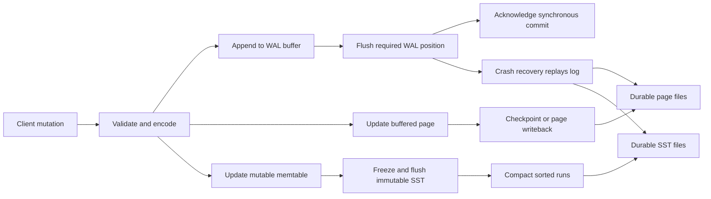

## Working model

A storage engine turns logical mutations such as “store this row” or “delete this key” into durable bytes that it can find, verify, and recover later. The engine pays for that work through memory, CPU, storage reads, storage writes, and background maintenance. A fast foreground write is real only when the engine can keep paying the deferred work without exhausting memory or storage.

Two common families make different payments. A page-oriented engine updates records in a mutable page structure, often a B+ tree or a heap plus B+ tree indexes. A log-structured merge (LSM) engine first collects changes in memory, writes immutable sorted files, and merges those files later. Both may use a write-ahead log. Both cache data. Both need metadata that says which files are valid. Their main difference is when and where they place a record into its long-lived sorted position.

## A logical record is not its physical representation

An application sees a row, document, key-value pair, or index entry. The storage engine sees encoded fields plus metadata needed for navigation, concurrency, and recovery. One logical row can have several physical representations at once:

- the current or an older row version in a data page;
- one entry in each maintained secondary index;
- a change record in a recovery log;
- an unflushed version in a memtable;
- versions of the same key in several immutable files;
- a delete marker that hides an older value;
- a compressed or overflow fragment stored away from the main record.

Physical identity also differs from logical identity. A primary key such as `account_id = 417` is a logical identity. A page number and slot number are a physical address. PostgreSQL, for example, stores an item identifier for each item on a page. The identifier contains the item's byte offset and length, and its position stays stable while the item can move within the page during compaction. PostgreSQL's tuple identifier combines the page number with that item-identifier position. InnoDB takes another approach: a table's clustered index stores row data at its leaves, while a secondary-index entry contains the indexed columns and the clustered primary-key value.

This distinction explains several otherwise surprising behaviors. Updating one field can create a new row version. Changing a clustered key can relocate the row and update every secondary index. A point query through a secondary index can require another tree traversal to fetch the row. A delete can become a marker rather than an immediate byte removal. Logical size is therefore not the same as bytes written, cached, or retained.

## Pages are the unit of placement

Page-oriented engines divide files into fixed-size blocks that their own code understands. PostgreSQL tables and indexes normally use 8 KiB pages. InnoDB index pages are 16 KiB by default. SQLite supports one database page size, selected as a power of two from 512 through 65,536 bytes. The sizes differ, but the purpose is similar: make allocation, caching, checksums, locking or latching, and storage I/O operate on bounded units.

A slotted page commonly contains these regions:

| Region                     | Purpose                                                                                  |
| -------------------------- | ---------------------------------------------------------------------------------------- |
| Header                     | Page type, free-space boundaries, version, log position, flags, and sometimes a checksum |
| Slot or cell-pointer array | Stable small references to variable-size records elsewhere in the page                   |
| Free space                 | Room for new slots and record bytes                                                      |
| Records or cells           | Encoded rows, index keys, child pointers, or record references                           |
| Special area               | Access-method data such as sibling links or tree metadata                                |

Slots let an engine compact fragmented free space without changing every external reference to a record on that page. Large values may not fit. The engine can place part of a value inline and the rest in overflow pages or a separate large-value structure. A “one-row read” may consequently touch the index path, a data page, and several overflow pages.

Page size is a tradeoff. Larger pages hold more separators in an index and can reduce tree height, but a small lookup may read or copy more unused bytes. Smaller pages reduce the unit of transfer and dirtying, but increase metadata and can deepen a tree. Compression changes the calculation again because engines may compress pages, blocks inside immutable files, or individual large values at different boundaries.

Immutable sorted-string table files, usually called **SSTables** or **SST files**, also use blocks internally. Their file is immutable after publication, while index, data, filter, and metadata blocks provide bounded reads inside it. “Page-oriented” versus “LSM” does not mean one side uses blocks and the other does not. It describes mutable placement versus immutable runs and merge-based maintenance.

## Name every cache and durability boundary

The phrase “in memory” is incomplete. A database write can pass through several volatile layers:

1. application and database process memory;
2. an engine buffer pool, page cache, log buffer, or memtable;
3. the operating system page cache;
4. a controller or device write cache;
5. persistent media.

An engine buffer pool knows database page identity, dirty state, pinning, and eviction constraints. InnoDB caches table and index pages in its buffer pool and tracks dirty pages for later flushing. The operating system page cache knows file offsets but not transaction commit rules. Buffered I/O can place the same data in both caches. Direct I/O can bypass much of the operating system data cache, but it does not remove the engine's need to cache pages or manage durable log ordering.

A successful `write()` normally means that the kernel accepted bytes, not that a power loss cannot erase them. A synchronous durability contract needs an operation such as `fsync` or `fdatasync`, plus a storage stack that honors the flush and ordering request. Atomic file replacement may also require syncing the containing directory. Cloud volumes, RAID controllers, hypervisors, and drives can add caches and failure modes, so the exact promise must name the failure it covers: process crash, operating-system crash, machine power loss, device loss, or an entire failure domain.

The database can intentionally expose a weaker contract. An asynchronous commit may acknowledge before the log reaches persistent media. That can improve latency, but the acknowledged window can be lost after a crash. “The database returned success” is durable only under the configured commit policy and storage guarantees.

## Write-ahead logging separates commit from page writeback

A write-ahead log, or **WAL**, records enough information to reproduce changes after a crash. Its ordering rule matters more than its name:

> The log record that describes a page change must reach durable storage before the changed page is allowed to reach durable storage.

For a synchronous commit, the commit record and all log records it depends on must also be durable before the engine acknowledges success. The changed data page does not have to be durable yet. PostgreSQL can therefore commit by flushing sequential WAL while leaving scattered dirty table and index pages for later writeback. Recovery redoes logged changes that were committed but absent from the data files.

The conceptual flow looks like this. Exact ordering between the log buffer and volatile data update varies by engine, but acknowledgment waits at the declared durability boundary.



The log has its own records, block format, checksums, segment lifecycle, and log sequence number. A page can store the log sequence number of its most recent change. During recovery, the engine can compare page state with log positions and avoid applying an already-present change twice. Recovery records must be idempotent or carry enough state to decide whether replay is needed.

### Group commit amortizes a flush

Storage flush latency is often much larger than the CPU time needed to append one small commit record. If 40 transactions become ready while one log flush is in progress, the engine can flush through the newest required log position and wake all 40 after that one operation. This is **group commit**. PostgreSQL documents that one WAL `fsync` can commit many concurrent transactions and provides a configurable delay that can give followers time to join a group.

Group commit improves throughput by sharing one fixed flush cost. It does not make an individual storage flush faster, remove queueing, or change the durability requirement. At low concurrency there may be no group to form. An explicit delay can also increase latency, so it must be tested against the actual arrival pattern and device.

### A journal is not always a redo log

“Journal” is overloaded. SQLite's rollback-journal mode first saves the original contents of pages and then changes the database file. If commit does not finish, recovery copies the before-images back. SQLite's WAL mode preserves the original database pages and appends new versions to a separate WAL; checkpointing later copies those versions into the main database.

The two layouts protect atomicity in opposite directions:

- a rollback or undo journal restores the old state;
- a redo WAL reconstructs the new state;
- some engines use separate redo and undo structures because crash recovery and transaction rollback need different information.

Do not infer recovery behavior from a filename containing `log` or `journal`. Ask whether records are physical page images, physical deltas, logical operations, before-images, after-images, transaction decisions, or a mixture.

## Checkpoints bound recovery work

A checkpoint establishes a durable point from which recovery can begin. In a page engine, this usually means that dirty pages old enough for the checkpoint are written, the required WAL is already durable, and a checkpoint record names a safe redo position. PostgreSQL recovery starts from the redo position associated with the latest usable checkpoint. InnoDB records a checkpoint log sequence number and begins redo recovery there.

A checkpoint does not make the first commit durable. WAL did that. The checkpoint shortens the amount of retained log and redo work and lets the engine recycle older log segments once backups and replicas no longer need them.

Checkpoint frequency has opposing costs:

- frequent checkpoints bound restart time and log retention, but create more page-write pressure;
- infrequent checkpoints spread page writeback over a longer interval, but retain more WAL and increase worst-case replay work;
- a bursty checkpoint can compete with foreground reads and writes, so engines pace dirty-page flushing;
- some page-protection schemes log a full page on its first change after a checkpoint, making short intervals generate more WAL.

An LSM engine has another checkpoint-like concern: which immutable files form the current database version. Its manifest records file additions, removals, levels, sequence positions, and other state needed to reopen a consistent set. That file-set metadata is separate from the WAL that recovers unflushed user mutations.

A useful crash-recovery trace is:

1. Find the latest valid checkpoint and file-set metadata.
2. Reject incomplete metadata edits and ignore an uncommitted log tail according to the file format.
3. Open and verify the durable data files named by that metadata.
4. Replay redo needed after the checkpoint or rebuild the memtable from WAL.
5. Roll back or hide incomplete transactions if the engine's concurrency design requires it.
6. Rebuild transient caches and resume background maintenance.

Recovery time depends on bytes and operations to replay, random page access, CPU for decoding, and the background debt present at the crash. Counting log segments alone is not enough.

## B+ trees maintain one mutable sorted search path

Database documentation often says **B-tree** even when the physical organization has B+ tree properties. In the common B+ shape, interior pages hold separator keys and child-page pointers, while leaf pages hold records or record references. Leaf entries are sorted, and implementations often link neighboring leaves for forward and backward scans.

### Point lookup

To find key `K`, the engine:

1. starts at the root;
2. compares `K` with separator keys to select one child;
3. repeats through interior pages;
4. searches the target leaf;
5. follows a record reference if the leaf is a secondary index rather than the row store.

If an interior page holds hundreds of child pointers, fanout is high and the tree remains shallow. The asymptotic lookup cost is `O(log_f N)` page levels for fanout `f`, but the latency depends on which levels are cached and whether a secondary lookup adds another traversal.

### Insert and split

An insert first finds the target leaf. If the leaf has room, the engine inserts the new key and records the change in WAL. If it does not, the engine allocates a new leaf, divides entries across the old and new pages, fixes sibling links, and inserts a separator for the new page into the parent. A full parent can split in turn. A root split creates a new root and increases tree height.

A split is more work than one record insertion. It changes several pages, generates more log, and may briefly hold latches on related pages. Random keys can spread writes across many leaves. Sequential keys concentrate inserts on the tree edge, which may improve locality but can create latch or ownership contention. Engines reserve free page space, redistribute entries, defer cleanup, or use specialized split protocols, so occupancy is a measured property rather than a fixed “50% full” rule.

### Range scan

For `K >= start AND K < end`, the engine descends once to the first matching leaf, then walks sorted leaf entries and sibling pages until the end key or result limit. This is why column order matters in a composite B+ tree index: equality on a leading prefix followed by an ordered range creates one contiguous interval. A filter that does not define such an interval may scan many entries and discard most of them.

Page-oriented storage makes point and range reads use one current search structure. Its write cost appears as WAL, dirty-page writeback, splits, secondary-index maintenance, and cleanup of obsolete versions. It does not eliminate deferred work; it defers a different set of tasks than an LSM engine.

## An LSM tree turns random placement into sorted batches

A modern LSM write path usually contains three core structures:

- **WAL:** recovery for changes not yet represented in durable SST files;
- **memtable:** a mutable in-memory ordered structure containing recent versions;
- **SSTable:** an immutable file whose entries are sorted by key.

For a durable write, the engine appends the mutation to WAL and inserts an internal record into the active memtable. The internal key commonly includes the user key plus a sequence number or version type, allowing several versions and a delete marker to coexist. When the memtable reaches a threshold, the engine freezes it, starts a new mutable memtable for incoming writes, and flushes the immutable one as a sorted SST file. Once the file and its metadata are safely installed, WAL no longer needed by any unflushed memtable can be removed.

This makes foreground placement cheap because the engine does not immediately find and rewrite the final on-storage page for every key. The cost returns as memtable sorting or maintenance, file flush, index and filter construction, and compaction.

### A read merges versions

A point read cannot assume there is one physical location. It may:

1. search the active memtable;
2. search immutable memtables waiting to flush;
3. consult file range metadata and Bloom filters;
4. search candidate SST files from newer runs toward older runs;
5. choose the newest visible value or stop at a visible tombstone.

Leveled layouts normally keep files within levels beyond level zero non-overlapping by key range, so one point key has at most one candidate file in each such level. Level zero files can overlap. Tiered layouts keep multiple overlapping runs and can have more candidates. Block indexes find the likely data block inside each SST.

A range scan creates an iterator for every overlapping memtable and run, then performs a k-way merge by user key and version order. It must suppress overwritten versions and tombstones while respecting the reader's snapshot. This can consume CPU even when the final result is small. Bloom filters help point and prefix absence checks but do little for a broad range that really overlaps the files.

## Bloom filters prevent some unnecessary reads

A Bloom filter is a compact probabilistic summary of a set of keys. Insertion hashes each key to several bit positions and sets those bits. A lookup checks the same positions:

- if any checked bit is zero, the key is definitely absent from that filter's set;
- if all are one, the key may be present, so the engine must still search the file or block.

The standard structure permits false positives but not false negatives, assuming correct construction, no corruption, and the same key transformation at read time. More bits per key reduce false positives but consume memory and storage. More hash probes consume CPU. RocksDB can build a filter for each SST and reconstructs a new filter when compaction creates a new SST.

A Bloom filter does not return the value, prove that a key exists, identify the newest version, or replace a checksum. It saves work only when a negative result lets the engine skip an otherwise plausible file or block. Measure its usefulness with absent-key traffic, observed false-positive rate, filter memory, block-cache churn, and storage reads avoided.

## Compaction pays the deferred merge cost

Memtable flushes create new sorted runs. Without compaction, run count grows, reads check more files, overwritten values occupy space, and tombstones accumulate. **Compaction** reads selected runs, merges their entries in key and version order, writes replacement SST files, installs a new file-set version, and deletes old input files only after no reader or recovery path needs them.

The engine must retain the old input and new output at the same time during part of this process. Free-space planning must include this transient peak, not just steady-state live data.

Two broad policies choose different amplification costs:

| Policy                | File organization                                                                                    | Relative advantage                                             | Relative cost                                                                                        |
| --------------------- | ---------------------------------------------------------------------------------------------------- | -------------------------------------------------------------- | ---------------------------------------------------------------------------------------------------- |
| Leveled               | Usually one logical sorted run per level; files within mature levels have non-overlapping key ranges | Fewer candidate runs for reads and lower steady space overhead | Data can be rewritten repeatedly as a small level merges into overlapping portions of a larger level |
| Tiered or size-tiered | Several overlapping sorted runs are retained and similar-size runs are merged together               | Less rewriting per level and high ingest capacity              | More runs per read, more steady and transient space, and large all-run merges                        |
| Hybrid                | Tiered behavior in small or level-zero runs, leveled behavior in larger levels                       | Trades some write cost for bounded read and space cost         | More policy states and tuning inputs                                                                 |

RocksDB calls its tiered style **universal compaction**. Product names differ, and some engines mix policies or add time windows. The useful questions are how many sorted runs can overlap one key, how often a byte is rewritten, what triggers a merge, how much temporary space a merge needs, and which old versions are still protected by snapshots or replication.

## Amplification names the hidden work

Use an explicit numerator and denominator when discussing amplification:

- **Read amplification:** physical bytes, blocks, files, or page visits divided by logical data returned. A point miss checking six SST indexes has different work from a one-page B+ tree miss.
- **Write amplification:** physical bytes written divided by logical mutation bytes accepted. State whether the numerator includes WAL, initial flush, compaction, indexes, replicas, and device-level flash translation.
- **Space amplification:** physical bytes retained divided by current live logical bytes. Old versions, tombstones, page slack, indexes, temporary compaction output, and snapshots can all contribute.

There is no single amplification number for an engine. A 300-byte logical update can append a 420-byte WAL record, dirty a 16 KiB page that is written later, update three indexes, and be copied by storage firmware. An LSM value can be compressed on initial flush and then rewritten through several levels. Cache hits change read amplification at the device without changing the number of logical structures searched.

### Worked calculation: when compaction debt becomes a stall

Consider a hypothetical LSM shard accepting 40,000 mutations per second with 300 logical bytes per mutation:

```text
logical ingest = 40,000/s * 300 B = 12.0 MB/s
WAL writes = 40,000/s * 420 B = 16.8 MB/s
initial SST flush = 40,000/s * 340 B = 13.6 MB/s
later compaction rewrites = 4.5 * 13.6 MB/s = 61.2 MB/s

total database writes = 16.8 + 13.6 + 61.2 = 91.6 MB/s
write amplification = 91.6 / 12.0 = 7.63x
```

The 4.5 multiplier is an assumed measured compaction-rewrite ratio, not a constant of LSM trees. The calculation also excludes replication, filesystem metadata, and device-internal amplification.

Suppose the storage budget available to database writes is 80 MB/s after reserving read capacity. Deferred work then grows at about 11.6 MB/s:

```text
debt growth = 91.6 - 80.0 = 11.6 MB/s
hourly debt = 11.6 MB/s * 3,600 s = 41.8 GB/hour
400 GB free headroom / 41.8 GB/hour = 9.6 hours
```

The shard can look healthy for several hours while immutable memtables, level-zero files, pending compaction bytes, and temporary output consume the headroom. Increasing a write buffer postpones the stall but does not fix a sustained 11.6 MB/s deficit. The durable fixes are to reduce input, reduce measured amplification, add compaction capacity, change the data or compaction layout, or move work to more shards.

## Tombstones and TTL delay physical deletion

An LSM delete usually inserts a **tombstone**, a version that says “older values for this key are deleted.” Simply omitting the key from a new run would not hide an older value in another run. A read must encounter the tombstone before an older value and return absence.

Compaction can discard a tombstone only when the engine can prove that no older value it must hide can reappear. That proof can depend on lower-level files, snapshots, transactions, replicas, backups, repair windows, and range-tombstone boundaries. Dropping it early can resurrect deleted data. Retaining it too long increases read and space amplification.

TTL is a policy for when a value expires, not a promise that its bytes disappear at the deadline. An engine might check expiry during reads, create a tombstone, filter the record during compaction, or combine those steps. RocksDB's TTL wrapper, for example, removes expired values during compaction and warns that a read can still return an expired entry before such compaction. Other products provide different read-time guarantees.

For any TTL or deletion feature, ask separately:

- When does a normal read stop returning the value?
- When do indexes and replicas stop returning it?
- When is the physical space reusable?
- When can a snapshot or backup no longer restore it?
- What happens if compaction, repair, or replication is paused?

## Manifests make immutable file sets atomic

An SST file being present in a directory does not mean it belongs to the current database state. A crash can leave an output file from an unfinished compaction, an old input file awaiting deletion, or a partially created file. Listing filenames cannot reconstruct which complete set was last published.

An LSM **manifest** records file-set changes as version edits. RocksDB's `CURRENT` file points to the latest manifest log; replaying that log reconstructs the last consistent database version. A file addition can include its number, key bounds, level, and sequence metadata, while a deletion removes an old file from the live set.

A common copy-on-write publication order is:

1. write replacement SST files without overwriting the inputs;
2. finish their checksums and sync the new files;
3. append and sync a manifest edit that atomically installs the new version;
4. make the new manifest pointer durable if the manifest rolls over;
5. remove old files only after readers and recovery no longer need them.

The exact calls vary with the engine and filesystem. The invariant is that recovery must see either the old complete file set or the new complete file set, not a mixture. The WAL and manifest solve different problems: WAL recovers user mutations not yet in durable data files; the manifest identifies which durable files constitute the database.

## Checksums detect corruption; they do not repair it

A page or block checksum is calculated when bytes are written and checked when they are read or scrubbed. A mismatch detects some torn writes, misdirected reads, storage faults, and memory or transfer corruption that occurred after checksum calculation. PostgreSQL pages can carry a checksum. RocksDB attaches checksums to stored data and can verify SST data and metadata blocks during reads or an explicit verification pass.

The protection has limits:

- a checksum collision is possible;
- corruption before checksum calculation produces a matching checksum for bad data;
- an unchecked cold block can remain corrupt for months;
- a checksum cannot find a missing file unless independent metadata says the file must exist;
- a valid checksum says nothing about a higher-level application invariant;
- detection does not reconstruct the lost bytes.

Recovery therefore needs another good copy or a rebuild path: a replica, backup, archived log, or source projection. “Repair” tools may salvage readable records while discarding damaged ones; they are not substitutes for tested restore procedures. Background scrubbing matters because it finds latent corruption while redundant copies and retained logs may still be available.

Treat a checksum failure as a data-integrity incident. Record the affected file and key range, stop automatic deletion that could remove recovery inputs, determine whether replicas share the fault, and restore or rebuild from a verified source. Blindly skipping a bad block can turn a visible failure into silent data loss.

## Backpressure keeps deferred work bounded

Foreground writes can enter a memtable faster than flush and compaction can create long-lived space. A page engine can likewise dirty pages faster than checkpoint writeback, generate WAL faster than archival or replicas consume it, or hold obsolete versions because readers block cleanup. Memory and free storage turn this rate mismatch into a finite queue.

RocksDB documents three direct stall signals: too many immutable memtables waiting to flush, too many level-zero files, and too many estimated bytes pending compaction. It first slows writers and can stop them at harder thresholds. This is a safety mechanism. Continuing at the offered rate would raise read and space amplification until the process runs out of memory or storage.

Observe the rates and queues that predict a stall:

| Signal                                              | What it can mean                                                 |
| --------------------------------------------------- | ---------------------------------------------------------------- |
| Logical ingest bytes and operations per second      | Offered foreground work                                          |
| WAL bytes per second and retained segments          | Mutation cost and a blocked archive, backup, or replica consumer |
| Dirty pages and checkpoint age                      | Page writeback debt                                              |
| Immutable memtable count and flush bytes per second | Memory-to-SST flush debt                                         |
| Level-zero file count and overlapping runs          | Read pressure and compaction-entry debt                          |
| Pending compaction bytes and compaction output rate | Estimated merge work versus service rate                         |
| Tombstone and obsolete-version age                  | Cleanup blocked by snapshots, repair, or policy                  |
| Free bytes including temporary-work reserve         | Time remaining before writes become unsafe                       |
| Stall duration and rejected writes                  | User-visible backpressure already occurring                      |

Bound queues at every layer. A database that slows writes should not cause an application to accumulate an unlimited in-memory retry queue. Admission control can reject optional writes, shed load, batch bounded work, or return a retryable error before timeouts multiply. Capacity planning must use sustained ingest plus recovery and maintenance, not a short benchmark run before compaction reaches steady state.

## Worked selection: B+ tree or LSM for an audit-event index

Assume one shard stores 30 days of immutable audit events. It receives 60,000 events each second at peak. Most queries fetch one event by ID or scan one tenant's events for a bounded time range. Point reads average 2,000 per second, broad investigations are rare, an event is never updated, and expiration can complete within 24 hours after the 30-day read deadline. The service can reserve twice its live-data size temporarily during maintenance.

| Cost              | Mutable B+ tree                                                          | LSM tree                                                                           |
| ----------------- | ------------------------------------------------------------------------ | ---------------------------------------------------------------------------------- |
| Insert placement  | Find and dirty the destination leaf; random event IDs spread page writes | Append WAL and memtable entry; flush a sorted batch                                |
| Point read        | One tree path, then row fetch if separate                                | Memtables plus candidate runs; filters can skip files on misses                    |
| Tenant-time range | One leaf seek and sequential leaf walk if the key order matches          | Merge iterators from overlapping runs in the tenant-time interval                  |
| Expiration        | Delete rows or whole time partitions; page space may need cleanup        | Tombstones, time-window file dropping, or compaction filtering depending on engine |
| Background cost   | Checkpoint writeback, splits, index cleanup                              | Flush, compaction, temporary space, and write stalls                               |

For this stated ratio, choose an LSM-oriented index keyed by `(tenant_id, event_time, event_id)`. Inserts dominate immediate reads, records are immutable, the key supports the bounded range, and the 24-hour expiration slack allows file- or compaction-based reclamation. The decision is conditional on a steady-state test proving that compaction output exceeds peak ingest after accounting for write amplification and that investigation scans meet their latency budget.

The answer changes if the workload changes. If the service must handle 30,000 low-latency point reads and 5,000 short ordered scans each second, frequently updates indexed fields, has little temporary storage, and cannot tolerate compaction-driven tail latency, a B+ tree can be the better local index. It provides one current ordered structure and avoids merging several runs per query. A product choice still needs transaction, replication, backup, and operating requirements; this comparison selects only the local storage shape.

## Summary

A storage engine is a set of ordering and cleanup rules, not a file extension. Trace the write from logical record through volatile memory, recovery log, durable data structure, metadata publication, and background maintenance.

- Logical rows can create several physical records, versions, index entries, and delete markers.
- Pages and SST blocks are bounded transfer and verification units. Their headers, slots, indexes, filters, and overflow paths are part of read and write cost.
- WAL lets a synchronous commit flush sequential recovery state before scattered data pages. Group commit shares one flush across concurrent transactions.
- A checkpoint bounds redo and log retention. It is not the operation that first made each commit durable.
- A B+ tree maintains one mutable ordered path. Inserts can split pages; ranges seek once and then walk leaves.
- An LSM tree writes WAL and memtable state, flushes immutable sorted runs, and merges versions during reads and compaction.
- Bloom filters prove some absences but never prove presence or return a value.
- Leveled compaction usually spends more writes to reduce read and space amplification; tiered compaction retains more runs and space to reduce rewriting.
- Tombstones and TTL separate logical invisibility from physical erasure.
- A manifest publishes a consistent set of immutable files. Checksums detect some corruption, while replicas, backups, and logs provide recovery copies.
- Deferred work must have a bounded queue. If sustained physical work exceeds service capacity, write stalls are correct behavior, not an isolated latency anomaly.

## References

- [PostgreSQL database page layout](https://www.postgresql.org/docs/current/storage-page-layout.html): Defines fixed-size table and index pages, page headers, item identifiers, free space, checksums, tuple layout, and B-tree sibling metadata.
- [PostgreSQL write-ahead logging](https://www.postgresql.org/docs/current/wal-intro.html): States the WAL-before-data ordering rule, redo recovery, sequential log flushing, and group commit.
- [PostgreSQL WAL configuration](https://www.postgresql.org/docs/current/wal-configuration.html): Explains checkpoints, redo positions, dirty-page pacing, full-page writes, log retention, and configurable group-commit delay.
- [SQLite database file format](https://www.sqlite.org/fileformat.html): Specifies page sizes, B-tree page types, headers, cell-pointer arrays, overflow pages, rollback journals, and WAL files.
- [SQLite write-ahead logging](https://www.sqlite.org/wal.html): Contrasts rollback-journal and WAL layouts and explains checkpoint behavior.
- [SQLite atomic commit](https://www.sqlite.org/atomiccommit.html): Traces cache, journal, flush, lock, database-page, and recovery ordering through a transaction.
- [MySQL 8.4 InnoDB buffer pool](https://dev.mysql.com/doc/refman/8.4/en/innodb-buffer-pool.html): Defines InnoDB's page cache, dirty pages, eviction, read-ahead, and checkpoint-write metrics.
- [MySQL 8.4 InnoDB index structure](https://dev.mysql.com/doc/refman/8.4/en/innodb-physical-structure.html): Documents B-tree index pages, default page size, leaf records, free space, and merge thresholds.
- [MySQL 8.4 clustered and secondary indexes](https://dev.mysql.com/doc/refman/8.4/en/innodb-index-types.html): Explains row storage in the clustered index and primary-key references in secondary indexes.
- [MySQL 8.4 InnoDB redo log](https://dev.mysql.com/doc/refman/8.4/en/innodb-redo-log.html): Describes redo records, log sequence numbers, checkpoint positions, capacity, flushing, and crash replay.
- [The Log-Structured Merge-Tree](https://www.cs.umb.edu/~poneil/lsmtree.pdf): Introduces memory and disk components, deferred sorted merges, recovery logging, multi-component reads, and delete entries.
- [RocksDB overview](https://github.com/facebook/rocksdb/wiki/RocksDB-Overview): Traces writes through WAL, mutable and immutable memtables, SST files, flush, and recovery.
- [RocksDB compaction](https://github.com/facebook/rocksdb/wiki/Compaction): Compares leveled, tiered, hybrid, and FIFO compaction in terms of read, write, and space amplification.
- [RocksDB Bloom filters](https://github.com/facebook/rocksdb/wiki/RocksDB-Bloom-Filter): Defines negative and possible-positive answers, bits-per-key tradeoffs, SST filter lifecycle, and filter metrics.
- [RocksDB manifest](https://github.com/facebook/rocksdb/wiki/MANIFEST): Explains transactional file-set version edits, manifest rollover, and the `CURRENT` pointer.
- [RocksDB checksums](https://github.com/facebook/rocksdb/wiki/Basic-Operations#checksums): Documents read-time checksum verification, corruption checks, and full SST verification.
- [RocksDB write stalls](https://github.com/facebook/rocksdb/wiki/Write-Stalls): Defines slowdown and stop conditions for memtable, level-zero, and pending-compaction debt.
- [RocksDB time to live](https://github.com/facebook/rocksdb/wiki/Time-to-Live): Shows one TTL design in which expiration cleanup occurs during compaction and can lag the expiration time.
