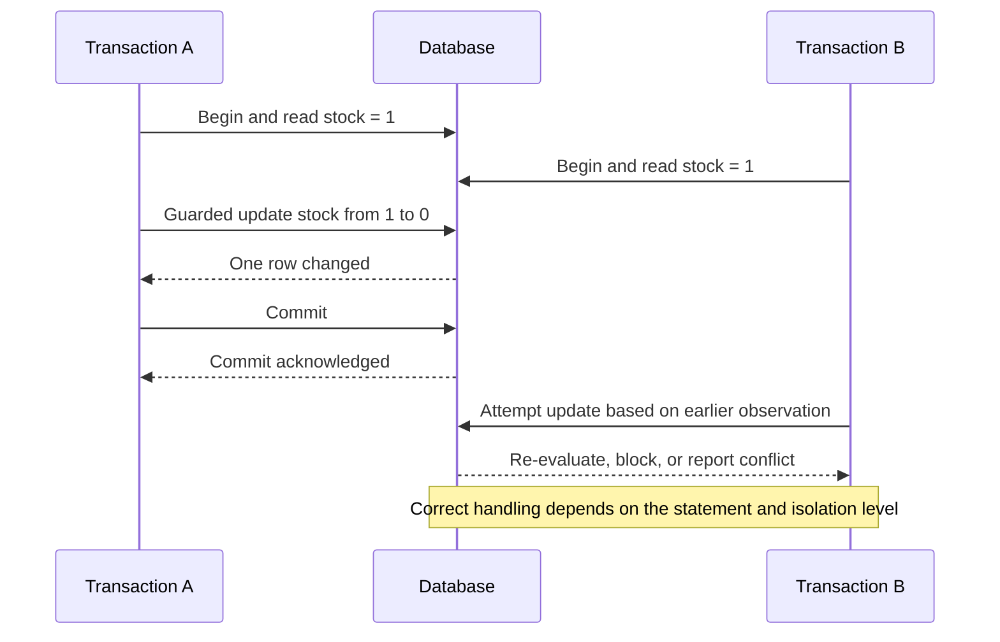

## Working model

A transaction gives a database a boundary for accepting or rejecting related state changes. Concurrency control decides which interleavings are legal while transactions overlap. Recovery decides what remains after a crash. These are connected mechanisms, but they answer different questions.

## ACID names four different promises

Atomicity, consistency, isolation, and durability (ACID) are related guarantees, but none implies the other three.

**Atomicity** means the transaction's database changes become visible as one committed unit or none of them do. It does not mean an HTTP request, message publication, payment-provider call, and database update all happen as one unit.

**Consistency** in ACID means a transaction carries the database from one state that satisfies its declared rules to another. The database can enforce types, constraints, keys, and the chosen isolation semantics. It cannot infer an unstated business rule such as “a customer may reserve at most three seats across every venue.”

**Isolation** constrains what concurrent transactions may observe and which combined outcomes may commit. The name of an isolation level is incomplete without the database's documented behavior; SQL engines do not all implement the standard labels identically.

**Durability** means a successful commit survives the failures covered by the storage and replication policy. It is not a universal claim that every acknowledged value survives disk loss, machine loss, operator deletion, software corruption, and regional disaster. A commit acknowledged after local log flush has a different failure boundary from one acknowledged after synchronous replica confirmation.

The client still faces an ambiguous outcome when the commit succeeds but the reply is lost. ACID protects the database transition, not the caller's knowledge of it. The operation therefore needs a stable idempotency key or another way to read the committed result.

## A log and a visibility decision are separate

A typical write path changes in-memory state and emits enough log information to recover the accepted transition. Commit records establish which logged work belongs to committed transactions. The engine can flush dirty data pages later because recovery can replay the durable log after a crash.

Visibility is a concurrency-control decision. An engine may keep several row versions, hold locks, validate read and write sets, or combine those techniques. A value can be present in memory or a page yet remain invisible to another transaction because its writer has not committed or because the reader's snapshot predates it.

This separation explains several operational facts:

- A transaction can commit after the log reaches durable storage even though its changed data pages have not.
- A checkpoint limits how far recovery must scan; it does not replace the transaction log.
- A replica can receive log records yet withhold them from reads until the relevant commit position is known.
- An old snapshot can keep obsolete versions or undo records alive after newer transactions commit.

## MVCC gives readers a rule for choosing a version

Multi-version concurrency control (MVCC) keeps information needed to reconstruct more than one logical version of a record. A reader carries a snapshot or visibility rule and selects the newest version allowed by that rule. This lets an ordinary reader avoid blocking a writer merely because both touch the same logical row.

The physical representation differs by engine. PostgreSQL normally creates a new heap tuple version for an update and leaves cleanup to vacuum after no relevant snapshot can see the old version. InnoDB changes the clustered record and uses undo records to reconstruct an older version for a consistent read. The result “readers can see an earlier committed value” is similar; page layout, index behavior, cleanup pressure, and failure symptoms are not.

MVCC does not remove write conflicts. Two transactions that update the same row still need ordering or conflict detection. Nor does it make long transactions free. A snapshot that remains open can delay reclamation, enlarge old-version history, increase read work, and hold locks or transaction identifiers longer than intended.



## Isolation must be stated as observable behavior

Three classic anomalies help describe weak executions:

- A **dirty read** observes a value written by a transaction that may still roll back.
- A **non-repeatable read** reads one row twice and sees another committed transaction's change the second time.
- A **phantom** reruns a predicate and sees a changed set of matching rows.

Those names are useful but incomplete. Applications also encounter lost updates, write skew, read skew, and inconsistent multi-object snapshots. Ask what histories the product permits rather than assuming one label covers every anomaly.

| Behavior                           | Reader's view                                                                                             | Common use and consequence                                                                                                      |
| ---------------------------------- | --------------------------------------------------------------------------------------------------------- | ------------------------------------------------------------------------------------------------------------------------------- |
| Read committed                     | Each statement reads committed state, so two statements in one transaction may see different commits      | Short transactions where decisions do not depend on a stable multi-statement snapshot                                           |
| Snapshot or repeatable-read family | A transaction usually reads from a stable snapshot, with engine-specific conflict rules                   | Reports and multi-step decisions; write skew may remain possible unless the engine detects it or the design locks the predicate |
| Serializable                       | Committed outcomes must match some serial order, often by locking ranges or aborting dangerous executions | Cross-row invariants that can tolerate contention and transaction retries                                                       |

PostgreSQL's `READ UNCOMMITTED` behaves as `READ COMMITTED`. Its `REPEATABLE READ` prevents the standard phantom anomaly but can still reject concurrent updates and is not equivalent to PostgreSQL `SERIALIZABLE`. PostgreSQL serializable isolation uses Serializable Snapshot Isolation and can abort a transaction whose dependency pattern could produce a serialization anomaly. The application must retry the complete transaction from a fresh snapshot.

InnoDB defaults to `REPEATABLE READ`. Its consistent reads, locking reads, record locks, and next-key or gap locks make statement behavior depend on the access path and operation. A plain snapshot read is not the same as `SELECT ... FOR UPDATE`, and a non-indexed or broad predicate can lock far more records than expected.

MongoDB separates transaction-level read concern, write concern, and read preference. A sharded transaction needs the documented snapshot and commit settings when the application requires a synchronized view across shards. DynamoDB documents serializable isolation between transactional APIs and individual item reads or writes, while `Query`, `Scan`, and batch operations have different unit-level behavior. Product names therefore cannot substitute for one explicit concurrent trace.

## Prevent lost updates at the final shared write

The unsafe sequence is read, calculate, then write without checking that the input stayed current:

```text
A reads balance = 100
B reads balance = 100
A writes balance = 80
B writes balance = 70
```

The final value should be 50 if A spent 20 and B spent 30, but one update overwrote the other. Several mechanisms can close the race:

- Express the change atomically: `UPDATE account SET balance = balance - 20 WHERE id = ? AND balance >= 20`.
- Compare a version: update only where `version = 14`, then increment it.
- Lock the row before deriving the new value.
- Run the full decision under serializable isolation and retry serialization failures.
- Model immutable ledger entries and derive a balance while separately preventing overspend at a serialized account boundary.

The right mechanism depends on the invariant. Optimistic version checks work when conflicts are uncommon and one record contains the competing value. Locks can be clearer when work is short and conflicts are expected. Serializable isolation helps when a rule spans a predicate or several rows, but it still requires bounded transactions and retry-safe application code.

## Predicate invariants require more than one row lock

Suppose on-call policy permits at most two active responders in one region. Two transactions each count one active responder and then insert another. They write different rows, so neither conflicts at the row key, but together they violate the limit. This is write skew.

Possible designs include a single regional counter row changed conditionally, a uniqueness scheme with two explicit slot keys, a lock on a shared regional authority record, or serializable execution that detects the dangerous read-write dependency. “Use a transaction” is not enough; the design must identify the shared key, range, or dependency that makes the competitors meet.

Constraints are usually preferable when the rule maps cleanly to them. A unique constraint settles concurrent claims inside the database and handles races that application pre-checks cannot. Foreign keys protect references at their enforcement boundary. A check constraint normally sees one row and should not be treated as a cross-table assertion unless the database explicitly supplies that feature.

## Locks protect resources, and access paths determine their footprint

A lock manager tracks incompatible claims on rows, keys, ranges, pages, tables, advisory names, or internal structures. Lock modes let compatible work overlap; for example, several readers may coexist while a writer needs an incompatible mode.

The SQL text alone does not reveal every lock. An update that locates one row through a unique index can have a narrow footprint. The same predicate without a useful index may scan and lock many qualifying records or ranges. Schema changes often acquire table-level modes that conflict with ordinary traffic. Foreign-key checks can lock referenced keys. A transaction that waits on a remote call keeps its database locks while no database work is occurring.

Keep transactions short in wall-clock time, not only in statement count. Do not perform user interaction, network retries, large file processing, or queue polling while holding database locks. Observe lock wait time and blockers separately from query CPU time.

## Deadlocks are cycles, not merely long waits

If transaction A holds resource 1 and waits for resource 2 while B holds resource 2 and waits for resource 1, waiting longer cannot resolve the cycle. A database detects or times out the deadlock and aborts a participant so the other can continue.

Consistent acquisition order reduces common cycles. If every transfer locks the smaller account ID before the larger ID, two opposite-direction transfers request the same order. This reduces deadlocks; it does not remove every possible cycle across tables, indexes, foreign keys, or application-defined locks.

A deadlock failure is a normal concurrency outcome. Retry the whole transaction with a bound and jitter, provided the transaction's external effects are idempotent or occur after commit. Capture the database's deadlock graph or lock report before retry loops erase the evidence.

## Optimistic and pessimistic control pay at different times

Pessimistic control establishes a lock before proceeding with work that might conflict. It pays in waiting and reduced concurrency but avoids doing work that later loses. Optimistic control proceeds and validates a version or dependency before commit. It performs well when conflicts are rare but can waste work and create retry storms under a hot key.

Measure conflict rate, retry count, wait duration, transaction age, and the distribution by key. Fleet averages hide one account, seat, inventory item, or tenant that serializes all work. Backoff only reduces retry pressure; it does not increase the throughput of a single serialized invariant.

## Savepoints and statement rollback do not create smaller commits

A savepoint marks a point to which a transaction can roll back without discarding earlier work. It helps recover from an expected statement error or structure a batch, but locks and version history acquired before or after the savepoint may remain until the outer transaction ends, depending on the engine and resource. The durable boundary is still the outer commit.

Large transactions enlarge logs, retain versions, delay replication application, hold locks, and make rollback expensive. Breaking a bulk update into chunks improves operability only if the product accepts partial progress and the job records a resumable position. Otherwise, chunking silently changes one atomic operation into many.

## Local commit cannot include an independent service

A transaction manager can coordinate participants with a protocol such as two-phase commit (2PC): participants prepare durable intents, then a coordinator tells them to commit or abort. This can make a multi-resource decision atomic, but a prepared participant may retain locks and state while the coordinator is unavailable. Every participant and operator must support recovery of in-doubt transactions.

2PC is different from consensus. Consensus lets replicas agree on an ordered decision despite some failures. 2PC asks independently managed resources to complete one atomic transaction and can block when the outcome is unknown. Some systems combine a replicated coordinator with atomic commit, but one mechanism does not turn into the other.

Most service boundaries use a local transaction plus durable asynchronous intent instead. An outbox row commits with the business change; a relay publishes it; consumers deduplicate and apply idempotent effects. A saga records a sequence of local steps and compensations. Neither makes the world look as though one global transaction ran. Intermediate states are visible, compensation may differ from erasure, and the workflow needs its own timeout and repair policy.

## Commit success and client knowledge can diverge

Consider this sequence:

1. A client sends `POST /reservations` with operation ID `reserve-817`.
2. The service inserts the reservation and an operation-result row in one local transaction.
3. The database commits and acknowledges the service.
4. The service process loses its connection before the client receives the reply.
5. The client retries with `reserve-817`.

If the retry creates a new transaction without consulting the operation identity, it can reserve twice. If a unique key protects `reserve-817`, the retry reads and returns the saved result. The response can still be unknown temporarily during failover, so the client contract needs a retry window and a status lookup.

An idempotency key must be scoped to the actor and operation, bound to a request fingerprint, retained longer than the caller's retry horizon, and saved atomically with the result it represents. A random key that may be reused for different request bodies is not safe.

## Worked case: reserve the last unit without overselling

Assume an inventory row starts with `available = 1`, and two checkouts arrive concurrently. The product permits one winner, wants a fast rejection for the loser, and sends confirmation only after the reservation commits.

A guarded statement provides one narrow serialization point:

```sql
UPDATE inventory
SET available = available - 1,
    version = version + 1
WHERE sku = $1
  AND available >= 1;
```

Exactly one transaction changes the row from 1 to 0. The other blocks behind the first or evaluates after it, then affects zero rows. The application interprets zero changed rows as sold out. In the same transaction, the winner inserts a reservation, the idempotency result, and an outbox record for confirmation. A unique constraint on `(customer_id, operation_id)` makes a lost-reply retry return the first reservation.

At 2,000 attempts each second for one SKU, the row is still one serialized authority. Adding 100 application workers cannot make that invariant commit in parallel. The system can admit requests to a per-SKU queue, sell from preallocated buckets with a reconciliation rule, or accept a weaker oversell-and-compensate contract. Each choice changes user behavior; none is a database tuning flag.

The failure trace matters:

- If the transaction deadlocks, retry the entire unit with the same operation ID.
- If commit outcome is unknown, look up the operation ID before creating new work.
- If the outbox relay repeats publication, the confirmation consumer deduplicates the event ID.
- If the confirmation provider fails, the reservation stays committed while the workflow retries or reports delayed notification.
- If one reservation must expire, a durable expiry worker changes state conditionally so it cannot release inventory after checkout completion.

The signals are affected-row count, transaction latency, row-lock wait, deadlocks, serialization failures, idempotency replays, outbox age, and reservation-expiry lag. A spike in lock waits for one SKU is evidence of a product hotspot, not only a database incident.

## Summary

Atomicity, isolation, durability, and caller certainty are separate boundaries. A transaction can commit durably while its response is lost; a stable operation identity closes that retry ambiguity. MVCC lets readers select valid versions without taking ordinary write locks, but it keeps old state alive and does not remove write conflicts.

- State isolation as allowed histories and anomalies, not only a level name.
- Resolve a race at the lowest shared row, key, constraint, range, or serializable dependency that sees every competitor.
- Use guarded updates or version checks for narrow optimistic races; use short locks when conflicts are expected; retry complete serializable transactions after documented aborts.
- A predicate invariant can fail even when transactions write different rows. Give it a shared authority or an isolation mechanism that covers the read set.
- Lock footprint follows the physical access path. Missing indexes and long transactions turn narrow intent into broad blocking.
- Deadlocks are expected aborts caused by wait cycles. Acquire in a stable order, retain the graph, and retry a bounded, side-effect-safe unit.
- Local transactions do not include independent services. Outboxes and sagas expose asynchronous intermediate states; 2PC introduces prepared state and recovery of unknown outcomes.
- Hot invariants cap throughput at their serialization point. Capacity planning must use the hottest key rather than fleet-average transaction rate.

## References

- [PostgreSQL concurrency control](https://www.postgresql.org/docs/current/mvcc.html): Covers transaction isolation, explicit locking, deadlocks, serializable execution, and retry behavior.
- [PostgreSQL transaction isolation](https://www.postgresql.org/docs/current/transaction-iso.html): Defines PostgreSQL behavior for read committed, repeatable read, and serializable transactions.
- [PostgreSQL Serializable Snapshot Isolation](https://www.postgresql.org/docs/current/applevel-consistency.html#NON-SERIALIZABLE-CONSISTENCY): Explains application consistency under serializable transactions and explicit locks.
- [MySQL 8.4 InnoDB transaction model](https://dev.mysql.com/doc/refman/8.4/en/innodb-transaction-model.html): Documents consistent and locking reads, isolation levels, and InnoDB locking behavior.
- [MySQL 8.4 InnoDB multi-versioning](https://dev.mysql.com/doc/refman/8.4/en/innodb-multi-versioning.html): Describes undo records and reconstruction of earlier clustered-row versions.
- [MySQL 8.4 InnoDB deadlocks](https://dev.mysql.com/doc/refman/8.4/en/innodb-deadlocks.html): Documents detection, rollback, diagnostics, access order, and retry guidance.
- [MongoDB transactions](https://www.mongodb.com/docs/manual/core/transactions/): Defines transaction-level read concern, write concern, read preference, sharded transactions, and driver retry behavior.
- [DynamoDB transaction isolation](https://docs.aws.amazon.com/amazondynamodb/latest/developerguide/transaction-apis.html): Distinguishes serializable item operations from read-committed query, scan, and batch behavior.
- [DynamoDB condition expressions](https://docs.aws.amazon.com/amazondynamodb/latest/developerguide/Expressions.ConditionExpressions.html): Defines guarded item mutations used for optimistic concurrency and uniqueness.
- [Martin Kleppmann, Howard and Mortier, “A Critique of ANSI SQL Isolation Levels” revisited through Hermitage](https://martin.kleppmann.com/2014/11/25/hermitage-testing-the-i-in-acid.html): Connects isolation labels to concrete anomaly tests across database implementations.
