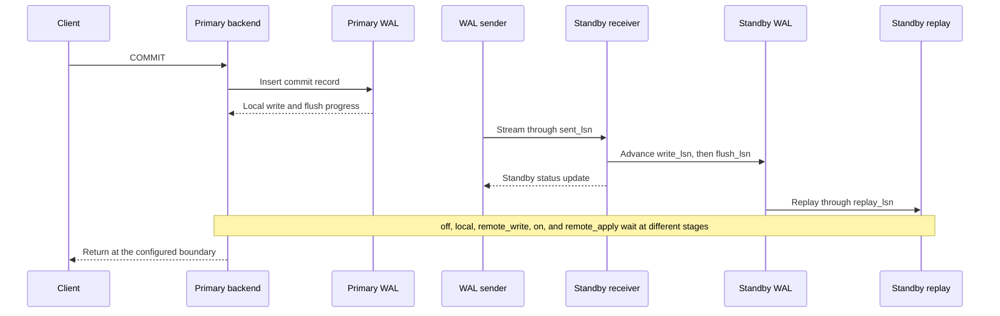

## Working model

PostgreSQL replication begins with the same write-ahead log (WAL) used for crash recovery. A primary can stream WAL bytes to physical standbys, archive completed WAL segments for later recovery, or decode logical changes for subscribers. Those paths share a source but promise different things.

- Physical replication copies changes for the whole PostgreSQL cluster at the storage level. A standby replays WAL and normally has the same databases and physical relation state as the primary.
- Continuous archiving keeps a base backup plus enough WAL to reconstruct the cluster at a later recovery target.
- Logical replication decodes row changes for selected publications and applies them to independently managed tables. It does not copy every database object.

Replication is not a backup. A mistaken `DELETE`, damaged schema migration, or malicious transaction can be reproduced faithfully on every online replica. A backup is not an automatic failover system. Restoring two tebibytes and replaying hours of WAL can take far longer than promoting an online standby.

This note starts after [PostgreSQL storage, query, and MVCC internals](05-postgresql-storage-query-and-mvcc-internals.md), which explains heap versions, WAL insertion, checkpointing, and connection processes. [Transactions, concurrency, and recovery](04-transactions-concurrency-and-recovery.md) develops isolation, idempotency, deadlocks, and ambiguous commit results. The focus here is what happens after a commit record enters WAL and how operators change or recover the system.

The behavior described is PostgreSQL 18 behavior. Configuration fields and catalog columns change across releases, so record the server version with operational evidence and check the linked current manual before applying a procedure.

## One commit crosses several log positions

An LSN, or log sequence number, names a byte position in PostgreSQL WAL. LSNs are ordered positions, not transaction identifiers. Several transactions can be made durable by one flush, and a reported LSN can include records written after the transaction being investigated.

On the primary, a backend inserts a commit record into WAL buffers. PostgreSQL writes WAL toward a WAL file and flushes it to durable storage according to the commit mode. A WAL sender streams records to a standby. The standby WAL receiver writes and flushes them into its local WAL files. The standby startup process then replays those records into data pages.



The positions exposed by PostgreSQL divide the path:

| Position             | Meaning                                               | Failure evidence                                                                                              |
| -------------------- | ----------------------------------------------------- | ------------------------------------------------------------------------------------------------------------- |
| Primary insert LSN   | End of WAL logically inserted into shared WAL buffers | Records exist in PostgreSQL memory but may not have reached a WAL file                                        |
| Primary write LSN    | End written to the local WAL file                     | Data can still be in operating-system cache                                                                   |
| Primary flush LSN    | End made durable on primary storage                   | A primary process or operating-system crash should not lose earlier WAL under the documented storage contract |
| `sent_lsn`           | End sent on a physical replication connection         | Network transmission has begun; it says nothing about standby durability                                      |
| Standby `write_lsn`  | End written by the standby receiver                   | The standby has received the bytes, but its operating system can still lose unflushed writes                  |
| Standby `flush_lsn`  | End durably flushed on standby storage                | Promotion can recover through this position if the stored WAL and cluster are otherwise intact                |
| Standby `replay_lsn` | End applied to standby data pages                     | Hot-standby queries can observe changes replayed through this point                                           |

`pg_current_wal_insert_lsn()`, `pg_current_wal_lsn()`, and `pg_current_wal_flush_lsn()` expose primary progress. `pg_stat_replication` exposes per-sender sent, written, flushed, and replayed positions reported by each standby. `pg_last_wal_receive_lsn()` and `pg_last_wal_replay_lsn()` describe the receiving standby.

Subtract positions with `pg_wal_lsn_diff()`. A byte distance is usually more useful than a label such as “replica lag.” Three separate distances locate the work:

```text
transport backlog = primary current WAL LSN - standby write LSN
durability backlog = standby write LSN - standby flush LSN
replay backlog = standby flush LSN - standby replay LSN
```

Convert a byte distance to time only with a measured WAL generation or replay rate. A 4 GiB replay backlog can be seconds on one workload and hours on another. `write_lag`, `flush_lag`, and `replay_lag` in `pg_stat_replication` describe recent commit-stage delay. PostgreSQL explicitly does not define them as estimates of time to catch up, and they can become `NULL` after an idle standby has caught up.

## Physical streaming reproduces the cluster

Physical streaming sends WAL records produced by the primary cluster. A standby starts from a physically compatible base backup, receives WAL from the primary or an upstream cascading standby, stores the WAL, and replays it. The standby is in recovery until promotion.

The main prerequisites include `wal_level = replica` or higher, enough `max_wal_senders`, authentication for a replication connection, and a base backup whose system identifier matches the WAL stream. A standby connection normally identifies itself with `application_name`; synchronous replication can use that name to select acknowledgement participants.

Streaming is asynchronous by default. The primary can acknowledge a transaction while the standby is behind. If the primary and its unreplicated WAL are destroyed, acknowledged transactions beyond the surviving standby's flush position are lost. Cascading replication can reduce connection and network load on the primary, but PostgreSQL's cascading path is asynchronous. A downstream standby therefore cannot by itself satisfy the primary's synchronous commit wait.

A physical standby replays DDL, table data, catalog changes, and transaction outcomes for every database in the cluster. It is not a selective table copier. It also shares the primary's major-version and physical compatibility constraints. Use logical replication or an application migration when the destination needs a different schema, selected tables, or controlled transformation.

## Commit acknowledgement chooses a failure boundary

`synchronous_commit` controls which WAL stage must finish before PostgreSQL reports commit success. The setting can be global, per database, per role, per session, or changed inside one transaction. All transactions remain atomic; weaker settings change which recent acknowledged transactions a crash can lose.

| `synchronous_commit` | Client wait                                                                                   | Survives which documented event                                                                                                            |
| -------------------- | --------------------------------------------------------------------------------------------- | ------------------------------------------------------------------------------------------------------------------------------------------ |
| `off`                | Does not wait for the transaction's local WAL flush                                           | PostgreSQL remains consistent after recovery, but a crash can lose recent acknowledged transactions                                        |
| `local`              | Waits for local primary flush                                                                 | Survives primary process and operating-system restart when primary storage survives; does not wait for a standby                           |
| `remote_write`       | Waits for local flush and a selected synchronous standby to write WAL to its operating system | Tolerates loss of the primary while the standby operating system remains alive; a simultaneous standby OS crash can lose its unflushed WAL |
| `on`                 | Waits for local flush and selected standby flush                                              | Tolerates loss of the primary when a selected standby and its durable WAL survive                                                          |
| `remote_apply`       | Waits for local flush, selected standby flush, and replay                                     | Adds visibility on the selected standby before acknowledgement, at the cost of replay delay in commit latency                              |

The remote modes have remote meaning only when `synchronous_standby_names` selects connected synchronous standbys. Without that configuration, `remote_write`, `on`, `remote_apply`, and `local` do not wait for a remote server. The resulting protection is local even if asynchronous replicas happen to exist.

`remote_apply` is useful when a successful write must be immediately readable from a particular synchronous standby. It is not required merely to avoid losing a committed transaction during primary failure. `on` waits for durable standby WAL, and normal crash recovery can replay it after promotion.

`off` can improve latency for transactions whose loss is acceptable, such as reconstructible activity counters. It does not corrupt the database if PostgreSQL crashes; recovery treats lost acknowledgements as transactions that never committed. The application still must accept that the client saw success for an outcome later absent.

Synchronous replication moves storage, network, standby I/O, and sometimes replay time into foreground commit latency. It also creates an availability dependency. If the configuration requires a standby that cannot acknowledge, affected commits wait until a qualifying standby returns or the configuration changes.

## Named and quorum standbys express different policies

`synchronous_standby_names` selects standbys by the `application_name` supplied in their replication connections.

Priority selection waits for the first available standbys in the listed order:

```conf
synchronous_standby_names = 'FIRST 1 (az_b, az_c)'
```

This waits for one standby. `az_b` has priority while connected and eligible; `az_c` is the fallback. It does not wait for both.

Quorum selection waits for any requested number from a set:

```conf
synchronous_standby_names = 'ANY 2 (az_b, az_c, region_b)'
```

This waits for any two listed standbys. The policy is only as strong as its placement. Two acknowledgements in one rack do not protect against losing that rack. A cross-region participant can protect a regional failure but places wide-area latency and remote availability in every synchronous commit.

Avoid duplicate `application_name` values in the set. PostgreSQL does not enforce their uniqueness, so duplicated names can make the apparent policy differ from the intended server count. Monitor `sync_state`, `sync_priority`, sender identity, and actual failure-domain labels rather than reading the configuration alone.

Before changing a synchronous set, state the invariant in failure terms. “Wait for any two replicas” is incomplete. “Acknowledge only after one durable copy in Region A and one in Region B” is testable, but a single `ANY` group does not directly express arbitrary placement rules. Some systems use separate PostgreSQL instances, application commit protocols, or a topology manager when the placement rule is more complex than PostgreSQL's named priority or quorum set.

## Replication slots exchange continuity for retained state

Without a physical replication slot, a disconnected standby relies on `wal_keep_size` and the WAL archive to find old segments. `wal_keep_size` is a minimum amount of past WAL retained in `pg_wal`, not a promise that a standby of any age can reconnect.

A physical slot records how far a consumer may still need WAL. Its `restart_lsn` is the oldest position that PostgreSQL must preserve for that slot. A logical slot also exposes `confirmed_flush_lsn`, the position through which its consumer has confirmed receipt. Slots survive disconnects, so a stopped consumer can retain WAL indefinitely.

That retention supports continuity, but it can fill the primary volume. With the default `max_slot_wal_keep_size = -1`, PostgreSQL permits unlimited WAL retention for slots. A finite value bounds retention pressure, but after required WAL is removed the slot can become unusable and the consumer must be rebuilt or resynchronized.

Illustrative arithmetic makes the failure visible:

```text
measured WAL generation = 32 MiB/s
consumer outage = 45 minutes = 2,700 seconds
slot-retained WAL = 32 MiB/s × 2,700 s
                  = 86,400 MiB
                  ≈ 84.4 GiB

free WAL-volume headroom = 60 GiB = 61,440 MiB
time to consume headroom = 61,440 MiB ÷ 32 MiB/s
                         = 1,920 seconds
                         = 32 minutes
```

This is a lower-bound estimate. Checkpoints, full-page images, workload bursts, archive failures, and other slots can consume more space. An alert should leave time to repair the consumer, expand storage, advance or drop an intentionally abandoned slot, or rebuild it. Dropping a slot discards its continuity guarantee and must be an explicit recovery decision.

`pg_replication_slots` exposes `active`, `restart_lsn`, `confirmed_flush_lsn`, `wal_status`, `safe_wal_size`, and `invalidation_reason` in current PostgreSQL. `wal_status = lost` or an invalidation reason such as `wal_removed` means retained history no longer satisfies the slot. `safe_wal_size` estimates bytes that can be written before a slot risks becoming lost under the configured cap; it is not a disk-free-space metric.

PostgreSQL 18 also has `idle_replication_slot_timeout`. Invalidation occurs at a checkpoint, so the timeout is not a precise wall-clock deletion timer. Synchronized failover slots on a standby are managed separately and are not invalidated by that setting.

## Hot-standby reads compete with recovery

A hot standby accepts read-only queries while its startup process replays WAL. Query execution and recovery are not independent. Replay can need to remove a row version, drop a relation, remove a tablespace, or acquire a lock that conflicts with a standby query.

Common conflict classes include:

- replay of a primary `ACCESS EXCLUSIVE` lock, often caused by DDL;
- replay of a database or tablespace drop while a standby session uses it;
- replay of vacuum cleanup that removes versions needed by a standby snapshot;
- replay of catalog cleanup that conflicts with a standby query;
- a standby snapshot older than the primary's cleanup horizon.

The standby cannot block a completed primary action forever. PostgreSQL waits within `max_standby_streaming_delay` for streamed WAL or `max_standby_archive_delay` for archived WAL, then cancels conflicting standby queries so replay can continue. These values are total delay budgets for applying the WAL stream, not independent maximum runtimes for each query. One long conflict can consume the budget and cause following conflicts to be canceled quickly.

`hot_standby_feedback = on` lets the standby report snapshot horizons upstream. The primary can then retain row versions that standby queries still need, reducing cleanup conflicts. The price is retained dead tuples and possible table or index bloat on the primary. Feedback also does not resolve access-exclusive DDL conflicts. A disconnected feedback path creates a gap unless another retention mechanism preserves the required horizon.

Choose the policy from the replica's job:

- A low-lag failover standby should usually bound query duration and favor replay progress.
- An analytical replica can tolerate more replay delay, but the resulting recovery point must be visible to failover automation.
- A separate logical or extract-transform-load (ETL)-fed analytical store can isolate long queries when both low failover lag and long snapshots are required.

Read `pg_stat_database_conflicts` by cancellation reason. Combine it with replay LSN, transaction age, query identity, primary vacuum evidence, and table bloat. Raising the delay without measuring the retained recovery backlog only moves the failure from canceled reads to stale failover state.

## Promotion creates a new timeline, not a fence

`pg_ctl promote` or `pg_promote()` ends standby recovery and makes that server writable. Promotion creates a new WAL timeline. A timeline history file records the branch point from the earlier history, allowing recovery tools to distinguish WAL generated before and after promotion.

The timeline prevents one WAL branch from being mistaken for another during recovery. It does not contact or disable the old primary. If network isolation leaves both servers accepting writes, PostgreSQL can produce two valid but divergent timelines. This is split brain, and PostgreSQL has no automatic row-level merge for the two histories.

A safe promotion procedure has an external fencing step before write routing:

1. Stop or drain application writes when possible.
2. Prove the old primary cannot accept new writes. Disable its network path, revoke its service endpoint or credentials, stop the process through a trusted control plane, or fence its storage.
3. Record the last known primary flush LSN and the candidate's receive, flush, and replay LSNs.
4. Let the candidate receive and replay all WAL still available when the recovery objective requires it.
5. Promote one candidate.
6. Verify it is out of recovery, on the expected timeline, and healthy enough for its new write load.
7. Change service discovery and pools, then admit writes gradually.
8. Reconfigure every replica and logical subscriber to follow the new primary.

If fencing cannot be proved, promotion is a data-consistency decision, not a routine availability action. A lease or epoch system can help a routing layer reject a stale primary, but every write path must enforce it. DNS alone is weak fencing because old addresses and existing connections can remain usable.

Archive timeline history files along with WAL. Point-in-time recovery defaults to following the latest reachable timeline in current PostgreSQL, but the history files are required to identify branches and choose the intended one.

## An old primary must be rewound or rebuilt

After promotion, the old primary contains its original timeline and may contain divergent writes. Changing its connection string and starting it as a standby is unsafe. It needs a data directory consistent with the new primary's history.

`pg_rewind` can copy the changed blocks and other required files from the new source rather than copying the entire cluster. It compares timeline histories to find the divergence point, identifies blocks changed on the old target after divergence, copies replacement state, and prepares the target to replay forward.

Rewind has prerequisites and operational limits:

- The target cluster must have data checksums enabled or have run with `wal_log_hints = on`; `full_page_writes` must be enabled.
- WAL reaching back to the divergence point must remain available. `pg_rewind -c` can retrieve missing segments through the target's archive recovery configuration.
- The target must be shut down cleanly. The source can be a running server connection or a cleanly stopped data directory.
- Rewind copies configuration files from the source, so inspect recovery, archive, port, identity, and connection settings before restart.
- WAL replay must still complete after rewind.

A failed rewind can leave the target directory unusable. Treat a fresh base backup as the recovery path when prerequisites are absent, WAL is missing, corruption is suspected, or rewind fails. Never put a partially rewound target back into service.

## A recoverable backup is base state plus an unbroken WAL sequence

`pg_basebackup` copies a running PostgreSQL cluster through the replication protocol. It is a physical cluster backup, not a selected-database export. A usable point-in-time recovery needs a consistent base backup plus every required WAL segment from at least the backup start through the desired recovery target.

The base backup may include WAL with `--wal-method=fetch` or stream it concurrently with `--wal-method=stream`. Streaming uses another WAL sender and avoids depending on all backup-time WAL remaining in `pg_wal` until the copy finishes. `-R` writes standby connection settings and creates `standby.signal`, which is convenient for constructing a standby but should be reviewed before the restored host connects anywhere.

PostgreSQL 18 supports incremental base backups. An incremental backup records blocks changed since a compatible earlier backup manifest. It cannot be started as a server or restored alone. `pg_combinebackup` must combine the full backup and required incrementals into a synthetic full backup before use. The chain reduces copied bytes but adds manifests, chain availability, combination time, and another validation step to the recovery procedure.

`pg_verifybackup` checks the backup manifest, file presence, sizes, checksums, and required WAL parsing available to the verifier. That catches missing or altered backup files. PostgreSQL's documentation states that verification does not prove the server can start and use the restored data. A restore drill remains necessary.

Logical dumps solve a different problem. `pg_dump` can export selected databases or objects in a portable logical form and is useful for migration or object-level recovery. It does not preserve the same physical recovery point, cluster-wide objects, or low-RTO failover path as a physical backup plus WAL.

## WAL archiving turns time into a recovery dimension

With continuous archiving, PostgreSQL calls `archive_command` or an `archive_library` callback for completed WAL segments. The archival operation must report success only after the destination has stored the segment durably. PostgreSQL retries failures. An archive command should not silently overwrite a different segment with the same name; a matching existing file can be accepted only after confirming it is the same durable content.

Archive failure has two effects. The recoverable end point stops advancing, and completed segments accumulate in `pg_wal` because PostgreSQL cannot recycle them. If that filesystem fills, PostgreSQL can enter a PANIC shutdown. Monitor destination freshness, archive failures, local WAL volume headroom, and logs. `pg_stat_archiver` reports recent success and failure, but some archiver-process failures require log and storage evidence as well.

The built-in archive path normally handles completed WAL segments. A low-write system can leave the current segment open for a long time. `archive_timeout` can force periodic segment switches to bound that delay, but frequent switches archive full-size segment files even when mostly unused. Size the archive and request rate accordingly.

To restore to a point in time:

1. Select a verified base backup before the intended target.
2. Restore it into an isolated data directory with the correct ownership, permissions, tablespaces, and versioned PostgreSQL binaries.
3. Configure `restore_command` to retrieve archived WAL without modifying the archive.
4. Create `recovery.signal`.
5. Set a recovery target such as timestamp, transaction ID, named restore point, LSN, or immediate consistency point, plus the intended timeline.
6. Start PostgreSQL and let recovery replay until the target.
7. Use `recovery_target_action` to pause, promote, or shut down at the target.
8. Validate the recovered application state before exposing it or promoting it into the replacement topology.

The recovery target must be after the base backup reached consistency. If the target transaction depends on other transactions, inspect application invariants rather than selecting only the nearest timestamp. Clocks can be imprecise, and one business operation can span database and external systems.

## RPO and RTO come from measured positions and rates

Recovery point objective, or RPO, bounds acceptable data loss. Recovery time objective, or RTO, bounds acceptable service-recovery time. Backup age alone establishes neither one.

For archive recovery, the exposed WAL distance is the primary's durable end minus the latest durably archived end. Suppose both the primary and online replicas are lost:

```text
primary flush beyond archive = 12.8 GiB
measured WAL generation = 64 MiB/s
exposed time at this recent rate = 12.8 × 1,024 MiB ÷ 64 MiB/s
                                 = 204.8 seconds
                                 ≈ 3.4 minutes
```

This estimates the time represented by missing WAL; the actual lost transaction set depends on workload and whether the current segment exists elsewhere. For a surviving standby, use its durable flush position rather than the archived position.

Restore time includes locating credentials and artifacts, provisioning storage, reading the base backup, combining incrementals, replaying WAL, starting the server, validating state, changing routes, and recovering application pools. A raw throughput estimate sets a lower bound:

```text
base backup = 2 TiB = 2,097,152 MiB
measured restore throughput = 400 MiB/s
base copy lower bound = 5,242.88 seconds = 87.4 minutes

WAL to replay = 600 GiB = 614,400 MiB
measured replay throughput = 200 MiB/s
replay lower bound = 3,072 seconds = 51.2 minutes

raw data-path lower bound = 138.6 minutes
```

This does not include provisioning, incremental combination, startup, validation, or routing. Compression, encryption, object-store requests, limited IOPS, recovery conflicts, CPU, and many small files can make observed throughput lower. Measure full drills at production scale and retain their stage timings.

## Restore validation must test use, not only bytes

A restore drill should run in an isolated network with outbound jobs, webhooks, email, payment calls, and replication disabled. Give it separate service discovery and credentials so an operator cannot accidentally connect production writers or consumers.

Validation has several layers:

| Layer       | Evidence                                                                                                        |
| ----------- | --------------------------------------------------------------------------------------------------------------- |
| Artifact    | Manifest, checksum, file count, size, encryption key, and required WAL all verify                               |
| PostgreSQL  | Server reaches the intended timeline and recovery target; catalogs, extensions, and tablespaces load            |
| Data        | Row counts, sampled invariants, recent business records, and important constraints match the target expectation |
| Application | Representative reads and writes work against the restored schema without external side effects                  |
| Operation   | Backup discovery, credential access, restore commands, validation, routing, and cleanup fit the measured RTO    |

Record the base-backup identifier, manifest, first and last required WAL segment, target LSN or time, timeline, PostgreSQL build, extension versions, command transcript, and timings. A backup whose restore depends on an undocumented operator memory is not an established recovery path.

## Logical decoding turns WAL into selected changes

Logical decoding reads WAL and reconstructs changes through an output plugin. A logical replication slot records the consumer's progress and preserves WAL plus catalog history required to decode future records. Unlike a physical slot, a logical slot belongs to one database.

PostgreSQL persists logical-slot progress at checkpoints. After a crash, the server can resend changes that the consumer already processed even when the consumer previously acknowledged them. A logical consumer therefore needs an idempotent operation identifier or a transactional destination offset. The same retry discipline applies to a connector that crashes after committing destination rows but before advancing its source acknowledgement.

A publication selects tables and change classes such as inserts, updates, deletes, and truncates. Current PostgreSQL also supports row filters and column lists with documented restrictions. A subscription connects to a publisher, normally creates or uses a logical slot, performs an initial table copy, and then runs apply workers for continuing changes.

Updates and deletes need a replica identity that lets the subscriber locate the target row. A suitable primary key is the common choice. `REPLICA IDENTITY FULL` can publish old row values when no suitable index exists, but it increases WAL and destination matching work and does not substitute for a deliberate key design.

Logical replication does not copy every part of a PostgreSQL system:

- Schema and DDL changes are not replicated automatically.
- Sequence state is not replicated, so a promoted subscriber needs a separate sequence plan.
- Roles, tablespaces, extensions, and cluster configuration require their own provisioning.
- Publication selection can omit tables or operations on purpose.
- Initial copy and continuing changes have separate workers and progress states.

Apply compatible schema changes on subscribers before the publisher begins emitting rows that require them. Additive changes are safer than immediate rename or drop. Monitor `pg_stat_subscription`, relation synchronization state, apply errors, slot retention, and destination constraints during initial copy and steady state.

## Logical failover requires slot state on the candidate

Promoting a physical standby does not by itself preserve logical decoding continuity. A logical slot traditionally exists only on the old primary. Recreating it at the wrong LSN after failover can omit changes or resend an uncontrolled range.

PostgreSQL 18 can synchronize failover-enabled logical slots to physical standbys. A subscription created or altered with `failover = true` creates a failover-capable publisher slot. The candidate standby enables `sync_replication_slots`, follows the primary through a named physical slot, has `hot_standby_feedback` configured for the slot path, and can identify the database in its primary connection settings.

Slot synchronization is asynchronous. Before promotion, inspect the candidate's `pg_replication_slots` and require each needed slot to be synchronized, non-temporary, and free of an invalidation reason. The physical standby also needs to be ahead of the logical subscriber. Configuring the primary's `synchronized_standby_slots` can prevent a logical publisher slot from advancing past the candidate's physical receipt, at the cost of delaying logical publication when that standby lags.

During a planned logical-publisher failover:

1. Disable or stop subscriptions so they cannot keep consuming the old publisher.
2. Fence the old publisher and stop new writes.
3. Verify the candidate's physical WAL and synchronized failover-slot state.
4. Promote the candidate.
5. Change each subscription connection to the new publisher.
6. Re-enable subscriptions and verify apply progress and duplicate handling.

A synchronized slot is not usable for decoding while its server remains a hot standby. It becomes available after promotion. The slot mechanism does not copy missing schema, repair sequence state, or fence the old publisher.

## Pools and clients must survive a role change

Promotion ends existing sessions on the failed server and creates a new writable endpoint. A pool can keep stale TCP connections after service discovery changes, and a client can lose the reply to a transaction that actually committed. The database topology and application retry contract meet at this boundary.

libpq accepts multiple hosts and `target_session_attrs=read-write`, which can select a server that currently accepts writes. That improves connection selection but does not fence an old primary, replay an interrupted transaction, or prove that a candidate has the required data. A topology manager still needs one authoritative writer decision.

A failover-ready pool should:

- cap concurrent reconnect attempts so a promotion does not become an authentication and backend-creation storm;
- expire or test connections to the old endpoint;
- use bounded connect and query deadlines;
- verify a new write endpoint with `pg_is_in_recovery() = false` plus topology-specific health checks;
- surface pool wait, connection failures, server identity, timeline, and replay evidence;
- retry only operations with a defined idempotency or reconciliation rule.

A connection failure after `COMMIT` is ambiguous. The transaction may be absent, committed on the old primary, present on the promoted candidate, or committed only on a discarded divergent timeline. Resolve it with a stable operation ID and an authoritative read, as described in [transactions, concurrency, and recovery](04-transactions-concurrency-and-recovery.md). Blindly issuing the mutation again can duplicate an external effect.

## Schema changes are lock and compatibility migrations

SQL syntax can hide a long physical operation or a short operation waiting for a strong lock. In PostgreSQL, `ALTER TABLE` takes `ACCESS EXCLUSIVE` unless the documentation names a weaker mode for the specific subcommand. When one statement contains several subcommands, PostgreSQL uses the strongest lock required by any of them.

An `ACCESS EXCLUSIVE` request conflicts with ordinary table access. A long transaction can hold a weaker lock, the DDL can queue behind it, and new queries can then queue behind the waiting DDL. The visible outage can be much larger than the eventual catalog update.

Before production DDL, inspect active transactions and blockers, set a bounded `lock_timeout`, and separate lock acquisition time from execution time. `statement_timeout` bounds the whole statement and is not a substitute for a lock-specific limit. Run one change per transaction when independent rollback and lock reasoning matter.

Physical behavior depends on the exact operation:

- Adding a column with no default is a catalog change.
- Adding a column with a nonvolatile default can store the missing value in catalog metadata rather than rewrite every existing row.
- A volatile default must be evaluated for existing rows and causes a table rewrite.
- Changing a data type can require a rewrite unless PostgreSQL can reuse the existing representation under the documented condition.
- Dropping a column normally marks it absent in catalogs; it does not immediately return its bytes to the operating system.
- Validating a constraint scans existing data even when adding its unvalidated form was quick.

Schema safety therefore has two axes. Lock safety limits how the operation blocks concurrent work. Compatibility safety ensures old and new application versions can run during a rolling deployment.

## Expand and contract across deployment versions

An expand-contract migration keeps both sides compatible until every old reader, writer, job, and replica has left the previous contract.

Suppose `orders.status_text` will replace `orders.status_code`:

1. Add `status_text` as nullable with a bounded lock wait.
2. Deploy writers that populate both columns. Keep reads on the old column.
3. Backfill old rows in bounded primary-key ranges and commit each range. Throttle on WAL rate, replica replay, vacuum pressure, and lock wait.
4. Add a `CHECK (status_text IS NOT NULL) NOT VALID`. PostgreSQL enforces it for new or changed rows without scanning the entire existing table during lock acquisition.
5. Run `VALIDATE CONSTRAINT`. PostgreSQL scans existing rows under `SHARE UPDATE EXCLUSIVE`, which permits ordinary reads and writes but conflicts with some maintenance and DDL.
6. Deploy readers that prefer the new column and tolerate the old representation during rollback.
7. Stop old binaries and jobs, then stop dual writing.
8. Set `NOT NULL` if required. A valid matching check constraint can let PostgreSQL prove the property without another full table scan.
9. Remove the temporary check and old column only after the rollback window and every dependent object are accounted for.

The backfill is production write traffic. It creates tuple versions, index work, WAL, replica traffic, and vacuum debt. Small batches shorten transactions and reduce recovery work per retry, but batches that are too small add commit and scheduling overhead. Choose the range and pause from measured impact.

A rename is not automatically safer than a new column. Old application binaries refer to the old name and fail immediately after a rename. A view or compatibility column can bridge the versions, but then its write semantics and removal state must be explicit.

## Concurrent index creation is a state machine

A normal `CREATE INDEX` allows reads but blocks table writes while it scans and builds the index. `CREATE INDEX CONCURRENTLY` lets inserts, updates, and deletes continue, but it takes more total work and more time.

The concurrent algorithm uses several transactions and waits:

1. Create the catalog entry as an invalid index.
2. Wait for transactions that could have modified the table to finish before the first scan.
3. Scan the table and build index entries for the observed rows.
4. Mark the index ready for continuing DML to maintain.
5. Before the second scan, wait again for existing transactions that have modified the table to finish.
6. Scan the table a second time and add entries missed across the first scan.
7. Wait for snapshots older than the second scan, then mark the index valid for query planning.

Even after validity is set, a transaction that predates the start of the build can be unable to use the index until that old transaction ends. A command returning successfully and a particular old session choosing the index are therefore separate moments.

Only one concurrent index build can run on one table at a time, and the command cannot run inside an explicit transaction block. Other concurrent builds on different tables can still interact through old snapshots, CPU, I/O, memory, and WAL.

If the build fails, PostgreSQL leaves an invalid index. The planner ignores it, but DML can still maintain it, consuming write work. Drop and retry it after diagnosing the cause, or use `REINDEX INDEX CONCURRENTLY` when that documented recovery fits. Do not assume a nonzero file size means the index is usable.

A concurrent unique index has an extra edge. Uniqueness enforcement begins during the second scan, before the index is declared valid. Another transaction can receive a uniqueness error while the build later fails, and a failed invalid unique index can continue enforcing uniqueness. Inspect catalog state before deciding what the application is observing.

### Implementation detail: `pg_index` transition flags

The system catalog exposes state used by PostgreSQL's index machinery. These fields are useful for incident diagnosis but are implementation detail, not an application migration API.

| Field        | Meaning in current PostgreSQL                 | Operational reading                                                                     |
| ------------ | --------------------------------------------- | --------------------------------------------------------------------------------------- |
| `indisready` | Inserts and updates should maintain the index | False during early construction; true before the index is safe for planner use          |
| `indisvalid` | The index is valid for queries                | False for an unfinished or failed concurrent build                                      |
| `indislive`  | The index is still considered live            | False during a drop path; new maintenance should not treat it as an ordinary live index |

Follow `pg_stat_progress_create_index` for phase, blockers, tuples, and blocks during a running build. Join it with `pg_stat_activity`, `pg_locks`, oldest snapshot, WAL rate, and replica lag. Percentage alone cannot show a wait for an old transaction after the main heap scan.

## Partition attachment can move the scan out of the cutover

Partitioning migrations often fail because the final metadata operation unexpectedly validates every row while holding a strong child lock. PostgreSQL lets much of that work happen before attachment.

A safer attachment path is:

1. Create a standalone table with the target columns, storage parameters, constraints, and intended data range.
2. Load or backfill it while it is not yet part of the partitioned table.
3. Add and validate a `CHECK` constraint that exactly proves the future partition bound.
4. Build indexes on the standalone table, using concurrent builds when writes continue.
5. Attach it with `ALTER TABLE ... ATTACH PARTITION` during a bounded cutover.

Attachment takes `SHARE UPDATE EXCLUSIVE` on the partitioned parent and `ACCESS EXCLUSIVE` on the table being attached. If PostgreSQL cannot prove the bound from a valid constraint, it scans the child while holding that strong child lock. If a default partition exists and lacks a constraint excluding the new range, PostgreSQL may also scan and lock the default partition.

PostgreSQL cannot run `CREATE INDEX CONCURRENTLY` directly on a partitioned parent. A staged path creates an index on only the parent, builds matching indexes concurrently on each partition, then attaches each child index with `ALTER INDEX ... ATTACH PARTITION`. The parent index becomes valid when every required child index is attached.

`DETACH PARTITION CONCURRENTLY` lowers the parent lock requirement and uses two transactions, but it cannot be used when a default partition exists. An interrupted detach can require `FINALIZE`. Treat attach, detach, index attachment, application routing, and rollback as separate recorded states.

## Worked case: promote a cross-region standby

Assume Region A contains primary `a1` and standby `a2` in separate availability zones. Region B contains asynchronous standby `b1`. The primary uses:

```conf
synchronous_commit = on
synchronous_standby_names = 'FIRST 1 (a2)'
```

A successful commit is durable on `a1` and `a2`. The design can survive either server or availability-zone loss after acknowledgement. It does not promise zero data loss when all of Region A disappears because `b1` is not a synchronous participant.

Immediately before Region A loses power, monitoring last received these positions:

```text
a1 flush LSN: 7B2/90000000
b1 flush LSN: 7B2/78000000
durable gap:   384 MiB
recent WAL rate: 32 MiB/s
estimated exposed interval: 384 MiB ÷ 32 MiB/s = 12 seconds
```

The LSN gap, not the replica's ping time, describes possible lost WAL. The 12-second conversion is an estimate from the recent generation rate.

The recovery controller first blocks Region A from the database security group and removes its write service credentials. This is the fence. It then confirms that `b1` has replayed through its durable flush position and records the exact promotion point. After promoting `b1`, it verifies `pg_is_in_recovery() = false`, the new timeline, archive operation, required failover slots, and basic write/read behavior before changing the writer endpoint.

Application pools discard old connections and reconnect through a bounded queue. Requests whose old connection disappeared after `COMMIT` are reconciled by operation ID. The controller repoints other physical standbys and logical subscribers. It does not re-enable a subscription until the new publisher slot is ready and the subscription connection has changed.

When Region A returns, `a1` and `a2` are not eligible writers. Their old timeline must be fenced continuously. Each is rewound from `b1` when the required WAL and rewind prerequisites are present, or rebuilt from a fresh base backup. Only after replay catches up are they allowed to serve as standbys.

The measured RTO is the sum of failure detection, fence confirmation, remaining replay, promotion, validation, route change, pool recovery, and traffic ramp. The promotion command can take seconds while the full RTO takes minutes.

## Worked cutover: add a unique lookup without blocking writes

Assume a 1.2 TiB `events` table receives 18,000 writes per second. A new API needs uniqueness on `(tenant_id, external_id)`. Existing rows contain 217 duplicate groups, so starting a concurrent unique build immediately would fail and leave an invalid index.

The migration records these states:

1. Deploy the API path without accepting the new identifier yet.
2. Find duplicates from a replica or bounded primary query, then repair them through an audited product rule.
3. Add writer-side conflict handling so races during the build have a defined response.
4. Start `CREATE UNIQUE INDEX CONCURRENTLY events_tenant_external_idx ON events (tenant_id, external_id)` outside a transaction block.
5. Monitor progress phase, old transactions, disk space, WAL generation, replica replay, and invalid-index state.
6. If the build succeeds, add the table constraint using the existing index when the intended constraint form supports it, avoiding another index build.
7. Deploy reads and writes that depend on the constraint.

If the second scan reports a duplicate race, the migration inspects `pg_index`, drops the invalid index concurrently when appropriate, corrects the race contract, and retries. It does not keep rerunning the command while the failed index adds maintenance cost to 18,000 writes per second.

The cutover condition is catalog validity plus application compatibility, not “the index process exited.” The rollback condition is also explicit: old application code remains usable until every new writer dependency is deployed and verified.

## Read evidence by recovery boundary

| Boundary            | PostgreSQL evidence                                                                       | Operating conclusion                                                   |
| ------------------- | ----------------------------------------------------------------------------------------- | ---------------------------------------------------------------------- |
| Primary WAL         | Current insert, write, and flush LSN; WAL bytes and flush latency                         | Separates generation from local durability pressure                    |
| Physical sender     | `pg_stat_replication` state, sent/write/flush/replay LSN, sync state                      | Locates transport, standby durability, and replay backlog              |
| Physical receiver   | `pg_stat_wal_receiver`, receive and replay LSN, receiver status                           | Confirms the standby's upstream and stream health                      |
| Slots               | `pg_replication_slots`, restart LSN, confirmed flush, WAL status, safe size, invalidation | Names the consumer retaining WAL and remaining retention margin        |
| Hot standby         | Replay LSN, recovery pause, `pg_stat_database_conflicts`, long snapshots                  | Separates canceled reads from replay delay and primary cleanup cost    |
| Archive             | `pg_stat_archiver`, archive destination freshness, local WAL filesystem, logs             | Establishes the last recoverable archived point and capacity risk      |
| Base backup         | `pg_stat_progress_basebackup`, manifest, `pg_verifybackup`, object-store evidence         | Shows copy progress and artifact integrity, not actual restorability   |
| Restore             | Timeline, target LSN, recovery state, replay logs, drill stage timings                    | Establishes observed RPO and RTO from an isolated recovery             |
| Logical replication | Publisher slots, `pg_stat_subscription`, relation sync, apply errors                      | Locates initial copy, decode, transport, or apply failure              |
| Connections         | Pool queue, reconnect rate, server identity, timeline, recovery state                     | Finds stale endpoints and reconnection overload after role change      |
| DDL                 | `pg_stat_activity`, `pg_locks`, transaction age, progress views, catalog state            | Separates lock acquisition, scanning, validation, and final visibility |

Collect LSNs and server identities from the same observation interval. Comparing a new primary position with a stale standby sample can manufacture apparent backlog. Keep the topology, configuration snapshot, and failure-domain placement next to the metrics.

## Summary

PostgreSQL uses WAL for local recovery, physical streaming, archived recovery, and logical decoding, but each path has a different acknowledgement, retention, and rebuild contract.

- Inserted, written, flushed, sent, received, and replayed LSNs are different boundaries. Compare byte positions before converting lag to time.
- `synchronous_commit` states where commit acknowledgement waits. `synchronous_standby_names` states which connected standbys can satisfy the remote part.
- Physical slots prevent premature WAL removal but can fill storage. A retention cap converts that storage failure into a slot-rebuild failure.
- Hot-standby queries can conflict with replay. Feedback can reduce cleanup conflicts while increasing retained state on the primary.
- Promotion creates a new WAL timeline. External fencing prevents the old primary from accepting divergent writes.
- An old primary rejoins through a valid rewind or a fresh base backup, never by merely pointing it at the new primary.
- Point-in-time recovery requires a consistent base backup, an uninterrupted WAL sequence, timeline history, and a tested restore procedure.
- Manifest verification detects damaged artifacts. Only an isolated restore drill establishes that PostgreSQL and the application can use them inside the target RTO.
- Logical replication copies selected row changes, not DDL, sequence state, roles, or every cluster object. Logical consumers must handle duplicates.
- Failover-capable logical slots must be synchronized and verified on the candidate before promotion.
- Schema changes move through lock, data, catalog, application-compatibility, and cleanup states. Expand-contract keeps those states reversible.
- Concurrent index creation and partition attachment reduce blocking by adding phases. Their catalog and progress state must be inspected after interruption.

## References

- [PostgreSQL warm standby and streaming replication](https://www.postgresql.org/docs/current/warm-standby.html): Defines physical standby setup, streaming behavior, cascading replication, synchronous replication, hot standby, and failover concepts.
- [PostgreSQL replication settings](https://www.postgresql.org/docs/current/runtime-config-replication.html): Defines WAL sender, retention, slot, synchronous-standby, hot-standby feedback, and failover-slot settings.
- [PostgreSQL WAL settings](https://www.postgresql.org/docs/current/runtime-config-wal.html): Defines `synchronous_commit`, WAL archiving, archive timeout, and recovery-target behavior.
- [PostgreSQL replication protocol](https://www.postgresql.org/docs/current/protocol-replication.html): Defines standby status updates and written, flushed, and applied LSN fields.
- [PostgreSQL administration functions](https://www.postgresql.org/docs/current/functions-admin.html): Defines WAL location, difference, replay, recovery, restore-point, and promotion functions.
- [PostgreSQL statistics views](https://www.postgresql.org/docs/current/monitoring-stats.html): Defines physical replication, WAL receiver, archiver, conflict, backup, index-build, and logical-subscription evidence.
- [PostgreSQL replication slot view](https://www.postgresql.org/docs/current/view-pg-replication-slots.html): Defines restart and confirmed LSNs, WAL status, safe size, invalidation, failover, and synchronization state.
- [PostgreSQL hot standby](https://www.postgresql.org/docs/current/hot-standby.html): Defines standby-query conflicts, delay budgets, cancellation evidence, and feedback tradeoffs.
- [PostgreSQL continuous archiving and point-in-time recovery](https://www.postgresql.org/docs/current/continuous-archiving.html): Defines base-backup and WAL requirements, archive operation, recovery targets, and timelines.
- [PostgreSQL `pg_basebackup`](https://www.postgresql.org/docs/current/app-pgbasebackup.html): Defines physical full and incremental backup creation, manifests, WAL methods, and standby setup.
- [PostgreSQL `pg_combinebackup`](https://www.postgresql.org/docs/current/app-pgcombinebackup.html): Defines construction of a synthetic full backup from a full backup and incrementals.
- [PostgreSQL `pg_verifybackup`](https://www.postgresql.org/docs/current/app-pgverifybackup.html): Defines manifest, file, checksum, and WAL verification plus its limits.
- [PostgreSQL `pg_rewind`](https://www.postgresql.org/docs/current/app-pgrewind.html): Defines timeline divergence repair, prerequisites, required WAL, configuration copying, and failure handling.
- [PostgreSQL logical decoding concepts](https://www.postgresql.org/docs/current/logicaldecoding-explanation.html): Defines output plugins, logical slots, crash behavior, retained WAL, and catalog horizons.
- [PostgreSQL publications](https://www.postgresql.org/docs/current/logical-replication-publication.html): Defines table, operation, row-filter, and column-list selection.
- [PostgreSQL subscriptions](https://www.postgresql.org/docs/current/logical-replication-subscription.html): Defines initial copy, slots, workers, and subscription lifecycle.
- [PostgreSQL logical replication restrictions](https://www.postgresql.org/docs/current/logical-replication-restrictions.html): Defines schema, sequence, replica-identity, partition, and object limitations.
- [PostgreSQL logical replication failover](https://www.postgresql.org/docs/current/logical-replication-failover.html): Defines failover slots, physical-standby synchronization, readiness checks, and planned failover procedure.
- [PostgreSQL logical replication monitoring](https://www.postgresql.org/docs/current/logical-replication-monitoring.html): Defines subscription and table-synchronization worker evidence.
- [PostgreSQL connection functions](https://www.postgresql.org/docs/current/libpq-connect.html): Defines multi-host connection selection and `target_session_attrs` behavior.
- [PostgreSQL `ALTER TABLE`](https://www.postgresql.org/docs/current/sql-altertable.html): Defines lock levels, rewrites, unvalidated constraints, validation, and column operations.
- [PostgreSQL explicit locking](https://www.postgresql.org/docs/current/explicit-locking.html): Defines table lock modes, conflicts, row locks, advisory locks, and deadlock behavior.
- [PostgreSQL `CREATE INDEX`](https://www.postgresql.org/docs/current/sql-createindex.html): Defines normal and concurrent index-build locking, scans, waits, uniqueness, and failed-build behavior.
- [PostgreSQL `pg_index`](https://www.postgresql.org/docs/current/catalog-pg-index.html): Defines implementation flags for index readiness, validity, and liveness.
- [PostgreSQL table partitioning](https://www.postgresql.org/docs/current/ddl-partitioning.html): Defines attach, detach, validation scans, default-partition locks, and partitioned-index construction.
