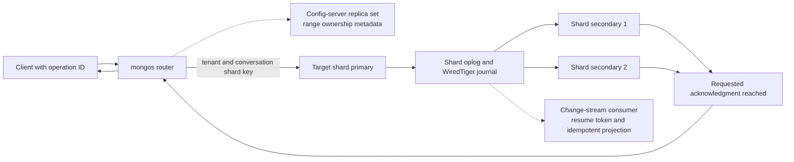

## Working model

MongoDB stores Binary JSON (BSON) documents in collections and makes one document a natural atomic mutation boundary. WiredTiger supplies the default storage engine for ordinary deployments. Replica sets add elections, an operation log, acknowledgment policies, and rollback rules. Sharded clusters add routers, config-server metadata, partition ranges, migrations, and one replica set per shard.

Those layers answer different questions. A nested document shape does not explain durability. A replica set does not distribute one collection's writes across machines. Sharding does not repair an unbounded document. A correct design traces the same operation through all selected layers.

## A document is a bounded aggregate, not a schema escape

BSON supports nested objects, arrays, binary values, dates, decimal values, object identifiers, and other typed fields. Documents in one collection can have different fields, but every reader, writer, validator, and index still relies on a shape. The schema lives in application code, collection validators, migration logic, indexes, and assumptions made by downstream consumers.

Embedding places related fields or child records inside one document. It works well when the application reads and changes the aggregate together and its growth has a known bound. A user profile with a small preference object is a good candidate. A conversation with an indefinitely growing message array is not: the document becomes a hot, growing mutation unit and eventually reaches MongoDB's 16 MiB BSON document limit.

References store related entities as separate documents and join them in application requests or aggregation stages. They permit separate lifecycles, independent indexes, and unbounded child counts. They also create more reads and, when a correctness rule crosses documents, may require a multi-document transaction or another shared authority.

Use access patterns to choose the boundary:

| Property   | Embed in one document                            | Reference another document                            |
| ---------- | ------------------------------------------------ | ----------------------------------------------------- |
| Read shape | Parent and child normally load together          | Child has independent reads or filters                |
| Mutation   | Fields should change atomically as one aggregate | Entities change independently or at different rates   |
| Growth     | Count and total bytes have a firm bound          | Relationship can grow without a safe document bound   |
| Ownership  | Child belongs to one parent lifecycle            | Child is shared or has its own retention              |
| Indexing   | Array and nested indexes remain bounded          | Child needs independent compound indexes or shard key |

MongoDB can enforce JSON Schema validation rules on a collection. Validation helps keep required types and fields sane across multiple writers. It does not replace uniqueness indexes, transaction rules, authorization, or versioned application migration.

## One document write is atomic

An update to one document is atomic: readers do not observe half of that document's field changes. This makes a document a useful concurrency boundary. The update predicate can also act as a compare-and-set condition:

```javascript
db.conversations.updateOne(
  {
    tenantId: tenantId,
    conversationId: conversationId,
    version: expectedVersion,
  },
  {
    $set: { status: "assigned", assignedAgentId: agentId },
    $inc: { version: 1 },
    $push: {
      auditTail: {
        $each: [{ event: "assigned", at: now }],
        $slice: -20,
      },
    },
  },
);
```

Exactly one competitor can match a particular version. The result's matched and modified counts tell the application whether it won. The bounded `$slice` keeps the embedded audit tail from growing forever; full audit history belongs in a separate collection.

An application-side read followed by an unconditional replacement can lose concurrent updates. Prefer update operators and a predicate that names the state being changed. Replacement is appropriate only when the caller intentionally owns the whole document version and guards it accordingly.

## `_id` and secondary indexes create distinct access paths

Every document has an `_id` field, and a collection normally has a unique `_id` index. Additional indexes store ordered key entries referencing documents. Compound index order determines which equality, sort, and range shapes can use one contiguous interval.

For a conversation collection, this index supports one tenant's recent open conversations:

```javascript
db.conversations.createIndex({
  tenantId: 1,
  status: 1,
  lastActivityAt: -1,
  conversationId: -1,
});
```

Equality on `tenantId` and `status` narrows the prefix; the remaining fields provide ordered pagination and a deterministic tie-breaker. A query that omits `tenantId` cannot generally treat the later fields as the same narrow tenant interval.

The common equality-sort-range guideline is a starting rule, not a proof. Distribution, result fraction, projection, `$in` shape, collation, sort direction, and engine version affect the plan. Use `explain("executionStats")` to compare keys examined, documents examined, returned documents, execution stages, and whether a blocking sort occurred.

## Multikey indexes expand arrays into several entries

When an indexed path contains an array, MongoDB makes the index multikey and records entries for array elements. This makes queries such as `tags: "billing"` efficient, but the physical entry count follows array values rather than document count.

An array with 500 indexed elements can create hundreds of entries for one document. Updates to the array maintain those entries. Compound multikey indexes have restrictions because indexing more than one independent array path would imply a Cartesian product. Covered-query behavior and shard-key interactions also have documented limits.

Keep indexed arrays bounded and observe average and tail element counts. If each element needs independent ordering, retention, ownership, or high-rate mutation, model it as another collection.

Wildcard indexes can index varying field paths, including a designated nested attribute area. They help when tenants define many sparse custom fields, but they do not make every possible query cheap. The index can grow with path count and values, carries its own restrictions, and still needs a leading stable tenant key when tenant isolation and routing matter.

## Query planning compares candidate plans

MongoDB builds a query shape from the operation and considers eligible indexes. The multi-planner can run candidate plans for a trial period and cache a winner for subsequent operations of the same shape. Current releases also document cost-based planning behavior for eligible queries.

A cached winner can become poor when data distribution changes or parameter values vary sharply. One tenant may match 10 documents while another matches 10 million under the same shape. An index can also be technically eligible yet examine nearly the whole collection because the leading key has low selectivity.

Read these quantities together:

- documents returned;
- index keys examined;
- documents examined;
- seeks and scan bounds;
- sort and memory behavior;
- execution time under cold and warm cache;
- rejected candidate plans and plan-cache state;
- parameter distribution by tenant or value class.

`COLLSCAN` is not automatically wrong for a tiny collection or a query returning most documents. `IXSCAN` is not automatically cheap when it scans many keys and fetches many documents.

## WiredTiger separates cache, journal, and checkpoints

WiredTiger is MongoDB's default general-purpose storage engine. It manages collections and indexes through internal B-tree structures, a cache, compression, checkpoints, and a write-ahead journal. MongoDB and the operating system both use memory; the WiredTiger cache is not the host's only memory consumer.

A foreground write changes WiredTiger state and emits journal records according to the configured durability path. A checkpoint writes a consistent snapshot of data files. If the process stops after a checkpoint but before later changes reach their final data files, recovery replays journal records after the checkpoint.

Journal, checkpoint, and replica acknowledgment are distinct boundaries:

- the journal makes post-checkpoint changes locally recoverable under its flush policy;
- a checkpoint reduces recovery work and publishes durable data-file state;
- write concern decides which replica-set members must acknowledge before the client receives success;
- read concern decides which committed history a read may return.

Compression applies to collection and index storage with configurable choices. A logical 2 KiB document can occupy different bytes in cache, on disk, in the journal, in indexes, and on the wire. Capacity estimates must measure those layers rather than assume one compression ratio.

## Cache eviction turns dirty state into foreground latency

WiredTiger must evict pages from its cache to make room for new work. Clean pages can be discarded and reloaded. Dirty pages require reconciliation into an on-disk form before their cache space becomes reusable. Long-running snapshots can keep older versions necessary and make reconciliation retain more history.

If application threads produce dirty or versioned state faster than background eviction can resolve it, eviction work enters request paths and tail latency rises. A larger cache delays pressure but cannot fix sustained write and checkpoint work that exceeds storage capacity.

Observe cache bytes, dirty bytes, pages read and written, eviction worker and application-thread eviction, checkpoint duration, tickets or execution queues, disk latency, and the oldest active transaction. High cache occupancy alone is expected for a cache; blocked eviction and rising dirty history identify the problem.

## A replica set has one primary writer at a time

[DS3](../06-distributed-systems/03-failure-detection-gossip-membership.md) explains why heartbeat silence creates suspicion rather than proof. [DS5](../06-distributed-systems/05-consensus-and-replicated-state-machines.md) and [DS7](../06-distributed-systems/07-replication-consistency-and-transactions.md) provide the election-authority and client-history models used here.

A replica set contains voting members that elect a primary. Ordinary writes route to the primary. The primary applies changes and records them in the operation log, or oplog. Secondaries copy and apply oplog entries asynchronously and maintain their own oplog copies.

The oplog is a special capped collection containing a rolling history of idempotent change operations. Its time window depends on allocated size and write volume; high write bursts shorten the same byte budget. A secondary that falls behind beyond retained history normally needs resynchronization from another member rather than simply replaying a missing segment.

Replica-set heartbeats and elections establish which member may be primary. A partitioned old primary steps down when it cannot sustain the required authority, but clients must still handle failed connections and retry against the discovered primary. Elections do not make one client attempt exactly once.

## Write concern names the acknowledgment set

`w: 1` waits for the primary's acknowledgment under its journal settings. `w: "majority"` waits for a calculated majority of data-bearing voting members to durably commit the write under the documented majority-journal behavior. A numeric `w` waits for that many data-bearing members but does not necessarily mean an election majority.

For most current replica-set configurations, MongoDB documents majority as the default write concern, but deployments can set explicit defaults and special topologies affect the calculation. Production code should not depend on an assumed default; inspect and set the contract deliberately.

A write-concern timeout means the requested acknowledgment set did not respond before the deadline. It does not prove that the primary failed to apply the write. The write may later reach more members. A retry therefore needs a stable operation identity or an idempotent conditional mutation.

Custom write concerns can use member tags to require acknowledgments from selected failure domains. This can express “one copy in each named site,” but it also couples availability and latency to those sites.

## Read concern and read preference solve different problems

Read preference chooses which eligible member receives a read: primary, primary-preferred, secondary, secondary-preferred, or nearest, with optional tag and staleness settings. Read concern controls the consistency or durability view returned by that member.

Reading from a secondary is not automatically safe because it is “nearby.” The member can lag the primary, and a local read can observe data later rolled back. Majority read concern returns data from the majority-committed view, but the selected secondary may still not have the newest majority-committed value yet. Linearizable read concern is limited to primary reads and adds a stronger real-time condition for majority-acknowledged writes, with higher availability and latency cost.

Causally consistent sessions can preserve relationships such as read-your-own-writes and monotonic reads when used with the required concerns. The client must pass the session through related operations; opening unrelated sessions discards that causal context.

State the full policy: target member, maximum staleness, read concern, session behavior, and fallback during primary loss.

## Elections can roll back uncommitted history

If an old primary accepted writes that never reached the commit point before another member became primary, those writes can diverge from the new elected history. When the old member rejoins, it rolls divergent operations back to converge.

Majority write concern is designed to keep acknowledged writes on the committed history when the deployment retains the required majority. Weaker acknowledgments can expose a client to later rollback. Even with majority writes, the client can lose the reply after commit and must reconcile the ambiguous result.

Rollback files can preserve removed BSON documents for investigation, but they are not an application recovery protocol. Preventing duplicate effects still belongs to operation IDs, unique indexes, and conditional mutations.

## Multi-document transactions add a coordination scope

MongoDB transactions can atomically change several documents and collections on a replica set or sharded cluster. All operations use the transaction's session, read concern, write concern at commit, and read preference. The driver callback API handles selected retryable errors, while the application still needs idempotent external effects and a bounded transaction body.

Transactions are useful when an invariant truly crosses documents. They do not make unbounded aggregates or broadcast queries cheap. Long transactions retain snapshot history, use cache, increase conflict probability, create oplog and replication work, and face lifetime and size limits.

For a sharded transaction, the coordinator must obtain a commit decision across participating shards. A transaction that touches one shard is simpler than one scattered across ten. A shard key aligned with the transaction's main aggregate reduces participants; it does not eliminate every cross-shard business workflow.

Read concern `snapshot` can give a synchronized sharded view when paired with the documented transaction commit policy. Read concern set on individual operations inside the transaction is not the way to establish that contract; it belongs at transaction start.

## Change streams expose committed changes with resume positions

Change streams let applications subscribe to changes on a collection, database, or deployment through the aggregation interface. Events derive from the oplog and include resume information. Consumers can store a resume token and restart after a disconnect within the history and compatibility supported by the deployment.

A change stream is not an unlimited queue. Oplog retention bounds how long a stopped consumer can resume. Invalidation, collection changes, shard changes, failover, and version upgrades have documented token and resume behavior. The consumer must persist its own processing checkpoint and make the downstream effect idempotent because reconnect and checkpoint races can repeat events.

Pre- and post-images are optional features with storage and retention cost. Without them, an update event may describe changed fields rather than include a complete before or after document. A downstream projection that requires full state can perform a lookup, enable the appropriate image feature, or redesign its event contract.

Monitor oplog window in time and bytes, consumer lag relative to cluster time, resume failures, event-processing errors, downstream idempotency conflicts, and rebuild duration.

## Sharding adds routing and ownership metadata

A MongoDB sharded cluster contains:

- **shards**, each normally a replica set holding a subset of collection data;
- **config servers**, deployed as a replica set, holding cluster metadata;
- **`mongos` routers**, stateless query routers with cached metadata;
- **balancing and migration mechanisms** that move key ranges among shards.

The shard key is an indexed field sequence that divides the collection's key space. Metadata maps non-overlapping ranges, commonly called chunks in the conceptual model, to shards. A router uses the query predicate and metadata to target one or several shards. If the predicate lacks a usable shard-key equality or range, the router can scatter the operation to all shards and merge results.

Each shard still has its own replication, storage, cache, and maintenance limits. Adding shards increases distributed capacity only when the shard-key distribution and query routing let work spread.



## A shard key chooses distribution and query scope

MongoDB supports range-based and hashed shard keys. Range sharding preserves proximity of nearby key values, which supports targeted ranges but can send monotonically increasing inserts to the current highest range. Hashed sharding spreads values more evenly but destroys ordinary range locality on the hashed field.

A compound key can combine distribution and locality. For conversation messages, `{ tenantId: 1, conversationId: "hashed" }` is not valid shorthand for every desired query; the exact supported key and hash position must be checked, and hashing conversation identity affects which ranges a tenant spans. An alternative range key `{ tenantId: 1, conversationId: 1, sequence: 1 }` targets a conversation and preserves sequence but can place one large tenant or hot conversation on one shard.

Evaluate:

- cardinality: enough distinct values to create distributable ranges;
- frequency: no one value owns a large fraction of work or bytes;
- monotonicity: new writes do not all target one active range;
- query targeting: important operations carry the key or a useful prefix;
- growth: one key value does not become an indivisible oversized range;
- transaction locality: main invariants do not touch many shards;
- zones and residency: required key ranges can map to allowed shards.

The perfect shard key rarely exists. State which query or hotspot pays for the compromise and which projection serves the path the primary layout cannot.

## Balancing moves ranges while traffic continues

The balancer moves ranges to improve distribution. A migration copies range data to the recipient, tracks concurrent modifications, enters a commit phase that changes ownership metadata, and later cleans orphaned data according to the protocol. Reads and writes continue through most phases, so migration competes for network, disk, cache, oplog, and replication capacity.

An oversized or indivisible range can resist normal movement, often because a low-cardinality shard-key value contains too many documents. More shards do not split one unsplittable value. Refining the shard key adds suffix fields to increase range precision; resharding builds a new distribution under another key. Both are online data migrations with storage, change capture, cutover, rollback, and duration costs.

Zones associate shard-key ranges with tagged shards for residency or hardware placement. A zone is only as correct as the key field that expresses residency and the operational controls preventing incompatible movement or queries.

## Worked case: a multi-tenant conversation service

Assume 6,000 message writes each second, 18,000 recent-history reads each second, 25 million conversations, and 60 days of hot messages. One tenant owns 12% of traffic, and one live event can produce 800 messages each second in a single conversation.

Use separate bounded documents:

```javascript
// conversation header
{
  _id: conversationId,
  tenantId,
  status,
  assignedAgentId,
  version,
  lastSequence,
  lastActivityAt,
  recentParticipantIds: [/* bounded */]
}

// message
{
  _id: messageId,
  tenantId,
  conversationId,
  sequence,
  senderId,
  body,
  createdAt
}
```

Do not embed all messages in the conversation. The list is unbounded, changes much faster than the header, and needs its own ordered range. The service assigns sequences through a guarded header update and message insert in one transaction when strict gap-free ordering is required. If gaps are acceptable, a separate allocation protocol can reduce transaction coupling.

Start unsharded on a three-data-bearing-member replica set if measured storage and write capacity fit. Use explicit majority write concern for accepted messages, a retryable operation ID with a unique index, and primary or causally consistent reads for immediate read-your-write behavior. A search projection consumes change streams and can lag by a stated interval.

When one replica set no longer fits, shard messages by a key that targets conversation history while distributing conversations. Hashing conversation identity can spread conversations, but the hot 800-message/s conversation remains one logical key and one shard. That hotspot needs per-conversation admission, batching, or a changed ordering contract; adding routers cannot parallelize one strict sequence.

The capacity sketch begins with raw payload:

```text
6,000 messages/s * 2 KiB average = 12,000 KiB/s = about 11.7 MiB/s
12,000 KiB/s * 86,400 s/day * 60 days = about 57.9 TiB raw message bodies
largest tenant = 720 writes/s
largest conversation = 800 writes/s on one ordering boundary
```

The 57.9 TiB excludes BSON field names, indexes, journal, oplog, compression, replicas, migration headroom, and backups. Measure them on representative documents. The 800/s conversation exceeds the tenant-average intuition and may set the actual per-shard tail behavior.

Failure traces:

- A majority write succeeds but its reply is lost: retry the same operation ID and return the existing message.
- The primary fails before a `w: 1` write commits to a majority: a later election can roll it back, so the product must not promise stronger durability.
- A secondary falls beyond the oplog window: rebuild or initial-sync it rather than waiting for missing history.
- The search consumer stops beyond resumable history: rebuild from authoritative collections under a consistent cut and then resume.
- A range migration saturates one shard: pause or throttle movement, retain routing correctness, and restore capacity before chasing even byte counts.
- A document grows toward 16 MiB: split the aggregate before the write fails; compression does not raise the BSON document limit.

Useful evidence includes operation deduplication conflicts, matched counts, keys and documents examined, plan-cache changes, document and array size tails, WiredTiger dirty cache and eviction, checkpoint duration, journal latency, oplog window, majority commit lag, election and rollback history, targeted versus scatter queries, per-shard rate and bytes, range movement, and change-stream lag.

## Summary

MongoDB makes one bounded document a convenient atomic aggregate. It does not remove schema, index, transaction, or lifecycle design. WiredTiger handles cache, journal, checkpoints, compression, and version cleanup. Replica sets handle elected writes and acknowledgment history. Sharding maps key ranges to replica-set shards through router and config metadata.

- Embed fields that load and change together only while total size and array counts stay bounded.
- Use conditional update operators and matched counts to resolve a race at one document version.
- Compound index order follows equality, sort, and range access. Multikey entries grow with array elements.
- Read query evidence as keys examined, documents examined, returned rows, sort work, and parameter distribution; an index stage is not proof of a cheap query.
- Journal flush, checkpoint, write concern, read concern, and read preference are separate contracts.
- An oplog is a finite rolling history. Size its time window against replica outages, change-stream pauses, and maintenance.
- Majority acknowledgment reduces rollback risk at its documented commit point; a timeout still leaves an ambiguous write outcome.
- Transactions coordinate documents but retain snapshots, consume cache, conflict, and can span shards. Model aggregates to keep the common invariant local.
- A shard key sets ownership, targeting, hotspot size, migration, and residency. More shards cannot split one hot key without another partitioning rule.
- Range movement and resharding are production migrations with foreground resource costs and cutover state.
- Change-stream consumers need durable resume positions, idempotent effects, lag alerts, and a full rebuild path.

## References

- [MongoDB data modeling](https://www.mongodb.com/docs/manual/data-modeling/): Frames embedding, references, schema design, atomicity, growth, and access patterns.
- [MongoDB BSON types and document limits](https://www.mongodb.com/docs/manual/reference/limits/#mongodb-limit-BSON-Document-Size): Documents the 16 MiB BSON document limit and related constraints.
- [MongoDB schema validation](https://www.mongodb.com/docs/manual/core/schema-validation/): Defines collection validation rules and enforcement behavior.
- [MongoDB compound indexes](https://www.mongodb.com/docs/manual/core/indexes/index-types/index-compound/): Covers field order, prefixes, sort, and compound-index behavior.
- [MongoDB multikey indexes](https://www.mongodb.com/docs/manual/core/indexes/index-types/index-multikey/): Defines array entry expansion, compound restrictions, coverage, and shard-key interactions.
- [MongoDB query plans](https://www.mongodb.com/docs/manual/core/query-plans/): Documents candidate plans, query shapes, caching, and cost-based planning.
- [MongoDB `explain`](https://www.mongodb.com/docs/manual/reference/explain-results/): Defines execution stages, examined keys and documents, bounds, and sharded-plan evidence.
- [MongoDB WiredTiger storage engine](https://www.mongodb.com/docs/manual/core/wiredtiger/): Covers cache, eviction, journaling, checkpoints, compression, and concurrency.
- [MongoDB journaling](https://www.mongodb.com/docs/manual/core/journaling/): Defines journal records, group commits, acknowledgment, recovery, and configuration.
- [MongoDB replica-set oplog](https://www.mongodb.com/docs/manual/core/replica-set-oplog/): Defines the capped operation history, secondary replication, window behavior, and idempotent entries.
- [MongoDB replica-set elections](https://www.mongodb.com/docs/manual/core/replica-set-elections/): Documents voting, majority, primary loss, election timeout, and write availability.
- [MongoDB write concern](https://www.mongodb.com/docs/manual/reference/write-concern/): Defines numeric, majority, journal, timeout, tag-set, and default acknowledgment behavior.
- [MongoDB read concern](https://www.mongodb.com/docs/manual/reference/read-concern/): Defines local, available, majority, linearizable, and snapshot read guarantees.
- [MongoDB read preference](https://www.mongodb.com/docs/manual/core/read-preference/): Covers member selection, tags, staleness, latency windows, and transactions.
- [MongoDB rollbacks](https://www.mongodb.com/docs/manual/core/replica-set-rollbacks/): Explains divergence, common-point recovery, rollback files, and prevention through write concern.
- [MongoDB transactions](https://www.mongodb.com/docs/manual/core/transactions/): Defines sessions, concerns, driver retries, replica-set and sharded transactions, limits, and operation restrictions.
- [MongoDB change streams](https://www.mongodb.com/docs/manual/changeStreams/): Documents event scope, resume tokens, deployment behavior, and pre/post images.
- [MongoDB sharding](https://www.mongodb.com/docs/manual/sharding/): Maps routers, config servers, replica-set shards, ranges, targeting, balancing, and availability.
- [MongoDB shard keys](https://www.mongodb.com/docs/manual/core/sharding-shard-key/): Defines range and hashed keys, cardinality, frequency, monotonicity, refinement, resharding, and troubleshooting.
- [MongoDB range migration](https://www.mongodb.com/docs/manual/core/sharding-balancer-administration/): Covers balancing controls, migration, scheduling, and operational effects.
- [MongoDB resharding](https://www.mongodb.com/docs/manual/core/sharding-reshard-a-collection/): Documents changing a shard key through an online distributed operation.
- [MongoDB zones](https://www.mongodb.com/docs/manual/core/zone-sharding/): Defines range-to-shard placement for data locality and tiering.
