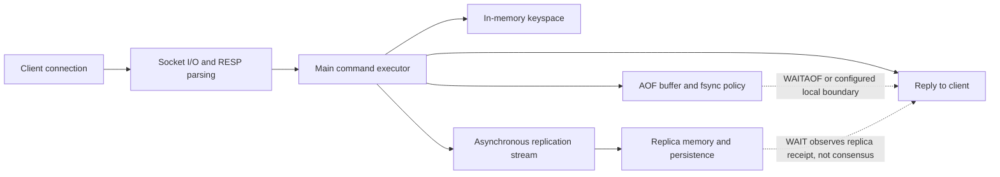
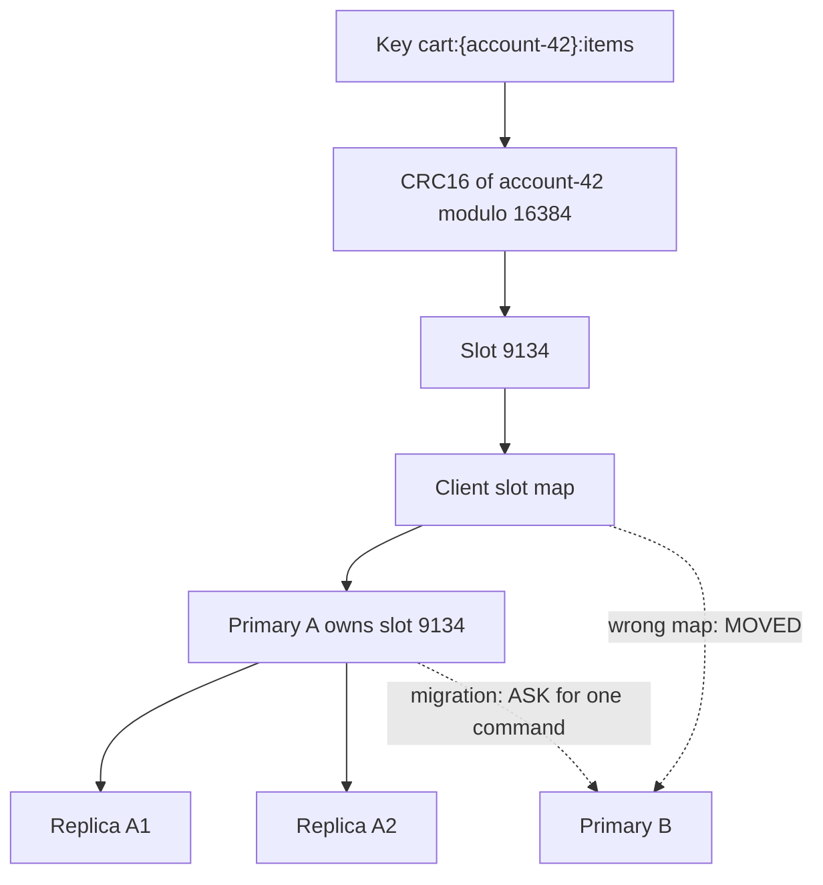

## Working model

Redis is a networked data-structure server. A top-level key names one value, and that value has a type such as string, hash, list, set, sorted set, or stream. Commands operate on those types inside the server. This is different from storing an opaque JSON blob in a generic cache: `HINCRBY`, `ZPOPMIN`, `XREADGROUP`, and `BITCOUNT` each give the server enough information to perform a specific mutation or read.

For ordinary Redis keys, the active dataset is memory resident. Persistence can reconstruct that state after restart. Replication can maintain copies. Sentinel can discover and promote a replica for a non-sharded deployment. Redis Cluster can divide keys among primary nodes. Those mechanisms change failure behavior, but they do not turn every acknowledged command into a strongly consistent, permanently durable database transaction.

Start every design by classifying the state:

- **Derived cache state** may disappear, lag, or be evicted because another system can rebuild it.
- **Reconstructible working state** is not merely a cache, but a retained source log or database can replay it within the required recovery time.
- **Authoritative state** determines a business fact that no other system can reconstruct without loss.

Redis can hold any of these categories. The category determines whether eviction is legal, which persistence and replication settings are needed, what an acknowledgment means, and whether Redis is the right authority at all.

The descriptions below follow current Redis Open Source behavior. Several features are release-sensitive: Redis 8 changed I/O threading; Redis 8.4 added conditional string updates and compare-and-delete; Redis 8.6 added more eviction and stream behavior. Check the deployed server and client versions before depending on one of those additions.

## A command crosses network, execution, durability, and replication boundaries

A client encodes a command using the Redis Serialization Protocol (RESP) and sends it over a persistent TCP or TLS connection. Redis reads and parses the request, checks authentication and access control list (ACL) rules, executes the command against the selected database or cluster slot, builds a reply, and writes that reply to the connection.

Four points in that path are easy to conflate:

1. **Execution** means the in-memory mutation ran on one Redis primary.
2. **Local persistence** means a Redis database snapshot (RDB) or append-only file (AOF) policy can recover some or all of that mutation after restart.
3. **Replication** means one or more replicas received some point in the primary's replication stream.
4. **Failover survival** means the specific replica later promoted contains the mutation and can recover it under its own persistence settings.

A normal successful `SET` proves the first point. It does not by itself prove the remaining points.



Pipelining lets a client send several commands without waiting for each reply. It saves network round trips and can improve throughput, but it does not make the commands one atomic unit. Another client's command may execute between commands from a pipeline. `MULTI`/`EXEC`, a Lua script, a Redis Function, or a purpose-built atomic command is needed when the state transition must be indivisible.

## Command execution is serialized even when network I/O is threaded

Redis uses an event loop to multiplex many client connections. Ordinary command logic that reads or changes the keyspace executes serially on the main thread of a Redis process. This is the basis for command atomicity: another ordinary command does not observe a half-finished `INCR`, `HSET`, or `ZADD` on that instance.

“Redis is single-threaded” is incomplete for current releases. Background threads or child processes handle work such as asynchronous freeing, selected disk I/O, RDB creation, and AOF rewrite. Redis 8 can also assign clients to I/O threads that perform socket reads, socket writes, and protocol parsing. The main thread receives parsed work, executes commands, and produces replies. I/O threads can remove a network bottleneck; they do not let two ordinary commands mutate the same instance's keyspace in parallel.

This execution model has two direct consequences:

- One expensive command delays unrelated clients on the same process. `HGETALL` on a huge hash, `SMEMBERS` on a huge set, a wide `ZRANGE`, a large Lua loop, and deletion of a large value with synchronous `DEL` can all occupy the executor.
- Adding I/O threads does not fix command CPU saturation. If `INFO` shows command execution dominating the event loop, reduce the work per command, split the key or workload, use incremental commands, or partition across Redis processes.

The big-O label on a command describes growth, not a latency promise. `O(1)` can still copy a 200 MiB string. An `O(log N + M)` sorted-set range can return millions of members when `M` is large. Network output buffers and client decoding then add work beyond the server-side lookup.

Prefer bounded operations:

- use `SCAN`, `HSCAN`, `SSCAN`, and `ZSCAN` for incremental iteration rather than `KEYS` or full collection reads;
- include a fixed `COUNT` or range bound where the API permits it;
- use `UNLINK` when large-object reclamation can happen asynchronously;
- cap list, stream, and sorted-set growth as part of the data model;
- measure element bytes and cardinality at the tail, not only at the average.

## Keys are schema and routing decisions

Redis has no relational schema, but key names still form an application schema. A useful key names the owner, entity, purpose, and version when those distinctions affect retention or compatibility:

```text
cache:product:{tenant-17}:product-884:v3
ratelimit:{account-42}:2026-07-18T19:04
stream:{tenant-17}:email-events
session:{user-991}
```

The braces have meaning in Redis Cluster. If a key contains a non-empty `{...}` substring, only the first such substring is hashed to choose a slot. Keys with the same hash tag can participate in cluster multi-key commands, transactions, and scripts. They also concentrate traffic in one slot. `{tenant-17}` is sensible only if one tenant's full peak fits on one primary. A globally constant tag such as `{cache}` defeats sharding.

The top-level key has its own dictionary, metadata, pointer, expiration record when present, and allocator overhead. One million tiny string keys can consume far more memory than the sum of their payload bytes. Packing fields into a bounded hash can reduce top-level overhead, but it changes expiration, access, deletion, cluster placement, and hot-key behavior. Memory optimization is a data-model decision, not a transparent compression switch.

Use `MEMORY USAGE key [SAMPLES n]` on representative values and `OBJECT ENCODING key` when validating a model. Repeat after a value crosses its small-object encoding threshold because the representation and memory curve may change.

## Data types expose different cost and memory curves

The following table lists common operations. `N` means collection cardinality or bytes scanned as stated; `M` usually means returned members. Exact definitions are in each command reference.

| Type             | Good fit                                                      | Common command costs                                                                                                | Memory and failure concern                                                                                                   |
| ---------------- | ------------------------------------------------------------- | ------------------------------------------------------------------------------------------------------------------- | ---------------------------------------------------------------------------------------------------------------------------- |
| String           | Opaque bytes, counters, tokens, serialized objects            | `GET`, `SET`, and `INCR` are O(1); `MGET` is O(number of keys)                                                      | Top-level key overhead can dominate tiny values; a single huge value blocks copying, replication, persistence, and migration |
| Hash             | Bounded record with independently changed fields              | `HGET` and `HSET` are O(1) average; `HGETALL` is O(fields)                                                          | Compact while small, then converts to a hash table; one hot record remains one hot key                                       |
| List             | Bounded deque or simple FIFO/LIFO                             | End pushes and pops are O(1); indexed access and middle removal are O(N); `LRANGE` includes seek plus output        | Quicklist/listpack layout makes ends cheap, but long scans and huge queues block and replicate poorly                        |
| Set              | Unique membership and set algebra                             | Add, remove, and membership are O(1) average; full reads and algebra scale with members scanned                     | Integer or listpack encodings can be compact; large unions and intersections monopolize execution                            |
| Sorted set       | Ranking, delayed work, score/rank ranges                      | `ZADD` and `ZREM` are O(log N) per member; ranges are O(log N + M)                                                  | Large score ranges and one global leaderboard create hot keys; mature encoding uses a dictionary plus skip list              |
| Stream           | Append-only entries with ordered IDs and consumer-group state | `XADD` is O(1) without trimming; ranges scale with entries returned; PEL work scales with pending entries inspected | Stream entries, groups, consumers, and pending references all consume memory; one stream key lives on one cluster slot       |
| Bitmap           | Dense flags over a compact integer ID space                   | `GETBIT` and `SETBIT` are O(1); `BITCOUNT`, `BITPOS`, and `BITOP` scan bytes                                        | Setting one very high offset allocates the bytes before it; sparse IDs waste memory                                          |
| HyperLogLog      | Approximate distinct count                                    | `PFADD` is O(1) per item; one-key `PFCOUNT` is O(1) with a nontrivial constant                                      | Uses at most about 12 KiB with 0.81% standard error; cannot return the observed members                                      |
| Geospatial index | Radius or box lookup over points                              | `GEOADD` follows sorted-set insertion; `GEOSEARCH` is O(N + log M) under its documented candidate/result terms      | Stored as a sorted set with geohash-derived scores; broad dense regions still scan and sort many candidates                  |

### Strings are binary-safe values and atomic counters

A Redis string is a sequence of bytes, not necessarily UTF-8 text. Redis uses a dynamic string representation internally and can encode small integer values compactly. The API supports full replacement, append, ranges, integer increments, floating-point increments, bit access, conditional set, and expiration in the same `SET` command.

`SET key value NX PX 30000` is one atomic command that creates a value only when the key is absent and attaches a 30-second TTL. Sending `SETNX` and `PEXPIRE` as two independent commands leaves a crash window between them. The same principle applies to counters: `INCR` is safer than `GET`, client arithmetic, then `SET`.

Strings are capped at 512 MiB in the classic Redis string API. Treat that as a hard ceiling, not a target value size. A large string costs memory while the active dataset is resident, adds bytes to replication and AOF, can increase copy-on-write during background persistence, and must move as one value during cluster resharding.

### Hashes represent bounded records

A hash stores field-value pairs under one top-level key:

```text
HSET session:{user-991} user_id 991 role editor last_seen_ms 1784426640000
HINCRBY session:{user-991} request_count 1
HGET session:{user-991} role
```

Small hashes can use a compact listpack. When field count or field/value size exceeds configured thresholds, Redis converts the value to a hash table. The API does not change, but memory per field and access constants do. Current Redis releases also have hash-field expiration commands; older releases only expire the whole top-level hash. Pin the server version before designing around field TTL.

Hashes save top-level-key overhead when several fields share ownership and retention. They are a poor container for unbounded tenants, users, or jobs. One hash with millions of fields cannot be split across cluster nodes, and `HGETALL`, deletion, persistence, and resharding all encounter the large object.

### Lists are deques, not general random-access arrays

Lists keep insertion order and make pushes or pops at either end cheap. Current implementations use a quicklist, a linked sequence of compact listpack nodes. This balances pointer overhead with the cost of moving bytes inside one compact node.

`LPUSH`/`LPOP` and `RPUSH`/`RPOP` fit bounded deques. `BLPOP` and `BRPOP` can wait for work without client polling. Lists do not track acknowledgment after a pop. If a worker removes an item and crashes before processing it, the item is gone unless the application first moves it to another recovery list with an atomic command. Streams supply consumer-group pending state for this job.

`LINDEX`, `LSET`, and middle removals must walk toward the target. A list with ten million entries is not made safe by O(1) pushes. Bound its length with an application rule and observe the time needed to recover or migrate the full key.

### Sets give exact uniqueness and algebra

Sets store unique strings. Integer-only small sets can use an `intset`; current releases can also use listpack for eligible small sets. Larger or less compact sets use a hash table. `SADD`, `SREM`, and `SISMEMBER` are O(1) on average in the general representation.

Set algebra performs real work. `SINTER`, `SUNION`, and `SDIFF` must inspect members from their inputs, and `*STORE` variants also allocate and write a result. The executor is occupied during that work. For large collections, maintain a derived result incrementally, partition the domain, or perform bounded scans outside Redis when atomic point-in-time algebra is unnecessary.

Choose a bitmap instead of a set when members map to a dense numeric range and only boolean membership is needed. Choose HyperLogLog when only an approximate count is needed. A set remains the right type when the application must enumerate exact members.

### Sorted sets combine unique members with numeric scores

A sorted set maps each unique member to a floating-point score. Members are ordered by score, with lexicographic member order breaking equal scores. Small sorted sets can use listpack. Larger ones use both a hash table for direct member lookup and a skip list for ordered traversal.

That dual representation explains the common costs. Finding a member's score is O(1) average through the dictionary. Adding or changing a score and removing a member are O(log N). Seeking into a rank or score range is O(log N), then returning `M` members adds O(M).

Sorted sets fit leaderboards, delayed-job indexes, sliding-window rate limiters, and time-ordered secondary indexes. They do not enforce unique scores, and floating-point scores cannot exactly represent every arbitrarily large integer. If timestamp order needs a tie-breaker, encode a stable tie-breaker in the member and use score plus member ordering deliberately.

A global leaderboard is one key and therefore one executor/cluster slot. Sharding leaderboards by cohort spreads writes but makes an exact global top-K a merge problem. State that tradeoff rather than assuming Redis Cluster splits one sorted set internally.

### Streams add log IDs and delivery bookkeeping

A stream is an ordered sequence of field-value entries. Each entry has an ID with a millisecond-time part and sequence part. `XADD key * ...` asks Redis to assign the next ID. The structure stores entries in compressed listpacks indexed by a radix tree, which supports ordered range access without one top-level key per event.

Plain `XREAD` lets a client read entries after an ID. A consumer group adds shared progress and a Pending Entries List (PEL). `XREADGROUP ... >` delivers entries not yet delivered to that group and records ownership. `XACK` removes the group's pending reference after processing. `XPENDING` shows pending work; `XAUTOCLAIM` can transfer entries that have been idle long enough to another consumer.

Delivery can repeat. A consumer may complete the external effect and crash before `XACK`, causing a later claim and another attempt. Make the external sink idempotent with a unique event ID or conditional state transition. Redis 8.6 stream producer deduplication can prevent selected duplicate submissions, but it does not atomically join Redis delivery with a write to another database.

Trim streams by an explicit retention contract. Approximate `MAXLEN ~` trimming is cheaper than exact trimming under many workloads. Retention must exceed the worst supported consumer outage plus processing lag, and PEL behavior must be understood before deleting old entries. Redis 8.2 added finer controls for deletion and references across consumer groups; default and older behavior may leave a pending reference after the underlying entry has been deleted.

### Bitmaps trade identifier density for memory

Bitmap commands interpret a Redis string as a bit vector. One bit can represent whether numeric user 42 was active on a date. `SETBIT active:2026-07-18 42 1` is constant time. `BITCOUNT` scans the stored bytes, and `BITOP` scans the longest relevant input.

The highest offset determines allocated string length. Setting bit 4,000,000,000 on an otherwise empty key requires roughly 500 MB because Redis must represent the preceding bit positions. Hash a sparse identifier into a dense assigned integer before using a bitmap, or use a set when no stable dense mapping exists.

Date- or cohort-partitioned bitmap keys bound retention and scan cost. They also make cross-period counts require `BITOP` or client-side aggregation, which should be sized from actual bytes per bitmap.

### HyperLogLog keeps an estimate, not a member set

HyperLogLog estimates distinct cardinality. Redis documents a 0.81% standard error and at most about 12 KiB per mature structure, with smaller sparse representations for low cardinality. `PFADD` updates registers derived from item hashes; it does not retain the original items. `PFCOUNT` can estimate one structure or the union of several, and `PFMERGE` materializes a merged structure.

Use it for values such as approximate daily unique visitors where a known statistical error is accepted. It cannot answer “which users were unique,” remove one user exactly, enforce uniqueness, or provide an exact billing count. A retry of the same item is naturally idempotent for the estimate because it hashes to the same register update.

### Geospatial indexes are specialized sorted sets

`GEOADD` stores longitude/latitude points as members in a sorted set using a 52-bit geohash-derived score. `GEOSEARCH` prunes by grid-aligned cells and filters a circle or box. Its documented cost is O(N + log M), where the command defines `N` from the bounding-box candidates and `M` from matches inside the shape.

A small `COUNT` does not always make a dense wide search cheap because the server may still inspect and sort many matches. `COUNT ... ANY` can stop after finding enough candidates when nearest-result guarantees are not required. Redis geospatial commands are suitable for point-radius and axis-aligned box lookup, not arbitrary polygons, road-network distance, or full geographic information system semantics.

## Compact encodings trade memory for conversion and scan work

Redis uses compact encodings for eligible small aggregates. Current configuration names include `hash-max-listpack-*`, `zset-max-listpack-*`, `set-max-intset-entries`, and, in newer releases, `set-max-listpack-*`. When a value crosses a configured threshold, Redis converts it to the general representation.

Raising thresholds can save memory but asks Redis to scan or move more bytes inside the compact representation. It can also make the one-time conversion larger. Tune only after measuring:

- memory per element before and after conversion;
- p99 command latency near the threshold;
- conversion latency during a write;
- persistence and replication bytes for representative values;
- restore time and allocator behavior under the full dataset.

Encoding is per value. Ten million tiny hashes may each be compact while the top-level key dictionary still consumes substantial memory. Conversely, one giant compact container may use fewer bytes but create an unacceptable latency spike when it converts.

## Atomicity belongs to one executor and one declared key set

An individual command runs atomically relative to other ordinary commands on the same Redis instance. If two clients issue `INCR counter`, each increment runs as a complete operation. A client-side read-modify-write sequence is not atomic:

```text
client A: GET balance -> 100
client B: GET balance -> 100
client A: SET balance 80
client B: SET balance 70
```

The final value loses one change. Prefer a purpose-built command, conditional `SET` on supported versions, `WATCH`, or a short server-side function.

Atomic execution does not imply rollback, durability, or multi-instance isolation. If the server executes a command and the reply is lost, the client has an ambiguous result. Retrying `INCR` may apply the increment twice. A stable operation ID and a result record in the same atomic key set can turn retries into lookups.

### `MULTI` and `EXEC` serialize a queued command group

After `MULTI`, Redis queues commands on that connection. `EXEC` executes the queue without interleaving commands from other clients. The transaction does not expose intermediate command replies to choose later queued commands, and it does not provide SQL-style rollback. If one well-formed queued command fails at execution time because of a wrong type, Redis still executes the remaining queued commands.

`WATCH` adds optimistic compare-and-set behavior. The client watches keys, reads the current state, queues a transaction, and calls `EXEC`. If a watched key was changed, expired, or evicted before `EXEC`, the transaction aborts and the client may recompute from fresh state. Under contention, retries can waste work or starve; a single atomic command or function is often simpler.

In Redis Cluster, every key touched by a transaction must be in one hash slot. A hash tag can co-locate related keys:

```text
inventory:{sku-884}:available
inventory:{sku-884}:reservations
inventory:{sku-884}:version
```

That choice makes one SKU an atomic and routing boundary. It does not allow a transaction across arbitrary SKUs.

### Lua scripts and Redis Functions execute beside the data

Lua scripts called with `EVAL`/`EVALSHA` and Redis Functions called with `FCALL` can read intermediate results and conditionally run several commands. Redis guarantees atomic execution, so other commands wait until the script or function returns. The same guarantee means a long loop blocks the instance.

Keep server-side code deterministic, bounded, and explicit about keys. Pass key names through `KEYS`, data through `ARGV`, and set time limits and monitoring that catch slow executions. In Cluster, declared keys must share a slot unless a read-only feature explicitly documents another behavior.

`EVALSHA` relies on an ephemeral script cache that can disappear after restart, flush, or failover; clients must reload on `NOSCRIPT`. Redis Functions, available from Redis 7, are named libraries stored as part of database state and propagated through persistence and replication. They reduce script-loading coordination but still need versioning, deployment order, ACLs, and rollback plans.

Do not put network calls, file access, or long application workflows inside Redis code. The sandbox is intended to operate on Redis data, and command execution cannot safely wait for an external service while every other client is blocked.

## A Redis lock is a lease, not proof of exclusive external effects

The minimal single-instance lock pattern is:

```text
SET lock:invoice-42 7d0e... NX PX 30000
```

The random token identifies this acquisition. Release must compare the stored token and delete only on equality. Redis 8.4 provides `DELEX key IFEQ token`; earlier releases use a short Lua script. An unconditional `DEL` is unsafe because client A may pause past expiry, client B may acquire a new lease, and client A may then delete B's lock.

Token checking fixes release ownership, but the worker can still act after its lease expires. Consider this sequence:

1. A obtains a 30-second lease and begins work.
2. A is paused for 45 seconds by scheduling, a runtime stop, or a network partition.
3. The key expires and B obtains the lease.
4. A resumes and writes to the protected database while B also believes it owns the lease.

Lease extension narrows the window; it cannot make a paused process stop at the expiry instant. A **fencing token** addresses the protected resource instead. Each acquisition receives a monotonically increasing number. The database, storage service, or device records the highest accepted token and rejects operations carrying an older one. Token 82 cannot overwrite work already accepted with token 83.

Generating a counter in an asynchronously replicated Redis primary is not enough if failover can lose or move the counter backward. The fencing sequence and the acceptance check must have a durability and ordering contract suitable for the protected resource. Often the authoritative database can implement the whole operation as a conditional row update, removing the separate lock.

Redis documents the multi-instance Redlock algorithm for stronger availability than one independent server. Its timing assumptions and lease semantics still need to match the harm caused by overlap. If overlap can corrupt authoritative state or trigger an irreversible external action, use a consensus-backed lease with fencing, a database uniqueness/compare-and-set constraint, or an idempotent workflow whose authority rejects stale attempts.

## Expiration deletes by time; eviction deletes under memory pressure

An expiration associates an absolute deadline with a key. Commands such as `SET ... EX`, `EXPIRE`, and `PEXPIREAT` set it. Redis stores expiration timestamps in persistence, so time continues while the server is stopped. Clock jumps or moving persisted data between badly skewed hosts can therefore change which keys expire on load.

Redis removes expired keys through two paths:

- **Passive expiration** checks a key when a command accesses it and treats an elapsed key as absent.
- **Active expiration** samples keys with TTLs and deletes expired samples within a bounded CPU budget.

The active cycle is adaptive. A large wave of keys sharing one deadline can consume event-loop time, and an expired key that has not been sampled may occupy memory briefly even though reads treat it as absent. Add TTL jitter when millions of independent cache entries would otherwise expire at the same second.

The primary synthesizes deletion effects for AOF and replicas. Replicas normally wait for those effects rather than independently expiring the primary's keys; a promoted replica can then expire keys as the new primary. This keeps expiration propagation ordered with other writes, subject to the usual asynchronous replication window.

Eviction begins when dataset memory exceeds `maxmemory` and a command needs memory. Current Redis policies include:

| Policy family                                  | Candidate keys | Selection                                                 |
| ---------------------------------------------- | -------------- | --------------------------------------------------------- |
| `noeviction`                                   | None           | Reject memory-growing writes while reads can continue     |
| `allkeys-lru`, `allkeys-lfu`, `allkeys-lrm`    | All keys       | Approximate recent use, frequency, or recent modification |
| `allkeys-random`                               | All keys       | Random sample                                             |
| `volatile-lru`, `volatile-lfu`, `volatile-lrm` | Keys with TTL  | Approximate recent use, frequency, or modification        |
| `volatile-random`, `volatile-ttl`              | Keys with TTL  | Random choice or shortest remaining TTL                   |

LRM policies are a newer Redis 8.6 addition. LRU, LFU, and LRM choose from samples rather than maintain an exact global ordering. LFU uses a small probabilistic counter with decay. The `volatile-*` families behave like `noeviction` if no expiring key is eligible.

Eviction is correct only when every eligible key may disappear at any time. Mixing authoritative non-TTL keys and disposable TTL cache entries on one instance creates coupled failure behavior: volatile policies can run out of candidates, while allkeys policies can delete authority. Separate instances or clusters make the contracts observable and independently capacity-planned.

`maxmemory` is not the host memory limit. Replication and AOF buffers, client buffers, allocator overhead, fork copy-on-write pages, modules, and the Redis process itself need headroom. Redis exposes `mem_not_counted_for_evict` for selected buffers, but operators still size the host from measured RSS and peak background-operation behavior.

## Cache correctness needs a stale-data policy

Cache-aside reads appear simple:

1. read Redis;
2. on miss, read the authoritative database;
3. write Redis with a TTL;
4. return the value.

The races matter. A miss reader can fetch database version 41, pause, and populate the cache after another request commits version 42 and deletes the old cache entry. The cache now contains an older value until the next invalidation or TTL. Deleting after a database write reduces stale time but does not order the paused fill.

Choose a policy that matches the product requirement:

- **Bounded staleness:** use cache-aside with a short TTL, jitter, and documented stale interval. The database remains the authority.
- **Version-aware fill:** store the source version with the payload and use a Lua script or Function that refuses to replace a newer cached version. Maintain an invalidation version floor when deletion would otherwise allow an old fill into an absent key.
- **Validate-on-read:** compare a cheap authoritative version or generation before serving state used for a sensitive decision.
- **Bypass for invariants:** do not use the cache to decide uniqueness, money movement, entitlement revocation, or another invariant that requires current authority.

Request coalescing can prevent a popular expired key from sending thousands of simultaneous reads to the database. A short Redis lease can elect one filler while other callers wait, serve an allowed stale value, or fall back under a bound. The lease is overload control, not a replacement for version checks.

Negative caching needs a short TTL and a distinction between “authoritatively absent” and “lookup failed.” Caching a timeout as “not found” turns a dependency outage into false absence. Include tenant and authorization scope in keys so one caller cannot receive another caller's result.

The table below separates common deployment intent:

| Property      | Derived cache                                          | Redis used as authority                                      |
| ------------- | ------------------------------------------------------ | ------------------------------------------------------------ |
| Miss          | Rebuild from source                                    | Data-loss or unavailable-state event                         |
| Eviction      | Allowed under stated policy                            | Usually `noeviction`; rejection must propagate safely        |
| Persistence   | Optional if refill time and source load are acceptable | AOF/RDB, backups, restore testing, and explicit loss window  |
| Replica reads | Staleness may be acceptable                            | Must be tied to a stated consistency requirement             |
| Failover loss | Causes misses or bounded stale data                    | May violate business state; assess whether Redis is suitable |
| Capacity      | Source can absorb controlled refills                   | Writes must be admitted or rejected without losing authority |

## RDB snapshots recover a point in time

RDB persistence serializes a point-in-time dataset into a compact binary file. Automatic save rules can trigger a snapshot after a time and change count; `BGSAVE` requests one. Redis forks a child process. The child writes a temporary file and atomically replaces the prior RDB when complete, while the parent continues serving commands.

The parent and child initially share memory pages through copy-on-write. Writes after the fork cause private page copies. A write-heavy large dataset can therefore raise RSS sharply during `BGSAVE`. Fork itself also copies page-table structures and can pause the event loop, especially on large or poorly virtualized hosts.

After a crash, RDB restores only the last completed snapshot. If snapshots occur every five minutes, the worst ordinary process/host loss window approaches five minutes plus any missed or failed save interval. `lastsave` is not enough evidence; monitor `rdb_last_bgsave_status`, time since success, duration, `latest_fork_usec`, copy-on-write bytes, and the age of independently stored backups.

RDB is useful for backups and faster bulk restart. A local RDB file is not a backup against host or volume loss. Copy completed files to independent storage and run timed restore tests on the server version and dataset size that matter.

## AOF records mutations and exposes an fsync policy

Append-only file persistence logs commands needed to reconstruct state. Redis replays the AOF at startup. Since Redis 7, a multi-part AOF contains at most one base file plus incremental files, coordinated by a manifest.

`appendfsync` controls when buffered AOF bytes reach the storage durability boundary:

- `always` fsyncs after a command batch before replies and has the smallest ordinary process/host crash window at higher latency and I/O cost;
- `everysec` schedules fsync roughly once per second and may lose about one second of recent writes under the documented disaster model;
- `no` leaves flushing to the operating system and has a wider, kernel-dependent loss window.

These statements assume the filesystem and device honor `fsync`. Storage corruption, controller behavior, operator error, and a lost encryption key remain outside that guarantee. AOF durability on the old primary also does not ensure that a promoted replica has the same tail.

AOF grows because repeated updates remain in the log. `BGREWRITEAOF` forks a child that writes a new base representing current state. The parent opens a new incremental AOF and continues serving writes. When the child finishes, Redis persists and atomically switches the manifest to the new base and increments. Rewrite consumes CPU, disk bandwidth, fork time, and copy-on-write memory; those costs can collide with foreground latency.

If both AOF and RDB are enabled, Redis uses AOF on restart because it is expected to contain the more complete state. Keep RDB backups anyway. A malformed or truncated AOF tail has defined recovery behavior and tools, but an operator should copy the original before repair because truncation discards later bytes.

Persistence is not proof of business durability until restore is tested. Record:

- which file set is copied and how a rewrite is excluded or coordinated;
- the latest restorable timestamp and off-host copy age;
- startup time to replay the actual AOF size;
- memory needed while loading and serving warm-up traffic;
- application validation after recovery;
- the acknowledged-write loss bound for each crash and failover scenario.

## Replication streams effects from one primary

Redis uses a weaker replication and failover contract than a consensus-backed replicated state machine. [DS5](../06-distributed-systems/05-consensus-and-replicated-state-machines.md) derives consensus authority; [DS7](../06-distributed-systems/07-replication-consistency-and-transactions.md) shows how to state the client-visible history instead of inferring it from copy count.

Redis primary-replica replication is asynchronous by default. The primary sends commands that reproduce writes, expirations, and evictions. Replicas apply the ordered stream and can serve reads when configured, though those reads may lag and may later diverge from the history selected by failover.

Each primary history has a replication ID and byte offset. A replica records how far it processed. After a disconnection, it sends `PSYNC` with the prior ID and offset. If the primary still has the missing byte range in its in-memory replication backlog and the history matches, it sends only the missing tail. Otherwise a full synchronization transfers a snapshot and then the buffered incremental stream.

Backlog capacity is measured in bytes, so size it from replication byte rate and the outage to bridge:

```text
required backlog
  >= peak replicated bytes/second
     * supported disconnect seconds
     * safety factor
```

If a primary emits 40 MiB/s at peak and a 90-second network interruption should use partial resynchronization, the unpadded lower bound is 3,600 MiB, or about 3.5 GiB. A smaller backlog may turn a brief disconnect into an RDB generation, network transfer, replica load pause, and more copy-on-write pressure. Measure `repl_backlog_histlen`, offsets, full and partial sync counts, and replica link downtime rather than guessing from logical writes per second.

`WAIT n timeout` blocks until the specified number of replicas report receiving prior writes from that connection. It reduces some loss windows but does not make Redis a consensus system, guarantee those replicas fsynced the data, or force Sentinel/Cluster to promote one of them. `WAITAOF` can wait for local and replica AOF acknowledgment on supported versions, subject to its documented semantics. Both commands need testing with persistence, failover selection, and timeout behavior.

A timeout has an ambiguous outcome: the write may exist on the primary and some replicas even though the desired count was not reached. The application must not reinterpret timeout as “the write did not happen.”

Full synchronization is an operator event, not routine background noise. It can trigger fork, snapshot transfer, replica dataset replacement, main-thread loading pauses, and network saturation. Prevent cascading full syncs by leaving backlog and memory headroom, staggering replica recovery, and alerting on rising `sync_full` or `sync_partial_err`.

## Sentinel coordinates failover for a non-sharded primary

Redis Sentinel monitors a named primary and its replicas, publishes events, tells clients the current primary address, and can promote a replica. A production deployment normally uses at least three independently failing Sentinel processes.

Failure detection and failover authorization have separate thresholds. The configured quorum is the number of Sentinels that must agree that the primary is objectively down. One Sentinel then needs authorization from a majority of known Sentinels, or a higher configured quorum, to lead the failover. A minority Sentinel partition cannot authorize a new primary.

The leader filters replica candidates and orders them using factors including disconnect time, configured priority, replication offset, and run ID. It promotes one replica, reconfigures the others, and propagates a higher configuration epoch. Sentinel-aware clients must discover the new address, close or reject stale connections, and retry ambiguous operations safely.

Sentinel does not synchronously replicate writes. During a network partition, the old primary can remain reachable to some clients while a replica is promoted on the majority side. Writes accepted by the old primary in that window will be lost when it later rejoins as a replica. A write acknowledged immediately before failure can also be missing from the promoted replica.

`min-replicas-to-write` and `min-replicas-max-lag` can make a primary reject writes when too few sufficiently recent replicas are visible. This bounds some isolated-primary windows but does not create strict consistency. Detection uses observed lag and time, replication remains asynchronous, and clients already holding connections need correct error handling.

Operate Sentinel with evidence from both control and data paths:

- `SENTINEL CKQUORUM` confirms the current deployment can reach detection quorum and authorization majority;
- primary and replica offsets show data-plane lag;
- failover events and epochs show control-plane changes;
- client metrics show discovery delay, reconnects, retries, and stale-address errors;
- recovery tests record acknowledged writes before, during, and after partitions.

## Redis Cluster shards top-level keys into 16,384 slots

Redis Cluster maps each key to one of 16,384 hash slots using CRC16 modulo 16,384, except for the hash-tag rule. Each primary owns a set of slots. Replicas copy a particular primary and can be promoted for its slots. Cluster does not divide the fields or elements inside one key.

A cluster-aware client fetches the slot map and sends a command directly to the primary that owns the target slot. If it reaches the wrong node, the node returns `MOVED slot endpoint`; the client should refresh or patch its map and retry at the current owner. During slot migration, `ASK` means “send this one command to the importing node after `ASKING`, but do not permanently change the map yet.”

That distinction supports live resharding:

1. source marks a slot `MIGRATING` and destination marks it `IMPORTING`;
2. existing keys still on the source are served there;
3. missing keys are redirected with `ASK` to the destination so new keys do not keep accumulating at the source;
4. keys move and ownership is later committed to the destination;
5. clients then receive `MOVED` and update the durable slot mapping.

Redis 8.4 also introduced a newer `CLUSTER MIGRATION` command for atomic slot migration. Client handling of redirection and the operational cost of moving large values still need validation on the exact release.

Multi-key commands, transactions, and scripts require every key to map to one slot. Hash tags provide locality, but they also define the scaling unit. These keys can update atomically:

```text
cart:{account-42}:items
cart:{account-42}:total
cart:{account-42}:version
```

All of account 42's cart traffic then reaches one primary. If a single account is unbounded or adversarial, the tag creates a hot slot. Do not co-locate unrelated keys solely to silence a cross-slot error.

Cluster replication is asynchronous and the specification permits acknowledged-write loss in failover windows. Clients in a minority partition can have a larger loss window until the isolated primary stops accepting writes after its timeout logic. Replica reads require explicit read-only routing and can be stale. Cluster is a scale-out routing and failover design, not a linearizable key-value protocol.



### Hot keys and big keys are different failures

A **hot key** receives enough operations or CPU-heavy commands to saturate its primary executor, network, or output buffers. A tiny counter can be hot. Redis Cluster cannot spread one key across primaries.

A **big key** contains many elements or bytes. It may be cold most of the time yet cause a long pause during read, delete, persistence, replication, backup, or migration. One key can be both hot and big.

Mitigations depend on semantics:

- replicate a read-only derived value to application-local caches when staleness permits;
- shard counters or streams by a bounded suffix and merge outside the request path;
- cap collections and payload bytes at write time;
- split a global key by tenant or time only when cross-shard operations remain acceptable;
- use `UNLINK` for asynchronous reclamation while still budgeting replication and persistence work;
- rate-limit abusive key patterns before the Redis executor.

Detect big keys with incremental tooling or sampled `MEMORY USAGE`, not production `KEYS *`. Detect hot keys from application key classes, per-command CPU, latency, and current hot-key tracking where the deployed release supports it. Avoid logging raw sensitive keys.

## Observe the executor, memory, persistence, and topology together

Client latency includes pool wait, DNS and connection setup when connections churn, network round trips, server queueing, command execution, reply transfer, and client decoding. Server command latency alone cannot explain the full request. Measure the application call and the Redis internals with compatible timestamps.

### Event loop and command work

Use `INFO commandstats` for calls, CPU time, average execution time, failures, and rejections by command. `INFO latencystats` reports configured percentiles. Current Redis exposes event-loop cycle and command-duration totals, plus I/O-thread read/write counts on Redis 8.

`SLOWLOG` records server execution above its threshold. It excludes client networking and may miss many moderately expensive calls that collectively saturate the executor. Treat it as one sample source, not the SLO. The latency monitor records named spikes such as commands, fork, eviction, and AOF-related events after `latency-monitor-threshold` is enabled; `LATENCY LATEST`, `HISTORY`, and `DOCTOR` aid diagnosis.

Watch:

- application p50, p95, p99, timeouts, pool wait, and retries by command class;
- main-thread CPU versus total process CPU;
- instantaneous operations, input/output bytes, pipeline depth, and connection churn;
- slow-log count and duration by command and key class;
- event-loop command time, cycle time, and latency-monitor events;
- blocked clients and client input/output-buffer growth.

`MONITOR` streams every command and can add substantial overhead or expose sensitive arguments. It is a short diagnostic tool in a controlled environment, not normal production telemetry.

### Memory and allocator behavior

`used_memory` is allocator-accounted Redis memory; `used_memory_dataset` estimates dataset bytes within it; RSS is resident process memory observed by the operating system. They are not interchangeable. Deleted objects may leave reusable allocator spans that are not returned to the OS, so RSS can remain near an earlier peak.

The broad `mem_fragmentation_ratio` includes more than allocator fragmentation and becomes misleading when the dataset is small. Read `MEMORY STATS` and `INFO memory` fields that separate allocator fragmentation, allocator RSS, RSS overhead, peak allocation, replication/AOF buffers, client buffers, and copy-on-write history. `MEMORY DOCTOR` can identify common patterns, but the raw components and workload timeline determine the cause.

Track at least:

- `used_memory`, dataset bytes, peak bytes, RSS, and host available memory;
- `allocator_frag_ratio`, `allocator_rss_ratio`, and their byte values;
- bytes not counted for eviction, replication backlog, clients, and output buffers;
- `evicted_keys`, expired keys, expiration CPU, and time above maxmemory;
- latest fork time plus RDB/AOF copy-on-write bytes;
- swap activity and major page faults, which can destroy Redis latency.

Memory headroom must cover a background fork during the peak write rate. A server at 90% host memory can fail even when `used_memory < maxmemory` if copy-on-write, buffers, and allocator RSS consume the remainder.

### Persistence and replication

For RDB, observe last success, age, duration, changes since save, fork time, copy-on-write bytes, and off-host backup age. For AOF, observe enabled state, current and base sizes, rewrite status, pending/background fsync, delayed fsync, rewrite failures, and disk latency.

For replication, compare primary and replica offsets rather than relying on one lag number. Alert on link-down time, backlog history relative to write rate, full resynchronizations, partial-sync errors, replica loading, and `min-replicas-*` write rejections. A replica that is connected but steadily falling behind is not a viable failover candidate.

### Cache and cluster behavior

Cache hit ratio is:

```text
keyspace_hits / (keyspace_hits + keyspace_misses)
```

Interpret it with source load, TTLs, evictions, key class, and traffic changes. A high ratio can still hide a stampede on one expensive key; a lower ratio can be acceptable for cheap source reads. Separate misses caused by expiration, eviction, cold deployment, invalidation, and absent source rows at the application layer.

For Cluster, watch `cluster_state`, assigned/failed slots, per-primary CPU and memory, slot and key distribution, cluster-bus connectivity, failover events, redirect rate, and reshard progress. Aggregate-only metrics hide one saturated primary while the cluster average looks idle.

## Worked case: a version-aware product cache

Assume PostgreSQL is authoritative for products. Every product row has an integer `version` that increases on each update. Redis holds derived render data for 15 minutes. The product page accepts bounded stale display data, but checkout reads price directly from PostgreSQL.

Use two co-located Redis keys:

```text
cache:{product-884}:payload
cache:{product-884}:floor
```

The payload is a hash with `version`, `json`, and `cached_at_ms`. The floor is the newest database version observed by the invalidation consumer. A database transaction updates the product and writes an outbox event with the same committed version. The consumer atomically advances the floor and removes any older payload.

One possible Lua fill operation is:

```lua
-- KEYS[1] = payload hash, KEYS[2] = version floor
-- ARGV[1] = candidate version, ARGV[2] = JSON, ARGV[3] = TTL ms
local candidate = tonumber(ARGV[1])
local floor = tonumber(redis.call('GET', KEYS[2]) or '-1')
local current = tonumber(redis.call('HGET', KEYS[1], 'version') or '-1')

if candidate < floor or candidate < current then
  return 0
end

redis.call('HSET', KEYS[1],
  'version', ARGV[1],
  'json', ARGV[2])
redis.call('PEXPIRE', KEYS[1], ARGV[3])
return 1
```

Suppose request A misses and reads version 41. An update commits version 42, and the invalidation consumer advances the floor to 42. When A resumes, the script rejects version 41 even though the payload key is absent. A plain “delete on write, then set on miss” policy would allow the stale fill.

This does not remove every stale window. The invalidation consumer may lag before it advances the floor, or Redis failover may lose the floor under weak durability. The design therefore states:

- page display can be stale for the smaller of the TTL and observed invalidation lag under normal operation;
- checkout bypasses the cache;
- invalidation lag, rejected stale fills, hit ratio, database fallback QPS, and refill concurrency are monitored;
- TTLs receive jitter so many products do not refill together;
- a per-key short refill lease limits stampedes, but callers can still fall back to PostgreSQL;
- payload and floor use one hash tag so the script remains single-slot in Cluster.

If the product requirement says a disabled item must never be shown, a Redis cache with asynchronous invalidation is the wrong decision point. Read or validate the current authority for that action.

## Worked case: an atomic fixed-window rate limiter

A public API allows 100 requests per account per 60-second window. The key names the account and window. A Redis Function or Lua script increments and sets expiration atomically:

```lua
-- KEYS[1] = ratelimit:{account-42}:2026-07-18T19:04
-- ARGV[1] = window milliseconds, ARGV[2] = limit
local count = redis.call('INCR', KEYS[1])

if count == 1 then
  redis.call('PEXPIRE', KEYS[1], ARGV[1])
end

local ttl = redis.call('PTTL', KEYS[1])
local allowed = 0
if count <= tonumber(ARGV[2]) then
  allowed = 1
end

return {allowed, count, ttl}
```

Running `INCR` and `PEXPIRE` separately could leave a counter without a TTL if the client fails between commands. The script removes that gap and returns enough data for rate-limit response headers.

The algorithm has known semantics:

- a client can send almost 100 requests at the end of one window and 100 at the beginning of the next;
- Redis time and the application's window-key calculation must agree on boundaries;
- asynchronous failover can lose increments and temporarily make the limiter permissive;
- one account maps to one cluster slot and a malicious account can create a hot key;
- retries need a policy because repeating the script consumes another unit.

A sliding log can store request timestamps in a sorted set, remove scores older than 60 seconds, count the remaining members, and add the current unique request ID in one script. It gives a closer rolling-window limit but uses memory per request and performs O(log N) updates plus range deletion. A token bucket stores token count and last-refill time in a small hash and computes refill in one bounded function. Choose from the desired burst semantics, memory per principal, peak principal QPS, and failover policy.

For abuse prevention, a brief permissive failover may be acceptable and local process limiters can cover a Redis outage. For a billable quota, persist usage to an authoritative ledger and treat Redis as an admission optimization, not the final count.

## Worked case: a recoverable stream worker

An email service appends one event per message:

```text
XADD stream:{tenant-17}:email MAXLEN ~ 1000000 * \
  event_id 01J... template invoice-ready recipient_hash 6dd...
```

The group is created once:

```text
XGROUP CREATE stream:{tenant-17}:email senders 0 MKSTREAM
```

Each worker reads new entries with a stable consumer name:

```text
XREADGROUP GROUP senders worker-07 COUNT 50 BLOCK 2000 \
  STREAMS stream:{tenant-17}:email >
```

For each entry, the worker performs a conditional insert into an authoritative delivery table with unique `event_id`. If the row already records success, the worker skips the external send. Otherwise it sends using the provider's idempotency key when available, records the result, then calls `XACK`.

If the worker dies before acknowledgment, the entry remains in the PEL. A recovery worker inspects pending age and uses `XAUTOCLAIM` after a threshold that exceeds normal processing time. Delivery count and last error decide when to move a poison entry to a dead-letter stream. The original `event_id` remains the deduplication identity.

The ordering contract is narrow. Stream IDs order entries within one stream key. Consumer-group workers can finish out of order. Multiple stream keys used to spread cluster load have no global order. If one tenant's stream exceeds one primary's capacity, partition by a stable bucket and accept per-bucket order or route a smaller strict-order subset separately.

Persistence and failover settings determine whether the stream itself can lose accepted events. RDB-only persistence and asynchronous replication may be adequate when an upstream database outbox can replay. If Redis is the only event copy, the design needs AOF policy, backups, `WAIT`/`WAITAOF` analysis, failover-loss tests, and a decision about whether those remaining windows satisfy the product. Redis Streams do not acquire Kafka-style replicated-log durability merely by using consumer groups.

Monitor stream length and bytes, first and last IDs, group lag, pending count and age, delivery attempts, claim rate, trim rate, dead-letter volume, replica lag, and the age of the oldest event still recoverable after trimming.

## Failure matrix

| Event                                                  | Derived cache outcome                      | Authoritative or queue outcome                     | Control or mitigation                                                           |
| ------------------------------------------------------ | ------------------------------------------ | -------------------------------------------------- | ------------------------------------------------------------------------------- |
| Redis process exits before next RDB                    | Cache entries disappear until refill       | Writes since snapshot can be lost                  | Use AOF or replayable source; test refill and restore                           |
| Host fails with AOF `everysec`                         | Misses and source load                     | Roughly the recent fsync interval can be lost      | State the loss bound; use stronger policy or another authority                  |
| Primary fails before replica receives a write          | Cache may return older data or miss        | Promoted replica may lack acknowledged state       | `WAIT` reduces but does not remove risk; use idempotency and suitability review |
| Old primary remains reachable during Sentinel failover | Split cache populations                    | Writes to old primary are later discarded          | Sentinel-aware clients, connection fencing, `min-replicas-*`, partition tests   |
| `maxmemory` reached under `noeviction`                 | New fills fail; old entries remain         | State-changing writes fail and callers may cascade | Admission, headroom, explicit error handling, source protection                 |
| Allkeys eviction removes a key                         | Expected miss when every key is disposable | Silent business-state deletion                     | Never make authority eligible; isolate workloads                                |
| One O(N) command runs on a huge value                  | Unrelated clients wait                     | Timeouts cause ambiguous retries                   | Bounds, incremental operations, `UNLINK`, key-size limits                       |
| Replica disconnect exceeds backlog history             | Cache replica needs full sync              | Recovery load and longer exposure                  | Backlog sizing, network repair, full-sync capacity                              |
| Cluster slot migration contains a big key              | Redirects and latency spike                | Operation can time out ambiguously                 | Big-key prevention, staged reshard, cluster-aware retries                       |
| Stream consumer crashes after external effect          | Duplicate attempt                          | Duplicate message or payment/email effect          | Sink idempotency, event ID, PEL recovery, acknowledge last                      |

## Summary

- Redis executes ordinary keyspace commands serially on one process's main executor. Redis 8 can thread socket I/O and parsing, but slow command logic still delays other clients on that instance.
- The top-level key is the atomic, memory, and Cluster routing unit. Redis Cluster shards keys into 16,384 slots; it does not split one large collection across nodes.
- Strings, hashes, lists, sets, sorted sets, streams, bitmaps, HyperLogLog, and geospatial indexes have different enumeration, ordering, accuracy, and memory costs. Command complexity must be combined with element count and bytes returned.
- Compact listpack, intset, quicklist, hash-table, skip-list, radix-tree, and string encodings explain memory discontinuities and conversion latency.
- One command is atomic relative to other commands on the same executor. Pipelines are not atomic. `MULTI`/`EXEC` has no rollback, `WATCH` is optimistic, and scripts or Functions block the executor while they run.
- A token-checked Redis lock is a lease. Protecting external authority from a paused old holder requires fencing or an authoritative conditional operation.
- Expiration follows deadlines through passive and active deletion. Eviction follows memory pressure. An eviction policy is safe only when every eligible key may disappear.
- RDB gives point-in-time snapshots. AOF records mutations under an explicit fsync policy and is compacted by rewrite. Both create fork, copy-on-write, disk, and restore work.
- Replication uses a replication ID, byte offset, backlog, `PSYNC`, and full synchronization. It is asynchronous by default; `WAIT` does not turn Redis into a consensus system.
- Sentinel coordinates detection and promotion for a non-sharded deployment. Cluster adds slot routing, redirections, migration, and per-primary replicas. Both retain acknowledged-write loss windows.
- Cache correctness comes from a stated staleness policy, source versions, bounded refill, and bypassing the cache for invariants. Persistence cannot convert stale derived state into authority.
- Redis operation requires client latency, executor time, memory/RSS, persistence health, replication offsets, eviction/expiration, hot and big keys, and topology state in one view.

## References

- [Redis data types](https://redis.io/docs/latest/develop/data-types/)
- [Compare Redis data types](https://redis.io/docs/latest/develop/data-types/compare-data-types/)
- [Redis command reference](https://redis.io/docs/latest/commands/)
- [Redis 8 I/O threading design announcement](https://redis.io/blog/redis-8-0-m03-is-out-even-more-performance-new-features/)
- [Diagnosing Redis latency](https://redis.io/docs/latest/operate/oss_and_stack/management/optimization/latency/)
- [Redis memory optimization and compact encodings](https://redis.io/docs/latest/operate/oss_and_stack/management/optimization/memory-optimization/)
- [Redis Streams](https://redis.io/docs/latest/develop/data-types/streams/)
- [Redis bitmaps](https://redis.io/docs/latest/develop/data-types/strings/bitmaps/)
- [Redis HyperLogLog](https://redis.io/docs/latest/develop/data-types/probabilistic/hyperloglogs/)
- [GEOSEARCH command and complexity](https://redis.io/docs/latest/commands/geosearch/)
- [Redis transactions and `WATCH`](https://redis.io/docs/latest/develop/using-commands/transactions/)
- [Redis programmability](https://redis.io/docs/latest/develop/programmability/)
- [Redis Functions](https://redis.io/docs/latest/develop/programmability/functions-intro/)
- [Distributed locks with Redis](https://redis.io/docs/latest/develop/clients/patterns/distributed-locks/)
- [Redis `EXPIRE` semantics](https://redis.io/docs/latest/commands/expire/)
- [Redis key eviction](https://redis.io/docs/latest/develop/reference/eviction/)
- [Redis persistence](https://redis.io/docs/latest/operate/oss_and_stack/management/persistence/)
- [Redis replication](https://redis.io/docs/latest/operate/oss_and_stack/management/replication/)
- [High availability with Redis Sentinel](https://redis.io/docs/latest/operate/oss_and_stack/management/sentinel/)
- [Redis Cluster specification](https://redis.io/docs/latest/operate/oss_and_stack/reference/cluster-spec/)
- [Redis `INFO` fields](https://redis.io/docs/latest/commands/info/)
- [Redis latency monitor](https://redis.io/docs/latest/operate/oss_and_stack/management/optimization/latency-monitor/)
- [Redis `MEMORY STATS`](https://redis.io/docs/latest/commands/memory-stats/)
