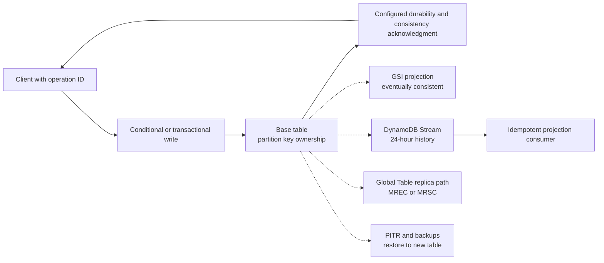

## Working model

DynamoDB is a managed key-value and document database. An item is found by its primary key; an optional sort key places several ordered items under one partition-key value. DynamoDB maps those values across physical partitions, replicates data inside an AWS Region, meters requests in size-based units, and exposes explicit consistency and transaction choices.

The service removes server and storage-engine administration from the application team. It does not remove data modeling, hot-key limits, index maintenance, retry ambiguity, backup restoration, or multi-Region conflict design. The primary skill is translating each operation into a bounded key request before creating the table.

## A table contains items addressed by a primary key

An item is a map of named attributes. Attribute values can be scalar, set, list, or nested map types. The maximum item size is 400 KiB, including attribute names and values. Long field names therefore consume storage and request capacity on every item that repeats them.

A simple primary key contains only a partition key. Its value uniquely identifies the item. A composite primary key contains a partition key and sort key; the pair is unique, and all items sharing the partition-key value form an **item collection** ordered by sort key.

For a conversation service:

```text
PK = TENANT#<tenant_id>#CONVERSATION#<conversation_id>
SK = META

PK = TENANT#<tenant_id>#CONVERSATION#<conversation_id>
SK = MESSAGE#<zero-padded-sequence>
```

`Query` on the partition key can return a bounded sort-key interval such as the newest 50 messages. The same key also places the conversation header and messages together for transaction or batch access. This design works only while one conversation's bytes and traffic fit the stated item-collection and hot-key requirements.

An attribute map that looks like JSON does not make DynamoDB a general document-query engine. `GetItem` needs the full primary key. `Query` needs one partition-key value and can constrain its sort key. Other filters are applied after items are read and consume capacity for the evaluated bytes.

## Start with an access-pattern table

Write each operation before writing item types:

| Operation                          | Key request                                                     |   Result bound | Correctness boundary                          |
| ---------------------------------- | --------------------------------------------------------------- | -------------: | --------------------------------------------- |
| Create conversation                | Conditional put of `META` item                                  |       One item | Operation ID must not already exist           |
| Append message                     | Transaction changes `META` and puts one `MESSAGE`               |      Two items | Expected sequence and version must match      |
| Read history                       | Query one `PK`, descending sort range                           |       50 items | Cursor carries last evaluated key             |
| List tenant's active conversations | Query a global secondary index (GSI) keyed by tenant and status |      100 items | Eventual index lag accepted                   |
| Deduplicate webhook                | Conditional put to an operation item                            |       One item | Provider event ID unique for retention window |
| Expire dedupe record               | Time to Live (TTL) background deletion                          | One item later | Reads must reject logically expired state now |

The table reveals which reads are direct, which need a secondary access path, and which invariants need a condition or transaction. A `Scan` should not be the unspoken answer for a user-facing query.

## The partition key also selects a traffic domain

DynamoDB hashes partition-key values to place data on physical partitions. AWS manages partition creation, movement, and replication. Distinct logical partition-key values can share one physical partition, and the mapping is not an application API.

Capacity limits still appear at physical key ranges and hot items. DynamoDB documentation describes up to 3,000 read capacity units and 1,000 write capacity units per partition under ordinary partition limits. Adaptive capacity can give a hot partition more of the table's available throughput and can isolate a hot item onto its own partition, but it cannot make one item exceed the per-partition maximum.

Request size turns those units into operation rates:

- One write capacity unit (WCU) covers one standard write up to 1 KiB per second.
- One read capacity unit (RCU) covers one strongly consistent read up to 4 KiB per second.
- An eventually consistent read up to 4 KiB consumes half a read unit.
- Transactional reads and writes consume twice the underlying per-item read or write units because of the transaction protocol.

Sizes round up to the unit boundary. A 1,025-byte item costs two write units for one standard write, not 1.001. A query's read units follow item bytes evaluated, not only bytes returned after a filter.

## A hot key is not repaired by table-wide capacity

Suppose one counter item receives 1,500 updates each second and each item is under 1 KiB. Table capacity of 50,000 write units does not let that one item exceed the documented 1,000-WCU partition ceiling. Adaptive capacity can isolate it but cannot split one item across owners.

Options change the data contract:

- shard the counter across `COUNTER#00` through `COUNTER#63`, then sum them for an approximate or delayed read;
- aggregate increments in a stream or queue before writing batches;
- maintain time-window buckets and query several bounded buckets;
- give each event its own item and derive the count;
- preserve one strict counter and accept its serialized throughput limit.

Random key suffixes distribute writes only if reads and invariants can address or combine the shards. “Add a random number” without a read plan creates inaccessible state.

Monotonic sort keys do not necessarily create the same global right-edge hotspot as a range-partitioned B-tree because the partition key is hashed. They can still concentrate all traffic for one partition-key value and affect DynamoDB's split-for-heat behavior. Measure the hottest logical key, not the apparent variety of sort keys.

## Query is a key-range read; filter comes later

`Query` requires one partition-key equality. It can constrain sort keys with equality, inequalities, `BETWEEN`, or prefix conditions and can return ascending or descending order. Results are paginated; the client continues using `LastEvaluatedKey` rather than inventing an offset.

A filter expression removes items after DynamoDB reads them. If a query evaluates 1 MiB of `pending` and `closed` items but returns only 20 `pending` items after filtering, it still consumes read capacity for the evaluated page. A low returned count can hide a costly access path.

`Scan` walks table or index items and can use parallel segments. It is useful for exports, audits, migrations, and bounded background repair when provisioned with its production impact in mind. It is usually the wrong primary path for a latency-sensitive lookup because work grows with stored data rather than result size.

Projection expressions reduce response bytes but do not necessarily reduce read capacity, which is based on item or index entry size evaluated under the documented operation. A narrower GSI projection can reduce index storage and index-query cost because the indexed entries themselves are smaller.

## Composite sort keys encode hierarchy and ranges

Sort keys often concatenate stable components:

```text
MESSAGE#000000000000004817
EVENT#2026-07-18T19:42:17.123Z#01J...
ORDER#PENDING#2026-07-18T19:42:17.123Z#<id>
```

The encoding must preserve desired lexical order. Zero-pad numbers or use fixed-width binary forms. ISO 8601 UTC timestamps sort chronologically when represented consistently. Include a unique tie-breaker so pagination does not skip equal timestamps.

Prefix overloading can colocate several entity types in one table. It reduces network calls when related items share a key and lets one transaction cover them. It also makes data contracts less visible to generic tools and can couple unrelated entities to one hot partition. “Single-table design” is not a goal by itself. Use one table when colocated keys and shared operating policies simplify named access patterns; use separate tables when capacity, backup, AWS Identity and Access Management (IAM), lifecycle, ownership, or deployment boundaries differ.

## Conditions resolve a race on the item

`PutItem`, `UpdateItem`, and `DeleteItem` can include a condition expression. DynamoDB evaluates it against the current item as part of the mutation. This closes read-before-write races for one item.

An optimistic update can require the expected version:

```text
UpdateExpression:
  SET #status = :assigned,
      assignedAgentId = :agent,
      version = version + :one

ConditionExpression:
  version = :expected AND #status = :open
```

Only a caller observing the expected open version succeeds. Another receives `ConditionalCheckFailedException` and can reread or return a conflict. The condition is cheaper and narrower than a multi-item transaction when the invariant lives on one item.

An idempotency record uses `attribute_not_exists(PK)` under a key scoped to the actor and operation. Save the operation result or authoritative record identity so a lost-reply retry can return it. TTL can eventually remove the record, but retention must exceed the maximum retry and replay horizon.

## Transactions coordinate up to a bounded item set

`TransactWriteItems` groups puts, updates, deletes, and condition checks into one all-or-nothing operation. Current documentation allows up to 100 distinct items across tables in the same AWS account and Region. `TransactGetItems` gives an atomic read of its item set.

DynamoDB performs two underlying reads or writes per transacted item, one for preparation and one for commit. Transactions therefore consume twice the ordinary per-item units and are more sensitive to hot items and conflicts.

Serializable isolation applies between transaction operations and individual standard item reads or writes as documented. `Query`, `Scan`, `BatchGetItem`, and `BatchWriteItem` have different unit-level isolation. A nontransactional query can see a mixture around a concurrent multi-item commit. Use `TransactGetItems` when one atomic multi-item view is the product requirement.

For a multi-Region eventual consistency (MREC) global table, a transaction is atomic only in the Region where it runs; another replica can temporarily observe only part of the transaction while its items replicate. Multi-Region strong consistency (MRSC) global tables currently reject `TransactWriteItems` and `TransactGetItems`. Neither mode supplies a cross-Region multi-item transaction. Transactions also do not include messages or external services. An outbox item in the same transaction can record intent for a stream consumer.

## Batch operations are not transactions

`BatchGetItem` and `BatchWriteItem` reduce request round trips for independent item operations. They can return unprocessed keys or items when capacity is insufficient. The client must retry those subsets with bounded exponential backoff and jitter.

One failed item does not roll back the rest of a batch. `BatchWriteItem` does not support the same per-item conditions as an ordinary guarded write. Use a transaction for all-or-nothing state, separate conditional calls for independent invariants, and batch APIs for throughput over independent items.

## Local and global secondary indexes have different ownership

A local secondary index (LSI) shares the base table's partition key and uses a different sort key. It is created with the table, colocates the item collection, and supports strong or eventual reads. For a table with any LSI, all base and LSI entries under one partition-key value form an item collection limited to 10 GiB. An LSI cannot be removed later without replacing the table.

A global secondary index (GSI) has its own partition and optional sort key, its own physical partitions, its own capacity behavior, and an asynchronous projection from the base table. GSI reads are eventually consistent. A GSI can be added or removed later.

Every base-table write that changes indexed attributes can create a GSI write. The GSI key distribution may be much worse than the table's. `status = OPEN` as a GSI partition key concentrates updates behind one low-cardinality value even if base-table tenant keys are even.

If a GSI lacks capacity or has a hot key range, DynamoDB applies backpressure by throttling base-table writes to prevent the index from falling indefinitely behind. The error reason and index ARN identify the indirect cause. Monitor table and every GSI's throttling reason, consumed capacity, key distribution, and online backfill progress separately.

## Sparse indexes omit items without their keys

A GSI contains only base items that have all required index key attributes. This makes a sparse index useful for rare workflow state:

```text
Base item has escalationKey only while escalation is pending.

GSI PK = escalationKey
GSI SK = createdAt#conversationId
```

Removing `escalationKey` removes the GSI entry asynchronously. This avoids indexing every non-escalated item. It also means a temporary projection lag can show an item after authoritative state changed or omit it briefly after creation. A worker must condition the base-table update when claiming work rather than trust the GSI result as current authority.

Projection choices are keys-only, include selected attributes, or all attributes. Larger projections save base fetches for index reads but consume more storage and write units. A GSI query cannot request nonprojected attributes from the base table automatically; the application performs separate gets when needed.

## TTL is delayed physical deletion

Time to Live designates a numeric epoch-seconds attribute. After expiration, DynamoDB deletes the item asynchronously, typically without consuming ordinary delete capacity in the source Region. The item remains readable and billable until the background deletion occurs.

Applications must treat `expiresAt <= now` as logically expired in read and conditional-write paths if immediate expiry matters. A filter can hide expired query results but still consumes read capacity for them. A condition can prevent updating a logically expired lease.

TTL deletions appear in DynamoDB Streams in the Region where the service deletion occurs with service identity metadata. In MREC Global Tables, replicated TTL deletes consume replicated write work, and the service-identity marker is not identical in every replica Region. MRSC Global Tables currently do not support TTL. Retention and archival logic must use the documented Regional behavior.

## DynamoDB Streams is a 24-hour change log

DynamoDB Streams can retain item-level changes for 24 hours and expose keys plus selected old/new images according to stream view type. Records for one item appear in modification order. Shards can split as the table changes, so consumers must follow parent and child shard lineage.

Lambda event-source mappings or adapter-based consumers checkpoint progress and retry batches. Delivery can repeat. A consumer writes its downstream result idempotently using the source event identity or version. Poison records need a bounded retry and failure destination; otherwise one shard can stop behind one event until history expires.

Twenty-four hours is short for an outage or full reprocessing. A derived system needs a rebuild path from a table export, backup, or scan plus a safe cutover to the live stream. Kinesis Data Streams for DynamoDB is a separate change-capture option with longer configurable retention and different consumer limits and cost.

Do not call the stream “exactly once.” The source ordering, consumer checkpoint, and downstream commit are separate boundaries. Design for replay.

## On-demand and provisioned modes change capacity management

Provisioned mode configures read and write capacity with optional auto scaling. On-demand mode manages capacity from observed traffic and charges per request, with documented scaling behavior and optional maximum-throughput controls. Both modes can throttle at a hot key range, table or index maximum, account quota, or rapid traffic change.

On-demand does not mean infinite or unmetered. Provisioned does not mean every partition key gets an equal slice. Inspect the throttling reason returned by current APIs: table versus index, read versus write, key range, configured maximum, provisioned capacity, or account limit. A retry policy cannot repair a sustained hot key.

Capacity math should include item rounding, consistency, transactions, index projections, replicas, backups, and retry traffic. For 8,000 standard writes each second of 1.4 KiB items with two affected GSIs whose projected entries are 600 B and 1.2 KiB:

```text
base table = 8,000 * ceil(1.4 KiB / 1 KiB) = 16,000 WCU
GSI A = 8,000 * ceil(0.6 KiB / 1 KiB) = 8,000 WCU
GSI B = 8,000 * ceil(1.2 KiB / 1 KiB) = 16,000 WCU
total regional write work = 40,000 WCU before retries
```

If the base change uses a transaction, its base-item write cost doubles, and transaction-related index work must be calculated from the documented metering for the actual operation. Test with `ReturnConsumedCapacity = INDEXES` rather than trusting a hand estimate alone.

## Backups restore into another table

On-demand backups capture a table for long-term retention. Point-in-time recovery (PITR) maintains continuous recovery points for a configured window of 1 to 35 days, with per-second restore selection from the available interval. A restore creates a new table; it does not rewind the existing table in place.

The restored table needs configuration review: name and routing, indexes and their state, capacity mode and limits, streams, TTL, tags, IAM conditions, autoscaling, alarms, global replicas, application endpoints, and data after the selected recovery point. Current documentation notes that some resource metadata such as tags is not preserved automatically.

Recovery time includes table restore, index readiness, validation, replay or reconciliation of later valid writes, configuration, and traffic cutover. Test it at representative size and record the restore-table throughput and control-plane duration. PITR availability is not proof of an RTO.

## Global Tables now have two consistency modes

[DS5](../06-distributed-systems/05-consensus-and-replicated-state-machines.md) supplies the authority and quorum model. [DS7](../06-distributed-systems/07-replication-consistency-and-transactions.md) separates item-level consistency from transaction isolation and conflict convergence. Use those histories when comparing the two modes below.

Current DynamoDB Global Tables documentation distinguishes:

- **Multi-Region eventual consistency (MREC):** multi-active writes replicate asynchronously, with conflicts reconciled by the service's last-writer-wins behavior. Cross-Region reads can be stale. This is the default if no mode is specified.
- **Multi-Region strong consistency (MRSC):** writes synchronously replicate under the supported topology before success, and strongly consistent reads on replicas return the latest item version under the documented contract.

The consistency mode is selected when the global table is created and cannot be changed in place. MRSC currently requires exactly three Regions: either three replica Regions or two replicas and one witness. It does not support DynamoDB transaction operations or TTL. Feature availability, supported Region sets, account model, latency, quotas, and failure behavior differ. Check the current service matrix rather than applying older “Global Tables are always eventual” advice or newer MRSC behavior to an MREC table.

MREC fits active-active workloads only when concurrent updates to one item are harmless, prevented by write routing, or modeled for convergence. Last-writer-wins can discard one logically valid concurrent change. Store independent events or route one entity's writes to a home Region when merging fields would violate an invariant.

MRSC provides a stronger item view at cross-Region latency and availability cost. It does not make external services transactional, remove hot-item limits, or turn a multi-item workflow into one global serializable transaction unless the documentation explicitly says so for that operation.



## Worked case: claim and process a tenant job

Assume a job service accepts 30,000 creates each second, lists 100 pending jobs per tenant, lets one worker claim a job, retains terminal jobs for seven days, and sends state changes to analytics. One tenant can generate 15% of traffic.

Primary items distribute by a bucketed tenant-job key rather than tenant alone:

```text
PK = JOB#<hash(job_id) modulo 64>
SK = JOB#<job_id>
```

This spreads creates but cannot list one tenant's pending jobs directly. A sparse GSI supplies that access:

```text
GSI1PK = TENANT#<tenant_id>#PENDING#<bucket>
GSI1SK = <created_at>#<job_id>
```

The client queries all 16 or 64 known buckets in parallel with a global request limit, merges the oldest results, and stops after 100. The bucket count trades read fan-out for write distribution. Start with the smallest number that keeps the hottest tenant and GSI range under measured limits.

A worker never trusts GSI presence as authority because the GSI is eventually consistent. It claims the base item with a condition:

```text
ConditionExpression:
  #state = :pending AND attribute_not_exists(leaseOwner)

UpdateExpression:
  SET #state = :running,
      leaseOwner = :worker,
      leaseEpoch = if_not_exists(leaseEpoch, :zero) + :one,
      leaseExpiresAt = :deadline
  REMOVE GSI1PK, GSI1SK
```

The incremented lease epoch is a fencing token passed to any downstream component that can reject work from an older epoch. TTL alone cannot implement the lease because deletion is delayed. A resumer checks `leaseExpiresAt < now` and conditionally advances the epoch.

At 30,000 1 KiB creates each second, base writes consume about 30,000 regional write units and the sparse pending GSI another 30,000 before status changes, streams, transactions, global replicas, and retries. The largest tenant contributes 4,500 creates each second. Sixteen evenly used buckets average 281 writes/s for that tenant's GSI values; four buckets average 1,125 and can exceed one partition's ordinary write ceiling. Skew inside the tenant still needs measurement.

Failure behavior:

- A create times out after commit: the operation-ID condition returns the existing job on retry.
- A GSI entry lingers after claim: another worker's base-item condition fails safely.
- A worker pauses beyond its lease: a newer epoch fences its late result.
- The stream consumer repeats an event: analytics upserts by job version or event identity.
- The stream consumer is down for more than 24 hours: rebuild from an export or scan and switch to live events at a recorded boundary.
- An MREC Global Table accepts concurrent state changes in two Regions: last-writer-wins may violate the state machine, so route each job's writes to one home Region or use a supported stronger design.

Observe consumed and throttled capacity by table and GSI, throttling reason, latency by operation, conditional failures by cause, item bytes, hottest keys, GSI propagation symptoms, unprocessed batch work, transaction cancellation reasons, stream iterator age, TTL backlog, backup restoration, and global replication latency or strong-mode health.

## Summary

DynamoDB makes a known-key item operation the basic unit. The partition key chooses distribution, the optional sort key creates a bounded ordered collection, and every alternate query requires another explicit access path. Managed placement does not remove per-key limits or deferred index and stream work.

- `GetItem` uses the full key; `Query` uses one partition-key value and an optional sort range. Filters run after read work.
- Capacity rounds item bytes into read or write units. Transactions double per-item operations, and each GSI adds its own write and distribution cost.
- Adaptive capacity can isolate a hot item but cannot raise one item's work beyond the partition maximum. Shard a value only with a read and invariant plan.
- Conditional writes are the default tool for one-item uniqueness, version checks, state transitions, and idempotency.
- Batch APIs retry independent unprocessed items; transactions provide a bounded all-or-nothing item set and different isolation.
- LSIs share the base partition key and impose a 10 GiB item-collection limit. GSIs own separate partitions, update asynchronously, and can backpressure the base table.
- TTL expiry is logical before physical deletion. Streams retain 24 hours and deliver replayable change records, not an unlimited exactly-once queue.
- PITR restores into a new table. Recovery includes configuration, validation, later-write reconciliation, and cutover.
- MREC and MRSC Global Tables have different cross-Region consistency, topology, latency, conflict, and feature contracts. MRSC's current feature limits include no transaction APIs or TTL. Record the selected mode.
- A stale GSI or repeated stream event must not violate authority. Recheck base state with a condition and make downstream application idempotent.

## References

- [DynamoDB core components](https://docs.aws.amazon.com/amazondynamodb/latest/developerguide/HowItWorks.CoreComponents.html): Defines tables, items, attributes, partition keys, sort keys, and secondary indexes.
- [DynamoDB constraints](https://docs.aws.amazon.com/amazondynamodb/latest/developerguide/Constraints.html): Documents item size, key size, expression limits, and LSI item-collection size.
- [DynamoDB partition-key design](https://docs.aws.amazon.com/amazondynamodb/latest/developerguide/bp-partition-key-design.html): Connects key distribution to per-partition read and write limits.
- [DynamoDB adaptive capacity](https://docs.aws.amazon.com/amazondynamodb/latest/developerguide/burst-adaptive-capacity.html): Explains burst capacity, hot partitions, item isolation, and split behavior.
- [DynamoDB read and write operations](https://docs.aws.amazon.com/amazondynamodb/latest/developerguide/read-write-operations.html): Defines size rounding and capacity units for standard, eventual, strong, and transactional operations.
- [DynamoDB Query](https://docs.aws.amazon.com/amazondynamodb/latest/developerguide/Query.html): Defines partition equality, sort conditions, filtering, pagination, and capacity behavior.
- [DynamoDB Scan](https://docs.aws.amazon.com/amazondynamodb/latest/developerguide/Scan.html): Documents sequential and parallel scans, filters, capacity, and pagination.
- [DynamoDB condition expressions](https://docs.aws.amazon.com/amazondynamodb/latest/developerguide/Expressions.ConditionExpressions.html): Defines guarded put, update, and delete operations.
- [DynamoDB transactions](https://docs.aws.amazon.com/amazondynamodb/latest/developerguide/transactions.html): Covers transaction APIs, item limits, underlying operations, conflicts, idempotency, and isolation.
- [DynamoDB batch operations and error handling](https://docs.aws.amazon.com/amazondynamodb/latest/developerguide/ErrorHandling.html#Programming.Errors.BatchOperations): Explains unprocessed items and bounded retry.
- [DynamoDB local secondary indexes](https://docs.aws.amazon.com/amazondynamodb/latest/developerguide/LSI.html): Defines shared partition keys, consistency, item collections, creation, and 10 GiB limits.
- [DynamoDB global secondary indexes](https://docs.aws.amazon.com/amazondynamodb/latest/developerguide/GSI.html): Defines independent keys, projections, capacity, eventual propagation, backfill, and query behavior.
- [DynamoDB GSI backpressure](https://docs.aws.amazon.com/amazondynamodb/latest/developerguide/gsi-throttling.html): Maps index capacity and hot-range failures to base-table throttling reasons.
- [DynamoDB Time to Live](https://docs.aws.amazon.com/amazondynamodb/latest/developerguide/TTL.html): Documents asynchronous expiry, read visibility, cost, streams, and Global Tables behavior.
- [DynamoDB Streams](https://docs.aws.amazon.com/amazondynamodb/latest/developerguide/Streams.html): Defines 24-hour records, image modes, ordering, shards, and consumers.
- [Change data capture choices for DynamoDB](https://docs.aws.amazon.com/amazondynamodb/latest/developerguide/streamsmain.html): Compares DynamoDB Streams with Kinesis Data Streams for retention, consumers, and throughput.
- [DynamoDB on-demand capacity](https://docs.aws.amazon.com/amazondynamodb/latest/developerguide/on-demand-capacity-mode.html): Documents request pricing, scaling, maximums, and throttling considerations.
- [DynamoDB throttling diagnosis](https://docs.aws.amazon.com/amazondynamodb/latest/developerguide/throttling-diagnosing-workflow.html): Maps current throttling reasons to table, index, key-range, configured, and account boundaries.
- [DynamoDB backup and restore](https://docs.aws.amazon.com/amazondynamodb/latest/developerguide/Backup-and-Restore.html): Defines on-demand backups, PITR windows, new-table restore, encryption, and configuration caveats.
- [DynamoDB Global Tables](https://docs.aws.amazon.com/amazondynamodb/latest/developerguide/GlobalTables.html): Defines current MREC and MRSC consistency modes, account models, replication, and mode immutability.
- [DynamoDB Global Tables consistency modes](https://docs.aws.amazon.com/amazondynamodb/latest/developerguide/global-tables-consistency-modes.html): Compares regional behavior, topology, reads, writes, transactions, and failure semantics.
