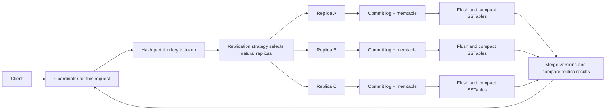

## Working model

Apache Cassandra is a distributed wide-column database. A Cassandra Query Language (CQL) partition is its main unit of placement, replica ownership, and bounded local access. The partition key is hashed into a token; a replication strategy maps that token to natural replicas; any node can coordinate the request; and each replica stores mutations in a local log-structured merge (LSM) engine.

That sentence joins several mechanisms that must be reasoned about separately:

- **Data modeling** decides which rows share a partition and how rows are ordered inside it.
- **Partitioning** maps a partition key to token ranges and physical owners.
- **Replication** places copies across declared datacenters and racks.
- **Coordination** sends one request to the replicas and applies a response threshold.
- **Local storage** records a mutation in a commit log and memtable, then flushes immutable SSTables.
- **Reconciliation** selects current cell values from timestamped versions and tombstones.
- **Maintenance** compacts files, repairs replicas, and streams ranges during topology changes.

A low-latency write does not remove work. It moves file rewriting, replica comparison, and range movement out of the request path. A Cassandra deployment stays healthy only while flush, compaction, repair, and streaming can finish without consuming the resources reserved for foreground reads and writes.

[DB2: Storage engine primitives](02-storage-engine-primitives.md) derives WAL, memtable, SSTable, Bloom-filter, tombstone, and amplification concepts without tying them to one product. [DS6: Partitioning, DHTs, and key-value stores](../06-distributed-systems/06-partitioning-dhts-and-key-value-stores.md) derives consistent hashing, quorum intersection, CAP, and current Cassandra placement. This note applies those foundations to Cassandra's data and operating paths.

## Cassandra combines a distributed replica set with one LSM engine per replica

A Cassandra **cluster** contains peer nodes. There is no permanent leader for ordinary reads and writes, and any node can receive a client request. The receiving node is the **coordinator** for that request. It consults cluster metadata, finds the replicas for the requested partition, forwards work, collects enough qualifying responses for the requested consistency level, reconciles read results when needed, and returns to the client.

A **keyspace** is the top-level namespace and carries a replication strategy. A **table** has typed columns and a CQL primary key. A **partition** is all rows that share one partition-key value. A **row** is uniquely identified by the complete primary key: partition key plus any clustering columns. A **cell** is a non-primary-key column value with timestamp and deletion or TTL metadata.

The term **wide-column** describes rows grouped and sorted inside partitions. It does not mean analytical columnar storage. Cassandra SSTables keep partitions in token order and rows within a partition in clustering order. ClickHouse, by contrast, stores analytical columns separately so a scan can read selected columns across many records. The shared word “column” describes different physical decisions.

Three paths run at once:



The consistency level changes the coordinator's response threshold. It does not change which nodes are natural replicas, which partition owns the data, or whether background repair remains necessary.

## The token ring maps partition hashes to ownership

Cassandra's default Murmur3 partitioner hashes the encoded partition key into a signed 64-bit token. Token order is commonly drawn as a ring because the maximum value wraps to the minimum. If a node owns token `T`, it owns the interval from the preceding token, exclusive, through `T`, inclusive: `(previous, T]`. A partition belongs to the node whose owned interval contains its token.

The ring is placement metadata, not a network route. A coordinator does not forward a request hop by hop around the ring as Chord would. Cassandra nodes maintain token-to-endpoint metadata and can send directly to the selected replicas. Drivers also maintain topology and token metadata so a token-aware policy can choose a replica as coordinator and avoid one extra network hop.

Hashing has two effects:

- many unrelated partition keys tend to spread across token space;
- business order disappears, so token adjacency does not preserve tenant, timestamp, or lexical order.

A global time-range query therefore cannot walk adjacent tokens and find adjacent timestamps. The table must encode the time bound into a known partition key, use an index with its own distributed access path, or accept a range scan across token ownership.

### Virtual nodes split one physical node into several owners

A physical node usually owns several tokens, called **virtual nodes** or **vnodes**. Each token gives the node another interval on the ring. Several smaller intervals can balance bytes and make a joining node receive ranges from several peers instead of moving one large contiguous interval from one peer.

Vnodes add costs as well as movement granularity:

- more tokens create more ownership metadata;
- bootstrap, repair, and streaming may involve more range fragments and peers;
- random token allocation can need many vnodes for acceptable balance;
- topology operations become harder to reason about than one explicit range per host.

Modern Cassandra can allocate a smaller number of tokens using existing keyspace load as an input. Token count and allocator choice are deployment decisions, not a universal constant. Older guidance often repeats a default of 256 random vnodes; current operators should check their Cassandra version, allocator, replication topology, and repair tooling before copying that value.

Vnodes do not split a hot partition. Every write for one partition key still targets one natural replica set. Adding nodes can spread many partitions, but it cannot distribute one celebrity account, one unbucketed tenant, or one lifetime device history. That problem belongs in the partition-key design.

## Replication strategy turns primary ownership into natural replicas

The **replication factor** (RF) says how many full replicas a keyspace keeps in a declared scope. The replication strategy maps each token to its **natural replicas**, meaning the nodes that are supposed to hold that token's data.

Production keyspaces normally use `NetworkTopologyStrategy` and set RF separately for each datacenter:

```sql
CREATE KEYSPACE telemetry
WITH replication = {
  'class': 'NetworkTopologyStrategy',
  'us_west': 3,
  'us_east': 3
};
```

For each datacenter, `NetworkTopologyStrategy` walks token ownership and tries to place replicas across distinct racks before reusing a rack. A **snitch** tells Cassandra which datacenter and rack each node belongs to. Rack labels must match real correlated failure domains. Renaming three hosts as three racks does not protect them if one switch, power feed, or zone can still remove all three.

`SimpleStrategy` walks the ring without datacenter-aware placement. It is suitable for basic single-datacenter experimentation, not a production topology that depends on rack or datacenter separation.

RF is not a backup. Replicas can share a software bug, bad delete, operator command, or corrupted application mutation. Backups and restore tests cover histories that live replication faithfully copies.

Natural replicas also differ from coordinators. A non-replica can coordinate a request and hold no durable copy of the partition. A replica can coordinate its own local request. Token-aware clients reduce coordinator forwarding, but correctness cannot depend on always selecting a replica because topology changes and stale client metadata exist.

## Design one table from one bounded access pattern

Cassandra modeling starts with the reads and writes the application must execute. General joins and arbitrary predicates are not the normal path. Data needed together is often duplicated into separate query-specific tables, with each table choosing a partition and clustering order that makes its query bounded.

Consider a service that reads a device's events for one day, newest first:

```sql
CREATE TABLE events_by_device_day (
  tenant_id uuid,
  device_id uuid,
  day date,
  event_time timestamp,
  event_id timeuuid,
  event_type text,
  payload blob,
  PRIMARY KEY ((tenant_id, device_id, day), event_time, event_id)
) WITH CLUSTERING ORDER BY (event_time DESC, event_id DESC);
```

The double parentheses make `(tenant_id, device_id, day)` a composite partition key. Cassandra hashes those three values together. All rows for one device-day land on the same natural replica set. `event_time` and `event_id` are clustering columns; together they order and uniquely identify rows inside the partition.

The intended query supplies the complete partition key and a contiguous clustering range:

```sql
SELECT event_time, event_id, event_type, payload
FROM events_by_device_day
WHERE tenant_id = ?
  AND device_id = ?
  AND day = ?
  AND event_time >= ?
  AND event_time < ?
LIMIT 500;
```

The schema makes these tradeoffs explicit:

- one day bounds partition growth, but a 30-day read fans out to 30 partitions;
- descending clustering makes newest-first reads follow on-storage order;
- `event_id` prevents two events at the same timestamp from becoming one CQL row;
- adding a lookup by `event_type` requires another table, a suitable Storage-Attached Index, or a scan whose cost is accepted and bounded;
- duplicated tables need an application or pipeline that writes, retries, and repairs every projection.

### Partition size is a rate calculation

“Avoid large partitions” is incomplete. Estimate rows, encoded bytes, write rate, read slice, and lifetime:

```text
rows per partition = peak rows/second for the key * bucket seconds
logical bytes per partition = rows per partition * measured mean encoded row bytes
partition write rate = writes/second for the key
read slice = rows and bytes touched by the largest permitted query
```

The same 200 MiB partition can behave differently if it contains 200 large immutable rows, ten million tiny rows, or millions of tombstones. A partition can be modest in bytes and still be hot enough to saturate its three replicas. A tiny hourly bucket can spread storage but force a long history query to contact thousands of partitions.

The application contract should name maximum bucket count per request, pagination, retention, late-arrival behavior, and the consequence of one missing projection. Cassandra's syntax cannot infer those bounds.

### Denormalization moves joins into write and repair paths

Suppose an event must be found both by device and by incident. Two tables may store the same event under different partition keys. Cassandra does not make ordinary independent writes to those partitions one atomic cross-partition transaction. The application can write both idempotently, record a durable outbox for the second projection, or build the projection from CDC. A reconciliation job must be able to detect and fill a missing copy.

The duplicated bytes are often acceptable because reads avoid a distributed join. The new cost is operational: every mutation, TTL, schema change, backfill, and delete must have a defined path through every projection.

## An ordinary write performs no read-before-write lookup

For an ordinary `INSERT`, `UPDATE`, or `DELETE`, the coordinator sends the timestamped mutation to all natural replicas. The selected write consistency level controls how many qualifying acknowledgements it waits for. It does not reduce the fanout to one replica.

At each replica, the local write path is:

1. Append the mutation to a shared, segmented **commit log**.
2. Apply the mutation to the table's mutable in-memory **memtable**.
3. Return the replica acknowledgement under the configured commit-log synchronization policy.
4. Freeze and flush the memtable when memory, commit-log, or operator thresholds require it.
5. Write a new immutable **SSTable** plus its indexes, filters, metadata, and checksums.
6. Reclaim a commit-log segment only after every table mutation covered by that segment is represented in flushed SSTables.

The commit log is shared across tables, while memtables and SSTables are table-specific. One old commit-log segment can contain mutations from several tables. If one low-traffic table has unflushed mutations in that segment, Cassandra may flush it so the segment can be recycled.

Commit-log append is not identical to durable media flush. Cassandra supports periodic and batch synchronization policies. Under periodic synchronization, an acknowledgement can precede the next `fsync`, so a process or machine failure can lose acknowledged local mutations in the unsynced window. Batch synchronization waits for the configured commit-log durability action. RF and consistency level multiply local copies; they do not silently strengthen each replica's configured media guarantee. State the required failure model, choose the sync policy for it, and test the actual storage stack.

On restart, Cassandra replays commit-log mutations that were not yet represented in durable SSTables. A commit log protects unflushed local state from the failures its sync policy covers. It does not replace replica repair, backup, or point-in-time recovery.

## SSTables make old and new versions coexist

An SSTable is immutable after publication. A later update writes another timestamped version; it does not seek to the old file and overwrite a row. A delete writes a tombstone. One logical partition can consequently span the active memtable and many SSTables.

Current Cassandra SSTable formats contain several kinds of component files. Exact filenames change by format and release, so diagnose the deployed version rather than memorizing one directory listing. Conceptually, the components include:

| Component                       | Purpose                                                                                |
| ------------------------------- | -------------------------------------------------------------------------------------- |
| Data                            | Encoded partitions and rows, sorted by token and then clustering order                 |
| Partition and row indexes       | Map a partition key and, for wide partitions, clustering blocks to data-file positions |
| Index summary                   | Samples a larger partition index so a lookup can narrow its search with less memory    |
| Bloom filter                    | Rules out SSTables that definitely do not contain a partition key                      |
| Compression metadata            | Maps logical chunks to compressed file offsets and lengths                             |
| Statistics                      | Timestamps, tombstone, TTL, clustering, repair, and compaction metadata                |
| Checksums and table of contents | Detect damaged components and state which files form the SSTable                       |
| Optional SAI files              | Per-SSTable and per-column structures for Storage-Attached Indexes                     |

Cassandra 5.0's Big Trie SSTable format changes the partition and row index components relative to older `Index.db` layouts. The read algorithm still needs a way to narrow partition and row positions, but the concrete files are version-sensitive.

A Bloom filter answers one narrow question: could this SSTable contain the partition key? A negative answer avoids the partition-index and data lookup. A positive answer can be false and requires the lookup. It cannot tell whether a clustering row exists, return the value, or avoid reading an SSTable that really contains another version of the partition. Lower false-positive targets spend more memory and storage.

## A read merges versions locally and then across replicas

For a partition-key read, the coordinator chooses replicas according to topology, latency information, and consistency level. For levels above one, a common path requests full data from one replica and digests from enough others. Matching digests avoid sending duplicate row bodies. A mismatch causes full-data requests so the coordinator can reconcile versions and, depending on table policy, repair stale replicas.

Each replica performs its own merge:

1. Check row and key caches if enabled and applicable.
2. Read the active and pending-flush memtables.
3. Use token bounds, partition metadata, and Bloom filters to select candidate SSTables.
4. Use partition and row indexes to find the relevant blocks.
5. Merge matching cells and tombstones by clustering order and timestamp.
6. Apply TTL expiration, deletion, and query predicates.
7. Return data or a digest to the coordinator.

One logical read can therefore consume memory, CPU, decompression, several file reads, and coordinator reconciliation. The number of SSTables that overlap one partition is a direct form of read amplification. Compaction strategy, pending compaction debt, cache state, tombstone density, partition width, and the clustering slice all affect tail latency.

### Caches and secondary indexes cannot fix an unbounded access pattern

The key cache can skip part of an SSTable index lookup, but it does not store row values. The row cache can serve row data but has invalidation, memory, and workload-shape costs; it is not a substitute for the operating-system page cache or a well-bounded partition query.

Storage-Attached Indexing (SAI) integrates indexes with memtables and SSTables. Mutations update the current memtable index; flush and compaction produce corresponding on-storage index components. At read time, SAI finds candidate primary keys, then Cassandra fetches and post-filters the base rows so tombstones and non-indexed predicates are honored.

An index adds a distributed access path. It can make a selective predicate practical, but it does not make a fleet-wide low-selectivity filter free. Index memory contributes to memtable pressure, more indexed columns can trigger smaller and more frequent flushes, and the base data still follows partition ownership. Begin with a query-specific partition key when the access pattern is stable; use SAI when its selectivity, fanout, and maintenance costs fit the measured workload.

## Consistency level is a threshold and scope

For RF `N`, define:

```text
quorum(N) = floor(N / 2) + 1
```

With RF 3, quorum is 2. With RF 5, quorum is 3. Cassandra exposes named consistency levels rather than raw `R` and `W` values:

| Consistency level     | Threshold and scope                                                                         |
| --------------------- | ------------------------------------------------------------------------------------------- |
| `ONE`, `TWO`, `THREE` | That many replica responses                                                                 |
| `QUORUM`              | A majority across the keyspace's total replicas                                             |
| `LOCAL_ONE`           | One replica in the coordinator's local datacenter                                           |
| `LOCAL_QUORUM`        | A majority of replicas in the coordinator's local datacenter                                |
| `EACH_QUORUM`         | A majority in every replicated datacenter                                                   |
| `ALL`                 | Every natural replica                                                                       |
| `ANY`                 | Write only: one natural-replica acknowledgement or a durable hint stored by the coordinator |

In a two-datacenter keyspace with RF 3 in each datacenter:

```text
total replicas = 3 + 3 = 6
QUORUM threshold = floor(6 / 2) + 1 = 4
LOCAL_QUORUM threshold = floor(3 / 2) + 1 = 2 in the local datacenter
EACH_QUORUM threshold = 2 in us_west and 2 in us_east
```

`LOCAL_QUORUM` keeps normal request latency within one datacenter while Cassandra still forwards ordinary writes to all six natural replicas. Remote failures can leave the far datacenter behind without blocking the local response, so hints and repair must close that gap.

For one replica scope, write threshold `W` and read threshold `R` intersect when:

```text
W + R > N
```

With RF 3 and quorum writes plus quorum reads, `2 + 2 > 3`, so every qualifying read set overlaps every acknowledged write set in at least one replica. That intersection helps the read encounter the acknowledged mutation. It does not by itself create linearizability:

- ordinary writes can race through different coordinators;
- timestamps, including client-supplied timestamps, decide conflicts;
- a timed-out write can still exist on one or more replicas;
- a later read at `ONE` can select a stale replica;
- no one ordinary-write leader serializes concurrent commands;
- a multi-partition invariant has no transaction-wide ordering protocol.

[DS6: Partitioning, DHTs, and key-value stores](../06-distributed-systems/06-partitioning-dhts-and-key-value-stores.md) works the client-visible histories behind these claims. Consistency level describes which responses permit one operation to return, not a complete consistency model.

### Timeouts leave the outcome unknown

Suppose a coordinator sends an RF 3 write at `LOCAL_QUORUM`. Replica A acknowledges, replica B applies the mutation after the client timeout, and replica C is unavailable. The client sees a timeout, but the mutation may later be visible at quorum. A timeout is missing evidence, not a rollback.

Retries should carry the same logical operation identity and timestamp policy. Replaying an ordinary assignment with the same timestamp is often naturally convergent. Replaying a non-idempotent application command, a counter update, or a new client timestamp can create a different outcome. Drivers classify idempotent statements because speculative execution and retry safety depend on that declaration.

## Cassandra hints are not Dynamo sloppy quorum

The original Dynamo paper describes **sloppy quorum**: during failures, a coordinator can walk beyond the first `N` preferred owners and store a replica on another healthy node. That temporary holder counts toward Dynamo's response set and later hands the data to the intended owner through hinted handoff.

Ordinary Cassandra writes take a different path:

- the mutation is addressed to the partition's natural replicas;
- an arbitrary healthy non-owner does not become a temporary full replica merely to satisfy `ONE`, `QUORUM`, or `ALL`;
- if a target replica is unavailable or times out, the coordinator can store a local hint naming that target;
- the hint is replayed when the target returns within the configured window;
- except at write-only `ANY`, storing a hint does not count as a natural-replica acknowledgement for the consistency level.

At `ANY`, a coordinator may acknowledge after persisting a hint even when no natural replica has accepted the mutation. No `ANY` read exists, and the value may be unreadable until hint delivery. This is a narrow availability choice, not evidence that the data already has RF copies.

Hints preserve the original mutation timestamp, making replay compatible with later versions. They are still best effort. A target can remain down beyond the hint window, the coordinator holding the hint can fail, delivery can be disabled or throttled, and topology can change. Hints reduce how long replicas differ; scheduled anti-entropy repair is the mechanism that finds divergence no hint or read happened to fix.

## Read repair and anti-entropy repair cover different sets

**Read repair** begins with a client read. When replicas involved at the requested read level return different digests, the coordinator fetches full versions, reconciles them, and can write the current data to stale participants. It repairs only the rows and replicas touched by that read.

Current Cassandra tables default to blocking read repair. The read waits for enough repair writes to meet the read's consistency requirement. This supports **monotonic quorum reads** in covered cases: a quorum read should not expose a value and a later quorum read go backward merely because a failed write reached only a minority.

The table option exposes a less obvious tradeoff:

- `read_repair = 'BLOCKING'` supplies the documented monotonic-quorum-read behavior, but a read of only one clustering row can repair only that row from a prior multi-row partition write and expose a partial repair.
- `read_repair = 'NONE'` lets the coordinator reconcile the response without writing it back, preserving Cassandra's partition-level write-atomicity behavior for that case, but not the monotonic-quorum-read property.

A read at `ONE` or `LOCAL_ONE` is satisfied by the direct data response and normally has no digest comparison, so it does not discover replica disagreement through this path.

**Anti-entropy repair** scans ownership ranges independently of application reads. Replicas build hierarchical hashes, commonly called Merkle trees, for common token ranges. Matching tree branches need no row transfer; mismatching branches identify ranges whose data must be streamed and reconciled. The comparison avoids sending every value merely to discover equality, though coarse tree leaves can stream more data than the exact divergent rows.

Cassandra exposes full and incremental repair:

- a full repair considers all data in the selected ranges;
- an incremental repair separates data written since earlier incremental repair and marks resulting SSTables as repaired;
- occasional full repair still matters because repaired status does not prove freedom from later corruption, data loss, operator error, or a software defect.

Repair is resource-intensive and is not a free automatic background promise. It consumes disk reads, hashing CPU, network, streaming writes, compaction work, and temporary storage. A repair schedule must finish every required range before the tombstone safety deadline, while leaving capacity for normal traffic and node recovery. “Run repair weekly” is only a starting guess; prove completion time from the actual data size, topology, mutation rate, and failure budget.

## Timestamps choose winners, including bad winners

Cassandra assigns a timestamp to each mutation, either supplied by the client or generated at the coordinator. Reconciliation applies last-write-wins rules at cell granularity. Two replicas can receive concurrent versions in different orders and still converge when they compare the same timestamps and tie-breaking rules.

Arrival order is therefore not business order. Consider:

```text
10:00:05 coordinator A writes status = paid with timestamp 1,000,000
10:00:06 coordinator B writes status = pending with timestamp 900,000
```

Even though `pending` arrived later, `paid` has the larger mutation timestamp and remains the winner. Clock skew can reverse an intended workflow. A client-supplied timestamp far in the future can shadow valid updates until wall-clock time passes it. Time synchronization, timestamp ownership, and alerting on clock offsets are data-correctness controls.

Last-write-wins converges replicas but does not validate a state transition. If `paid` must never return to `pending`, enforce that invariant with a conditional operation, a single serialized application authority, or another model that records transitions rather than blind assignments. [DB4: Transactions, concurrency, and recovery](04-transactions-concurrency-and-recovery.md) separates conflict convergence from legal transaction histories.

## Tombstones preserve absence until replicas can agree

An SSTable is immutable, so Cassandra cannot delete every old copy in place. A `DELETE` writes a timestamped **tombstone** that shadows earlier values. Expired TTL data also becomes deletion state. Reads suppress values older than the winning tombstone.

A tombstone must remain long enough for every replica that might hold the old value to learn the delete. The table option `gc_grace_seconds` defines a grace interval before the tombstone becomes eligible for removal. The current documented default is ten days, but a table should use a value derived from its repair and outage policy rather than treating the default as a law.

Expiry of the grace interval does not immediately erase bytes. Compaction can purge a tombstone only when it is old enough and the compaction has enough overlapping history to prove that no older value in an unexamined SSTable remains shadowed. Repaired and unrepaired SSTable separation can add another safety condition. Snapshots and backups have their own retention paths.

The unsafe sequence is:

1. Replicas A and B receive a tombstone; C is down and still holds the old value.
2. Hints do not reach C, and repair does not cover the range.
3. Grace expires and compaction safely removes the tombstone from the files it can see on A and B.
4. C returns with the old timestamped value.
5. A later read or repair sees no surviving delete marker and copies the old value back.

This is **resurrection** or a **zombie**. Setting a short grace interval to remove tombstones faster spends the repair deadline. Safe settings require:

```text
maximum completed repair interval
+ worst repair delay or retry
+ longest permitted replica outage before replacement
< gc_grace_seconds
```

That inequality is a policy sketch, not a product formula. Replacement and rebuild also have hint-window and repair conditions. Monitor the age and coverage of successful repair rather than only whether a repair command started.

TTL-heavy tables need aligned data lifetimes. Mixing non-TTL data, many TTL lengths, and late old writes in the same SSTables can prevent whole-file expiry and leave compaction to examine many tombstones. TTL controls read visibility at expiration; it does not promise immediate disk reclamation.

## Compaction pays the merge cost

Compaction reads selected immutable SSTables, merges versions by key and timestamp, writes replacement SSTables, publishes them, and removes old inputs after in-flight readers release them. It reduces the number of versions and files a read must inspect and can reclaim obsolete values and eligible tombstones.

Every strategy balances three amplification measures:

- **Read amplification:** SSTables, blocks, rows, and bytes examined per logical result.
- **Write amplification:** commit-log, flush, compaction, index, replication, and storage bytes written per logical mutation. State which layers the ratio includes.
- **Space amplification:** live plus obsolete data and temporary outputs divided by current live logical bytes.

No strategy removes the merge. It chooses when, with which files, and into which layout the merge occurs.

| Strategy                                   | Selection and layout                                                                                                 | Favors                                                                         | Main cost and failure mode                                                                                                          |
| ------------------------------------------ | -------------------------------------------------------------------------------------------------------------------- | ------------------------------------------------------------------------------ | ----------------------------------------------------------------------------------------------------------------------------------- |
| **Size-Tiered Compaction Strategy (STCS)** | Groups a threshold of similarly sized SSTables into larger files                                                     | High write rates where lower rewrite cost matters                              | Versions can remain across many overlapping size tiers, increasing read amplification; tombstone removal timing is less predictable |
| **Leveled Compaction Strategy (LCS)**      | Places data into levels; beyond level zero, SSTables within a level do not overlap by token range                    | Read-heavy or update-heavy tables needing fewer candidate files per point read | More rewriting, compaction I/O, and write amplification; level-zero backlog can raise read latency and stall writes                 |
| **Time-Window Compaction Strategy (TWCS)** | Groups flushes into time windows; the active window compacts internally while old immutable windows stop merging     | Mostly immutable, TTL-based time series with aligned lifetimes                 | Late writes reopen old periods; mixed TTLs and updates keep old files alive; broad reads still touch many windows                   |
| **Unified Compaction Strategy (UCS)**      | Uses density-based levels, configurable tiered or leveled behavior, and token-range sharding for parallel compaction | The current Cassandra 5.0 starting point for most new workloads                | Parameters still trade read against write amplification; compaction must have enough disk, CPU, and I/O to keep up                  |

### STCS and LCS expose opposite debts

Size-Tiered Compaction Strategy commonly starts a merge when it finds four similarly sized SSTables under its default threshold. The outputs become successively larger. Foreground writes pay fewer repeated rewrites than a strongly leveled layout, but a partition can have versions in several files from several tiers. Bloom filters remove definite misses, not files that truly contain an older version.

Leveled Compaction Strategy organizes SSTables into levels with growing capacity. Level zero accepts flushed SSTables and can overlap freely. Beyond it, token ranges within one level do not overlap, so a point partition normally has at most one candidate SSTable per such level. The read benefit is purchased by copying data through levels. If level-zero input arrives faster than compaction drains it, overlapping files accumulate and writes may be throttled or stopped to bound the debt.

### TWCS requires time-local writes

Time-Window Compaction Strategy uses size-tiered compaction within a current time window and keeps finished windows separate. When every value in an old SSTable has expired, Cassandra can often drop the entire file after safety checks instead of rewriting live data merely to remove expired rows.

This works when writes arrive close to their event time, old data is rarely updated, and TTLs align. A late mutation for a month-old event can share a memtable and flushed SSTable with current data. A read repair of old data can cause the same mixture; anti-entropy repair streams data through a different path and current documentation recommends running it frequently. Mixed-age SSTables block simple expiry. Route late corrections through a bounded policy and use the documented repair and compaction procedures for TWCS rather than assuming file timestamps equal event timestamps.

### UCS makes the tradeoff a parameter

Unified Compaction Strategy is recommended by current Cassandra documentation for most new workloads. It groups SSTables by density, meaning bytes relative to token-range width, and splits output on stable token boundaries. Those boundaries permit independent compactions over non-overlapping shards.

Its scaling parameters can produce tiered behavior with lower write and higher read amplification, leveled behavior with lower read and higher write amplification, or a middle setting. Parameters can change without discarding all useful work already present. This makes UCS a better starting point than choosing a legacy strategy only because a workload is labeled “read heavy” or “time series.” The operator still has to measure SSTables per read, bytes rewritten, temporary space, queue depth, and tail latency.

### Compaction debt becomes foreground backpressure

Assume a node flushes 70 MiB/s of new SSTable data while available compaction service can process only 55 MiB/s in the current layout. Pending input grows by 15 MiB/s:

```text
15 MiB/s * 3,600 s = 54,000 MiB/hour, about 52.7 GiB/hour
500 GiB of usable headroom / 52.7 GiB/hour = about 9.5 hours
```

The node can look healthy for hours while SSTable count, read amplification, and temporary-space demand rise. Increasing a queue or memtable delays the stop; it does not fix a sustained 15 MiB/s deficit. Cassandra may throttle or block writers when flush and compaction cannot bound their queues. That is protective backpressure.

Recovery capacity matters too. A steady state that consumes all storage throughput leaves no room for repair, bootstrap, replacement, or traffic redistribution after a node loss. Capacity tests need sustained ingest through several compaction cycles plus one declared recovery operation.

## Lightweight transactions use Paxos for a conditional decision

Ordinary Cassandra writes do not read the current value and do not establish a serial order. CQL adds **lightweight transactions** (LWT) for conditional changes:

```sql
INSERT INTO device_owner (device_id, owner_id)
VALUES (?, ?)
IF NOT EXISTS;

UPDATE incident_state
SET state = 'closed'
WHERE incident_id = ?
IF state = 'open';
```

The `IF` condition invokes Paxos among the partition's replicas. Replicas promise a ballot, discover any already accepted proposal, accept one proposal, and learn or commit the chosen value according to Cassandra's implementation. Intersecting Paxos quorums prevent two competing values from both being chosen for the same decision. Cassandra documents LWT as a linearizable compare-and-set path in its supported scope.

`SERIAL` and `LOCAL_SERIAL` govern the serial phase's replica scope. The normal consistency level governs the ordinary data phase. A serial read can complete an in-progress Paxos decision before returning. Exact message rounds differ across Cassandra releases and protocol improvements, so measure the deployed version instead of using one memorized “four round trips” claim.

LWT costs more latency, messages, disk work, and contention tracking than an ordinary mutation. Competing operations on one partition serialize through the same Paxos state and can retry under contention. Use it for a narrow invariant such as unique claim, compare-and-set transition, or idempotency record. It does not turn a multi-partition workflow into a serializable SQL transaction. [DB4: Transactions, concurrency, and recovery](04-transactions-concurrency-and-recovery.md) covers the wider transaction boundary.

## Topology changes are ownership transitions plus streaming

Adding or removing a node changes which physical machines are natural replicas for token ranges. The ring picture changes quickly; moving the bytes and proving the new replicas are current takes longer.

### Bootstrap adds a node

A bootstrapping node receives tokens, calculates the ranges it will own under each keyspace's replication strategy, and streams those ranges from current replicas. Writes continue while the movement runs. The node is not fully ready merely because its process started or gossip sees it.

Monitor streaming with `nodetool netstats`, internode throughput, pending compaction, disk headroom, and foreground latency. A source failure during consistent range movement can stop bootstrap because copying from a non-owner could miss data that only the intended source had. Unsafe overrides trade that check for a risk that the new owner begins incomplete.

After a validated range movement, old owners retain data they no longer own as a safety measure. `nodetool cleanup` removes those stale ranges. Run it only after the new ownership is healthy; running it too early discards a recovery copy. Leaving it forever wastes disk and distorts load metrics.

### Decommission removes a live node

Decommission streams a live node's ranges to nodes that will become replicas, updates ownership, and then removes the node. It needs free storage and network capacity on the receivers. A node that is down cannot decommission itself; dead-node removal uses a different procedure and must identify the exact host so the cluster does not retain duplicate identity or ownership metadata.

### Replace and rebuild restore a replica differently

Replacing a failed node associates a new process with the failed node's ownership and streams the needed data. If the failed period plus replacement exceeds hint coverage, current Cassandra guidance requires repair because writes may be missing after streaming.

`nodetool rebuild` streams owned ranges from other nodes, often to populate a new datacenter or reconstruct local data from a selected source datacenter. Rebuild is not a magic restore from cluster metadata; it needs reachable, current source replicas and enough capacity for streaming, compaction, and foreground service.

One-at-a-time topology changes are easier to prove. Concurrent bootstrap, repair, replace, cleanup, and major compaction can all consume the same disk and network budget. An automation should gate the next operation on data ownership, streaming completion, repair state, free space, and application latency rather than a fixed sleep.

## Operator evidence should follow the data path

A green process status does not prove that a partition is current, compacted, or repairable. Inspect signals in the same order as the request path.

### Placement and topology

- token ownership and natural replicas for a sampled partition key;
- datacenter and rack labels versus real failure domains;
- node up/down and joining/leaving/moving state;
- ownership balance in bytes and requests, not token percentage alone;
- streaming peers and incoming or outgoing bytes during topology work.

### Coordinator and network

- coordinator read and write latency separately from local table latency;
- request rate, timeout, failure, and unavailable counts by consistency level;
- internode message queues, dropped messages, and speculative retries;
- per-partition or per-tenant traffic so one hot key is not hidden by node averages.

### Commit log and memtables

- commit-log pending tasks, total size, time waiting for commit, and time waiting for segment allocation;
- memtable on-heap and off-heap bytes, live data, switch count, and pending flushes;
- flush throughput and duration versus incoming mutation bytes;
- garbage-collection pauses and allocator pressure that can stall the write path.

### SSTables, reads, and compaction

- live SSTable count and SSTables touched per read by table;
- Bloom-filter false positives, key-cache hit rate, and row-cache behavior if enabled;
- local read/write latency versus coordinator latency;
- tombstones and live cells scanned per read, partition-size histograms, and warnings;
- pending compaction tasks and bytes, bytes compacted, compaction throughput, and free temporary space;
- write timeouts or stalls that correlate with level-zero growth or flush backlog.

### Convergence and conditional operations

- hints created, queued, delivered, dropped, and age by target;
- last successful repair by range, incremental repaired/unrepaired bytes, pending repair bytes, and failed sessions;
- read-repair activity and digest mismatches;
- CAS prepare, propose, and commit latency; contention histograms; condition-not-met counts;
- clock offset and time-synchronization status on every node and client that supplies timestamps.

Use `nodetool` as one source, not the entire observability system. Cassandra metrics are node-local and need external aggregation. Keep table and consistency-level dimensions, because a cluster-wide average can hide one table whose compaction is behind or one request path that crosses datacenters.

When a value appears wrong, preserve the partition key, complete primary key, mutation timestamps, TTL, tombstones, coordinator, contacted replicas, consistency level, schema, and repair history before running broad repair or compaction. A blind repair can copy the winning bad timestamp everywhere and erase evidence about how divergence began.

## Worked case: split a hot time-series partition without losing the query

Assume one industrial device emits 120 readings per second. A measured encoded row averages 180 bytes before replication, compression, SSTable metadata, indexes, tombstones, and compaction space. The product retains 90 days and reads at most one hour at a time, newest first.

A daily partition would contain:

```text
rows/day = 120 * 86,400 = 10,368,000 rows
logical bytes/day = 10,368,000 * 180 = 1,866,240,000 bytes
logical GiB/day = 1,866,240,000 / 2^30 = about 1.74 GiB
```

The partition is both large and hot: every one of those 120 writes per second targets the same natural replica set. With 90-day retention:

```text
live logical data for one device = 1.74 GiB/day * 90 = about 156.3 GiB
RF 3 replica bytes before overhead = 156.3 * 3 = about 469.0 GiB
```

Compression may lower data-file bytes; commit logs, indexes, obsolete versions, tombstones, compaction outputs, repair streams, snapshots, and filesystem reserve increase physical demand. Capacity planning must measure those factors rather than treat 469 GiB as a final disk number.

Bucket by hour and add four deterministic write shards:

```sql
CREATE TABLE readings_by_device_hour (
  tenant_id uuid,
  device_id uuid,
  bucket_start timestamp,
  shard tinyint,
  event_time timestamp,
  event_id timeuuid,
  value double,
  quality tinyint,
  PRIMARY KEY (
    (tenant_id, device_id, bucket_start, shard),
    event_time,
    event_id
  )
) WITH CLUSTERING ORDER BY (event_time DESC, event_id DESC)
  AND default_time_to_live = 7776000;
```

Choose `shard = stable_hash(event_id) mod 4`. Each shard-hour then receives about 30 writes per second under an even hash:

```text
rows/shard-hour = 120 * 3,600 / 4 = 108,000
logical bytes/shard-hour = 108,000 * 180 = 19,440,000 bytes
logical MiB/shard-hour = 19,440,000 / 2^20 = about 18.5 MiB
```

The one-hour read sends four bounded partition queries in parallel and performs a four-way merge by `(event_time, event_id)`. The shard trades four-way read fanout for smaller partitions and four natural replica sets. A driver must cap parallelism so a request burst does not multiply into an unbounded coordinator fanout.

Use RF 3 in one datacenter and `LOCAL_QUORUM` for both writes and reads:

```text
write acknowledgements W = 2
read responses R = 2
W + R = 4 > RF 3
```

One replica can be unavailable while the operation still reaches local quorum. Ordinary writes still go to all three replicas. The intersection helps a later quorum read encounter an acknowledged version, but timestamp conflict rules still apply and the path is not a linearizable state machine.

At a cluster ingest of 50,000 logical readings per second with RF 3, the coordinators attempt at least:

```text
50,000 logical mutations/s * 3 natural replicas
= 150,000 replica mutation deliveries/s
```

That count excludes retries, hints, read repair, anti-entropy repair, commit-log flushes, SSTable flush, SAI work, and compaction rewriting. Network and disk plans must start with replica fanout, not client request count.

### Choose compaction from mutation timing

The workload is mostly immutable and TTL-based. TWCS can group time-local SSTables and later remove fully expired windows, but only if late readings and repairs do not keep writing old periods. Current Cassandra 5.0 guidance starts new workloads with UCS, including time-series configurations, because its tiered settings and sharding can provide similar behavior with more adjustable amplification.

Run both candidates against the actual distribution:

- 120 writes per second for the hot device plus the fleet distribution;
- 90-day TTL and the real mix of late arrivals;
- hourly four-way reads at expected concurrency;
- one replica outage followed by hint replay and repair;
- bootstrap or rebuild while ingest continues;
- enough time for old data to expire and disk space to be reclaimed.

Accept the design only if compaction and repair complete with bounded queues, the four-way merge meets the tail-latency target, physical bytes match the capacity reserve, and no one device can saturate a replica set. If 30 writes per second per shard is still too hot on the chosen hardware, increase the shard count based on measurement; if most devices emit one reading per minute, do not force every device to pay the hot-device shard fanout.

## Summary

Cassandra composes query-shaped partitions, consistent-hash placement, topology-aware replication, a coordinator threshold, local LSM storage, timestamp reconciliation, and scheduled maintenance.

- A partition key hashes to a token. The ring assigns token ranges; vnodes give one physical node several ranges but do not split one hot partition.
- `NetworkTopologyStrategy` selects natural replicas by datacenter and rack. The coordinator is only the node handling one request and need not own the partition.
- Query-first tables duplicate data so one bounded partition and clustering slice answer a known read. Every duplicated projection needs a retry and reconciliation path.
- An ordinary replica write appends to the commit log and updates a memtable, then later flushes an immutable SSTable. Commit-log sync policy determines the local crash-durability boundary.
- Reads merge memtables and candidate SSTables, then the coordinator reconciles replica responses. Bloom filters avoid definite partition misses; caches and indexes do not make broad scans free.
- Consistency levels count responses in a declared scope. `R + W > N` gives replica-set intersection under its assumptions, not a complete linearizability proof.
- Cassandra hints name unavailable natural replicas. Except for write-only `ANY`, a hint does not replace a replica acknowledgement, and Cassandra does not use Dynamo's sloppy-quorum placement for ordinary writes.
- Blocking read repair fixes data touched by a disagreeing read. Anti-entropy repair compares ownership ranges and streams differences that reads and hints never covered.
- Last-write-wins timestamps produce convergence, not business-order validation. Clock skew and future client timestamps can make the wrong value win.
- Tombstones preserve deletes across divergent replicas. `gc_grace_seconds`, completed repair cadence, maximum outage, and compaction safety form one resurrection-prevention policy.
- STCS, LCS, TWCS, and UCS place the same merge cost differently. Current Cassandra documentation recommends UCS for most new workloads, but every strategy needs measured amplification and enough recovery capacity.
- LWT uses Paxos for a conditional single-partition decision. It costs more and does not create a general multi-partition serializable transaction.
- Bootstrap, decommission, replace, rebuild, repair, cleanup, and compaction all stream or rewrite data. Schedule them against the same disk, network, and free-space budget.

## References

- [Apache Cassandra architecture overview](https://cassandra.apache.org/doc/stable/cassandra/architecture/overview.html): Defines the cluster, keyspace, table, partition, row, CQL, replication, and multi-primary model.
- [Apache Cassandra Dynamo architecture](https://cassandra.apache.org/doc/stable/cassandra/architecture/dynamo.html): Documents consistent hashing, vnodes, natural replicas, topology-aware replication, timestamp reconciliation, consistency levels, and replica synchronization.
- [Apache Cassandra data-modeling introduction](https://cassandra.apache.org/doc/stable/cassandra/developing/data-modeling/intro.html): Explains query-driven schema design, denormalization, partition keys, clustering keys, and partition-size analysis.
- [Apache Cassandra CQL data definition](https://cassandra.apache.org/doc/stable/cassandra/developing/cql/ddl.html): Specifies primary-key syntax, partition localization, clustering order, table options, TTL, Bloom filters, compaction, and `gc_grace_seconds`.
- [Apache Cassandra CQL data manipulation](https://cassandra.apache.org/doc/stable/cassandra/developing/cql/dml.html): Specifies bounded primary-key predicates, clustering ranges, filtering, timestamps, TTL, ordinary upserts, and conditional Paxos operations.
- [Apache Cassandra storage engine](https://cassandra.apache.org/doc/stable/cassandra/architecture/storage-engine.html): Traces commit-log, memtable, flush, SSTable, Bloom-filter, index, checksum, compression, and compaction paths.
- [Apache Cassandra hinted handoff](https://cassandra.apache.org/doc/stable/cassandra/managing/operating/hints.html): Defines hint contents, storage, delivery, retention, timeout behavior, and its best-effort boundary.
- [Apache Cassandra read repair](https://cassandra.apache.org/doc/stable/cassandra/managing/operating/read_repair.html): Explains digest comparison, blocking repair, monotonic quorum reads, partition-level write-atomicity tradeoffs, and consistency-level behavior.
- [Apache Cassandra anti-entropy repair](https://cassandra.apache.org/doc/stable/cassandra/managing/operating/repair.html): Documents Merkle-tree comparison, streaming, full and incremental repair, repaired data, operator scheduling, and the tombstone deadline.
- [Apache Cassandra compaction overview](https://cassandra.apache.org/doc/stable/cassandra/managing/operating/compaction/overview.html): Defines SSTable merging, obsolete-version removal, tombstones, repaired data, and strategy selection.
- [Apache Cassandra Unified Compaction Strategy](https://cassandra.apache.org/doc/stable/cassandra/managing/operating/compaction/ucs.html): Describes UCS density levels, sharding, tiered and leveled parameters, in-place configuration changes, and amplification tradeoffs.
- [Apache Cassandra Size-Tiered Compaction Strategy](https://cassandra.apache.org/doc/stable/cassandra/managing/operating/compaction/stcs.html): Documents similar-size grouping, thresholds, read cost, and tombstone behavior.
- [Apache Cassandra Leveled Compaction Strategy](https://cassandra.apache.org/doc/stable/cassandra/managing/operating/compaction/lcs.html): Documents level overlap rules, point-read candidates, write amplification, and level-zero behavior.
- [Apache Cassandra Time-Window Compaction Strategy](https://cassandra.apache.org/doc/stable/cassandra/managing/operating/compaction/twcs.html): Documents time windows, active-window compaction, TTL use, late-data effects, and expired-SSTable handling.
- [Apache Cassandra tombstones](https://cassandra.apache.org/doc/stable/cassandra/managing/operating/compaction/tombstones.html): Explains deletion markers, grace, TTL expiry, safe purge, zombie resurrection, and repaired-data interaction.
- [Apache Cassandra guarantees](https://cassandra.apache.org/doc/stable/cassandra/architecture/guarantees.html): States eventual consistency, replica durability, partition-level atomicity, and LWT compare-and-set guarantees.
- [Apache Cassandra Storage-Attached Index read and write paths](https://cassandra.apache.org/doc/stable/cassandra/developing/cql/indexing/sai/sai-read-write-paths.html): Traces memtable indexes, SSTable index flush, compaction, token-ordered matching, base-row reads, and post-filtering.
- [Apache Cassandra topology changes](https://cassandra.apache.org/doc/stable/cassandra/managing/operating/topo_changes.html): Covers bootstrap, replace, move, remove, streaming monitoring, repair conditions, and cleanup after range movement.
- [Apache Cassandra `nodetool rebuild`](https://cassandra.apache.org/doc/stable/cassandra/managing/tools/nodetool/rebuild.html): Defines rebuilding owned ranges by streaming from other nodes or a selected datacenter.
- [Apache Cassandra monitoring metrics](https://cassandra.apache.org/doc/stable/cassandra/managing/operating/metrics.html): Lists coordinator, table, commit-log, compaction, repair, streaming, thread-pool, tombstone, and CAS metrics.
- [DeCandia et al.: Dynamo, Amazon's Highly Available Key-value Store](https://www.allthingsdistributed.com/files/amazon-dynamo-sosp2007.pdf): Original description of preference lists, sloppy quorum, hinted handoff, vector clocks, Merkle trees, and consistent-hash partitioning.
- [Lakshman and Malik: Cassandra, A Decentralized Structured Storage System](https://www.cs.cornell.edu/projects/ladis2009/papers/lakshman-ladis2009.pdf): Original Cassandra design paper covering partitioning, replication, membership, local persistence, and the structured data model.
- [Lamport: Paxos Made Simple](https://www.microsoft.com/en-us/research/wp-content/uploads/2014/03/paxos-simple.pdf): Defines the quorum and ballot reasoning behind Paxos safety.
