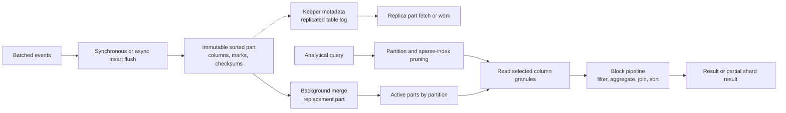

## Working model

ClickHouse is a column-oriented database built for analytical reads over many rows. Its MergeTree family writes batches into immutable sorted data parts, reads only needed columns and granules, and merges parts in the background. Foreground insertion is fast because placement and cleanup work continue after the request.

This makes ClickHouse a strong fit for append-heavy events, metrics, logs, traces, and analytical facts. It is not a drop-in replacement for a row-oriented transactional authority. A primary key in ClickHouse is normally a sparse data-skipping structure and sort prefix, not a uniqueness constraint. Updates, deletes, point lookups, joins, and per-row transactions have different costs and semantics from PostgreSQL or MySQL.

## Columnar layout pays for the columns a query uses

A row store places fields from one row near each other. That is efficient when a request reads or changes most fields for a few rows. A column store places values from one column together. An analytical query that aggregates three columns across a billion rows can avoid reading the other hundred columns.

Adjacent values of one type often compress well. Sorted timestamps have small deltas; low-cardinality strings repeat dictionary values; counters change by predictable amounts. ClickHouse can apply type-aware codecs such as delta encodings and general codecs such as LZ4 or ZSTD per column. Compression reduces storage I/O at a CPU cost.

Columnar storage does not eliminate rows. A data part records the same row order across its column files so the engine can reconstruct selected columns for a row range. Marks and granules provide shared boundaries that let each selected column seek to corresponding blocks.

A wide `SELECT *` discards much of this advantage. Query only required columns and measure compressed bytes read, uncompressed bytes processed, rows processed, CPU, memory, and result bytes.

## MergeTree tables contain immutable sorted parts

An insert into a MergeTree-family table creates one or more data parts. Each part is self-contained, immutable after publication, and sorted lexicographically by the table's sorting key. It contains column data, marks, a sparse primary index, checksums, and metadata needed to read the part.

Background merges select compatible parts in the same partition, merge their already sorted row streams, write a replacement part, and publish it. Old parts remain available to queries that opened them before the replacement and are removed after they are no longer referenced.

This resembles an LSM design in its immutable runs and deferred merges, but ClickHouse MergeTree does not simply follow one universal leveled LSM layout. Part selection, size limits, partition boundaries, engine variant, storage policy, and deployment type determine merge behavior.

The write path therefore has two rates:

- **part creation rate** from synchronous or asynchronous insert flushes;
- **part merge and removal rate** from background maintenance.

If creation stays above consolidation, part count grows. Queries open more files and indexes, Keeper sees more replicated metadata, startup takes longer, and inserts eventually delay or fail under protective part limits. Raising the limit hides the queue without repairing its service rate.

## `ORDER BY` defines physical row order

For a MergeTree table, `ORDER BY` defines the sorting key used inside every part. If `PRIMARY KEY` is omitted, ClickHouse normally uses the sorting key as the primary-key expression. If specified separately, the primary key must be a prefix of the sorting key in ordinary MergeTree use.

The order should follow frequent selective filters and grouping locality. For a multi-tenant trace table:

```sql
CREATE TABLE spans
(
    tenant_id UInt64,
    service LowCardinality(String),
    trace_id FixedString(16),
    span_id FixedString(8),
    started_at DateTime64(6, 'UTC'),
    duration_us UInt64,
    status Enum8('ok' = 1, 'error' = 2),
    attributes Map(String, String)
)
ENGINE = MergeTree
PARTITION BY toYYYYMM(started_at)
ORDER BY (tenant_id, service, started_at, trace_id, span_id);
```

This order groups one tenant and service over time. A query with tenant equality, service equality, and time range can prune and scan a contiguous region. A query filtering only `trace_id` lacks the leading prefix and may inspect many granules unless another structure serves it.

Put low-cardinality but selective-in-context dimensions before the time range when most queries constrain them. Placing nanosecond timestamp first creates global time order but weakens tenant locality. Placing a nearly unique ID first can make time-window filters scan across the whole key space. Validate with real query frequency and `EXPLAIN indexes = 1`, not a universal column-order rule.

## The primary index is sparse

ClickHouse groups rows into granules, commonly about 8,192 rows by default under ordinary settings, though byte limits and configuration can change the exact row count. The primary index stores key values at granule boundaries rather than one entry per row.

For a compatible predicate, the engine searches index marks and eliminates ranges whose ordered key bounds cannot match. It then reads whole candidate granules for selected columns and evaluates the remaining predicate. A point lookup can still read thousands of rows from one granule, so the structure is designed for scan pruning rather than online transaction processing (OLTP)-style one-row seeks.

The sparse index stays small enough to keep in memory even when the fact data is large. Its effectiveness depends on physical correlation between the filter and sort key. If errors are randomly scattered under a key ordered by tenant and time, `status = 'error'` alone cannot prune most granules.

Measure selected parts, selected granules, rows and bytes read, and rows returned. A query returning 10 rows after processing 500 million has a data-skipping problem even if CPU makes it finish acceptably today.

## Partitioning is a lifecycle boundary before it is a query trick

`PARTITION BY` divides a table into independent sets of parts. Parts from different partition values are not merged together. Partition operations can drop, detach, move, freeze, or replace whole sets efficiently, which makes month or day boundaries useful for retention and tiering.

High-cardinality partition keys create directories and part populations that never merge with each other. Partitioning by tenant, user, trace, or exact timestamp can produce thousands or millions of tiny partitions. This increases filesystem metadata, Keeper work, backups, and query planning.

Choose a partition key primarily for data management. Monthly partitions are common for large event tables; daily partitions may fit very high volume or exact-day lifecycle operations. The right boundary keeps each partition at an operable size while keeping total active partition count modest. The sorting key, sparse index, projections, and skipping indexes handle query pruning inside partitions.

## One insert can create several parts

Each synchronous insert creates at least one part per affected table partition. A batch spanning 12 months can create 12 parts even if it is one SQL statement. Materialized views can create additional target parts.

One-row inserts at thousands per second overwhelm metadata and merges. Batch on the client when possible. ClickHouse guidance commonly starts around at least 1,000 rows and often 10,000 to 100,000 rows per synchronous insert, but bytes, latency, schema width, and partitions matter more than one row count.

Asynchronous inserts let the server buffer compatible small writes and flush a larger batch when a size, time, or query-count condition is met. With `wait_for_async_insert = 1`, the client waits for the buffer flush and receives its errors. With wait disabled, acknowledgment can precede durable part creation, so a crash can lose buffered data and flush errors can be hidden from the caller.

ClickHouse 26.3 LTS changed async inserts to be enabled by default and includes newer deduplication behavior. Earlier releases and other deployment types differ. Record the server version and effective user settings rather than treating a current default as timeless.

## Deduplication has several different meanings

Replicated MergeTree insertion can deduplicate retried blocks using insertion identities within a configured history window. This helps when a client retries the same batch after an ambiguous response. It is not a permanent unique constraint across arbitrary writers and transformed batches.

`ReplacingMergeTree` can keep a preferred row among rows sharing a sorting key when parts merge, optionally using a version column. Until the relevant parts merge, duplicates can coexist. `FINAL` applies the replacement rule during a query at added cost. A query using `argMax` over a version can also choose the newest logical value explicitly.

`CollapsingMergeTree`, `VersionedCollapsingMergeTree`, `SummingMergeTree`, and `AggregatingMergeTree` apply other merge-time rules. Their names do not promise immediate final state. Query logic must remain correct while rows exist in several unmerged parts.

For strict event identity, deduplicate before ClickHouse or use an authoritative uniqueness store. Treat ClickHouse insert deduplication as a retry aid under its documented token, window, replication, and materialized-view behavior.

## Merges are deferred write amplification

A merge reads source parts, interleaves rows by sorting key, applies engine-specific replacement, aggregation, TTL, or deletion behavior, compresses new column streams, writes a new part, and later removes old parts. Source and output coexist during publication, so temporary disk usage can exceed steady live size.

Suppose ingestion creates 400 MiB/s of compressed parts and background merges rewrite an average of 2.5 bytes for every inserted compressed byte:

```text
initial part writes = 400 MiB/s
merge rewrites = 2.5 * 400 = 1,000 MiB/s
total table writes = 1,400 MiB/s before replication and temporary metadata
```

If storage sustains only 900 MiB/s for this workload after query reads, merge debt grows around 500 MiB/s, or about 1.72 TiB per hour. More free disk postpones failure; it does not make the system stable.

Observe active parts by partition, new parts per second, merge input and output bytes, queued mutations, disk free space including concurrent source/output, insert delay or rejection, Keeper queues, and foreground query latency. Separate current merge rate from the backlog size.

`OPTIMIZE TABLE ... FINAL` forces larger merge work for a snapshot of parts. It does not repair a source that keeps creating tiny parts too quickly and can produce very large outputs that ordinary merge heuristics will not merge further. Fix insert batching and partition shape first.

## Query execution works in blocks

ClickHouse reads batches of column values and passes blocks through an execution pipeline. Operators filter, transform, aggregate, sort, join, exchange, and serialize blocks. Working on contiguous typed arrays improves CPU cache use and permits vectorized or single-instruction, multiple-data (SIMD)-friendly implementation.

The analyzer and planner build the pipeline. `EXPLAIN` variants can show syntax, query tree, plan, pipeline, and index selection. `system.query_log` records timing, rows, bytes, memory, profile events, exceptions, and query identity after configured log flushing.

Parallelism reduces elapsed time by consuming more CPU, I/O, network, and memory at once. A query reading 2 TiB in 10 seconds is fast only because the cluster delivered roughly 200 GiB/s of compressed input before overhead. Concurrency capacity must price total bytes and operator state, not only per-query latency.

## `PREWHERE` avoids loading later columns for rejected rows

ClickHouse can read a selective predicate column first, evaluate it, and then load other selected columns only for surviving row positions. The `PREWHERE` clause makes this stage explicit, and the optimizer can move suitable filters there automatically.

For a wide log table, reading `tenant_id`, `service`, and `status` first can avoid loading large `body` and `attributes` columns for rejected granules and rows. This is most useful when early columns are small and selective. It cannot avoid reading the predicate columns or whole candidate granules.

Compare column and byte reads in `system.query_log` and trace-level query evidence. A hand-written `PREWHERE` that duplicates optimizer work can be unnecessary; a predicate on a large column can be worse than a small coarse filter.

## Data-skipping indexes summarize granules

Skipping indexes store summaries over blocks or groups of granules. Types include min-max ranges, membership sets, Bloom-filter variants, token Bloom filters, and inverted indexes in current releases. During a query, a compatible predicate can prove that a granule cannot match and skip it.

False-positive structures such as Bloom filters can require reading a granule that ultimately has no match; they must not skip a true match. A min-max index works well when values are locally clustered and poorly when every granule spans almost the whole domain. A set index works only while distinct values per indexed block stay under its configured representation.

Every index consumes storage and insert/merge CPU. Add one only after measuring how many granules it excludes for an important query. `EXPLAIN indexes = 1` and query-log read counts provide that evidence.

## Projections maintain another physical view

A projection stores data under another physical expression or pre-aggregation. It can provide another sort order when one table's main `ORDER BY` cannot serve a second important access pattern. The optimizer can select an eligible projection automatically.

Traditional projections can duplicate selected data. Newer lightweight projections can store projection keys plus `_part_offset` references to base rows under supported releases, trading some base fetches for less duplicate storage. Feature behavior, mutation compatibility, and version support need current documentation.

Projections are maintained with inserted parts and merged in the background. They add write, storage, and merge work. A second table fed by a materialized view may be easier to operate when it needs separate retention, replication, access control, or backfill.

## Incremental materialized views run on inserted blocks

An incremental materialized view executes its query on each newly inserted source block and writes results to a target table. It can parse events, route subsets, or pre-aggregate metrics before query time.

It does not rerun automatically when an old source row changes through later mutation, when a right-hand join table changes, or when historical data existed before the view was created. Backfill and live ingestion need a boundary that prevents gaps and double counting.

Each view adds foreground transformation and target-part creation. Ten small inserts through five views can create dozens of parts across source and targets. Consolidate transformations when possible and monitor per-target part growth.

Refreshable materialized views run a broader query on a schedule and replace or append results under their configured semantics. They serve different workloads from per-insert incremental views.

## Joins consume build-side state

Hash joins commonly build an in-memory structure from one input and probe it with the other. Current ClickHouse releases can reorder eligible joins and provide several algorithms, including methods that spill or use sorted streams. The chosen algorithm, join strictness, data distribution, and version affect the path.

Denormalization moves join work to ingestion and gives each fact row point-in-time dimension values. Runtime joins keep dimensions easier to update but spend query CPU, memory, and network. Dictionaries offer fast one-to-one or many-to-one lookup for selected current-state dimensions with an explicit refresh policy.

Measure build rows and bytes, peak memory, spill bytes, exchanged bytes, dimension freshness, and query concurrency. A join that fits at 2 GiB for one query can exhaust a 64 GiB node when 40 users run it concurrently.

## Updates and deletes rewrite or mask immutable parts

Classic ClickHouse mutations such as `ALTER TABLE ... UPDATE` and `DELETE` schedule background rewrites of affected data parts. They are asynchronous by default in many paths and can produce heavy read, write, and replication work. Frequent single-row updates fight the immutable-part model.

Lightweight deletes mark matching rows so queries filter them; later merges remove their data physically. Lightweight update mechanisms in current product variants similarly use patch parts under documented conditions. Logical disappearance and byte reclamation are separate times.

TTL rules can delete rows, move data to another volume, or apply aggregation when parts merge. Expiration is not necessarily immediate. A compliance requirement needs evidence for query invisibility, replica state, backups, detached parts, object-storage versions, and physical removal.

Model facts as immutable when possible. Represent corrections as new versions or compensating events, then query the correct version with `argMax`, a replacing engine, or a curated table. Keep a row store as authority when high-rate point updates and immediate constraints dominate.

## Replication copies parts within a shard

`ReplicatedMergeTree` variants replicate one table shard across replicas. ClickHouse Keeper or ZooKeeper stores coordination metadata such as logs, part identities, and replica state; data parts live on ClickHouse storage. Replicas can fetch completed parts from peers or perform work according to the replication protocol.

An insert normally targets one replica. Acknowledgment can occur before every replica has the part unless the query uses the documented quorum settings. Async replication therefore creates a window where another replica lacks the latest insert. Quorum insertion can wait for enough replicas, but timeouts can leave an ambiguous outcome and require deduplicated retry and status inspection.

Replication queues expose fetches, merges, mutations, and errors. A replica that falls behind may retain coordination and part history, consume disk, and take long to recover. Compare absolute delay, queue type, oldest task, missing parts, Keeper health, and available network or storage bandwidth.

Keeper coordinates metadata; it is not the data-plane query cache and does not store all table rows. Losing Keeper quorum affects replicated-table coordination and DDL even when local parts still exist.

## Shards divide rows; a Distributed table routes work

Self-managed clusters can divide a logical table into shards, each with replicas. A `Distributed` table stores no ordinary local data of its own; it routes inserts to local tables according to a sharding expression and sends queries to relevant shards, then combines partial results.

A random sharding expression spreads inserts but makes tenant-specific queries contact every shard. Hashing `tenant_id` gives one tenant locality but places a very large tenant on one shard. A composite or pre-bucketed ownership scheme can spread large tenants at the cost of read fan-out.

Distributed aggregation can reduce partial results on each shard before sending them to the initiator. Poor grouping or joins can move large intermediate data over the network. Measure per-shard scanned bytes, skew, remote rows, exchange bytes, initiator memory, and partial failure behavior.

ClickHouse Cloud uses a different SharedMergeTree architecture with shared object storage and decoupled compute. Do not apply self-managed ReplicatedMergeTree failure and scaling assumptions unchanged to Cloud, or vice versa. State the deployment type and version.



## Worked case: 2 million log events per second

Assume 2 million events each second, 700 compressed bytes per event before replication, 30 days hot retention, and 50,000 tenants. The busiest tenant supplies 8% of events. Most queries filter tenant, service, and a time range; a trace lookup by ID is less frequent.

Raw compressed ingest is 1.4 GB/s:

```text
2,000,000 events/s * 700 B = 1.4 GB/s
1.4 GB/s * 86,400 s/day = 121 TB/day
121 TB/day * 30 days = 3.63 PB before replicas and merge headroom
busiest tenant = 160,000 events/s
```

Use monthly or daily partitions based on actual part size and retention operations, not one partition per tenant. Sort by `(tenant_id, service, event_time, trace_id)` so the main query prunes by tenant and service and scans time order. A separate projection or narrow trace-index table can serve trace ID without destroying the main sort order.

At 50,000-row client batches, total ingest produces about 40 insert batches each second if each batch targets one partition. If every agent sends 10 rows independently and there are 10,000 agents, the system receives 10,000 inserts and at least that many new parts per affected partition interval. Server-side async insertion can combine compatible requests, but backpressure and durable acknowledgment still need `wait_for_async_insert = 1`.

Suppose three replicas retain table data and steady merge work writes another 2.2 times initial part bytes:

```text
initial data writes = 1.4 GB/s * 3 replicas = 4.2 GB/s
merge rewrites = 1.4 GB/s * 2.2 * 3 = 9.24 GB/s
cluster table writes = 13.44 GB/s before temp, metadata, and backups
```

The multiplier must come from a steady-state test on the actual sorting, partition, compression, and part-size distribution. A five-minute benchmark before merges catch up is not a capacity result.

A user query for 15 minutes of one busy service should prune all other tenants and services and read only referenced columns. If it reads 900 billion rows to return 40 groups, inspect key order and selected granules before adding CPU. If it selects few granules but uses 100 GiB to join a dimension, fix build state or choose a dictionary/materialized representation.

Failure traces:

- An insert reply is lost after part publication: retry with a stable insertion token inside the deduplication window and inspect accepted part evidence.
- One replica falls behind: route according to freshness policy, repair queue capacity, and do not call local presence cluster durability.
- Part count climbs: reduce insert and partition fan-out, restore merge service rate, and retain protective limits.
- A materialized-view target lags through part pressure: source acceptance is not proof that the downstream aggregate meets freshness.
- A mutation queue grows: stop scheduling point corrections faster than immutable parts can be rewritten and shift to versioned events.
- One shard owns the hot tenant: bucket that tenant with a bounded query fan-out or provision a separate ownership tier.

Observe insert rows and bytes, asynchronous-buffer flush and failures, active and inactive parts, new parts by partition, merge input/output and elapsed time, compression by column, selected parts/granules, query rows and bytes, peak memory and spills, materialized-view target rate, mutation queue, replication delay and errors, Keeper latency, per-shard skew, disk reserve, and restore time.

## Summary

ClickHouse makes analytical scans cheap by storing columns separately, sorting rows within immutable parts, and keeping a sparse primary index over granules. It defers consolidation, replacement, deletion, TTL, and some aggregation to background merges.

- Columnar storage saves I/O when queries select few columns across many rows. `SELECT *` and point-heavy workloads give up much of the benefit.
- `ORDER BY` defines physical order. The sparse primary index prunes granules; it does not enforce uniqueness.
- `PARTITION BY` is a data-management boundary. High-cardinality partitions prevent parts from merging together and create metadata debt.
- Every insert flush creates parts. Batch clients or use async inserts with a durability setting that waits for flush errors.
- Part creation must stay below merge capacity in steady state. `OPTIMIZE FINAL` cannot repair sustained tiny inserts.
- Skipping indexes, projections, and materialized views add maintained structures and write work. Measure granules excluded or query work removed.
- Incremental materialized views process inserted blocks, not arbitrary later changes to every source or joined table.
- Mutations and lightweight deletes separate query visibility from physical reclamation. Frequent point updates are a poor fit for immutable parts.
- Replicas copy one shard; shards divide rows. Keeper coordinates replicated metadata, while Distributed tables route and combine data-plane work.
- Self-managed ReplicatedMergeTree and Cloud SharedMergeTree have different storage and failure boundaries. Name the deployment.
- Size from compressed ingest plus replicas, merges, temporary parts, materialized targets, queries, mutations, and backup headroom.

## References

- [ClickHouse architecture overview](https://clickhouse.com/docs/development/architecture): Maps parsers, interpreters, storage engines, blocks, columns, and distributed execution.
- [ClickHouse MergeTree](https://clickhouse.com/docs/engines/table-engines/mergetree-family/mergetree): Defines parts, partitions, sorting keys, sparse primary keys, granules, TTL, and storage settings.
- [ClickHouse primary indexes](https://clickhouse.com/docs/primary-indexes): Explains marks, granules, in-memory sparse indexes, search, and pruning.
- [ClickHouse choosing a primary key](https://clickhouse.com/docs/best-practices/choosing-a-primary-key): Connects common filters, column order, compression, and sparse-index pruning.
- [ClickHouse choosing a partitioning key](https://clickhouse.com/docs/best-practices/choosing-a-partitioning-key): Describes lifecycle-oriented partitions, cardinality, part merging, and query pruning.
- [ClickHouse asynchronous inserts](https://clickhouse.com/docs/optimize/asynchronous-inserts): Defines server buffering, flush triggers, acknowledgment modes, deduplication, and monitoring.
- [ClickHouse data compression](https://clickhouse.com/docs/data-compression/compression-in-clickhouse): Covers per-column codecs, compression evidence, and codec selection.
- [ClickHouse `PREWHERE`](https://clickhouse.com/docs/optimize/prewhere): Explains staged column loading and optimizer movement of predicates.
- [ClickHouse skipping indexes](https://clickhouse.com/docs/optimize/skipping-indexes): Defines granule summaries, index types, false positives, and evidence.
- [ClickHouse projections](https://clickhouse.com/docs/data-modeling/projections): Documents alternate physical representations, optimizer selection, storage, and lightweight projections.
- [ClickHouse incremental materialized views](https://clickhouse.com/docs/materialized-view/incremental-materialized-view): Defines inserted-block triggers, target tables, joins, and backfills.
- [ClickHouse refreshable materialized views](https://clickhouse.com/docs/materialized-view/refreshable-materialized-view): Contrasts scheduled full-query refresh with incremental insertion.
- [ClickHouse join algorithms](https://clickhouse.com/docs/guides/joining-tables): Covers join order, algorithms, memory, dictionaries, and optimization evidence.
- [ClickHouse updates](https://clickhouse.com/docs/managing-data/update_mutations): Documents mutation-based rewrites and their asynchronous cost.
- [ClickHouse lightweight deletes](https://clickhouse.com/docs/sql-reference/statements/delete): Defines delete masks, query filtering, later merge cleanup, and limitations.
- [ClickHouse replicated tables](https://clickhouse.com/docs/engines/table-engines/mergetree-family/replication): Defines Keeper metadata, replica logs, part transfer, insertion, quorum, and recovery.
- [ClickHouse Keeper](https://clickhouse.com/docs/guides/sre/keeper/clickhouse-keeper): Describes the Raft-based coordination service and operating boundaries.
- [ClickHouse Distributed engine](https://clickhouse.com/docs/engines/table-engines/special/distributed): Defines sharding expressions, insert routing, remote queries, queues, and partial aggregation.
- [ClickHouse system tables](https://clickhouse.com/docs/operations/system-tables): Index to parts, merges, mutations, replication queues, query logs, asynchronous inserts, and metrics.
- [ClickHouse 26.3 LTS release](https://clickhouse.com/blog/clickhouse-release-26-03): Version-specific source for async-insert default and current merge changes; check the deployed release before applying defaults.
- [ClickHouse VLDB 2024 paper](https://clickhouse.com/uploads/Click_House_Schulze_1_c12ecfaed4.pdf): Describes immutable parts, sparse indexes, execution, merging, replication, and distributed architecture from the implementation authors.
