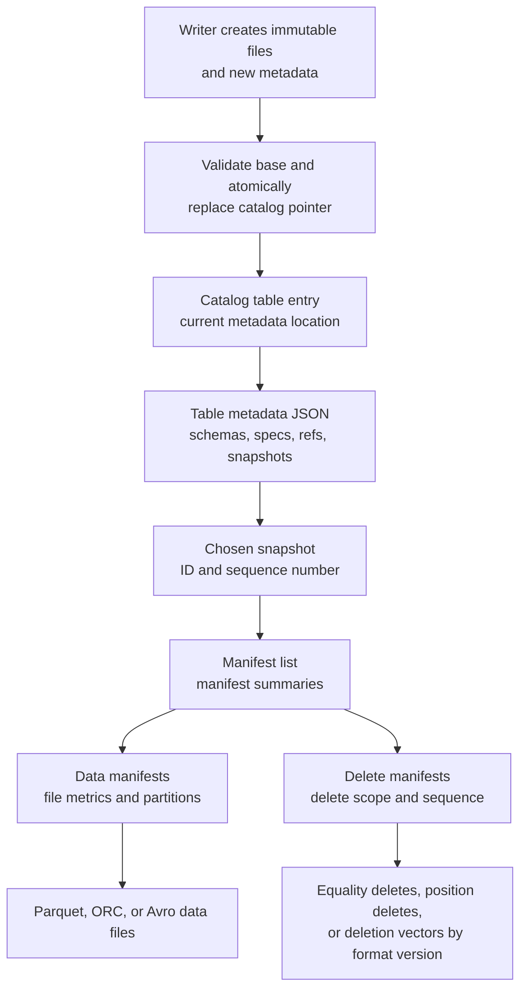

## Working model

Four layers that are often called “the lake” solve different problems:

- Apache Arrow defines typed columnar arrays in memory and an interprocess communication (IPC) representation.
- Apache Parquet defines a durable columnar file with independently encoded and compressed column pieces plus pruning metadata.
- An object store keeps named byte objects. It does not decide which set of Parquet files forms one committed table version.
- A table format such as Apache Iceberg, Delta Lake, or Apache Hudi records that set, publishes atomic versions, coordinates writers, and tracks later maintenance.

Confusing the layers causes concrete failures. A valid Parquet file can be absent from every table snapshot. A file deleted from the current snapshot can remain readable through an older snapshot. An object upload can succeed even though the table commit fails. An Arrow batch can represent a table’s rows correctly while providing no durable commit, recovery, or retention protocol.

[DB12](./12-clickhouse-columnar-parts-and-merges.md) explains columnar storage inside a database whose server owns parts and merges. [DB14](./14-search-engines-inverted-indexes-and-opensearch.md) follows another immutable-file design through Lucene segments. [DB15](./15-change-data-capture-and-projections.md) defines the source position, ordering, retry, and rebuild rules for change data capture (CDC). [DB16](./16-selecting-and-combining-data-systems.md) later applies these mechanisms when deciding whether an analytical copy is justified. This note follows the files and metadata themselves.

## Row and column layouts spend I/O differently

A row-oriented page keeps most fields for one record near one another. It is a good physical shape for fetching or changing a few complete records. A column-oriented batch keeps values of one field together, which lets a scan read only referenced fields and gives an encoder long runs of one physical type.

Suppose an event has 200 fields and averages 800 bytes after row serialization. A query needs a timestamp, tenant ID, event type, and one numeric value, averaging 40 uncompressed bytes per row. For one billion rows, a simple byte floor is:

```text
row-shaped input  = 1,000,000,000 * 800 B = 800 GB = 745 GiB
selected columns  = 1,000,000,000 *  40 B =  40 GB =  37 GiB
```

The second value is not a query forecast. File footers, null markers, offsets, nested levels, selected row groups, decompression, and false-positive pruning add work. Compression can also change the ratio in either direction by column. The calculation shows the opportunity: a query that needs 5% of the logical row should not have to deserialize the other 95%.

Column layout is a poor excuse for an unbounded `SELECT *`. It also does not make point updates cheap. Changing one value inside an immutable columnar file normally creates a replacement file or a separate delete/update structure. That deferred work reappears in compaction, metadata, and read-time merge cost.

## Arrow makes typed arrays a shared execution boundary

Arrow’s columnar format describes arrays by a data type, length, null count, ordered buffers, and child arrays for nested values. The current Arrow 24.0.0 documentation describes columnar format version 1.5. It is a memory and interchange contract, not a database table protocol.

A fixed-width `int32` array such as `[17, null, 22, 22]` has:

```text
length: 4
null count: 1
validity bitmap: 1, 0, 1, 1
value buffer: 17, unspecified, 22, 22
```

The validity bitmap spends one bit per logical slot when present. The physical value under a null slot is unspecified, so consumers must consult validity rather than infer null from a sentinel value.

A variable-width UTF-8 array adds offsets. For `['cat', null, 'ox']`, one valid layout is:

```text
validity: 1, 0, 1
offsets:  [0, 3, 3, 5]
data:     catox
```

Slot `i` begins at `offsets[i]` and ends at `offsets[i + 1]`. The offsets array has `length + 1` entries. A list uses the same idea, but its offsets address a typed child array instead of a byte buffer. A struct has one child array per field, all with the struct’s logical length, plus the struct’s own validity.

Dictionary encoding replaces repeated values with integer indexes into another Arrow array:

```text
logical values:  ['open', 'closed', 'open', null]
indices:         [0, 1, 0, unspecified]
dictionary:      ['open', 'closed']
```

Small indexes reduce bytes and make equality or grouping work cheaper when cardinality stays low. The dictionary itself is still data, may change between batches under the IPC rules, and must travel with enough schema metadata for a consumer to interpret it. A downstream operator cannot compare raw indexes from unrelated dictionaries as though they named the same values.

Arrow supports vectorized execution because operators can loop over contiguous typed buffers, combine validity bitmaps, and pass record batches without rebuilding row objects. “Zero copy” has a narrow meaning: a compatible consumer may reference existing buffers. It can still need copies for alignment, ownership, device transfer, endianness, dictionary unification, a different type, or a lifetime boundary. The Arrow C Data Interface is an ABI-stable way for runtimes and components in the same process to share those buffers without an Arrow library dependency. It explicitly does not define sharing between processes or persistence; Arrow IPC is the serialized representation for those boundaries.

An Arrow IPC stream starts with a schema message, then carries dictionary and record-batch messages in order; it has no footer, so a consumer processes messages sequentially. An IPC file wraps the messages with `ARROW1` magic bytes and ends with a footer containing dictionary and record-batch block locations, which permits random access. Both serialize array buffers for interchange. Neither defines multi-writer conflict detection, a current table version, partition evolution, retention, or which collection of files committed together.

## Parquet turns columns into an independently readable file

A Parquet file is hierarchical:

```text
file
  PAR1 magic bytes at offset 0, or PARE for encrypted-footer mode
  row group 0
    column chunk A
      dictionary page, if used
      data page 0
      data page 1
    column chunk B
      data pages...
  row group 1
    column chunks...
  footer metadata
  footer length
  PAR1 ending magic, or PARE for an encrypted footer
```

A **row group** is a horizontal range of rows. It contains exactly one **column chunk** for each leaf column. A column chunk is contiguous in the file and contains one or more **pages**, the unit of encoding and compression. The file footer records the schema, row groups, chunk locations, encodings, codec, counts, and optional statistics or index locations. An ordinary file, including an encrypted-column file with a plaintext footer, starts and ends with `PAR1`. Encrypted-footer mode starts with `PARE` and uses `PARE` at the end so a legacy reader does not mistake the encrypted footer for ordinary metadata.

The footer sits at the end so a writer can stream data once, then finish the metadata. A reader over object storage commonly reads the tail to locate and decode the footer, chooses row groups and columns, and issues range reads for the surviving chunks. A corrupt, missing, or encrypted footer can make otherwise present page bytes unusable.

### Encoding changes representation before compression

Parquet separates an encoding from a compression codec. Encoding uses the column’s values and type:

- plain encoding writes the basic physical representation and is the required fallback;
- dictionary encoding writes distinct values once in a dictionary page and puts run-length/bit-packed dictionary indexes in data pages;
- delta binary packing stores integer differences in bit-packed miniblocks;
- delta length and delta byte-array encodings target variable-width values and shared prefixes; and
- byte-stream split groups the same byte position from fixed-width numbers, often making later compression of floating-point values more effective.

The selected codec then compresses encoded page data. Snappy, Gzip, Brotli, LZ4 raw, and Zstandard occupy different CPU, latency, and ratio points in the current format. A codec cannot repair a bad physical order. Sorted or clustered values often produce smaller deltas, tighter statistics, and longer repeated runs before the codec starts.

A column chunk may begin with one dictionary page, then fall back to another encoding if its dictionary grows beyond the writer’s limit. Readers must inspect page metadata rather than assume that one column uses one encoding for the whole file.

Parquet encodes nested optional and repeated fields with definition and repetition levels. Definition levels say how much of the optional path exists; repetition levels identify which repeated ancestor continues. These streams let a leaf column reconstruct nulls, empty collections, and nested boundaries without materializing every parent as a row object. A schema mismatch around lists and maps can still reinterpret data incorrectly, so writers and readers must agree on the logical annotations and field identifiers they use.

### Row groups, pages, and files are different tuning units

File size controls object count, planning, recovery granularity, and writer parallelism. Row-group size controls the largest horizontal unit whose column chunks share row boundaries. Page size controls encoding buffers, decompression units, and the finest optional page-index pruning.

One 512 MiB file with four 128 MiB row groups and 50 leaf columns contains 200 column chunks. A query selecting five columns can avoid 180 chunks before predicate pruning:

```text
selected chunks = 4 row groups * 5 columns = 20
all chunks      = 4 row groups * 50 columns = 200
```

It will not necessarily read exactly 10% of the bytes. Column widths and compression differ, a filter column must be read even when it is not returned, and a row group that might match still requires data pages unless an optional page index proves that they cannot match. Choose sizes from measured scan concurrency, selectivity, memory, object-request latency, and recovery, not a copied number.

### Statistics and indexes can prove absence, not presence

Column-chunk statistics can record minimum, maximum, and null counts. A predicate such as `event_time >= 18:00` can skip a row group whose maximum is 17:59. If the range overlaps, the reader must continue; statistics do not prove which individual rows match.

A Parquet Bloom filter belongs to one column chunk and represents a set with false positives but no false negatives under a conforming implementation. For `tenant_id = 8472`, a negative Bloom result can skip the chunk. A positive result means only “maybe.” Bloom filters help high-cardinality equality predicates whose minimum and maximum cover almost the whole domain.

The optional page index separates two structures:

- a column index stores per-page null and boundary information for value pruning; and
- an offset index maps page locations and first row indexes so other selected columns can jump to corresponding row ranges.

Support is not uniform across libraries. The July 2026 Parquet implementation matrix shows that some engines write an index but do not use it for page pruning, while others support only reads. File features must follow the oldest required reader, not merely the newest writer.

Statistics can be absent, truncated, stale with respect to separate table-format delete vectors, or unsafe for an unsupported logical comparison. Parquet format 2.13.0 clarified IEEE 754 total ordering and added NaN counts, but older files and readers still exist. Treat pruning as an optimization. The residual filter must decide row correctness after decoding.

## Projection and predicate pushdown stop at explicit boundaries

“Pushdown” covers several independent steps:

1. The SQL planner moves a filter near the scan.
2. The table format converts it into partition and file predicates, then prunes metadata entries.
3. The Parquet reader uses row-group statistics, dictionaries, Bloom filters, or a page index.
4. The decoder materializes selected columns for surviving rows or batches.
5. The execution engine evaluates the residual predicate.

An unsupported expression, cast, time-zone conversion, user-defined function, collation, nested predicate, encrypted statistic, or missing metadata can stop pruning at any level. `WHERE lower(email) = ...` is not equivalent to an equality predicate on the stored bytes unless a trusted layer has a matching transform. `LIMIT 10` does not guarantee that only ten rows are read when no physical order locates the first ten matches.

Read plans should report files, row groups, pages, rows, compressed bytes, decoded bytes, and residual selectivity. A query returning 50 rows after opening 40,000 files has a planning and layout problem even if a large cluster hides it for now.

## Directory partitions are a convention, not table state

A Hive-style layout puts values in paths:

```text
s3://analytics/events/event_day=2026-07-18/region=west/part-0042.parquet
```

Engines can discover those directories as partitions or register them in a metastore. The convention is easy to inspect, but it exposes physical layout in writers and queries. One producer can derive a day in local time while another uses UTC. A malformed escape, unexpected null marker, or file placed under the wrong directory can make rows disappear from partition-pruned queries or appear under the wrong value.

High-cardinality paths produce small partitions. Partitioning by customer, exact timestamp, request ID, or another near-unique value often creates many directories with too little data for efficient files. Partitioning helps only when filters align with it and each active partition receives enough bytes per commit.

Table formats may still place data in descriptive directories, but readers derive authoritative partition values from table metadata. The path becomes a storage choice instead of the only record of membership.

## Small files move data work into metadata and requests

Suppose 250 streaming tasks checkpoint once per minute and each task closes one 13 MiB file:

```text
files/day = 250 tasks * 1,440 minutes/day = 360,000
data/day  = 360,000 * 13 MiB = 4.46 TiB
```

The bytes might be acceptable while the file count is not. A planner must enumerate or read metadata for those files, workers open many short range reads, object-request cost rises, and each task performs too little sequential decode. The next day adds another 360,000 entries to snapshot, manifest, checkpoint, or timeline structures.

Rewriting the same 4.46 TiB into 512 MiB targets yields about 9,130 files:

```text
4.46 TiB * 1,024 GiB/TiB * 2 files/GiB = about 9,130 files
```

Compaction spends read, shuffle, CPU, object write, and temporary capacity, then commits replacement membership. It must remain behind ingestion far enough to catch up. A table that creates 360,000 files per day but can compact only 200,000 accumulates 160,000 files of daily debt.

Making every file several gigabytes is not an automatic fix. Large files reduce opens but leave fewer scan tasks, make selective rewrites expensive, and increase recovery units. The target must balance object latency, engine split size, row groups, partition volume, update rate, and desired parallelism.

## Object consistency does not provide a table transaction

Amazon S3 currently provides strong read-after-write consistency for object `PUT`, overwrite, `DELETE`, `GET`, and `LIST` in all Regions. An update to one object key is atomic: a reader sees the old object or the new object, not half an object.

That guarantee does not turn these operations into one atomic table update:

```text
PUT data/file-a.parquet
PUT data/file-b.parquet
DELETE data/file-old.parquet
PUT metadata/current.json
```

A reader listing between calls can observe a mixture unless another protocol defines the committed set. Conditional requests such as `If-None-Match: *` can prevent overwriting one key; they do not validate an arbitrary set of data objects and metadata as one transaction.

Other object stores expose different precondition, generation, and listing APIs. A commit implementation must name and test the exact create-if-absent or compare-and-swap primitive it uses. Porting a writer because both destinations look like file systems can silently remove its concurrency guarantee.

The safe pattern writes data and intermediate metadata under unique names, then publishes one small piece of commit state through an atomic compare-and-swap, an exclusive version claim, or a format-specific timeline transition. Readers start from that commit state and never reconstruct current membership by listing arbitrary data paths.

Files written before a failed commit are **orphans**: stored bytes that no committed table version references. Files removed from the latest table version are different; an older retained snapshot may still reference them. Cleanup needs table history and a retention boundary, not a recursive delete of “old-looking” paths.

## A Parquet directory lacks database invariants

A directory of valid files does not answer these questions:

- Which files belong to the current version?
- Did a batch that wrote 80 files commit all 80 or only 79?
- Which schema and field identity apply to an old file?
- Did two concurrent jobs overwrite the same partition?
- Which old version can a reader reproduce?
- Which delete applies to which data file?
- When can an unreferenced object be removed safely?

A metastore partition list helps discovery, but a design that updates metastore partitions and file paths as separate steps still has two sources of membership. A table format puts membership, schema, partition specs, history, and write validation under one commit protocol.

## Iceberg stores table state as an immutable metadata tree

Apache Iceberg names each committed table version a **snapshot**. The catalog resolves a logical table name to the current table-metadata file. That JSON metadata records schemas, partition specs, sort orders, properties, snapshot history, named references, and the current snapshot ID. The current snapshot points to one manifest list; the manifest list points to manifests; manifests list data and delete files with partition tuples and metrics.



The tree keeps slow-changing metadata reusable. A new append can write a manifest for new files and a new manifest list that also references existing manifests. It need not copy one giant list of every file on every commit.

### Scan planning walks from coarse to fine metadata

An Iceberg scan follows a committed pointer rather than listing data directories:

1. Resolve the table through its catalog and load the selected metadata version.
2. Choose the current snapshot, a snapshot ID, a branch or tag, or a snapshot resolved from time-travel rules.
3. Read the manifest list and prune manifests using partition summaries and file counts.
4. Read surviving manifests and prune data files using each file’s partition tuple, counts, null counts, and lower or upper bounds.
5. Match applicable delete files or deletion vectors using partition, referenced path, content type, and sequence rules.
6. Give file tasks to the Parquet, ORC, or Avro reader for row-group and column pruning.
7. Apply row-level deletes and the residual predicate before returning rows.

The manifest list acts as an index over manifests, and each manifest acts as an index over files. Poorly grouped manifests, missing file metrics, broad partitions, or many delete files increase planning even when the data files themselves are well encoded.

### One catalog pointer publishes the commit

An Iceberg writer starts from base metadata `V`:

1. It writes new data or delete files under unique paths.
2. It writes any new manifests and a manifest list.
3. It writes a complete new table-metadata file for `V+1`.
4. It asks the catalog to replace the pointer from exactly `V` to `V+1`.

If another writer changed the pointer first, the compare-and-swap fails. The losing writer refreshes table state and validates its assumptions. A pure append can usually reuse its files and manifest on retry. A compaction may retry only if the files it planned to replace still belong to the table. A filtered delete under serializable isolation must reject a retry when a concurrent commit added matching rows.

This is optimistic concurrency control. It avoids a long table lock while distributed tasks write files, but it does not eliminate conflicts or wasted files. Hot partitions, frequent rewrites, and long jobs increase the window in which assumptions become stale.

The atomic replacement is a catalog property, not a property of an Iceberg metadata file. Iceberg also specifies an older file-system table scheme that claims the next numbered metadata file through atomic rename. The current specification deprecates that scheme, calls it unsafe on object stores and local file systems, and plans to remove it in version 4. An object store with strong reads does not make a rename-based table commit safe; use a catalog whose implementation provides the required check-and-put operation.

### Unknown commit outcome needs a separate recovery path

Suppose the catalog applies `V -> V+1`, but the writer loses its network response. Retrying by inventing another append can duplicate data. Deleting the files as though the commit failed can corrupt the table if `V+1` references them.

Iceberg’s `TableOperations` contract distinguishes unknown state with `CommitStateUnknownException`. The writer must refresh the current and recent metadata chain and look for its intended metadata or snapshot identity. Until it proves failure, its files are not safe to delete. Stable application-level batch identity is still needed when a source can repeat work after process recovery.

### Snapshots isolate readers and retain history

A reader that loaded snapshot `S42` continues to use its immutable metadata and files while another writer publishes `S43`. It does not see half of `S43`. That is snapshot isolation for the read.

Writer isolation depends on operation and configuration. Iceberg supports assumption validation for serializable behavior, while current engine properties may also allow snapshot isolation for row-level operations. Record the engine, connector, isolation property, and table format version; the word “Iceberg” alone does not state the conflict rule.

Time travel selects retained snapshot metadata. Rollback or setting a current snapshot changes the table’s current reference; it does not mutate old Parquet files. A branch or tag can keep a snapshot reachable. Snapshot expiration removes history and can delete data files that no remaining reference needs. Until expiration, a logical delete from the current snapshot is not physical erasure from history.

### Hidden partitioning separates queries from paths

An Iceberg partition spec stores transforms such as `day(event_time)`, `bucket(64, tenant_id)`, `truncate(8, device_id)`, or identity. Writers calculate partition tuples under the spec. Readers convert a row predicate into an inclusive partition predicate: every file that might contain a matching row remains, even if that also keeps false positives.

A query filters `event_time` rather than manually adding an `event_day` path predicate. The engine knows the transform and can prune. If the table evolves from monthly to daily time partitions, old files retain the old spec ID and new files use the new spec. Both layouts coexist, and the planner projects the same row predicate through each spec. Evolution changes future placement; it does not reorganize old data until a rewrite.

### Field IDs make schema evolution safer

Iceberg assigns every field, including nested fields, an ID that is never reused. Data-file fields and metrics bind to IDs rather than only display names or ordinal positions. Renaming a column preserves identity. Dropping it does not let a later column with the same name inherit old bytes. Reordering columns does not swap their values.

Supported evolution still has limits. Type promotion follows the spec’s allowed widening rules. Requiredness, defaults, map keys, nested structures, and old reader support need their own validation. A metadata-only change means existing files are interpreted under the new schema; it does not mean every transformation of stored values is valid without a rewrite.

## Copy-on-write and merge-on-read pay at different times

Immutable data files leave two broad ways to update or delete rows.

**Copy-on-write** reads every touched data file, applies the changes, writes replacement data files, and commits one remove/add set. Reads stay simple because current data files already contain the current rows. A one-row change in a 512 MiB file can rewrite roughly 512 MiB before compression differences, so write amplification depends on file clustering and change locality.

**Merge-on-read** commits changed rows plus separate delete information without immediately rewriting every base file. The foreground write is smaller, while readers must merge data and deletes. Later compaction rewrites files to materialize current state and remove that read cost.

The names describe where work lands, not a complete consistency promise. Both modes still need atomic metadata publication, conflict validation, file retention, and a reader that applies every applicable delete.

### Iceberg delete forms have different identities

Iceberg format version 2 added row-level delete files:

- A position delete identifies a data-file path and zero-based row position. It is exact and cheap to apply when grouped by target file, but it becomes invalid if a rewrite changes paths or row positions without also rewriting the delete relationship.
- An equality delete identifies rows by one or more field IDs and values, such as `(tenant_id, order_id)`. It can apply across multiple older files in its partition scope, but readers may need a hash set, join, or other equality structure.

Data and delete sequence numbers define relative age. In general, a delete applies only to data old enough to be in its scope. This prevents an old equality delete for `id = 7` from deleting a new row that later reuses `id = 7`. Partition and sequence rules are part of correctness; reading all delete files indiscriminately is wrong.

The current spec boundary matters:

- Versions 1, 2, and 3 are adopted. Version 4 remains under development as of July 18, 2026.
- Version 3 adds binary deletion vectors for position-based deletion. A deletion vector is a bitmap for one referenced data file, stored through the Puffin format. New position delete files are deprecated in v3; existing v2 position delete files remain readable and must be folded into a deletion vector when that target is updated.
- Version 3 also adds row lineage. Newly created rows receive `_row_id` and `_last_updated_sequence_number` through snapshot, manifest, and data-file inheritance after a commit succeeds. A rewrite must carry a row's assigned values forward. Snapshots written before a v3 upgrade have no row IDs, and an equality-delete update is represented as removal plus a newly identified row because the writer did not read the old row ID. These fields track table-format lineage; they do not define a business primary key or prevent duplicate entities.
- Equality delete files remain a separate value-based mechanism.
- Iceberg Java 1.11.0 still documents table format version 2 as the default. A spec feature is not usable until every required writer and reader implements it.

An engine-level `DELETE`, `UPDATE`, or `MERGE` can choose copy-on-write or merge-on-read under table properties. Verify the actual engine plan. A connector that recognizes Iceberg snapshots but ignores delete files returns rows that the table has deleted.

## Compaction is a concurrent table rewrite

Data-file compaction chooses small or poorly laid-out files, reads their live rows, writes larger or better-clustered files, and commits replacements. Delete compaction combines delete structures or materializes their effect. Manifest rewrite regroups metadata entries so common filters prune manifests earlier. These jobs solve different debts.

A safe rewrite preserves the set of live rows and validates its source files at commit. If a concurrent writer replaces one selected file, the old rewrite plan cannot simply remove it. Retry may reuse outputs only when validation proves that they still represent the current source state.

Compaction needs enough temporary storage for input and output to coexist. It consumes object reads and writes, shuffle, CPU, catalog commits, and sometimes encryption operations. A table with constant small-file production needs a stable service-rate inequality:

```text
files compacted per hour > small files created per hour
```

Periodic “optimize” jobs that lose this inequality create an ever-growing queue even if each run succeeds.

Snapshot expiration, metadata cleanup, and orphan removal are not synonyms:

- **Snapshot expiration** removes selected history and then makes files unreferenced by every retained snapshot eligible for deletion.
- **Metadata cleanup** bounds old table-metadata files and log structures under format-specific rules.
- **Orphan removal** finds stored files that no reachable metadata references, commonly from failed writes.

Iceberg warns against orphan retention shorter than the maximum write duration because a live writer’s uncommitted files look orphaned. It also compares path strings, so changing URI authority or path normalization can make referenced files appear absent and lead to data loss. Run orphan deletion from table-aware tools, with a conservative cutoff and a dry-run inventory when available.

### Failure trace: compaction races with an upsert

Snapshot `S80` contains `a.parquet`. A compactor reads it and writes `a-large.parquet`. Before the compactor commits, a CDC job writes an equality delete for order 91 plus a replacement row, then commits `S81`.

If the compactor publishes output calculated from `S80` without validation, order 91 can revert. A table-aware rewrite either rejects because relevant assumptions changed or carries sequence and delete semantics that preserve the concurrent update. The operator should retain both job IDs, base snapshot IDs, source and output files, validation result, and final snapshot ID. A successful object upload says nothing about this race.

## Delta Lake records file actions in a versioned transaction log

Delta Lake normally keeps Parquet data beside `_delta_log`. Each zero-padded JSON log entry contains an atomic set of actions for one table version. Actions add or remove logical files, replace metadata or protocol state, record an application transaction ID, and optionally identify change-data or deletion-vector files. A reader reconstructs a snapshot by applying a valid checkpoint and every later JSON commit through the chosen version.

The ordinary commit unit is the next log version. Writers must never overwrite an existing entry and use storage primitives that prevent two writers from claiming the same version. Optimistic conflict checking decides whether a failed writer can retry its operation. Parquet checkpoints summarize table state so readers do not replay an unbounded log; the protocol tells readers not to assume a fixed checkpoint frequency. A checkpoint is derived state, not a replacement transaction history: it omits commit provenance and change-data actions, and later commits still come from the log. Retention must preserve a usable checkpoint, its corresponding JSON entry, and the later commits needed for each supported version.

Delta’s protocol action advertises reader and writer versions plus table features. A client must reject a table whose active features it cannot honor.

Deletion vectors logically remove row positions while keeping their Parquet bytes until a later rewrite. The current protocol gates them behind reader version 3, writer version 7, and the `deletionVectors` table feature. The open-source documentation marks deletion-vector support experimental and opt-in. Enabling it upgrades the table protocol, after which clients that lack the feature cannot read the table.

Column mapping assigns physical names and IDs so a supported table can rename or drop display columns without rewriting every data file. The current open-source documentation also marks column mapping experimental and records streaming and Change Data Feed restrictions around non-additive schema changes, so compatibility depends on the exact Delta and engine versions rather than only the table property's presence.

Change Data Feed (CDF) is disabled by default and records only changes committed after it is enabled. Some changes have separate `_change_data` files, while others can be reconstructed from transaction-log actions. Those records follow the table's history retention and can be removed by `VACUUM`, so CDF is not a perpetual audit log. A consumer that must recover beyond that window needs its own durable checkpoint and retained downstream copy.

`VACUUM` is an explicit operation, not automatic maintenance. Its default data-file retention threshold is seven days. Transaction-log cleanup is separate and asynchronous after checkpoints, with a default retention of 30 days. The data-file threshold must exceed both the longest concurrent transaction and the maximum streaming lag. Once `VACUUM` deletes a file, time travel to a version that needs it no longer works even if enough log entries remain to name that version.

Delta Lake 4.0.1 and later also define catalog-managed tables. Recent ratified commits may live in staged storage or the catalog before publication as ordinary `_delta_log` entries, so compatible readers must consult the managing catalog and direct path access is unsupported. Enabling the `catalogManaged` feature is irreversible, upgrades the protocol, and excludes clients and catalogs that do not implement it. The feature name is a protocol identifier, not a production-readiness guarantee; its catalog implementation, supported clients, recovery procedures, and documented limitations still need deployment-specific validation.

## Hudi centers updates on record keys and file groups

Apache Hudi stores a table timeline under `.hoodie`, with requested, inflight, and completed actions. A file group has a stable file ID and a series of file slices. A slice can contain a base file plus log files with later changes. Indexes can map record keys to the file groups that hold them, which helps an upsert find the files it must change.

Hudi’s two table types expose the copy/merge choice directly:

- A copy-on-write table writes current state into base files and rewrites affected groups for updates.
- A merge-on-read table can append changes or deletes to log files; a snapshot reader merges a base file with its later logs, while compaction creates a new base file. A read-optimized query reads only the latest compacted base-file view, so it avoids record merging but can lag completed delta commits until compaction catches up.

The timeline records `REPLACE_COMMIT` for replacement writes and completed clustering, plus separate action types for compaction, log compaction, cleaning, rollback, savepoint, restore, and indexing. Requested or inflight clustering completes as `REPLACE_COMMIT`, while compaction completes as `COMMIT`. A completed action, not the mere presence of a data file, makes work part of table state. Cleaning removes old file slices under retention; savepoints protect selected history.

As of July 18, 2026, Hudi 1.2.0 uses table version 9. `SINGLE_WRITER` remains the default concurrency mode. Optimistic multi-writer operation requires a configured lock provider and lazy failed-write cleanup; the current documentation still marks that multi-writer path experimental. Non-blocking concurrency control resolves overlapping file-group writes in readers and compaction and still uses a lock when publishing commit metadata to the timeline. Current support is limited to merge-on-read tables using the simple bucket or partition-level bucket index. It does not support concurrent ingestion and clustering; use optimistic concurrency control for that topology. “Hudi supports multiple writers” is incomplete without the table version, write mode, lock or time-generator setup, record merge rule, index, engine, and table-service topology.

Hudi's metadata table is itself an internal merge-on-read table that can hold file listings, column statistics, Bloom filters, record locations, and other indexes. File-listing metadata is enabled by default in current Hudi; column-statistics, partition-statistics, and record-level indexes are disabled by default and must be selected deliberately. Reader support is not uniform: the current matrix exposes different settings and index subsets for Spark, Flink, Presto, and Athena, while Trino dropped metadata-table reads in version 419. Since Hudi 1.2.0, disabling an index in writer configuration automatically deletes its metadata partition by default. Every writer and asynchronous table service must therefore use a consistent metadata-table, index, and lock configuration; one inconsistent writer can remove an index that another writer still expects or let metadata diverge from the data table.

## Iceberg, Delta, and Hudi expose different control planes

All three formats can manage immutable analytical files, but their central records differ:

| Question                             | Iceberg                                                                          | Delta Lake                                                                                              | Hudi                                                                                                    |
| ------------------------------------ | -------------------------------------------------------------------------------- | ------------------------------------------------------------------------------------------------------- | ------------------------------------------------------------------------------------------------------- |
| What identifies current table state? | Catalog pointer to table metadata and its current snapshot                       | Reconciled actions through a transaction-log version, or a managing catalog for `catalogManaged` tables | Completed actions on the Hudi timeline and the file slices they make visible                            |
| How are files indexed for planning?  | Manifest list, manifests, partition tuples, and per-file metrics                 | `add` actions and checkpoints with partition values and optional statistics                             | Timeline, filesystem view, metadata table, partition metadata, and optional record or secondary indexes |
| Normal update shape                  | Copy-on-write replacements or v2+ delete structures plus new data                | Remove/add actions, optional deletion vectors, and change-data files                                    | Copy-on-write base-file replacement or merge-on-read log blocks in file groups                          |
| Main background rewrite              | Data/delete-file and manifest rewrites; snapshot expiration                      | File compaction or clustering, checkpoint/log cleanup, vacuum                                           | Compaction, log compaction, clustering, cleaning, timeline archival, indexing                           |
| Writer coordination                  | Catalog compare-and-swap with operation validation                               | Exclusive log-version publication or catalog-managed commit protocol plus conflict checks               | Timeline transitions; single writer by default, configured OCC or non-blocking modes for concurrency    |
| Incremental record                   | Snapshot/file changes; row-level change semantics depend on operation and engine | Optional Change Data Feed plus log actions                                                              | Incremental and CDC query types on the timeline                                                         |

This is not a winner table. The choice follows engine support, write shape, catalog ownership, row-update rate, retention, maintenance capacity, and which commit protocol the team can test. A feature present in one reference implementation may be missing or read-only in another connector.

## The catalog is part of the storage system

An Iceberg catalog does more than list names. It supplies the current metadata location and must compare the writer’s base with current state atomically. A REST, Hive, JDBC, Glue, Nessie, or another catalog can implement that contract, but deployments differ in isolation, retry behavior, branching, authorization, and credential delivery.

The catalog boundary needs explicit answers:

- What operation publishes a new table version, and what token prevents a lost update?
- Can the client distinguish conflict, definite failure, and unknown outcome?
- Who may create, rename, drop, or change table properties and schemas?
- Does the catalog vend short-lived object credentials or rely on a separate role?
- How are the catalog database, object metadata, and audit history backed up and restored together?
- Which engines share one canonical table identifier and URI normalization?

A catalog outage can stop new commits even while already planned readers continue fetching immutable files. A stale metadata cache can return an older valid snapshot, which is different from a partially committed one. Freshness policy must say whether that older snapshot is acceptable and for how long.

Direct object credentials can bypass catalog policy. If a user can list and read the warehouse prefix, denying the table in the catalog does not protect its Parquet data. Restrict data paths to table services or scoped credentials, separate write and delete roles, and log both catalog changes and object access.

One-table atomicity does not imply a transaction across several tables. A job that commits `orders` then fails before `order_lines` leaves two valid table versions with an inconsistent cross-table point. Use one denormalized table, a catalog feature with a proven multi-table commit, a published batch marker that readers enforce, or an application protocol that tolerates staggered versions. Name the exact boundary.

## Query planning joins table metadata to file execution

A query engine performs work at several scales:

1. Resolve the table and snapshot.
2. Bind logical columns to field IDs or format-specific physical names.
3. Normalize predicates under SQL null, timestamp, decimal, and collation rules.
4. Prune partition specs, manifests or log actions, and data files.
5. Group surviving files into scan tasks based on size, location, and open cost.
6. Read Parquet footers, chunks, pages, and delete structures.
7. Send Arrow-like columnar batches through filters, joins, aggregation, sort, and output.

The table format can know that a file’s `tenant_id` lies between 10 and 90. Parquet can know a row group lies between 40 and 55. Neither knows that a user-defined function rejects all of those rows unless the engine has a sound rewrite rule. Metadata pruning stays conservative so it cannot omit a match.

Planning can become the bottleneck before scanning starts. Observe catalog calls, metadata bytes, manifest or log replay time, files kept and dropped at each stage, task count, time to first task, object opens, footer cache hit rate, delete files per data file, and final decoded bytes. A five-second scan behind a 90-second plan is a metadata incident.

## Streaming commits exchange latency for metadata debt

A streaming sink usually buffers records, writes task files, and publishes them when a checkpoint or microbatch completes. Short intervals reduce visibility lag but close smaller files and create snapshots, manifests, log entries, or timeline instants more often.

Iceberg’s Flink sink documents exactly-once semantics by committing checkpoint identity with table state and keeping uncommitted files temporary. Its own warning matters: expiring the last job snapshot or removing temporary files too aggressively can corrupt recovery. The current Sink V2 path is still marked experimental and differs from the established sink.

Delta uses application transaction identifiers, commonly `(appId, batch version)`, in the same transaction-log commit as file actions. A retried microbatch can see that its version committed and avoid adding files again. Deleting a Spark checkpoint and restarting with the same application ID can cause new low-numbered batches to be ignored, so recovery needs a deliberate identity rule.

Hudi Streamer records source checkpoints and can roll back failed instants. Its exactly-once claim applies to the configured source, checkpoint, Hudi write, and recovery path, not to arbitrary calls made beside the table write.

No connector can make an unrelated email, HTTP request, source offset store, and several table commits atomic merely by calling its sink exactly once. Expand the claim into source range, checkpoint store, table identifier, commit protocol, deduplication lifetime, and supported failure cases.

High-frequency streams need continuous maintenance: longer commit intervals where freshness permits, task distribution that fills target files, data compaction, manifest or log compaction, snapshot or timeline retention, and a safe orphan policy. Maintenance lag is part of the ingestion service level objective (SLO), not a later housekeeping task.

## CDC into a table needs row identity and source order

[DB15](./15-change-data-capture-and-projections.md) covers source snapshots, log positions, tombstones, and sink checkpoints. The table-specific apply path adds these decisions:

| CDC property             | Table decision                                                                                              |
| ------------------------ | ----------------------------------------------------------------------------------------------------------- |
| Stable entity identity   | Identifier or equality fields, including every partition source field required by the engine                |
| Monotonic source version | Rule that rejects an older retry and lets a delete outrank prior state                                      |
| Insert                   | Append a current row or upsert under the table’s merge contract                                             |
| Update                   | Copy-on-write replacement, or delete old identity/version plus insert new state                             |
| Delete                   | Equality or position delete, deletion vector, remove action, or Hudi delete record under a retained version |
| Checkpoint               | Source position recorded atomically with, or provably mapped to, the committed table version                |
| Rebuild                  | Source snapshot plus later log, written into a new table or branch and verified before cutover              |

Equality deletes fit a stream whose event knows business keys but not the target data-file path. They shift matching work to reads and compaction. Position deletes fit an engine that has already located the exact file and row; an ordinary database CDC event does not carry that lake-file position.

Partition evolution and mutable partition fields need care. Updating `event_time` from one day to another removes a row under the old partition transform and inserts it under the new one. If the delete is scoped only to the new partition, the old row survives. Include the old partition values or perform a lookup under a record index or authoritative state.

A table’s own incremental feed is not automatically the original database CDC stream. Compaction removes and adds files without changing logical rows. Delta actions can mark `dataChange=false`; Hudi distinguishes table services on its timeline; an Iceberg snapshot operation summarizes append, replace, overwrite, or delete but does not promise complete before and after row images. Use a format’s defined change feed when supported, or retain the source CDC archive.

### Failure trace: a duplicate batch gets a new sink identity

Kafka offsets 9000 through 9999 commit to table snapshot `S120`, but the worker crashes before its external checkpoint store advances. The restarted worker uses a random application ID and replays the same records. The table sees a new writer identity, so append deduplication does not fire and row count doubles.

Recovery uses a stable job identity and monotonically increasing source-batch version recorded with the table commit, or idempotent upserts by entity and source version. Operators correlate source range, job ID, intended batch ID, committed snapshot or log version, file paths, and row-version distribution. File checksums alone cannot reveal a semantically duplicated batch.

## Governance follows metadata into every retained file

Table metadata contains sensitive information even when rows are encrypted. File paths can reveal tenant or date names. Schemas reveal field names. Minimum and maximum statistics can reveal value ranges; counts disclose volume. In Parquet modular encryption, one selected column key protects that column's data and dictionary pages, page headers, column and offset indexes, Bloom-filter headers and bitsets, and—when it differs from the footer key—the encrypted column metadata. The footer can use a separate footer key. These are distinct encrypted modules, not independently keyed fields, and every required engine must support the selected mode.

Data access has at least four planes: catalog authorization, object-store authorization, encryption keys, and query-engine policy such as row filters or masks. A table format does not replace any of them. A service that enforces a tenant predicate in SQL but gives users raw object access has no tenant boundary at the file layer.

Schema evolution needs governance too. Adding a field changes what future files may contain. Dropping a field from the current schema does not erase its bytes from old files or snapshots. Table properties can enable protocol features that older readers cannot interpret. Treat each change as a compatibility and data-class review, not only a DDL statement.

Deletion has separate milestones:

1. The current snapshot stops returning the row.
2. Every serving reader has refreshed past that snapshot.
3. Rollback branches, tags, change feeds, and retained snapshots no longer expose it.
4. Snapshot expiration or vacuum makes its data files or delete-covered bytes removable.
5. Object versions, replicas, backups, caches, exports, and encryption-key policy reach their deadlines.

Copy-on-write may remove deleted bytes from replacement files sooner, while merge-on-read can leave them under a delete vector until compaction. Neither proves physical erasure from retained history. Record deletion generation, table snapshot, expired references, objects removed, object-version inventory, and backup treatment.

Orphan cleanup is security-sensitive because abandoned files may contain rows that never entered a snapshot and therefore never receive a logical table delete. Keep warehouse write prefixes restricted, inventory unreferenced objects, and apply the same encryption and retention policy to failed-write output.

## Worked case: a 250,000-event-per-second telemetry table

Consider a hypothetical telemetry source with 250,000 immutable events per second. The selected schema averages 900 bytes per event before column encoding and compression. A production-shaped sample measures a 4:1 compressed ratio. These are planning inputs, not generic Parquet ratios.

Daily volume is:

```text
rows/day = 250,000 events/s * 86,400 s/day
         = 21,600,000,000 events/day

raw bytes/day = 21.6 billion * 900 B
              = 19.44 TB = 17.68 TiB

compressed bytes/day = 17.68 TiB / 4
                     = 4.42 TiB/day
```

At a 512 MiB target, steady compacted output is about 9,052 files per day, or 377 per hour:

```text
4.42 TiB/day * 1,024 GiB/TiB * 2 files/GiB
= about 9,052 files/day
```

The streaming topology has 250 tasks and a one-minute checkpoint. If every task closes one file per checkpoint, it produces 360,000 files daily at an average of about 12.9 MiB. Compaction must turn roughly 40 input files into one target file. Ignoring delete handling and format metadata, that daily rewrite reads 4.42 TiB and writes another 4.42 TiB, or at least 8.84 TiB of object traffic before retries, replication, and temporary overlap.

Partition by `day(event_time)` and `bucket(64, tenant_id)` through an Iceberg spec. The day transform aligns time pruning and maintenance with calendar days; snapshot expiration and physical object deletion still determine retention. The tenant bucket limits skew and lets tenant equality prune to one bucket without creating one partition per tenant. A time-range query uses `event_time` directly. If tenant distribution is uneven, measure maximum bucket bytes rather than dividing by 64 and assuming balance.

Sort or cluster files by `(tenant_id, event_time, event_type)` within partition output. A tenant-time predicate then gets tighter file and row-group bounds. This is separate from partitioning: the partition chooses file groups, while order determines locality inside and across their files.

Suppose 50,000 corrections arrive each day and are uniformly scattered across the 9,052 compacted files. The expected fraction of files touched at least once is approximately:

```text
1 - exp(-50,000 / 9,052) = 99.6%
```

Copy-on-write could therefore rewrite almost the entire 4.42 TiB daily data set to change 50,000 rows. If corrections cluster in recent tenant buckets, the real cost may be far lower. This is why the write distribution, not merely update count, decides between immediate rewrite and merge-on-read deletes.

For merge-on-read, write equality deletes on `(tenant_id, event_id)` plus replacement rows with a source version, then compact recent partitions. Monitor delete files per data file, equality-delete rows and bytes, read-side merge CPU, late corrections, and compaction age. Do not retain millions of tiny delete files to avoid one large rewrite.

Retaining 30 days of compressed data is 132.6 TiB before snapshot history, old files awaiting expiration, deletion structures, object versions, and cross-Region copies. A complete restore or copy at an observed 20 GiB/s aggregate payload rate has a transfer floor of about 1.9 hours:

```text
132.6 TiB * 1,024 GiB/TiB / 20 GiB/s
= 6,789 seconds = 1.89 hours
```

Catalog reconstruction, metadata reads, checksums, throttling, query validation, and CDC catch-up extend recovery. If the recovery time objective (RTO) is one hour, the payload alone disproves the plan.

### Request and failure paths

The normal streaming commit writes task data under unique object paths, builds manifests, publishes one Iceberg snapshot through the catalog, and only then advances its source checkpoint under the sink’s recovery protocol. Queries choose that snapshot, prune day and bucket manifests, prune files with tenant and time metrics, read selected Parquet chunks, apply deletes, and evaluate residual filters.

Expected failures have named outcomes:

- A task dies before commit: its files remain unreferenced and are removed only after the safe orphan interval.
- Another writer commits first: refresh, validate, and retry only if the operation’s assumptions still hold.
- The catalog reply is lost: inspect commit state; do not delete or re-append until success or failure is known.
- Compaction falls behind: preserve ingestion, expose file-count and read-cost debt, then restore a measured rewrite rate above creation.
- Source history nears expiry: protect the source or rebuild a new table generation; a table snapshot cannot recreate changes never captured.
- One object prefix or Region is unavailable: fail or route according to the declared storage design, then validate exact file and metadata availability before reopening reads.

## Recovery proves both metadata and payload

A useful recovery inventory contains the catalog entry and version token, current table-metadata location, snapshot or log history, manifests or checkpoints, data and delete objects, encryption keys, source CDC position, and every external snapshot reference. Backing up only Parquet payload leaves no authoritative membership. Backing up only a catalog database leaves paths whose objects may be gone.

| Question                                       | Evidence                                                                                                                   |
| ---------------------------------------------- | -------------------------------------------------------------------------------------------------------------------------- |
| What did the last acknowledged commit contain? | Table identifier, base version, committed snapshot/log/instant, operation ID, source range, added and removed file counts  |
| Can every current file be read?                | Object existence, size, checksum, key access, footer decode, and sampled row/count validation                              |
| Is metadata internally closed?                 | Current pointer resolves; every referenced manifest, checkpoint, data file, and delete file exists; field/spec IDs resolve |
| How much history can roll back?                | Retained snapshots, tags, branches, log entries, Hudi savepoints, object versions, and their expiration times              |
| Can the table be rebuilt?                      | Authoritative source snapshot, CDC archive and position, measured write/commit rate, schema and partition definitions      |
| Can deleted data reappear?                     | Deletion generations applied after restore, expired references, old-file inventory, backup and object-version rules        |
| Does RTO fit?                                  | Timed catalog restore, metadata planning, object transfer, task startup, cache warmup, reconciliation, and CDC catch-up    |

Run drills for lost catalog state, bad schema publication, accidental overwrite, delete-vector reader incompatibility, a corrupted data object, a whole table generation, and a Region loss. A successful time-travel query proves only that one retained snapshot reads now; it does not prove that the source can rebuild the table after its history expires.

## Version boundaries reviewed July 18, 2026

- Apache Arrow’s current documentation is 24.0.0 and describes columnar format 1.5. New layouts still require support in every consumer.
- The current Parquet format line includes release 2.13.0. The `FileMetaData.version` field does not reliably identify every feature used, and format minor releases can add forward-incompatible encodings. Check the implementation matrix for each reader and writer.
- Apache Iceberg Java documentation is 1.11.0. Spec versions 1 through 3 are adopted; version 4 is a draft. Format version 2 remains the documented default, so v3 deletion vectors and types need an explicit compatibility check.
- Delta Lake documentation maps 4.0.x to Spark 4.0.x, with 4.0.1 the current recommended patch in the cited release. Catalog-managed tables remain deployment- and client-specific.
- Apache Hudi 1.2.0 uses table version 9. Multi-writer behavior is not the default and depends on the selected concurrency mode, lock/time service, engine, and record merge semantics.
- Amazon S3 currently provides strong per-object and list consistency. That does not provide an atomic transaction across a set of table objects.

## Summary

- Arrow is a typed in-memory and IPC layout. Parquet is a durable columnar file. Object storage keeps bytes. A table format defines committed membership and history.
- Parquet pruning proceeds through selected column chunks, row-group statistics, optional Bloom filters and page indexes, then residual row evaluation. Missing metadata reduces speed, not correctness.
- A directory convention cannot atomically publish a multi-file table update. Iceberg uses a catalog pointer and metadata tree; Delta uses log actions or a managing catalog; Hudi uses completed timeline actions and file slices.
- Copy-on-write spends update cost before commit. Merge-on-read adds delete and merge work to reads and compaction. Neither removes maintenance or conflict validation.
- Frequent streaming commits create small data files and metadata. The compaction, manifest/log cleanup, snapshot retention, and safe orphan service rates must keep up with ingestion.
- Exactly-once language applies only to a named source, checkpoint identity, table commit, connector version, and failure set. Stable batch and row versions still matter.
- Logical deletion, snapshot expiration, physical object removal, object-version expiry, and backup expiry occur at different times and need separate evidence.

## References

- [Apache Arrow columnar format](https://arrow.apache.org/docs/format/Columnar.html): Defines Arrow arrays, buffers, validity, offsets, nested layouts, dictionaries, IPC streams, and files for the current documentation release.
- [Apache Arrow C Data Interface](https://arrow.apache.org/docs/format/CDataInterface.html): Defines ABI-stable, zero-copy in-process interchange and distinguishes it from IPC across processes or storage.
- [Apache Parquet concepts](https://parquet.apache.org/docs/concepts/): Defines files, row groups, column chunks, pages, and their parallelization, I/O, and encoding boundaries.
- [Apache Parquet file format](https://parquet.apache.org/docs/file-format/): Defines file layout, footer placement, and column-chunk discovery.
- [Apache Parquet column chunks](https://parquet.apache.org/docs/file-format/data-pages/columnchunks/): Defines pages, dictionary placement, compression metadata, and optional page indexes within a chunk.
- [Apache Parquet encodings](https://parquet.apache.org/docs/file-format/data-pages/encodings/): Defines plain, dictionary, run-length, delta, and byte-stream-split encodings.
- [Apache Parquet compression](https://parquet.apache.org/docs/file-format/data-pages/compression/): Defines page compression and supported codec identifiers.
- [Apache Parquet nested encoding](https://parquet.apache.org/docs/file-format/nestedencoding/): Defines definition and repetition levels for nested optional and repeated data.
- [Apache Parquet Bloom filters](https://parquet.apache.org/docs/file-format/bloomfilter/): Defines per-column-chunk split-block Bloom filters and their false-positive contract.
- [Apache Parquet page index](https://parquet.apache.org/docs/file-format/pageindex/): Defines column and offset indexes for value and row-position page skipping.
- [Apache Parquet format versions](https://parquet.apache.org/docs/file-format/versions/): Explains feature compatibility, the unreliable file-version field, and current `parquet-format` releases.
- [Apache Parquet implementation status](https://parquet.apache.org/docs/file-format/implementationstatus/): Tracks which current libraries read, write, and use format features for pruning.
- [Apache Parquet modular encryption](https://parquet.apache.org/docs/file-format/data-pages/encryption/): Defines encryption of pages, indexes, Bloom filters, column metadata, and footers.
- [Apache Iceberg table specification](https://iceberg.apache.org/spec/): Defines snapshots, manifests, optimistic commits, sequence numbers, partition specs, schema IDs, row deletes, and adopted format versions.
- [Apache Iceberg performance](https://iceberg.apache.org/docs/latest/performance/): Explains manifest-list, manifest, partition, and file-metric pruning.
- [Apache Iceberg reliability](https://iceberg.apache.org/docs/latest/reliability/): Defines metadata-pointer commits, retry validation, and object-store compatibility.
- [Apache Iceberg partitioning](https://iceberg.apache.org/docs/latest/partitioning/): Explains hidden transforms and partition evolution.
- [Apache Iceberg schemas](https://iceberg.apache.org/docs/latest/schemas/): Defines types, permanent field IDs, and schema evolution identity.
- [Apache Iceberg configuration](https://iceberg.apache.org/docs/latest/configuration/): Records current defaults for format version, row-level write modes, commit retry, target files, history, and metadata.
- [Apache Iceberg maintenance](https://iceberg.apache.org/docs/latest/maintenance/): Defines snapshot expiration, metadata cleanup, orphan deletion, data-file compaction, and manifest rewrite hazards.
- [Apache Iceberg `TableOperations`](https://iceberg.apache.org/javadoc/latest/org/apache/iceberg/TableOperations.html): Defines atomic base-to-new metadata replacement and unknown commit state.
- [Apache Iceberg REST catalog specification](https://iceberg.apache.org/rest-catalog-spec/): Defines the shared catalog protocol, commit updates and requirements, credential vending, and server-side conflict handling.
- [Apache Iceberg Flink writes](https://iceberg.apache.org/docs/latest/flink-writes/): Documents checkpoint commits, exactly-once scope, temporary files, upsert requirements, and current Sink V2 status.
- [Delta transaction log protocol](https://github.com/delta-io/delta/blob/master/PROTOCOL.md): Defines snapshots, JSON log entries, checkpoints, actions, transaction IDs, table features, column mapping, deletion vectors, change data, and catalog-managed commits.
- [Delta Lake streaming](https://docs.delta.io/delta-streaming/): Documents Spark streaming checkpoints, sink transaction identity, replay, and retention behavior.
- [Delta Lake deletion vectors](https://docs.delta.io/delta-deletion-vectors/): Defines logical row deletion, protocol upgrade, reader compatibility, and later physical rewrite.
- [Delta Lake Change Data Feed](https://docs.delta.io/delta-change-data-feed/): Defines enablement, row-change records, column-mapping restrictions, and cleanup under table retention.
- [Delta Lake column mapping](https://docs.delta.io/delta-column-mapping/): Defines physical column names and IDs, protocol requirements, and current compatibility limits.
- [Delta Lake utility commands](https://docs.delta.io/delta-utility/): Defines data-file vacuum, transaction-log cleanup, retention defaults, and time-travel consequences.
- [Delta Lake feature compatibility](https://docs.delta.io/versioning/): Lists current reader and writer protocol requirements for table features.
- [Delta Lake releases](https://docs.delta.io/releases/): Records current Delta and Spark compatibility lines.
- [Delta Lake catalog-managed tables](https://docs.delta.io/delta-catalog-managed-tables/): Defines the catalog commit boundary, protocol requirements, irreversible enablement, and current limitations.
- [Apache Hudi technical specification](https://hudi.apache.org/learn/tech-specs/): Defines Hudi 1.2.0 table version 9, timeline actions, file groups, base and log files, table types, indexes, and concurrency rules.
- [Apache Hudi timeline](https://hudi.apache.org/docs/timeline/): Defines action types and the completed-action mapping for clustering and compaction.
- [Apache Hudi concurrency control](https://hudi.apache.org/docs/concurrency_control/): Defines single-writer, optimistic, and non-blocking modes plus lock and cleanup requirements.
- [Apache Hudi metadata table](https://hudi.apache.org/docs/metadata/): Defines metadata indexes, reader support by engine, and multi-writer configuration requirements.
- [Apache Hudi Streamer](https://hudi.apache.org/docs/hoodie_streaming_ingestion/): Documents source checkpoints, rollback, recovery, and the ingestion exactly-once boundary.
- [Amazon S3 consistency model](https://docs.aws.amazon.com/AmazonS3/latest/userguide/Welcome.html#ConsistencyModel): Defines current strong consistency and single-object atomicity.
- [Amazon S3 conditional requests](https://docs.aws.amazon.com/AmazonS3/latest/userguide/conditional-requests.html): Defines object-level preconditions such as preventing overwrite of an existing key.
