## Working model

A search engine is a retrieval system built around indexes that answer text, exact-match, range, and ranking questions. It is usually a projection of authoritative data, not the authority for orders, permissions, account state, or money. This boundary matters because a search result can be relevant and still be stale.

This note follows one hypothetical product catalog from its source rows to an OpenSearch index. The example needs to support:

- full-text search over product titles and descriptions;
- exact filters for tenant, status, category, and currency;
- numeric filters and sorting for price and update time;
- stable pagination through a result set;
- source changes visible in search within 60 seconds at p99;
- deletion and authorization changes applied within 15 minutes, with a stricter read-time check for sensitive results; and
- a complete rebuild in less than four hours without stopping source writes.

The limits and volumes are worked planning inputs, not measurements from an actual service. A production design must replace them with query logs, document samples, failure drills, and benchmark results.

[DB15](./15-change-data-capture-and-projections.md) explains snapshot-plus-stream rebuilds and projection checkpoints. [DB16](./16-selecting-and-combining-data-systems.md) places search beside PostgreSQL, Redis, ClickHouse, and object storage. This note opens the search engine itself.

## A document is not just stored JSON

The application sends JSON documents, but a search engine turns each field into one or more physical structures. Start with this source product:

```json
{
  "tenant_id": "tenant-42",
  "product_id": "product-991",
  "title": "USB-C Cable, 2-Pack",
  "description": "Braided 2 metre charging cable",
  "status": "active",
  "category": "accessories",
  "price_minor": 1899,
  "currency": "USD",
  "updated_at": "2026-07-18T18:42:00Z",
  "source_version": 8142
}
```

An explicit mapping gives every field a job:

```json
PUT products-v3
{
  "settings": {
    "index.number_of_shards": 16,
    "index.number_of_replicas": 1
  },
  "mappings": {
    "dynamic": "strict",
    "properties": {
      "tenant_id": { "type": "keyword" },
      "product_id": { "type": "keyword" },
      "title": {
        "type": "text",
        "fields": {
          "exact": { "type": "keyword" }
        }
      },
      "description": { "type": "text" },
      "status": { "type": "keyword" },
      "category": { "type": "keyword" },
      "price_minor": { "type": "long" },
      "currency": { "type": "keyword" },
      "updated_at": { "type": "date" },
      "source_version": { "type": "long" }
    }
  }
}
```

The field types are part of the query contract:

| Field shape     | Physical purpose                                                      | Suitable questions                                                   | Common mistake                                                     |
| --------------- | --------------------------------------------------------------------- | -------------------------------------------------------------------- | ------------------------------------------------------------------ |
| `text`          | Analyze input into terms and build postings                           | “Contains words like `charging cable`”                               | Using it for exact IDs, grouping, or lexical equality              |
| `keyword`       | Index the whole normalized value as one term                          | Tenant, state, tag, currency, exact sort                             | Running natural-language matching against it                       |
| Numeric or date | Encode points for range search and doc values for sort or aggregation | Price range, time range, newest first                                | Mapping a number as text and expecting numeric order               |
| Stored source   | Retain the document representation for retrieval                      | Return selected hit fields or rebuild from the index in an emergency | Assuming stored source is the same structure as the inverted index |
| Doc values      | Per-document, column-like values used by sorting and aggregations     | Sort by price, group by category                                     | Enabling expensive field data over analyzed text instead           |

One logical field can have several representations. `title` above is analyzed as text for relevance and also indexed as `title.exact` for exact matching. This costs extra indexing work and disk, so each representation should correspond to an observed access path.

The mapping is not a loose hint. It controls parsing, term production, scoring data, and which queries are possible. Dynamic mapping may infer a type from the first value it sees. A timestamp first seen as ordinary text or a numeric identifier first seen as a number can establish the wrong contract. `dynamic: strict`, templates for controlled namespaces, and a dead-letter path make schema mistakes visible instead of silently expanding the mapping.

### Analysis turns text into terms

An analyzer is an ordered pipeline:

1. Zero or more character filters change the input character stream, such as removing HTML.
2. Exactly one tokenizer finds token boundaries and records positions and offsets.
3. Zero or more token filters lowercase, stem, remove stop words, or add synonym paths.

With the built-in standard analyzer, `USB-C Cable, 2-Pack` is split according to Unicode word-boundary rules and lowercased. Do not guess the exact output for a custom analyzer. Run the Analyze API against the index definition and keep representative examples in mapping tests:

```json
POST products-v3/_analyze
{
  "field": "title",
  "text": "USB-C Cable, 2-Pack"
}
```

Index-time analysis produces the terms stored in the index. Query-time analysis produces the terms looked up by a full-text query. They are often the same, but not always. An autocomplete field may index edge n-grams while the search side uses ordinary words. Synonyms that create multiple alternatives at one position need graph-aware analysis so phrase queries retain valid paths.

An analyzer change changes the meaning of all previously indexed text. Changing the configuration does not rewrite existing segments. Create a new index generation, reindex the source with the new analyzer, compare relevance, and switch an alias only after validation.

### Terms carry positions and offsets when the mapping asks for them

A token is an item moving through analysis. A term is the field-plus-byte value placed in the index. Two fields containing the bytes `cable` have different terms because field identity is part of the key.

Postings can store progressively more information:

- document IDs only, enough for membership;
- document IDs and term frequency, enough to distinguish one use from repeated use;
- positions, needed for ordered phrase and proximity queries; and
- offsets and payloads, useful for match excerpts or application-specific per-position data.

More posting detail consumes disk and indexing work. Exact filter fields often need only document membership. Full-text fields commonly need frequencies and positions. Highlighting can use stored source, postings offsets, or term vectors depending on field size and query needs; benchmark the selected method on real documents.

## The inverted index reverses the lookup direction

A row store starts with a document ID and finds its fields. An inverted index starts with a term and finds the documents that contain it. Consider three already-analyzed titles:

| Internal document | Terms                           |
| ----------------- | ------------------------------- |
| 0                 | `braided`, `charging`, `cable`  |
| 1                 | `usb`, `cable`, `adapter`       |
| 2                 | `wireless`, `charging`, `stand` |

The inverted view is:

| Term       | Posting list |
| ---------- | ------------ |
| `adapter`  | 1            |
| `braided`  | 0            |
| `cable`    | 0, 1         |
| `charging` | 0, 2         |
| `stand`    | 2            |
| `usb`      | 1            |
| `wireless` | 2            |

The term dictionary finds the entry for `charging`. Its posting list supplies document IDs 0 and 2. `charging AND cable` intersects the sorted lists `[0, 2]` and `[0, 1]` to produce document 0. `charging OR cable` unions them to produce 0, 1, and 2. A phrase query also checks term positions so `charging cable` does not match a document where the words occur far apart or in the opposite order.

Lucene builds this structure independently inside each segment. Its current file format has a term dictionary, a term index, packed postings, optional positions and payload data, stored fields, doc values, point indexes, vector indexes, norms, and live-document information. Document IDs are internal and may change after a merge. Application code must use a stable external ID such as `tenant-42:product-991`.

The current Lucene 10.3 term dictionary uses a block-tree organization whose index is a specialized trie. The important operating property is not the name of that structure. Terms are ordered, compressed, and linked to postings inside each immutable segment. Prefix, regular-expression, wildcard, and fuzzy queries may enumerate many dictionary terms before reading postings. A pattern that begins with an unconstrained wildcard can therefore do far more work than a lookup of one exact term.

Posting lists use increasing document IDs, so implementations can encode deltas and skip blocks. Lucene also records block-level score bounds that let top-k search skip blocks unable to beat the current competitive score. The cost of a query depends on term frequency, intersections, scoring, segment count, and requested output, not just the number of hits returned.

## BM25 ranks terms; filters enforce exact predicates

Matching and ranking are separate questions. A `match` query over `title` might find 20,000 products. Ranking decides which 20 appear first. Lucene's default BM25 implementation gives more weight to terms that occur in fewer documents, saturates the benefit of repeating a term, and can normalize for field length.

For one query term, a useful form of BM25 is:

```text
score contribution = idf(t) *
  f(t,d) * (k1 + 1)
  -----------------------------------------------
  f(t,d) + k1 * (1 - b + b * field_length / average_field_length)

idf(t) = ln(1 + (document_count - document_frequency + 0.5)
                 / (document_frequency + 0.5))
```

`f(t,d)` is the term frequency in the document. `k1` controls how quickly repetition saturates. `b` controls length normalization. Lucene 10.3 defaults to `k1 = 1.2` and `b = 0.75`. Boosts, multiple terms, Boolean clauses, phrase behavior, and other query types add to this simplified single-term picture.

Suppose an index has 1,000,000 documents. A rare term in 10,000 documents has an IDF near:

```text
ln(1 + (1,000,000 - 10,000 + 0.5) / (10,000 + 0.5))
= 4.605 approximately
```

A term in 500,000 documents has IDF near `ln(2) = 0.693`. The rare term has more discriminatory value.

Now assume the rare term occurs three times in a 200-token field while the average field contains 100 tokens:

```text
frequency factor = 3 * 2.2 / (3 + 1.2 * (0.25 + 0.75 * 2))
                 = 6.6 / 5.1
                 = 1.294

term contribution = 4.605 * 1.294 = 5.96 approximately
```

In a 50-token field, the same three occurrences produce a frequency factor of `6.6 / 3.75 = 1.76`. Length normalization raises that contribution. This is not proof that shorter text is better. It shows why mixing titles, descriptions, and repeated boilerplate in one field makes relevance hard to reason about. Map them separately and assign boosts from judged queries.

Tenant, status, category, price, and authorization predicates do not express relevance. Put them in filter context:

```json
GET products-read/_search
{
  "size": 20,
  "query": {
    "bool": {
      "must": [
        { "multi_match": { "query": "braided charging cable", "fields": ["title^3", "description"] } }
      ],
      "filter": [
        { "term": { "tenant_id": "tenant-42" } },
        { "term": { "status": "active" } },
        { "range": { "price_minor": { "lte": 2500 } } }
      ]
    }
  }
}
```

Filter context answers yes or no without calculating a relevance score, and commonly reused filter results may be cached. It also makes the security boundary visible in the query. A `post_filter` is different: it can filter returned hits after aggregations have been calculated and is useful for faceted interfaces, but it is the wrong place for a predicate that must constrain both hits and aggregates.

Relevance needs evaluation data. Keep a set of real query intents with graded expected results, measure ranking changes, and inspect score explanations. A latency win that moves the correct item off the first page is a regression. A relevance change that times out on common prefixes is also a regression.

## Immutable segments turn writes into deferred work

Lucene does not edit one large inverted index in place for every document. An `IndexWriter` buffers additions and deletions, writes new independent segments, and merges selected segments in the background. Existing segment files are immutable. A reader searches a point-in-time set of segments and live-document markers.

OpenSearch adds a distributed write path, a transaction log, refresh scheduling, replication, and shard management around Lucene. Four events that sound similar have different meanings:

| Event                 | What changes                                                                                                                   | What it does not mean                                 |
| --------------------- | ------------------------------------------------------------------------------------------------------------------------------ | ----------------------------------------------------- |
| Index acknowledgement | The write met the configured primary, replication, and translog durability conditions                                          | The document is already visible to an ordinary search |
| Refresh               | New in-memory changes become visible through searchable segments/readers                                                       | Old translog generations are necessarily retired      |
| Flush                 | OpenSearch establishes a Lucene commit so operations in covered translog generations are no longer needed for restart recovery | Every caller should manually flush after writes       |
| Merge                 | Several segments are rewritten as a new segment; deleted documents can be omitted                                              | Source truth or CDC history has changed               |

### One acknowledged write can still be absent from search

The standard document-replication path is:

1. A coordinating node resolves the target index, document ID, and routing value.
2. The request reaches the current primary shard.
3. The primary validates the mapping, records the operation in its translog, and applies it to Lucene's in-memory indexing structures.
4. The operation is sent to the relevant replica shard copies. The acknowledgement depends on active-shard and translog durability settings.
5. A later refresh publishes the change to search readers.

OpenSearch also supports segment replication as an index-creation choice. In that mode the primary sends segment files after refresh rather than making replicas repeat every document indexing operation. Do not mix the two mechanisms in an incident explanation; inspect `index.replication.type` first.

The refresh interval is a visibility trade-off. Short intervals reduce search lag but create small segments more often, invalidate some caches more often, and increase merge work. Calling `refresh=true` on every write can turn an efficient bulk pipeline into a stream of tiny segments. If a workflow must read its own write through search, `refresh=wait_for` can wait for the next refresh, but an authoritative point read should normally go to the source database instead.

OpenSearch automatically flushes based on conditions such as translog size. Manual flush is an operational tool, not an application commit primitive. With request-level translog durability, acknowledged operations are protected according to that setting even before a Lucene flush. Async durability creates a different loss window and must be an explicit decision.

### Updates and deletes consume space until merges reclaim it

Lucene's ordinary document update deletes the matching old document and adds a complete new document. A partial OpenSearch update may save network payload or run a server-side script, but changed indexed content still becomes a new Lucene document version. The old version is excluded through live-document state after the change becomes visible. Its bytes remain in old segments until a merge rewrites live documents without it.

This creates three useful distinctions:

- **Logical document count** is what a reader can return.
- **Deleted-document count** is old material awaiting reclamation.
- **Store size** includes current segments, deletion overhead, and temporary merge output.

A merge reads old segments and writes a new one before obsolete files can be removed. Readers, snapshots, or points in time may retain references to old segments. Disk use can therefore rise while a merge is making the index smaller. Provision free space for merge output, recovery, and watermarks instead of sizing disks to the current primary bytes.

Force merge concentrates this rewrite into a requested operation. It is appropriate mainly for an index that has become read-only. Running it repeatedly on a hot write index competes with ingestion and can create very large segments that receive new deletes but are expensive to merge again.

### Refresh-rate calculation

Suppose all 16 primary shards receive writes continuously and refresh every second. A simple upper-bound model is:

```text
16 primaries * 1 possible new segment/refresh * 3,600 seconds/hour
= 57,600 new primary-shard segments/hour before merges
```

An actual refresh need not create a new segment on every shard, and merges run concurrently, so this is not a predicted steady-state segment count. It shows the scale of background work that a one-second policy can initiate. Changing the interval from one second to ten seconds reduces this upper-bound creation rate by a factor of ten while adding corresponding visibility delay. Measure indexing throughput, refresh time, segment count, merge bytes, query latency, and source-to-search lag together.

## OpenSearch distributes one Lucene index as shards

An OpenSearch **index** is a named logical collection with settings and mappings. Each **primary shard** is an independent Lucene index containing a subset of documents. A **replica shard** is another copy of one primary's data. The number of primary shards is a static index setting; the ordinary replica count is dynamic.

For an index with 16 primaries and one replica:

```text
logical primary shards = 16
physical shard copies  = 16 * (1 primary + 1 replica) = 32
```

More primaries allow data and work to spread across more nodes, but they increase cluster state, file handles, memory structures, recovery units, and search fan-out. A shard cannot be split merely by adding a node. OpenSearch supports index split and shrink under specific constraints, but a new generation plus reindex is often the clearest way to change mappings, analyzers, and shard layout together.

### Routing chooses one primary-shard family

At index time OpenSearch hashes a routing value to select a primary shard. The document ID is the default routing input; an application may supply a custom value. Every replica of that primary contains the same logical shard data.

Custom routing by tenant can make tenant-scoped search touch fewer shards when the same routing value is provided at query time. It also turns a large or busy tenant into a single-shard hot spot. Routing by a composite such as `tenant_id:routing_bucket` spreads a large tenant, but a tenant query must then fan out across all of its buckets. The number of buckets is a data-model contract, not an emergency knob.

Never use custom routing only on writes. A get, update, delete, or routed search must supply the same value or it may look on the wrong shard. Store or deterministically derive it from immutable source identity.

### The receiving node coordinates search

Any node that receives a search request can act as its coordinating node. For the common query-then-fetch path:

1. The coordinator resolves target indexes, aliases, routing, and shard groups.
2. For each logical shard, it chooses one active copy, primary or replica. Adaptive replica selection can consider prior response time, network latency, and search queue size.
3. During the query phase, each chosen shard runs the Lucene query and returns its local top document references, scores or sort values, and partial aggregation state.
4. The coordinator merges shard top-k lists into a global top-k and reduces aggregation results.
5. During the fetch phase, it asks only the shards owning the winning documents for stored fields or `_source`, then constructs the response.

Replicas increase the pool of copies that can serve reads and allow a copy to be lost. They do not reduce the number of logical shards a broad query addresses. A 16-primary index still has 16 shard-level query operations per broad search whether it has zero, one, or three ordinary replicas.

At 8,000 searches per second:

```text
8,000 searches/second * 16 logical shards/search
= 128,000 shard-level query operations/second
```

One replica gives 32 copies over which those 128,000 operations can be distributed. It does not turn the total into 64,000. Routing a query to one known shard would reduce logical fan-out, but only if the product contract permits that routing.

Dedicated coordinating nodes can isolate reduction and fetch work, but they are not free proxies. Deep result windows, large source documents, and wide aggregations consume coordinator heap and network. A search that fans out to hundreds of tiny shards can overload the coordinator even when each shard is individually fast.

### Aggregations are distributed reductions

Metric aggregations compute shard partials and combine them. Bucket aggregations can be less exact. For a `terms` aggregation, each shard sends its local top terms, controlled by `shard_size`, and the coordinator combines them. A globally important term may be absent from a shard's local candidates. Increasing `shard_size` can improve count accuracy at the cost of shard work, network bytes, and coordinator memory.

Use `size: 0` when only aggregation output is needed. Bound maximum buckets and query time. High-cardinality grouping over user IDs is a different workload from a category facet with 30 values, even though both use a terms aggregation.

## Dense vectors add a second retrieval geometry

A text-embedding model converts text into a fixed-length numeric vector. A similarity function such as cosine similarity, inner product, or Euclidean distance compares a query vector with document vectors. Nearby vectors may express related meaning without sharing exact terms, but the model, input preparation, vector dimension, normalization, and distance function together define what “nearby” means.

An exact k-nearest-neighbor search computes similarity against every eligible vector and keeps the best `k`. Its work is roughly proportional to `eligible_documents * dimensions`. It gives a useful correctness baseline but becomes expensive at large scale. Approximate nearest-neighbor (ANN) search visits a selected subset. Lower latency comes with a recall trade-off: one of the true exact top-k documents may never become a candidate.

Hierarchical Navigable Small World (HNSW) organizes vectors as a navigable graph. Search enters the graph, compares nearby vertices, and follows promising connections toward the query. More connections per vertex increase graph memory and build work and can improve reachability. A larger construction candidate list can produce a better graph at slower indexing speed. At query time, a larger `ef_search` examines more vectors and usually improves recall while raising CPU and latency. These are measured trade-offs, not quality guarantees.

Vector bytes alone can be large. Ten million 768-dimensional `float32` vectors require:

```text
10,000,000 * 768 dimensions * 4 bytes
= 30,720,000,000 bytes
= 28.6 GiB of raw vectors for one primary copy
```

One replica raises raw vector bytes to 57.2 GiB before graph connections, document fields, segment metadata, temporary merge output, and cache overhead. Quantization can reduce memory but adds approximation; oversampling and full-precision rescoring can recover some quality at added query cost. Build representative indexes and measure both resident memory and recall.

Vector structures follow Lucene's segment lifecycle. New vectors build graph data for new segments, updates add a new document and delete the old one, and merges build replacement segment structures. High update rates therefore spend CPU on graph construction and later reconstruction. Track graph build and merge work alongside ordinary indexing lag.

### Filters must participate in candidate selection

Tenant, status, and authorization filters remain mandatory. Applying a post-filter only after ANN may return fewer than `k` hits because filtered-out candidates consumed the candidate budget. Current OpenSearch `knn` queries support a filter with the Lucene and Faiss engines. The Lucene path can choose exact filtered search when the eligible set is small, use filtered ANN otherwise, and fall back to exact work when graph traversal visits too many vectors without completing.

Engine, method, and OpenSearch version determine the exact filter behavior. Test the deployed combination and put the tenant predicate inside the supported k-NN filter path. Do not retrieve cross-tenant source and hope an application post-filter removes it later. Current authorization still needs the read-time checks described below.

Each shard and segment returns only the candidates it found. The coordinator can merge those local lists, but it cannot recover a true neighbor omitted by approximate traversal. More shards and small segments create more local searches and more opportunities for candidate loss or variable latency. Measure recall@k against exact search on a sampled corpus by tenant and filter selectivity, not only against the ANN system's own prior output.

### Hybrid retrieval needs an explicit fusion rule

Lexical retrieval is strong for exact names, identifiers, and rare words. Vector retrieval can find related wording. A hybrid query runs both, then combines their candidates. BM25 scores and vector scores have different ranges and distributions, so adding raw scores gives unstable meaning.

Two defensible fusion families are:

- normalize each retriever's scores within a defined candidate set, then combine them with evaluated weights; or
- discard raw magnitudes and fuse ranks, for example with reciprocal-rank fusion.

Current OpenSearch hybrid search exposes a score normalization processor and a rank-based score-ranker processor. Candidate depth is part of the quality contract: fusion cannot promote a document absent from both input lists. Judge lexical-only, vector-only, and fused results on the same query set, including exact SKU queries, short ambiguous queries, long natural-language requests, and restrictive tenant filters.

### An embedding model change is an index migration

Vectors from different model versions are not assumed comparable, even if their dimensions happen to match. Store `embedding_model_version` with each document and pin the query encoder to the index generation. A model or dimension change uses a new versioned index or vector field:

1. Generate the new embedding from authoritative text while source CDC continues.
2. Build the new graph and catch up changes, including deletes.
3. Compare recall, judged ranking, filter correctness, memory, build rate, and latency.
4. Shadow queries against both generations before switching the read alias.
5. Keep deletion events flowing to every live generation during rollback.

Do not block the authoritative product transaction on an embedding service. Persist the source change, queue vector production, and measure embedding age separately from OpenSearch ingest and refresh age.

### Failure trace: query and document vectors use different models

A query encoder deploys model v5 while the index still contains v4 vectors. Both models output 768 dimensions, so requests pass validation and latency remains normal. Semantic recall falls because the two coordinate spaces do not share a contract. BM25 masks some failures in hybrid results, while vector-only long queries degrade sharply.

Dimension checks cannot detect this incident. Evidence includes the query model version, per-document model-version counts, vector-only recall against an exact judged set, hybrid component ranks, returned candidate counts, and downstream success by query class. Roll back the query encoder to v4, then complete the v5 generation and evaluation before moving both sides together. Also watch k-NN cache memory, load time, circuit-breaker state, per-shard vector latency, graph-build time, and filtered exact-fallback frequency.

## Object and nested mappings preserve different relationships

JSON syntax suggests nesting, but ordinary object arrays are flattened for indexing. Consider:

```json
{
  "offers": [
    { "seller": "north", "price_minor": 1000 },
    { "seller": "south", "price_minor": 5000 }
  ]
}
```

With an ordinary `object` mapping, the index effectively has multi-valued fields resembling:

```text
offers.seller      = [north, south]
offers.price_minor = [1000, 5000]
```

The association between `north` and `1000` is lost. A Boolean query for seller `north` and price `5000` can match even though no single offer has both values.

A `nested` mapping stores each array element as a separate hidden Lucene document associated with its parent. A nested query can then require both predicates in the same child. This correctness has costs: one source document creates multiple Lucene documents, nested queries perform parent-child block joining, updates rewrite the containing block, and aggregations need nested or reverse-nested handling.

Choose among these shapes deliberately:

- Flatten an object when cross-field pairing does not matter.
- Use `nested` when each repeated object has a relationship that queries must preserve.
- Promote repeated objects to their own top-level search documents when they have independent identity, update rate, or ranking.
- Keep arbitrary metadata unindexed or use a controlled flat representation when the keys are not real query dimensions.

Dynamic user-supplied keys can create a mapping explosion: every new key adds field metadata and related structures across the cluster. Put bounded, named dimensions in explicit fields. Keep opaque payloads in stored source or the authoritative store.

## Pagination is a distributed top-k problem

`from` and `size` look like database offset pagination but have distributed cost. For `from: 500000, size: 50`, each involved shard may need to retain enough local candidates for the coordinator to discover the global slice near 500,000. OpenSearch limits `from + size` to 10,000 by default because deep windows are expensive and stateless pages can shift as documents change.

For 12 shards, a planning bound on candidate references is:

```text
12 shards * (500,000 + 50 candidates/shard)
= 6,000,600 candidate references
```

If a benchmark shows that the coordinator and shard queues consume an average of 32 bytes of transient state per candidate, that request alone implies:

```text
6,000,600 * 32 bytes = 192,019,200 bytes = 183.1 MiB
```

The 32-byte value is an explicit measurement assumption, not an OpenSearch guarantee. Real memory depends on the collector, sort fields, scores, object layout, and reduction. The calculation explains why increasing `index.max_result_window` can move the error from an early rejection to heap exhaustion.

Use `search_after` with a deterministic sort for forward cursor pagination:

```json
{
  "size": 50,
  "sort": [{ "updated_at": "desc" }, { "product_id": "asc" }],
  "search_after": ["2026-07-18T18:42:00Z", "product-991"]
}
```

The final sort field must break ties. A business timestamp alone is not unique. Stateless `search_after` observes the live index, so concurrent insertions and deletions can still move results between pages.

Pair `search_after` with a point in time (PIT) when a user or export needs a consistent view. The PIT pins a search view while subsequent requests can change the query and advance using sort values. Keep its lifetime short and close it when finished. A PIT retains old segment references, which can delay file deletion after merges and increase disk use. It is a resource lease, not a transaction over the source database.

With a page size of 50 across 12 shards, a rough search-after planning model retains about:

```text
12 shards * 50 candidates = 600 candidate references/page
```

Collectors may retain more state, but the work no longer grows linearly with the page number. Scroll contexts also preserve a view and suit controlled bulk extraction. OpenSearch documentation prefers PIT plus `search_after` for deep interactive pagination. Neither cursor should be exposed as an unbounded permanent resource.

## Capacity includes replicas, merge room, and skew

Suppose the 16 primary shards contain 480 GiB after a representative production-like index build:

```text
480 GiB / 16 primaries = 30 GiB per primary on average
480 GiB * 2 copies      = 960 GiB active shard data with one replica
```

If 25% of usable disk must remain free for merges and recovery, active bytes may occupy at most 75%:

```text
960 GiB / 0.75 = 1,280 GiB = 1.25 TiB usable provisioned capacity
```

That is a floor before operating-system reserve, uneven allocation, snapshots outside the cluster, growth during the procurement window, and a failed-node evacuation. Average shard size is also insufficient. If one shard is 75 GiB while another is 12 GiB, the 30 GiB average hides routing skew and a slower recovery unit.

Shard sizing must combine:

- measured indexed bytes per source byte for the actual mapping and analyzer;
- document and nested-document counts per shard;
- maximum rather than average shard size;
- query and ingest rate per shard;
- segment and deleted-document counts;
- time to relocate or restore one shard; and
- node loss while staying under disk watermarks.

There is no universal correct shard size. A read-heavy 60 GiB shard on fast local storage may behave well while a 10 GiB shard with high update churn and costly nested queries may not. Benchmark the complete workload and rehearse failure recovery.

## Write pressure appears before the cluster is full

Indexing turns input into analysis, postings, stored fields, doc values, translog writes, replication traffic, refreshes, and later merges. A bulk request is a transport envelope, not one atomic operation. Its HTTP request can succeed while individual items fail due to mapping errors, version conflicts, rejections, or unavailable shards. Parse and persist every item result before advancing a CDC checkpoint.

OpenSearch can reject indexing work when node or shard pressure crosses configured limits. Per-shard backpressure matters because one routed hot shard can be overloaded while node averages look safe. Useful symptoms include:

- bulk item status `429` and write-thread-pool rejections;
- indexing-pressure or shard-backpressure rejection counters;
- one shard with much higher indexing latency, bytes, or document count;
- refresh and merge time rising while ingest throughput falls;
- old-generation garbage collection and circuit-breaker trips;
- disk-watermark allocation blocks; and
- source-to-search lag increasing even though the CDC reader is current.

Retry only retryable item failures, use exponential delay with jitter, and bound the retry queue. A retry loop that sends rejected work immediately increases pressure. Mapping failures need quarantine and repair, not indefinite retries.

### Hot-routing trace

A catalog normally indexes 12,000 documents per second. One tenant starts a 6,000-document-per-second import. All of its documents use `tenant_id` as custom routing, so they land on one of 16 primaries.

1. Cluster-wide input rises by only 50%, but one primary receives nearly half the total writes.
2. That shard's analysis, translog, refresh, and merge work saturate its node.
3. Its replica also performs or receives the corresponding replication work, so moving only the primary may not remove the bottleneck.
4. Per-shard indexing rejections rise. The CDC worker retries, making its local backlog grow.
5. Broad search p99 rises because every query waits for the slowest of 16 shard responses.

The evidence is shard-level rate and latency skew, not merely cluster CPU. Immediate controls may rate-limit the import and slow retries. A lasting correction can add routing buckets for large tenants in a new index generation, but the read path must query every bucket belonging to that tenant. Reindex and test the new distribution rather than changing the routing formula in place.

## CDC makes search rebuildable

The source database commits product state and a durable change position. A projector converts source rows into complete search documents. OpenSearch is allowed to disappear because source state, tombstones, and enough ordered change history remain elsewhere.

```mermaid
flowchart LR
  accTitle: Authoritative product changes become searchable documents
  accDescr: An authoritative product transaction writes a durable versioned change. A projection worker builds a complete document and sends it in a bulk request to a versioned OpenSearch index. The primary shard records it in the translog and indexing buffer, follows the configured replica path, and publishes searchable segments at refresh. Search returns candidate IDs for a current authorization check. The projection checkpoint advances only after every bulk item is classified.

    A["Authoritative product transaction"] --> B["Durable change log with source version"]
    B --> C["Projection worker builds complete search document"]
    C --> D["Bulk request to versioned OpenSearch index"]
    D --> E["Primary shard translog and indexing buffer"]
    E --> F["Replica path"]
    E --> G["Refresh publishes searchable Lucene segments"]
    G --> H["Search returns candidate product IDs"]
    H --> I["Authoritative permission or state check when required"]
    D --> J["Advance checkpoint only after every item is classified"]
```



The diagram has two safety edges. The checkpoint advances only after each bulk item succeeds or enters a durable repair path. Sensitive reads recheck current authority before disclosing protected content.

### Stable IDs and source versions prevent resurrection

Use a deterministic document ID such as `tenant_id:product_id`. Retried upserts then converge on one document instead of creating duplicates. Put an immutable source version or change sequence in every event and document.

Out-of-order delivery creates this failure:

```text
version 8142: product is active
version 8143: product is deleted
version 8142: delayed retry arrives after the delete
```

An unconditional retry of 8142 resurrects the document. The projection sink must reject a version older than the stored source version. That can use an external versioning contract or a guarded update script, but the source version must come from one monotonic domain whose ordering semantics are understood. OpenSearch's own `_seq_no` and `_primary_term` protect concurrent changes to the current OpenSearch document; they do not automatically order an external database's CDC events.

A delete is a first-class event containing identity, routing, and source version. Do not infer deletion from absence in an incremental feed. Retain tombstones and change history long enough for the slowest supported repair and rebuild.

### Backlog calculation

The projector accepts 12,000 document changes per second and stops for 60 seconds:

```text
12,000 changes/second * 60 seconds = 720,000 queued changes
```

At 2 KiB per encoded change, excluding broker overhead:

```text
720,000 * 2 KiB = 1,440,000 KiB = 1.37 GiB
```

After recovery, the sink sustains 18,000 changes per second while 12,000 new changes continue arriving. Net drain is 6,000 per second:

```text
720,000 / (18,000 - 12,000) = 120 seconds to drain
```

End-to-end freshness remains outside target for more than the original 60-second stop. Refresh visibility and validation add time after the queue drains. Alert on the age of the oldest unapplied source version, not just queue length.

## Reindex into a new generation, then switch aliases

Mappings and analysis evolve through versioned indexes such as `products-v3` and `products-v4`. A read alias such as `products-read` keeps the application name stable.

A safe rebuild is:

1. Record source snapshot time `T0` and its durable CDC position.
2. Create `products-v4` with explicit settings, mappings, analyzer definitions, and planned shard count.
3. Scan the source snapshot and index complete documents with deterministic IDs and source versions.
4. Consume changes strictly after the recorded position into `products-v4`, including tombstones.
5. Wait until source-to-index lag meets the target and remains stable under current traffic.
6. Compare source and target counts by tenant and partition, sample document hashes, run a fixed relevance set, test authorization and deletion cases, and measure query latency.
7. Atomically remove `products-read` from v3 and add it to v4 with the Manage Aliases API.
8. Watch errors, latency, freshness, and result deltas. Keep v3 read-only for a bounded rollback window.
9. Delete v3 through normal APIs only after rollback and retention requirements expire.

Dual-writing from application request handlers is weaker than this procedure. A process can update one index and fail before the other, and retry semantics become part of every caller. One source log plus independent idempotent consumers gives an inspectable position and repeatable repair path.

OpenSearch's Reindex API copies documents visible in one index to another, which is useful for index-local transformations. It does not replace a source-of-truth rebuild when the old index may already be missing deletes or contains stale permissions.

### Alias rollback has a data-direction problem

Switching the read alias back to v3 is easy. Any writes accepted only by v4 after the cutover are not present in v3. Keep the projection worker writing both generations through the rollback window, or make all generations rebuildable from the source position. Record which index receives writes; never assume a read-alias switch also moves the write target correctly.

## Deletion and authorization freshness are correctness requirements

Search lag is often presented as a user-experience issue. For permissions and erasure, it is a security and data-governance issue.

Assume a support document contains a tenant ID, case title, and message excerpt. A user's role is revoked at 10:00:00, but the search projection can be 60 seconds behind. If search returns source snippets based only on indexed role membership, the revoked user can still see protected text during the lag window.

Use layered controls:

- put immutable tenant identity in a mandatory exact filter and prevent callers from supplying a different tenant;
- keep sensitive payload out of the search projection when IDs and safe display fields are enough;
- batch-authorize returned IDs against the current authority before fetching or showing protected fields;
- give authorization and deletion streams tighter lag objectives than ordinary description edits;
- fail closed when the authorization authority cannot be reached for a protected result;
- measure revoked-but-still-searchable age with synthetic canaries; and
- include search indexes, snapshots, CDC archives, dead-letter queues, and rollback generations in deletion policy.

Filtering by `tenant_id` does not solve mutable roles inside a tenant. Document-level security inside the search cluster can add another boundary, but its role data still needs a freshness and failure contract. Name which system decides access at read time.

### Stale-delete failure trace

1. Source version 8143 deletes `product-991` and emits a tombstone.
2. A malformed unrelated event ahead of it causes the consumer partition to stop.
3. Queue-depth alerts remain quiet because traffic is low, but oldest-event age reaches 40 minutes.
4. Search continues returning version 8142. A point lookup in PostgreSQL correctly returns not found.
5. An operator skips the malformed event without recording a repair item, and the checkpoint advances past the tombstone.

Recovery requires replay from before 8143 or a source-to-index reconciliation that emits the missing delete. The preventive controls are event-age alerts, per-item durable quarantine, checkpoint discipline, version comparison, and a regular anti-entropy scan. A successful bulk HTTP status alone is not evidence that every item was applied.

## Snapshots shorten recovery but do not replace the source

OpenSearch snapshots store index and selected cluster state in a registered repository. Standard snapshots are incremental: unchanged segment files can be shared across snapshots because those files are immutable. Delete snapshots through the OpenSearch API so it removes only files no retained snapshot references.

A snapshot is not an instantaneous transaction across all shards. Primary shards may be captured at different times while the snapshot runs, and writes can continue. For a derived search index, restore the snapshot and replay source changes from a known position. For authoritative data accidentally placed only in search, this weak point-in-time boundary becomes a much harder recovery problem.

The recovery plan needs separate cases:

| Failure                                   | First recovery path                                                                  | Evidence before reopening traffic                                       |
| ----------------------------------------- | ------------------------------------------------------------------------------------ | ----------------------------------------------------------------------- |
| One replica copy lost                     | Allocate and recover a new copy from a primary or other source                       | Recovery API progress, cluster allocation, shard checks                 |
| Primary node lost with an in-sync replica | Promote an eligible replica and replace redundancy                                   | Primary terms, failed writes, unassigned shards, document probes        |
| Index mapping or data corrupted logically | Build a clean generation from authority and CDC; restore snapshot only if known good | Version distributions, source hashes, relevance and delete checks       |
| Whole cluster lost                        | Create replacement cluster, restore snapshot, replay retained changes                | Repository access, restore duration, source-to-search lag, query probes |
| Snapshot repository unavailable           | Rebuild from authority and archived change log                                       | Full-scan throughput, CDC retention remaining, rebuild ETA              |

The snapshot repository must not share every failure mode with the cluster. Restrict repository write and delete permissions, encrypt it, retain copies according to policy, and test a restore into an isolated cluster. A snapshot that has never completed a timed restore drill is an untested recovery hypothesis.

### Recovery-time estimate

Suppose 960 GiB of active primary-plus-replica data must be reconstructed, but the repository and network deliver an observed aggregate 450 MiB/s after protocol and throttling overhead:

```text
960 GiB * 1,024 MiB/GiB / 450 MiB/s
= 2,184.5 seconds
= 36.4 minutes of transfer time
```

Shard allocation, checks, segment opening, cache warming, replay, and validation extend the outage. If the recovery time objective is 30 minutes, this measured transfer rate already disproves the plan. Restore fewer bytes, raise effective throughput, maintain a warm replacement, or change the objective.

## Diagnose from evidence at each boundary

Search incidents cross application, projection, cluster, shard, and Lucene boundaries. A dashboard that shows only cluster health cannot distinguish bad relevance, stale data, one hot shard, or a slow coordinator.

| Question                        | Evidence to retain                                                                                   | Why it separates causes                                   |
| ------------------------------- | ---------------------------------------------------------------------------------------------------- | --------------------------------------------------------- |
| Did the source commit?          | Source transaction ID, entity ID, source version, commit time                                        | Separates source absence from projection lag              |
| Did CDC deliver it?             | Partition, offset or log position, event time, consumer checkpoint, retry record                     | Finds gaps, stalls, and reordering                        |
| Did indexing accept it?         | Bulk item status, target generation, routing value, result version, rejection class                  | Request-level success can hide item failure               |
| Is it visible yet?              | Refresh interval and time, indexed source version, controlled term query                             | Separates acknowledgement from refresh visibility         |
| Is one shard hot?               | Per-shard docs, bytes, indexing/search rate, latency, rejections, segment and merge stats            | Node averages hide routing skew                           |
| Is the query expensive?         | Query and fetch phase time, total shards, rewritten query, profile sample, returned bytes            | Distinguishes term expansion, scoring, fetch, and fan-out |
| Is reduction expensive?         | Coordinator CPU/heap, aggregation bucket count, shard size, network bytes                            | Finds wide top-k and aggregation pressure                 |
| Is disk pressure deferred work? | Deleted-doc ratio, merge current/time/bytes, refresh rate, disk free, allocation watermarks          | Links update churn to later writes and allocation failure |
| Can the index recover?          | Latest successful snapshot, incremental bytes, restore drill duration, CDC retention and replay rate | Converts a backup claim into an RPO and RTO test          |
| Are protected deletes fresh?    | Synthetic revocation/delete age, source-versus-index reconciliation, oldest unapplied event          | Treats stale access as correctness failure                |

Useful OpenSearch APIs include Nodes Stats for thread pools, caches, breakers, JVM, indexing, search, refresh, flush, and merge counters; shard and segment APIs for skew and file state; Recovery for copy progress; Snapshot Status for incremental and failed-file detail; and Profile for sampled query execution. Profiling adds cost, so use it on controlled requests rather than every production search.

### Failure trace: mapping changed beneath the producer

A producer begins sending `price_minor` as the string `"unknown"` after a client release.

1. With an explicit `long` mapping, affected bulk items fail parsing while other items in the same request succeed.
2. If the consumer checks only the outer HTTP response, it advances the source checkpoint and silently loses the failed updates.
3. Search lag based on consumer offset looks healthy, but version reconciliation shows old documents.
4. Retrying the whole bulk request repeats successful items and still cannot repair the invalid values.

The worker must classify each item, persist the invalid source ID and version, advance only according to its durable quarantine contract, and alert on failure rate and age. Repair the producer or transformation, then replay the quarantined versions. Do not loosen the mapping to accept incompatible types unless the query contract truly changed.

### Failure trace: nested relationship was flattened

An offer query asks for seller `north` with price `5000`. Tests contain only one offer per product, so the ordinary object mapping passes. Production products have several offers, and cross-object matches appear.

The engine is behaving according to the flattened mapping. Adding another Boolean clause cannot restore a relationship that was not indexed. Create a new generation with a `nested` mapping or separate offer documents, reindex, compare document counts including hidden nested documents, test query latency, and switch the alias.

### Failure trace: green cluster, slow search

Cluster health is green and all shard copies are assigned, but p99 search latency triples.

1. A new dashboard issues an aggregation over all daily indexes and thousands of shards.
2. Each shard answers quickly, yet the coordinating node receives many partial bucket sets.
3. Coordinator heap, CPU, and network rise. Batched reduction and circuit-breaker metrics show pressure.
4. Ordinary product searches landing on the same coordinator queue behind dashboard reductions.

Green means the expected shard copies are allocated. It does not mean queries meet latency or resource bounds. Restrict the dashboard's index set and time range, cap buckets and concurrency, separate workloads where justified, and reduce tiny-shard count at the data-lifecycle boundary.

## A production review follows invariants, not product names

Before approving a search design, write down these invariants:

| Boundary           | Required statement                                                                                     |
| ------------------ | ------------------------------------------------------------------------------------------------------ |
| Authority          | The system that decides current business state and permissions                                         |
| Document identity  | Stable ID, routing derivation, and source-version domain                                               |
| Mapping            | Explicit types, analyzer tests, nested relationships, and dynamic-field policy                         |
| Freshness          | p50, p99, and maximum tolerated source-to-search lag by change class                                   |
| Ranking            | Judged query set, quality metric, latency limit, and rollback comparison                               |
| Fan-out            | Primary-shard count, routed query behavior, maximum target shards, and coordinator budget              |
| Capacity           | Maximum shard bytes and rate, replicas, merge reserve, failure reserve, and growth window              |
| Pagination         | Deterministic sort, PIT lifetime, maximum page size, and cursor cleanup                                |
| Backpressure       | Bulk size based on measurement, retry classes, queue bound, and overload behavior                      |
| Deletes and access | Tombstone retention, anti-resurrection rule, read-time authorization, and snapshot deletion policy     |
| Recovery           | Snapshot location, source rebuild path, retained change position, and timed restore result             |
| Evolution          | Versioned index name, snapshot-plus-stream procedure, validation, alias switch, and rollback data path |

If any row is “OpenSearch handles it,” the design is unfinished. The engine supplies mechanisms. The service owns the authority boundary, data contract, limits, and proof that recovery works.

## Summary

- A search document is transformed into several structures. Analyzed text, exact terms, numeric points, doc values, stored source, and vectors answer different questions.
- An analyzer applies character filters, one tokenizer, and token filters. Index-time and query-time analysis must produce compatible terms. Analyzer changes require reindexing existing data.
- An inverted index maps a field term to a posting list of matching document IDs. Frequencies, positions, offsets, norms, and skip data support ranking, phrases, match excerpts, and faster top-k execution.
- BM25 weights rare terms more heavily, saturates repeated occurrences, and can normalize for field length. Exact tenant, state, range, and access predicates belong in filter context rather than relevance scoring.
- Lucene writes new immutable segments. Refresh changes search visibility, flush establishes a durable Lucene commit and retires unneeded translog history, and merge rewrites segments to reduce count and reclaim deleted documents.
- A Lucene update ordinarily deletes the old document and adds a new one. Logical deletion can be visible well before physical bytes are reclaimed.
- Each OpenSearch primary shard is its own Lucene index. Replicas add eligible read copies and redundancy but do not reduce broad-query fan-out across logical primaries.
- Query then fetch gathers local top-k results from one copy of every target shard, reduces them at a coordinating node, then retrieves only winning documents. Aggregations also produce shard partials that the coordinator reduces.
- Dense-vector search compares embedding geometry. Exact k-NN is a recall baseline; ANN visits fewer candidates and needs recall, memory, build, filter, and shard-level measurement. Hybrid retrieval needs score normalization or rank fusion rather than raw-score addition.
- Ordinary object arrays lose pairing between child fields. Use `nested` only when queries must preserve that relationship and account for the added Lucene documents and join work.
- Deep `from` pagination grows with the offset. A deterministic `search_after` cursor avoids that growth; add a short-lived PIT when the result view must remain stable.
- Size the cluster for replicas, maximum shard skew, merge output, recovery, and node loss. Current stored bytes are not the capacity requirement.
- Bulk requests are not atomic. Inspect every item, back off retryable rejections, quarantine permanent failures, and advance CDC checkpoints only under a durable repair contract.
- A search index should be reconstructible from an authoritative snapshot and retained change log. Stable IDs, monotonic source versions, and versioned tombstones prevent duplicates and stale resurrection.
- Alias switches make generation changes atomic for clients, but rollback also needs a plan for writes and changes after cutover.
- Search snapshots are incremental but not an instantaneous cross-shard transaction. Restore drills, source replay, and measured validation determine the actual recovery point and recovery time.
- Permission revocation and deletion lag are correctness boundaries. Keep sensitive fields out of stale projections when possible and reauthorize current access before disclosure.

## References

- [Apache Lucene 10.3 file formats](https://lucene.apache.org/core/10_3_1/core/org/apache/lucene/codecs/lucene103/package-summary.html): current primary description of documents, fields, inverted indexes, segments, term dictionaries, postings, stored fields, doc values, live documents, points, vectors, and the Lucene 10.3 block-tree change.
- [Apache Lucene `IndexOptions`](https://lucene.apache.org/core/10_3_1/core/org/apache/lucene/index/IndexOptions.html): primary definitions of postings containing documents, frequencies, positions, and offsets.
- [Apache Lucene `IndexWriter`](https://lucene.apache.org/core/10_3_1/core/org/apache/lucene/index/IndexWriter.html): buffering, segment flushes, merges, commits, deletion, and update-as-delete-plus-add behavior.
- [Apache Lucene `DirectoryReader`](https://lucene.apache.org/core/10_3_1/core/org/apache/lucene/index/DirectoryReader.html): point-in-time readers and the warning that internal document numbers are ephemeral.
- [Apache Lucene `BM25Similarity`](https://lucene.apache.org/core/10_3_1/core/org/apache/lucene/search/similarities/BM25Similarity.html): current defaults, inverse-document-frequency equation, and `k1` and `b` meanings.
- [Apache Lucene `KnnFloatVectorQuery`](https://lucene.apache.org/core/10_3_1/core/org/apache/lucene/search/KnnFloatVectorQuery.html): exact fallback, filtered ANN, segment-result merging, and k-NN query behavior.
- [Apache Lucene HNSW package](https://lucene.apache.org/core/10_3_1/core/org/apache/lucene/util/hnsw/package-summary.html): graph building, searching, and merging types used for approximate vector retrieval.
- [OpenSearch text analysis](https://docs.opensearch.org/latest/analyzers/): analyzer components, index-time and query-time analysis, and token examples.
- [OpenSearch Analyze API](https://docs.opensearch.org/latest/api-reference/analyze-apis/): inspect the exact token, position, and offset output of a configured analyzer.
- [OpenSearch mappings](https://docs.opensearch.org/latest/mappings/): explicit and dynamic field mapping behavior and array type inference.
- [OpenSearch nested fields](https://docs.opensearch.org/latest/mappings/supported-field-types/nested/): flattened object-array behavior and separate-document representation for nested objects.
- [OpenSearch query and filter context](https://docs.opensearch.org/latest/query-dsl/query-filter-context/): scored query clauses, unscored filter clauses, and filter caching.
- [OpenSearch index settings](https://docs.opensearch.org/latest/install-and-configure/configuring-opensearch/index-settings): static primary-shard and replication-type settings; dynamic replica, refresh, and result-window settings.
- [OpenSearch search shard routing](https://docs.opensearch.org/latest/search-plugins/searching-data/search-shard-routing/): primary-or-replica selection, adaptive replica inputs, routed searches, hot-spot risk, and shard-concurrency limits.
- [OpenSearch vector search techniques](https://docs.opensearch.org/latest/vector-search/vector-search-techniques/): current exact and approximate k-NN choices.
- [OpenSearch k-NN query](https://docs.opensearch.org/latest/query-dsl/specialized/k-nn/): vector query fields, engine-specific filters, `ef_search`, oversampling, and rescoring.
- [OpenSearch efficient k-NN filtering](https://docs.opensearch.org/latest/vector-search/filter-search-knn/efficient-knn-filtering/): current Lucene and Faiss filtered-search strategies and exact fallbacks.
- [OpenSearch hybrid search](https://docs.opensearch.org/latest/vector-search/ai-search/hybrid-search/): current score-normalization and rank-fusion processors.
- [OpenSearch refresh](https://docs.opensearch.org/latest/api-reference/index-apis/refresh/): translog and buffer write path, search visibility, and automatic refresh behavior.
- [OpenSearch flush](https://docs.opensearch.org/latest/api-reference/index-apis/flush/): automatic flush conditions and removal of operations no longer needed in the translog for restart recovery.
- [OpenSearch segment replication](https://docs.opensearch.org/latest/tuning-your-cluster/availability-and-recovery/segment-replication/): optional segment-copy replication and refresh checkpoints.
- [OpenSearch pagination](https://docs.opensearch.org/latest/search-plugins/searching-data/paginate/): `from`, `size`, scroll, `search_after`, the default 10,000-result limit, and PIT plus `search_after` guidance.
- [OpenSearch Point in Time](https://docs.opensearch.org/latest/search-plugins/searching-data/point-in-time/): consistent search views and PIT lifecycle.
- [OpenSearch aggregations](https://docs.opensearch.org/latest/aggregations/): metric, bucket, and pipeline aggregation structure and resource cost.
- [OpenSearch terms aggregation](https://docs.opensearch.org/latest/aggregations/bucket/terms): shard-level candidates, `shard_size`, accuracy, and coordinator reduction.
- [OpenSearch shard indexing backpressure](https://docs.opensearch.org/latest/tuning-your-cluster/availability-and-recovery/shard-indexing-backpressure/): per-shard overload detection and rejection.
- [OpenSearch Bulk API](https://docs.opensearch.org/latest/api-reference/document-apis/bulk/): item-level outcomes, routing, refresh, and bulk request format.
- [OpenSearch Index Document API](https://docs.opensearch.org/latest/api-reference/document-apis/index-document/): sequence numbers, primary terms, item result fields, and optimistic concurrency controls.
- [OpenSearch index aliases](https://docs.opensearch.org/latest/im-plugin/index-alias/): stable names across index generations.
- [OpenSearch Manage Aliases API](https://docs.opensearch.org/latest/api-reference/alias/aliases-api/): atomic multi-action alias changes.
- [OpenSearch Reindex API](https://docs.opensearch.org/latest/api-reference/document-apis/reindex/): copying documents from one OpenSearch index to another.
- [OpenSearch snapshots](https://docs.opensearch.org/latest/tuning-your-cluster/availability-and-recovery/snapshots/snapshot-restore): incremental storage, non-instantaneous shard capture, repository rules, and restore procedure.
- [OpenSearch Recovery API](https://docs.opensearch.org/latest/api-reference/index-apis/recover/): evidence for local, replica, relocation, and snapshot shard recovery.
- [OpenSearch Nodes Stats API](https://docs.opensearch.org/latest/api-reference/nodes-apis/nodes-stats/): node and shard evidence for indexing, search, segments, caches, breakers, JVM, and file sizes.
