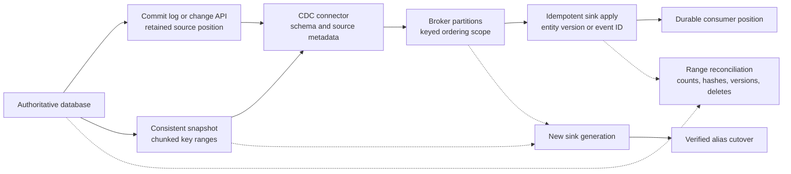

## Working model

Change data capture (CDC) turns committed database mutations into an ordered stream that another system can consume. A source connector reads a database-specific log or change API, converts records into a stable envelope, publishes them, and stores a source position. Consumers use that stream to maintain search, cache, analytics, audit, or service-owned projections.

CDC does not make two databases one transaction. It creates a recoverable asynchronous relationship. Correctness depends on the snapshot boundary, log retention, transaction order, key identity, schema history, delete representation, offset commit, sink idempotency, and rebuild procedure.

## Start with the reason for the copy

A projection is a derived view built for a narrower read path. Examples include:

- PostgreSQL order rows projected into a search index;
- MySQL changes copied into ClickHouse analytics;
- MongoDB conversations projected into a tenant activity feed;
- DynamoDB job state sent to an audit stream;
- one service's public entity state copied into another service's local read model.

Name the source of authority and the accepted lag. If users can update the search index directly, or an operator cannot reconstruct it from authoritative history, it is no longer merely a projection.

Each copy needs a contract:

| Property        | Required decision                                                                                                                 |
| --------------- | --------------------------------------------------------------------------------------------------------------------------------- |
| Source identity | Database, table or collection, primary key, and source incarnation                                                                |
| Position        | Log sequence number (LSN), binlog file/offset, global transaction identifier (GTID), resume token, stream sequence, or equivalent |
| Order           | Per transaction, table, key, partition, or global scope actually preserved                                                        |
| Event shape     | Key, before/after data, operation, schema, transaction, source time, capture time                                                 |
| Delivery        | Expected duplicates, batching, retry, poison-record behavior                                                                      |
| Delete          | Tombstone, before image, soft-delete update, time-to-live (TTL) event, and retention                                              |
| Schema          | Compatibility policy, defaults, renames, type changes, history storage                                                            |
| Freshness       | Lag service-level objective (SLO), observation points, and behavior when stale                                                    |
| Rebuild         | Snapshot source, live-stream handoff, verification, and cutover                                                                   |
| Privacy         | Allowed columns, encryption, deletion propagation, and access boundary                                                            |

“Stream every change” is not a design until these fields have answers.

## Log-based capture reads the database's commit history

Database logs already serialize enough work for replication or recovery. A CDC connector can read that path instead of polling every row for `updated_at > last_seen`. This avoids missing equal timestamps, repeatedly scanning unchanged rows, and adding a second update protocol to every application writer.

The source differs by database:

- PostgreSQL logical decoding converts WAL changes through an output plugin and replication slot into row-level logical events.
- MySQL row-based binary logs expose committed row changes plus table-map and transaction metadata; the connector also needs schema history to interpret old events.
- MongoDB change streams expose committed changes derived from replica-set or sharded-cluster history and resume tokens.
- DynamoDB Streams expose item changes for 24 hours; Kinesis Data Streams for DynamoDB is a different option with longer retention.
- Cassandra's commit log is not a stable general-purpose public CDC contract by itself; current Cassandra CDC features copy enabled-table commit-log segments for consumers under documented capacity and cleanup rules.

The source position is meaningful only with its source incarnation and retained history. A PostgreSQL LSN from a dropped slot, a MySQL binlog position after purging files, or a MongoDB resume token older than the oplog window cannot recreate missing records by number alone.

## An outbox captures business intent instead of raw table shape

Raw CDC reports storage mutations. A column update from `status = pending` to `paid` does not explain whether the business event is `PaymentCaptured`, `OrderPaid`, or a repair replay. Consumers become coupled to table names, normalization, and migration steps.

A transactional outbox stores an explicit event record in the same local transaction as authoritative state:

```sql
BEGIN;

UPDATE orders
SET status = 'paid', version = version + 1
WHERE id = $1 AND status = 'pending';

INSERT INTO outbox (
  event_id, aggregate_type, aggregate_id, aggregate_version,
  event_type, payload, occurred_at
) VALUES (
  $2, 'order', $1, $3,
  'OrderPaid', $4, clock_timestamp()
);

COMMIT;
```

CDC publishes the outbox row after commit. The event ID deduplicates delivery, aggregate version orders one entity, and event type decouples consumers from every source-table field.

The outbox is not free. It adds write and storage work, needs retention, and can itself contain sensitive payload. The producer must define whether a schema migration changes historical event interpretation. A relay that deletes published rows must not erase the only rebuild source before downstream retention is sufficient.

Use raw table CDC for database replication, analytics, and generic indexing where storage changes are the contract. Use an outbox when downstream services need stable domain events. A system can use both, but the two streams should not be confused.

## Snapshot plus stream must close a race

A new projection needs existing rows and future changes. Copying the table and then starting the stream loses commits between those operations. Starting the stream and then copying without coordination can apply updates before stale snapshot rows and overwrite new state.

A correct bootstrap establishes a source position and a consistent snapshot that correspond:

1. Establish or discover a log position `P` while protecting required history.
2. Read a consistent snapshot whose visibility is defined relative to `P`.
3. Emit snapshot records, usually marked as snapshot reads rather than live creates.
4. Start or continue log streaming from the protected position.
5. Apply changes after the snapshot under a rule that handles overlap and duplicates.
6. Commit the completed snapshot and stream position durably.

Connector implementations order these steps differently according to the source. Debezium is an open-source change-data-capture platform whose connectors translate database logs into event streams. Its PostgreSQL connector documents the snapshot transaction, logical position, snapshot events, completion offset, and restart behavior. The invariant is no unprotected interval between copied state and retained changes.

If a connector crashes before recording snapshot completion, restarting the snapshot can repeat every snapshot row. A sink that treats snapshot rows as idempotent upserts remains correct. A sink that sends one email for each record does not.

## Incremental snapshots divide a large bootstrap

A full consistent scan can run for hours, hold source resources, and restart from the beginning after failure. Incremental snapshot designs split a table into key ranges or chunks while the live stream continues. Watermarks or signaling records establish which live events overlap each chunk.

The sink still needs a rule for a row updated while its chunk is scanned. Common approaches buffer changes for the open chunk, compare source positions or versions, or apply live events after the chunk's snapshot records. The exact connector protocol matters; “incremental” alone does not prove race freedom.

Choose chunk keys that are stable and indexed. A random UUID range may scan inefficiently. A mutable key can move rows between chunks. Observe chunk duration, source locks or snapshot age, rows scanned, live-buffer size, retries, and completion position.

## Events need source and transaction metadata

A useful change envelope includes:

```text
source:
  system and cluster identity
  database, schema, table or collection
  log position and source transaction ID
  source commit or event time
operation:
  snapshot-read, create, update, delete, truncate, or message
key:
  stable primary or document key
before:
  prior fields when source and configuration provide them
after:
  current fields after create or update
capture:
  connector version, schema version, processing time
```

Source event time and capture time measure different lag. Their difference includes source commit-to-connector delay and clock error. Broker append time adds another stage. Sink application time completes the end-to-end path.

Transaction metadata lets a consumer group changes that committed together, but broker partitioning can distribute table topics and remove global arrival order. A consumer that requires atomic cross-table visibility must buffer and apply a transaction as a unit using explicit boundaries, or choose a projection contract that tolerates partial asynchronous arrival.

## Ordering exists only inside a named scope

A database log has an order, but a CDC pipeline can split that log into topics, partitions, workers, and sink shards. State what remains ordered after each split.

Keying broker records by primary key preserves one key's partition order while allowing parallel keys. It does not preserve transaction order across two keys assigned to different broker partitions. Keying by transaction keeps a transaction together but may complicate per-entity compaction and parallelism.

A per-entity version is often the safest sink rule:

```text
apply event when incoming_version > stored_version
ignore when incoming_version <= stored_version
```

This handles duplicates and some reordering, provided versions are monotonic for that entity and a delete also advances the version. Source log positions can serve a similar role only when they are comparable across all events sent to that sink and survive failover semantics.

Timestamps from application clocks are usually poor conflict versions. Clock skew and equal timestamps can reorder writes. Use a database sequence, row version, commit position, or another authority-issued token.

## Offset commit and sink commit cannot be one assumption

The consumer reads event `E`, writes a sink, and advances its position. Two crash windows exist:

- If it stores the offset first and crashes before the sink write, `E` is lost to that consumer.
- If it writes the sink first and crashes before the offset, `E` is delivered again.

At-least-once delivery chooses the second window and makes sink writes idempotent. Upsert by entity and version, insert under a unique event ID, or use a transactional sink ledger that records both applied event and result.

Apache Kafka is a partitioned replicated event log; [Kafka as a replicated event log](../01-cloud-infrastructure/07-kafka-replicated-event-log.md) traces brokers, partitions, replication, and consumer offsets. Kafka transactions can atomically produce derived Kafka records and consumed offsets within Kafka. Kafka Connect can provide exactly-once source behavior for compatible connectors and worker configuration. That does not automatically include Elasticsearch, email, an HTTP service, or a database that is outside the Kafka transaction. State the exact resources in the atomic boundary.

The word “exactly once” should expand into: one source range, one broker cluster, one connector mode and version, one sink operation, one failure set, and one deduplication lifetime.

## Deletes require durable negative information

An update event can carry new state. A delete has no new row, so the stream needs the key and often a tombstone or before image. A compacted Kafka topic may use a record with a null value to remove a key after retaining the deletion long enough for consumers.

Soft delete changes a field such as `deleted_at`; it preserves row data until another process physically removes it. A later hard delete can emit another event. TTL sources may delete asynchronously and expose service-specific metadata.

A consumer offline beyond deletion-event retention can rebuild an old value from an earlier snapshot and never learn it was deleted. The rebuild source and live handoff must include current absence, or the sink needs a generation sweep that removes records not present in the new snapshot.

Privacy deletion crosses search, caches, warehouses, exports, feature stores, and backups. CDC delivers some online deletions but does not prove that every retained copy has expired. Maintain an inventory and verify deletion by destination.

## Schema history is part of the stream

Row-based change records need the schema that interpreted their bytes at that log position. MySQL CDC connectors commonly store schema history because the current table definition may differ from the definition used by an older binlog event. PostgreSQL logical output sends relation metadata and follows publication rules; connector envelopes still expose schemas to serialized topics.

Safe changes depend on source and consumer compatibility:

- Adding an optional field with a default is usually easier than making it immediately required.
- Renaming a field can look like delete-old plus add-new unless an event schema gives stable identity.
- Narrowing a type can make retained historical values unreadable.
- Dropping a column before all consumers stop using it breaks replay.
- Changing a primary key changes event routing and sink identity, not merely a field name.
- Backfilling a new column emits live changes that can flood the pipeline or be absent from sources that suppress no-op updates.

Use expand-contract: publish both old and new representation, deploy tolerant consumers, backfill under controlled rate, switch producers, verify lag and errors, then retire the old field after replay and retention horizons pass.

A schema registry can enforce serializer compatibility for broker records. It does not prove semantic compatibility, such as changing cents to dollars while keeping an integer type.

## Source log retention is a hard recovery window

CDC prevents source log removal until a consumer advances, or it relies on fixed retention and fails when history expires.

PostgreSQL replication slots retain required WAL and can also hold catalog horizons. A stopped connector can fill the primary's disk. Set slot lag alerts and a bounded `max_slot_wal_keep_size` policy appropriate to the recovery design; a bound can cause an abandoned consumer to lose its resume history rather than take down the database.

MySQL binary logs need retention longer than the maximum connector outage, snapshot, and incident response. Purging required GTIDs or files forces a new snapshot or a controlled recovery from another retained copy.

MongoDB change-stream resume depends on oplog history. DynamoDB Streams retains 24 hours. A connector dashboard that says “stopped” must also show time until source history disappears.

The correct safety action depends on authority. Never keep unbounded WAL until a production primary runs out of disk merely to protect a rebuildable search index. Prefer enough bounded retention to meet the projection RTO, then rebuild the projection if it misses the window.

## Failover can invalidate a source position

A promoted database must expose a continuous change history for the connector. Physical replication of user data does not always preserve logical slot or connector metadata.

PostgreSQL current releases support failover-capable logical slots under documented synchronization. Slot synchronization is asynchronous, so operators must verify the candidate's slot state before promotion. A new empty slot created after failover cannot emit changes that occurred before its creation.

MySQL GTID sets help a connector or replica identify executed transactions across topology changes, but the candidate must contain the required set and retained binary logs. MongoDB resume tokens depend on the new primary's replica-set history; a normal election inside one healthy replica set preserves the logical stream differently from moving to an unrelated restored cluster.

Run a CDC failover drill:

1. Record source position, connector offset, and sink version.
2. Stop or fence writes for a planned test when the protocol requires it.
3. Verify candidate data and change-position continuity.
4. Promote and fence the old writer.
5. Resume the connector without creating a history gap.
6. Reconcile event counts, transaction boundaries, deletes, and sink checksums.
7. Measure lag catch-up and retained source bytes.

An application database failover is incomplete when its critical projections silently stop advancing.

## Backfills are migrations, not ordinary replay

A backfill may recompute a derived field, add historical rows to a new sink, or rebuild an entire projection. It competes with the source, broker, consumer, and sink while live changes continue.

Separate backfill records from live records by source metadata, topic, job ID, or version. Limit rate and concurrency. A stale backfill record must not overwrite a newer live update; entity versions or source positions enforce that rule.

For a full rebuild:

1. Create a new sink generation rather than deleting the serving one.
2. Establish the snapshot and stream boundary.
3. Load snapshot chunks with idempotent upserts.
4. Catch the new generation up on live changes.
5. Verify counts, sampled records, key-range checksums, delete handling, and freshness.
6. Atomically switch the read alias or routing pointer.
7. Retain the old generation for rollback, then delete it under policy.

This blue-green projection pattern keeps serving state intact while the rebuild is incomplete. It needs temporary capacity for both generations and the live stream.

## Projection verification needs more than event counts

Equal row counts can hide different keys and values. Compare:

- source and sink counts by stable partition or time bucket;
- deterministic hashes of keys and selected canonical fields;
- minimum and maximum versions or positions;
- missing, extra, and mismatched key samples;
- deletion and TTL state;
- schema versions and rejected records;
- consumer lag and oldest unapplied event;
- business invariants such as totals by tenant and day.

Sampling finds obvious failures cheaply but cannot prove absence. Periodic full reconciliation over bounded partitions gives stronger evidence and produces repair work. Repair must use the same version rule as the live consumer so it cannot overwrite newer data.

## Poison records need a visible terminal state

A record can fail because of incompatible schema, invalid bytes, sink mapping, oversized fields, authorization, or a deterministic application bug. Infinite retry blocks the partition; silent skip loses state.

After a bounded retry policy, store the original record, source position, schema, error, attempts, and consumer version in a restricted failure store. Advance only under a declared policy. Alert on count and age, fix the code or data, and replay in source order when required.

The failure store can contain sensitive before images. Apply the same encryption, access, retention, and deletion rules as the source, not a weaker “dead-letter” policy.



## Worked case: PostgreSQL orders to search and ClickHouse

Assume PostgreSQL is authoritative for 80,000 order mutations each second. The search projection serves user-facing tenant queries with a 10-second lag SLO. ClickHouse serves analytics with a five-minute lag SLO. Average change envelope is 1.8 KiB after serialization. Peak connector output is about 141 MiB/s before broker replication and compression:

```text
80,000 changes/s * 1.8 KiB = 144,000 KiB/s
144,000 KiB/s / 1,024 = 140.6 MiB/s
```

Use a PostgreSQL outbox for stable order events and raw table CDC for analytical row replication. A Debezium connector reads a dedicated logical slot and publishes order events keyed by `order_id`. Search upserts by `(order_id, version)` and deletes by a versioned tombstone. ClickHouse ingests batches into a versioned fact or current-state table according to its query contract.

The snapshot contains 12 billion orders averaging 1.2 KiB of selected source fields, about 13.4 TiB before transport and sink encoding. At an effective 350 MiB/s source-scan and pipeline rate, the ideal transfer alone takes roughly 11.2 hours:

```text
12,000,000,000 * 1.2 KiB = 14.4 billion KiB = about 13.4 TiB
14,062,500 MiB / 350 MiB/s = about 11.2 hours
```

That duration is long enough for live change buffers, WAL retention, vacuum horizons, ClickHouse parts, and search indexing to matter. Use incremental chunks, protect the logical position, throttle source reads, batch sinks, and keep live versions from being overwritten by older snapshot rows.

During a 45-minute connector outage, the source generates around 371 GiB of serialized change envelopes before WAL encoding differences:

```text
140.6 MiB/s * 2,700 s = 379,620 MiB = about 371 GiB
```

Provision WAL and broker recovery from measured source WAL bytes, not envelope bytes. Alert on slot-retained WAL and disk time remaining. When the connector returns, catch-up output must exceed the ongoing 140.6 MiB/s or lag never falls.

Failure behavior:

- Connector writes events to Kafka then crashes before its offset: duplicates replay; both sinks compare versions.
- Search mapping rejects a new field type: the partition enters bounded retry, the record and schema go to a restricted failure store, and lag remains visible.
- Logical slot state is absent after promotion: keep the connector paused and rebuild from a verified boundary; do not create a slot and pretend the missing interval never existed.
- A customer deletion arrives while a full rebuild runs: the versioned tombstone wins over older snapshot state, and cutover verification checks absence.
- ClickHouse is offline beyond broker retention: build a new generation from the authority and a newly protected live boundary.
- A schema rename ships to producers before consumers: expand the event with both fields, migrate consumers, backfill, then remove the old field after replay retention.

The operating view includes source commit position, slot or log retention bytes, snapshot chunk and restart state, connector last event, broker append and consumer lag, rejected records, per-key version conflicts, sink apply latency, source-to-sink freshness, reconciliation mismatches, rebuild estimate, and deletion completion.

## Summary

CDC is a position-preserving asynchronous replication protocol, not a callback after a row changes. It is correct only when the initial snapshot and live log meet at a protected boundary and every later retry, schema change, delete, failover, and rebuild preserves identity.

- Name the authority, projection purpose, accepted lag, ordering scope, delete behavior, and rebuild path before choosing a connector.
- Raw CDC exposes storage changes. A transactional outbox exposes explicit business events while sharing the authority's commit.
- Snapshot plus stream must close the concurrent-write race. Snapshot records and live records can repeat, so sinks must be idempotent.
- A source position requires retained history and source identity. Dropped slots, purged binlogs, expired oplogs, and trimmed streams create real gaps.
- Broker partitions usually preserve per-key order, not global database transaction order. Carry transaction and entity-version metadata.
- Commit the sink result before advancing the consumer position and expect replay. “Exactly once” must name every resource in its atomic boundary.
- Deletes need durable negative information and enough retention for offline consumers and rebuilds.
- Schema history is data. Use expand-contract and retain old representations through the replay horizon.
- Failover must preserve or deliberately reestablish connector position before new writes create an unseen interval.
- Build a new projection generation, catch it up, verify it, and switch an alias rather than destroying the serving copy first.
- Reconcile keys, values, versions, deletes, and business totals; equal event counts are weak evidence.

## References

- [PostgreSQL logical decoding](https://www.postgresql.org/docs/current/logicaldecoding.html): Defines extraction of logical changes from WAL through slots and output plugins.
- [PostgreSQL replication slots](https://www.postgresql.org/docs/current/warm-standby.html#STREAMING-REPLICATION-SLOTS): Documents retained WAL and resource risks for physical and logical consumers.
- [PostgreSQL publications](https://www.postgresql.org/docs/current/logical-replication-publication.html): Defines table selection, operations, column lists, row filters, and generated-column behavior.
- [PostgreSQL logical replication failover](https://www.postgresql.org/docs/current/logical-replication-failover.html): Defines failover slot synchronization and the requirement to verify standby state.
- [MySQL 8.4 binary log](https://dev.mysql.com/doc/refman/8.4/en/binary-log.html): Documents row, statement, and mixed formats, transaction events, retention, durability, and recovery.
- [MySQL 8.4 GTID replication](https://dev.mysql.com/doc/refman/8.4/en/replication-gtids.html): Defines source transaction identities and executed sets across topologies.
- [MongoDB change streams](https://www.mongodb.com/docs/manual/changeStreams/): Defines resume tokens, deployment scope, ordering, invalidation, and pre/post images.
- [DynamoDB change data capture](https://docs.aws.amazon.com/amazondynamodb/latest/developerguide/streamsmain.html): Compares DynamoDB Streams and Kinesis Data Streams retention and consumers.
- [Apache Cassandra CDC](https://cassandra.apache.org/doc/latest/cassandra/managing/operating/cdc.html): Documents commit-log segment capture, space limits, raw directory management, and consumer responsibility.
- [Debezium PostgreSQL connector](https://debezium.io/documentation/reference/stable/connectors/postgresql.html): Traces snapshots, LSN offsets, logical slots, event envelopes, restarts, failover, and monitoring.
- [Debezium MySQL connector](https://debezium.io/documentation/reference/stable/connectors/mysql.html): Covers consistent snapshots, binlog positions and GTIDs, schema history, transaction metadata, and failure recovery.
- [Debezium incremental snapshots](https://debezium.io/documentation/reference/stable/configuration/signalling.html): Defines signals and watermark-based chunked snapshot coordination for supported connectors.
- [Debezium event flattening](https://debezium.io/documentation/reference/stable/transformations/event-flattening.html): Documents before/after envelopes, delete handling, tombstones, and sink tradeoffs.
- [Kafka Connect user guide](https://kafka.apache.org/documentation/#connect): Defines distributed workers, offsets, converters, delivery, source and sink tasks, and exactly-once source configuration.
- [Kafka transactions](https://kafka.apache.org/documentation/#semantics): Defines idempotent production, transactional records, consumer isolation, and atomic Kafka offset/output boundaries.
