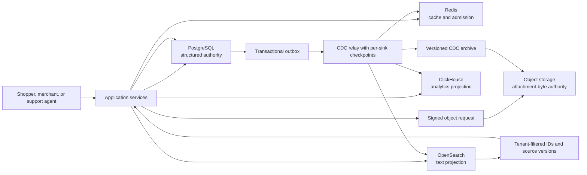

## Working model

A finished data design names one authority for each fact, makes its required access paths cheap, and treats every other copy as a projection with an owner, lag bound, deletion path, and rebuild procedure. Choosing five products because each appears in a system-design diagram is not architecture. Choosing one product for incompatible work merely hides the extra systems inside overloaded indexes, long scans, and risky maintenance.

This note completes one hypothetical design for a multi-tenant commerce and customer-support service. The numbers are planning inputs for the worked case, not measurements from a real company. Every byte estimate stays visible so a later load test can replace it.

The result uses PostgreSQL for transactional metadata and business state, S3-compatible object storage for attachment bytes, Redis for disposable cache and admission control, a search index for text retrieval, and ClickHouse for event analytics. PostgreSQL and object storage hold authority. The other three systems can be deleted and rebuilt.

Earlier notes supply the mechanisms used here. [DB1](./01-data-models-and-access-patterns.md) turns product operations into keys, invariants, and lifecycles. [DB2](./02-storage-engine-primitives.md) accounts for logs, pages, compaction, and deferred work; [DB3](./03-indexes-query-planners-and-execution.md) ties queries to physical access paths; [DB4](./04-transactions-concurrency-and-recovery.md) defines transaction and retry boundaries. The PostgreSQL path follows [DB5](./05-postgresql-storage-query-and-mvcc-internals.md) and [DB6](./06-postgresql-replication-backups-and-schema-change.md). The rejected alternatives use their actual contracts from [DB7](./07-mysql-and-innodb-internals.md), [DB8](./08-mongodb-documents-replication-and-sharding.md), [DB9](./09-redis-data-structures-persistence-and-cluster.md), [DB10](./10-dynamodb-partitions-indexes-and-global-tables.md), [DB11](./11-cassandra-partitions-compaction-and-repair.md), and [DB12](./12-clickhouse-columnar-parts-and-merges.md). [DB13](./13-columnar-files-and-lakehouse-table-formats.md) follows analytical files and table metadata, [DB14](./14-search-engines-inverted-indexes-and-opensearch.md) develops the search projection itself, and [DB15](./15-change-data-capture-and-projections.md) supplies the snapshot, stream, delete, and rebuild rules.

## The service sells products and keeps the support history

Six thousand merchant tenants use one service. Each tenant manages a catalog of stock-keeping units (SKUs) and stock at several locations. Shoppers browse and search products, place orders, see order history, open support cases, send messages, and upload attachments. Support agents search their own tenant's cases and reply. Merchant analysts view near-real-time funnels and operational counts.

The functional paths are explicit:

| Path                           | Required result                                                                     | Authority and freshness                                       |
| ------------------------------ | ----------------------------------------------------------------------------------- | ------------------------------------------------------------- |
| Product by ID or SKU           | Current title, price, availability policy, status, and version                      | PostgreSQL; checkout must use current rows                    |
| Product text search            | Ranked product IDs filtered by tenant, status, category, and price                  | Search projection; visible within 60 seconds                  |
| Checkout                       | One order, all lines, exact inventory reservations, and one durable request outcome | One PostgreSQL transaction; no oversell                       |
| Order lookup                   | One order by ID and tenant                                                          | PostgreSQL; current                                           |
| Customer order history         | Newest orders with stable cursor pagination                                         | PostgreSQL; current after commit                              |
| Support timeline               | One case and ordered messages                                                       | PostgreSQL; current after commit                              |
| Support text search            | Matching case/message IDs for one tenant                                            | Search projection; visible within 60 seconds                  |
| Attachment upload/download     | Immutable bytes plus checksum and authorized metadata                               | Object storage bytes; PostgreSQL metadata                     |
| Product display cache          | Disposable rendered product payload                                                 | Redis; at most five minutes stale, usually invalidated sooner |
| Abuse and flash-sale admission | A temporary request allowance                                                       | Redis; loss may become permissive but cannot oversell         |
| Funnel and support analytics   | Aggregates by tenant and time                                                       | ClickHouse projection; up to five minutes behind              |

Payment authorization happens in an external payment system. A PostgreSQL transaction cannot atomically include it. Checkout first records a durable `pending_payment` order and an operation ID; a worker calls the payment provider with that ID, and a callback or reconciliation job advances the order in another transaction. Duplicate callbacks must resolve to the same state change.

## Exact service levels decide where copies are allowed

The workload has different availability and loss requirements rather than one global number:

A recovery point objective (RPO) bounds the accepted data-loss window after a failure. A recovery time objective (RTO) bounds the time allowed to restore the service. Both are targets that a recovery drill must measure, not properties conferred by having a replica or backup.

| Boundary                                                  | Requirement                                                                                                                   |
| --------------------------------------------------------- | ----------------------------------------------------------------------------------------------------------------------------- |
| Checkout API                                              | 99.99% monthly availability; p99 under 400 ms before external payment settlement                                              |
| Exact SKU reservation                                     | Zero oversell; an unavailable or overloaded authority rejects or queues instead of guessing                                   |
| Product point read                                        | p99 under 120 ms at the service edge; cache bypass remains correct                                                            |
| Product and support search                                | p99 under 250 ms; projection lag under 60 seconds at p99                                                                      |
| Support message write                                     | 99.9% monthly availability; p99 under 300 ms without attachment transfer                                                      |
| Analytics                                                 | 99.5% availability; fresh within five minutes; financial settlement never reads from analytics                                |
| Same-Region PostgreSQL instance or Availability Zone loss | RPO 0 for acknowledged commits; write service restored within five minutes                                                    |
| Whole-Region PostgreSQL loss                              | Target RPO at most 60 seconds; RTO at most 30 minutes                                                                         |
| Attachment Region loss                                    | 99.99% of eligible new objects replicated within 15 minutes through S3 Replication Time Control; failed or late objects alert |
| Search loss                                               | No authoritative loss; basic ID lookup remains; full search restored within four hours                                        |
| Redis loss                                                | No authoritative loss; protected fallback starts immediately; cache hit rate recovers within 30 minutes                       |
| ClickHouse loss                                           | No authoritative loss while CDC archive remains; dashboards restored within eight hours                                       |

The cross-Region PostgreSQL RPO is a target, not a guarantee from asynchronous replication. If measured replay lag passes 60 seconds, the system is outside its target and must alert. A hard RPO 0 across Regions would require synchronous cross-Region acknowledgment or another write protocol, which would add wide-area latency and reduce write availability. This service accepts the stated regional loss window.

## Volume and retention set the physical floor

The planning workload is:

- 60 million active SKUs and 40 million shopper accounts;
- 24 million orders per month, with 3.2 lines on average and 30 lines at p99;
- 1,200 checkout starts per second at the holiday peak;
- 80,000 product point reads and 25,000 search requests per second at peak;
- 6 million support cases per year, averaging 12 messages each, with 900 message writes per second at peak;
- 3,000 analytical events per second on an ordinary day and 40,000 per second during bursts;
- 350,000 attachments per month at an 800 KiB average.

Retention follows the data class:

| Data                                                   | Retention and deletion rule                                                                                               |
| ------------------------------------------------------ | ------------------------------------------------------------------------------------------------------------------------- |
| Order, line, reservation, refund, and settlement facts | Seven years; erase or pseudonymize shopper PII within 30 days of an approved request when no legal basis requires it      |
| Checkout idempotency records                           | 30 days after the latest attempt                                                                                          |
| Product current state                                  | While tenant owns the product, then 30-day recovery window before permanent deletion                                      |
| Support case and message content                       | Three years after case close, unless a legal hold applies                                                                 |
| Attachments                                            | Same lifecycle as their support case; abandoned temporary uploads expire after 24 hours                                   |
| Redis product cache                                    | Five-minute time to live (TTL) with jitter; invalidation target under 60 seconds                                          |
| Search documents                                       | Same logical eligibility as source; delete projection within 15 minutes of a source tombstone                             |
| Analytics events                                       | Thirteen months; no raw support text, email address, payment token, or direct shopper identifier                          |
| Change data capture (CDC) outbox rows                  | 30 days after every required consumer has passed the event; archived envelopes retained thirteen months in object storage |
| Database backups and write-ahead log (WAL) archive     | 35 daily recovery points plus seven monthly recovery points; continuous WAL covers the supported point-in-time window     |

### Transactional storage estimate

Seven years contains 84 months:

```text
24,000,000 orders/month * 84 months = 2,016,000,000 orders
```

The capacity model budgets 2.8 KiB per order across the header, 3.2 average line rows, reservation facts, and required B-tree entries. It excludes WAL, temporary files, free space, and backups:

```text
2,016,000,000 * 2.8 KiB = 5.26 TiB
```

Other retained PostgreSQL state adds roughly:

```text
60,000,000 products * 2.5 KiB       = 143 GiB
40,000,000 customers * 1.5 KiB      =  57 GiB
216,000,000 support messages * 1 KiB = 206 GiB
18,000,000 support cases * 1.5 KiB   =  26 GiB
metadata, outbox working set, and tenant state = 150 GiB budget
```

The logical planning total is about 5.8 TiB. Provisioning the primary at 9 TiB leaves about 35% for table and index growth, vacuum lag, free space, and estimation error. One same-Region synchronous standby and one cross-Region physical standby make about 27 TiB of database block storage before backup deduplication and WAL archive.

These bytes are deliberately conservative inputs. A representative schema generator must measure tuple headers, TOAST behavior, fillfactor, index entries, compression outside PostgreSQL, and update churn before procurement.

### Analytical, search, cache, and object estimates

One 30-day month at 3,000 events per second contains 7.776 billion events. The raw envelope budget is 650 bytes:

```text
3,000 * 2,592,000 seconds/month = 7,776,000,000 events/month
7,776,000,000 * 650 bytes       = 4.60 TiB/month before compression
```

The ClickHouse capacity estimate assumes 180 stored bytes per event after column selection, encoding, and compression. That is 1.27 TiB per month, 16.5 TiB for thirteen months, and 33 TiB with two replicas. The number must come from a production-shaped compression test; it is not a generic ClickHouse ratio.

Product and support search documents budget 500 GiB of primary index data. One replica plus 30% merge and growth headroom yields roughly 1.3 TiB. For Redis, five million hot products at a 3 KiB payload consume 14.3 GiB before key and allocator overhead. A 26 GiB primary dataset budget includes that overhead, rate-limit state, and small session data.

Attachments add:

```text
350,000 objects/month * 800 KiB * 36 months = 9.39 TiB
```

Cross-Region replication doubles those attachment bytes to about 18.8 TiB before noncurrent versions. Lifecycle rules move cold objects to a cheaper class after 90 days and permanently expire every eligible current and noncurrent version at the case deadline. Versioning without noncurrent-version expiration would silently defeat the deletion and cost model.

## Hot keys appear before total capacity runs out

The hottest tenant produces 30% of peak checkout starts:

```text
1,200 orders/second * 0.30 = 360 orders/second for one tenant
360 * 3.2 average lines    = 1,152 inventory line updates/second
```

During a flash sale, one SKU receives 15% of that tenant's line updates:

```text
1,152 * 0.15 = 173 exact reservation attempts/second on one SKU
```

The inventory count is one invariant even if the rest of the table is sharded. Hashing by request ID across 64 counters would spread writes but could oversell unless those counters receive a fixed allocation and the service accepts stranded stock. DynamoDB, Cassandra, Redis Cluster, and PostgreSQL partitioning cannot make one exact counter parallel by renaming it.

This design sets an initial admission budget of 140 reservation attempts per second per hot SKU until load testing proves a higher safe limit. The remaining 33 attempts per second receive a queue token or sold-out response according to campaign policy. Redis implements the short-lived admission counter, but PostgreSQL still runs `UPDATE ... WHERE available >= quantity`; losing Redis can increase database load, never inventory.

Tenant ID alone is also a poor physical routing key for derived systems. A Redis Cluster hash tag containing only the tenant would place all of the hot tenant's keys on one slot. OpenSearch custom routing by tenant would send 30% of peak tenant traffic to one shard. The chosen Redis keys hash by entity, and search indexes place a tenant into one of 32 tenant buckets while default document-ID routing spreads that bucket's documents across its shards. Every query still carries a mandatory tenant filter.

Support timelines avoid a gap-free per-case sequence. A busy case would otherwise update one `last_sequence` row for every message. Time-sortable message IDs plus `(created_at, message_id)` ordering give stable pagination; a lag-tolerant projection updates case-list `last_activity_at`.

## Access paths become schema before products become topology

Every request-scoped table includes `tenant_id`; every unique business identity includes it. The API obtains tenant identity from authenticated server-side context rather than a free-form request field. Connection code sets that context for each transaction, and row-level security supplies a second tenant check on tables exposed to application roles.

### Product and inventory tables

`products` stores current relational state:

```sql
CREATE TABLE products (
  tenant_id       bigint        NOT NULL,
  product_id      uuid          NOT NULL,
  sku             text          NOT NULL,
  title           text          NOT NULL,
  description     text          NOT NULL,
  price_cents     bigint        NOT NULL CHECK (price_cents >= 0),
  status          text          NOT NULL,
  source_version  bigint        NOT NULL,
  updated_at      timestamptz   NOT NULL,
  PRIMARY KEY (tenant_id, product_id),
  UNIQUE (tenant_id, sku)
);

CREATE INDEX products_tenant_updated
  ON products (tenant_id, updated_at DESC, product_id DESC);
```

The point-read and SKU paths use the primary and unique indexes. Merchant catalog pagination uses `products_tenant_updated`. Description and fuzzy title search do not add several expensive PostgreSQL text indexes at this scale; the search projection owns that access pattern.

Inventory is one row per tenant, SKU, and stock location:

```sql
CREATE TABLE inventory (
  tenant_id       bigint NOT NULL,
  product_id      uuid   NOT NULL,
  location_id     bigint NOT NULL,
  available       bigint NOT NULL CHECK (available >= 0),
  reserved        bigint NOT NULL CHECK (reserved >= 0),
  source_version  bigint NOT NULL,
  PRIMARY KEY (tenant_id, product_id, location_id)
);
```

Reservation uses a conditional write inside the checkout transaction:

```sql
UPDATE inventory
SET available = available - $quantity,
    reserved = reserved + $quantity,
    source_version = source_version + 1
WHERE tenant_id = $tenant
  AND product_id = $product
  AND location_id = $location
  AND available >= $quantity
RETURNING source_version;
```

Zero returned rows means insufficient stock or a missing item. The service never changes that outcome to success using a cache value.

### Orders use time partitions and a separate retry identity

Orders retain seven years, so monthly range partitions bound vacuum, backup validation, and eventual retention work. A UUID version 7 (UUIDv7) `order_id` carries a sortable creation-time prefix; the service derives `order_month` before routing a point lookup. The partitioned primary key includes the partition key:

```sql
CREATE TABLE orders (
  order_month       date          NOT NULL,
  tenant_id         bigint        NOT NULL,
  order_id          uuid          NOT NULL,
  customer_id       uuid          NOT NULL,
  status            text          NOT NULL,
  currency          text          NOT NULL,
  total_cents       bigint        NOT NULL,
  source_version    bigint        NOT NULL,
  created_at        timestamptz   NOT NULL,
  updated_at        timestamptz   NOT NULL,
  PRIMARY KEY (order_month, tenant_id, order_id)
) PARTITION BY RANGE (order_month);
```

Each monthly partition carries these local access paths:

```sql
CREATE INDEX ON orders_2026_07
  (tenant_id, customer_id, created_at DESC, order_id DESC);

CREATE INDEX ON orders_2026_07
  (tenant_id, status, created_at, order_id);
```

The first index serves customer history with a stable `(created_at, order_id)` cursor. The second serves bounded operational sweeps such as pending-payment reconciliation. Cross-year history touches the requested monthly partitions; an unbounded “all orders” endpoint does not exist.

`checkout_requests` keeps the retry identity outside the monthly table:

```sql
CREATE TABLE checkout_requests (
  tenant_id         bigint        NOT NULL,
  idempotency_key   text          NOT NULL,
  request_hash      bytea         NOT NULL,
  order_month       date,
  order_id          uuid,
  outcome           text          NOT NULL,
  expires_at        timestamptz   NOT NULL,
  PRIMARY KEY (tenant_id, idempotency_key)
);
```

The same key with a different request hash is a client error. The same key and hash returns the recorded order or current pending outcome. A job deletes expired rows in bounded batches using the primary key selected from an `expires_at` index.

Order lines use `(order_month, tenant_id, order_id, line_no)` as their primary key. Reservations use the same order identity plus product and location. The service sorts inventory keys by `(tenant_id, product_id, location_id)` before changing them, which reduces deadlock cycles. It still retries a detected deadlock by replaying the whole transaction under the same idempotency key.

### Support, attachment, and outbox paths stay bounded

`support_cases` has a primary key `(tenant_id, case_id)` and a queue index `(tenant_id, status, priority DESC, last_activity_at DESC, case_id)`. Messages use monthly partitions and an index `(tenant_id, case_id, created_at, message_id)`. A case-timeline request supplies a bounded date range and page size; a case open for many months can touch several partitions without scanning unrelated tenants.

Attachment metadata stores `tenant_id`, `case_id`, `attachment_id`, object key, object version ID, byte length, media type, checksum, state, retention deadline, and legal-hold state. It never stores a public bucket path supplied by the client. Download authorization resolves the metadata row first and signs a short-lived object request.

The outbox row contains:

```text
event_id, source_table, tenant_id, entity_id, source_version,
event_type, occurred_at, schema_version, payload, published_at
```

One PostgreSQL transaction changes business rows and inserts their outbox events. Consumers use `(source_table, entity_id, source_version)` to reject a stale replay. An outbox event describes business intent such as `order_payment_pending` or `product_published`; it does not expose arbitrary row images to every downstream system.

## The authority decision rejects systems for a path, not in general

Three authoritative paths need decisions: transactional records and inventory, mutable catalog/support metadata, and attachment bytes. The table records why each candidate is or is not selected for those exact paths.

| Candidate      | Orders and exact inventory                                                                                                                                                   | Catalog and support metadata                                                                                                                 | Attachment bytes                                                                                                              | Decision                                                                                                                                                                 |
| -------------- | ---------------------------------------------------------------------------------------------------------------------------------------------------------------------------- | -------------------------------------------------------------------------------------------------------------------------------------------- | ----------------------------------------------------------------------------------------------------------------------------- | ------------------------------------------------------------------------------------------------------------------------------------------------------------------------ |
| PostgreSQL     | Strong fit for one transaction across idempotency, order, lines, inventory, and outbox; indexes cover current reads                                                          | Strong fit for relational ownership, bounded timelines, constraints, and operational queries                                                 | Can store bytes through `bytea` or large objects, but 9.39 TiB would inflate WAL, backups, vacuum scope, and database restore | Selected for transactional and metadata authority                                                                                                                        |
| MySQL/InnoDB   | Also a credible fit through clustered indexes, transactions, row locks, redo, and binary-log recovery                                                                        | Also credible with explicit secondary indexes and online DDL planning                                                                        | Same backup, replication, and row-engine mismatch for large immutable blobs                                                   | Rejected only because the team already operates PostgreSQL and gains nothing from a second relational authority                                                          |
| MongoDB        | Can model an order as a bounded document, but stock spans product/location documents and checkout still needs a multi-document transaction or another authority              | Support case headers fit documents; an unbounded message array does not, so messages become references and indexes much like relational rows | GridFS can divide files, yet it places blob scale and recovery into the database estate                                       | Viable for a separately owned document service, but no paid access path offsets a second authority here                                                                  |
| DynamoDB       | Conditional writes and transactions can model checkout within item-count and size limits; the hot SKU remains one conditional item unless inventory semantics change         | Predictable key/range paths fit, but support operations need several maintained indexes and strict access-pattern governance                 | Object payloads do not belong in items; store metadata only                                                                   | A plausible all-managed redesign, rejected because multi-item checkout is the center of the workload and the existing relational model is simpler to inspect and recover |
| Cassandra      | Ordinary partition writes scale well, but exact stock needs lightweight transactions and one checkout spans several partitions without a general cross-partition transaction | Message timelines fit bounded tenant/case partitions; mutable case queues and uniqueness require denormalized tables and repair discipline   | Large blobs amplify compaction, repair, streaming, and replacement                                                            | Rejected for authority; message volume does not justify a separate Cassandra estate                                                                                      |
| Redis          | Atomic commands fit admission counters and some one-key state                                                                                                                | Excellent disposable cache, but eviction, memory cost, and asynchronous failover do not meet seven-year authority requirements               | Large values worsen memory, persistence, replication, and Cluster migration                                                   | Selected only for cache and admission control                                                                                                                            |
| ClickHouse     | Columnar parts and asynchronous merges do not enforce checkout invariants or point-update semantics                                                                          | Good for scans over copies, poor as the current mutable case record                                                                          | Blob storage would defeat column pruning and merge economics                                                                  | Selected only for append-heavy analytics                                                                                                                                 |
| Search index   | Can retrieve text and filters but refresh, bulk partial failures, mappings, and segment merges make it the wrong transaction authority                                       | Right retrieval engine for ranked text after source versioning and tenant filtering                                                          | Indexed binary content would add cost without becoming a download authority                                                   | Selected as a rebuildable projection                                                                                                                                     |
| Object storage | Cannot atomically reserve inventory or maintain row constraints                                                                                                              | Stores exports and snapshots, not interactive mutable records                                                                                | Designed for immutable objects, lifecycle transitions, versioning, checksums, and cross-Region replication                    | Selected for attachment bytes and archive files                                                                                                                          |

### Why PostgreSQL wins without declaring MySQL inferior

The PostgreSQL choice comes from organizational and workload fit. The team already runs PostgreSQL physical replication, WAL archiving, logical decoding, vacuum monitoring, partition maintenance, and restore rehearsals. Checkout needs a transaction that an operator can inspect with SQL and lock evidence. Catalog and support writes are small compared with the holiday checkout peak, and most product reads leave the primary through cache or search.

An organization with a mature MySQL platform could make the same design around InnoDB, row-based binary logging, GTIDs, and its own online-DDL rules from [DB7](./07-mysql-and-innodb-internals.md). Running both merely duplicates schema tooling, on-call knowledge, backups, CDC behavior, connection pools, and failover tests.

### Why a single managed key-value table is not automatically smaller

DynamoDB could store order items under `tenant#order`, query customer history through a GSI, guard inventory with conditional updates, and publish stream records. A 30-line p99 checkout can still fit the current bounded transaction API if modeled carefully. That is a real alternative.

The trade is elsewhere. The inventory item remains hot; global secondary indexes add asynchronous copies; every new support queue must become another declared access path; transactions meter several item operations; seven-year recovery uses table backup and stream limits rather than the team's existing WAL process. The managed service removes database host operation but does not remove data-model, capacity, restore, or projection operation. For this team, PostgreSQL is the smaller system.

### Why support messages stay with the relational authority

Cassandra could write case messages cheaply using `(tenant_id, case_id, time_bucket)` partitions and time-window compaction. MongoDB could store each message as a referenced document. Both models are defensible. The service peaks at 900 message writes per second, far below the order and event paths, while agents require joins to tenant policy, case state, assignment, attachment metadata, and deletion jobs.

Moving only messages would create a cross-store case close, legal hold, tenant deletion, export, and restore process. PostgreSQL monthly partitions already keep the history bounded. The design waits until PostgreSQL evidence shows that messages, rather than orders or maintenance, consume the limiting resource.

## The smallest justified combination has two authorities

PostgreSQL owns structured business facts. Object storage owns immutable attachment and archive bytes. Redis, OpenSearch, and ClickHouse have explicit rebuild inputs and may lag.



### PostgreSQL topology

The primary runs in one Region with a synchronous physical standby in another Availability Zone. A commit counted as successful for the order path waits for local WAL durability and the configured synchronous standby acknowledgment. A physical standby in the recovery Region receives WAL asynchronously. Continuous WAL archive and base backups go to object storage in both Regions.

Only the current primary accepts application writes. The connection endpoint, security policy, and promotion runbook must fence the old primary before the recovery Region opens writes. Promotion creates a new PostgreSQL timeline; it does not itself prevent an isolated old writer from accepting stale traffic. [DB6](./06-postgresql-replication-backups-and-schema-change.md) supplies that recovery boundary.

Application pools have a global connection budget rather than one large pool per process. The initial primary and both standbys use the same 64-vCPU, 256-GiB memory class and 9-TiB provisioned storage so a promoted node does not start below the tested capacity. The class is a starting capacity target, not proof; the prelaunch test must reproduce checkout concurrency, WAL generation, vacuum, CDC, backups, and the 173-attempt hot SKU.

### Redis topology and fallback

Three Redis Cluster primaries each have one replica. Every node has 32 GiB of RAM, while each primary's `maxmemory` is 14 GiB. This leaves process, allocator, client, replication, fork, and failover headroom rather than treating host memory as cache capacity. The 26-GiB primary dataset stays below the combined 42-GiB limit.

Product cache keys use `product:{product_id}:v{source_version}` and a small current-version pointer; the hash tag is the product ID, not tenant ID. Checkout never trusts the cached price or availability. CDC invalidation advances the version pointer, and the five-minute TTL bounds orphaned payloads.

The flash-sale limiter uses `admit:{product_id}:{second_bucket}` with an atomic increment and expiry. If Redis fails, the API's per-instance emergency limiter admits only a fraction of the database's tested SKU budget. Requests above that limit queue or fail closed for the campaign. Ordinary product reads shed load rather than allow an unbounded cache stampede into PostgreSQL.

### OpenSearch remains a versioned retrieval copy

Two index families exist: catalog documents and support-message documents. The document ID combines tenant and source entity ID. Every document carries `tenant_id`, `source_version`, eligibility state, and the fields intended for search; no payment or attachment bytes enter the index.

The consumer batches index and delete actions through the Bulk API and checks each item result because one failed action does not fail the whole bulk response. External source versions reject a replay older than the indexed document. A normal refresh interval makes accepted updates searchable asynchronously; the service does not force a refresh for every source commit.

Thirty-two tenant buckets limit a query to a known index family while default document routing distributes one tenant's documents across the bucket's primary shards. A tenant filter is part of the server-generated query, and the API rechecks permission before loading canonical rows. Search never returns a complete authorized object directly to an untrusted client.

Blue/green index aliases support mapping changes and rebuilds. A new index receives a PostgreSQL snapshot at a recorded source boundary, replays later outbox events, passes count and sampled-content checks, then receives the read alias. The old index remains until rollback and deletion windows pass.

### ClickHouse owns scans, not financial truth

ClickHouse stores product-view, checkout-step, support-response, and operational events. Order and refund outbox events can also build analytical facts, but a settlement report that moves money reads PostgreSQL authority or a separately reconciled ledger.

The initial cluster has four shards and two replicas, with 6 TiB of usable local storage per node. Eight nodes provide 48 TiB, enough for the 33-TiB retained estimate plus merge and growth headroom. Tables partition by month for retention and order rows by `(tenant_id, event_date, event_type, event_id)` so common tenant-time scans skip unrelated granules. Inserts arrive in batches to avoid a flood of tiny parts.

Raw event producers assign `event_id`. Replayed events may still duplicate during checkpoint races, so dashboard queries and materialized projections use the defined deduplication rule rather than assuming background merges already removed duplicates. Monthly partition drops enforce thirteen-month retention. [DB12](./12-clickhouse-columnar-parts-and-merges.md) explains why merges, parts, replication, and deduplication are separate mechanisms.

### Object storage holds immutable bytes and recovery files

The service generates an opaque object key containing tenant ID, attachment ID, and a random upload generation. A short-lived presigned URL allows upload to that exact key with a declared length and checksum. Reusing a key is forbidden at the application layer because a signed upload can replace an existing key.

After upload, the service checks object size, checksum, version ID, and expected tenant prefix, then commits attachment metadata. The object remains `temporary` until that commit. A 24-hour lifecycle rule removes abandoned temporary prefixes; a sweeper compares old temporary objects against metadata before deletion.

Versioning, server-side encryption with controlled keys, access logging, and cross-Region replication apply to finalized attachments. S3 Replication Time Control covers eligible new-object replication, while replication metrics and missed-threshold events expose exceptions. Delete-marker replication has different documented behavior and does not share the 15-minute RTC SLA, so the erasure worker deletes current and noncurrent versions in both Regions and verifies the inventory rather than trusting one delete marker.

The same object service stores PostgreSQL base backups and WAL archive, monthly ClickHouse backups where required, and CDC envelope files. Separate buckets, keys, retention policies, and roles keep an attachment deletion rule from touching recovery data.

### CDC gives every derived system a repeatable boundary

The relay reads committed outbox rows in order and keeps one checkpoint per sink. It can write a sink successfully and crash before advancing the checkpoint, so every sink must accept a repeated event. It never advances a checkpoint past a partially failed OpenSearch bulk response.

Outbox partitions remain for 30 days after the slowest required sink checkpoint. PostgreSQL logical slot retention has a hard byte limit and alert; a broken sink cannot retain WAL until the primary disk fills. If the sink misses its supported window, operators drop or advance its slot according to the runbook, build a new snapshot, and replay later archived envelopes from the recorded boundary.

Deletes carry source version, entity ID, deletion time, and retention class. A derived system that misses the positive row but receives the tombstone still removes any older copy. The archive keeps schema version and source position with each envelope, matching the rules in [DB15](./15-change-data-capture-and-projections.md).

## Cost is storage multiplication plus an on-call surface

Dollar prices depend on Region, contract, storage class, provisioned input/output operations per second (IOPS), and managed-service choice, so a fixed price in a long-lived note would become false. The design instead fixes billing quantities. Procurement multiplies these quantities by current provider rates and records the dated result.

| System         | Initial paid footprint                                                                         | Dominant recurring cost                                                                                       | Work that must be staffed                                                                            |
| -------------- | ---------------------------------------------------------------------------------------------- | ------------------------------------------------------------------------------------------------------------- | ---------------------------------------------------------------------------------------------------- |
| PostgreSQL     | Three 64-vCPU/256-GiB instances; 27 TiB provisioned block storage; backup and WAL object bytes | Instance-hours, provisioned storage/IOPS, cross-Region transfer, backup retention                             | Vacuum and bloat, query plans, locks, partitions, WAL/slots, schema changes, failover and restore    |
| Redis          | Six 32-GiB nodes across three primary/replica pairs; 192 GiB provisioned RAM                   | Memory-heavy node-hours and cross-zone traffic                                                                | Hot/big keys, eviction, failover, cache stampede controls, version invalidation                      |
| OpenSearch     | About 2 TiB provisioned to hold a 1.3-TiB replicated/headroom target                           | Data-node compute, SSD, snapshots, indexing and query traffic                                                 | Mappings, shard size, refresh and merge debt, bulk failures, reindex and delete lag                  |
| ClickHouse     | Eight nodes and 48 TiB usable local storage                                                    | Storage and CPU for ingestion, queries, merges, and replication                                               | Part counts, merge debt, skew, query memory, retention, backup and rebuild                           |
| Object storage | 18.8 TiB replicated attachments after 36 months, plus backups and CDC archive                  | Stored byte-months, requests, retrieval, AWS Key Management Service (KMS), replication, inter-Region transfer | Lifecycle/version cleanup, access policy, replication exceptions, restore and inventory verification |

The monthly estimate has this form:

```text
3 * 730 * PostgreSQL-instance-hour
+ 27 TiB * PostgreSQL-storage-month
+ PostgreSQL I/O and cross-Region WAL transfer
+ 6 * 730 * Redis-node-hour
+ 2 TiB * search-storage-month + search-node-hours
+ 48 TiB * ClickHouse-storage-month + 8 * ClickHouse-node-hours
+ object-byte-months by class and Region
+ object requests, retrieval, KMS, and replication transfer
```

ClickHouse replicas and PostgreSQL copies dominate persistent block bytes; attachment replication becomes the next large retained byte pool. Redis is expensive per byte but small in total. This accounting also explains the rejected “one database per model” plan: adding MongoDB, DynamoDB, Cassandra, or MySQL would add backups, change feeds, incident paths, access control, deletion verification, and upgrade work before it removed a limiting resource.

The operating constraint is one transactional database family, one cache cluster, one search cluster, one analytical cluster, and one object service. Each has a primary and secondary owner, a tested restore or rebuild command, and an incident runbook. A sixth stateful product requires evidence that one existing system cannot meet a named requirement after reasonable tuning.

## Normal requests cross only the boundaries they need

The diagram names systems; the request traces name commits. A trace is incomplete until it says what may repeat, what is visible after a reply, and which result survives a crash.

### Checkout commits business state before calling the payment provider

Assume a request carries tenant `t17`, idempotency key `c-894`, two products, and an authenticated customer. The API follows this sequence:

1. It hashes the normalized request body, starts a PostgreSQL transaction, and inserts `(t17, c-894, request_hash, outcome='working')` into `checkout_requests`. A uniqueness conflict causes the transaction to load the existing row. A different hash is rejected; the same hash returns the recorded outcome or waits briefly for the first attempt.
2. It loads current product prices and selling status from PostgreSQL. A Redis product payload can render the cart before checkout, but it cannot price the order.
3. It sorts the two inventory keys and performs the conditional inventory update for each. If either update returns no row, the transaction rolls back both reservations and records no order.
4. It inserts the order, line, and reservation rows, then changes the checkout request to `pending_payment` with the order identity. The same transaction inserts an `order_payment_pending` outbox event carrying an operation ID derived from the order.
5. PostgreSQL commits after the same-Region synchronous durability condition. Only then does the API return the durable order identity. A client timeout at this point is an ambiguous reply, not permission to start a new checkout.
6. A payment worker consumes the outbox event and calls the provider using the stable operation ID. The provider may receive the same call again after a timeout. Its idempotency contract, plus later reconciliation, decides whether money moved.
7. A callback starts another PostgreSQL transaction, locks the order row, checks the allowed state transition, writes the payment attempt, changes the order to `paid` or `payment_failed`, and inserts the next outbox event. Failure or reservation expiry releases inventory in that transaction. A duplicate callback finds the completed transition and changes nothing.

The inventory transaction never waits for a wide-area payment call. Payment cannot succeed without an order identity, while a committed order can remain pending during a provider outage. A reconciliation sweep over the bounded pending-payment index repairs lost callbacks. This is a saga with durable state transitions, not a distributed transaction disguised as application code.

### Product publication separates acknowledgement from discoverability

A merchant update starts one PostgreSQL transaction. It checks the tenant and expected `source_version`, changes the product and any permitted price fields, increments the version, and inserts a `product_changed` outbox event. The API acknowledges current product state after this commit.

The CDC relay later advances the Redis version pointer and sends a versioned OpenSearch upsert. The two sinks can finish in either order. A cache miss reads PostgreSQL and writes the versioned cache value. Search becomes current when the indexed document passes refresh; that delay is measured against the 60-second freshness target.

A product search sends a server-built tenant filter and bounded query to OpenSearch. The result contains candidate IDs and indexed source versions. The service loads the matching PostgreSQL rows in one bounded query, applies current status and permission checks, preserves search rank for survivors, and omits stale or deleted candidates. Search can therefore be temporarily incomplete, but it cannot reveal a product that PostgreSQL now forbids.

### A support message is one relational transaction

The message API starts a PostgreSQL transaction, loads the tenant-scoped case, verifies that it accepts replies, inserts one message under a client idempotency key, updates `last_activity_at`, and writes the outbox event. The message ID supplies the stable retry result. It commits before search or analytics sees the message.

The timeline reads PostgreSQL by `(tenant_id, case_id, created_at, message_id)`. Text search waits for the projection and returns candidate message IDs for authoritative reload. An attachment is not smuggled into the message transaction: the message records only a finalized attachment ID or a pending attachment state that the UI can represent.

### Attachment upload uses an explicit pending state

The API first inserts a `pending_upload` metadata row with its opaque key, required checksum, byte limit, and 24-hour deadline. It then issues a short-lived presigned upload URL for that key. The client uploads directly to object storage, preserving application bandwidth.

Completion is a new request. The service reads object metadata, verifies key, size, checksum, version ID, and ownership, then changes the PostgreSQL row to `ready` in a transaction with an `attachment_ready` outbox event. Downloads resolve and authorize the ready row before signing a read URL. If the client disappears, both the metadata cleanup job and temporary-prefix lifecycle remove the abandoned generation. If the object exists but finalization failed, retrying completion observes the same version and finishes safely.

### Analytical events have a weaker contract on purpose

Order, payment, refund, and support-state facts come from the transactional outbox and archived CDC envelopes. They can be replayed into ClickHouse without reconstructing a business event from current rows. Product-view and UI-step events are observational rather than authoritative. Their event IDs let the ingestion path retry, but an unavailable collector may drop them under the stated analytics availability contract. No billing, settlement, inventory, or customer-visible state depends on those events.

## Failures expose which copies are authoritative

### A lost checkout reply resolves through the idempotency row

Suppose PostgreSQL commits order `o52`, but the API process dies before replying. The client retries `c-894`. The unique checkout row already points to `o52`, so the API returns that order rather than reserving inventory again. If the first transaction actually rolled back, the retry can acquire the key and perform the work. The client never infers commit outcome from a broken connection.

If a database connection drops during commit, the application discards that connection and reads the idempotency row through a new one. It does not repeat individual inventory statements. If visibility is still uncertain during a failover, the API returns a retryable pending response until the new primary can answer.

### Loss of one PostgreSQL Availability Zone preserves acknowledged commits

The write endpoint stops accepting traffic, fences the failed primary, verifies the synchronous standby's recovery state, promotes it, and repoints fresh connection pools. Existing transactions fail and retry at their operation boundaries. Because successful checkout commits waited for the required same-Region standby flush, the target is RPO 0 for those acknowledgements. The measured time from write unavailability to a successful invariant probe must remain under five minutes.

Promotion alone is insufficient evidence. The recovery check creates a synthetic order, reservation, outbox event, and idempotent retry; it then confirms that inventory and order totals agree. CDC consumers either resume from verified failover-capable positions or pause for a snapshot boundary as described in [DB15](./15-change-data-capture-and-projections.md).

### Whole-Region loss spends the declared RPO

Regional failover first prevents writes and payment callbacks from reaching the old Region. Operators record the latest durable WAL position available to the recovery Region, wait for replay to stop at that position, promote the standby, establish a new timeline, and open only the recovery endpoint. The gap between the last primary position known externally and the promoted replay position is the measured data-loss interval; it must not be reported as zero merely because the standby looked healthy earlier.

The service then reconciles the interval against payment-provider operations, attachment object inventory, and client idempotency retries. A payment provider may have accepted an operation whose order transition was in missing asynchronous WAL. The stable operation ID lets reconciliation restore that fact without charging again. Any uncertain inventory is held from sale until orders and reservations balance. Recovery is considered complete only after the old Region is fenced, not merely unreachable.

If observed cross-Region replay lag exceeds 60 seconds before the incident, the system has already missed its RPO target. Traffic control may reduce checkout load, WAL-heavy maintenance pauses, and an incident starts before a disaster turns lag into loss.

### Redis failure sacrifices speed, not truth

A failed Redis primary may lose recent cache and limiter state during asynchronous failover. Product reads switch to a protected fallback with request coalescing, a short in-process cache, bounded PostgreSQL concurrency, and load shedding. Checkout pricing and stock remain in PostgreSQL.

The per-instance emergency limiter budgets only a fraction of the tested hot-SKU capacity, so multiplying it by the maximum API replica count cannot exceed 140 attempts per second. If that bound cannot be maintained during autoscaling, flash-sale admission fails closed. Cache warming prioritizes the hottest product IDs from recent request telemetry, and recovery ends when hit rate and database load return to safe ranges rather than when Redis merely answers `PING`.

### Search failure degrades to exact lookups and a new generation

If OpenSearch rejects some bulk items, the relay records each failed entity and source version, retries only eligible failures, and does not move its checkpoint beyond the unresolved items. Mapping errors go to a restricted failure store and page the index owner. Product-by-ID, SKU lookup, order lookup, and support timeline remain available from PostgreSQL; ranked text search returns a clear unavailable response rather than stale unrestricted data.

If index correctness is uncertain, operators create a new generation. They snapshot eligible PostgreSQL rows at a protected boundary, replay later events, compare source and index counts by tenant bucket, sample values and versions, verify deletion tombstones, then switch the alias. Rebuild time is measured against the four-hour target. Restoring a search snapshot without replaying source changes is not a complete recovery.

### ClickHouse and CDC failures consume replay headroom

ClickHouse can be unavailable while checkout and support continue. The relay retains its checkpoint and archived envelopes, and dashboards expose lag rather than pretending partial data is current. Catch-up capacity must exceed live ingestion; at 40,000 events per second, a cluster that can ingest only 40,000 per second never clears a backlog.

A stalled PostgreSQL logical slot is more dangerous than a stale dashboard because retained WAL can fill the primary disk. Alerts track retained bytes and time to the configured disk limit. Once the supported retention window is exhausted, operators protect a new source boundary, rebuild the ClickHouse generation from archive or source snapshot, and remove the abandoned slot according to the runbook. Projection recovery never takes priority over transactional database survival.

### Attachment metadata and bytes can disagree temporarily

An uploaded object with a `pending_upload` row is invisible to readers until finalization. A ready row whose object cannot be read is an integrity incident: downloads fail closed, the object version and replication status are checked, and repair uses the replicated version or backup. A finalized object with no metadata remains inaccessible and is collected only after its upload deadline plus inventory verification.

Cross-Region replication lag can make a recent attachment unavailable after a Region loss even when PostgreSQL metadata survived. The API reports the attachment as recovering and retries object reads; it does not silently return a different version. Delete-marker replication also cannot prove erasure. The deletion workflow enumerates versions in both Regions and records verification separately.

## Retention and erasure follow every projection

Retention is not one `DELETE` statement. The service keeps a data-class registry that names the authoritative fields, derived fields, backup treatment, legal basis, and deletion deadline. A legal hold blocks age-based removal for the named entities without disabling unrelated tenant retention.

### Age-based expiry works in bounded units

Monthly order partitions remain online for the seven-year window. Before dropping an expired partition, the job verifies that no legal hold or extended financial-retention rule applies to rows inside it, exports any required aggregate evidence, checks backup policy, and records the partition's row count and date bounds. A partition cannot be dropped if its data classes have mixed deadlines that the schema cannot separate; that mismatch is a schema defect, not a reason to ignore retention.

Support-message partitions also use month boundaries, but case retention begins at case close. A message month can contain open cases and cases with different deadlines, so the service deletes eligible rows in bounded primary-key batches until an entire old partition becomes empty and droppable. The queue exposes rows scanned, rows removed, lock time, WAL bytes, and remaining eligible age.

ClickHouse drops complete monthly partitions after thirteen months. OpenSearch generations receive versioned tombstones and later reclaim segment bytes through normal merges. Redis TTL is the retention mechanism for cache entries, while explicit invalidation shortens exposure. Object lifecycle transitions and expiration handle age-based byte retention, including noncurrent versions.

### A shopper erasure request becomes a tracked workflow

One durable erasure job owns an operation ID and these stages:

1. Resolve the authenticated subject to tenant-scoped customer identities and freeze the resolved set. Check legal holds and record fields that must remain for tax, fraud, refund, or chargeback obligations.
2. In PostgreSQL, replace removable order contact fields with irreversible pseudonyms, delete profile and support content that has no retention basis, detach ready attachments, and write versioned tombstones in the same transactions. Financial amounts, product IDs, and required ledger facts remain without direct shopper identity.
3. In object storage, delete every current and noncurrent version for each detached attachment in the primary and replica Regions. Record the object inventory result rather than only the API request result.
4. Wait for OpenSearch tombstones to remove catalog-independent customer or support documents. Delete Redis keys whose subject mapping was known. ClickHouse should contain no direct identifier; if a removable mapping escaped that rule, mutate or rebuild the affected partition and treat the event as a data-governance defect.
5. Verify absence by tenant and subject identity in PostgreSQL, OpenSearch, Redis key inventory where available, and both object Regions. Record sink versions and completion times. A failed sink remains a visible incomplete stage and retries until the 30-day deadline or incident escalation.

Backups are not edited in place. Their restricted retention expires them on the published schedule. Restore procedures run a deletion replay log before a restored environment can serve traffic, so an old recovery point cannot resurrect an erased subject into a live projection. The replay log contains opaque subject and operation identities, not the deleted content.

### Tenant deletion is not the same as shopper erasure

A tenant deletion stops new writes, revokes credentials, takes a final export if policy allows, and captures a high-water mark for every sink. PostgreSQL removes tenant rows in table-specific bounded batches or tenant-isolated partitions; outbox tombstones remain until all consumers cross the mark. Search verifies zero eligible documents for the tenant. Redis keys expire and any indexed key registry drives eager deletion. Object storage deletes all tenant attachment versions in both Regions. ClickHouse drops or rewrites tenant data according to partition layout.

The operation is complete only when every authoritative and derived store reports the same tenant deletion generation. A control-plane row containing the generation and per-sink status is retained without tenant content for audit and retry safety.

## Recovery targets need a proof, not a label

Each system's recovery process has a success condition tied to user-visible behavior:

| System                   | Data-loss boundary                                                          | Recovery action                                                                                                    | Proof of recovery                                                                                                      |
| ------------------------ | --------------------------------------------------------------------------- | ------------------------------------------------------------------------------------------------------------------ | ---------------------------------------------------------------------------------------------------------------------- |
| PostgreSQL, one AZ       | Acknowledged commits wait for required same-Region durability; target RPO 0 | Fence, promote synchronized standby, replace pools, restore replica coverage                                       | Idempotent checkout probe, inventory/order balance, WAL and timeline check, p99 within target                          |
| PostgreSQL, whole Region | Asynchronous replay; target RPO no more than 60 seconds                     | Measure last replayed position, fence old writer, promote, reconcile external operations, rebuild standby topology | Measured lost interval, payment reconciliation, invariant queries, backup and new standby healthy within 30-minute RTO |
| Redis                    | Recent cache and counters may disappear                                     | Fail over or replace cluster, enable protected fallback, warm bounded hot set                                      | No database overload, cache hit rate and eviction stable, limiter bound proven across API replicas within 30 minutes   |
| OpenSearch               | No authoritative loss                                                       | Create generation from snapshot plus stream, verify, switch alias                                                  | Tenant-bucket counts, sampled values and source versions, tombstone absence, query p99; under four hours               |
| ClickHouse               | No authoritative loss while archive covers gap                              | Recreate tables, load retained envelopes, catch up checkpoint                                                      | Counts and business aggregates by tenant/day, duplicate rate, source freshness; under eight hours                      |
| Object attachments       | Newly written object may trail cross-Region replication                     | Read replicated version, restore missing version, or wait for replication                                          | Checksum and version ID match metadata; replication exceptions resolved or exposed                                     |

Quarterly drills restore PostgreSQL into an isolated environment, rebuild one OpenSearch generation, recreate one ClickHouse partition range, and retrieve sampled attachment versions from the recovery Region. A yearly regional exercise runs the full fence-and-promote sequence without relying on an operator's memory. RTO begins when the user path becomes unavailable, not when someone declares an incident.

## Observability follows invariants and queues

Host CPU is useful, but it cannot show that an order exists without reservations or that a deleted message still appears in search. The operating view starts from correctness:

| Layer          | Measurements and checks                                                                                                                                                                                                                                                         |
| -------------- | ------------------------------------------------------------------------------------------------------------------------------------------------------------------------------------------------------------------------------------------------------------------------------- |
| Business state | Orders without matching lines; reservations whose totals disagree with order quantities; negative inventory constraint failures; duplicate provider operation IDs; pending-payment age; payment/order state mismatches                                                          |
| API and pools  | Request rate and latency by path and tenant; retry and idempotency-hit rate; rejected hot-SKU admissions; pool wait; open and queued connections; fallback and load-shed rate                                                                                                   |
| PostgreSQL     | Commit and WAL rate; synchronous standby wait; replay lag by bytes and time; lock waits and deadlocks; hot row update latency; buffer hit and storage latency; temp bytes; vacuum age, dead tuples, freeze horizon, partition size; checkpoint pressure; backup and restore age |
| CDC and outbox | Oldest unpublished outbox age; rows and bytes retained; source position; slot-retained WAL bytes and disk time remaining; per-sink checkpoint; retries; permanent rejects; version conflicts; tombstone lag; snapshot and rebuild progress                                      |
| Redis          | Hit rate by key class; commands and latency per shard; used and resident memory; allocator fragmentation; eviction; expired keys; replication offset; failover; hot and large keys; emergency-fallback load                                                                     |
| OpenSearch     | Source-to-search freshness by tenant bucket; bulk item failure categories; refresh and indexing latency; search p50/p99; rejected work; shard bytes and skew; segment and merge pressure; deleted-document ratio; reindex estimate                                              |
| ClickHouse     | Ingest and source freshness; rows and bytes per batch; active and queued parts; merge backlog; replica queue; shard skew; query memory and spill; duplicate event rate; retention-drop progress; rebuild throughput                                                             |
| Object storage | Pending-upload age; metadata/object mismatch; checksum failure; object and noncurrent-version bytes; lifecycle backlog; replication latency and failed operations; KMS/access denial; deletion verification by Region                                                           |

Every lag SLO has two timestamps: when the authoritative change committed and when the sink made it queryable. Consumer process uptime is not a freshness measurement. Every capacity alert converts remaining bytes or queued work into time using recent growth or drain rate. “Disk 80% full” is less actionable than “logical slot fills the primary in 42 minutes at the current WAL rate.”

Tenant and key skew appear in every relevant dashboard. Aggregate p99 can hide the 30% tenant or the single product row. Top-tenant and top-key views are bounded and access-controlled so they help diagnose load without leaking tenant content.

## Evolution waits for a named limit and preserves authority

The starting architecture is not a promise to keep every table on one PostgreSQL primary forever. It is a promise to split only after evidence names the constrained resource and a migration can preserve identity, version, and rollback.

### Scale PostgreSQL vertically and remove waste first

The first responses to pressure are query-plan repair, index removal or addition based on measured paths, smaller transactions, pool control, vacuum tuning, storage/IOPS adjustment, read routing for safe stale queries, and archival of expired partitions. A larger instance is often cheaper than a new consistency protocol when one writer still meets the tested failure and restore targets.

Sharding becomes justified when sustained writer CPU, WAL bandwidth, lock contention across independent keys, storage maintenance, or restore duration exceeds its target after those corrections. The migration unit is tenant plus globally unique entity identity, not arbitrary tables. Large tenants may receive dedicated shards while smaller tenants share hashed groups. A routing catalog then becomes authoritative infrastructure and needs its own consistency, cache, failure, and migration rules.

The hot inventory SKU is not solved by tenant sharding because all 173 attempts still target one invariant. If the required admitted rate exceeds one row's tested safe throughput, the product decision must change inventory semantics: allocate fixed stock pools to cells, serialize reservations through one ordered owner, queue the sale, or accept bounded oversell with compensation. A database swap cannot avoid that choice.

### Move a service only when its alternative contract pays for itself

The rejected candidates have clear reconsideration triggers:

- MySQL/InnoDB becomes reasonable if the organization standardizes on a better-operated MySQL platform and can migrate the whole transactional authority with equivalent transaction, CDC, backup, and failover evidence. It is not a sidecar for one table.
- DynamoDB becomes attractive for a separately owned service whose operations reduce to declared item and range keys, whose transactions remain within service limits, and whose global routing or operational model is worth rewriting recovery and cost controls. A projection and dual-read comparison precede cutover.
- Cassandra becomes plausible if append-heavy support timelines or another path grow far beyond PostgreSQL's tested write and retention envelope, can use bounded partition keys, and do not need cross-partition transactions. Repair, tombstones, compaction, and rebuild time enter the acceptance test.
- MongoDB becomes useful when one service owns bounded aggregates that are normally read and changed as documents, and that document model removes joins or version coordination rather than copying a relational schema into BSON.
- Redis can gain more shards when memory, command rate, or hot-key evidence says so, but it remains disposable. It does not inherit inventory or order authority during a performance incident.
- OpenSearch changes shard and index generation layout when measured shard size, merge time, query fan-out, tenant skew, or four-hour rebuild time misses its bound. More shards are not free because every query and recovery touches them.
- ClickHouse adds shards or changes ordering and projections when compressed bytes, merge capacity, query scans, or eight-hour rebuild measurements require it. The event contract stays replayable during the migration.

Each authority migration uses the [DB15](./15-change-data-capture-and-projections.md) pattern: protect a source boundary, backfill stable identities and versions, stream later changes, reconcile keys and values, shadow reads, cut one owned path, keep rollback through the observation window, then remove the old copy. Unbounded bidirectional dual writes are not a migration plan.

## Final decision matrix

The matrix records the paid requirement, the selected mechanism, and the condition that would reopen the choice. Its storage and transaction terms come from [DB1](./01-data-models-and-access-patterns.md) through [DB4](./04-transactions-concurrency-and-recovery.md); engine behavior comes from [DB5](./05-postgresql-storage-query-and-mvcc-internals.md) through [DB12](./12-clickhouse-columnar-parts-and-merges.md).

| Requirement                                                               | Selected system and mechanism                                                                                | Why the nearest alternative loses here                                                                                                                                    | Reopen when                                                                                                            |
| ------------------------------------------------------------------------- | ------------------------------------------------------------------------------------------------------------ | ------------------------------------------------------------------------------------------------------------------------------------------------------------------------- | ---------------------------------------------------------------------------------------------------------------------- |
| Exact checkout across idempotency, order, lines, reservations, and outbox | PostgreSQL transaction with conditional inventory updates and synchronous same-Region durability             | DynamoDB can transact bounded items, but preserves the hot item and replaces one inspectable relational transaction with item-limit, index, recovery, and cost governance | PostgreSQL writer or recovery evidence misses a named target, or the workload changes to isolated key operations       |
| Current catalog and support metadata                                      | PostgreSQL constraints and tenant-scoped indexes                                                             | MongoDB's bounded-document benefit is small because messages, queues, tenant policy, attachments, and deletion still cross entities                                       | A separately owned bounded aggregate removes coordination and pays for another authority                               |
| Large immutable attachment bytes                                          | Versioned object storage with checksum, lifecycle, explicit metadata, and cross-Region replication           | Database blobs multiply WAL, backup, restore, and maintenance load                                                                                                        | Access changes to small transaction-coupled values whose atomicity is worth database cost                              |
| Hot product display                                                       | Redis versioned cache with TTL, invalidation, and protected fallback                                         | PostgreSQL can answer correctly but should not absorb 80,000 peak display reads; search is not a point-authority cache                                                    | Hit rate does not offset cost, or another cache topology meets the same fallback contract more simply                  |
| Flash-sale admission                                                      | Redis short-lived counters; PostgreSQL remains the stock guard                                               | A database-only limiter would add avoidable hot-row work; a Redis stock counter could oversell after loss or failover                                                     | Required rate exceeds the tested row invariant and product semantics are deliberately redesigned                       |
| Tenant-filtered ranked text                                               | OpenSearch versioned projection plus PostgreSQL authorization and rehydration                                | PostgreSQL text indexes would put ranking, refresh, and large inverted-index maintenance on the transaction authority                                                     | Search volume/features shrink enough that one bounded relational index is cheaper, or rebuild target changes           |
| Thirteen-month event scans                                                | ClickHouse append batches, columnar ordering, replicas, and replay archive                                   | PostgreSQL and MySQL row stores pay higher scan and index cost; Cassandra serves partition lookups rather than flexible columnar scans                                    | Event volume becomes small enough for relational aggregates, or scan/rebuild evidence requires a new analytical layout |
| Support message timeline                                                  | PostgreSQL monthly partitions and stable keyset pagination                                                   | Cassandra can serve the path, but 900 writes per second does not pay for a separate repair and deletion estate                                                            | Timeline load independently exceeds PostgreSQL capacity and fits bounded Cassandra partitions                          |
| Change propagation                                                        | PostgreSQL outbox, CDC relay, per-sink versions, checkpoints, tombstones, and archive                        | Direct synchronous writes make checkout depend on every projection; best-effort callbacks lose the snapshot/stream boundary                                               | A sink joins the same atomic resource, or a managed log demonstrably reduces operation without weakening replay        |
| Regional recovery                                                         | Same-Region synchronous standby, cross-Region asynchronous standby, WAL archive, fencing, and reconciliation | Cross-Region synchronous commit would reduce the RPO but adds wide-area latency and availability coupling                                                                 | Business requires regional RPO 0 and accepts the measured latency or adopts a different multi-writer protocol          |

The final footprint is five technologies but only two authorities. PostgreSQL owns every structured fact that changes a business outcome. Object storage owns attachment and archive bytes. Redis can be flushed, OpenSearch can be reindexed, and ClickHouse can be rebuilt from retained inputs. Their failure budgets, capacity, retention, observability, and owners are part of the choice, not cleanup work deferred until production.

## Summary

- Start with operations, invariants, freshness, loss, recovery, retention, and access paths. A product name cannot repair an unspecified consistency boundary.
- Put each fact under one authority. In this workload, PostgreSQL owns structured business state and object storage owns immutable bytes.
- Keep checkout inside one short PostgreSQL transaction and place the external payment call after commit behind a stable operation ID.
- Treat Redis, OpenSearch, and ClickHouse as projections with versions, lag targets, delete handling, protected source positions, and rebuild procedures.
- Calculate retained rows and multiplied bytes. Replicas, indexes, versions, merges, WAL, and backups consume capacity beyond logical payload size.
- Calculate hot-key load independently of aggregate throughput. One exact SKU counter remains one serialization point across database products.
- Make failure behavior explicit. An ambiguous commit resolves through idempotency; regional promotion needs fencing and reconciliation; projection loss degrades features without changing truth.
- Carry erasure through authority, search, cache, analytics policy, every object version, and restored backups. A delete request is not complete while a sink remains unverified.
- Scale or split after a measurement names the limit. A new database adds recovery, CDC, access, deletion, upgrade, and on-call work even when hosting is managed.

## References

- [OpenSearch Bulk API](https://docs.opensearch.org/latest/api-reference/document-apis/bulk/): Defines batched index and delete actions, per-item responses, routing, refresh controls, and external version fields.
- [OpenSearch Refresh API](https://docs.opensearch.org/latest/api-reference/index-apis/refresh/): Explains when indexed operations become searchable and why forced refreshes carry a cost.
- [OpenSearch search shard routing](https://docs.opensearch.org/latest/search-plugins/searching-data/search-shard-routing/): Documents default routing, custom routing, preference, and shard selection for searches.
- [Amazon S3 presigned URLs](https://docs.aws.amazon.com/AmazonS3/latest/userguide/using-presigned-url.html): Defines time-limited access using the signer’s permissions and notes that upload to an existing key replaces that object.
- [Amazon S3 Replication Time Control configuration](https://docs.aws.amazon.com/AmazonS3/latest/userguide/replication-add-config.html): Documents the 15-minute replication target, 99.99% SLA, metrics, and event notification configuration.
- [Amazon S3 replication requirements](https://docs.aws.amazon.com/AmazonS3/latest/userguide/replication-requirements.html): Documents versioning, permissions, encryption, lifecycle, and replication prerequisites.
- [Amazon S3 delete-marker replication](https://docs.aws.amazon.com/AmazonS3/latest/userguide/delete-marker-replication.html): Distinguishes delete-marker behavior from version deletion and notes that delete-marker replication is outside the RTC SLA.
- [Amazon S3 object lifecycle management](https://docs.aws.amazon.com/AmazonS3/latest/userguide/object-lifecycle-mgmt.html): Defines transitions, expiration, current versions, and noncurrent-version lifecycle actions.
