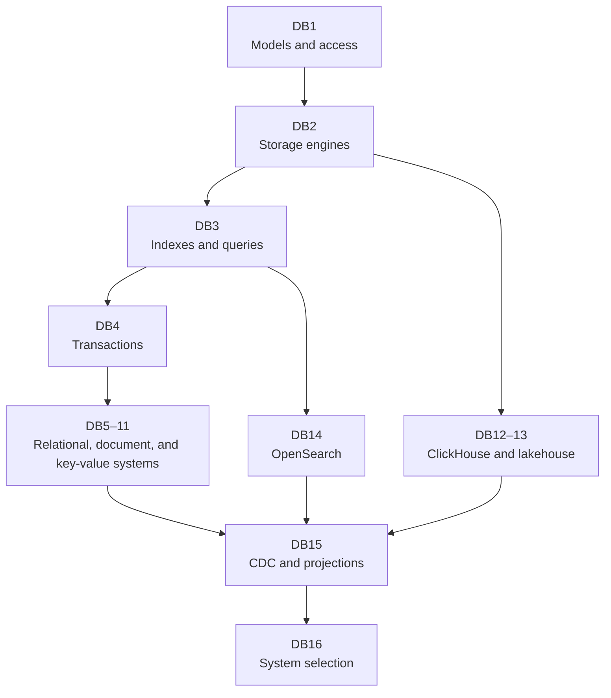

## Scope

How a database turns bytes on storage into an acknowledged write and a query result. The sequence starts with access patterns, pages, logs, trees, indexes, execution, and concurrency. Product notes then trace PostgreSQL, MySQL/InnoDB, MongoDB, Redis, DynamoDB, Cassandra, ClickHouse, Arrow, Parquet, Iceberg, and OpenSearch through their read, write, replication, maintenance, and recovery paths. The final notes connect those systems through change data capture and compare them against one workload without treating a product category as the answer.

This collection separates three levels that are often mixed together:

- A **data model** defines records, relationships, keys, and invariants visible to the application.
- A **storage engine** maps reads and writes onto memory, logs, pages, immutable files, indexes, and background work.
- A **distributed database** adds ownership, replication, routing, failure detection, repair, and recovery across machines.

The levels interact, but none substitutes for another. JSON syntax does not explain MongoDB replication. SQL does not tell you whether rows live in a heap or clustered primary-key tree. A partition key does not state the consistency or durability of an acknowledged write.

## How the collection fits together

## Reading order

The foundation notes establish terms used by every product-specific note:

1. Translate product operations into bounded access patterns and invariants.
2. Follow a write through a log, memory, pages or immutable files, and background maintenance.
3. Follow a query through indexes, statistics, planning, execution, memory, and I/O.
4. Separate atomicity, isolation, durability, locks, versions, deadlocks, and distributed commit.

After those foundations, PostgreSQL and MySQL show two different relational storage paths. MongoDB shows how document boundaries affect indexes, replication, and sharding. Redis and DynamoDB start with key-based APIs but make different durability, execution, and distribution choices. Cassandra develops the wide-column and LSM path, while ClickHouse develops the columnar analytic path. Arrow, Parquet, and lakehouse table formats then separate in-memory layout, durable files, object storage, and committed table state. OpenSearch develops text and vector retrieval from mappings through Lucene segments, distributed shards, and rebuilds. Change data capture joins authoritative stores to derived search, cache, and analytic state, and the last note compares the full set against one workload.

Each product note uses the same evidence order: vocabulary, one write, one read, access paths, concurrency, replication or sharding, maintenance, recovery, limits, and operator signals. That order makes differences visible without forcing unlike databases into one feature table.

## Distributed-systems depth by stage

| Data notes | Distributed background                                                                                                                                                                                                | Why to use it                                                      |
| ---------- | --------------------------------------------------------------------------------------------------------------------------------------------------------------------------------------------------------------------- | ------------------------------------------------------------------ |
| DB1–DB4    | None required                                                                                                                                                                                                         | The foundation defines the local storage and transaction terms     |
| DB5–DB7    | [DS7](../06-distributed-systems/07-replication-consistency-and-transactions.md); DB6 also uses [DS5](../06-distributed-systems/05-consensus-and-replicated-state-machines.md)                                         | Separate replica history, writer authority, and promotion          |
| DB8–DB11   | [DS3](../06-distributed-systems/03-failure-detection-gossip-membership.md) and [DS5–DS7](../06-distributed-systems/INDEX.md#learning-path)                                                                            | Follow membership, election, partitioning, consistency, and repair |
| DB12–DB14  | [DS6–DS8](../06-distributed-systems/INDEX.md#learning-path) when sharding or dataflow is unfamiliar                                                                                                                   | Follow distributed ownership, reduction, and checkpoints           |
| DB15–DB16  | [DS1](../06-distributed-systems/01-system-model-and-rpc.md), [DS2](../06-distributed-systems/02-time-causality-and-snapshots.md), and [DS7](../06-distributed-systems/07-replication-consistency-and-transactions.md) | Reason about ambiguous outcomes, ordering, replication, and commit |

Difficulty labels describe the depth inside a note, not another reading order. Read DB1–DB4 before the product notes even when application code already uses one of those products.

## Useful background

[Low-level storage and I/O](../02-low-level-infrastructure/04-storage-and-io.md) explains files, block devices, page cache, direct I/O, `fsync`, memory mapping, and `io_uring`. [Distributed systems](../06-distributed-systems/INDEX.md) derives time, replication, consensus, partitions, and repair. Neither is required before starting the first note; follow the links when the database explanation reaches an operating-system or distributed boundary that needs a slower treatment.
