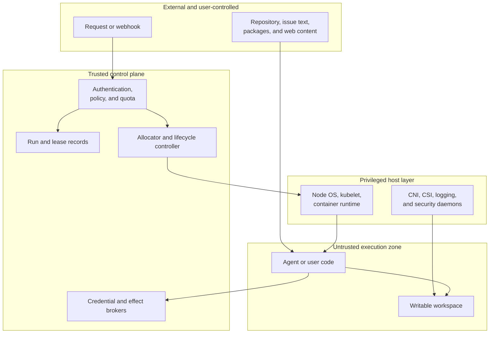
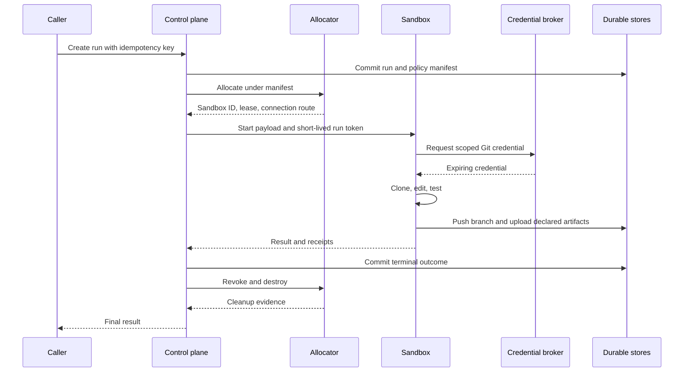

## Working model

A sandbox is a lease on a bounded computer. The useful contract says who may start it, what code may do inside it, which resources cross the boundary, what survives termination, and how the operator proves cleanup.

## Start with the workload, not the runtime

“Run this in Docker” answers how to start a process. It leaves the harder questions open:

- Can the process read the host checkout, the Docker socket, cloud instance metadata, or another tenant's files?
- Does it get a full Linux environment, a restricted WebAssembly interface, or one language interpreter?
- May it install packages, start background servers, bind ports, or run nested containers?
- Which outbound destinations can it reach, and under whose identity?
- If the node dies, what state returns: messages, files, processes, all three, or none?
- Who terminates abandoned work and bills the owner?

A notebook that evaluates one Python expression needs a different computer from a coding agent that builds a monorepo for four hours. A CI job needs completion and artifact semantics; an interactive development environment needs stable identity and stop/start behavior. A browser agent needs graphical processes and authenticated ingress. The word _sandbox_ covers all of them, so begin with a workload profile.

| Workload profile                 |        Typical lifetime | Process model                            | State expectation                                          | Common execution choice                              |
| -------------------------------- | ----------------------: | ---------------------------------------- | ---------------------------------------------------------- | ---------------------------------------------------- |
| Expression evaluator             | Milliseconds to seconds | One restricted program                   | Result only                                                | Language isolate or WebAssembly                      |
| Code interpreter                 |      Seconds to minutes | Several commands in one session          | Temporary files, optional exported artifacts               | Container, gVisor container, or managed sandbox      |
| CI or evaluation job             |        Minutes to hours | Entrypoint runs to completion            | Logs and declared artifacts                                | Kubernetes Job, VM, or ephemeral runner              |
| Coding-agent session             |        Minutes to hours | Shell, tools, servers, follow-up prompts | Working tree plus transcript; sometimes process continuity | Stateful container, gVisor, or microVM               |
| Personal development environment |         Hours to months | Full workstation-like environment        | Persistent workspace and configuration                     | VM, dev container, or persistent sandbox             |
| Hostile multi-tenant execution   |                     Any | User-supplied native code                | Usually disposable; explicit exports only                  | Hardware-isolated VM or carefully designed Wasm host |

No row chooses the full platform. Runtime, storage, routing, identity, and lifecycle remain separate decisions.

## Threats cross more than the kernel boundary

A useful threat model names both the actor and the asset. “The agent might run a bad command” is too vague to drive a design.

| Threat                                                 | Asset at risk                         | Control that addresses it                                                 |
| ------------------------------------------------------ | ------------------------------------- | ------------------------------------------------------------------------- |
| Model error deletes the checkout                       | Workspace files                       | Disposable clone, snapshot, Git remote, path-scoped writes                |
| Repository instructions induce credential theft        | API tokens and company data           | Secret broker, egress rules, approval policy, short-lived credentials     |
| Native exploit escapes the container                   | Node kernel and neighboring workloads | gVisor, Kata Containers, microVM, patched host, reduced privileges        |
| One tenant reads another tenant's residue              | Customer code and prompts             | Per-tenant sandbox, private write layer, verified cleanup, no dirty reuse |
| Fork bomb or memory growth harms neighbors             | Node CPU, memory, process IDs, I/O    | cgroups, quotas, timeouts, fair scheduling, separate node classes         |
| Compromised image or package poisons every run         | All sandboxes built from it           | Signed immutable artifacts, provenance, scanning, staged rollout          |
| Stolen control-plane token allocates arbitrary compute | Capacity and tenant environments      | API authentication, authorization, quotas, audit, request idempotency     |
| Sandbox calls the Kubernetes or cloud control plane    | Cluster and account resources         | No service-account token, workload-specific identity, metadata blocking   |
| Operator cannot reconstruct an incident                | Evidence and accountability           | External logs, run manifest, command receipts, network-flow records       |

The runtime boundary mainly addresses host escape. It does not stop a process from deleting a writable workspace or sending source code to an allowed domain. gVisor's security documentation explicitly permits applications to read and write files mapped into the sandbox; its job is to reduce direct exposure to the host system API. A sandbox therefore needs policy around the runtime, not faith in the runtime.

## Draw the trust zones



The privileged host layer deserves special attention. A CSI node plugin that mounts filesystems, a CNI agent that installs network policy, or a logging daemon that reads container logs may run with host access. Moving agent code behind gVisor does not make those daemons unprivileged; it makes their APIs and input validation part of the trusted computing base.

The trusted computing base, or TCB, is everything whose compromise can violate the promised boundary. For a microVM service it includes the hypervisor, host kernel, allocator, image builder, snapshot store, network fabric, and identity broker. For a Kubernetes gVisor design it includes the EKS control plane, nodes, `runsc`, containerd, admission policy, privileged DaemonSets, controllers, and credential broker. Count actual trusted components before calling one design “simpler.”

## Separate the control plane from the data plane

The control plane decides and records. The data plane executes and carries bytes.

Control-plane responsibilities usually include:

- authenticate the caller and resolve tenant, project, and permission tier;
- validate the requested image, resources, lifetime, network policy, and storage class;
- allocate a new environment or claim warm capacity;
- mint a lease and short-lived connection credentials;
- store the run-to-sandbox mapping and lifecycle state;
- terminate expired work, reconcile leaks, and publish audit records.

Data-plane responsibilities include running processes, reading and writing files, carrying stdout and stderr, forwarding approved network traffic, enforcing CPU and memory limits, and serving an authenticated shell or command API.

Do not place long model output, terminal bytes, or arbitrary application data in Kubernetes custom resources. Kubernetes custom resources are suitable for desired state and summarized status; the Kubernetes documentation warns against using them as a general application-data store. Stream output through a log or message system and store durable application records in a database or object store.

```text
control plane: create sandbox S for run R under policy P
data plane:    exec command C in S and return stream O
durable plane: store R, P, receipts, artifacts, and final outcome
```

A managed sandbox provider supplies some or all of these planes behind an API. A self-hosted design must assign each responsibility to a named component.

## One “session” contains several kinds of state

The word _stateful_ hides different recovery promises.

| State            | Example                                                | Natural owner                                          | Survives process restart? | Survives sandbox replacement?          |
| ---------------- | ------------------------------------------------------ | ------------------------------------------------------ | ------------------------- | -------------------------------------- |
| Conversation     | Model messages and tool results                        | Application database or model-session store            | If persisted              | If restored deliberately               |
| Workflow         | Phase, approvals, operation IDs, leases                | Application database                                   | Yes                       | Yes                                    |
| Filesystem       | Checkout, edits, dependencies, test artifacts          | Ephemeral disk, volume, Git, snapshot, or object store | Depends on storage        | Only with a discoverable restore point |
| Process          | Shell cwd, environment variables, servers, REPL memory | Running OS or memory snapshot                          | Usually no                | Only with memory/process snapshot      |
| External effects | Branch push, issue update, cloud mutation              | Git host or remote service                             | Yes                       | Yes; reconcile before retry            |
| Cache            | Image layers, package cache, clean filesystem blocks   | Registry or node-local disk                            | Maybe                     | It should affect latency only          |

Restoring a model transcript does not restore an unpushed file. Reattaching an EBS volume does not recreate a Python process. Resuming a memory snapshot does not prove that a previously attempted Git push completed. Recovery code needs independent evidence for each row.

This distinction also explains prompt caching. A resumed agent conversation may still benefit from a model provider's prefix cache if the serialized prompt prefix remains byte-for-byte eligible under that provider's rules. Filesystem persistence neither creates nor prevents prompt caching; they operate on different state.

## Define the sandbox contract

Before implementation, write one record that could answer an incident responder's questions:

```yaml
sandbox_contract:
  tenant_id: tenant-42
  run_id: run-018f
  image_digest: sha256:...
  filesystem_template_id: fs-7f3
  runtime_class: gvisor
  cpu_request: "2"
  memory_limit: 8Gi
  workspace:
    mode: disposable-clone
    export: git-branch
  network:
    ingress: broker-only
    egress_policy: github-and-model-api
  identity:
    service_account_token: false
    git_credential_ttl_seconds: 3600
  lifetime:
    hard_deadline_seconds: 14400
    idle_timeout_seconds: 900
  policy_version: agent-reviewer-v12
```

The effective record should contain resolved digests and policy versions, not just mutable names such as `runner:latest` or `default-policy`. Keep secrets out of it. Store references to secret versions or grants, then record when the broker issued and revoked them.

Three lifetimes matter:

1. **Allocation lifetime.** How long the compute object exists.
2. **Authority lifetime.** How long its credentials and lease permit effects.
3. **retention lifetime.** How long transcripts, snapshots, logs, and artifacts remain discoverable.

Stopping compute must not leave authority valid indefinitely. Deleting compute must not silently delete the only copy of an output the product promised to retain.

## Follow one run end to end

Suppose a user asks an agent to repair a parser. A safe path looks like this:



The control plane commits the run before allocating expensive capacity, but creation remains idempotent so a retry does not allocate twice. The runner receives only the authority needed for this run. Completion is not “the model stopped talking”; it means declared outputs reached durable owners and the control plane recorded their receipts. Cleanup follows even when the run fails or the caller disconnects.

## Ask six questions of any sandbox product

1. What is the isolation boundary, and what still shares a host kernel or privileged daemon?
2. Which lifecycle object has stable identity: request, session, container, Pod, VM, workspace, or snapshot?
3. Which state survives stop, crash, node loss, image upgrade, and explicit deletion?
4. How are ingress, egress, cloud identity, secrets, and external effects mediated?
5. What does the customer operate: hosts, Kubernetes, images, snapshots, routers, controllers, or only API calls?
6. How does an operator prove allocation, policy, artifact publication, revocation, and cleanup for one run?

A vendor startup-time number cannot answer any of them.

## Summary

- A sandbox is a lease on bounded execution, not a synonym for container or VM.
- Begin with workload and threat profiles, then choose runtime, storage, network, identity, and lifecycle separately.
- The runtime protects a host boundary; workspace integrity, credential scope, egress, and effect authority need their own controls.
- Conversation, workflow, filesystem, process, external effects, and cache state have different owners and recovery paths.
- Record an effective manifest with immutable artifact identities, policy versions, lifetimes, and cleanup evidence.

## References

- [Kubernetes custom resources](https://kubernetes.io/docs/concepts/extend-kubernetes/api-extension/custom-resources/)
- [Kubernetes workloads](https://kubernetes.io/docs/concepts/workloads/)
- [gVisor security model](https://gvisor.dev/docs/architecture_guide/security/)
- [Firecracker design](https://github.com/firecracker-microvm/firecracker/blob/main/docs/design.md)
- [Wasmtime security](https://docs.wasmtime.dev/security.html)
- [Docker Sandboxes security model](https://docs.docker.com/ai/sandboxes/security/)
- [GitHub self-hosted runner security and autoscaling](https://docs.github.com/en/actions/reference/runners/self-hosted-runners)
