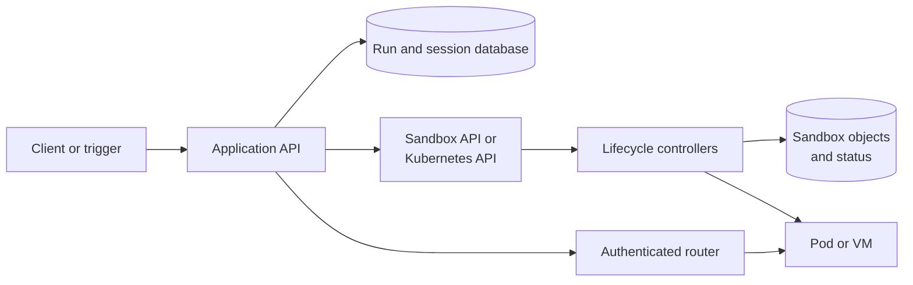
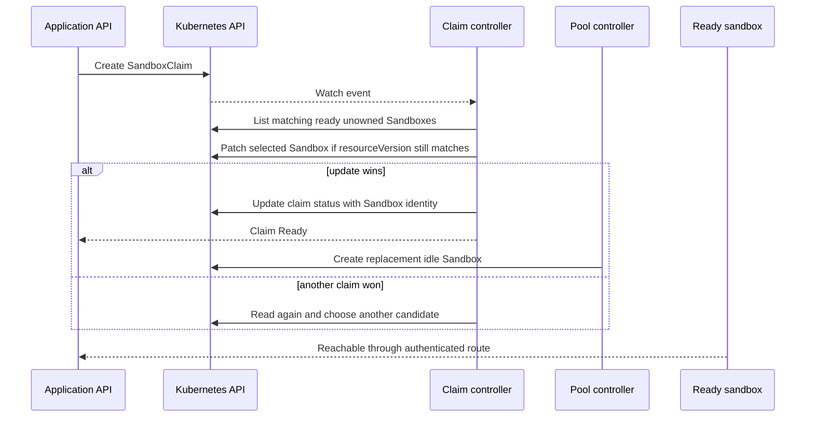
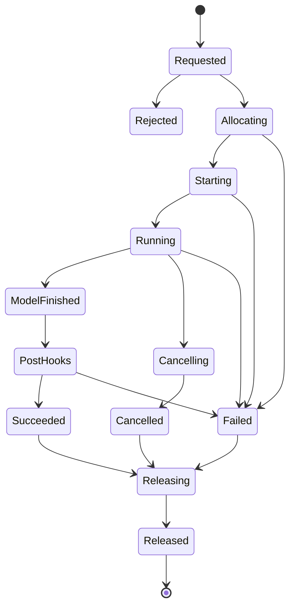

## Working model

Allocation is a distributed ownership transfer. The control plane must make one sandbox belong to one run, publish a route and lease, survive retries, and later revoke every path back into that environment.

## The application and infrastructure control planes have different jobs

An agent platform normally has two related control planes.

The application control plane understands users, sessions, prompts, permission tiers, model configuration, external integrations, and product-visible run states. Its durable database should answer questions such as “which run owns this sandbox?” and “may this user add another prompt?”

The infrastructure control plane understands Pods or VMs, images, volumes, readiness, routes, shutdown deadlines, and capacity pools. Kubernetes controllers or a managed sandbox provider often implement this half.



Keep the join explicit:

```text
session_id -> run_id -> allocation_id -> sandbox_id -> pod_or_vm_id
```

The application database is the usual authority for the first three mappings. Infrastructure status proves what currently exists. Labels and annotations copy identifiers onto resources for routing, search, metrics, and incident work; they should not replace the database record or act as secrets.

## CRD and CR are type and instance

Kubernetes knows built-in kinds such as `Pod`, `Service`, and `Job`. A **CustomResourceDefinition** (CRD) registers another kind and its schema with the Kubernetes API. A **custom resource** (CR) is one object of that kind.

Installing a `SandboxClaim` CRD is analogous to creating a database table definition. Creating `claim-parser-42` is analogous to inserting one typed row, although the Kubernetes API also supplies metadata, versions, watches, and optimistic concurrency. The CR stores desired state and summarized status. A controller watches it and creates or patches other objects until observed state approaches desired state.

```text
CRD: SandboxClaim is a valid API kind
CR:  claim-parser-42 asks for one sandbox
controller: turns the request into owned runtime resources
```

The CRD alone runs nothing. The controller is the active component.

## Templates, claims, instances, and pools answer different questions

A general sandbox API benefits from four separate objects:

| Object   | Question it answers                                                 | Typical mutability                      |
| -------- | ------------------------------------------------------------------- | --------------------------------------- |
| Template | What should environments of this class contain and permit?          | Versioned or updated through deployment |
| Pool     | How much idle capacity of one template should exist?                | Replica target and policy change        |
| Claim    | Who requests one environment, under which overrides and deadline?   | Mostly immutable after admission        |
| Sandbox  | Which concrete singleton environment exists and what is its status? | Controller-managed lifecycle and status |

The Kubernetes SIG Apps Agent Sandbox project implements this shape with `SandboxTemplate`, `SandboxWarmPool`, `SandboxClaim`, and `Sandbox`. The core `Sandbox` manages a stable singleton workload; extension controllers add templates, claims, and warm pools. As of July 2026, current documentation uses the `v1beta1` extension API, while older design documents may still show `v1alpha1` fields.

An illustrative claim looks like this:

```yaml
apiVersion: extensions.agents.x-k8s.io/v1beta1
kind: SandboxClaim
metadata:
  name: parser-repair-42
  labels:
    platform.example/run-id: run-42
spec:
  warmPoolRef:
    name: reviewer-python
```

The user does not need the entire Pod specification. Admission and controller policy decide which claim fields may override the pool template. That prevents a caller from turning “give me a Python sandbox” into “mount the host root and run privileged.”

Agent Sandbox is one implementation, not the definition of the pattern. A standalone service can expose the same four concepts in PostgreSQL and allocate Firecracker VMs, while a managed provider may call them images, snapshots, sandboxes, and lifecycle policies.

## A warm claim adopts work that already happened

A cold claim creates a concrete environment and waits through scheduling, image pull, volume setup, boot, and readiness. A warm claim selects a ready unowned environment whose template and policy match.



The important action is the conditional ownership update. Two controllers may read the same ready candidate. Only one update against the observed `resourceVersion` should succeed; the loser receives a conflict and retries with fresh state. Deterministic hashing or a randomized starting offset can spread claim attempts across a candidate window, reducing collisions without becoming the correctness mechanism.

A search window of 50 does not require a 50-sandbox pool. It means “consider no more than 50 candidates during this attempt.” If only 12 candidates exist, the controller can examine at most 12. A window much larger than the pool adds no distribution benefit and may add API and sorting work; a window smaller than a large busy pool can miss available candidates. Measure collision and allocation latency before changing it.

Never return a claimed environment to the idle pool merely because its command finished. The safe default is to destroy it and let the pool create a fresh replacement. Reuse requires a proved reset protocol for files, processes, credentials, mounts, local databases, shell history, network connections, and tenant labels. A missed category becomes a cross-run data leak.

## Patching a run ID changes metadata, not the filesystem

Suppose a warm Pod has already started under a generic pool identity. After a claim wins, a controller may issue a Kubernetes `PATCH` that adds:

```yaml
metadata:
  labels:
    platform.example/run-id: run-42
    platform.example/claim-id: parser-repair-42
```

This does not rebuild the image, restart the container, or inject files into a filesystem template. It changes the Pod object's metadata. The labels can drive log enrichment, metrics, policy selection, or router lookup.

A running process can observe selected Pod metadata through the **downward API**. There are two delivery forms:

- Environment variables are fixed when the container starts. Patching a label later does not update an existing environment variable.
- A `downwardAPI` volume exposes labels or annotations as files. Kubelet refreshes those projected files atomically, so a runner may watch a mounted file and notice a later claim. Refresh is eventually observed rather than an immediate transactional wake-up, and a `subPath` mount does not receive updates.

If assignment latency and acknowledgement matter, use an explicit start protocol as well:

```http
POST /runs/run-42/start
Authorization: Bearer <one-run-token>
X-Sandbox-ID: sandbox-a91
Idempotency-Key: claim-7d2
```

The metadata patch remains useful for infrastructure evidence. The authenticated request gives the runner a payload, an idempotency boundary, and a response that proves it accepted the assignment. Do not place a secret in a label; labels are broadly visible to cluster readers and observability systems.

## The runner should fetch payloads rather than inherit privileged configuration

A warm image cannot contain run-specific prompts or credentials. At assignment time the runner should receive a narrow bootstrap identity, then fetch its effective manifest from the application API:

```text
run ID + one-run bootstrap token
  -> fetch prompt, policy version, tool tier, and artifact references
  -> request short-lived credentials from brokers as needed
  -> acknowledge manifest hash
  -> start model loop
```

This keeps long-lived Slack, ticketing, cloud-administration, and workflow credentials in the trusted application plane. Pre-run hooks, post-run hooks, and failure hooks can also run there when their job is to update privileged systems. The sandbox receives a typed result or a scoped temporary grant rather than the control plane's credential.

The split is not a claim that hooks are safe by location alone. Their input still includes untrusted model output and repository data, so validate arguments and enforce the same authority contract before each effect.

## Use an explicit state machine

Pod phases are too coarse for product behavior. A Pod can be `Running` while the sandbox is unclaimed, waiting for a payload, executing a model, finishing hooks, or stuck during cleanup.



`Succeeded`, `Failed`, and `Cancelled` describe the run outcome. `Released` proves compute, routes, leases, and credentials were cleaned up. Keep both. A cleanup controller can continue working after the user sees a terminal result.

Define which states accept another prompt. For example:

```text
prompt-accepting = {Starting, Running}
allocation-owning = {Allocating, Starting, Running, ModelFinished, PostHooks, Cancelling, Releasing}
terminal-outcome = {Succeeded, Failed, Cancelled}
```

If `PostHooks` is excluded from prompt-accepting states, a user follow-up after model execution may create a new run even though the old run still owns a sandbox while hooks finish. That can be intentional: the old process no longer accepts model input, and privileged portal work should not block the next turn. It can also consume two sandboxes briefly. Make the policy visible instead of treating “active” as one universal Boolean.

## Close the check-then-create race in the database

This code is unsafe:

```text
if no active run exists for session:
    insert run
```

Two requests can both pass the check and insert. Use one transaction plus a uniqueness rule over the states that count as prompt-accepting or allocation-owning. In PostgreSQL, a partial unique index can express one policy:

```sql
CREATE UNIQUE INDEX one_prompt_accepting_run_per_session
ON agent_run (session_id)
WHERE state IN ('ALLOCATING', 'STARTING', 'RUNNING');
```

The insertion winner owns the new run. The loser reads the winning row and either attaches the prompt or returns a conflict. This closes the check-then-insert race because the database arbitrates the write.

Audit events need the same care. If code inserts a `RunRequested` event before attempting the constrained run row, a race loser can leave an event that points to no accepted run. That is not necessarily data corruption; it may be a useful record of a rejected attempt. Name it as an attempt, link it to an idempotency key, and record the conflict outcome. Otherwise insert it in the same transaction as the winning row or remove orphan attempts after a retention interval.

## Claims, leases, and fencing solve different problems

A claim chooses a resource. A lease grants time-bounded authority to operate it. A fencing token rejects a former owner that resumes after takeover.

Suppose worker A owns sandbox S with lease epoch 7. A network pause hides A, the lease expires, and worker B acquires epoch 8. If A later wakes, a timestamp check inside A is insufficient. Every durable write and privileged broker call should carry epoch 7; the receiver compares it with current epoch 8 and rejects A.

```text
claim:  run-42 is assigned sandbox-a91
lease:  worker-b may operate run-42 until 14:35:00
epoch:  accepted writes must carry 8
```

Kubernetes owner references help garbage collection understand that one API object depends on another. They are not an application lease, user authorization rule, or fencing mechanism. An owner reference identifies a managing object and influences deletion; it does not prove that a stale process stopped issuing external requests.

## Reconcile observed state instead of trusting one callback

Controllers and application workers can crash between any two writes. Reconciliation rereads authorities and advances toward a stable outcome.

| Observed condition                                       | Reconciliation action                                            |
| -------------------------------------------------------- | ---------------------------------------------------------------- |
| Run says `ALLOCATING`, no claim exists                   | Create claim using the run's idempotency identity                |
| Claim exists and is ready, run lacks sandbox ID          | Verify tenant and template, then fill mapping conditionally      |
| Run is terminal, sandbox still exists                    | Revoke credentials and request deletion                          |
| Sandbox disappeared while run says `RUNNING`             | Mark execution lost, inspect durable outputs, apply retry policy |
| Claim exists with no application run                     | Quarantine, then delete after checking creation audit            |
| Route points at a Pod whose UID differs from the mapping | Stop traffic; a name was reused or status is stale               |
| Lease expired while process may still run                | Fence writes first, then cancel and replace                      |

Use Pod or VM UIDs, not names alone. Kubernetes can recreate an object with the same name and a different UID. The tuple `(namespace, name, UID)` identifies the observed incarnation.

Finalizers can hold deletion while a controller performs required cleanup, but they can also wedge resources forever when the controller is broken. Every finalizer needs a timeout, operator visibility, and a documented forced-removal procedure that describes what cleanup may be skipped.

## Keep routing separate from discovery

A headless Kubernetes Service and stable DNS name can expose one sandbox inside a cluster. An external or multi-tenant client should still pass through an authenticated router:

```text
client
  -> control-plane authentication
  -> route token scoped to sandbox ID and port
  -> router resolves current Pod UID and address
  -> sandbox command or HTTP server
```

Do not trust a caller-supplied `X-Sandbox-ID` by itself. Bind the route token to tenant, sandbox, allowed protocol or port, expiry, and optionally run lease epoch. Revalidate the current mapping before forwarding. A stale DNS record or recycled name must not cross tenant boundaries.

## Summary

- The application database owns user-visible run and authority state; the infrastructure control plane owns concrete resource status.
- A CRD defines an API kind, a CR requests one instance, and a controller performs reconciliation.
- Templates describe classes, pools hold idle supply, claims request ownership, and sandbox objects represent concrete singleton environments.
- Warm adoption needs a conditional ownership update. Candidate hashing reduces collisions but does not provide correctness.
- Patching a run-ID label changes metadata. A downward API volume can expose later updates; environment variables cannot.
- Product states, allocation states, and cleanup states should remain separate. Database uniqueness, leases, fencing, and reconciliation close different failure windows.

## References

- [Agent Sandbox documentation](https://agent-sandbox.sigs.k8s.io/docs/)
- [Agent Sandbox repository and architecture](https://github.com/kubernetes-sigs/agent-sandbox)
- [Agent Sandbox API migration guide](https://agent-sandbox.sigs.k8s.io/docs/getting_started/api-migration-guide/)
- [Agent Sandbox volume claim templates](https://agent-sandbox.sigs.k8s.io/docs/volumes/volume-claim-template/)
- [Kubernetes custom resources](https://kubernetes.io/docs/concepts/extend-kubernetes/api-extension/custom-resources/)
- [Kubernetes API concepts and resource versions](https://kubernetes.io/docs/reference/using-api/api-concepts)
- [Kubernetes owner references](https://kubernetes.io/docs/reference/kubernetes-api/definitions/owner-reference-v1-meta/)
- [Kubernetes downward API](https://kubernetes.io/docs/concepts/workloads/pods/downward-api/)
- [Expose Pod metadata through downward API files](https://kubernetes.io/docs/tasks/inject-data-application/downward-api-volume-expose-pod-information/)
- [Kubernetes finalizers](https://kubernetes.io/docs/concepts/overview/working-with-objects/finalizers/)
