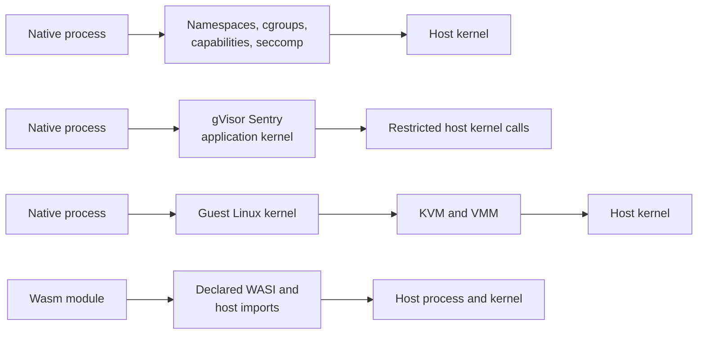
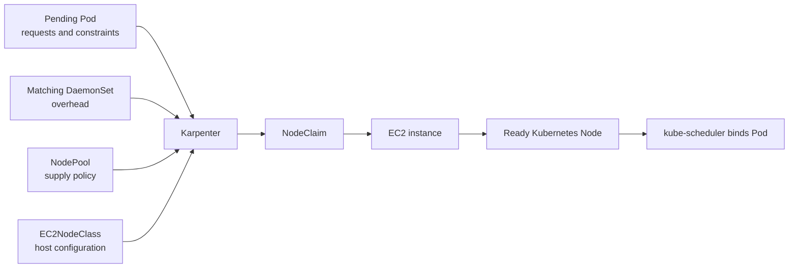

## Working model

Isolation and capacity are two stacks. The runtime decides which host interfaces guest code can reach; the compute system decides which machine exists, which workloads share it, and who replaces it.

## An ordinary container still uses the host kernel

OCI runtimes such as `runc` create processes using Linux primitives:

- namespaces provide separate views of process IDs, mounts, users, networking, IPC, and hostnames;
- cgroups account for and limit CPU, memory, process counts, and I/O;
- capabilities split some root powers so a process can drop most of them;
- seccomp filters system calls;
- LSMs such as AppArmor or SELinux apply host-kernel access policy;
- a container root filesystem supplies files without booting another kernel.

This is real isolation, but the contained process still asks the host Linux kernel to implement its system calls. A kernel vulnerability reachable through the allowed surface may become an escape. Mounting `/var/run/docker.sock`, the host root, a privileged device, or broad host paths can bypass the intended boundary without any kernel exploit.

For single-tenant automation that runs your own code, a hardened container may be the right answer. For hostile multi-tenant native code, the shared kernel deserves a stronger boundary.



## Process sandboxes restrict a program without supplying another computer

Bubblewrap, Linux namespaces, Landlock, macOS sandbox profiles, and tools such as Anthropic's experimental Sandbox Runtime can restrict filesystem and network access around a local process. Startup is cheap, and they work well for developer laptops or CI steps where a full container platform would be excessive.

Their security depends on the host OS, policy correctness, and which handles cross the boundary. A permitted Unix socket can be more powerful than a permitted directory: access to Docker's socket can become control of the host daemon. A domain allowlist such as `github.com` permits more than cloning one approved repository; it may also permit exfiltration to another repository unless an authenticated proxy constrains the account and operation.

Process sandboxing and gVisor solve different problems. A process sandbox can express path-level policy on the current host. gVisor supplies another implementation of the Linux system interface to reduce host-kernel exposure. One does not automatically replace the other.

## gVisor inserts an application kernel

gVisor's `runsc` implements the OCI runtime interface. The sandboxed process sees Linux, but many system calls and page faults go to the **Sentry**, a userspace application kernel written in Go. Filesystem access may be mediated through a **Gofer** or direct file-descriptor-based paths under gVisor's restrictions. Network traffic can use gVisor's userspace network stack.

The Sentry does not pass a guest system call straight to the host with guest-controlled arguments. It implements the requested behavior and makes a smaller set of its own host calls. This reduces the host kernel surface reachable from untrusted code and introduces a different code base between guest and host.

gVisor is not a general command-deny engine. A process can normally call `unlink`, write files, or open network connections that the sandbox configuration exposes. Intercepting a system call means gVisor implements it; interception does not mean automatic denial. Protect important workspace files with mount policy, disposable copies, application authorization, or OS policy inside the sandbox contract.

Compatibility and performance come from the same design:

- System calls, `/proc`, `/sys`, filesystems, and device behaviors not implemented by gVisor may fail or differ.
- Syscall-heavy builds, metadata-heavy filesystems, ptrace, eBPF, low-level networking, and nested container workloads need tests.
- CPU-bound user code may see less relative overhead because fewer operations cross the application-kernel boundary.
- A workload that needs a real kernel feature may require a VM-backed runtime instead.

Never paste a percentage overhead from another workload into a capacity plan. Run the actual compiler, package manager, browser, test suite, and filesystem pattern against the selected gVisor platform.

## MicroVMs put a guest kernel behind virtual hardware

Firecracker is a virtual machine monitor built on Linux KVM. Each Firecracker process owns one microVM with virtual CPUs, memory, minimal VirtIO block and network devices, and a host-facing API. The guest boots its own Linux kernel.

Hardware virtualization provides a different isolation boundary from a shared-kernel container or gVisor. Firecracker still requires a production host design:

- the `jailer` drops privileges and applies namespaces, cgroups, and seccomp around the VMM;
- TAP devices and host networking carry guest packets;
- file-backed block devices hold guest disks;
- image, kernel, disk, snapshot, and metadata files need integrity and access control;
- the service around Firecracker must allocate IDs, IPs, storage, routes, quotas, and cleanup.

Firecracker does not filter guest egress for you. Its design documentation assigns traffic filtering to host integration. It also does not manage a fleet or package snapshots into a product. E2B and AWS Lambda MicroVMs are examples of higher-level services built around microVM mechanics.

Snapshot restore changes boot economics. Firecracker can map snapshot memory privately and demand-page it, with guest writes going to copy-on-write memory. The snapshot includes guest memory and virtual-device state; disk backing files remain separately managed. Cloning a snapshot can duplicate machine IDs, random state, credentials, IP configuration, and clock assumptions, so a resume or clone hook must restore uniqueness.

## Kata Containers makes VM isolation look like a container runtime

Kata Containers integrates lightweight virtual machines with containerd and Kubernetes. A Pod can run inside a VM-backed boundary while still using a Pod specification, image, and `RuntimeClass`. Kata packages a guest kernel, an in-guest agent, a containerd shim, and a selected hypervisor such as Cloud Hypervisor, QEMU, or Firecracker.

This is attractive when a team wants Kubernetes scheduling and policy plus a guest kernel. It adds nested-virtualization or bare-metal requirements, guest-image and kernel maintenance, more moving parts at startup, and a networking and storage path that crosses the VM boundary.

Kata and raw Firecracker are not direct substitutes. Kata integrates virtualized Pods into the container ecosystem. Firecracker is a lower-level VMM from which a platform team can build a custom VM service.

## WebAssembly narrows the interface instead of emulating a machine

WebAssembly runtimes such as Wasmtime execute modules with isolated linear memory and no ambient system calls. Files, clocks, randomness, sockets, and other outside capabilities arrive only through imports such as WASI interfaces supplied by the host.

That is a strong fit for expression evaluation, plugins, deterministic graders, and user functions that compile to supported Wasm targets. It is a poor fit for an unrestricted coding agent that expects arbitrary Linux packages, shell behavior, Docker, browsers, kernel features, and native binaries.

The embedder becomes part of the TCB. A host function that accepts an arbitrary path and opens it without validation can puncture the Wasm boundary. Resource fuel, memory limits, deadlines, output limits, and safe terminal rendering remain necessary.

## Compare the isolation contracts

| Choice                  | Guest interface                            | Kernel boundary                                 | Linux compatibility                          | Typical startup                    | Operator work                                            |
| ----------------------- | ------------------------------------------ | ----------------------------------------------- | -------------------------------------------- | ---------------------------------- | -------------------------------------------------------- |
| Hardened OCI container  | Native Linux                               | Shared host kernel                              | Highest                                      | Low                                | Container hosts, images, policy                          |
| Local process sandbox   | Host process plus restricted paths/network | Shared host kernel                              | High within policy                           | Very low                           | Per-OS rules and update testing                          |
| gVisor                  | Reimplemented Linux system interface       | Userspace application kernel before host kernel | High, with missing or different features     | Low                                | `runsc`, node integration, compatibility testing         |
| Kata Containers         | Guest Linux in lightweight VM              | Hardware virtualization                         | High                                         | Higher than a container            | Guest kernel, runtime, virtualization-capable nodes      |
| Raw Firecracker service | Guest Linux in microVM                     | Hardware virtualization                         | High within prepared guest                   | Depends on boot or snapshot system | Full VM control plane, host networking, disks, snapshots |
| WebAssembly             | Wasm plus explicit imports                 | Language-runtime sandbox inside host process    | Limited to compiled modules and exposed APIs | Very low                           | Embedder, capability API, runtime limits                 |

“Stronger” needs a named threat. A microVM may reduce cross-tenant kernel risk while a careless workspace mount still exposes the host checkout. A Wasm evaluator may have a smaller interface but cannot run the required toolchain. Choose the weakest boundary that satisfies the actual threat model and feature contract, then add defense around it.

## Kubernetes selects runtimes through RuntimeClass

Kubernetes `RuntimeClass` lets a Pod request a configured container-runtime handler:

```yaml
apiVersion: node.k8s.io/v1
kind: RuntimeClass
metadata:
  name: gvisor
handler: runsc
---
apiVersion: v1
kind: Pod
metadata:
  name: parser-sandbox
spec:
  runtimeClassName: gvisor
  nodeSelector:
    workload: agent-sandbox
  containers:
    - name: runner
      image: registry.example/runner@sha256:abc123
```

The field does not install `runsc`. Every eligible node needs the handler configured in containerd, any needed kernel modules, and compatible CNI and CSI components. Scheduling must keep the Pod away from nodes that lack it. A `RuntimeClass` may include scheduling constraints and overhead, or the Pod can use node selectors, affinity, taints, and tolerations.

For Kata, the handler points to the Kata containerd shim. For an ordinary container it points to the standard OCI runtime. Admission policy should reject sensitive sandbox classes that omit the required runtime or land on the wrong node pool.

## DaemonSets put one infrastructure Pod on each eligible node

A **DaemonSet** maintains a Pod on every matching node rather than a chosen replica count. CNI agents, CSI node plugins, log collectors, image pre-pullers, security agents, and node-local caches commonly use it.

Compare the major workload controllers:

| Controller         | Desired shape                                                                      |
| ------------------ | ---------------------------------------------------------------------------------- |
| Deployment         | A replaceable replica count, rolled out from one Pod template                      |
| StatefulSet        | Numbered replicas with stable identities and optional per-replica claims           |
| DaemonSet          | One Pod on each eligible node                                                      |
| Job                | One or more Pods that run to completion                                            |
| CronJob            | A scheduled series of Jobs                                                         |
| Sandbox controller | A singleton session with lifecycle semantics outside built-in workload controllers |

A privileged CSI or CNI DaemonSet belongs to the host trust zone even if agent Pods use gVisor. Limit its node set, image identity, host mounts, capabilities, API permissions, and accepted inputs.

## EKS manages the Kubernetes control plane, not every node decision

Amazon EKS operates the Kubernetes API-server and etcd availability path. A standard EKS data plane may combine:

- a small managed node group that keeps DNS, network, storage, admission, and autoscaler controllers alive;
- dynamically created application nodes;
- dedicated sandbox nodes with a custom AMI;
- separate GPU or high-memory pools;
- Fargate for supported Pods that do not need DaemonSets, EBS mounts, privileged containers, alternate CNIs, or custom runtimes.

A fixed system node group means a baseline supply mechanism with a nonzero floor. The instances remain replaceable; “fixed” does not mean immortal. Keeping Karpenter itself and required cluster daemons off a fleet that Karpenter may reduce to zero prevents a circular recovery dependency.

EKS Auto Mode takes ownership of more of the node, networking, load-balancing, DNS, and block-storage path. That is useful for ordinary workloads. A sandbox platform that needs a custom AMI, `runsc`, the NBD kernel module, a privileged CSI DaemonSet, or unusual CNI chaining usually needs standard EC2 nodes because those host details are part of the platform contract.

## Karpenter turns Pending Pod constraints into nodes

Karpenter watches unschedulable Pods and calculates a machine that could host them. Three objects separate policy from one concrete launch:

- `NodePool` states allowed supply, labels, taints, aggregate limits, and disruption behavior.
- On AWS, `EC2NodeClass` selects AMIs, subnets, security groups, instance profile or role, block devices, and bootstrap configuration.
- `NodeClaim` represents one concrete machine request derived from pending demand.



Karpenter does not create sandbox claims or change a warm pool's desired replicas. It supplies nodes after Pods exist and cannot fit. The scheduler still binds Pods.

Scale-out may fail because no permitted instance satisfies the requests, the subnet has no addresses, EC2 lacks capacity, the account lacks quota, the AMI cannot boot, the node role cannot join, or DaemonSet overhead consumes the shape. “Karpenter is broken” skips the useful evidence chain.

Consolidation removes waste by replacing or deleting nodes when workloads can fit more efficiently. Drift replaces nodes that no longer match current configuration. Pod disruption blockers and budgets can delay voluntary replacement, but they do not protect against hardware loss. Long-lived `do-not-disrupt` annotations can also block AMI security rollout, so pair them with a deadline and state-preservation plan.

## Packing does not erase isolation

A scheduler profile that prefers **MostAllocated** nodes packs eligible Pods onto machines that already have allocated CPU and memory. Packing leaves more nodes completely empty, which can reduce cost and improve consolidation.

Suppose a node has 16 vCPU and 64 GiB allocatable. Four sandboxes each request 2 vCPU and 8 GiB:

```text
requested CPU    = 4 × 2 = 8 vCPU
requested memory = 4 × 8 = 32 GiB
```

The scheduler fits by requests, not current usage. CPU limits or shares determine runtime contention; memory limits can cause OOM termination. gVisor or VM boundaries isolate system interfaces, while cgroups isolate resource accounting. Multiple sandboxes can share a node and remain separate security domains, subject to residual side channels and the host components they still share.

Packing changes failure concentration. Losing one packed node can kill more sessions, and all tenants still share hardware caches, memory bandwidth, storage, NICs, and host daemons. Use anti-affinity or topology spread for workloads whose availability requires separate nodes or zones. Dedicated nodes reduce co-tenancy but cost more and do not replace runtime isolation.

## Build a custom node image only when the host contract requires it

A custom AMI can preinstall:

- `runsc` or Kata components and containerd handler configuration;
- NBD or other kernel modules;
- node-monitoring and incident tooling;
- required CNI and CSI host dependencies;
- hardened sysctls, package versions, and bootstrap checks.

Build it through a reproducible image pipeline, scan it, test it by launching a real node, and publish an immutable AMI identity. Karpenter drift can roll nodes to a new AMI, but only if disruption and capacity policy allow replacements.

The image should not contain tenant secrets or mutable application state. Treat nodes as replaceable. If a sandbox can resume only because one old node still has an undocumented cache file, that file has become an accidental database.

## Summary

- Containers isolate processes while sharing the host kernel. gVisor inserts an application kernel; Kata and Firecracker add a guest kernel; Wasm exposes a narrower capability interface.
- gVisor reduces host-kernel exposure but does not automatically block destructive writes inside the sandbox.
- Firecracker is a VMM, not a fleet, network-policy, disk-management, or sandbox-lifecycle service.
- `RuntimeClass` selects a configured runtime handler; it does not install one. DaemonSets place node infrastructure on each eligible machine.
- Standard EKS nodes preserve host control needed by custom runtimes, kernel modules, and privileged storage or network daemons.
- Karpenter supplies nodes from Pending Pod constraints. The scheduler binds Pods, and the warm-pool controller controls idle sandbox count.
- Packing improves node use while cgroups and runtimes preserve separate resource and execution boundaries; it also concentrates node-failure impact.

## References

- [OCI Runtime Specification](https://github.com/opencontainers/runtime-spec)
- [Kubernetes RuntimeClass](https://kubernetes.io/docs/concepts/containers/runtime-class/)
- [Kubernetes DaemonSet](https://kubernetes.io/docs/concepts/workloads/controllers/daemonset/)
- [gVisor architecture](https://gvisor.dev/docs/architecture_guide/intro/)
- [gVisor security model](https://gvisor.dev/docs/architecture_guide/security/)
- [gVisor production guide](https://gvisor.dev/docs/user_guide/production/)
- [Firecracker design](https://github.com/firecracker-microvm/firecracker/blob/main/docs/design.md)
- [Firecracker snapshot support](https://github.com/firecracker-microvm/firecracker/blob/main/docs/snapshotting/snapshot-support.md)
- [Kata Containers architecture](https://katacontainers.io/software/)
- [Wasmtime security](https://docs.wasmtime.dev/security.html)
- [Anthropic Sandbox Runtime](https://github.com/anthropic-experimental/sandbox-runtime)
- [Amazon EKS compute options](https://docs.aws.amazon.com/eks/latest/userguide/eks-compute.html)
- [Amazon EKS Auto Mode](https://docs.aws.amazon.com/eks/latest/userguide/automode.html)
- [Karpenter NodePools](https://karpenter.sh/docs/concepts/nodepools/)
- [Karpenter NodeClaims](https://karpenter.sh/docs/concepts/nodeclaims/)
- [Karpenter disruption](https://karpenter.sh/docs/concepts/disruption/)
