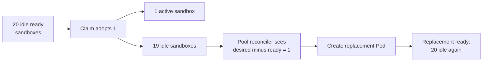
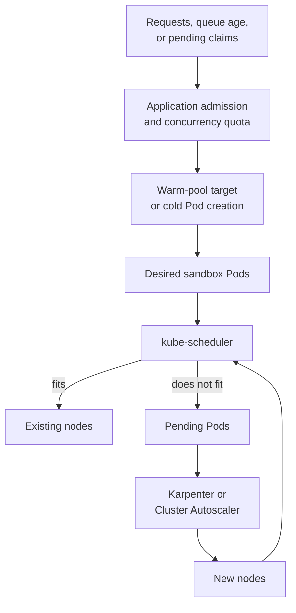
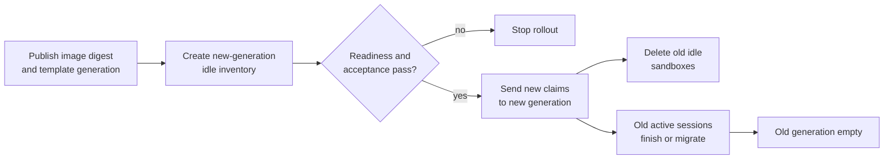

## Working model

Warmth moves work before demand arrives. It does not remove the work, and every kind of warm state has a different owner, cost, invalidation rule, and failure mode.

## Measure the cold path before building a pool

A cold sandbox start is a chain rather than one number:

```text
admission and claim creation
  -> Pod or VM object creation
  -> scheduling decision
  -> node launch, if no current node fits
  -> image or snapshot download
  -> volume attach or virtual-disk setup
  -> runtime and guest start
  -> application initialization
  -> readiness
  -> route publication
  -> run payload acceptance
```

The user sees the sum along the path their request actually takes. A measurement taken on an existing node with the image already cached says little about a burst that also launches nodes. Record at least:

- API admission time;
- time Pending for scheduling versus time Pending for node supply;
- image-pull bytes and duration;
- volume setup and mount duration;
- container, gVisor, or VM start duration;
- runner initialization and readiness duration;
- route and start-payload acknowledgement;
- total create-to-first-command latency.

Histograms need dimensions for template digest, runtime class, node pool, Availability Zone, cold or warm allocation, image-cache hit, storage mode, and success. Otherwise a fast common template hides a broken large template.

## “Warm” can refer to five different inventories

| Warm state               | Work already performed                                            | Location                   | Lost when                                   |
| ------------------------ | ----------------------------------------------------------------- | -------------------------- | ------------------------------------------- |
| Warm sandbox             | Full environment is running and ready but unclaimed               | Pod or VM fleet            | Environment or node disappears              |
| Warm node                | Machine joined the cluster and runs required daemons              | Compute fleet              | Node terminates                             |
| Warm image               | OCI layers or VM snapshot are present near execution              | Node disk or image service | Cache eviction or node loss                 |
| Warm filesystem template | Dependencies and source inputs already exist in an immutable base | Registry or object store   | Artifact is deleted; node cache is optional |
| Warm data cache          | Frequently read clean blocks, packages, or artifacts are local    | Node disk or memory        | Eviction, daemon restart, or node loss      |

A prebuilt image and a pre-pulled image differ. Prebuilding moves package installation into CI and publishes an immutable artifact. Pre-pulling copies that artifact onto current nodes. A warm sandbox starts the runtime and application as well.

Keep cache correctness simple: a cache miss changes latency, not results. Include immutable artifact identity in every shared-cache key. Private writes must never enter a cache shared by later tenants.

## A warm pool usually maintains idle supply

Suppose `spec.replicas: 20` means twenty ready, unclaimed sandboxes. When one claim adopts a sandbox, the pool observes nineteen idle instances and creates one replacement.



Under that definition, total sandbox count is:

```text
total environments = active claims + desired idle + starting replacements
```

Pool size is neither a concurrency limit nor a node count. Fifty active runs can coexist with a desired idle pool of twenty if cluster and product quotas allow it. The twenty-first simultaneous claim may still be warm if replenishment finished between arrivals.

Some products define pool replicas as total managed instances instead. Read the API status fields and controller behavior before attaching a dashboard to the word `replicas`.

## Hot and cold paths can coexist

Interactive sessions care about first-command delay. Background webhooks or scheduled evaluations may accept a cold start in exchange for zero idle cost.

| Tier           | Allocation                                    | Good fit                                       | Trade                                                     |
| -------------- | --------------------------------------------- | ---------------------------------------------- | --------------------------------------------------------- |
| Hot            | Claim a ready environment                     | Chat, live coding, incident response           | Idle CPU and memory; rollout inventory                    |
| Warm node only | Create environment on existing prepared node  | Short async tasks with moderate latency target | Runtime and application still start                       |
| Cold           | Create environment and perhaps node on demand | Batch, cron, low-volume automation             | Long tail from node and image path                        |
| Suspended      | Resume disk or memory state                   | Long-lived user session with idle gaps         | Snapshot storage, resume compatibility, stale credentials |

One platform can route by service level, threat tier, resource shape, and expected duration. Do not put a four-hour devbox and a thirty-second lint job behind the same pool policy merely because both execute shell commands.

## Three feedback loops control capacity



The loops are:

1. **Product admission.** The application accepts, rejects, queues, or rate-limits work. This protects budgets and downstream systems.
2. **Sandbox inventory.** A fixed target, HPA, or custom controller changes the number of desired idle environments.
3. **Node supply.** Karpenter or Cluster Autoscaler adds machines when Pods cannot fit.

The Kubernetes scheduler is a placement loop between the second and third; it does not create Pods or nodes. A PodDisruptionBudget affects voluntary eviction. Affinity changes eligibility or preference. Neither is a scaler.

## Know what each Kubernetes scaler changes

| Mechanism                       | What it changes                             | Useful signal                               | It does not do                              |
| ------------------------------- | ------------------------------------------- | ------------------------------------------- | ------------------------------------------- |
| Horizontal Pod Autoscaler (HPA) | Replica count through a scale subresource   | CPU, memory, or custom/external metric      | Add nodes directly                          |
| KEDA                            | Scaled workload replicas, often through HPA | Queue, stream, event, or external system    | Place Pods or guarantee downstream capacity |
| Vertical Pod Autoscaler (VPA)   | Pod resource recommendations or requests    | Observed resource use                       | Increase replica count                      |
| Cluster Autoscaler              | Size of predefined node groups              | Pending Pods that a larger group could fit  | Choose arbitrary EC2 shapes outside groups  |
| Karpenter                       | Concrete nodes from allowed provider supply | Pending Pod constraints and daemon overhead | Change workload replicas                    |
| Knative Pod Autoscaler          | Request-driven Revision replicas            | Concurrency or request rate                 | Model a stable per-user sandbox by itself   |

An Agent Sandbox `SandboxWarmPool` exposes a scale subresource, so an HPA can change its desired replica field. That is an API compatibility point, not a complete scaling policy. You still need a metric that predicts inventory shortage.

CPU is often a poor warm-pool metric. Idle environments should use little CPU even when too few exist. Better candidates include:

- ready unclaimed count;
- ready-to-target ratio;
- claim wait time;
- pending claim count and oldest age;
- claim arrival rate over short and stable windows;
- replacement readiness time;
- rejected or cold-fallback rate.

Scale-up should react faster than scale-down. Bursts consume inventory immediately, whereas deleting surplus too soon produces oscillation and repeated cold starts. Knative's stable and panic windows are one useful design reference, even when Knative is not the session runtime.

## Size the idle buffer from replenishment risk

Let:

- `λ` be recent accepted claim arrival rate per second;
- `T` be the measured p95 time from adoption to a ready replacement;
- `B` be an additional burst allowance chosen from observed arrival distributions;
- `R` be inventory reserved for rollout or failure.

A starting estimate is:

```text
idle target ≈ ceil(λ × T) + B + R
```

If claims arrive at 0.4 per second and replacement p95 is 30 seconds, ordinary replenishment consumes roughly twelve idle slots during that window. A burst allowance of eight and rollout reserve of five gives an initial target of twenty-five.

This is not queueing proof. Arrivals may be correlated, templates may have different readiness times, and node launches create a second latency mode. Replay production arrival traces against candidate targets, then observe the resulting warm-hit rate and idle cost.

Pool targets can also be wrong in the other direction. A default of fifty idle environments makes no sense merely because a claim controller's search window is fifty. Inventory targets come from arrival and latency objectives; search windows come from allocation-controller behavior.

## Request and limit math determines placement

The scheduler uses resource **requests** to decide fit. The kubelet and cgroups enforce runtime constraints.

Suppose each sandbox requests 2 vCPU and 8 GiB, while each eligible node has 30 vCPU and 120 GiB allocatable after system and DaemonSet reservations:

```text
CPU fit    = floor(30 / 2)  = 15 sandboxes
memory fit = floor(120 / 8) = 15 sandboxes
```

Fifteen is a theoretical upper bound before Pod-count limits, ephemeral storage, topology, host ports, runtime overhead, and fragmentation. If the gVisor `RuntimeClass` declares 200 millicores and 256 MiB of overhead per Pod, include it in the fit calculation.

Requests that are too low pack many environments onto one node and produce throttling or OOM failures under load. Requests that are too high waste capacity and cause unnecessary node launches. Use measurements by template, then offer a small set of reviewed resource classes rather than arbitrary user values.

## Image pulling has several caches

An OCI build can reuse BuildKit layers in CI. A registry stores the pushed layers. A node's container runtime caches pulled content. Language package managers may keep another cache. The workspace template may already include an installed dependency tree.

```text
source change
  -> CI layer cache
  -> immutable image digest in registry
  -> node content-store cache
  -> unpacked image snapshot
  -> running container page cache
```

A DaemonSet can pre-pull selected images onto eligible nodes. Its Pod asks containerd to fetch the image once per node; later sandbox creation reuses node-local content. This reduces image-pull time but does not initialize the runner or filesystem, and newly launched nodes remain cold until their pre-puller finishes.

Pre-pulling every historical image can exhaust root disks. Pin a small active set, expose cache bytes and garbage-collection events, and ensure the workload still starts correctly on a miss.

Never rely on a mutable tag to identify the bytes. `imagePullPolicy: Always` asks the runtime to resolve a tag on each start, but two runs under `runner:latest` may receive different manifests. Record and deploy a digest. A mutable convenience tag can coexist for humans.

## Placement controls are not interchangeable

| Control                   | Purpose                                                        |
| ------------------------- | -------------------------------------------------------------- |
| Node selector             | Require exact node labels                                      |
| Node affinity             | Express required or preferred label rules                      |
| Taint and toleration      | Keep ordinary Pods off specialized nodes unless they opt in    |
| Pod affinity              | Place related Pods together                                    |
| Pod anti-affinity         | Keep selected Pods apart                                       |
| Topology spread           | Balance matching Pods across zones, nodes, or another topology |
| Priority and preemption   | Let urgent Pods displace lower-priority Pods under policy      |
| PodDisruptionBudget (PDB) | Limit supported voluntary disruptions to a workload            |

For sandbox nodes, a taint plus toleration prevents general workloads from consuming custom-runtime capacity. A node selector or affinity sends sandboxes to nodes with `runsc`, NBD, or another host feature. Topology spread can distribute idle inventory across zones so one zone loss does not erase the entire warm pool.

A PDB protects an availability count during voluntary eviction. It does not save a particular session from hardware loss or OOM. A one-replica sandbox cannot gain high availability from a PDB; it needs durable state and a recovery path.

## Rollouts must replace idle and active capacity differently

When a template image or filesystem base changes, new claims should use the approved version. Idle old inventory can be drained and replaced quickly. Active sessions may need to finish, checkpoint, migrate, or reach a deadline.



Do not update one mutable template in place and immediately delete every old Pod. Keep a generation label and count:

```text
ready_idle{generation="42"}
active{generation="41"}
oldest_active_seconds{generation="41"}
```

Karpenter consolidation can conflict with long sessions. A blanket `do-not-disrupt` annotation preserves them during voluntary node optimization but can block node patching forever. Prefer a maximum session lifetime, checkpoint policy, drain notice, and forced boundary for emergencies.

## Admission protects the system before scaling begins

Autoscaling can make an overloaded dependency fail faster. Set independent limits:

- maximum concurrent runs per tenant and template;
- maximum aggregate CPU, memory, GPU, and disk;
- queue age and length;
- model API, Git host, registry, and database budgets;
- maximum idle pool cost;
- launch rate to protect the Kubernetes API, cloud quota, and image registry;
- retry budget after node or platform failure.

Rejecting or queueing work with a precise reason is better than accepting a run that remains Pending for an hour. Publish estimated wait and let higher-priority incident work use a reserved class.

## Summary

- Cold-start latency contains API, scheduling, node, image, storage, runtime, readiness, route, and payload phases.
- Warm sandboxes, nodes, images, filesystem templates, and data caches move different work before demand.
- A warm-pool target usually counts idle inventory; active work and starting replacements exist in addition.
- Application admission, warm inventory, scheduler placement, and node supply are separate loops.
- HPA and KEDA change replicas, VPA changes requests, and Karpenter or Cluster Autoscaler changes nodes.
- Size idle inventory from arrival bursts and measured replenishment time, not a controller search-window default.
- Roll new generations by filling new idle capacity, switching claims, draining old idle instances, and bounding active-session lifetime.

## References

- [Kubernetes resource requests and limits](https://kubernetes.io/docs/concepts/configuration/manage-resources-containers/)
- [Kubernetes Horizontal Pod Autoscaling](https://kubernetes.io/docs/tasks/run-application/horizontal-pod-autoscale/)
- [Kubernetes Vertical Pod Autoscaling](https://github.com/kubernetes/autoscaler/tree/master/vertical-pod-autoscaler)
- [KEDA concepts](https://keda.sh/docs/concepts/)
- [Kubernetes assign Pods to nodes](https://kubernetes.io/docs/concepts/scheduling-eviction/assign-pod-node/)
- [Kubernetes topology spread constraints](https://kubernetes.io/docs/concepts/scheduling-eviction/topology-spread-constraints/)
- [Kubernetes Pod disruptions and budgets](https://kubernetes.io/docs/concepts/workloads/pods/disruptions/)
- [Agent Sandbox image and warm-pool architecture](https://agent-sandbox.sigs.k8s.io/docs/sandbox/custom_sandbox/image/)
- [Agent Sandbox metrics](https://agent-sandbox.sigs.k8s.io/docs/sandbox/metrics/)
- [Karpenter concepts](https://karpenter.sh/docs/concepts/)
- [Knative autoscaling](https://knative.dev/docs/serving/autoscaling/)
