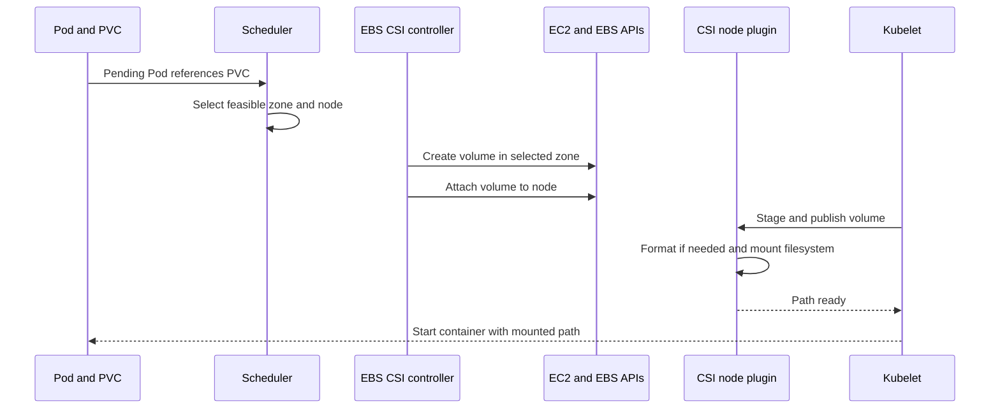
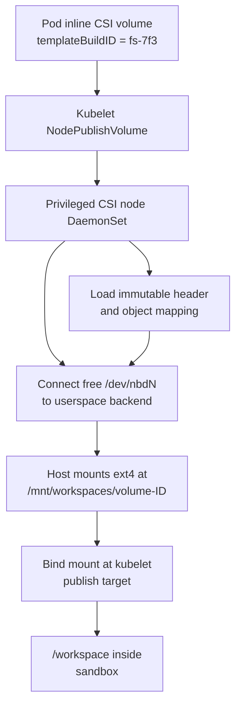

## Working model

Durable bytes are not yet a resumable workspace. Recovery needs an immutable snapshot or committed volume state, a stable session-to-version pointer, and a bootstrap path that knows how to mount it.

## Decide what the workspace promises

A sandbox can expose an ordinary path such as `/workspace` while implementing very different storage contracts:

| Workspace contract     | What survives                                      | Typical implementation                                          | Good fit                                            |
| ---------------------- | -------------------------------------------------- | --------------------------------------------------------------- | --------------------------------------------------- |
| Disposable             | Nothing after termination                          | Container writable layer, `emptyDir`, local disk                | Tests, evaluation, work exported to Git             |
| Pod-independent disk   | Files survive Pod replacement                      | EBS-backed PVC or another persistent block volume               | One long-lived workspace in one zone                |
| Shared filesystem      | Files remain available to several environments     | EFS, distributed filesystem, managed volume, object-backed FUSE | Datasets, shared cache, multi-sandbox collaboration |
| Snapshot and branch    | Named points can create new independent workspaces | VM disk snapshot, filesystem snapshot, copy-on-write image      | Resume, rollback, fork, reproducible base           |
| Full suspended machine | Files, memory, and process state return            | MicroVM memory plus disk snapshot                               | Interactive sessions with expensive in-memory setup |

Do not promise “persistent” without a failure table. Ask whether state survives:

- container restart;
- Pod deletion;
- node failure;
- replacement in another Availability Zone;
- platform upgrade;
- explicit sandbox deletion;
- snapshot retention expiry;
- region loss.

An EBS PVC and a pushed Git branch both survive Pod deletion, but they expose different recovery, sharing, rollback, and review behavior.

## A path becomes blocks before storage sees it

When a process writes `/workspace/src/parser.py`, object storage does not receive “a patch for parser.py.” The path is interpreted through several layers:

```text
pathname
  -> directory entries and inode
  -> filesystem extents
  -> logical block numbers
  -> block device requests
  -> local disk, cloud volume, or userspace block backend
```

The filesystem owns names, permissions, directories, allocation, and crash recovery. The block device owns numbered byte ranges. A storage backend below ext4 sees reads and writes such as “write 4096 bytes at logical block 8127,” not the original filename.

This matters for copy-on-write storage. The backend can preserve changed blocks without understanding Git, source files, or directories. Higher-level backup systems can instead walk files and store path-level content. They have different metadata, consistency, and performance behavior.

## CSI is the Kubernetes-to-storage contract

The Container Storage Interface (CSI) standardizes calls between a container orchestrator and a storage plugin. CSI does not mean EBS, object storage, or persistence; a driver defines the backend and completion contract.

A dynamically provisioned EBS path commonly looks like this:



The controller portion calls cloud APIs to create, attach, detach, snapshot, or delete volumes. The node portion runs on each eligible EC2 node, usually as a privileged DaemonSet, because it must discover devices and perform host mounts. On EKS Fargate, the EBS CSI node DaemonSet cannot run and EBS volumes cannot mount to Fargate Pods.

A `PersistentVolumeClaim` (PVC) asks for capacity, access mode, and a `StorageClass`. A `PersistentVolume` (PV) represents the resulting storage resource. `WaitForFirstConsumer` delays volume creation until Pod scheduling reveals a compatible zone.

## EBS is zone-scoped block storage, not node-local disk

An EBS volume exists independently from one EC2 instance. It can detach from one node and attach to another compatible node in the same Availability Zone. Therefore:

```text
Pod restart on same node        -> volume remains mounted or remounts
Pod replacement on another node -> CSI detaches and reattaches in same AZ
node failure                    -> recovery waits for failure detection and safe reattachment
move to another AZ              -> original volume cannot attach directly
```

`ReadWriteOnce` usually means the volume can be mounted read-write by one node at a time; it does not mean one Pod forever. Multiple Pods on the same node may still interact with the mount depending on driver and workload setup. `ReadWriteOncePod` expresses a stricter single-Pod intent when supported. EBS Multi-Attach exists for selected volume types and requires application-level coordination; it is not ordinary shared filesystem semantics.

EBS gives the guest a block device. A filesystem such as ext4 still owns directory consistency. Snapshots copy volume blocks into AWS-managed snapshot storage, but application-consistent recovery may require freezing writes, flushing buffers, or coordinating the application before the snapshot.

EBS works well for a stable workspace that remains in one zone. Large fleets of short-lived claims can face volume provisioning, attachment limits, detach delays, per-volume cost, and placement constraints. Measure those rather than assuming “persistent volume” is free lifecycle state.

## Mount and bind mount name two different operations

A **mount** attaches a filesystem to a directory in a mount namespace. For example:

```text
/dev/nvme2n1 contains ext4
mount /dev/nvme2n1 /mnt/workspaces/volume-42
```

The kernel now interprets the device's blocks through ext4 and exposes files under the host directory.

A **bind mount** makes an existing directory tree visible at another path:

```text
bind /mnt/workspaces/volume-42
  -> kubelet publish target
  -> /workspace inside the container
```

It copies no bytes, creates no second filesystem, and does not upload anything. The two paths refer to the same mounted tree through different namespace locations.

In a gVisor Pod, the raw block device and privileged mount work can remain in the host CSI daemon. The container runtime presents the resulting directory to the sandbox. Guest code sees files, not permission to configure `/dev/nbd0` or mount arbitrary host devices.

## Inline CSI can create an ephemeral volume without a PVC

A Pod may embed CSI volume attributes directly:

```yaml
volumes:
  - name: workspace
    csi:
      driver: workspaces.example
      volumeAttributes:
        templateBuildID: fs-7f3
```

If the driver advertises the `Ephemeral` lifecycle mode, kubelet can call the node plugin without a PVC, PV, StorageClass, external provisioner, or controller attach operation. Kubernetes generates an opaque inline volume ID. If the `CSIDriver` sets `podInfoOnMount: true`, kubelet also passes selected Pod metadata to `NodePublishVolume`.

The Pod did not request a Kubernetes storage capacity in this example. A referenced virtual-disk header can still advertise a 50 GiB logical device. Sparse backing files consume physical node storage only for fetched or changed ranges.

Inline does not mean memory-only or non-durable. It describes how the volume enters the Pod specification and which CSI calls occur. The driver's checkpoint and restore contract decides durability.

## Build an immutable ext4 template once

One object-backed design creates a development filesystem during CI:

```text
checkout source and install dependencies
  -> create sparse logical disk
  -> format it as ext4
  -> copy prepared filesystem contents into it
  -> split or pack immutable block data
  -> upload data objects and a mapping header
  -> publish template build ID fs-7f3
  -> patch fs-7f3 into a deployment template
```

“Patch the UUID into the template” means change a configuration field that references the uploaded filesystem build. It does not inject the filesystem bytes into a `SandboxTemplate` CR. The custom resource carries a small ID; a later CSI mount uses that ID to load the header and data from object storage.

Keep two uses of _base_ separate:

- A Kustomize base is reusable Kubernetes YAML modified by environment overlays.
- A filesystem base is an immutable ext4 image containing source, tools, dependencies, or data.

The build pipeline can update a GitOps overlay with a content UUID. Argo CD applies the desired-state change, and new warm inventory uses the new template. Existing active workspaces remain on their original base unless an explicit migration says otherwise.

## NBD lets userspace serve a block device

Linux Network Block Device (NBD) exposes `/dev/nbdN` as a kernel block device while forwarding block requests to a userspace process. Despite the name, the userspace backend can run on the same node; NBD need not cross a VPC.

A node-local CSI DaemonSet can combine NBD with object storage:



A Go NBD dispatcher is a userspace request loop that receives READ, WRITE, DISCARD, or FLUSH-like block commands and completes them. It does not dispatch agent jobs or choose Kubernetes nodes.

Several connections per NBD device can allow unrelated block operations to progress concurrently. A cache layer can coalesce tiny 4 KiB misses into larger object-range reads so a source-tree scan does not issue one S3 request per filesystem block.

## Track every storage identity

| Identity                       | Purpose                                                      | Owner                                            |
| ------------------------------ | ------------------------------------------------------------ | ------------------------------------------------ |
| Template build ID              | Select immutable base header and data                        | Image publisher and deployment template          |
| Pod UID                        | Identify one Kubernetes Pod incarnation                      | Kubernetes API                                   |
| Inline volume ID               | Identify one mounted CSI volume                              | Kubelet and node plugin                          |
| NBD device                     | Carry logical block requests for a mounted volume            | Node daemon                                      |
| Private write-layer ID         | Separate one workspace's changed blocks                      | Block backend                                    |
| Checkpoint build ID            | Identify one uploaded diff and cumulative header             | Checkpoint writer                                |
| Stable session or workspace ID | Find the latest recoverable checkpoint across Pods and nodes | Application database or durable manifest service |

Do not derive correctness from one convenient name. Pod names can be reused. NBD numbers are local to a node. Kubelet volume IDs change with a new Pod. A checkpoint object UUID proves that one object exists; it does not tell a replacement which UUID belongs to its session.

## Reads use the base until a private block overrides it

The immutable template can be shared because no workspace edits it. Each mounted workspace receives a private sparse write layer and dirty-block index.

```text
container reads pathname
  -> Linux page cache and ext4 lookup
  -> NBD READ on page-cache miss
  -> private changed block, if present
  -> node-shared clean cache, if present
  -> immutable header lookup
  -> object-store range read
  -> fill clean cache and return bytes
```

Safe sharing requires the clean-cache key to include immutable build and object identity. A file offset alone is not enough because two template builds can place different bytes at the same logical block.

There are at least four caches:

| Cache                      | Shared by                                         | Contains                                                          |
| -------------------------- | ------------------------------------------------- | ----------------------------------------------------------------- |
| Linux page cache           | Kernel according to mount and file mappings       | File pages above ext4                                             |
| Node clean-block cache     | Volumes using the same immutable base on one node | Downloaded unmodified ranges                                      |
| Private sparse write cache | One mounted volume                                | Changed logical blocks                                            |
| OCI and package caches     | Build system or node                              | Container layers and dependencies, separate from workspace blocks |

Cache eviction should force refetch, never choose another visible version. If completion metadata for a sparse clean cache exists only in daemon memory, restart may need to discard cache files rather than trust partially filled ranges.

## Writes belong to the private copy-on-write layer

```text
container writes pathname
  -> page cache marks file pages dirty
  -> ext4 changes data, inode, allocation, and journal blocks
  -> NBD WRITE carries logical block numbers
  -> backend writes private sparse file
  -> backend marks logical blocks dirty
  -> immutable base remains unchanged
```

The node daemon knows which private layer to edit because kubelet supplied a volume identity during mount and the daemon stored:

```text
volume ID -> NBD device -> private cache -> dirty bitmap -> current header
```

ext4 decides which blocks a filename update changes. The NBD backend routes those block writes to the current volume's private layer. There is no S3 object named after `/workspace/src/parser.py` that the daemon edits in place.

Ordinary `write()` may finish after copying data into the page cache. `fsync()` asks the filesystem and block stack to honor their advertised flush contract. If the NBD backend acknowledges FLUSH without syncing its private cache or publishing a checkpoint, `fsync()` does not mean “the diff is in S3.” Document the exact completion boundary.

## Checkpointing has a data step and a publication step

A block checkpoint can:

1. quiesce or `syncfs` the mounted filesystem so ext4 emits dirty blocks;
2. pack changed logical blocks into an immutable diff object;
3. upload a cumulative header mapping every logical range to base or diff objects;
4. verify object-store completion;
5. conditionally publish a stable workspace head that points to the new header;
6. record the head version and checkpoint receipt in the run database.

The header can be flattened so one read resolves a block directly rather than chasing every historical diff. Old data objects remain referenced until compaction or garbage collection rewrites them.

The publication step is the difference between “bytes exist” and “another worker can resume.” Use a compare-and-set:

```text
workspace/run-42 head:
  expected version = 7
  new checkpoint = fs-checkpoint-a91
  new version = 8
```

If two writers race, only the writer holding the current lease and expected head version should advance it. The loser cannot silently replace a newer workspace.

## “The control plane does not record the BuildIDs” means restore has no head

Suppose a node daemon uploads periodic and final diff headers with IDs:

```text
fs-checkpoint-a91
fs-checkpoint-b04
fs-checkpoint-c77
```

The objects may be perfectly durable in S3. If the application database still records only the original template `fs-7f3`, a replacement Pod asks CSI to mount `fs-7f3` and loses every later edit. The daemon's node-local `.latest` file or in-memory pointer does not help after node loss or when kubelet creates a different volume ID.

The missing record is:

```text
stable workspace run-42 -> latest committed checkpoint fs-checkpoint-c77
```

“Does not restore their BuildIDs” means the launch path never reads such a durable mapping and passes the checkpoint ID into the next mount. Uploaded diffs then serve as audit debris rather than recovery points.

Garbage collection becomes dangerous too. Without a durable graph of live heads and referenced objects, the system cannot safely distinguish an orphan from the only copy of a user's work.

## Volume, filesystem, and memory snapshots capture different state

| Snapshot                   | Captures                                                   | Does not inherently capture                                        |
| -------------------------- | ---------------------------------------------------------- | ------------------------------------------------------------------ |
| Container or OCI image     | Declared filesystem layers built before launch             | Runtime writes, memory, external state                             |
| EBS snapshot               | EBS volume blocks at snapshot time                         | Process memory, remote effects, application consistency            |
| Filesystem snapshot        | Files and metadata under a provider's contract             | Running processes and open connections                             |
| VM disk snapshot           | Guest disk state                                           | Memory unless separately included                                  |
| Memory or microVM snapshot | Guest memory and machine state, often with disk references | Stable external connections, refreshed credentials, remote effects |
| Application checkpoint     | Declared workflow progress and artifact references         | Arbitrary process heap unless encoded                              |

Firecracker snapshots save guest memory and virtual-device state while disk files remain separately managed. Restored network and vsock connections may close. CPU model and snapshot format compatibility constrain placement. Cloning also duplicates uniqueness-sensitive state such as entropy pools, machine IDs, tokens, and cached credentials.

Managed platforms expose different combinations. E2B can pause with filesystem plus memory or use a lighter filesystem-only snapshot. Modal distinguishes filesystem, directory, and experimental memory snapshots. Daytona's container stop preserves filesystem but clears memory, while its VM pause can preserve memory. Treat those as API contracts checked at a point in time, not universal meanings of `pause`.

A resume hook should:

- establish a new instance identity and route;
- refresh short-lived credentials;
- reopen network connections;
- verify mounted volume and checkpoint versions;
- repair clocks or other time-sensitive state;
- reject stale leases and pending effects;
- run readiness checks before accepting traffic.

## Transcript, filesystem, and subagent state remain independent

An agent transcript can resume on a fresh machine while the workspace starts from its base image. Conversely, a persistent volume can contain current files while the model begins a new conversation with no record of prior decisions.

Subagent transcripts may be stored for audit but omitted from parent-session restore. That means the platform can inspect what a child did later, yet the resumed parent receives only selected child results, not every child token and tool event. This saves context and avoids restoring independent process state; it also requires the parent checkpoint to retain any result needed later.

Prompt caching concerns the model request prefix. Snapshot and volume choices concern execution state. A stable restored transcript may qualify for provider caching; a restored filesystem alone does not.

## Git and artifact stores often provide the cleanest durability boundary

For coding agents, durable code changes naturally belong in Git:

```text
workspace edits
  -> tests and review
  -> commit on run-specific branch
  -> push to remote
  -> record branch, commit SHA, and push receipt
```

Git does not preserve installed packages, databases, build caches, untracked large artifacts, or live processes. Publish those separately when the product promises them. Still, “push before termination” is easier to inspect and recover than an opaque disk snapshot when the actual deliverable is a code change.

Use both when needed: a snapshot shortens interactive resume, while Git remains the durable and reviewable output.

## Choose storage by the failure contract

| Need                                    | Favor                                       | Watch                                                    |
| --------------------------------------- | ------------------------------------------- | -------------------------------------------------------- |
| Throwaway evaluation                    | `emptyDir` or local writable layer          | Export results before deletion                           |
| One persistent workspace in an AWS zone | EBS PVC                                     | AZ placement, detach time, attachment limits, backup     |
| Shared datasets or caches               | EFS, managed volume, or object-backed mount | Concurrency semantics, latency, stale views              |
| Many workspaces from one large base     | Immutable base plus copy-on-write diff      | Driver complexity, head publication, garbage collection  |
| Fast branch and rollback                | Filesystem or VM snapshots                  | Version compatibility, retention, credential uniqueness  |
| Exact process continuation              | Memory plus disk snapshot                   | Closed connections, clocks, stale leases, secret refresh |
| Durable code result                     | Git branch and commit                       | Untracked or generated artifacts                         |

The simplest system that meets the recovery objective usually wins. A custom NBD and object-store filesystem can produce fast sparse clones and shared clean caches, but it also creates a privileged node service, block-consistency contract, checkpoint protocol, object graph, and recovery database. EBS may cost more per workspace yet remove most of that code.

## Summary

- CSI is an orchestrator-to-driver interface. A driver can manage EBS, an inline ephemeral workspace, or another backend.
- EBS volumes are tied to an Availability Zone, not one permanent node. CSI can reattach them to another node in that zone.
- A filesystem mount interprets a block device; a bind mount exposes the resulting tree at another path.
- An immutable ext4 template ID in a sandbox template is a reference to bytes stored elsewhere, not the bytes themselves.
- NBD dispatchers translate logical block requests. ext4 maps filenames to blocks, and the per-volume backend writes the correct private copy-on-write layer.
- Checkpoint objects become resumable only after a stable workspace head points to the latest committed BuildID.
- Filesystem, memory, transcript, workflow, Git, and external-effect state require separate recovery evidence.

## References

- [Kubernetes volumes](https://kubernetes.io/docs/concepts/storage/volumes/)
- [Kubernetes persistent volumes](https://kubernetes.io/docs/concepts/storage/persistent-volumes/)
- [Kubernetes CSI inline ephemeral volumes](https://kubernetes.io/docs/concepts/storage/ephemeral-volumes/#csi-ephemeral-volumes)
- [Amazon EBS CSI driver for EKS](https://docs.aws.amazon.com/eks/latest/userguide/ebs-csi.html)
- [Attach an Amazon EBS volume](https://docs.aws.amazon.com/ebs/latest/userguide/ebs-attaching-volume.html)
- [Amazon EBS volume constraints](https://docs.aws.amazon.com/ebs/latest/userguide/ebs-volumes-multi.html)
- [Linux NBD documentation](https://docs.kernel.org/admin-guide/blockdev/nbd.html)
- [Firecracker snapshot support](https://github.com/firecracker-microvm/firecracker/blob/main/docs/snapshotting/snapshot-support.md)
- [E2B sandbox persistence](https://e2b.dev/docs/sandbox/persistence)
- [Modal Sandbox snapshots](https://modal.com/docs/guide/sandbox-snapshots)
- [Daytona persistence](https://www.daytona.io/docs/en/persistence/)
- [Agent Sandbox volume claim templates](https://agent-sandbox.sigs.k8s.io/docs/volumes/volume-claim-template/)
- [CI4: Advanced object-backed CSI case](../01-cloud-infrastructure/04-kubernetes-networking-storage-security.md#advanced-storage-driver-case-an-object-backed-virtual-block-device)
- [LL4: Linux storage and I/O](../02-low-level-infrastructure/04-storage-and-io.md)
