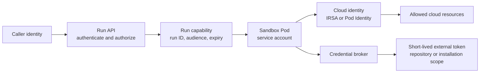
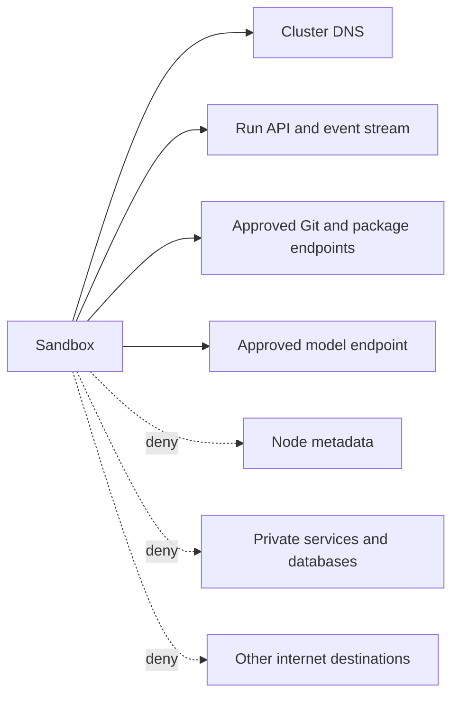
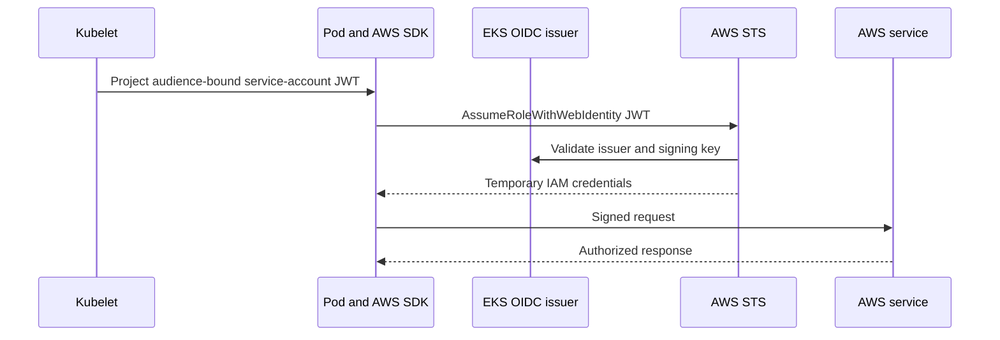
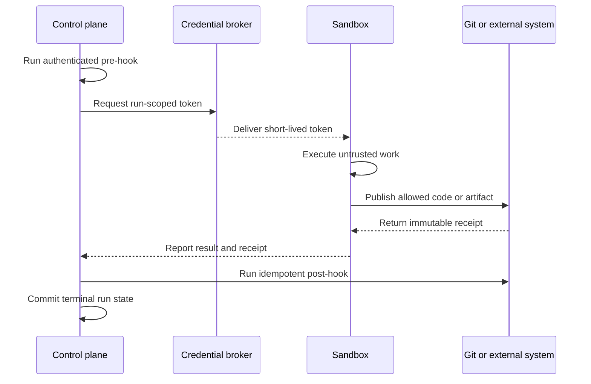

## Working model

Network reachability answers where a packet may go. Identity answers who made an authenticated request. Authorization answers what that identity may do. A safe sandbox needs all three controls because none substitutes for the other two.

A sandbox that can reach only `api.github.com` is not automatically limited to one repository. A token scoped to one repository can still be exfiltrated if unrestricted egress is available. A default-deny policy still fails if the one allowed credential broker returns an administrator token.

## Start with five distinct identities

Do not collapse these into a generic “agent identity”:

| Identity             | What it names                                                                         | Typical proof                                   | Main authorization point               |
| -------------------- | ------------------------------------------------------------------------------------- | ----------------------------------------------- | -------------------------------------- |
| Human or caller      | The person, webhook, or service requesting work                                       | Browser session, OAuth token, webhook signature | Run API                                |
| Run                  | One accepted unit of work                                                             | Run ID plus an internal signed token            | Control plane and event stream         |
| Kubernetes workload  | The Pod's service account and namespace                                               | Short-lived projected service-account token     | Kubernetes API and workload federation |
| Cloud workload       | The IAM role or equivalent assumed by the Pod                                         | Temporary cloud credentials                     | S3, queues, databases, and cloud APIs  |
| External application | The installation, bot, or user accepted by GitHub, Slack, Linear, or another provider | Short-lived app token or OAuth token            | External provider                      |

A user can authorize a run without giving the run the user's raw browser token. The control plane can instead mint a run capability, exchange a workload identity for cloud credentials, and mint an external token for a narrow repository or installation.



Each exchange should narrow scope or lifetime. If a later credential is broader than the credential used to request it, the broker has become a privilege-escalation endpoint.

## Ingress should enter through an authenticated broker

Avoid exposing every sandbox Pod directly to the internet. Put a trusted service between the caller and the sandbox:

1. authenticate the caller;
2. authorize access to the run;
3. resolve the current run-to-sandbox lease;
4. attach a route nonce or short-lived run token;
5. proxy only the allowed protocol and path;
6. stop forwarding when the lease is released or fenced.

The run ID alone should never be a bearer secret. Predictable or leaked IDs must not grant shell access.

### Service names are not authorization

A Kubernetes `ClusterIP` Service exposes a stable virtual IP and DNS name inside the cluster. It selects Pods by labels and load-balances connections among ready endpoints. It does not authenticate the caller and it does not preserve one user's session unless the routing layer adds that behavior.

A headless Service has `clusterIP: None`. DNS returns Pod endpoint addresses instead of one virtual service address. Stateful controllers use headless Services when clients need a stable address for one named Pod. The address still needs an authorization check.

For a leased sandbox, common routing designs are:

- one gateway that looks up `run ID -> current sandbox endpoint`;
- a per-sandbox Service created with the lease;
- a stable sandbox name combined with a route nonce;
- a reverse connection from the sandbox to a trusted relay.

The gateway lookup is often easiest to fence. Changing the lease record makes the old endpoint unreachable without waiting for DNS or load-balancer state to expire.

### What an AWS VPC Link does

An AWS VPC Link connects a managed API entry point, such as API Gateway, to private resources in a VPC through supported load-balancer or service-network targets. It lets an internet-facing or managed API invoke a private backend without assigning public addresses to that backend.

It is an ingress transport boundary, not a sandbox firewall:

```text
client
  -> API Gateway authentication and throttling
  -> VPC Link
  -> private load balancer
  -> Kubernetes ingress or gateway
  -> authorized sandbox route
```

Security groups, Kubernetes network policy, application authorization, and route fencing still apply after traffic crosses the link.

## Egress starts with default deny

Agent workloads commonly need package registries, Git hosting, model APIs, and test dependencies. “Internet access” is too broad a permission for a process that can execute repository instructions.

A practical policy starts with no egress, then adds:

- cluster DNS;
- the control-plane callback or event endpoint;
- a credential broker, if used;
- approved package and Git endpoints;
- narrowly identified application APIs;
- time synchronization only when the node does not provide it;
- explicit customer destinations when the product requires them.

Kubernetes `NetworkPolicy` selects Pods and describes allowed ingress and egress. A CNI plugin must implement the policy; creating the object alone does not filter packets. Policies are additive. Once a Pod is isolated for a direction, traffic in that direction must match an allow rule from at least one selecting policy.



### CIDR rules are brittle for hosted services

A CIDR rule allows IP ranges. Large hosted services rotate addresses, share ranges among tenants, and place several products behind one content-delivery network. An allowlist copied from today's DNS response can become stale or authorize unrelated services.

FQDN-aware policy watches DNS answers for allowed names and temporarily permits the returned addresses. That fits SaaS endpoints better, but it has sharp edges:

- the sandbox must use the observed DNS resolver;
- wildcard names may admit many tenants;
- redirects can lead to a second, unapproved domain;
- DNS rebinding and short TTLs complicate enforcement;
- an allowed HTTPS host can expose a broad API;
- raw IP connections need a separate policy decision.

An egress proxy can authenticate the run and apply HTTP host, method, or path rules. It sees more application context, but encrypted protocols may require explicit proxy support. Treat CIDR, FQDN, and proxy policy as different tools.

### DNS is part of the policy path

Default-deny egress often breaks DNS first. Permit UDP and TCP DNS to the intended resolver, not port 53 to every destination. Observe rejected lookups and connections during rollout.

Do not let a sandbox bypass the monitored resolver through arbitrary DNS-over-HTTPS endpoints unless that is a deliberate product capability. If FQDN policy learns addresses from one resolver while the workload resolves names another way, the policy and the workload disagree about the destination.

## CNI supplies Pod networking

The Container Network Interface (CNI) is the contract Kubernetes uses to configure a Pod's network namespace. A CNI implementation allocates an address, creates links and routes, and removes them when the Pod ends.

On EKS, the Amazon VPC CNI can assign VPC-routable addresses to Pods. Cilium can provide the datapath, policy enforcement, or a chained configuration depending on how the cluster is installed. Cilium uses eBPF programs in the Linux kernel for packet handling and policy. Hubble reads Cilium flow data so operators can see allowed and denied connections, DNS lookups, and selected higher-level protocol details.

These pieces remain separate:

| Component                        | Job                                                             |
| -------------------------------- | --------------------------------------------------------------- |
| VPC and subnets                  | Route addresses among AWS networks and gateways                 |
| Security groups and network ACLs | Filter traffic at AWS interfaces or subnet boundaries           |
| CNI                              | Give Pods usable network interfaces, addresses, and routes      |
| Kubernetes or Cilium policy      | Decide which selected workloads may communicate                 |
| Service and ingress or gateway   | Find endpoints and distribute incoming traffic                  |
| Application authorization        | Decide whether this caller may operate this run                 |
| gVisor, Kata, or a VM            | Limit what code can do to the host through the runtime boundary |

Network policy cannot repair a runtime escape. Runtime isolation cannot stop an intentionally allowed HTTPS request from using a stolen token.

## Block cloud metadata paths

An EC2 node normally has an instance profile. The Instance Metadata Service (IMDS) can return temporary credentials for that node role. If a sandbox can reach IMDS, it may gain node-level permissions that are broader than its workload role.

Restrict IMDS from Pods, use IMDSv2 and a low hop limit where the networking model supports it, and test the restriction from inside the actual runtime. Pods using `hostNetwork: true` need special scrutiny. Avoid `hostNetwork`, `hostPID`, and `hostPath` for untrusted sandboxes.

Also block:

- Kubernetes API access unless the runner needs it;
- cloud control-plane endpoints that the run does not use;
- internal link-local metadata services;
- node-local administration ports;
- databases and caches owned by the control plane.

## Kubernetes service accounts are workload identities

A Kubernetes service account names a workload for Kubernetes API authentication. Modern Pods receive a projected, audience-bound, expiring token that kubelet rotates. RBAC then grants verbs on selected resources.

Most sandboxes should set:

```yaml
automountServiceAccountToken: false
```

If the runner does not call the Kubernetes API, it should not receive an API credential. A node-level CSI driver or controller can have its own service account and RBAC without sharing that access with sandbox Pods.

If a Pod does need the API, request a projected token with the smallest useful audience and lifetime. Limit its Role or ClusterRole to the exact resource names and verbs. Namespace isolation alone is not a permission boundary.

## IRSA and EKS Pod Identity grant AWS access

IAM Roles for Service Accounts (IRSA) federates a Kubernetes service account into AWS IAM:



The role trust policy restricts which OIDC issuer, namespace, and service account may assume it. The permission policy restricts which AWS actions and resources that role may use.

EKS Pod Identity maps a service account to a role through an EKS association and a node agent. It avoids a separate IAM OIDC-provider setup for each cluster and includes session tags such as cluster, namespace, and service-account identity. AWS currently recommends it when its EKS-only model fits. IRSA remains useful across other Kubernetes deployments and makes the OIDC exchange explicit.

Neither system turns a container into a security boundary. Every process in a compromised Pod can use credentials available to that Pod. Separate service accounts and roles by privilege:

| Workload            | Example AWS access                                                  |
| ------------------- | ------------------------------------------------------------------- |
| Control-plane API   | Run database secret, event stream, token-minting key                |
| Sandbox runner      | One artifact prefix, one checkpoint prefix, or no direct AWS access |
| CSI node plugin     | Template and checkpoint object prefixes plus node operations        |
| Pool controller     | Kubernetes sandbox resources, usually no object bytes               |
| Telemetry collector | Append or export telemetry, no run mutation                         |

Giving the control plane and arbitrary-code sandbox one shared role defeats least privilege even when both happen to use the same S3 bucket.

## A “Secrets Manager container” is usually a delivery component

AWS Secrets Manager is a managed service, not a required container beside every workload. Teams sometimes use “Secrets Manager container” to describe one of these components:

- an init container that retrieves secrets before the app starts;
- a sidecar that refreshes secrets;
- the node-level Secrets Store CSI driver and AWS provider;
- an external-secrets controller that copies values into Kubernetes Secrets;
- an application container that calls Secrets Manager through an AWS SDK.

The Secrets Store CSI driver runs a node component and mounts secret material as files according to a `SecretProviderClass`. The application sees a mounted directory. That path is unrelated to an EBS filesystem CSI driver even though both use CSI calls.

### Secret delivery choices

| Method                                | Benefit                                             | Main risk or cost                                                                        |
| ------------------------------------- | --------------------------------------------------- | ---------------------------------------------------------------------------------------- |
| Environment variable                  | Simple; supported by most programs                  | Inherited by child processes; static for process lifetime; easy to expose in diagnostics |
| Read-only mounted file                | Permissions and rotation are easier to reason about | Any process with path access can read it; application must reload rotations              |
| Application fetch from secret service | No extra copy in Kubernetes; fetch can be audited   | Workload needs secret-service permission and retry logic                                 |
| Sidecar or CSI delivery               | Central refresh and provider integration            | Adds privileged node or sidecar components and failure modes                             |
| Credential broker API                 | Can mint run-scoped, short-lived capabilities       | Broker becomes a high-value service and must authenticate every run                      |

Kubernetes Secret values are base64-encoded data, not encryption by themselves. Protect etcd, restrict RBAC, enable encryption at rest where required, and avoid exposing Secrets through broad list/watch permissions.

## Prefer short-lived external tokens

A GitHub App installation token can be minted for selected repositories and permissions and expires. That is a better sandbox credential than a long-lived personal access token.

A useful broker flow is:

1. runner presents a run capability over mutually authenticated transport;
2. broker verifies the run is active and bound to this sandbox;
3. broker checks the run's repository and requested operation;
4. broker mints or retrieves a short-lived token with matching scope;
5. broker records the issuance without logging the token;
6. runner receives it late and drops it when the operation finishes.

Keep the private key that mints installation tokens outside the sandbox. The same rule applies to Slack bot tokens, Linear OAuth credentials, cloud deploy credentials, and customer integration secrets.

## Keep privileged hooks outside the sandbox

Pre-run, post-run, and failure hooks often need more authority than model-generated code:

- create or update an issue;
- fetch a private task payload;
- mint repository credentials;
- publish a branch or artifact receipt;
- mark a workflow complete;
- send a customer-visible notification.

Run those effects in the trusted control plane when possible. Give the sandbox only the inputs and narrow tokens needed for its computation. This reduces the number of credentials exposed to repository scripts and shell commands.

The split also makes retries clearer:



The control plane must still treat sandbox output as untrusted data. A result string cannot choose an arbitrary webhook URL, repository, or IAM role.

## Rotate, revoke, and fence

Short expiry limits how long a stolen token works; it does not end access immediately. Design a revocation story:

- fence the run-to-sandbox lease so the old Pod cannot get new credentials;
- stop routing ingress to the old endpoint;
- revoke external tokens when the provider supports it;
- terminate the Pod and clear writable storage;
- remove broker cache entries;
- record credential IDs and expiry times for incident response.

Do not reuse a sandbox containing a previous run's environment variables, shell history, Git credential helper, browser profile, SSH agent, `/tmp`, or language-specific credential cache.

## Test the negative space

Security tests should prove denied operations, not just successful ones:

- a sandbox cannot reach IMDS, the Kubernetes API, or the run database;
- a run token for run A cannot fetch run B;
- a released or fenced sandbox cannot refresh credentials;
- an allowed DNS name cannot redirect to an unapproved destination unnoticed;
- a Git token cannot access a second repository;
- a sandbox cannot read another Pod's mounted secret or workspace;
- a direct Pod IP does not bypass gateway authorization;
- a control-plane compromise is not required to use the ordinary runner role;
- Hubble or equivalent flow logs identify why a connection was dropped.

Repeat tests after CNI, kernel, runtime, node-image, and cluster upgrades. Policy objects can remain present while datapath behavior changes underneath them.

## Summary

- Reachability, identity, and authorization are separate controls.
- Route sandbox ingress through a broker that validates the caller and current lease.
- Start egress at default deny, then add DNS and explicit destinations. Use CIDR, FQDN, or proxy policy according to the protocol.
- Cilium can enforce Pod policy and Hubble can expose flows; neither replaces application authorization or runtime isolation.
- IRSA and EKS Pod Identity give a service account temporary AWS credentials. Use different roles for the control plane, sandbox, CSI driver, and telemetry path.
- A mounted secret file, environment variable, brokered token, and CSI secret volume have different rotation and exposure behavior.
- Keep broad external credentials and privileged hooks in the trusted control plane.

## References

- [Kubernetes Services](https://kubernetes.io/docs/concepts/services-networking/service/)
- [Kubernetes NetworkPolicy](https://kubernetes.io/docs/concepts/services-networking/network-policies/)
- [Kubernetes service accounts](https://kubernetes.io/docs/concepts/security/service-accounts/)
- [Kubernetes Secrets](https://kubernetes.io/docs/concepts/configuration/secret/)
- [Secrets Store CSI Driver](https://secrets-store-csi-driver.sigs.k8s.io/)
- [Amazon API Gateway VPC links](https://docs.aws.amazon.com/apigateway/latest/developerguide/http-api-vpc-links.html)
- [IAM roles for service accounts](https://docs.aws.amazon.com/eks/latest/userguide/iam-roles-for-service-accounts.html)
- [EKS Pod Identity and IRSA comparison](https://docs.aws.amazon.com/eks/latest/userguide/service-accounts.html)
- [How EKS Pod Identity works](https://docs.aws.amazon.com/eks/latest/userguide/pod-id-how-it-works.html)
- [Cilium and Hubble overview](https://docs.cilium.io/en/stable/overview/intro/)
- [Cilium FQDN policy](https://docs.cilium.io/en/stable/security/dns/)
- [Hubble network observability](https://docs.cilium.io/en/stable/observability/hubble/)
- [GitHub App installation access tokens](https://docs.github.com/en/apps/creating-github-apps/authenticating-with-a-github-app/generating-an-installation-access-token-for-a-github-app)
- [CI12: VPC Link and private ingress](../01-cloud-infrastructure/12-internet-edge-and-private-connectivity.md#vpc-link-connects-api-gateway-to-a-private-integration)
- [CI4: Kubernetes networking, storage, and security](../01-cloud-infrastructure/04-kubernetes-networking-storage-security.md)
- [LL5: Linux networking and eBPF](../02-low-level-infrastructure/05-linux-networking-and-ebpf.md)
