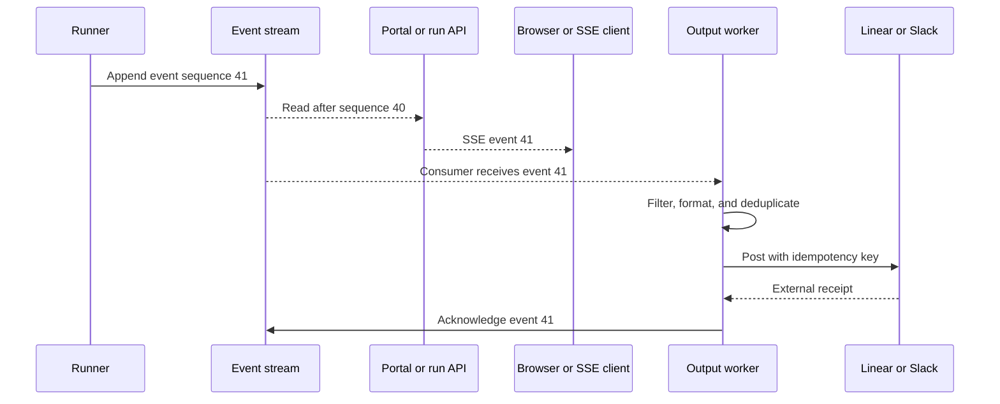

## Working model

A sandbox platform ships at least three kinds of software: trusted control-plane code, code that runs beside the untrusted workload, and the environment the workload sees. Pin and roll them independently. A single `runner:latest` tag cannot describe or recover that state.

Operations begins with an exact answer to this question:

> Which control plane, runner, runtime, node image, filesystem template, policy set, and secret version produced run `r-123`?

If the answer requires reconstructing mutable tags or looking at today's cluster, debugging and rollback are guesses.

## Name the artifacts separately

| Artifact                | Contains                                                                     | Typical distribution                                 | Why it changes                            |
| ----------------------- | ---------------------------------------------------------------------------- | ---------------------------------------------------- | ----------------------------------------- |
| Control-plane image     | Run API, allocation logic, webhooks, output workers                          | OCI image                                            | Product and controller changes            |
| Runner image            | Harness, model client, tools, bootstrap process                              | OCI image                                            | Agent behavior and tool changes           |
| Workspace template      | OS files, language runtimes, package caches, repository seed                 | OCI layer, ext4 image, VM disk, or platform snapshot | User-visible environment changes          |
| Runtime and node image  | Kernel, container runtime, gVisor `runsc`, CSI/NBD helpers, CNI dependencies | AMI or machine image                                 | Kernel, security, and node-daemon changes |
| Policy bundle           | Network, seccomp, admission, RBAC, runtime, and resource settings            | Git-managed manifests or signed policy artifact      | Security and tenancy changes              |
| Model and prompt bundle | Model identifier, system instructions, tool schema, limits                   | Versioned database or artifact record                | Agent behavior changes                    |

A deployment can update the control plane without invalidating a warm workspace fleet. A template build can warm in the background before new runs select it. A node-image rollout can happen by NodePool generation without changing the runner.

### Tags are names; digests are identities

An OCI tag such as `runner:stable` is a mutable pointer. A digest such as:

```text
registry.example/runner@sha256:3a8f...
```

identifies exact manifest bytes. Record the digest in the run manifest. Use tags for human promotion workflows, then resolve and deploy the digest.

`imagePullPolicy: Always` does not make a mutable tag reproducible. It asks kubelet to resolve that tag again, which may return different bytes.

Sign images and verify the expected builder identity before admission. Store an SBOM and build provenance with the artifact so a vulnerable library or compromised build can be traced to affected run manifests.

## Build a workspace template as a release artifact

Do expensive, deterministic setup before the interactive run:

1. start from a pinned base;
2. install system and language packages;
3. seed allowed caches and tools;
4. remove build credentials and transient files;
5. run smoke and security tests;
6. freeze the filesystem or snapshot;
7. publish it under a content or release identifier;
8. update the desired template reference in Git.

The workspace artifact can be much larger and slower to build than the runner image. Keeping them separate avoids rebuilding the whole language environment for a small harness change.

Do not bake user credentials, temporary cloud tokens, home-directory history, machine-specific host keys, or active network connections into a reusable template. A resumed memory snapshot also needs a refresh phase for values that must be unique after cloning.

## GitOps closes the build-to-cluster loop

GitOps stores desired cluster state in version control and lets a controller reconcile live resources toward it.

```mermaid
flowchart LR
  accTitle: Sandbox artifact delivery through GitOps
  accDescr: CI builds and tests immutable artifacts, publishes them, and changes pinned references in a configuration repository. A GitOps controller applies the desired state. Controllers create a new warm generation, health checks prove it, and traffic moves before old capacity drains.

  SRC["Source change"] --> CI["Build, test,<br/>scan, and sign"]
  CI --> REG[("OCI registry,<br/>snapshot store, AMI")]
  REG --> PR["Config change with<br/>immutable IDs"]
  PR --> GIT[("Desired-state Git repository")]
  GIT --> ARGO["GitOps reconciler"]
  ARGO --> NEW["New controller, node,<br/>or warm-pool generation"]
  NEW --> CHECK["Health, policy,<br/>and allocation tests"]
  CHECK --> SHIFT["Select new generation<br/>for new runs"]
  SHIFT --> DRAIN["Drain old generation"]
```



Argo CD can automatically sync a Git revision, prune removed resources, and repair live drift when configured to do so. Those options need ownership boundaries. A controller should not prune a resource owned by another reconciler, and a manual emergency edit may be reverted by self-heal.

### Rollout order matters

Compatibility should span at least one adjacent version in each direction. A safe sequence for a template or runner release is:

1. deploy control-plane code that understands old and new generations;
2. create new templates or warm capacity with an immutable generation label;
3. prove allocation, startup, credentials, network, tools, and cleanup;
4. route new claims to the new generation;
5. let active old runs finish or checkpoint;
6. remove old warm capacity;
7. delete artifacts only after the rollback and restore windows close.

Never mutate a warm sandbox's runner or mounted base image while it is idle in the pool. Replace the generation. In-place mutation makes two apparently identical pool members behave differently.

For a node-image change, provision new nodes, schedule a canary pool on them, then drain old nodes within disruption budgets. CSI, CNI, gVisor, and kernel compatibility must be tested together.

## A run manifest is the debugging join key

Store immutable or versioned inputs with every accepted run:

```yaml
run_id: r-123
session_id: s-88
allocation_attempt: 2
sandbox_id: sbx-491
cluster: build-prod
namespace: sandbox-prod
node_id: i-0abc
node_image_id: ami-0123
runtime_class: gvisor
control_plane_digest: sha256:111
runner_digest: sha256:222
workspace_template_id: fs-7f3
workspace_checkpoint_id: fs-c91
policy_revision: git:19fa2c
model_id: provider/model-version
prompt_bundle_id: prompt-36
credential_issuances:
  - provider: github-app
    credential_id: token-receipt-17
    expires_at: 2026-07-23T19:10:00Z
```

Do not put raw secrets, prompts containing private data, or unrestricted tool output in a broadly readable metrics system. The manifest can point to access-controlled records.

The allocation attempt and fencing token matter when the first Pod reports late after a replacement has already taken ownership.

## Separate model iteration from output delivery

An agent may produce:

- model tokens;
- reasoning or status summaries;
- tool-call requests;
- noisy command output;
- files and diffs;
- final results;
- events intended for Slack, Linear, or another product.

Posting every event synchronously to an external API makes model progress depend on that API's latency and rate limits. A better split is:



Yes, this design saves selected agent output first and sends it to Linear or Slack asynchronously. The durable stream is the handoff. The external worker preserves per-run order, applies rate limits, retries transient failures, and records the external message receipt.

The event payload and external post are not one transaction. Use an idempotency key such as `(run_id, event_sequence, destination)` and store the returned destination ID. A retry may otherwise create duplicate comments.

### Pick explicit stream semantics

Redis Pub/Sub is live fan-out without replay. Redis Streams retains entries according to configured persistence and trimming and can track pending consumer-group deliveries. It is not an unconditional “no message loss” system.

State the contract:

- Is Redis configured with AOF, snapshots, replication, and backups?
- How long are entries retained?
- Can trimming remove an entry before every consumer acknowledges it?
- Does a consumer group deliver at least once?
- How are pending entries reclaimed from a crashed worker?
- Where are final outputs stored after stream retention expires?
- Can a reconnecting SSE client resume from its last event ID?

For short-lived progress, bounded loss may be acceptable. Final results, branch SHAs, billing records, and external-effect receipts belong in a durable database or artifact store.

### Filter before product delivery

Tool output can contain secrets, enormous logs, terminal control bytes, customer data, or text crafted to mention users. Treat it as untrusted.

A product-output worker can:

- pass only selected event types;
- truncate by bytes and lines;
- redact recognized credentials;
- escape destination markup;
- collapse repeated status updates;
- store large output as an access-controlled artifact;
- preserve an audit reference to the original;
- prevent model output from choosing the destination.

This lets users see useful progress without making an issue tracker the canonical transcript store.

## Observe the lifecycle, not only the Pod

CPU and memory metrics cannot explain why a user waited 45 seconds. Instrument timestamps around the product stages:

```text
request received
  -> admission accepted
  -> claim created
  -> sandbox assigned
  -> Pod ready
  -> runner awakened
  -> payload fetched
  -> credential ready
  -> model request started
  -> first useful output
  -> result published
  -> post-hook complete
  -> resources released
```

Trace the request across the run API, controller, Kubernetes objects, runner, model provider, storage driver, event stream, and output worker. Put `run_id`, `session_id`, `allocation_attempt`, and `sandbox_id` on structured logs and spans. Avoid high-cardinality IDs as unbounded metric labels.

### Metrics by subsystem

| Area                  | Signals                                                                                                   |
| --------------------- | --------------------------------------------------------------------------------------------------------- |
| Admission             | accepted, queued, rejected, quota reason, queue age                                                       |
| Warm pool             | desired, ready idle, claimed, initializing, stale, generation                                             |
| Allocation            | claim latency, conflicts, retries, orphan attempts                                                        |
| Kubernetes scheduling | pending time, unschedulable reason, preemption                                                            |
| Nodes                 | provision latency, ready capacity, utilization, interruption, drain                                       |
| Runtime               | boot time, sandbox exits, runtime errors, blocked syscalls                                                |
| Storage               | mount latency, base-cache hit ratio, read amplification, dirty bytes, checkpoint latency, restore success |
| Network               | DNS failures, allowed flows, denied flows, proxy latency, unexpected destinations                         |
| Identity              | token issuance latency, denial reason, token age, refresh failure                                         |
| Agent                 | model latency, tool duration, token use, cancellation response                                            |
| Output                | stream lag, pending count, SSE reconnects, external post lag, duplicate suppression                       |
| Cleanup               | termination age, leaked volumes, leaked routes, finalizer age                                             |

High-cardinality events belong in logs or traces. Metrics should aggregate around bounded dimensions such as environment, generation, runtime class, workload tier, and failure category.

### Logs, metrics, and traces answer different questions

- Metrics show how often and how much: pool shortage, P99 allocation latency, mount failures.
- Logs record discrete facts: claim conflict, credential denial, node termination notice.
- Traces connect latency and causality across one run.

OpenTelemetry supplies common APIs and data models for traces, metrics, and logs. It does not choose retention, sampling, access policy, or incident thresholds.

## Define user-facing SLOs

Useful sandbox SLOs describe outcomes:

| SLI                           | Example measurement boundary                                        |
| ----------------------------- | ------------------------------------------------------------------- |
| Allocation availability       | Accepted runs that receive a usable sandbox before deadline         |
| Ready latency                 | Request accepted to runner ready for payload                        |
| Time to first useful output   | Request accepted to first visible non-heartbeat event               |
| Resume success                | Resume attempts that restore the promised state version             |
| Isolation policy availability | Runs started with every required runtime and network control active |
| Cleanup latency               | Terminal run to all exclusive resources released                    |
| Output freshness              | Persisted event to user or integration delivery                     |

Keep internal component objectives underneath those SLOs. A controller reconciliation objective means little to a user if node provisioning or filesystem mounts dominate ready latency.

Use separate objectives for warm hits and cold starts. Combining them can hide a broken warm pool behind a low-volume cold path or hide cold-path regressions behind many fast hits.

## Design cancellation as a protocol

Cancellation may arrive while a model request, shell command, checkpoint, Git push, or external hook is active. “Set state to cancelled” is not enough.

A cancellation sequence can:

1. persist the request with an increasing fence or terminal intent;
2. stop accepting new prompts and tool calls;
3. signal the runner;
4. end model and child-process work within a grace period;
5. reconcile in-flight external effects;
6. publish any promised checkpoint or explicitly mark it unavailable;
7. run bounded cleanup hooks;
8. revoke routing and credentials;
9. delete or quarantine the sandbox;
10. commit the final state and cleanup evidence.

The control plane should not move from `CANCELLING` to `CANCELLED` merely because an API call to delete the Pod returned. Observe the effects the product promised.

## Make every dependency failure explicit

| Failure                                    | What remains true                                          | Recovery action                                                    |
| ------------------------------------------ | ---------------------------------------------------------- | ------------------------------------------------------------------ |
| Run API restarts after accepting a request | Durable run row exists                                     | Reconciler creates or resumes allocation idempotently              |
| Controller restarts during claim adoption  | Kubernetes resource versions and owner references remain   | Reconcile desired ownership; reject stale attempts                 |
| Runner starts before payload is ready      | Sandbox lease exists                                       | Retry authenticated payload fetch with deadline                    |
| Node dies during execution                 | Database and external receipts remain; live memory is gone | Restore checkpoint or start clean according to contract            |
| CSI mount fails                            | Pod cannot become usable                                   | Keep it unready, replace or retry, preserve mount diagnostics      |
| Object store is unavailable                | Cached reads may work; misses and checkpoints fail         | Stop claiming affected generation or degrade explicitly            |
| Model provider times out                   | Sandbox and transcript checkpoint may remain               | Retry within policy or await user continuation                     |
| Event broker restarts                      | Behavior depends on persistence and acknowledgments        | Resume from durable sequence; report gaps if contract permits them |
| Output worker crashes after external post  | Destination may have the message but local ack is absent   | Deduplicate with idempotency key or reconcile by receipt           |
| Cleanup controller is unavailable          | Terminal run may retain resources                          | Finalizer and sweeper retry; alert on resource age                 |

A state machine should expose degraded outcomes such as “result succeeded, notification pending” or “cancelled, cleanup incomplete.” Collapsing them into one failed flag loses the information needed to repair the system.

## Sweep leaks without racing live work

Reconcilers and periodic sweepers should detect:

- sandboxes with no live lease;
- leases whose run is terminal;
- routes pointing at deleted or fenced Pods;
- PVCs, snapshots, or object prefixes beyond retention;
- warm members from an inactive generation;
- Pods stuck terminating;
- cloud instances not represented by a current NodeClaim;
- external tokens that outlive their run;
- post-hooks with no receipt.

Deletion needs ownership and fences. A sweeper must not delete a workspace because one stale database replica says its run ended. Read the authoritative state, verify the lease version, and make destructive cleanup idempotent.

## Test recovery, compatibility, and containment

Unit tests do not prove a sandbox platform. Keep a production-like test cluster or isolated cell for:

- allocation conflicts and duplicate webhooks;
- controller and API restarts at every lifecycle transition;
- node termination during read, write, checkpoint, and cleanup;
- CNI and CSI daemon restart;
- object-store and broker outages;
- old control plane with new runner, and the reverse;
- old checkpoint restored on a new generation;
- denied network, metadata, mount, namespace, and Kubernetes API access;
- runtime escape regression suites;
- image-signature and policy-admission rejection;
- warm-pool rollout and rollback;
- cost and quota exhaustion;
- deletion and retention sweeps.

Run a small canary workload continuously. It should allocate, prove runtime identity, resolve DNS, reach approved destinations, fail against denied ones, read and write storage, checkpoint if supported, emit ordered output, and clean up.

## Cost has four idle states

Track resource time by state:

| State                            | Typical cost                                                             |
| -------------------------------- | ------------------------------------------------------------------------ |
| Ready warm sandbox               | Reserved Pod resources, node capacity, writable disk, supporting daemons |
| Warm node without a free sandbox | Node compute and image or block caches                                   |
| Suspended sandbox                | Disk and snapshot storage; sometimes reserved identity or IP             |
| Cold capacity                    | No compute, but startup latency and burst quota risk                     |

The main unit economics are:

```text
run cost
  = active compute
  + allocated-but-idle compute
  + node fragmentation
  + image and template transfer
  + workspace and snapshot storage
  + model and external API use
  + control-plane overhead
```

Warm capacity is a latency purchase. Measure the fraction of claims that hit a ready member, unused warm-minutes, and shortage time. A large pool that rarely hits its latency target wastes money; a tiny pool that is always empty is only a cold path with extra machinery.

Packing can reduce node count, but keep resource requests honest. Under-requesting hides cost until noisy neighbors and eviction turn it into reliability loss. Charge or attribute storage separately because stopped workspaces can outlive compute by months.

## An operator should answer these questions quickly

- Which exact artifact and policy versions ran?
- Why did allocation take this long?
- Was this a warm hit, cold Pod, or new-node start?
- Which sandbox and allocation attempt currently own the run?
- Can the old sandbox still route traffic or mint credentials?
- What state is durable, where is its current head, and has restore been tested?
- Which network destinations were allowed and used?
- Did the final output reach the user and each external integration?
- What cleanup remains?
- Which other runs share the affected node, template, runtime, or policy revision?

If these require SSHing to a live node, the system will be hardest to debug after the evidence has disappeared.

## Summary

- Pin control-plane images, runner images, workspace templates, node images, policies, and model bundles independently.
- Record exact digests and versions in a run manifest.
- Roll out a new warm generation, prove it, shift new claims, then drain the old one.
- Persist ordered run events before asynchronous delivery to Linear, Slack, or a browser. Use idempotency keys and external receipts.
- Instrument the full request-to-cleanup path and define SLOs at user-visible boundaries.
- Cancellation, node loss, broker restart, output retries, and cleanup are protocols with partial outcomes.
- Measure idle sandbox, warm node, suspended workspace, active run, and storage costs separately.

## References

- [Kubernetes images and image-pull policy](https://kubernetes.io/docs/concepts/containers/images/)
- [Argo CD automated sync](https://argo-cd.readthedocs.io/en/stable/user-guide/auto_sync/)
- [Argo CD sync phases and waves](https://argo-cd.readthedocs.io/en/stable/user-guide/sync-waves/)
- [Sigstore Cosign verification](https://docs.sigstore.dev/cosign/verifying/verify/)
- [SLSA provenance](https://slsa.dev/provenance/)
- [OpenTelemetry overview](https://opentelemetry.io/docs/what-is-opentelemetry/)
- [Redis Streams](https://redis.io/docs/latest/develop/data-types/streams/)
- [Redis streaming and consumer groups](https://redis.io/docs/latest/develop/use-cases/streaming/)
- [Kubernetes finalizers](https://kubernetes.io/docs/concepts/overview/working-with-objects/finalizers/)
- [Kubernetes Pod lifecycle](https://kubernetes.io/docs/concepts/workloads/pods/pod-lifecycle/)
- [Kubernetes node-pressure eviction](https://kubernetes.io/docs/concepts/scheduling-eviction/node-pressure-eviction/)
- [Karpenter disruption](https://karpenter.sh/docs/concepts/disruption/)
- [DS1: RPC delivery semantics and idempotency](../06-distributed-systems/01-system-model-and-rpc.md)
- [HE5: Durable state, continuity, and handoffs](../05-harness-engineering/05-durable-state-continuity-and-handoffs.md)
