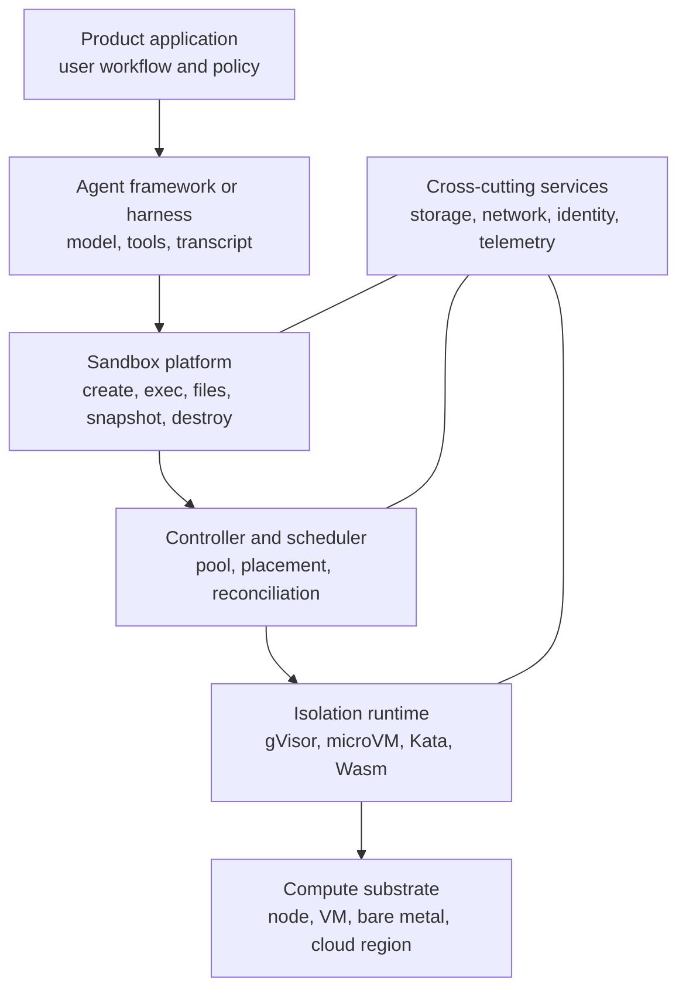
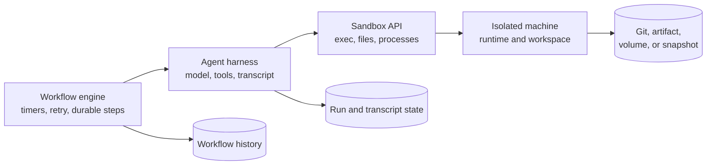
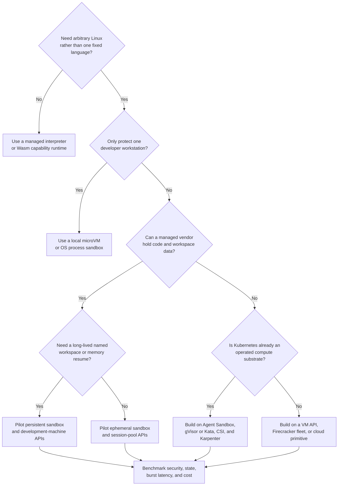

## Working model

Compare products only after placing them in the same layer. Firecracker is a virtual-machine monitor, Kubernetes Agent Sandbox is a controller API, E2B is a managed sandbox service, OpenHands is an agent runtime, and Temporal is a workflow engine. They can appear in one system, but they are not substitutes.

Product details in this note were checked against first-party documentation on July 23, 2026. Treat API names, limits, pricing, deployment options, and preview status as dated observations.

## The market has six layers



The common category error is to select one box and assume it supplies the rest. Firecracker does not provide a tenant API, image builder, IP address manager, checkpoint catalog, warm pool, or credential broker. Kubernetes schedules Pods but does not decide whether arbitrary code should receive a GitHub token. An agent framework can call `exec`, yet it may not own the machine that executes it.

### A quick taxonomy

| Layer                           | Examples                                                                          | What the buyer still needs                                                    |
| ------------------------------- | --------------------------------------------------------------------------------- | ----------------------------------------------------------------------------- |
| Isolation engine                | Linux namespaces, gVisor, Kata Containers, Firecracker, Wasmtime                  | Lifecycle, storage, network, identity, API, capacity                          |
| Cluster resource and controller | Raw Pods or Jobs, Agent Sandbox, KubeVirt                                         | Product API, workload policy, durable run state, often warm and node capacity |
| Admission and capacity          | Kueue, Karpenter, Cluster Autoscaler                                              | Execution boundary and user-facing lifecycle                                  |
| Serverless request platform     | Knative Serving, Cloud Run, Lambda                                                | Stateful interactive-session semantics unless the service adds them           |
| Managed sandbox platform        | E2B, Daytona, Modal, Runloop, Cloudflare Sandbox, Vercel Sandbox, Sprites, Blaxel | Product workflow, data policy, vendor integration                             |
| Developer workspace             | Codespaces, Gitpod, CodeSandbox                                                   | Hard multi-tenant threat proof and agent-specific lifecycle may differ        |
| Local containment               | Docker Sandboxes, Anthropic sandbox runtime                                       | Shared service control plane, multi-host capacity, durable remote operation   |
| Agent framework                 | OpenHands, Claude Agent SDK, agent harnesses                                      | The secure execution substrate unless bundled                                 |
| Workflow engine                 | Temporal, Argo Workflows                                                          | Syscall isolation, filesystem, egress policy, interactive shell               |

## Isolation engines are ingredients

SS3 compares the security and compatibility properties in detail. The selection question here is who operates the engine.

### Ordinary containers

Use the host kernel with namespaces, cgroups, capabilities, seccomp, and mandatory access control. They are efficient and widely compatible. The host-kernel boundary is a poor sole defense for hostile multi-tenant code, but containers remain useful inside a stronger VM boundary or for trusted internal tasks.

What you own:

- kernel patching and node hardening;
- admission policy and dangerous option rejection;
- CNI, storage, image, and process lifecycle;
- per-tenant resource and network limits.

### gVisor

`runsc` supplies an application kernel in userspace and intercepts much of the guest syscall surface before it reaches the host. Kubernetes can select it through `RuntimeClass`. GKE Sandbox packages this path; other clusters can install and operate it themselves.

What you own:

- compatible node images and runtime installation;
- workload compatibility testing;
- cluster scheduling and capacity;
- every control above the syscall boundary.

### Kata Containers

Kata keeps a container-shaped Kubernetes interface while running the workload in a lightweight VM. It is useful when the Kubernetes Pod API is desirable but a separate guest kernel is part of the threat model.

What you own:

- hypervisor and guest-image operation;
- Kubernetes runtime integration;
- node compatibility and acceleration;
- the sandbox product layer.

### Firecracker

Firecracker creates small KVM-based microVMs. It provides a VMM API and virtual devices, not a shared cloud platform. E2B, Vercel Sandbox, Fly Machines, AWS Lambda, and other systems can build different products on top of the same underlying idea.

What you own when using it directly:

- host fleet, jailer configuration, and kernel patching;
- guest kernels and root filesystems;
- IP allocation, routing, firewalling, and exposed ports;
- disk images, copy-on-write, snapshots, and restore identity;
- API authentication, quotas, pooling, logs, and garbage collection.

### WebAssembly

Wasmtime and other Wasm runtimes execute modules against an explicit capability interface such as WASI. They are small and fast when the workload fits the component model. They do not offer an arbitrary Linux machine with `apt`, Docker, browser binaries, and every native build tool.

Use Wasm for narrow plugin or function contracts. Use a Linux sandbox when environment fidelity is the product.

## Kubernetes building blocks solve different control problems

### Raw Pods and Jobs

A Pod is the direct execution object. A Job retries Pods until its completion policy is met. Jobs can sometimes start the same work more than once, so external effects still need idempotency.

Choose raw objects when:

- runs are short and batch-shaped;
- cold scheduling is acceptable;
- workspace state is exported explicitly;
- a small team can keep lifecycle logic in the application.

The application must still map runs to attempts, secure ingress, collect output, cancel work, and clean up.

### Kubernetes Agent Sandbox

The SIG Apps project adds resources such as `Sandbox`, `SandboxTemplate`, `SandboxClaim`, and `SandboxWarmPool`. It gives a stable sandbox identity, a claim model, reusable templates, and warm-pool adoption while staying inside Kubernetes reconciliation.

Choose it when:

- Kubernetes is already the compute control plane;
- sandbox leases and ready inventory deserve explicit resources;
- several products should share the same platform API;
- the team wants an open controller layer rather than a vendor API.

It does not choose the runtime, provide a product database, secure application routes, broker credentials, or define durable transcript behavior. The API changed materially between early `v1alpha1` releases and the `v1beta1` documentation available in July 2026, so pin a version and test upgrades.

### KubeVirt

KubeVirt adds virtual-machine resources and controllers to Kubernetes. Use it when the guest must behave like a general VM, retain its own OS lifecycle, or run software that does not fit a Pod runtime. It is a lower-level and heavier base than a purpose-built command/file sandbox API.

### Knative Serving

Knative serves HTTP workloads, creates immutable revisions, routes traffic, and scales request-driven capacity, including to zero through its autoscaler and Activator path. It is strong for stateless or externally stateful services.

It is not an interactive workspace lease system by itself. Current Knative documentation does permit persistent volume claims when the related feature is enabled, so “Knative has no PVC support” is no longer a sound rejection. The harder mismatch is lifecycle: request concurrency and revision traffic are different from a named shell, workspace checkpoint, and user continuation.

### Kueue

Kueue admits queued Kubernetes workloads against quotas and resource flavors. It decides when a workload may consume scarce capacity. It does not run commands, isolate the kernel, or expose a sandbox API. Pair it with Jobs, custom resources, or another execution controller for batch-heavy estates.

### GitHub Actions Runner Controller

Actions Runner Controller scales self-hosted GitHub runners on Kubernetes. GitHub recommends ephemeral runners for autoscaling because each receives one job before de-registration. It is a CI integration, not a general user-facing sandbox platform.

Use its ideas for ephemeral registration, job isolation, and runner cleanup. Do not force arbitrary interactive agents through a CI job protocol unless CI is the actual product.

### Karpenter

Karpenter supplies nodes after pending Pods reveal their requirements. It is not a sandbox controller. A warm-pool controller creates ready sandboxes; the Kubernetes scheduler places their Pods; Karpenter creates or consolidates nodes beneath them.

These loops answer different questions:

```text
product admission: may this run start?
warm pool: how many ready sandboxes should exist?
Kubernetes scheduler: which existing node should host this Pod?
Karpenter: what node should exist for unscheduled Pods?
```

## Managed platforms package the middle of the stack

No one table proves which product is safest or cheapest. The entries below describe the public product shape, not an independent security audit.

### Full computer and development-environment APIs

| Platform        | Public execution shape                                                            | State model                                                                                     | Distinct fit                                                                             |
| --------------- | --------------------------------------------------------------------------------- | ----------------------------------------------------------------------------------------------- | ---------------------------------------------------------------------------------------- |
| E2B             | Firecracker microVM sandbox with command, filesystem, process, and preview APIs   | Templates; pause and resume; filesystem and memory-aware snapshot options                       | General agent and code-interpreter infrastructure with managed and private-cloud options |
| Daytona         | Container by default, plus Linux VM, Windows VM, and GPU classes                  | Container filesystem across stop; VM pause and memory snapshots; volumes                        | Broad environment classes, forkable development workspaces, and deployment choices       |
| Runloop         | VM-based Devboxes created from Blueprints                                         | Disk snapshots, suspend and resume, network policy                                              | Coding agents and repeatable development machines                                        |
| Modal           | Sandboxes on Modal compute, with gVisor default and VM sandbox option             | File, directory, and memory snapshots; Modal Volumes                                            | Python-centric compute platform that can combine functions, GPU work, and sandboxes      |
| Vercel Sandbox  | Firecracker microVM through TypeScript, Python, or CLI                            | Filesystem snapshots and named persistence; sessions are separate from durable sandbox identity | Web and coding agents that need previews, egress policy, and credential injection        |
| Sprites         | Hardware-isolated persistent Linux machine                                        | ext4 on object-backed storage; warm memory suspension then cold filesystem restore              | Long-lived agent computers that should stop billing while idle                           |
| Blaxel          | Managed microVM sandbox plus nearby agent, MCP, and batch services                | Named long-lived sandbox with automatic standby                                                 | Teams wanting agent hosting and sandbox compute from one service                         |
| CodeSandbox SDK | Firecracker microVM development environment                                       | Fork, hibernate, snapshot or restore, Git-backed workspace                                      | Interactive app development, previews, and longer-lived environments                     |
| Gitpod          | Dev Container-based development environment in managed or customer infrastructure | Reproducible workspace configuration and persistent development state                           | Human and agent development environments tied to repository setup                        |

These services differ in more than boot time. Inspect:

- whether “pause” preserves memory or only disk;
- whether a resumed environment is the same named machine or a clone;
- whether snapshots are crash-consistent, application-consistent, or filesystem-only;
- whether arbitrary OCI images, privileged operations, Docker, FUSE, GPUs, and Windows are supported;
- whether network rules work by CIDR, domain, proxy, or customer VPC;
- whether secrets enter the guest or are injected at egress;
- whether the platform runs in the vendor account, your cloud account, or both;
- whether exposed ports are private, authenticated, or public by default.

### Cloud and edge session primitives

| Platform                              | Public execution shape                                                        | State model                                                                                  | Distinct fit                                                                 |
| ------------------------------------- | ----------------------------------------------------------------------------- | -------------------------------------------------------------------------------------------- | ---------------------------------------------------------------------------- |
| Cloudflare Sandbox SDK                | Isolated container controlled from Workers and Durable Objects                | Sleeping and destroyed lifecycle, object-storage mounts, backup and copy-on-write facilities | Edge applications already using Workers, Durable Objects, R2, and TypeScript |
| Azure Container Apps dynamic sessions | Prewarmed Hyper-V-isolated code-interpreter or custom-container session pool  | Session identifier and pool lifecycle; storage choices depend on session type                | Azure-native code execution without building a session allocator             |
| Google Cloud Run Sandboxes            | Preview command sandbox launched inside a Cloud Run second-generation service | Ephemeral writable overlay; tar import/export, snapshots, or selected bind mounts            | Agent service and child execution on one Cloud Run instance                  |
| AWS Lambda MicroVMs                   | Dedicated Firecracker microVM endpoint with launch and lifecycle controls     | Suspend and resume of memory and disk within service limits                                  | AWS-native agent computers with a managed microVM lifecycle                  |
| Fly Machines                          | Low-level API for small VMs near chosen regions                               | Machine rootfs and Fly Volumes; lifecycle exposed to caller                                  | Teams willing to build their own sandbox control plane on a VM API           |
| Together Code Interpreter             | Hosted Python execution session                                               | Files and interpreter state within a bounded session                                         | Narrow code interpretation beside a model API                                |

The provider may solve hardware isolation and fleet operation while leaving application-level tenancy to you. A signed call that creates a VM is not yet a run database, prompt-continuation protocol, output stream, or Git permission model.

### E2B

E2B focuses on an SDK-level sandbox computer. Templates capture a prepared environment, and sandboxes expose commands, files, processes, and hosted ports. Its persistence documentation separates continued sandbox state from snapshots used as reusable starting points.

Examine:

- template build and retention limits;
- pause/resume state guarantees;
- regional and private-cloud placement;
- egress and credential options;
- API concurrency and timeout quotas;
- snapshot export and provider-exit plan.

### Daytona

Daytona exposes several sandbox classes behind one API. A container sandbox and a VM sandbox do not have identical isolation or stop semantics. Its VM path adds dedicated operating systems, fork, pause/resume, and memory snapshots, while GPU and Windows classes target different workloads.

Choose the class from the threat and state contract, not from the shared SDK name.

### Modal

Modal's broader product is serverless compute, not only sandboxes. Sandboxes can share the same image-building, secrets, volumes, tunnels, functions, and GPU environment. That is useful when arbitrary execution is one step in a larger Python compute pipeline.

The gVisor path and VM sandbox path have different compatibility and isolation properties. Confirm which one a workload actually receives.

### Runloop

Runloop's Devbox abstraction centers on coding agents: Blueprints define the initial machine, snapshots preserve disk state, and suspend/resume avoids rebuilding a workspace for every continuation. It saves teams from assembling VM lifecycle APIs while preserving a computer-shaped contract.

Check whether the intended networking, customer-cloud placement, snapshot branching, and long-run limits fit the product.

### Cloudflare Sandbox SDK

Cloudflare connects an isolated container to a Durable Object, which gives the application a stable coordinator and name. The SDK covers commands, files, background processes, exposed services, and object-storage mounts. This is a natural fit when the trusted agent or product API already runs as a Worker.

It is still a Linux container product with stated platform limits. Kernel modules and host-level features are not the expected extension surface.

### Vercel Sandbox

Vercel provides a Firecracker-backed Linux microVM with an SDK, file and command APIs, port URLs, snapshots, and named persistence. Its network policy can change during a run, and credential brokering can add headers at the egress boundary without placing the secret in the guest.

This is a useful example of defense above the VM. Hardware isolation protects the host; egress policy and credential brokering constrain what allowed application traffic can do.

### Sprites and Blaxel

Both products emphasize a named agent computer that can stop consuming active compute while retaining state.

Sprites documents two idle stages. A warm pause retains memory, while a later cold state drops memory but keeps the ext4 filesystem through object-backed storage. Processes must be declared as services or restarted after a cold wake.

Blaxel combines automatically sleeping microVM sandboxes with nearby agent hosting, MCP services, and batch work. Its product boundary is wider than a sandbox-only API, which can reduce integration work or increase coupling depending on what the application already owns.

### Azure Container Apps dynamic sessions

Azure offers built-in code-interpreter pools and custom-container pools. A pool prewarms capacity and routes requests by session identifier through a management endpoint. Hyper-V isolation and Azure identity integration remove much of the cluster work.

The built-in interpreter is a narrower and simpler product. The custom-container path gives more environment control but restores image, protocol, logging, and dependency responsibility to the team.

### Google Cloud Run Sandboxes

Cloud Run Sandboxes were in preview in the documentation checked on July 23, 2026. The trusted agent remains in a Cloud Run container and launches child command sandboxes through a local CLI. Child sandboxes do not inherit the parent's secrets or environment by default, and egress is blocked unless enabled.

This is a different topology from allocating one remote sandbox per run. Child sandboxes share the CPU and memory assigned to the parent Cloud Run instance. Files can move through exported tar overlays or selected bind mounts. The parent must still enforce per-run quotas and protect any mounted directory.

### AWS Lambda MicroVMs

AWS Lambda MicroVMs expose longer-lived Firecracker environments through a dedicated endpoint rather than the ordinary one-invocation Lambda function contract. Current documentation describes lifecycle hooks, suspend/resume with disk and memory, ingress and egress connectors, and an eight-hour maximum active duration.

Treat this as a new managed compute primitive, not as proof that every Lambda function is now an interactive VM. Validate regional availability, service quotas, connector behavior, snapshot uniqueness, and preview or general-availability terms for the account in use.

### Fly Machines

Fly Machines are closer to a programmable VM substrate. They offer a direct API, fast lifecycle, regional placement, networking, and volumes. This preserves flexibility and also means the buyer writes more of SS2, SS4, SS5, SS6, and SS7.

A Machine API is a good base for a custom platform when Kubernetes is unwanted and the team accepts control-plane ownership.

## Local containment is a separate product class

### Docker Sandboxes

Docker Sandboxes creates a local microVM for a coding agent rather than running the agent directly on the developer's host. It can mount the current workspace or clone a repository, then controls credentials and network access around that VM.

It solves a personal-workstation problem well:

- protect the developer's home directory and host services;
- let the agent install packages and use Docker inside its VM;
- preserve a familiar local CLI workflow;
- show or approve file changes.

It does not provide a regional multi-tenant API, shared warm pool, customer quotas, or a durable run-control database.

### Anthropic sandbox runtime

Anthropic's experimental sandbox runtime applies operating-system containment to local commands. On Linux it uses primitives such as namespaces, seccomp, and Landlock; on macOS it uses the platform sandbox. It is a policy wrapper around processes, not a remote computer service.

Use it to reduce the blast radius of a local agent or tool subprocess. Do not infer a hardware tenant boundary or cloud fleet from its command interface.

### OpenHands runtime

OpenHands can run its agent tools against Docker, a local process, or remote environments. The runtime gives the agent a shell and file interface. OpenHands is primarily an agent framework and product; the selected runtime decides where execution happens and what isolation it has.

This distinction generalizes. A framework integration named “sandbox” may only be an adapter to Docker or to a vendor API.

### Codespaces and Gitpod

Cloud development environments optimize for a developer who is authenticated, understands the repository, and may receive broad source-code access. They provide repeatable setup, editors, terminals, port previews, and persistent workspaces.

They can host coding agents, but check the threat model before treating them as a hostile-code service:

- Is one environment a VM boundary or a container boundary?
- Can a user choose privileged Dev Container features?
- Which organization credentials are mounted?
- Are port previews public or authenticated?
- How are abandoned workspaces deleted?
- Is high-concurrency machine creation an intended API workload?

## Narrow code interpreters trade flexibility for a smaller contract

A code interpreter normally accepts a language snippet and files, executes within fixed limits, and returns structured output. It may keep a session for follow-up cells but does not promise an arbitrary Linux development machine.

Examples include Azure's built-in session pool and Together Code Interpreter. This product class is often correct for:

- spreadsheet and data analysis;
- chart or document generation;
- deterministic evaluation of model-written Python;
- education exercises;
- short reinforcement-learning rollouts.

It is a poor fit for:

- cloning a large polyglot monorepo;
- installing system daemons;
- running Docker;
- exposing several preview servers;
- retaining a developer workspace for weeks;
- controlling a browser or full desktop stack.

A smaller interface can be easier to secure, meter, cache, and explain. Do not buy a general computer when the product only needs `run_python(files) -> outputs`.

## Workflow and agent systems are adjacent, not isolation layers

Temporal, Argo Workflows, Step Functions, and similar systems persist workflow progress, retry steps, schedule timers, and coordinate services. They can create a sandbox as an activity. They do not make an unsafe process safe.

An agent harness owns model calls, tool schemas, transcript selection, prompt continuation, and validation. It can use a workflow engine for durable orchestration and a sandbox platform for execution:



Trying to make one system own all three histories causes unclear retries. A workflow retry can repeat a tool call; a sandbox retry can create a new machine; a model retry can produce different text. Give each level an idempotency and checkpoint boundary.

## Decide from the workload contract

Start with a written profile:

| Question                                                                        | Why it changes the choice                                      |
| ------------------------------------------------------------------------------- | -------------------------------------------------------------- |
| Is the code trusted, customer-authored, repository-authored, or model-authored? | Sets the required host and tenant boundary                     |
| Is Linux ABI fidelity required?                                                 | Rules out narrow Wasm or interpreter-only designs              |
| Does it need Docker, FUSE, a browser, GPU, or Windows?                          | Narrows runtime and privilege options                          |
| Is the unit one command, one run, one session, or a long-lived workspace?       | Determines API and state identity                              |
| Must memory survive idle time?                                                  | Requires memory snapshot or suspended VM semantics             |
| Which files must survive, branch, or be shared?                                 | Selects disk, volume, snapshot, and Git model                  |
| What egress and credentials are needed?                                         | Tests whether built-in network and broker controls are enough  |
| Must it run in a customer VPC or account?                                       | Narrows managed, BYOC, and self-hosted options                 |
| What startup percentile matters at what burst rate?                             | Determines prewarming and quota requirements                   |
| What is the longest active task?                                                | Exposes provider duration limits and checkpoint needs          |
| Which evidence and retention policy are required?                               | Determines logs, run manifest, snapshot, and deletion APIs     |
| What failure can the product tolerate?                                          | Separates clean restart, disk restore, and exact memory resume |

Do not begin with “Kubernetes or VMs?” Begin with one row per promise the user will rely on.

## A build-or-buy scorecard

Score every candidate from evidence gathered in a pilot, not from a product landing page.

| Area        | Questions for a managed platform                                                 | Questions for an internal build                                     |
| ----------- | -------------------------------------------------------------------------------- | ------------------------------------------------------------------- |
| Isolation   | What is the exact tenant boundary? Who patches host and guest components?        | Which runtimes are installed, tested, and patched?                  |
| Environment | Can it build the required image and privileged-in-guest tools?                   | Can templates be rebuilt and pinned reproducibly?                   |
| Startup     | What are measured P50, P95, and P99 under a burst?                               | How much pool and node capacity buys the target?                    |
| State       | What survives stop, pause, timeout, region failure, and deletion?                | Where is the stable restore head, and who publishes it?             |
| Network     | Are default deny, FQDN rules, private ingress, and audit supported?              | Can CNI, proxy, DNS, and cloud routing enforce the policy?          |
| Identity    | Can credentials stay outside the guest? Does BYOC federation work?               | Can the broker mint and revoke run-scoped tokens?                   |
| API         | Are exec, PTY, files, processes, ports, cancel, snapshot, and fork well defined? | Who owns compatibility, SDKs, rate limits, and idempotency?         |
| Capacity    | What account, regional, GPU, and concurrent-session quotas apply?                | Who operates warm pools, nodes, disruption, and emergency capacity? |
| Data        | Where are disk, logs, snapshots, and metadata stored and deleted?                | Can retention and customer isolation be proven?                     |
| Operation   | What SLO, support, incident, and maintenance evidence exists?                    | Is there an on-call rotation for every component?                   |
| Portability | Can images, Git state, files, and snapshots be exported?                         | Which custom APIs and drivers become permanent dependencies?        |
| Cost        | What is billed while active, idle, suspended, and stored?                        | Include engineer time, idle reserve, cloud discounts, and incidents |

Weight the scorecard before the evaluation. A regulated customer-cloud requirement may outweigh a lower per-second rate. Exact memory resume may outweigh broader GPU availability.

## A decision path



The final box is a pilot, not procurement. Public startup claims rarely include template size, regional quota, burst concurrency, cache state, network setup, and the exact P99 the application sees.

## When building is justified

An internal platform is easier to justify when several of these are true:

- code or data cannot leave a controlled cloud account;
- an existing Kubernetes or VM platform team can own the service;
- workloads need custom kernels, devices, CNI, storage, or node images;
- sustained volume makes vendor margin larger than platform labor;
- product behavior depends on unusual warm, checkpoint, fork, or routing semantics;
- one internal control plane must support several agent products;
- isolation or audit evidence requires direct host-level control;
- vendor quotas or regional coverage cannot meet the burst profile.

Building means owning the full list:

```text
API and SDK
authentication, authorization, and quotas
run mapping, leases, idempotency, and fences
images, templates, signatures, and rollout
runtime isolation and host patching
Pod or VM scheduling and warm capacity
network, DNS, egress, ingress, and previews
secrets, federation, and credential brokering
workspace, snapshot, restore, and garbage collection
output streaming and integration delivery
metrics, logs, traces, SLOs, and on-call
cost attribution and abuse controls
```

Owning Firecracker or a Kubernetes controller is a small fraction of that list.

## When buying is justified

A managed platform is usually the better first production path when:

- sandbox infrastructure is not the product's differentiator;
- demand is uncertain or bursty;
- the team lacks kernel, virtualization, Kubernetes, or storage-driver on-call experience;
- common Linux images and network controls meet the workload;
- time to a tested isolation boundary matters more than unit-cost optimization;
- the vendor supports required regions, customer-cloud placement, retention, and contracts;
- a provider-exit path through Git and standard artifacts is acceptable.

Buying does not outsource application safety. The product still owns caller authorization, prompt and file validation, external effects, destination selection, data classification, and the decision to place credentials in the guest.

## Hybrid designs are common

Several useful splits exist:

### Managed sandbox, internal control plane

The internal run API keeps users, sessions, product state, and integration credentials. It calls a managed sandbox API for compute, stores the vendor sandbox ID, and brokers only required tokens.

This preserves product ownership while outsourcing isolation and fleet work.

### Vendor control plane in a customer cloud

Some vendors offer bring-your-own-cloud or dedicated deployment. The vendor manages orchestration while compute and data reside in the customer's account.

Verify which parts still call the vendor service, who can access support data, how upgrades happen, and which IAM roles the vendor assumes.

### Internal Kubernetes for steady work, managed overflow

Steady and sensitive runs use an internal cluster. Bursts or special hardware use a managed provider.

This requires a real portability interface. `create`, `exec`, and `destroy` are easy to abstract; snapshots, PTYs, process sessions, network policy, exposed ports, and credential brokers differ. Expose the common contract the product needs rather than every provider feature.

### Strong base plus narrow local subprocess sandbox

A microVM can contain an agent, and a Wasm or OS-level process sandbox can further restrict individual plugins. Layering reduces the impact of one control failure, provided the inner layer does not need host mounts or broad credentials that reopen the boundary.

## Four reference workload decisions

### Internal coding agent on known company repositories

Likely needs a full Linux environment, Git, compilers, test services, and a short-lived repository token. A gVisor/Kata Kubernetes fleet or managed microVM platform can fit. Git is the durable result; disk snapshot resume is optional.

The main risks are malicious repository instructions, dependency scripts, credential theft, internal-network discovery, and resource abuse. “Internal user” does not make repository code trusted.

### Public Python analysis tool

Choose a narrow code interpreter or Wasm runtime if package and file limits fit. Block egress by default, expose structured files and output, and destroy the session after a short retention period.

A complete persistent development machine adds attack surface and product questions that the user never asked for.

### Persistent user development workspace

Choose a named VM or development-environment API with durable disk, stop/resume, repository setup, authenticated previews, and an upgrade policy. Decide how drift is repaired. Rebuild-from-template plus user volume is easier to operate than an indefinitely mutated root disk.

Human SSH or editor access changes auditing and credential expectations compared with an API-only agent.

### High-volume evaluation or reinforcement-learning rollout

Choose batch admission, fast clean clones, bounded output, no durable workspace by default, and strong concurrency quotas. Kueue plus Jobs, a custom warm pool, or a managed interpreter fleet may fit.

Exact per-sample reproducibility and cost often matter more than interactive resume.

## Run a proof that can reject a candidate

A useful evaluation lasts long enough to observe quotas, cache misses, failures, and deletion:

1. build the largest realistic template;
2. launch at idle and under the expected burst;
3. record create-to-exec and create-to-first-output percentiles;
4. run compatibility tests for compilers, browsers, Docker, FUSE, GPU, and signals as required;
5. attempt host, metadata, private-network, cross-tenant, and credential access;
6. enforce an egress allowlist and inspect denied-flow evidence;
7. suspend, resume, snapshot, fork, and restore after node or region changes where promised;
8. kill the client, agent, worker, and machine during external effects;
9. fill disk, memory, process, and output limits;
10. rotate a template and restore an old workspace;
11. delete a tenant and verify every copy after the retention window;
12. calculate active, idle, storage, egress, snapshot, and support cost;
13. export the durable result and rehearse a provider exit.

Write pass/fail criteria first. Otherwise each vendor's best feature will redefine the test.

## Questions for a platform review

- What exact boundary separates two customers?
- Which components run privileged on the host?
- Can the workload reach a metadata service or node credential?
- Are network policies enforced outside the guest?
- Can credentials be added to an allowed request without entering the guest?
- What does pause preserve: disk, memory, processes, sockets, clocks, and leases?
- What identifier finds the latest recoverable state?
- Can a snapshot clone accidentally reuse host keys, tokens, or service identity?
- Are exposed ports authenticated?
- What happens when a client disappears while a command continues?
- Can output backpressure stop or exhaust the guest?
- Which limits are per process, sandbox, tenant, account, and region?
- Can the environment run in the required customer account and subnet?
- Which artifacts can be pinned, signed, exported, and restored elsewhere?
- What evidence exists for cleanup and deletion?
- Who is paged for a runtime escape, region shortage, or corrupt snapshot?

If a platform cannot answer one of these, record it as an unknown rather than converting it into an assumption.

## Summary

- Compare products within their layer. Runtimes, controllers, capacity managers, managed platforms, agent frameworks, and workflow engines solve different problems.
- A general sandbox API should be judged by its isolation, lifecycle, state, network, identity, operation, and export contracts.
- Managed microVM and session platforms remove fleet work but do not own product authorization or external-effect safety.
- Kubernetes Agent Sandbox supplies a useful open resource model, while gVisor or Kata, CSI, Cilium, and Karpenter supply other layers.
- Narrow interpreters, local containment tools, persistent developer workspaces, and batch evaluators should not share one default design.
- Build only when control, placement, workload shape, scale, or economics justifies owning the entire operating list.
- Decide with a failure-oriented pilot and preserve durable outputs in portable systems such as Git and object artifacts.

## References

### Isolation and open controllers

- [gVisor architecture](https://gvisor.dev/docs/architecture_guide/intro/)
- [Firecracker design](https://github.com/firecracker-microvm/firecracker/blob/main/docs/design.md)
- [Kata Containers](https://katacontainers.io/software/)
- [Wasmtime security](https://docs.wasmtime.dev/security.html)
- [Kubernetes Agent Sandbox](https://agent-sandbox.sigs.k8s.io/docs/)
- [KubeVirt architecture](https://kubevirt.io/user-guide/architecture/)
- [Knative Serving architecture](https://knative.dev/docs/serving/architecture/)
- [Knative storage](https://knative.dev/docs/serving/services/storage/)
- [Kueue concepts](https://kueue.sigs.k8s.io/docs/concepts/)
- [GitHub Actions self-hosted and ephemeral runners](https://docs.github.com/en/actions/reference/runners/self-hosted-runners)

### Managed sandbox and session platforms

- [E2B documentation](https://e2b.dev/docs)
- [E2B templates](https://e2b.dev/docs/template/quickstart)
- [E2B persistence](https://e2b.dev/docs/sandbox/persistence)
- [Daytona sandboxes](https://www.daytona.io/docs/en/sandboxes/)
- [Daytona persistence](https://www.daytona.io/docs/en/persistence/)
- [Modal Sandboxes](https://modal.com/docs/guide/sandboxes)
- [Modal VM Sandboxes](https://modal.com/docs/guide/vm-sandboxes)
- [Runloop Devboxes](https://docs.runloop.ai/docs/devboxes/overview)
- [Cloudflare Sandbox SDK](https://developers.cloudflare.com/sandbox/)
- [Vercel Sandbox](https://vercel.com/docs/sandbox)
- [Vercel Sandbox duration and persistence](https://vercel.com/kb/guide/vercel-sandbox-duration-and-persistence)
- [Sprites documentation](https://docs.sprites.dev/)
- [Sprites lifecycle and persistence](https://docs.sprites.dev/concepts/lifecycle/)
- [Blaxel documentation](https://docs.blaxel.ai/Overview)
- [Azure Container Apps dynamic sessions](https://learn.microsoft.com/en-us/azure/container-apps/sessions)
- [Google Cloud Run Sandboxes](https://cloud.google.com/run/docs/code-execution)
- [AWS Lambda MicroVMs](https://docs.aws.amazon.com/lambda/latest/dg/microvms-how-it-works.html)
- [Fly Machines](https://fly.io/docs/machines/overview/)
- [CodeSandbox SDK](https://codesandbox.io/docs/sdk)
- [Together Code Interpreter](https://docs.together.ai/docs/together-code-interpreter)

### Local and adjacent systems

- [Docker Sandboxes architecture](https://docs.docker.com/ai/sandboxes/architecture/)
- [Anthropic sandbox runtime](https://github.com/anthropic-experimental/sandbox-runtime)
- [OpenHands runtime overview](https://docs.openhands.dev/openhands/usage/sandboxes/overview)
- [GitHub Codespaces deep dive](https://docs.github.com/en/codespaces/about-codespaces/deep-dive)
- [Gitpod documentation](https://www.gitpod.io/docs)
- [Temporal workflows](https://docs.temporal.io/workflows)
- [Argo Workflows](https://argo-workflows.readthedocs.io/en/latest/)

### Earlier notes

- [SS1: The sandbox system model](01-sandbox-system-model.md)
- [SS3: Isolation and compute](03-isolation-runtimes-and-compute.md)
- [SS4: Warm pools, scheduling, and startup](04-warm-pools-scheduling-and-startup.md)
- [SS5: Filesystems, snapshots, and durability](05-filesystems-snapshots-and-durability.md)
- [SS6: Network, identity, and secrets](06-network-identity-and-secrets.md)
- [SS7: Delivery, observability, and operation](07-delivery-observability-and-operation.md)
