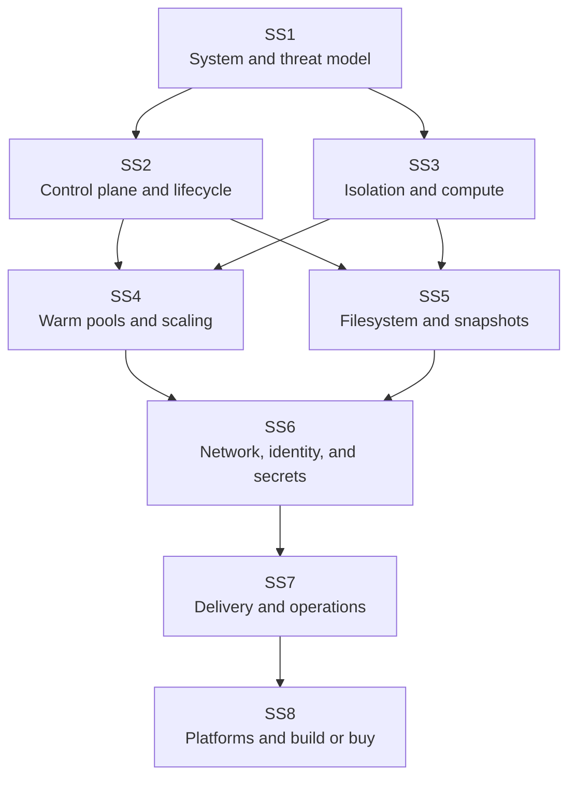
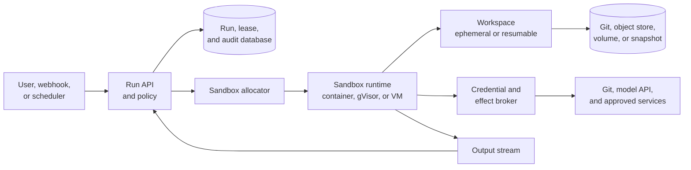

## Scope

How to give an agent or user a real computer without giving that code the host, the control plane, or every company credential. The collection treats a sandbox as a system with an API, an execution boundary, a filesystem, a network, an identity, and a cleanup contract. A container or microVM supplies only part of that system.

The notes use coding agents as the running workload because they exercise nearly every hard case: arbitrary processes, package installation, Git, long-lived shells, browser servers, untrusted repository content, credentials, interactive follow-ups, and state that may need to survive a worker. The same mechanics apply to code interpreters, CI runners, notebook services, browser automation, malware analysis, and per-user development environments.

Examples use fictional names. Product descriptions in SS8 were checked against first-party documentation on July 23, 2026; vendor APIs and product limits change faster than the architectural distinctions in SS1–7.

## How the collection fits together

## Reading path

| Note                                                                                      | What it establishes                                                                                                                                                     |
| ----------------------------------------------------------------------------------------- | ----------------------------------------------------------------------------------------------------------------------------------------------------------------------- |
| [SS1: The sandbox system model](01-sandbox-system-model.md)                               | Separates the host, harness, control plane, data plane, runtime boundary, workspace, and durable records. It begins with threats and ownership rather than a product.   |
| [SS2: Control plane and lifecycle](02-control-plane-and-lifecycle.md)                     | Designs templates, claims, leases, mappings, state transitions, idempotency, and controller reconciliation. Kubernetes Agent Sandbox supplies one concrete API example. |
| [SS3: Isolation and compute](03-isolation-runtimes-and-compute.md)                        | Compares ordinary containers, gVisor, microVMs, Kata Containers, WebAssembly, Kubernetes `RuntimeClass`, EKS nodes, custom images, and Karpenter.                       |
| [SS4: Warm pools, scheduling, and startup](04-warm-pools-scheduling-and-startup.md)       | Decomposes cold-start latency, then joins idle sandbox inventory, Pod scheduling, node autoscaling, image caches, pool sizing, rollout, and disruption.                 |
| [SS5: Filesystems, snapshots, and durability](05-filesystems-snapshots-and-durability.md) | Compares ephemeral disks, EBS, shared filesystems, object mounts, copy-on-write block images, memory snapshots, checkpoints, and stable restore heads.                  |
| [SS6: Network, identity, and secrets](06-network-identity-and-secrets.md)                 | Follows inbound routing, egress enforcement, CNI policy, DNS, metadata endpoints, workload identity, credential brokering, and privileged hooks.                        |
| [SS7: Delivery, observability, and operation](07-delivery-observability-and-operation.md) | Builds images and templates, rolls out capacity, records evidence, handles cancellation and node loss, budgets cost, and upgrades the platform.                         |
| [SS8: Platforms and build or buy](08-platforms-and-build-or-buy.md)                       | Places runtimes, Kubernetes controllers, managed sandboxes, local tools, development workspaces, and workflow engines in the correct layers before comparing them.      |

## The architecture in one picture

The diagram has four different kinds of state. The database owns run and allocation facts. The execution environment owns live processes and memory. The workspace owns current file mutations. External systems own effects such as a pushed branch or posted issue comment. Treating any one of those as “the session” creates recovery bugs.

## Useful background

Read [CI2: Containers and Kubernetes objects](../01-cloud-infrastructure/02-containers-and-kubernetes-objects.md), [CI3: Control planes and reconciliation](../01-cloud-infrastructure/03-control-planes-and-reconciliation.md), and [CI4: Kubernetes networking, storage, and security](../01-cloud-infrastructure/04-kubernetes-networking-storage-security.md) before the Kubernetes-heavy parts of SS2–6. [CI5](../01-cloud-infrastructure/05-scheduling-and-noisy-neighbors.md) and [CI6](../01-cloud-infrastructure/06-eks-and-ecs.md) provide the slower scheduler, Karpenter, and EKS explanations.

For host details, use [LL4: Storage and I/O](../02-low-level-infrastructure/04-storage-and-io.md), [LL5: Linux networking and eBPF](../02-low-level-infrastructure/05-linux-networking-and-ebpf.md), and [LL6: Containers and cgroups](../02-low-level-infrastructure/06-containers-and-cgroups.md). [HE4: Tools, environments, and sandboxes](../05-harness-engineering/04-tools-environments-and-sandboxes.md) explains how execution policy meets tool calls, while [HE5](../05-harness-engineering/05-durable-state-continuity-and-handoffs.md) supplies leases, fencing, checkpoints, and effect reconciliation.

You do not need prior virtualization or kernel-operations experience. SS3 opens those layers from the sandbox designer's point of view.
