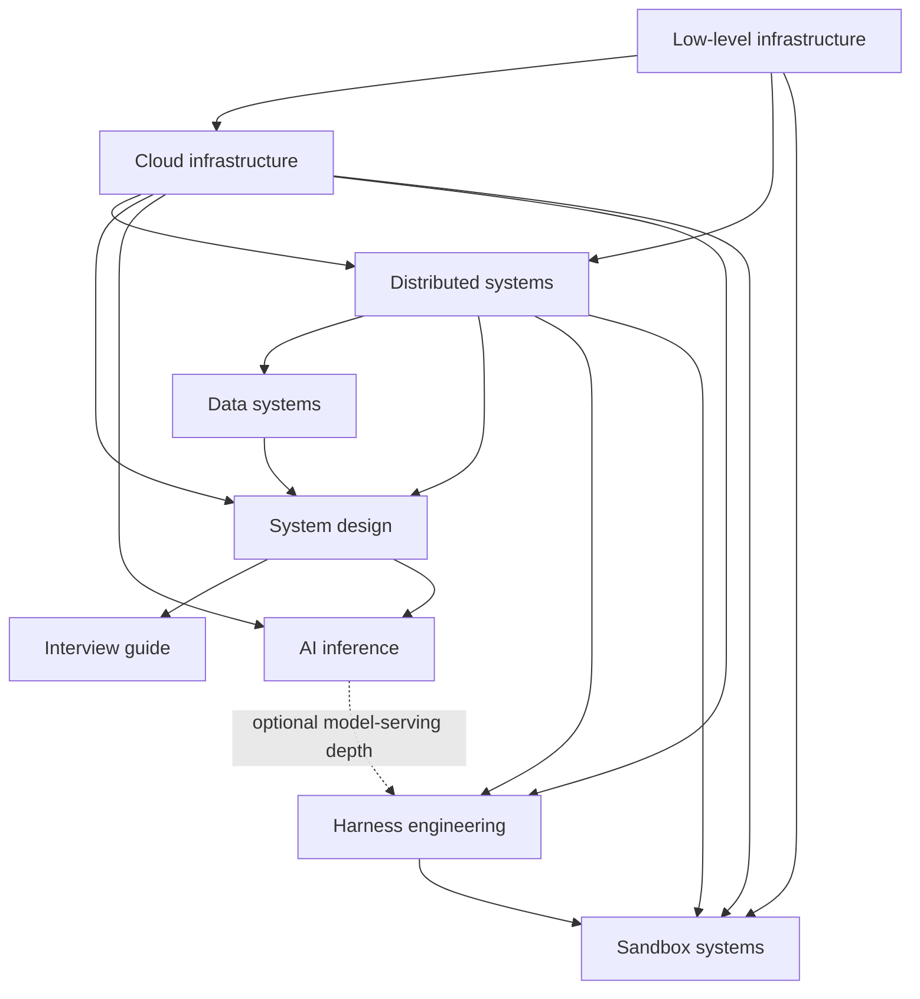

## Reading path

The collection order is intentional. [Cloud infrastructure](01-cloud-infrastructure/INDEX.md) starts with the boundaries around a production application; [low-level infrastructure](02-low-level-infrastructure/INDEX.md) then opens the Linux, hardware, container, and virtual-machine layers hidden beneath those services. [Distributed systems](06-distributed-systems/INDEX.md) adds independent clocks, partial failure, replication, and coordination, and [data systems](07-data-systems/INDEX.md) applies those mechanisms to storage engines and databases.

[System design](03-system-design/INDEX.md) combines the earlier mechanisms into an interview and production-design method. [RStack's System Design Interview Guide](09-system-design-interview-guide/INDEX.md) is a separate practice collection for Hydrocrate interview sessions, critique, and reference designs; it can be consolidated with the main system-design material later. [AI inference infrastructure](04-ai-inference/INDEX.md) specializes the design method for model serving and GPUs, while [harness engineering](05-harness-engineering/INDEX.md) starts at the model boundary and builds the runtime that gives an agent context, tools, durable state, verification, and operating controls. [Sandbox systems](08-sandbox-systems/INDEX.md) joins the cloud, Linux, distributed-state, and harness layers to build isolated computers for agents and untrusted code, then compares open and managed platforms. A reader can start with one specialty; each collection index names the background needed and points to slower explanations when a lower layer matters.

The arrows show useful background, not admission gates. Start with the collection that answers your current question, then follow a dependency arrow backward when a term or failure boundary needs a slower explanation.
